# Архитектура: маркетплейс услуг специалистов в Сербии

- **Статус:** первоначальная архитектура (v0.1)
- **Дата:** 2026-09-26
- **Название продукта:** «Соседи» (латиницей Sosedi) — решение владельца от 2026-09-27; в тот же день единственное число «Сосед» (Sosed) заменено множественным. Одно простое слово на все сценарии: соседи починят, подработают, продадут вещь. Прежнее рабочее название Specialist App больше не используется. Техническое имя в коде и репозитории — `specialist_app`, его не меняем
- **Обновление 2026-09-27:** раздел «Вещи» внесён как план после MVP (решение владельца, [research/08](research/08-goods-marketplace.md), [ADR-0019](adr/0019-goods-section-module-deferred.md))

**Связанные документы**

| Документ | Что в нём |
|---|---|
| [PRODUCT.md](PRODUCT.md) | Продукт, роли, фичи, экраны, user flows |
| [adr/](adr/README.md) | 20 Architecture Decision Records; раздел «Вещи» — [ADR-0019](adr/0019-goods-section-module-deferred.md) (принято, реализация отложена до итерации «Вещи»); паттерны кода — [ADR-0020](adr/0020-code-patterns-and-consistency.md) |
| [DEVELOPMENT_PLAN.md](DEVELOPMENT_PLAN.md) | Пошаговый план разработки: вехи M0–M8, 114 шагов с критериями готовности и командами проверки |
| [OWNER_CHECKLIST.md](OWNER_CHECKLIST.md) | Что нужно от владельца: аккаунты, ключи, решения — по шагам плана |
| [research/](research/README.md) | 8 исследовательских отчётов и лаборатория PostgreSQL; раздел «Вещи» — [research/08](research/08-goods-marketplace.md) |

**Обозначения.** «MVP», «v1», «этап 2» (он же v2) — этапы из [раздела 20](#20-roadmap). «Итерация „Вещи“» — стадии раздела продажи вещей после MVP ([§20.5](#205-итерация-вещи-после-mvp)). Всё, что не подтверждено исследованием, помечено **[Допущение]**. Границы MVP (анонимный запуск без юрлица, платежей и формальных правовых механизмов) — [ADR-0018](adr/0018-mvp-scope-anonymous-no-payments.md).

## Содержание

1. [Executive summary](#1-executive-summary)
2. [Контекст и ограничения](#2-контекст-и-ограничения)
3. [Высокоуровневая схема системы](#3-высокоуровневая-схема-системы)
4. [Выбранный стек](#4-выбранный-стек)
5. [Модульная структура backend](#5-модульная-структура-backend)
6. [Структура репозитория](#6-структура-репозитория)
7. [Модель данных](#7-модель-данных)
8. [API-дизайн](#8-api-дизайн)
9. [Поиск и фильтрация](#9-поиск-и-фильтрация)
10. [Медиа-пайплайн](#10-медиа-пайплайн)
11. [Уведомления и realtime](#11-уведомления-и-realtime)
12. [Фоновые задачи](#12-фоновые-задачи)
13. [Безопасность и защита данных](#13-безопасность-и-защита-данных)
14. [Модерация и trust & safety](#14-модерация-и-trust--safety)
15. [Монетизация](#15-монетизация)
16. [Инфраструктура и DevOps](#16-инфраструктура-и-devops)
17. [Путь в App Store и Google Play](#17-путь-в-app-store-и-google-play)
18. [Масштабирование](#18-масштабирование)
19. [Риски и открытые вопросы](#19-риски-и-открытые-вопросы)
20. [Roadmap](#20-roadmap)

---

## 1. Executive summary

**Что строим.** Двусторонний маркетплейс услуг в Сербии.
- **Каталог специалистов:** профиль, прайс в RSD, портфолио, отзывы.
- **Доска заявок:** клиент публикует потребность, специалисты и люди «на подработке» откликаются, клиент выбирает исполнителя.

**Для кого.** Клиенты на старте — русскоязычные релоканты из Telegram-чатов диаспоры в Белграде и Нови-Саде. Исполнители — русскоязычные специалисты и люди «на подработке», плюс точечно сербские мастера в дефицитных категориях (сантехники, электрики) через concierge. Сербоязычные клиенты — после MVP, по сигналу. Интерфейс с первого дня — ru и sr: исходник сербского — кириллица, латиница генерируется. en — в v1.

**Каналы.** Этап 1 — Telegram-бот и Telegram Mini App; этап 2 — нативные iOS и Android на **том же API**.

**Ключевые решения**

1. **API-first модульный монолит** на Python: 16 модулей (15 доменных + shared kernel `platform`), у каждого своя схема PostgreSQL, фасад и события. После MVP — 17-й, `goods` (п. 14). Telegram — лишь один из клиентов ([ADR-0002](adr/0002-modular-monolith.md), [ADR-0003](adr/0003-api-first-rest-openapi.md)).
2. **Backend.** Python 3.14, FastAPI, SQLAlchemy 2.1 на psycopg 3, Pydantic 2, dishka, aiogram 3.31. Процессы `web`, `bot`, `worker`, `worker-media` собираются в один Docker-образ ([ADR-0004](adr/0004-backend-stack-fastapi-sqlalchemy.md), [ADR-0011](adr/0011-telegram-bot-integration.md)).
3. **Одна СУБД — PostgreSQL 18 + PostGIS 3.6** — для данных, поиска, гео и очереди задач. Лаборатория на синтетике масштаба «год после запуска» показала запас ≈ 10× к ожидаемому пику первого года (с поправкой ×2–4 на облачные vCPU) и 2–5× к проектной ёмкости. Цифры нужно перепроверить на целевой VM ([ADR-0005](adr/0005-postgresql-postgis-data-platform.md)).
4. **Поиск.** Read-model и многоязычная таксономия «термин → категория», FTS со своей конфигурацией `sr_unaccent`, pg_trgm для опечаток, PostGIS для радиуса и районов ([ADR-0006](adr/0006-search-in-postgresql.md)).
5. **Фоновые задачи** на Procrastinate. Очередь живёт в PostgreSQL, задача ставится в той же транзакции, что и бизнес-запись, поэтому таблица задач сама служит transactional outbox ([ADR-0008](adr/0008-background-jobs-and-outbox.md)).
6. **Вход.** Mini App обменивает `initData` на собственные JWT и refresh-токены; модель `users` + `auth_identities` готова к Telegram OIDC, Sign in with Apple и телефону ([ADR-0009](adr/0009-authentication-and-identity.md)).
7. **Общение — гибрид.** Переписка хранится в нашем backend, Telegram-бот служит каналом доставки, контактами стороны обмениваются только с согласия. Топики в личных чатах с ботом не используем: они стоят 15% от продаж за Stars ([ADR-0010](adr/0010-messaging-hybrid-chat.md)).
8. **Медиа.** Клиент загружает файлы в Cloudflare R2 (EU) по presigned URL. Воркер удаляет EXIF, собирает WebP-варианты и перекодирует видео через ffmpeg; раздача через CDN ([ADR-0007](adr/0007-media-storage-and-processing.md)).
9. **Деньги за услуги через платформу не проходят** (требования NBS и налоговая модель). В MVP монетизации и модуля billing нет. Монетизация начинается с v1 после порогов ликвидности: freemium для специалистов, Stars в Telegram, IAP и Play в приложениях, единые entitlements ([ADR-0014](adr/0014-monetization-and-billing.md), [ADR-0017](adr/0017-payments-for-services-outside-platform.md), [ADR-0018](adr/0018-mvp-scope-anonymous-no-payments.md)).
10. **Доверие.**
    - Модерация по риску: правила, omni-moderation, LLM-классификатор нашей политики.
    - Контакты открываются только после договорённости.
    - Отзывы только по сделкам: в MVP оставляет клиент, в v1 — обе стороны, double-blind.
    - Телефон через Telegram — добровольный бейдж.
    - KYC (Didit) — v1 ([ADR-0016](adr/0016-trust-safety-and-reviews.md)).
11. **Инфраструктура.** Hetzner Cloud (Германия): две VM — приложение и self-managed PostgreSQL с pgBackRest. Cloudflare для DNS, WAF, CDN, R2 и статики Mini App. Деплой Kamal 2 через GitHub Actions. На старте ≈ €28 в месяц за инфраструктуру и $0–35 за внешние сервисы ([ADR-0015](adr/0015-hosting-and-deployment.md)).
12. **Фронтенд.** React + Vite, одна сборка для Telegram и браузера; общий TypeScript-core в монорепо, который на этапе 2 переиспользует Expo ([ADR-0012](adr/0012-mini-app-frontend-and-mobile-path.md)).
13. **Границы MVP** ([ADR-0018](adr/0018-mvp-scope-anonymous-no-payments.md)).
    - Запуск анонимный: без юрлица, платежей и юридической обвязки.
    - Модуль billing, KYC и детские категории, формальные раскрытия онлайн-площадки, декларация исполнителя, автоэкспорт данных и «Легальный старт» переносятся в v1. Ничего не удаляется.
    - В MVP остаются правила площадки с галочкой (включая 18+), краткая политика конфиденциальности, удаление аккаунта, вся модерация и антискам.
14. **Раздел «Вещи» — после MVP, итерация «Вещи»** (решение владельца 2026-09-27, [ADR-0019](adr/0019-goods-section-module-deferred.md)).
    - Продажа б/у и прочих вещей частными лицами — третья часть единого приложения: мастера, заявки и подработка, вещи. Цель — дать СНГ-аудитории из Telegram-чатов удобный способ перенести барахолки из чатов в приложение. Это не конкурент KupujemProdajem за сербов и не отдельный продукт.
    - В MVP — только сегмент «Услуги / Вещи» на Главной и экран-заглушка S58 «Вещи — скоро» с opt-in (≤ 0,25 pw). Дальше — стадии по точкам решения ([§20.5](#205-итерация-вещи-после-mvp)).
    - Архитектурно — модуль `goods` монолита (17-й модуль, 16-й доменный), готовый к выделению, а не микросервис ([§5.8](#58-модуль-goods-после-mvp-итерация-вещи), [research/08 §6](research/08-goods-marketplace.md#6-архитектура-модуль-или-микросервис)).

---

## 2. Контекст и ограничения

### 2.1. Бизнес-контекст

- **Две стороны.** Клиенты ищут специалиста или публикуют заявку. Исполнители — специалисты (`pro`) и люди «на подработке» (`casual`); они ведут профиль, откликаются на заявки и получают отзывы. Подробно — в [PRODUCT.md](PRODUCT.md).
- **Рынок узкий.**
  - У граждан РФ на конец 2025 года — 54 917 действующих ВНЖ и 7 032 ПМЖ; всего русскоязычных ≈ 80 тыс. **[Допущение]**.
  - Приток падает: 24 тыс. первичных ВНЖ в 2023 году против 9 тыс. в 2025-м.
  - Распределение: Белград — 62%, Нови-Сад — 23% притока ([research/01](research/01-competitors-and-market.md#31-численность)).
- **Фокус MVP** (решение владельца). Клиенты — русскоязычные релоканты из Telegram-чатов, где сейчас и живёт спрос на услуги. Исполнители — русскоязычные специалисты и «подработка» плюс точечно сербские мастера в дефицитных категориях через concierge. Сербоязычные клиенты — после MVP, по сигналу (веб-вход по телефону). Архитектура мультиязычности от этого не меняется: она дешёвая и нужна для межъязыкового поиска.
- **Конкуренты в сегменте.** Главный — сами Telegram-чаты диаспоры: бесплатно и быстро, но без структуры и доверия. Поверх чатов уже работают WOM (Mini App-каталог, с 22.09.2026), Poisk.rs (каталог и сеть из ~24 чатов), «Говорун» (AI-лиды из чатов). Рядом — MostApp (managed «мастер на час» с русским интерфейсом). Структурированной доски заявок с бюджетом в RSD нет ни у кого ([research/01 §3.7](research/01-competitors-and-market.md#37-боты-каталоги-и-mini-apps-для-релокантов-в-сербии)). Админы чатов зарабатывают на рекламе специалистов, поэтому это одновременно канал и привратник ([§19.1](#191-риски)).
- **Правовые рамки** ([research/05](research/05-legal-and-payments-serbia.md)):
  - ZZPL (аналог GDPR);
  - новый Zakon o zaštiti potrošača 35/2026 — обязанности онлайн-площадки;
  - Zakon o elektronskoj trgovini — notice-and-takedown за 2 рабочих дня;
  - валютный контроль — только RSD;
  - лицензирование платёжных услуг NBS.

### 2.2. Жёсткие вводные

| Вводная | Как учтено |
|---|---|
| Backend на Python | Python 3.14, FastAPI, aiogram ([§4](#4-выбранный-стек)) |
| PostgreSQL обязателен | PostgreSQL 18 + PostGIS — единственная СУБД ([ADR-0005](adr/0005-postgresql-postgis-data-platform.md)) |
| API-first; Telegram — один из клиентов; мобильное приложение без переписывания backend | REST + OpenAPI, бот — адаптер к application services, модель идентичности с несколькими провайдерами ([§8](#8-api-дизайн), [§17](#17-путь-в-app-store-и-google-play)) |
| Мультиязычность: ru, sr (Latn и Cyrl), желательно en | В MVP — ru, sr-Cyrl (исходник) и sr-Latn (генерируется); en — v1. Справочники в JSONB, поиск поперёк языков ([ADR-0013](adr/0013-i18n-multilingual-content.md)) |
| Команда 1–2 Python-разработчика, бюджет стартапа | Модульный монолит, минимум инфраструктуры (одна СУБД, очередь в ней), managed-сервисы для второстепенного. Инфраструктура ≈ €28/мес + $0–35/мес на внешние сервисы |

### 2.3. Ожидаемая нагрузка

Прогноз — **[Допущение]**. Проектная ёмкость — запас, на который рассчитана архитектура без переделки.

| Метрика | Старт (0–3 мес) | Через 12 мес (цель) | Проектная ёмкость |
|---|---|---|---|
| Зарегистрированные пользователи | 3–5 тыс. | 30–50 тыс. | 200 тыс. |
| MAU | 2–4 тыс. | 15–30 тыс. | 100 тыс. |
| Профили исполнителей (из них активных) | 200–500 (100–300) | 3–5 тыс. (1–2 тыс.) | 50 тыс. |
| Новые заявки в день | 10–50 | 200–500 | 3–5 тыс. |
| Отклики в день | 50–250 | 1–3 тыс. | 20 тыс. |
| Пиковый RPS API | 5–10 | 30–60 | ≥ 300 |
| Сообщения бота в день | 1–5 тыс. | 30–100 тыс. | ~1 млн (потолок Telegram ≈30 msg/s) |
| Объём медиа | 5–20 GB | 200–500 GB | 5 TB |
| Размер БД | < 1 GB | 2–5 GB | 50 GB |

**Как это соотносится с лабораторией.** На данных масштаба «50k специалистов, 300k заявок» смешанная нагрузка на 4 ядрах дала ≈ 2 800 TPS при p95 9 мс ([research/07 §2.7](research/07-postgres-lab-and-infra.md#27-производительность-a6)). С поправкой ×2–4 на облачные vCPU это ≈ 700–1 400 TPS.
- Одна транзакция pgbench — один SQL-запрос, а не API-вызов.
- База в лаборатории целиком помещалась в память.
- Запас ≈ 10× к ожидаемому пику первого года (≈ 35 RPS по оценке исследования) и 2–5× к проектной ёмкости.
- Перед запуском перепроверить на целевой VM. Узкие места лежат не в БД, а во внешних лимитах: скорость рассылки Telegram, модерация людьми ([§18](#18-масштабирование)).

### 2.4. Нефункциональные требования (SLO)

| Атрибут | Требование на MVP | Цель на v1 и этапе 2 |
|---|---|---|
| Доступность API (месяц) | 99,5% (одна VM приложения) | 99,9% (2+ реплики, реплика БД) |
| Латентность API на сервере | p95 < 150 мс, p99 < 400 мс | То же при 10× нагрузке |
| Поиск в каталоге (сервер) | p95 < 200 мс | p95 < 150 мс |
| Задержка уведомления о новой заявке | p95 < 2 мин от публикации | p95 < 60 с |
| Лаг read-model поиска | p95 < 10 с | p95 < 5 с |
| Холодный старт Mini App (до интерактива, 4G) | < 2,5 с | < 1,5 с |
| RPO / RTO | ≤ 5 мин / ≤ 2 ч | ≤ 1 мин / ≤ 1 ч |
| Безопасность | OWASP ASVS L2 для API, шифрование at rest и in transit, 2FA для персонала | Регулярный внешний pentest |
| Персональные данные | MVP ([ADR-0018](adr/0018-mvp-scope-anonymous-no-payments.md)): минимизация, краткая политика конфиденциальности, удаление по запросу, шифрование, журналы доступа | v1: полный набор ZZPL — ROPA, реестр согласий, права субъектов за 30 дней, утечки — 72 ч; далее DPIA |
| Локализация | ru, sr-Cyrl (исходник), sr-Latn (генерируется; в Mini App — при загрузке той же транслитерацией). В первом экране Mini App — русский целиком (запасной язык) и общий неймспейс сербского; остальной сербский — отдельным чанком до первого кадра (4.8) | + en (v1), uk по спросу |
| Доступность UI | Touch targets ≥ 44 pt, подписи у полей, контраст по WCAG 2.2 AA | Аудит по WCAG 2.2 AA |
| Сопровождаемость | 1–2 разработчика; границы модулей проверяются в CI; покрытие domain/application ≥ 80% | — |
| Стоимость инфраструктуры | ≈ €28/мес + $0–35/мес на внешние сервисы (бесплатные тарифы SaaS) | ≈ €61–67 + $75–160 в месяц через год; до €138 с dedicated vCPU для БД ([§16.6](#166-стоимость)) |

---

## 3. Высокоуровневая схема системы

Диаграммы нарисованы в нотации C4 (уровни Context и Container). Цвета — стандартные цвета C4:

| Цвет | Что обозначает |
|---|---|
| Тёмно-синий | Люди |
| Синий | Наша система и её контейнеры |
| Серый | Внешние системы |
| Пунктир | Этап 2 |

Используем `flowchart`, а не экспериментальный `C4Context`: в нём подписи связей накладываются друг на друга.

### 3.1. C4 Level 1: System Context

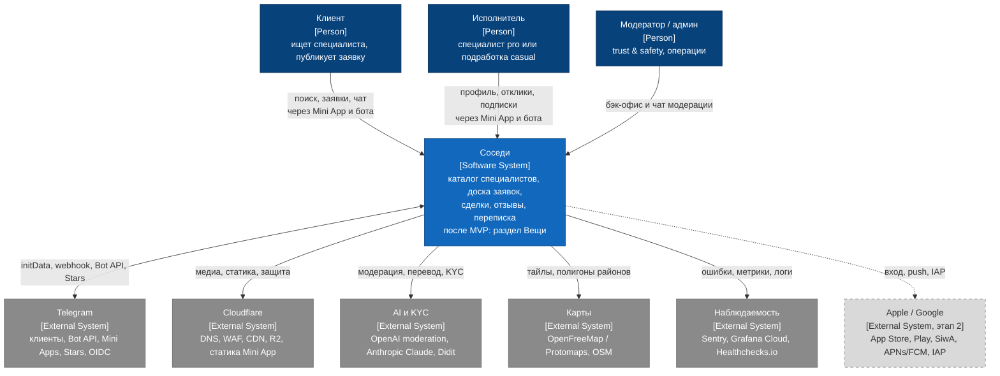

### 3.2. C4 Level 2: Container

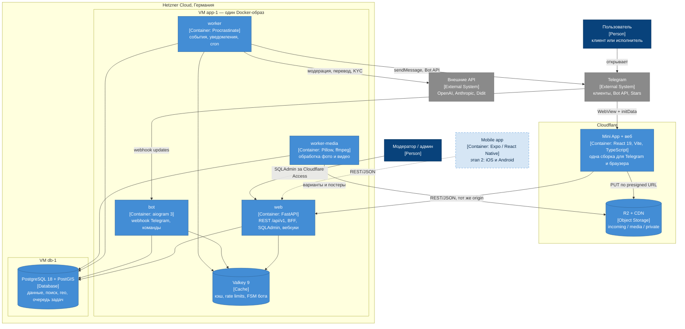

### 3.3. Ключевые потоки

- **Вход и работа в Mini App.** Telegram открывает `app.<domain>` с `initData` → `POST /api/v1/auth/telegram` → собственные токены → REST-запросы идут на `app.<domain>/api/*`; Cloudflare проксирует их на `web`.
- **Публикация заявки.** `web` в одной транзакции сохраняет заявку и ставит задачи подписчиков события `JobPublished` → `worker` матчит подписки и ставит уведомления → `worker` отправляет сообщения через Bot API с учётом лимитов → исполнитель открывает заявку по deep link.
- **Медиа.** Клиент загружает файл в R2 по presigned URL → `web` проверяет загрузку (`HEAD`) → `worker-media` удаляет EXIF, собирает варианты и запускает модерацию → раздача через `cdn.<domain>`.
- **Модерация.** Автопроверки в `worker` → очередь `moderation.cases` → карточка в Telegram-чат модераторов (кнопки) или SQLAdmin → решение, санкции, statement of reasons пользователю через бота.
- **Раздел «Вещи» (после MVP, итерация «Вещи»).** Новых контейнеров нет: модуль `goods` работает в тех же `web`, `bot`, `worker`, `worker-media` и в той же PostgreSQL (схема `goods`). Своё у него — очереди `goods`, `media_goods`, `notifications_bulk` и пул чтения `app_goods_read`. Роль Kamal `web-goods` и Typesense появляются только по триггерам [§18.3](#183-раздел-вещи-дешёвые-меры-и-триггеры-выделения-после-mvp-итерация-вещи). Целевая схема развёртывания — [research/08 §6.6](research/08-goods-marketplace.md#66-целевая-схема).

---

## 4. Выбранный стек

Версии проверены по PyPI, npm и официальным источникам на 2026-09-26 ([research/03](research/03-backend-stack.md), [research/04](research/04-frontend-and-mobile.md), [research/07](research/07-postgres-lab-and-infra.md)).

| Слой | Выбор | Почему | Отвергнуто |
|---|---|---|---|
| Язык и runtime | **Python 3.14.x** (≥ 3.14.5) | Bugfix-ветка примерно до 2027-10 **[Допущение]**; есть колёса всех ключевых пакетов; `uuid.uuid7()` в stdlib | 3.13 (bugfix заканчивается), 3.15 (GA 2026-10-01 — рано) |
| HTTP API | **FastAPI 0.141** (`~=0.141.1`), Starlette 1.7, **Uvicorn 0.54** | Async-first вместе с aiogram и воркерами; OpenAPI из type hints; экосистема; FastAPI Team — 7 человек | Litestar 2.x (v3 на подходе, мало мейнтейнеров), Django 6.1 + DRF/Ninja (нет async-транзакций, два стиля кода) |
| Валидация, настройки | **Pydantic 2.13**, pydantic-settings 2.15 | Стандарт FastAPI; потолок 2.13 задаёт aiogram | msgspec |
| ORM, миграции | **SQLAlchemy 2.1** `[asyncio]`, **psycopg 3.3**, **Alembic 1.20**, GeoAlchemy2 0.20 | Зрелый async; psycopg 3 нужен для транзакционной постановки задач | SQLModel, Tortoise, Django ORM; asyncpg (нет транзакционной постановки в Procrastinate) |
| DI | **dishka 1.10** | Один контейнер на API, бота и воркер | Только `Depends` (работает лишь в HTTP) |
| Telegram-бот | **aiogram 3.31** (Bot API 10.3) | Быстрее всех догоняет Bot API, async, FSM в Valkey | python-telegram-bot 22.8 (отстаёт на 3 версии Bot API) |
| СУБД | **PostgreSQL 18.6 + PostGIS 3.6.4**; pg_trgm, unaccent, btree_gin/gist | Вводная; FTS, гео и очередь в одной БД; проверено лабораторией | PG 19 (beta) |
| Фоновые задачи | **Procrastinate 3.10** | Очередь в PostgreSQL, постановка в транзакции (outbox «из коробки»), cron с HA | Taskiq (запасной вариант), Celery (нет asyncio), arq (maintenance-only) |
| Кэш, лимиты, FSM | **Valkey 9.1** + redis-py 7.4, `limits` 5.8 | BSD-3, Linux Foundation | Redis 8 (RSAL/SSPL/AGPL) |
| Поиск | **PostgreSQL FTS + pg_trgm + таксономия** | Достаточно по замерам; межъязычный поиск через таксономию | Meilisearch / Typesense — по триггерам из [ADR-0006](adr/0006-search-in-postgresql.md) |
| Объектное хранилище | **Cloudflare R2** (EU) + CDN; локально **Garage 2.4** | Бесплатный egress, PoP в Белграде | Hetzner Object Storage (нет custom domains), AWS S3 (egress), MinIO (прекращён) |
| Обработка медиа | **Pillow 12.3 + pillow-heif 1.8**, **ffmpeg 9.0**; позже imgproxy 4 | Просто, без отдельных сервисов | Cloudflare Images, managed-видео — позже |
| Аутентификация | **PyJWT 2.15**, joserfc 1.7, authlib 1.8, pwdlib[argon2] | JWT, JWKS и OIDC (Telegram, Apple) | python-jose, passlib (не развиваются) |
| Админка | **SQLAdmin 0.32** + чат модераторов в Telegram | Внутри FastAPI, async | Django admin (вторая ORM) |
| i18n | Backend: **Babel 2.18 + gettext**; фронт: **i18next 26** | Общие каталоги для API и бота; ICU MessageFormat | Fluent (стагнирует) |
| Модерация и KYC | **OpenAI omni-moderation** (бесплатно), **Claude Haiku 4.5** (классификатор политики, Must в MVP), **Didit** (KYC, v1) | Меньше $20/мес на автоматику; Didit — 500 KYC/мес бесплатно | Sightengine, Hive, Sumsub/Veriff (дороже) |
| Mini App | **React 19, TypeScript 6.0, Vite 8, @tma.js/sdk-react 3**, TanStack Router + Query, **orval 8** (клиент из OpenAPI), React Hook Form + Zod 4, Zustand 5, Tailwind 4 | Путь к React Native; нативный для Telegram вид; типобезопасный клиент | Vue/Svelte (путь в стор только через Capacitor), TelegramUI (не обновляется) |
| Хостинг статики | **Cloudflare Workers Static Assets** | Бесплатно, тот же edge, что для API и медиа | Vercel Hobby (некоммерческое использование) |
| Монорепо фронта | **pnpm 12 + Turborepo 2** | Общие пакеты для Mini App и Expo | Nx |
| Мобильный клиент (этап 2) | **Expo SDK 57** (58 после релиза; RN), Expo Router, EAS, expo-iap или RevenueCat | Переиспользует `packages/*` | Flutter (ноль переиспользования), Capacitor (риск 4.2) |
| Наблюдаемость | **Sentry** (или GlitchTip), **structlog**, **prometheus-client** → Grafana Cloud (Alloy); OpenTelemetry — вторым шагом; UptimeRobot + Healthchecks.io | Бесплатные тарифы на старте | Self-hosted Sentry (16 GB RAM), self-hosted Prometheus на тех же VM |
| Тесты и качество | pytest 9, testcontainers 4.15, schemathesis 4.28, ruff 0.16, mypy 2.3, import-linter 2.15; Vitest, Playwright | Реальный PostGIS в тестах; контрактные тесты по OpenAPI; проверка границ модулей | SQLite в тестах |
| Инфраструктура | **Hetzner Cloud** (CX33 ×2, nbg1/fsn1), **Cloudflare**, **Kamal 2**, GitHub Actions + GHCR, SOPS + age, pgBackRest → Hetzner Object Storage + Backblaze B2, Terraform | Дёшево, EU, без lock-in, zero-downtime деплой | DigitalOcean managed (в 1,2–3 раза дороже), k3s (избыточно), Coolify/Dokploy (уязвимости) |
| Продуктовая аналитика | Серверные события → PostHog EU; клиентский SDK — только после согласия | Согласие обязательно по ст. 160 ZEK | Сторонние трекеры с идентификаторами устройства |

---

## 5. Модульная структура backend

### 5.1. Почему модульный монолит, а не микросервисы

| Фактор | Модульный монолит | Микросервисы |
|---|---|---|
| Команда 1–2 разработчика | Один репозиторий, один деплой, одна отладка | Налог на инфраструктуру (N пайплайнов, трассировка, контракты между сервисами) съедает команду |
| Неопределённость домена | Границы модулей дёшево двигать: это рефакторинг в одном коде | Ошибка в границах = распределённая миграция данных и API |
| Согласованность (заявка → отклик → сделка → отзыв) | Одна транзакция PostgreSQL там, где нужен инвариант | Саги и компенсации даже для простых сценариев |
| Нагрузка (раздел 2) | Сотни RPS на пике — 2–4 процесса API справляются | Масштабирование по сервисам не нужно ещё минимум 1–2 года |
| Стоимость | 1–2 VM + PostgreSQL | Больше узлов, брокер, оркестратор |
| Путь роста | Границы подготовлены: schema-per-module, фасады, события через outbox | — |

Решение — [ADR-0002](adr/0002-modular-monolith.md). Микросервисы — не цель: модуль выделяется в сервис только при измеримой причине (нагрузка, независимый релизный цикл, изоляция комплаенса).

### 5.2. Правила модульности

1. **Модуль = bounded context.** У модуля своя схема PostgreSQL (`identity.*`, `jobs.*`, …), свой пакет в коде и свой публичный контракт.
2. **Публичный контракт модуля** — фасад `<module>/api.py` (команды и запросы с DTO на входе и выходе). Импортировать внутренности чужого модуля (`domain`, `infrastructure`, ORM-модели) запрещено; это проверяет линтер архитектуры в CI (`import-linter` или `tach`).
3. **Синхронные вызовы фасадов — только «вниз» по DAG** (рисунок 5.4). Вызов может идти в той же транзакции, если инвариант требует атомарности. Пример: принятие отклика в `jobs` атомарно создаёт сделку через фасад `deals`.
4. **Внешние ключи между схемами — только «вниз» по DAG.** Ссылку «вверх» хранят как UUID без FK вместе со снимком нужных полей. Пример: `deals.deals.job_id` + `title_snapshot`. Исключение — справочники `geo.*` и `catalog.*`: это «листья» DAG без собственной логики, поэтому ссылаться на них по FK может любой модуль, например `identity.users.home_city_id`.
5. **Доменные события — в любую сторону**, но через общий пакет контрактов `platform/contracts/events` (published language с версией схемы). Модули не импортируют друг у друга классы событий, поэтому подписка «снизу вверх» не создаёт цикла импортов.
6. **Изменяет данные только модуль-владелец.** Побочные эффекты в других модулях — через события (асинхронно, [ADR-0008](adr/0008-background-jobs-and-outbox.md)) или через вызов фасада нижележащего модуля. Событие ставит задачи подписчиков в очередь Procrastinate в той же транзакции, поэтому таблица задач сама служит outbox.
7. **Композитные экраны** (карточка специалиста = профиль + прайс + портфолио + рейтинг + бейджи) собирает интерфейсный слой (BFF-роутеры `interfaces/http/views`, которым разрешено вызывать фасады любых модулей) или read-model модуля `search`.
8. **Интерфейсы** (HTTP API, admin, Telegram-бот, воркеры) не содержат бизнес-логики: они валидируют вход, достают контекст пользователя и вызывают application-сервисы модулей.

### 5.3. Каталог модулей

| Модуль (схема) | Ответственность | Ключевые сущности | Публикует события | Вызывает фасады |
|---|---|---|---|---|
| `platform` (shared kernel) | Общие типы (`Money`, `LocalizedText`, `GeoPoint`); порт очереди `JobQueue` и диспетчер событий; idempotency; audit log; feature flags; client config; i18n и транслитерация; контракты событий | `idempotency_keys`, `audit_log`, `client_config`, `translations` | — | — |
| `identity` (users/auth) | Пользователи, способы входа (Telegram сейчас; Apple, Google, телефон позже), сессии, роли персонала, согласия, ограничения, блокировки между пользователями, удаление аккаунта, уровни доверия | `users`, `auth_identities`, `sessions`, `user_roles`, `consents`, `restrictions`, `user_blocks`, `deletion_requests` | `UserRegistered`, `UserUpdated`, `PhoneVerified`, `UserRestricted`, `UserDeleted` | geo |
| `geo` | Города, районы (полигоны), определение района по точке, геокодинг | `cities`, `districts` | — | — |
| `catalog` | Дерево категорий, теги, многоязычный словарь поисковых терминов и синонимов | `categories`, `tags`, `search_terms` | `CatalogChanged` | — |
| `media` | Загрузка по presigned URL, обработка (варианты изображений, транскодинг видео), автоматическая проверка контента, жизненный цикл файлов | `assets` | `MediaReady`, `MediaRejected` | identity |
| `billing` (payments/billing) | Продукты и цены по каналам (Stars / IAP / карты), покупки, подписки, entitlements (права и квоты), продвижение, леджер | `products`, `prices`, `purchases`, `subscriptions`, `entitlements`, `promotions`, `ledger_entries` | `PurchaseCompleted`, `SubscriptionChanged`, `EntitlementGranted`, `PromotionChanged` | identity |
| `specialists` | Профиль исполнителя (`pro` — специалист в каталоге; `casual` — «подработка»), категории, зоны работы, доступность, портфолио, контакты | `profiles`, `profile_categories`, `service_areas`, `working_hours`, `portfolio_items`, `portfolio_media` | `ProfileSubmitted`, `ProfilePublished`, `ProfileUpdated`, `ProfileHidden`, `AvailabilityChanged` | identity, geo, catalog, media |
| `pricing` (services/pricing) | Прайс-лист специалиста, нормализация цен, ценовые ориентиры по категориям и городам | `services`, `price_benchmarks` | `PriceListChanged` | specialists, catalog |
| `deals` | Сделка — факт договорённости «клиент ↔ исполнитель» (из отклика, из каталога или чата), подтверждение выполнения, отмена, спор | `deals`, `status_history` | `DealAgreed`, `DealCompleted`, `DealCancelled`, `DealDisputed` | identity, specialists |
| `jobs` (job board + responses) | Заявки и их state machine, отклики, подписки на новые заявки, скрытие и сохранение заявок в ленте | `jobs`, `job_media`, `responses`, `alerts`, `hidden_jobs`, `saved_jobs`, `status_history` | `JobSubmitted`, `JobPublished`, `JobUpdated`, `JobClosed`, `JobExpired`, `ResponseSubmitted`, `ResponseAccepted`, `ResponseDeclined` | identity, geo, catalog, media, specialists, deals, billing |
| `messaging` (chat) | Диалоги по откликам и прямым обращениям, сообщения, прочтения, обмен контактами, relay в Telegram | `conversations`, `participants`, `messages`, `contact_shares` | `ConversationStarted`, `MessageSent`, `ContactShared` | identity, media, jobs, deals |
| `reviews` | Отзывы по сделкам (double-blind), ответы, агрегаты рейтинга | `reviews`, `review_media`, `rating_aggregates` | `ReviewPublished`, `ReviewRemoved`, `RatingChanged` | identity, deals, specialists, media |
| `search` | Read-model каталога специалистов, разбор запроса, ранжирование, автодополнение, журнал запросов | `specialist_index`, `specialist_category_prices`, `query_log` | — | catalog, geo, specialists, pricing, reviews, billing |
| `growth` | Реферальные коды, атрибуция по `startapp` и UTM, ссылки для шаринга, награды | `referral_codes`, `attributions`, `referral_rewards` | `ReferralQualified` | identity, billing |
| `notifications` | Каналы доставки (Telegram; позже APNs/FCM), предпочтения, центр уведомлений, рассылки с учётом rate limits и тихих часов | `channels`, `preferences`, `notifications`, `deliveries` | `NotificationDelivered` | identity, jobs, deals, messaging, reviews (для рендеринга) |
| `moderation` (trust & safety) | Жалобы, очереди модерации, решения, санкции (через `identity.restrictions`), верификация, контент-правила, сигналы риска | `reports`, `cases`, `verification_requests`, `content_rules`, `risk_signals` | `ReportCreated`, `ModerationDecisionMade`, `VerificationDecided` | identity, media, specialists, jobs, messaging, reviews |
| `goods` (после MVP, итерация «Вещи») | Раздел «Вещи»: объявления частных лиц о продаже и «отдам даром», фото, бронь и продажа, избранное, сохранённые поиски; в стадии «Раздел» — read-model выдачи и счётчики фасетов. Подробно — [§5.8](#58-модуль-goods-после-mvp-итерация-вещи) | `listings`, `listing_media`, `sales`, `favorites`, `saved_searches`, `status_history`; в стадии «Раздел» — `listing_index`, `facet_counts` | События объявления и продажи (имена — в новом ADR перед пилотом «Вещи-lite», см. [ADR-0019](adr/0019-goods-section-module-deferred.md#когда-пересматривать), «Когда пересматривать») | identity, geo, catalog, media; billing — после юрлица |
| `admin` (интерфейс) | Бэк-офис: модерация, пользователи, справочники, аудит. Не доменный модуль | — | — | все |

**Почему `responses` не отдельный модуль.** State machine отклика и заявки жёстко связаны. Выбор исполнителя одновременно переводит заявку в `assigned`, выбранный отклик — в `accepted`, остальные — в `not_selected`. Лимит откликов на заявку тоже должен проверяться атомарно. Раздельные модули потребовали бы распределённой координации внутри одного бизнес-действия. Поэтому отклики — подагрегат модуля `jobs` со своим пакетом `jobs/responses`.

**Почему `deals` выделен, хотя его не было в исходном списке.** Сделка возникает не только на доске заявок, но и из каталога («написал специалисту → договорились»). На сделку опираются проверенные отзывы, споры, метрика fill rate и в будущем платежи. Это самостоятельный агрегат со своим жизненным циклом. `deals` стоит в DAG ниже `jobs` и `messaging`: оба вызывают его фасад, а ссылки на заявку и отклик хранятся в сделке как UUID со снимком заголовка.

**Кто владеет «бейджами».** Подтверждённый телефон и проверенный документ — атрибуты пользователя в `identity`: их записывает `moderation` через фасад `identity`. Проверенная регистрация бизнеса и лицензия — атрибуты профиля в `specialists`. Рейтинг — `reviews.rating_aggregates`. Карточка в каталоге берёт всё это из read-model `search.specialist_index`, которая строится по событиям.

### 5.4. Граф зависимостей модулей

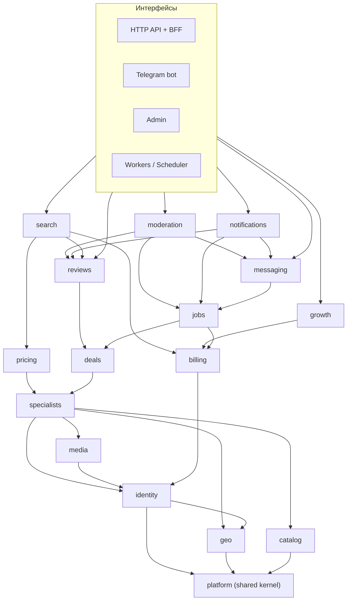

Стрелка — разрешённый вызов фасада и разрешённый FK (транзитивные связи опущены: например, `jobs` вызывает и `media`, и `specialists`). События ходят через `platform/contracts` в любую сторону и на схеме не показаны. `notifications` и `moderation` стоят над контентными модулями: они читают их через фасады и реагируют на события, а контентные модули о них не знают. Проверку «может ли пользователь публиковать» контентные модули делают через `identity.restrictions`, куда ограничения записывает `moderation`. Поэтому цикла `jobs ↔ moderation` нет.

После MVP в граф добавляется `goods` на уровне `specialists`, без зависимостей от `jobs`, `deals`, `specialists`, `pricing` и `search` ([§5.8](#58-модуль-goods-после-mvp-итерация-вещи)). Схема выше показывает MVP и не меняется.

### 5.5. Внутреннее устройство модуля

```text
modules/jobs/
├── api.py              # фасад: команды/запросы для других модулей (DTO на входе и выходе)
├── domain/             # сущности, value objects, state machine, политики — чистый Python без I/O
├── application/        # use cases: create_job, publish_job, submit_response, accept_response …
├── infrastructure/     # ORM-модели, репозитории, SQL-запросы, адаптеры внешних сервисов
├── http/               # роутеры публичного REST API и схемы запросов/ответов модуля
├── bot/                # хендлеры Telegram-бота, относящиеся к модулю (если есть)
├── admin/              # представления бэк-офиса (если нужны)
├── tasks.py            # фоновые задачи модуля (истечение заявок, матчинг подписок)
└── tests/
```

Слоистость прагматичная. Модули с богатой логикой (`jobs`, `deals`, `reviews`, `billing`, `moderation`) используют все слои. Справочные модули (`geo`, `catalog`) живут в «тонком» варианте: запросы прямо из application-слоя, без отдельного domain.

> **Уточнено [ADR-0020](adr/0020-code-patterns-and-consistency.md) (2026-09-27).** Структура папок одинакова во всех модулях: `api.py`, `errors.py`, `di.py`, `domain/`, `application/`, `infrastructure/`, входные адаптеры по необходимости, `tests/`. У «тонких» модулей в `domain/` только перечисления и value objects, чтение — через query-сервис, репозиториев нет. Сводка правил — [§5.9](#59-паттерны-кода-и-единообразие).

### 5.6. Как модули будут выделяться позже

Шов для выделения уже есть: фасад (синхронный контракт) и события (асинхронный контракт). Порядок выделения модуля в сервис:

1. Схему модуля переносим в отдельную БД. Это несложно: FK из других схем идут только в разрешённом направлении.
2. Реализацию фасада подменяем HTTP/gRPC-клиентом с тем же интерфейсом.
3. События для выделенного сервиса начинают публиковаться в брокер (NATS JetStream, RabbitMQ или Kafka) через адаптер `JobQueue`/outbox вместо внутренней очереди задач.

Вероятные кандидаты и триггеры:

| Кандидат | Когда выделять |
|---|---|
| `notifications` | Fan-out рассылок упирается в лимиты и мешает API |
| `media` (processing) | Транскодинг видео съедает CPU |
| `search` | Нужен отдельный движок (Meilisearch/Typesense) |
| `messaging` | Тысячи постоянных realtime-соединений |
| `billing` | Изоляция платёжного комплаенса |
| `goods` (после MVP, итерация «Вещи») | Отдельная команда или отдельный продукт (H1, H2), либо шумный сосед и инциденты (M1, M4) после дешёвых мер — [§18.3](#183-раздел-вещи-дешёвые-меры-и-триггеры-выделения-после-mvp-итерация-вещи) |

### 5.7. Точки входа (процессы)

Все процессы запускаются из одного Docker-образа, отличается только entrypoint ([ADR-0004](adr/0004-backend-stack-fastapi-sqlalchemy.md), [ADR-0011](adr/0011-telegram-bot-integration.md)).

| Процесс | Что делает | Масштабирование |
|---|---|---|
| `web` | FastAPI: публичный REST API `/api/v1`, BFF-эндпоинты, admin API и SQLAdmin (`/admin`), вебхуки платёжных каналов, realtime (v1) | Горизонтально, stateless |
| `bot` | aiogram: приём webhook от Telegram (`secret_token`), хендлеры вызывают application services in-process | 1–2 экземпляра |
| `worker` | Procrastinate: очереди `default` (обработчики событий, read-model, модерация) и `notifications` (fan-out и отправка в Telegram с глобальным rate limiter), периодические задачи (`@periodic` с HA — отдельный scheduler не нужен) | По очередям |
| `worker-media` | Procrastinate: очередь `media` (Pillow, ffmpeg) с лимитами CPU и памяти. ffmpeg добавляет к образу ≈ 390 MB: пока образ общий для всех ролей; отдельный образ `worker-media` — если размер начнёт мешать деплою | Отдельно, при росте — на своей VM |

После MVP (итерация «Вещи») процессов не прибавляется: `worker` берёт ещё очереди `goods` и `notifications_bulk`, `worker-media` — очередь `media_goods`. Роль Kamal `web-goods` из того же образа — только по мере M1a ([§18.3](#183-раздел-вещи-дешёвые-меры-и-триггеры-выделения-после-mvp-итерация-вещи)).

### 5.8. Модуль goods (после MVP, итерация «Вещи»)

**Статус:** план, не MVP. Модуль пишется в итерации «Вещи», начиная с «Вещей-0» ([§20.5](#205-итерация-вещи-после-mvp)). Решение «модуль, а не сервис» — [ADR-0019](adr/0019-goods-section-module-deferred.md) (принято, реализация отложена до итерации «Вещи»). Обоснование, альтернативы и противоречия потоков — [research/08 §6](research/08-goods-marketplace.md#6-архитектура-модуль-или-микросервис).

**Почему модуль, а не микросервис** ([research/08 §6.2–6.3](research/08-goods-marketplace.md#62-сравнение-модуль-монолита-против-микросервиса)):
- микросервис стоит +5,5–16 pw единовременно и 10–20% ёмкости команды постоянно;
- самые узкие общие ресурсы — бот, лимит рассылки, Main Mini App, вход и модераторы — он всё равно не разделяет;
- объёмы на 2–3 порядка ниже порогов выноса, ключевые инварианты (бронь, решение модерации, удаление аккаунта) держатся одной транзакцией;
- у раздела тонкий собственный домен и толстые зависимости: больше 12 возможностей берутся у ядра.

**Правила модуля** ([research/08 §6.4](research/08-goods-marketplace.md#64-рекомендация-модуль-goods-готовый-к-выделению)), ≈ 0,5–1 pw сверх обычного модуля:

| Правило | Что фиксируем |
|---|---|
| Граница данных | Схема `goods`: объявления, фото, продажи, избранное, сохранённые поиски, в стадии «Раздел» — read-model и счётчики фасетов. Дерево категорий, определения и опции атрибутов — в `catalog` с `vertical='goods'` |
| FK | Только вниз по DAG: `goods` → `identity`, `geo`, `catalog`, `media`. Из ядра в `goods` FK нет: `messaging.conversations.listing_id`, `contact_shares.sale_id` и `reviews` хранят UUID со снимком, согласованность держит фасад `goods`. Разрешённые пары FK проверяет SQL-тест в CI |
| Импорты | import-linter: `forbidden` — `goods` не импортирует `jobs`, `deals`, `specialists`, `pricing`, `reviews`, `search`, `messaging`, `notifications`, `moderation`, `growth`; `protected` — наружу только `api.py` |
| Фасад и события | Фасад `modules/goods/api.py`, DTO — frozen Pydantic с версионируемыми JSON-схемами: это будущий HTTP-контракт. События — через `platform/contracts/events` |
| Изоляция чтения в БД | Команды пишет роль `app`, как у остальных модулей. Лента и поиск — через отдельный пул с собственным входом под ролью `app_goods_read`: `statement_timeout = 800ms`, `work_mem = 8MB`, `max_parallel_workers_per_gather = 0`, `plan_cache_mode = force_custom_plan`, `CONNECTION LIMIT` по числу процессов и пулов. Значения стартовые, калибровать нагрузочным прогоном **[Допущение]** |
| Очереди Procrastinate | `goods` — события, индексация, матчинг сохранённых поисков, истечение броней и объявлений, задачи подписчиков на события `goods`; `media_goods` — фото объявлений и альбомы из бота, concurrency 1–2; `notifications_bulk` — совпадения поисков и дайджесты. Всплеск вещей не попадает в общую очередь `default` |
| HTTP | Семафор на поиск: ≤ 16 одновременных запросов на процесс, сверх — 503 с `Retry-After`. Rate limits в Valkey ([§13.3](#133-rate-limiting)) |
| Mini App | Маршруты `/goods/*` — отдельный lazy-чанк, бюджет бандла проверяет CI: SLO холодного старта < 2,5 с не должен пострадать |
| Флаги деградации | `goods.enabled`, `goods.read_only` (стоп-кран: подача и новые диалоги по вещам закрываются), `goods.search_degraded` (только категория и дата, без FTS) |
| Метрики | Метка `module="goods"`: RED, латентность поиска, лаг очередей, доля времени БД — через отдельные login-роли на процесс или OTel-спаны с меткой модуля. На них считаются триггеры [§18.3](#183-раздел-вещи-дешёвые-меры-и-триггеры-выделения-после-mvp-итерация-вещи) |
| Медиа | Префикс `listing/` по формату `object_key = {purpose}/…`; сроки хранения — задачами приложения, а не правилами R2 |

**Место в DAG.** Сплошная стрелка — вызов фасада и FK. Пунктир — только вызов фасада, без FK, или связь более поздней стадии. События ходят в любую сторону и на схеме не показаны. Полный граф с `goods` — [research/08 §6.6](research/08-goods-marketplace.md#66-целевая-схема).

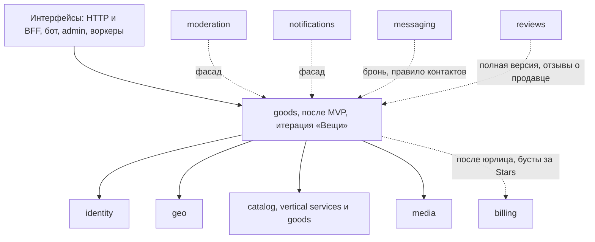

**Фасад и события.**
- Фасад вызывают `messaging` (команда «Забронировать» вызывает `goods.reserve` в той же транзакции, правило раскрытия контактов читает статус продажи), `moderation` (скрытие и снятие объявлений), `notifications` (рендеринг) и BFF-роутеры.
- `goods` публикует события объявления и продажи. Подписчики: автомодерация, fan-out уведомлений, закрытие остальных диалогов по объявлению при «продано». Их задачи идут в очередь `goods`. Через границу ходит ≤ 10 типов событий (условие N1 для выделения).
- `goods` подписан на `UserDeleted` (снимает объявления, удаляет фото, отменяет брони, обезличивает продажи) и на `MediaReady` / `MediaRejected` (объявление не переходит в `active`, пока все фото не прошли vision-проверку).

**Что меняется в существующих модулях** ([research/08 §6.1](research/08-goods-marketplace.md#61-что-переиспользуется)). Большинство правок — новые значения CHECK-перечислений, колонки, частичные индексы и типы уведомлений, аддитивные внутри `/api/v1`. Вместе ≈ 2–3 pw, они входят в оценку пилота. В «Вещах-0» — только необходимый минимум: `purpose='listing'`, vision всех фото, словарь запретов, префиксы `g_` и `gu_`.

| Модуль | Что меняется (после MVP, итерация «Вещи») |
|---|---|
| `identity` | **Санкции по вертикалям:** в `identity.restrictions` — колонка `scope ('all','services','goods')` и новый `kind='selling_blocked'`. Страйки считаются по вертикалям, чтобы спор из-за дивана не лишал специалиста заработка. P0, мошенничество и фишинг — всегда `scope='all'`. Декларация продавца — в `consents`. Путь доверия продавца — открытый вопрос ([§19.2](#192-открытые-вопросы-к-владельцу-продукта)) |
| `catalog` | Колонка `vertical ('services','goods')` и составной FK: `UNIQUE (id, vertical)` на `categories`, в `goods.listings` — `vertical GENERATED ALWAYS AS ('goods') STORED` и FK `(category_id, vertical)`; то же для `specialists` и `jobs` со значением `'services'`. `vertical` в `search_terms`, словарь брендов (`brand:apple`), определения и опции атрибутов |
| `geo` | Точная точка объявления не хранится, публичная — центр района или ячейки ~500 м либо смещение с seed = `seller_id` + `district_id` ([§7.6](#76-гео)) |
| `media` | `purpose='listing'`, до 10 фото, `phash bit(64)`, vision-проверка **всех** фото, префикс `listing/`. При снятии модерацией, P0, удалении аккаунта или жалобе на ПД — удаление вариантов из бакета `media` и сброс кэша CDN по URL ([§10](#10-медиа-пайплайн)) |
| `messaging` | `kind='listing'` со снимком объявления, роли `seller` / `buyer` в `participants.role`, тип сообщения `tracking`. `contact_shares`: ровно одно из `deal_id` / `sale_id` с частичными уникальными индексами. Один диалог на пару «объявление × покупатель». Команда «Забронировать» — аналог «Договорились». ≈ 0,75–1 pw |
| `moderation` | `target_type='listing'`, отдельный промпт и метки классификатора для объявлений, vision-проверка фото, страйки по вертикалям ([§14](#14-модерация-и-trust--safety)) |
| `notifications` | Группа `goods`, типы `listing.expiring`, `saved_search.matched`, `listing.reserved`. Только по явному opt-in, по умолчанию дайджест не чаще раза в сутки, подбюджет рассылки ≤ 5 msg/s ([§11.3](#113-каталог-уведомлений-mvp)) |
| `search` | Фильтр по `vertical` в конвейере каталога и в `/suggest`, межвертикальные пары в регрессионном наборе. Read-model и `GoodsSearchPort` живут в `goods`, а не в `search` — отступление от ADR-0002 п. 6, записывается в ADR-0019 ([§9.8](#98-эволюция)) |
| `growth` | Префиксы deep links `g_`, `gh`, `gs_`, `gu_`, `gc_` ([§11.4](#114-deep-links)) |
| `billing` (v1) | SKU `goods_*` для частных продавцов без KYC, `promotions.target_type='listing'` — только в стадии монетизации |
| `reviews` (полная версия) | Вид `goods_sale`, отдельный агрегат рейтинга продавца: продажа дивана не влияет на рейтинг электрика |
| `admin` | Представления объявлений, массовое снятие при спам-волнах, права модераторов-партнёров только на `target_type='listing'` |

### 5.9. Паттерны кода и единообразие

Решение владельца от 2026-09-27: во всём коде используем проверенные паттерны и один стиль. Код пишется маленькими шагами и проверяется по шагам, поэтому все модули устроены одинаково: кто прочитал один модуль, прочитает любой. Полные правила с примерами — [ADR-0020](adr/0020-code-patterns-and-consistency.md), порядок внедрения — шаги этапа 0 в [DEVELOPMENT_PLAN.md](DEVELOPMENT_PLAN.md).

| Паттерн | Как применяем |
|---|---|
| **Слои и порты-адаптеры** | domain → application → infrastructure → входные адаптеры (HTTP, бот, админка, задачи). Импорт только вниз; внешние сервисы (Telegram, R2, LLM, модерация) — за портами-`Protocol` с адаптерами. Проверяет import-linter |
| **Unit of Work** | Одна команда — одна транзакция — один `async with uow`. Commit делает только платформа; доменные события собираются при commit, задачи Procrastinate ставятся в той же транзакции ([ADR-0008](adr/0008-background-jobs-and-outbox.md)) |
| **Repository (Data Mapper)** | Один репозиторий на агрегат: интерфейс в application, реализация в infrastructure. Наружу — доменные объекты и DTO, ORM-модели не выходят за infrastructure. Чтение и поиск — отдельные query-сервисы (CQRS-lite) |
| **Singleton — только через DI** | Долгоживущие объекты (engine и пул БД, HTTP-клиенты, клиенты R2, Telegram, LLM, конфиг) — провайдеры dishka со скоупом `APP`. Сессия, UoW, текущий пользователь — скоуп `REQUEST`. Глобальные изменяемые объекты и синглтоны-метаклассы запрещены |
| **Facade модуля** | Другие модули обращаются только к `api.py` модуля: `Protocol`-фасад и DTO ([ADR-0002](adr/0002-modular-monolith.md)) |
| **Strategy, Factory, Specification** | Только по необходимости: стратегии модерации и поиска, фабрики сложных агрегатов. Паттерн «ради паттерна» не вводим |
| **Единая модель ошибок** | Доменные ошибки → RFC 9457 со стабильными кодами ([§8.3](#83-формат-ошибок-rfc-9457-problem-details)); та же модель в боте и задачах |
| **Единообразие** | Шаблон модуля и генератор (copier), общие соглашения об именах, async везде, mypy strict, ruff, структурные логи, pydantic-settings, пирамида тестов (unit на фейках портов, интеграционные на реальном PostgreSQL в Docker, контрактные по OpenAPI). На фронте — та же дисциплина: feature-папки, сгенерированный API-клиент, компоненты только из дизайн-системы |

Запрещено: Active Record в домене, service locator, God-сервисы, бизнес-логика в роутерах и хендлерах бота, доступ к чужой схеме БД в обход фасада. Правила проверяются в CI (import-linter, линтеры, типы) и чек-листом PR.

---

## 6. Структура репозитория

Проект живёт в одном монорепо с двумя тулчейнами: Python (uv) для backend и TypeScript (pnpm + Turborepo) для клиентов. Их связывает OpenAPI-схема: backend экспортирует `openapi.json`, из неё генерируется `packages/api-client`. Шаблонные `main.py` и `pyproject.toml` из корня переезжают в `backend/`.

```text
specialist_app/
├── backend/                          # Python 3.14, uv — модульный монолит
│   ├── pyproject.toml, uv.lock
│   ├── Dockerfile                    # один образ; роли: web | bot | worker | worker-media
│   ├── .importlinter                 # контракты границ модулей (DAG из §5.4)
│   ├── src/app/
│   │   ├── platform/                 # shared kernel
│   │   │   ├── contracts/events/     # схемы доменных событий (published language, версии)
│   │   │   ├── db/                   # engine, сессии, Unit of Work, базовые типы, хелперы миграций
│   │   │   ├── queue/                # порт JobQueue, адаптер Procrastinate, диспетчер событий
│   │   │   ├── security/             # проверка initData, JWT, OIDC, пароли персонала
│   │   │   ├── i18n/                 # Babel, выбор локали, транслитерация sr-Cyrl → sr-Latn
│   │   │   ├── storage/              # S3/R2: presign, HEAD, multipart
│   │   │   ├── telegram/             # Bot-клиент, rate limiter отправки, deep links
│   │   │   ├── ai/                   # порты Moderation, PolicyClassifier, SecondaryImage; адаптеры OpenAI и Claude, circuit breaker
│   │   │   ├── text/                 # чистые функции: скелет текста, детектор контактов и предоплаты
│   │   │   ├── observability/        # structlog, Sentry, метрики Prometheus
│   │   │   ├── di.py                 # провайдеры dishka
│   │   │   └── settings.py           # pydantic-settings
│   │   ├── modules/
│   │   │   ├── identity/  geo/  catalog/  media/  billing/
│   │   │   ├── specialists/  pricing/  deals/
│   │   │   ├── jobs/                 # включая jobs/responses и jobs/alerts
│   │   │   ├── messaging/  reviews/  search/  growth/
│   │   │   └── notifications/  moderation/
│   │   │       # внутри каждого: api.py, domain/, application/, infrastructure/,
│   │   │       #                 http/, bot/, admin/, tasks.py, tests/
│   │   │       # после MVP, итерация «Вещи»: goods/ (§5.8)
│   │   ├── interfaces/
│   │   │   ├── http/                 # сборка FastAPI: роутеры модулей, BFF (views/), ошибки RFC 9457, middleware
│   │   │   ├── bot/                  # сборка aiogram Dispatcher: роутеры модулей, middlewares, i18n
│   │   │   ├── admin/                # SQLAdmin, аутентификация персонала, чат модераторов
│   │   │   └── worker/               # регистрация задач и периодических задач Procrastinate
│   │   └── entrypoints/              # web.py, bot.py, worker.py, cli.py (сиды, реиндекс, админские команды)
│   ├── migrations/                   # Alembic: схемы по модулям, env.py, шаблоны expand/contract
│   ├── locales/                      # gettext .po: ru, sr_Cyrl (исходник), sr_Latn (генерируется), en
│   └── tests/                        # e2e, контрактные (schemathesis), фикстуры testcontainers
├── apps/
│   ├── tma/                          # Telegram Mini App + веб-оболочка (React 19 + Vite)
│   └── mobile/                       # этап 2: Expo (iOS/Android)
├── packages/                         # общий TypeScript-core (ADR-0012)
│   ├── api-client/                   # orval: типы, fetchers, TanStack Query hooks, Zod, MSW-моки
│   ├── domain/  hooks/  platform/  i18n/  design-tokens/  links/  ui-web/  config/
├── infra/
│   ├── compose/                      # docker-compose.dev.yml: postgres, valkey, garage (+ imgproxy)
│   ├── postgres/                     # Dockerfile PG 18 + PostGIS; init: локаль, роли, расширения, FTS-конфиги
│   ├── kamal/                        # deploy.yml, .kamal/secrets (через sops)
│   ├── terraform/                    # hcloud, cloudflare: VM, firewall, DNS, бакеты, Access
│   ├── secrets/                      # *.sops.yaml (age)
│   ├── monitoring/                   # Grafana Alloy, дашборды, алерты
│   └── runbooks/                     # восстановление БД, инцидент утечки (72 ч), откат, ротация секретов
├── docs/                             # ARCHITECTURE.md, PRODUCT.md, adr/, research/ (+ lab/)
├── .github/workflows/                # ci-backend.yml, ci-frontend.yml, deploy.yml, restore-test.yml
├── package.json, pnpm-workspace.yaml, turbo.json
└── README.md
```

**Соглашения**

| Тема | Правило |
|---|---|
| Куда класть код | Код модуля лежит только в `modules/<name>/`. Интерфейсы (`interfaces/*`) собирают роутеры и хендлеры модулей и не содержат логики |
| Бот | Хендлеры бота живут в модуле, к которому относятся (`modules/jobs/bot/…`); `interfaces/bot` только регистрирует их |
| Миграции | Одна цепочка Alembic, в имени ревизии — модуль (`jobs_0007_add_alerts_area.py`). Модуль меняет только свою схему |
| Тесты | Unit-тесты domain и application лежат рядом с модулем. Интеграционные — на реальном PostGIS (testcontainers). Контрактные — schemathesis по OpenAPI |
| Фронтенд | Экраны не импортируют Telegram SDK напрямую, только `packages/platform` |

---

## 7. Модель данных

### 7.1. Соглашения

| Тема | Решение |
|---|---|
| Схемы | Одна схема PostgreSQL на модуль: `identity`, `specialists`, `pricing`, `catalog`, `geo`, `media`, `jobs`, `deals`, `reviews`, `messaging`, `notifications`, `moderation`, `billing`, `search`, `growth`, `platform`. После MVP — `goods` ([§7.11](#711-модуль-goods-после-mvp-итерация-вещи)) |
| Первичные ключи сущностей | `uuid` версии 7 (сортируемый по времени; хорошая локальность B-tree; безопасно отдавать наружу). Генерируется в приложении, а в PostgreSQL 18 — ещё и дефолтом `uuidv7()` |
| Ключи справочников | `int generated always as identity` (категории, теги, города, районы, продукты). Компактно, удобно хранить в массивах `int[]` под GIN-индексом |
| Время | `timestamptz` в UTC; бизнес-часовой пояс — `Europe/Belgrade` |
| Деньги | `bigint` в минимальных единицах валюты (para для RSD, штуки для Stars `XTR`) + `currency`. Никаких `float`. Цены, бюджеты и отклики — **только RSD** (`CHECK (currency = 'RSD')`): расчёты между резидентами Сербии допускаются только в динарах (ст. 34 Zakon o deviznom poslovanju), цены показываются в RSD (ст. 35 Zakon o trgovini). EUR — разве что справочный пересчёт в UI |
| Перечисления | `text` + `CHECK` (дешевле менять, чем PostgreSQL `ENUM`); в коде — `StrEnum` |
| Soft delete | `deleted_at timestamptz` на пользовательском контенте (профили, услуги, портфолио, заявки, отклики, отзывы, сообщения, медиа). Уникальные индексы — частичные `WHERE deleted_at IS NULL`. Физическое удаление или анонимизация — задачами ретеншна ([§7.10](#710-soft-delete-ретеншн-и-аудит), [§12.3](#123-периодические-задачи)) |
| Служебные поля | `created_at`, `updated_at` (триггер или ORM), у агрегатов — `version int` для optimistic locking |
| Аудит | `platform.audit_log` (append-only) — действия персонала и доступ к чувствительным данным; `*.status_history` — переходы статусов ключевых агрегатов; доменные события — задачи Procrastinate в той же транзакции (ретеншн выполненных — 7 дней) |
| Языки | UI-локали: `ru`, `sr-Latn`, `sr-Cyrl`, `en` (BCP 47). Языки общения и язык контента — ISO 639-1 (`ru`, `sr`, `en`, `uk`, `be`, …) |

### 7.2. ER-диаграммы

Одна диаграмма на ~65 таблиц нечитаема, поэтому схема разбита на четыре фрагмента. Поля показаны выборочно; полные определения ключевых таблиц — в 7.3.

**Пользователи, исполнители, прайс-лист, портфолио**

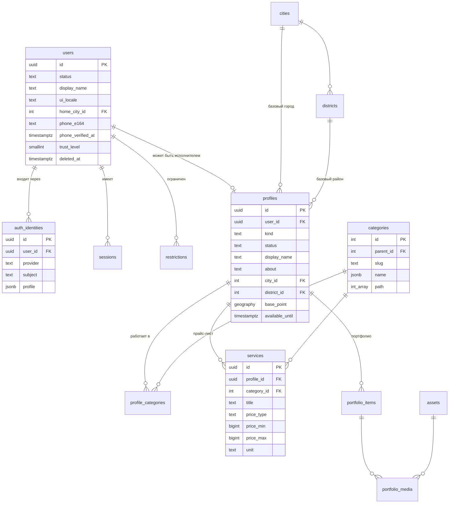

**Доска заявок, отклики, сделки, отзывы**

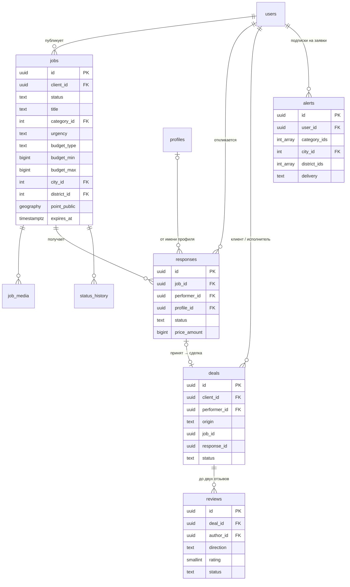

**Сообщения, уведомления, медиа**

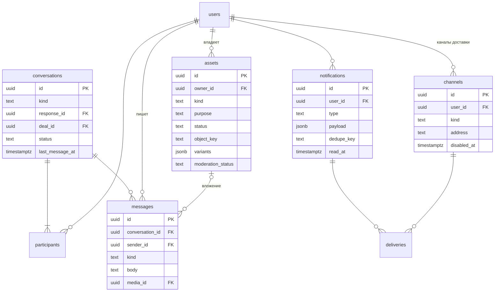

**Модерация, биллинг, рост**

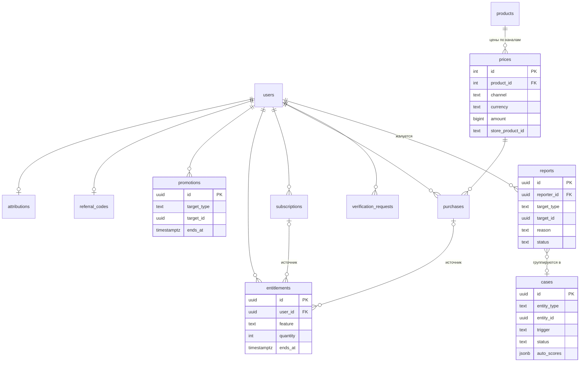

### 7.3. Ключевые таблицы (DDL-эскизы)

Эскизы показывают структуру, ограничения и индексы. Это не финальные миграции. Колонки `created_at`/`updated_at` опущены там, где они очевидны.

<details>
<summary><b>identity</b>: users, auth_identities, sessions, restrictions, consents, user_blocks, deletion_requests, deleted_identity_hashes</summary>

```sql
CREATE TABLE identity.users (
  id                uuid PRIMARY KEY DEFAULT uuidv7(),
  status            text NOT NULL DEFAULT 'active'
                    CHECK (status IN ('active','deleted')),   -- баны и приостановки — только через identity.restrictions
  display_name      text NOT NULL,
  avatar_media_id   uuid,                                  -- media.assets: задел для фото клиента (v1); фото исполнителя — specialists.profiles
  ui_locale         text NOT NULL DEFAULT 'ru'
                    CHECK (ui_locale IN ('ru','sr-Latn','sr-Cyrl','en')),
  timezone          text NOT NULL DEFAULT 'Europe/Belgrade',
  home_city_id      int REFERENCES geo.cities(id),
  phone_e164        text,                                  -- из Telegram requestContact / SMS OTP
  phone_verified_at timestamptz,
  identity_verified_at timestamptz,                        -- документ проверен (moderation)
  trust_level       smallint NOT NULL DEFAULT 0,           -- 0 новый … 3 доверенный (определения — §13.2)
  trust_penalty_at  timestamptz,                           -- последнее нарушение: «14 дней без жалоб» считаются от него (2.5a)
  privacy           jsonb NOT NULL DEFAULT '{}',           -- {"show_telegram": false, "show_phone": false}
  created_at        timestamptz NOT NULL DEFAULT now(),
  updated_at        timestamptz NOT NULL DEFAULT now(),
  last_seen_at      timestamptz,
  deleted_at        timestamptz
);
CREATE UNIQUE INDEX users_phone_uq ON identity.users (phone_e164)
  WHERE phone_e164 IS NOT NULL AND deleted_at IS NULL;

-- Способы входа: один пользователь — много провайдеров (Telegram сейчас; Apple, Google, телефон — для App Store)
CREATE TABLE identity.auth_identities (
  id            uuid PRIMARY KEY DEFAULT uuidv7(),
  user_id       uuid NOT NULL REFERENCES identity.users(id),
  provider      text NOT NULL CHECK (provider IN ('telegram','apple','google','phone','email')),
  subject       text NOT NULL,          -- Telegram user id, Apple sub, E.164 …
  profile       jsonb NOT NULL DEFAULT '{}',  -- снимок: username, имя, language_code, is_premium, photo_url
  created_at    timestamptz NOT NULL DEFAULT now(),
  last_login_at timestamptz,
  UNIQUE (provider, subject)
);
CREATE INDEX ON identity.auth_identities (user_id);

-- Refresh-сессии (access token — короткоживущий JWT, в БД не хранится)
CREATE TABLE identity.sessions (
  id                 uuid PRIMARY KEY DEFAULT uuidv7(),
  user_id            uuid NOT NULL REFERENCES identity.users(id),
  platform           text NOT NULL CHECK (platform IN ('tma','ios','android','web','admin')),
  bot_id             bigint,                  -- для TMA: какой бот (prod/stage/dev) выдал initData
  amr                text[] NOT NULL,         -- способ входа ('tg_webapp', …) для клейма amr при refresh
  refresh_token_hash bytea NOT NULL UNIQUE,   -- SHA-256 секрета текущего refresh (токен — <sid>.<secret>, 256 бит)
  previous_refresh_hash bytea,                -- хэш предыдущего секрета: окно гонки 10 с после ротации
  rotated_at         timestamptz,             -- повтор старого токена вне окна = компрометация, отзыв сессии
  device             jsonb NOT NULL DEFAULT '{}',
  ip                 inet,
  created_at         timestamptz NOT NULL DEFAULT now(),
  last_used_at       timestamptz NOT NULL DEFAULT now(),
  expires_at         timestamptz NOT NULL,
  revoked_at         timestamptz,
  revoke_reason      text CHECK (revoke_reason IN ('logout','refresh_reused','restricted','account_deleted'))
);
CREATE INDEX ON identity.sessions (user_id) WHERE revoked_at IS NULL;

-- Ограничения (санкции модерации и системные лимиты) — единая точка проверки «можно ли»
CREATE TABLE identity.restrictions (
  id          uuid PRIMARY KEY DEFAULT uuidv7(),
  user_id     uuid NOT NULL REFERENCES identity.users(id),
  kind        text NOT NULL CHECK (kind IN
              ('limited','posting_blocked','responding_blocked','messaging_blocked','shadow_banned','suspended','banned')),
              -- limited — страйк 1: лимиты новичка на 7 дней, действий не запрещает (2.5a)
  reason_code text NOT NULL,
  source      text NOT NULL CHECK (source IN ('moderation','system')),
  case_id     uuid,                                -- moderation.cases (без FK: moderation выше по DAG)
  starts_at   timestamptz NOT NULL DEFAULT now(),
  ends_at     timestamptz,                         -- NULL = бессрочно
  lifted_at   timestamptz,
  created_by  uuid
);
CREATE INDEX ON identity.restrictions (user_id) WHERE lifted_at IS NULL;

-- Журнал акцептов и согласий (ст. 12–15 ZET, ст. 15 ZZPL, ст. 160 ZEK): версия, канал, время; отзыв в один шаг
CREATE TABLE identity.consents (
  id          uuid PRIMARY KEY DEFAULT uuidv7(),
  user_id     uuid NOT NULL REFERENCES identity.users(id),
  document    text NOT NULL CHECK (document IN
              ('terms','privacy','age_18','performer_declaration','analytics','marketing','precise_location','ai_processing')),
  version     text NOT NULL,                  -- версия или хеш текста документа
  granted_at  timestamptz NOT NULL DEFAULT now(),
  withdrawn_at timestamptz,
  source      text NOT NULL,        -- tma / ios / android / web
  ip          inet
);

CREATE TABLE identity.user_roles (   -- только персонал; «клиент» и «исполнитель» — не роли, а возможности
  user_id    uuid NOT NULL REFERENCES identity.users(id),
  role       text NOT NULL CHECK (role IN ('admin','moderator','support')),
  granted_by uuid, granted_at timestamptz NOT NULL DEFAULT now(),
  PRIMARY KEY (user_id, role)
);

CREATE TABLE identity.completed_deals (   -- уровень доверия 2: ≥ 3 завершённые сделки (6.1a)
  user_id      uuid NOT NULL REFERENCES identity.users(id),
  deal_id      uuid NOT NULL,                -- deals.deals — выше по DAG, без FK
  completed_at timestamptz NOT NULL,
  PRIMARY KEY (user_id, deal_id)             -- повтор подписчика DealCompleted факт не удваивает
);
CREATE TABLE identity.user_blocks (  -- требование App Store 1.2: пользователь может заблокировать другого
  blocker_id uuid NOT NULL REFERENCES identity.users(id),
  blocked_id uuid NOT NULL REFERENCES identity.users(id),
  created_at timestamptz NOT NULL DEFAULT now(),
  PRIMARY KEY (blocker_id, blocked_id)
);

CREATE TABLE identity.deletion_requests (   -- удаление аккаунта: grace 7 дней, затем identity.process_deletions
  id            uuid PRIMARY KEY DEFAULT uuidv7(),
  user_id       uuid NOT NULL REFERENCES identity.users(id),
  requested_at  timestamptz NOT NULL DEFAULT now(),
  execute_after timestamptz NOT NULL,       -- requested_at + 7 дней
  cancelled_at  timestamptz,
  completed_at  timestamptz,
  source        text NOT NULL             -- tma / bot / ios / android / web / support
);
CREATE UNIQUE INDEX ON identity.deletion_requests (user_id) WHERE cancelled_at IS NULL AND completed_at IS NULL;

-- Антифрод после удаления: HMAC телефона и Telegram ID удалённых аккаунтов хранится 12 месяцев,
-- повторная регистрация помечается флагом (без восстановления данных) — §7.10
CREATE TABLE identity.deleted_identity_hashes (
  hash        bytea PRIMARY KEY,          -- HMAC-SHA256(secret, 'tg:<id>' | 'phone:<e164>')
  kind        text NOT NULL CHECK (kind IN ('telegram','phone')),
  had_sanctions boolean NOT NULL DEFAULT false,
  deleted_at  timestamptz NOT NULL,
  purge_after timestamptz NOT NULL        -- deleted_at + 12 месяцев
);
```
</details>

<details>
<summary><b>specialists</b> и <b>pricing</b>: profiles, profile_categories, service_areas, portfolio, services</summary>

```sql
CREATE TABLE specialists.profiles (
  id                 uuid PRIMARY KEY DEFAULT uuidv7(),
  user_id            uuid NOT NULL REFERENCES identity.users(id),  -- MVP: 1 активный профиль на пользователя (частичный unique ниже)
  kind               text NOT NULL CHECK (kind IN ('pro','casual')),     -- специалист / «подработка»
  status             text NOT NULL DEFAULT 'draft'
                     CHECK (status IN ('draft','pending_review','published','hidden','suspended')),
  display_name       text NOT NULL,
  headline           text CHECK (char_length(headline) <= 80),
  about              text CHECK (char_length(about) <= 4000),
  content_lang       text,                          -- язык описания (ru/sr/en …)
  experience_since   smallint,
  languages          text[] NOT NULL DEFAULT '{}',  -- языки общения: {ru,sr,en,uk}
  city_id            int NOT NULL REFERENCES geo.cities(id),
  district_id        int REFERENCES geo.districts(id),
  base_point         geography(Point,4326),         -- точная база; только для фильтра «выезжает ко мне», наружу не отдаётся
  base_point_public  geography(Point,4326),         -- публичная точка: центр района или смещённая точка (расстояние в выдаче)
  travel_radius_km   smallint,
  work_modes         text[] NOT NULL DEFAULT '{}',  -- {at_client, at_own_place, remote}
  available_until    timestamptz,                   -- «доступен сегодня/сейчас»: флаг с TTL
  vacation_until     date,
  trader_status      text CHECK (trader_status IN ('trader','non_trader')),  -- v1: декларация исполнителя (ст. 28 ZZP 35/2026); NULL в MVP
  registry_id        text,                          -- v1: MB/PIB, если зарегистрирован; APR — проверка, а не источник статуса
  business_verified_at timestamptz,                 -- проверка в APR / лицензия (moderation)
  contacts           jsonb NOT NULL DEFAULT '{}',   -- {"telegram":{"public":false},"instagram":"…","site":"…"}
  listed_in_catalog  boolean NOT NULL DEFAULT true, -- casual по умолчанию false
  is_founding        boolean NOT NULL DEFAULT false, -- Founding (§15.2): cli founding-mark; бейдж — v1
  pro_waitlist_at    timestamptz,                   -- лист ожидания Pro (Q24)
  rejection_reason   varchar(64),                   -- модерация вернула на правки: код причины
  reviewed_kind      boolean NOT NULL DEFAULT false, -- проверка после «Подработка → Специалист»
  submitted_at       timestamptz,                   -- отправлен на проверку (2.8a)
  slug               text,                          -- для будущих публичных веб-страниц (частичный unique ниже)
  avatar_media_id    uuid REFERENCES media.assets(id), -- фото профиля (2.11): показывает specialists — identity ниже media
  version            int NOT NULL DEFAULT 1,
  published_at       timestamptz,
  created_at         timestamptz NOT NULL DEFAULT now(),
  updated_at         timestamptz NOT NULL DEFAULT now(),
  deleted_at         timestamptz
);
CREATE INDEX ON specialists.profiles (status, city_id) WHERE deleted_at IS NULL;
CREATE UNIQUE INDEX ON specialists.profiles (user_id) WHERE deleted_at IS NULL;
CREATE UNIQUE INDEX ON specialists.profiles (slug) WHERE slug IS NOT NULL AND deleted_at IS NULL;

CREATE TABLE specialists.profile_categories (
  profile_id  uuid NOT NULL REFERENCES specialists.profiles(id),
  category_id int  NOT NULL REFERENCES catalog.categories(id),
  is_primary  boolean NOT NULL DEFAULT false,
  PRIMARY KEY (profile_id, category_id)
);

CREATE TABLE specialists.service_areas (   -- где работает с выездом (если не весь город)
  profile_id  uuid NOT NULL REFERENCES specialists.profiles(id),
  district_id int  NOT NULL REFERENCES geo.districts(id),
  PRIMARY KEY (profile_id, district_id)
);

CREATE TABLE specialists.working_hours (   -- v1: недельный шаблон
  profile_id uuid NOT NULL REFERENCES specialists.profiles(id),
  weekday    smallint NOT NULL CHECK (weekday BETWEEN 1 AND 7),
  opens_at   time NOT NULL,
  closes_at  time NOT NULL,
  PRIMARY KEY (profile_id, weekday, opens_at)
);

CREATE TABLE specialists.portfolio_items (
  id          uuid PRIMARY KEY DEFAULT uuidv7(),
  profile_id  uuid NOT NULL REFERENCES specialists.profiles(id),
  category_id int REFERENCES catalog.categories(id),
  title       text,
  description text,
  position    smallint NOT NULL DEFAULT 0,
  status      text NOT NULL DEFAULT 'pending' CHECK (status IN ('pending','published','rejected')),
  created_at  timestamptz NOT NULL DEFAULT now(),
  deleted_at  timestamptz
);
CREATE TABLE specialists.portfolio_media (
  item_id  uuid NOT NULL REFERENCES specialists.portfolio_items(id),
  media_id uuid NOT NULL REFERENCES media.assets(id),
  kind     text NOT NULL CHECK (kind IN ('image','video')),  -- лимиты 60 фото и 6 роликов без чтения media (2.11)
  position smallint NOT NULL DEFAULT 0,
  PRIMARY KEY (item_id, media_id)
);

-- Прайс-лист
CREATE TABLE pricing.services (
  id           uuid PRIMARY KEY DEFAULT uuidv7(),
  profile_id   uuid NOT NULL REFERENCES specialists.profiles(id),
  category_id  int  REFERENCES catalog.categories(id),  -- группа в S35; NULL — без группы (первая позиция мастера S32c, 2.8b)
  title        text NOT NULL CHECK (char_length(title) <= 120),
  description  text,
  price_type   text NOT NULL CHECK (price_type IN ('fixed','from','range','hourly','per_unit','negotiable')),
  price_min    bigint,             -- в para (1 RSD = 100 para)
  price_max    bigint,
  currency     char(3) NOT NULL DEFAULT 'RSD' CHECK (currency = 'RSD'),  -- только RSD (ст. 34 ZDP, ст. 35 ZT)
  unit         text,               -- hour / visit / item / m2 / lesson / km …
  duration_min int,
  position     smallint NOT NULL DEFAULT 0,
  is_active    boolean NOT NULL DEFAULT true,
  created_at   timestamptz NOT NULL DEFAULT now(),
  updated_at   timestamptz NOT NULL DEFAULT now(),
  deleted_at   timestamptz,
  CHECK (price_type = 'negotiable' OR price_min IS NOT NULL),
  CHECK (price_max IS NULL OR price_max >= price_min)
);
CREATE INDEX ON pricing.services (profile_id, position) WHERE deleted_at IS NULL;
```
</details>

<details>
<summary><b>catalog</b> и <b>geo</b>: categories, tags, search_terms, cities, districts</summary>

```sql
CREATE TABLE catalog.categories (
  id             int GENERATED ALWAYS AS IDENTITY PRIMARY KEY,
  parent_id      int REFERENCES catalog.categories(id),
  slug           text NOT NULL UNIQUE,              -- electrical-works
  name           jsonb NOT NULL CHECK (name ?& ARRAY['ru','sr-Cyrl']),  -- {"ru":"Электрик","sr-Cyrl":"Електричар","sr-Latn":"Električar","en":"Electrician"}
  description    jsonb NOT NULL DEFAULT '{}',
  path           int[] NOT NULL,                    -- предки + сам узел: {1,12,57}; пересчитывается при изменении дерева
  depth          smallint NOT NULL,
  icon           text,
  sort_order     int NOT NULL DEFAULT 0,
  is_active      boolean NOT NULL DEFAULT true,
  jobs_enabled   boolean NOT NULL DEFAULT true,     -- можно ли публиковать заявки в категории
  max_responses  smallint NOT NULL DEFAULT 5,       -- лимит откликов на заявку в категории
  default_unit   text,
  price_hint     jsonb NOT NULL DEFAULT '{}',       -- MVP: статические диапазоны для подсказки цены
                                                    -- {"beograd":{"min":150000,"max":400000,"unit":"work"}} (para)
  risk_level     smallint NOT NULL DEFAULT 0        -- 0 обычная; 1 — премодерация; 2 — запрещено (для стоп-категорий)
);
CREATE INDEX ON catalog.categories USING gin (path);

CREATE TABLE catalog.tags (
  id          int GENERATED ALWAYS AS IDENTITY PRIMARY KEY,
  category_id int REFERENCES catalog.categories(id),
  slug        text NOT NULL UNIQUE,
  name        jsonb NOT NULL,
  is_active   boolean NOT NULL DEFAULT true
);

-- Многоязычный словарь: любой способ назвать потребность → категория/тег.
-- «электрик», «električar», «електричар», «electrician», «розетка», «utičnica» → category 57
CREATE TABLE catalog.search_terms (
  id          int GENERATED ALWAYS AS IDENTITY PRIMARY KEY,
  term        text NOT NULL,
  lang        text NOT NULL,                 -- ru / sr / en
  norm        text NOT NULL,                 -- lower + unaccent + транслит в латиницу
  category_id int REFERENCES catalog.categories(id),
  tag_id      int REFERENCES catalog.tags(id),
  weight      real NOT NULL DEFAULT 1.0,
  CHECK (category_id IS NOT NULL OR tag_id IS NOT NULL)
);
CREATE INDEX ON catalog.search_terms (norm);                         -- префикс LIKE 'elek%' (builtin C.UTF-8)
CREATE INDEX ON catalog.search_terms USING gist (norm gist_trgm_ops); -- опечатки: %, <%, KNN <->

CREATE TABLE geo.cities (
  id         int GENERATED ALWAYS AS IDENTITY PRIMARY KEY,
  slug       text NOT NULL UNIQUE,               -- beograd, novi-sad
  name       jsonb NOT NULL,
  center     geography(Point,4326) NOT NULL,
  boundary   geometry(MultiPolygon,4326),        -- границы — geometry: ST_Covers с GiST (ADR-0005)
  is_active  boolean NOT NULL DEFAULT false,     -- включаем города постепенно
  sort_order int NOT NULL DEFAULT 0
);

CREATE TABLE geo.districts (
  id        int GENERATED ALWAYS AS IDENTITY PRIMARY KEY,
  city_id   int NOT NULL REFERENCES geo.cities(id),
  parent_id int REFERENCES geo.districts(id),     -- општина → насеље/четврт
  kind      text NOT NULL CHECK (kind IN ('municipality','neighborhood')),
  slug      text NOT NULL,
  name      jsonb NOT NULL,                       -- {"ru":"Лиман","sr-Latn":"Liman","sr-Cyrl":"Лиман"}
  center    geography(Point,4326) NOT NULL,
  boundary  geometry(MultiPolygon,4326),          -- из OSM/RGZ; может отсутствовать у мелких районов
  is_active boolean NOT NULL DEFAULT true,
  UNIQUE (city_id, slug)
);
CREATE INDEX ON geo.districts USING gist (boundary);
```
</details>

<details>
<summary><b>media</b>: assets</summary>

```sql
CREATE TABLE media.assets (
  id                uuid PRIMARY KEY DEFAULT uuidv7(),
  owner_id          uuid NOT NULL REFERENCES identity.users(id),
  kind              text NOT NULL CHECK (kind IN ('image','video','document')),
  purpose           text NOT NULL CHECK (purpose IN ('avatar','portfolio','job','message','review','verification')),
  status            text NOT NULL DEFAULT 'pending_upload'
                    CHECK (status IN ('pending_upload','uploaded','processing','ready','failed','rejected','deleted')),
  bucket            text NOT NULL,        -- incoming (сырые загрузки) / private (оригиналы, вложения чата, документы) / media (публичные варианты)
  object_key        text NOT NULL,        -- {purpose}/{yyyy}/{mm}/{id}/original
  upload_id         text,                 -- id multipart-загрузки в хранилище (видео больше 50 MB)
  mime_type         text NOT NULL,        -- заявленный клиентом; подписан в presigned PUT, сверяется HEAD
  size_bytes        bigint NOT NULL,      -- заявленный размер; подписан в presigned PUT, сверяется HEAD
  etag              text,                 -- ETag оригинала, сверенного при complete: обработка читает именно его
  width             int,                  -- размеры самого крупного варианта: оригинал после обработки не храним
  height            int,
  duration_ms       int,
  sha256            bytea,                -- дедупликация и детекция повторно загружаемого запрещённого контента
  variants          jsonb NOT NULL DEFAULT '{}',  -- {"thumb":{"key":…,"w":320,"h":240},"md":{…},"lg":{…},"video":{…}}; у ролика thumb/md/lg — постер
  placeholder       text,                 -- thumbhash/blurhash для мгновенного превью
  moderation_status text NOT NULL DEFAULT 'pending'
                    CHECK (moderation_status IN ('pending','approved','flagged','rejected')),
  moderation_labels jsonb NOT NULL DEFAULT '{}',
  failure_reason    text CHECK (failure_reason IN ('abandoned','mismatch','unsupported','too_many_pixels','unreadable','too_long')),  -- почему failed (загрузка) или rejected (обработка)
  created_at        timestamptz NOT NULL DEFAULT now(),
  uploaded_at       timestamptz,          -- complete прошёл HEAD-проверку
  processed_at      timestamptz,
  attempts          int NOT NULL DEFAULT 0,  -- запуски обработки: сбой не по вине файла повторяется до трёх раз
  deleted_at        timestamptz,
  hidden_at         timestamptz,          -- варианты удалённого файла перенесены из media в private
  held_until        timestamptz,          -- legal hold: очистка ждёт до этого времени (открытый кейс или спор, 2.5a)
  purged_at         timestamptz           -- объекты удалённого файла отправлены на удаление (media.purge_deleted)
);
CREATE INDEX ON media.assets (owner_id, created_at DESC);
CREATE INDEX ON media.assets (status, created_at) WHERE status IN ('pending_upload','uploaded','processing');
CREATE INDEX ON media.assets (deleted_at) WHERE status = 'deleted' AND purged_at IS NULL;
```
</details>

<details>
<summary><b>jobs</b>: jobs, job_media, responses, alerts, hidden_jobs, saved_jobs, invites, response_templates, status_history</summary>

```sql
CREATE TABLE jobs.jobs (
  id               uuid PRIMARY KEY DEFAULT uuidv7(),
  client_id        uuid NOT NULL REFERENCES identity.users(id),
  status           text NOT NULL DEFAULT 'draft' CHECK (status IN
                   ('draft','pending_moderation','published','assigned','completed','closed','expired','rejected','removed')),
  visibility       text NOT NULL DEFAULT 'public' CHECK (visibility IN ('public','direct')),  -- direct = запрос конкретным специалистам
  title            text NOT NULL CHECK (char_length(title) BETWEEN 5 AND 120),
  description      text NOT NULL CHECK (char_length(description) <= 3000),
  content_lang     text NOT NULL,
  category_id      int  NOT NULL REFERENCES catalog.categories(id),
  category_path    int[] NOT NULL,                  -- копия categories.path для фильтра «категория с потомками»
  tag_ids          int[] NOT NULL DEFAULT '{}',
  urgency          text NOT NULL CHECK (urgency IN ('asap','today','this_week','flexible')),
  preferred_from   timestamptz,
  preferred_to     timestamptz,
  budget_type      text NOT NULL CHECK (budget_type IN ('fixed','range','negotiable')),
  budget_min       bigint,                           -- para
  budget_max       bigint,
  budget_unit      text NOT NULL DEFAULT 'work'
                   CHECK (budget_unit IN ('work','hour','m2','visit','item','lesson')),
  currency         char(3) NOT NULL DEFAULT 'RSD' CHECK (currency = 'RSD'),
  verified_only    boolean NOT NULL DEFAULT false,   -- «только проверенные исполнители»
  city_id          int NOT NULL REFERENCES geo.cities(id),
  district_id      int REFERENCES geo.districts(id),
  point_exact      geography(Point,4326),           -- видит только выбранный исполнитель
  point_public     geography(Point,4326),           -- смещённая точка (≈300–500 м) для карты и радиуса
  address_private  text,                            -- подъезд/этаж — только выбранному исполнителю
  languages        text[] NOT NULL DEFAULT '{}',    -- предпочтительные языки общения
  max_responses    smallint NOT NULL DEFAULT 5,       -- лимит откликов (из categories.max_responses)
  responses_count  int NOT NULL DEFAULT 0,          -- только активные отклики: submitted / viewed / shortlisted
  extensions_count smallint NOT NULL DEFAULT 0,     -- сколько раз продлевали (лимит — 3)
  views_count      int NOT NULL DEFAULT 0,       -- разные люди, не чаще раза в сутки каждый (5.6)
  responses_seen_at timestamptz,                   -- клиент открыл отклики (S23): позже прошедшие проверку — «новые»
  search_vector    tsvector,                        -- заполняется приложением (§9.3)
  source           text NOT NULL DEFAULT 'tma',     -- tma / bot / ios / android / web
  moderation_note  text,
  selected_response_id uuid,
  version          int NOT NULL DEFAULT 1,
  published_at     timestamptz,
  expires_at       timestamptz,
  closed_at        timestamptz,
  close_reason     text CHECK (close_reason IN
                   ('hired_here','hired_elsewhere','not_needed','no_suitable','expired','removed')),
  created_at       timestamptz NOT NULL DEFAULT now(),
  updated_at       timestamptz NOT NULL DEFAULT now(),
  deleted_at       timestamptz,
  CHECK (budget_type = 'negotiable' OR budget_min IS NOT NULL)
);
-- Лента доски: только открытые заявки → частичные индексы остаются маленькими
CREATE INDEX jobs_feed_idx     ON jobs.jobs (city_id, published_at DESC, id DESC) WHERE status = 'published';
CREATE INDEX jobs_feed_cat_idx ON jobs.jobs USING gin (category_path)          WHERE status = 'published';
CREATE INDEX jobs_feed_leaf_idx ON jobs.jobs (category_id, published_at DESC, id DESC) WHERE status = 'published';  -- персональная лента
CREATE INDEX jobs_feed_dist_idx ON jobs.jobs (district_id, published_at DESC, id DESC) WHERE status = 'published';
CREATE INDEX jobs_feed_geo_idx ON jobs.jobs USING gist (point_public)          WHERE status = 'published';
CREATE INDEX jobs_fts_idx      ON jobs.jobs USING gin (search_vector)          WHERE status = 'published';
CREATE INDEX jobs_client_idx   ON jobs.jobs (client_id, created_at DESC)       WHERE deleted_at IS NULL;
CREATE INDEX jobs_expire_idx   ON jobs.jobs (expires_at)                       WHERE status = 'published';

CREATE TABLE jobs.job_media (
  job_id   uuid NOT NULL REFERENCES jobs.jobs(id),
  media_id uuid NOT NULL REFERENCES media.assets(id),
  position smallint NOT NULL DEFAULT 0,
  PRIMARY KEY (job_id, media_id)
);

CREATE TABLE jobs.responses (               -- подагрегат заявки (5.4): пишется вместе с ней
  id                uuid PRIMARY KEY DEFAULT uuidv7(),
  job_id            uuid NOT NULL REFERENCES jobs.jobs(id),
  performer_id      uuid NOT NULL REFERENCES identity.users(id),
  profile_id        uuid REFERENCES specialists.profiles(id),
  status            text NOT NULL DEFAULT 'submitted' CHECK (status IN
                    ('submitted','viewed','shortlisted','accepted','declined','withdrawn','not_selected')),
  review            text NOT NULL DEFAULT 'pending' CHECK (review IN ('pending','clear','blocked')),
                                                 -- клиент видит только clear (проверка текста, §14.1)
  revision          int NOT NULL DEFAULT 1,      -- редакция, которую проверяла модерация
  message           text NOT NULL CHECK (char_length(message) BETWEEN 1 AND 1500),
  price_type        text NOT NULL CHECK (price_type IN ('fixed','from','hourly','negotiable')),
  price_amount      bigint,                       -- у negotiable — NULL, у остальных — обязательно
  currency          char(3) NOT NULL DEFAULT 'RSD' CHECK (currency = 'RSD'),
  availability_note text,                         -- «могу сегодня после 18:00»
  template_id       uuid,                         -- отклик в один тап из шаблона (jobs.response_templates)
  created_at        timestamptz NOT NULL DEFAULT now(),
  updated_at        timestamptz NOT NULL DEFAULT now(),
  viewed_at         timestamptz,
  decided_at        timestamptz,
  deleted_at        timestamptz
);
CREATE UNIQUE INDEX ON jobs.responses (job_id, performer_id) WHERE deleted_at IS NULL;  -- один отклик на заявку от исполнителя
CREATE INDEX ON jobs.responses (job_id, created_at);
CREATE INDEX ON jobs.responses (performer_id, created_at DESC);

-- Подписки на новые заявки («присылай мне заявки по электрике в Лимане от 3000 RSD»)
CREATE TABLE jobs.alerts (
  id           uuid PRIMARY KEY DEFAULT uuidv7(),
  user_id      uuid NOT NULL REFERENCES identity.users(id),
  category_ids int[] NOT NULL,                  -- выбранные узлы дерева (матчинг через category_path)
  city_id      int NOT NULL REFERENCES geo.cities(id),
  district_ids int[] NOT NULL DEFAULT '{}',     -- пусто = весь город
  center       geography(Point,4326),           -- альтернатива районам: точка + радиус
  radius_m     int CHECK (radius_m <= 30000),   -- потолок, чтобы GiST участвовал в плане
  area         geometry(Polygon,4326),          -- материализованный круг: ST_Buffer(center, radius_m)::geometry
  min_budget   bigint,
  urgencies    text[] NOT NULL DEFAULT '{}',    -- пусто = любые
  languages    text[] NOT NULL DEFAULT '{}',
  delivery     text NOT NULL DEFAULT 'instant' CHECK (delivery IN ('instant','digest')),
  is_active    boolean NOT NULL DEFAULT true,
  created_at   timestamptz NOT NULL DEFAULT now(),
  updated_at   timestamptz NOT NULL DEFAULT now(),
  CHECK (cardinality(district_ids) = 0 OR center IS NULL)   -- либо районы, либо круг
);
CREATE INDEX alerts_cat_idx  ON jobs.alerts USING gin (category_ids) WHERE is_active;
CREATE INDEX alerts_dist_idx ON jobs.alerts USING gin (district_ids) WHERE is_active;
CREATE INDEX alerts_area_idx ON jobs.alerts USING gist (area) WHERE is_active AND area IS NOT NULL;  -- частичный: NULL раздувают GiST в 10 раз
CREATE INDEX ON jobs.alerts (user_id);

CREATE TABLE jobs.hidden_jobs (      -- «не интересно» в ленте исполнителя
  user_id uuid NOT NULL, job_id uuid NOT NULL, created_at timestamptz NOT NULL DEFAULT now(),
  PRIMARY KEY (user_id, job_id)
);

CREATE TABLE jobs.saved_jobs (       -- сохранённые заявки: сердечко S15, сегмент «Задачи» S12 (5.3)
  user_id     uuid NOT NULL REFERENCES identity.users(id),
  job_id      uuid NOT NULL REFERENCES jobs.jobs(id),
  created_at  timestamptz NOT NULL DEFAULT now(),
  PRIMARY KEY (user_id, job_id)        -- до 100 на пользователя (`saved_jobs_full`)
);

CREATE TABLE jobs.invites (          -- «пригласить специалиста» в опубликованную заявку (S21, S23) и прямой запрос (5.6)
  job_id       uuid NOT NULL REFERENCES jobs.jobs(id),
  profile_id   uuid NOT NULL REFERENCES specialists.profiles(id),
  performer_id uuid NOT NULL REFERENCES identity.users(id),  -- владелец профиля: видит прямой запрос
  invited_at   timestamptz NOT NULL DEFAULT now(),
  PRIMARY KEY (job_id, profile_id)     -- до 10 на заявку (`job_invites_full`), под блокировкой строки заявки
);
CREATE INDEX ON jobs.invites (performer_id, job_id);

CREATE TABLE jobs.response_templates (   -- шаблоны откликов (5.5): не больше 2, оба — кнопками в уведомлении бота
  id                uuid PRIMARY KEY DEFAULT uuidv7(),
  user_id           uuid NOT NULL REFERENCES identity.users(id),
  title             text NOT NULL CHECK (char_length(title) BETWEEN 1 AND 40),  -- «Могу сегодня»
  message           text NOT NULL CHECK (char_length(message) BETWEEN 1 AND 1500),
  price_type        text NOT NULL CHECK (price_type IN ('fixed','from','hourly','negotiable')),
  price_amount      bigint,                       -- у negotiable — NULL, у остальных — обязательно
  currency          char(3) NOT NULL DEFAULT 'RSD' CHECK (currency = 'RSD'),
  availability_note text CHECK (char_length(availability_note) <= 200),
  position          smallint NOT NULL DEFAULT 0,  -- 0 — основной: S16 подставляет его сразу
  created_at        timestamptz NOT NULL DEFAULT now(),
  updated_at        timestamptz NOT NULL DEFAULT now(),
  deleted_at        timestamptz                   -- удаление аккаунта стирает title и message
);
CREATE INDEX ON jobs.response_templates (user_id, position) WHERE deleted_at IS NULL;
-- создание и порядок шаблонов сериализует pg_advisory_xact_lock по пользователю: два параллельных
-- «Новый шаблон» не дадут третьего

CREATE TABLE jobs.status_history (
  id          bigint GENERATED ALWAYS AS IDENTITY PRIMARY KEY,
  job_id      uuid NOT NULL REFERENCES jobs.jobs(id),
  from_status text, to_status text NOT NULL,
  actor_id    uuid, actor_kind text NOT NULL,   -- user / moderator / system
  reason      text,
  created_at  timestamptz NOT NULL DEFAULT now()
);
```
</details>

<details>
<summary><b>deals</b> и <b>reviews</b>: deals, status_history, disputes, reviews, review_invites, rating_aggregates</summary>

```sql
CREATE TABLE deals.deals (
  id                    uuid PRIMARY KEY DEFAULT uuidv7(),
  client_id             uuid NOT NULL REFERENCES identity.users(id),
  performer_id          uuid NOT NULL REFERENCES identity.users(id),
  profile_id            uuid REFERENCES specialists.profiles(id),
  origin                text NOT NULL CHECK (origin IN ('job_response','direct','chat')),
  job_id                uuid,             -- ссылка «вверх» по DAG — без FK
  response_id           uuid UNIQUE,
  conversation_id       uuid,
  title_snapshot        text NOT NULL,
  category_id           int REFERENCES catalog.categories(id),
  status                text NOT NULL DEFAULT 'agreed'
                        CHECK (status IN ('proposed','agreed','completed','cancelled','disputed')),
  proposed_by           uuid,             -- для origin=chat: кто нажал «Договорились» (вторая сторона подтверждает)
  price_type            text CHECK (price_type IN ('fixed','from','hourly','negotiable')),  -- как у цены отклика
  agreed_price          bigint,
  currency              char(3) NOT NULL DEFAULT 'RSD' CHECK (currency = 'RSD'),
  scheduled_at          timestamptz,      -- из окна заявки («Сегодня 18–21», дата и время) или из «Договорились»
  agreed_at             timestamptz,      -- стороны договорились: отклик выбран или «Договорились» подтверждено
  reminded_at           timestamptz,      -- напомнили за 2 ч до scheduled_at (6.1b)
  completion_prompted_at timestamptz,     -- спросили «Работа выполнена?» (6.1b)
  client_confirmed_at   timestamptz,      -- «работа выполнена»
  performer_confirmed_at timestamptz,
  completed_at          timestamptz,
  cancelled_at          timestamptz,
  cancelled_by          uuid,
  cancel_reason         text,
  version               int NOT NULL DEFAULT 1,
  created_at            timestamptz NOT NULL DEFAULT now(),
  updated_at            timestamptz NOT NULL DEFAULT now()
);
CREATE INDEX ON deals.deals (client_id, created_at DESC);
CREATE INDEX ON deals.deals (performer_id, created_at DESC);
CREATE INDEX ON deals.deals (status, scheduled_at) WHERE status = 'agreed';   -- напоминания и автозавершение
CREATE INDEX ON deals.deals (created_at) WHERE status = 'proposed';           -- истечение предложения через 72 ч

CREATE TABLE deals.status_history (
  id          bigint GENERATED ALWAYS AS IDENTITY PRIMARY KEY,
  deal_id     uuid NOT NULL REFERENCES deals.deals(id),
  from_status text, to_status text NOT NULL,
  actor_id    uuid, actor_kind text NOT NULL,   -- user / moderator / system
  reason      text,
  created_at  timestamptz NOT NULL DEFAULT now()
);

CREATE TABLE deals.disputes (           -- спор без эскроу: медиация и санкции (ADR-0016)
  id           uuid PRIMARY KEY DEFAULT uuidv7(),
  deal_id      uuid NOT NULL REFERENCES deals.deals(id),
  opened_by    uuid NOT NULL REFERENCES identity.users(id),
  kind         text NOT NULL CHECK (kind IN ('no_show','quality','prepayment_taken','damage','safety','other')),
  description  text NOT NULL,
  evidence     jsonb NOT NULL DEFAULT '[]',   -- media ids, ссылки на сообщения
  respond_by   timestamptz NOT NULL,          -- вторая сторона отвечает в течение 48 ч
  status       text NOT NULL DEFAULT 'open' CHECK (status IN ('open','awaiting_response','in_review','resolved')),
  resolution   text,
  case_id      uuid,                          -- moderation.cases
  created_at   timestamptz NOT NULL DEFAULT now(),
  resolved_at  timestamptz
);

CREATE TABLE reviews.reviews (
  id                 uuid PRIMARY KEY DEFAULT uuidv7(),
  kind               text NOT NULL DEFAULT 'deal' CHECK (kind IN ('deal','pre_platform')),
  deal_id            uuid REFERENCES deals.deals(id),       -- обязателен для kind='deal'
  author_id          uuid NOT NULL REFERENCES identity.users(id),
  subject_user_id    uuid NOT NULL REFERENCES identity.users(id),
  subject_profile_id uuid REFERENCES specialists.profiles(id),
  direction          text NOT NULL CHECK (direction IN ('client_to_performer','performer_to_client')),
  rating             smallint NOT NULL CHECK (rating BETWEEN 1 AND 5),
  criteria           jsonb NOT NULL DEFAULT '{}',   -- {"quality":5,"punctuality":4,"communication":5,"price":4}
  body               text CHECK (char_length(body) <= 2000),
  content_lang       text,
  status             text NOT NULL DEFAULT 'under_review'   -- MVP: автопроверки → published; v1: hidden до раскрытия (double-blind)
                     CHECK (status IN ('hidden','published','under_review','removed')),
  reply_body         text,
  reply_at           timestamptz,
  published_at       timestamptz,
  created_at         timestamptz NOT NULL DEFAULT now(),
  updated_at         timestamptz NOT NULL DEFAULT now(),
  deleted_at         timestamptz,
  CHECK (kind = 'pre_platform' OR deal_id IS NOT NULL)
);
CREATE UNIQUE INDEX ON reviews.reviews (deal_id, author_id) WHERE deal_id IS NOT NULL AND deleted_at IS NULL;
-- kind='pre_platform': «отзыв до платформы» по приглашению специалиста (≤ 5 на профиль),
-- отдельная метка и вкладка, в rating_aggregates не входит (ADR-0016)
CREATE INDEX ON reviews.reviews (subject_profile_id, published_at DESC) WHERE status = 'published';

CREATE TABLE reviews.review_invites (   -- приглашение прошлому клиенту на «отзыв до платформы» (Should MVP)
  token       text PRIMARY KEY,           -- случайный токен ссылки
  profile_id  uuid NOT NULL REFERENCES specialists.profiles(id),
  created_at  timestamptz NOT NULL DEFAULT now(),
  expires_at  timestamptz NOT NULL,       -- 30 дней
  used_by     uuid REFERENCES identity.users(id),
  used_at     timestamptz
);
-- не больше 5 использованных приглашений на профиль — проверка в приложении

CREATE TABLE reviews.rating_aggregates (   -- пересчитывается по событиям; читает search и BFF
  subject_profile_id uuid PRIMARY KEY REFERENCES specialists.profiles(id),
  rating_count  int NOT NULL,
  rating_avg    numeric(3,2) NOT NULL,
  rating_bayes  numeric(4,3) NOT NULL,       -- байесовское среднее: показ и фильтр «рейтинг от»
  rating_lower_bound numeric(4,3) NOT NULL,  -- нижняя граница доверительного интервала (Dirichlet prior): ранжирование
  distribution  int[] NOT NULL DEFAULT '{0,0,0,0,0}' CHECK (cardinality(distribution) = 5),  -- оценок в 1…5 звёзд: гистограмма S11
  criteria_avg  jsonb NOT NULL DEFAULT '{}',
  updated_at    timestamptz NOT NULL DEFAULT now()
);
```
</details>

<details>
<summary><b>messaging</b>: conversations, participants, messages, contact_shares</summary>

```sql
CREATE TABLE messaging.conversations (
  id              uuid PRIMARY KEY DEFAULT uuidv7(),
  kind            text NOT NULL CHECK (kind IN ('job_response','direct','support')),
  client_id       uuid NOT NULL REFERENCES identity.users(id),  -- стороны — и в participants:
  performer_id    uuid NOT NULL REFERENCES identity.users(id),  -- здесь для CHECK и индекса пары
  job_id          uuid REFERENCES jobs.jobs(id),
  response_id     uuid UNIQUE REFERENCES jobs.responses(id),   -- один диалог на отклик
  deal_id         uuid REFERENCES deals.deals(id),
  status          text NOT NULL DEFAULT 'open' CHECK (status IN ('open','closed','blocked')),
  last_message_at timestamptz,
  created_at      timestamptz NOT NULL DEFAULT now(),
  CHECK (client_id <> performer_id),
  CHECK (kind <> 'job_response' OR response_id IS NOT NULL)
);
CREATE UNIQUE INDEX ON messaging.conversations (client_id, performer_id) WHERE kind = 'direct';  -- прямой диалог пары — один

CREATE TABLE messaging.participants (
  conversation_id      uuid NOT NULL REFERENCES messaging.conversations(id),
  user_id              uuid NOT NULL REFERENCES identity.users(id),
  role                 text NOT NULL CHECK (role IN ('client','performer','support')),
  last_read_message_id uuid,
  muted_until          timestamptz,
  PRIMARY KEY (conversation_id, user_id)
);
CREATE INDEX ON messaging.participants (user_id);

CREATE TABLE messaging.messages (
  id              uuid PRIMARY KEY DEFAULT uuidv7(),   -- UUIDv7 = порядок сообщений
  conversation_id uuid NOT NULL REFERENCES messaging.conversations(id),
  sender_id       uuid REFERENCES identity.users(id),  -- NULL = системное сообщение
  client_msg_id   text,                                -- идемпотентность отправки с клиента
  kind            text NOT NULL CHECK (kind IN ('text','media','system','contact_share','offer')),
  body            text CHECK (char_length(body) <= 4000),
  media_id        uuid REFERENCES media.assets(id),
  payload         jsonb NOT NULL DEFAULT '{}',
  source          text NOT NULL DEFAULT 'tma',         -- tma / bot / ios / android
  moderation      text NOT NULL DEFAULT 'ok' CHECK (moderation IN ('ok','flagged','hidden')),
  created_at      timestamptz NOT NULL DEFAULT now(),
  edited_at       timestamptz,
  deleted_at      timestamptz,
  UNIQUE (sender_id, client_msg_id)
);
CREATE INDEX ON messaging.messages (conversation_id, id DESC);

-- Обмен контактами: только после сделки agreed, каждая сторона делится своим контактом явным действием (§11.5)
CREATE TABLE messaging.contact_shares (
  id              uuid PRIMARY KEY DEFAULT uuidv7(),
  conversation_id uuid NOT NULL REFERENCES messaging.conversations(id),
  deal_id         uuid NOT NULL REFERENCES deals.deals(id),
  shared_by       uuid NOT NULL REFERENCES identity.users(id),
  shared_with     uuid NOT NULL REFERENCES identity.users(id),
  contact_type    text NOT NULL CHECK (contact_type IN ('telegram','phone')),
  created_at      timestamptz NOT NULL DEFAULT now(),
  UNIQUE (deal_id, shared_by, contact_type)
);
```
</details>

<details>
<summary><b>notifications</b>: channels, preferences, user_settings, notifications, deliveries</summary>

```sql
CREATE TABLE notifications.channels (          -- куда доставлять
  id              uuid PRIMARY KEY DEFAULT uuidv7(),
  user_id         uuid NOT NULL REFERENCES identity.users(id),
  kind            text NOT NULL CHECK (kind IN ('telegram','apns','fcm','email')),
  address         text NOT NULL,               -- chat_id / device token / email
  meta            jsonb NOT NULL DEFAULT '{}', -- платформа, версия приложения, локаль
  can_deliver     boolean NOT NULL DEFAULT true,
  last_success_at timestamptz,
  last_error      text,
  disabled_at     timestamptz,                 -- бот заблокирован (403), токен отозван
  created_at      timestamptz NOT NULL DEFAULT now(),
  UNIQUE (kind, address)
);

CREATE TABLE notifications.preferences (      -- только отличия от умолчаний (всё включено, кроме marketing)
  user_id     uuid NOT NULL REFERENCES identity.users(id),
  event_group text NOT NULL,          -- job_matches / responses / messages / deals / marketing (account — не выключается)
  channel     text NOT NULL,          -- telegram / in_app (push — этап 2)
  enabled     boolean NOT NULL,
  updated_at  timestamptz NOT NULL DEFAULT now(),
  PRIMARY KEY (user_id, event_group, channel)
);

CREATE TABLE notifications.user_settings (      -- тихие часы и дайджест (S43); строки нет — умолчания
  user_id       uuid PRIMARY KEY REFERENCES identity.users(id),
  quiet_enabled boolean NOT NULL DEFAULT true,
  quiet_start   time NOT NULL DEFAULT '22:00',   -- Europe/Belgrade
  quiet_end     time NOT NULL DEFAULT '08:00',
  digest_hour   smallint NOT NULL DEFAULT 9 CHECK (digest_hour BETWEEN 0 AND 23),
  updated_at    timestamptz NOT NULL DEFAULT now(),
  CHECK (quiet_start <> quiet_end)
);

CREATE TABLE notifications.notifications (      -- центр уведомлений + источник для доставки
  id          uuid PRIMARY KEY DEFAULT uuidv7(),
  user_id     uuid NOT NULL REFERENCES identity.users(id),
  type        text NOT NULL,                   -- job.matched / response.received / message.received …
  payload     jsonb NOT NULL,                  -- {params: машинные значения шаблона, link: код deep link}; текст — при показе
  dedupe_key  text NOT NULL UNIQUE,            -- идемпотентность: account.restricted:{restriction_id}
  priority    smallint NOT NULL CHECK (priority BETWEEN 0 AND 3),
  in_app      boolean NOT NULL,                -- виден в центре: канал in_app группы включён
  read_at     timestamptz,
  created_at  timestamptz NOT NULL DEFAULT now()
);
CREATE INDEX ON notifications.notifications (user_id, id) WHERE in_app;                        -- лента S42 по курсору (UUIDv7)
CREATE INDEX ON notifications.notifications (user_id) WHERE in_app AND read_at IS NULL;        -- бейдж

CREATE TABLE notifications.deliveries (
  id                  uuid PRIMARY KEY DEFAULT uuidv7(),
  notification_id     uuid NOT NULL REFERENCES notifications.notifications(id),
  channel_id          uuid NOT NULL REFERENCES notifications.channels(id),
  status              text NOT NULL CHECK (status IN ('queued','sent','failed','suppressed')),
  attempts            smallint NOT NULL DEFAULT 0,
  provider_message_id text,
  error               text,
  not_before          timestamptz NOT NULL,   -- тихие часы; позже — дебаунс, дайджесты, retry_after
  sent_at             timestamptz,
  created_at          timestamptz NOT NULL DEFAULT now(),
  updated_at          timestamptz NOT NULL DEFAULT now(),
  UNIQUE (notification_id, channel_id)
);
CREATE INDEX ON notifications.deliveries (not_before) WHERE status = 'queued';
```
</details>

<details>
<summary><b>moderation</b>: reports, cases, verification_requests, content_rules, risk_signals</summary>

```sql
CREATE TABLE moderation.reports (
  id           uuid PRIMARY KEY DEFAULT uuidv7(),
  reporter_id  uuid NOT NULL REFERENCES identity.users(id),
  target_type  text NOT NULL CHECK (target_type IN ('user','profile','job','response','review','message','media')),
  target_id    uuid NOT NULL,
  reason       text NOT NULL CHECK (reason IN
               ('spam','fraud','prohibited','offensive','fake_profile','no_show',
                'personal_data','defamation','copyright','illegal','other')),
  comment      text,
  is_legal_notice boolean NOT NULL DEFAULT false,  -- заявление третьего лица о незаконном контенте (ст. 20 ZET); таймер — v1 (ADR-0018)
  due_at       timestamptz,                         -- v1, для legal notice: +2 рабочих дня
  case_id      uuid,
  status       text NOT NULL DEFAULT 'open' CHECK (status IN ('open','resolved','rejected')),
  resolution   text,                                -- обоснование решения (журнал решений)
  resolved_by  uuid,
  resolved_at  timestamptz,
  created_at   timestamptz NOT NULL DEFAULT now(),
  UNIQUE (reporter_id, target_type, target_id)
);
CREATE INDEX ON moderation.reports (due_at) WHERE status = 'open' AND is_legal_notice;

CREATE TABLE moderation.cases (         -- единица работы модератора (2.5a)
  id             uuid PRIMARY KEY,                  -- uuidv7 приложения
  queue          text NOT NULL CHECK (queue IN ('safety','fraud','premod','appeals')),  -- P0, P1, P2, апелляции
  entity_type    text NOT NULL CHECK (entity_type IN ('user','profile','job','response','review','message','media')),
  entity_id      uuid NOT NULL,
  subject_id     uuid NOT NULL REFERENCES identity.users(id),  -- чей контент или аккаунт: ему решение и санкция
  trigger        text NOT NULL CHECK (trigger IN ('new_content','edit','report','auto_flag','appeal')),  -- первый повод
  status         text NOT NULL DEFAULT 'pending' CHECK (status IN ('pending','in_review','escalated','approved','rejected')),
  due_at         timestamptz NOT NULL,              -- SLA §14.2: P0–P2 — в часы 08:00–23:00 по Белграду, апелляции — 72 ч
  evidence       jsonb NOT NULL DEFAULT '[]',       -- поводы по порядку: правила, классификаторы, жалобы (без текста контента)
  media_ids      uuid[] NOT NULL DEFAULT '{}',      -- файлы-доказательства: legal hold, пока кейс открыт
  appeal_of      uuid REFERENCES moderation.cases(id),
  assigned_to    uuid,
  decided_by     uuid,                              -- NULL при решении — автопроверка
  reason_code    varchar(64),                       -- машинный код причины: уведомление, санкция, статистика
  policy_version varchar(32),                       -- версия политики модерации (content/legal/moderation)
  decided_at     timestamptz,
  notes          text,
  created_at     timestamptz NOT NULL DEFAULT now(),
  updated_at     timestamptz NOT NULL DEFAULT now(),
  CHECK ((status IN ('approved','rejected')) = (decided_at IS NOT NULL)),
  CHECK (status <> 'rejected' OR reason_code IS NOT NULL)
);
CREATE UNIQUE INDEX ON moderation.cases (entity_type, entity_id) WHERE status IN ('pending','in_review','escalated');
CREATE INDEX ON moderation.cases (queue, due_at) WHERE status IN ('pending','in_review','escalated');
CREATE INDEX ON moderation.cases USING gin (media_ids) WHERE status IN ('pending','in_review','escalated');

CREATE TABLE moderation.sanctions (     -- ступени лестницы санкций §14.4 (2.5a); сама санкция — identity.restrictions
  id             uuid PRIMARY KEY DEFAULT uuidv7(),
  user_id        uuid NOT NULL REFERENCES identity.users(id),
  case_id        uuid NOT NULL REFERENCES moderation.cases(id),
  step           text NOT NULL CHECK (step IN ('warning','strike_1','strike_2','ban','suspension')),
  restriction_id uuid REFERENCES identity.restrictions(id),  -- NULL у предупреждения
  created_at     timestamptz NOT NULL DEFAULT now(),
  expires_at     timestamptz,                       -- предупреждения и страйки сгорают через 180 дней
  revoked_at     timestamptz                        -- отменена апелляцией (2.5b)
);
CREATE INDEX ON moderation.sanctions (user_id, created_at DESC);

CREATE TABLE moderation.verification_requests (
  id           uuid PRIMARY KEY DEFAULT uuidv7(),
  user_id      uuid NOT NULL REFERENCES identity.users(id),
  level        text NOT NULL CHECK (level IN ('phone','identity','business','license')),
  method       text NOT NULL CHECK (method IN ('telegram_contact','sms','manual_document','kyc_vendor','registry_lookup')),
  status       text NOT NULL DEFAULT 'pending' CHECK (status IN ('pending','approved','rejected','expired')),
  evidence     jsonb NOT NULL DEFAULT '{}',   -- id медиа в приватном bucket, ссылка на запись APR, vendor ref
  reviewed_by  uuid,
  reviewed_at  timestamptz,
  purge_after  timestamptz,                   -- документы удаляются после решения (минимизация данных)
  created_at   timestamptz NOT NULL DEFAULT now()
);

CREATE TABLE moderation.content_rules (    -- стоп-слова, регулярки по скелету текста, домены (2.4)
  id         int GENERATED ALWAYS AS IDENTITY PRIMARY KEY,
  pattern    varchar(200) NOT NULL,         -- word: слово или фраза, `*` в конце — любое окончание
  kind       text NOT NULL CHECK (kind IN ('word','regex','domain')),
  lang       text CHECK (lang IN ('ru','sr','uk','en')),  -- язык словаря; правило применяется к любому тексту
  action     text NOT NULL CHECK (action IN ('block','flag','shadow')),
  category   text NOT NULL CHECK (category IN
             ('drugs','weapons','escort','scam','mule','contacts','spam','vacancy')),
  is_active  boolean NOT NULL DEFAULT true,
  origin     text NOT NULL DEFAULT 'admin' CHECK (origin IN ('seed','admin')),  -- сид правит только свои строки
  created_at timestamptz NOT NULL DEFAULT now(),
  updated_at timestamptz NOT NULL DEFAULT now(),
  UNIQUE (kind, pattern)
);  -- телефоны, ссылки, карты и предоплату ловит детектор platform/text, в словаре их нет

CREATE TABLE moderation.risk_signals (     -- сигналы риска для trust_level, антиспама и антифрода
  id         bigint GENERATED ALWAYS AS IDENTITY PRIMARY KEY,
  user_id    uuid NOT NULL REFERENCES identity.users(id),
  signal     text NOT NULL CHECK (signal IN ('rate_limit_exceeded','report_confirmed','contact_leak',
             'prepayment_request','reregistered_after_deletion')),
  weight     real NOT NULL DEFAULT 1,
  ref_type   varchar(32), ref_id uuid,
  details    jsonb NOT NULL DEFAULT '{}',      -- лимит, число 429, сутки …
  dedupe_key varchar(200) UNIQUE,              -- один факт — один сигнал
  created_at timestamptz NOT NULL DEFAULT now()
);
CREATE INDEX ON moderation.risk_signals (user_id, created_at DESC);
```
</details>

<details>
<summary><b>billing</b> (v1, после MVP — ADR-0018): products, prices, purchases, subscriptions, entitlements, promotions, ledger</summary>

```sql
CREATE TABLE billing.products (
  id           int GENERATED ALWAYS AS IDENTITY PRIMARY KEY,
  code         text NOT NULL UNIQUE,         -- pro_month, boost_profile_7d, boost_response (v1); mutual_interest_fee (A/B)
  kind         text NOT NULL CHECK (kind IN ('subscription','one_time','consumable')),
  audience     text NOT NULL CHECK (audience IN ('performer','client')),
  grants       jsonb NOT NULL,               -- [{"feature":"active_responses","quantity":30},{"feature":"profile_boost","quantity":1}]
  period       interval,                     -- для подписок и временных бустов
  name         jsonb NOT NULL,
  is_active    boolean NOT NULL DEFAULT true
);

CREATE TABLE billing.prices (              -- одна позиция — разные цены в разных каналах оплаты
  id               int GENERATED ALWAYS AS IDENTITY PRIMARY KEY,
  product_id       int NOT NULL REFERENCES billing.products(id),
  channel          text NOT NULL CHECK (channel IN ('telegram_stars','apple_iap','google_play','card')),
  currency         text NOT NULL,          -- XTR (Stars) / RSD / EUR / USD
  amount           bigint NOT NULL,
  store_product_id text,                   -- product id в App Store Connect / Google Play
  is_active        boolean NOT NULL DEFAULT true,
  UNIQUE (product_id, channel, currency)
);

CREATE TABLE billing.purchases (
  id           uuid PRIMARY KEY DEFAULT uuidv7(),
  user_id      uuid NOT NULL REFERENCES identity.users(id),
  product_id   int NOT NULL REFERENCES billing.products(id),
  price_id     int NOT NULL REFERENCES billing.prices(id),
  channel      text NOT NULL,
  status       text NOT NULL CHECK (status IN ('pending','paid','refunded','failed','cancelled')),
  amount       bigint NOT NULL,
  currency     text NOT NULL,
  target_type  text,                       -- для бустов: profile / job
  target_id    uuid,
  external_id  text,                       -- telegram_payment_charge_id / Apple transactionId / PSP id
  raw          jsonb NOT NULL DEFAULT '{}',
  created_at   timestamptz NOT NULL DEFAULT now(),
  paid_at      timestamptz,
  UNIQUE (channel, external_id)            -- идемпотентность вебхуков
);

CREATE TABLE billing.subscriptions (
  id                   uuid PRIMARY KEY DEFAULT uuidv7(),
  user_id              uuid NOT NULL REFERENCES identity.users(id),
  product_id           int NOT NULL REFERENCES billing.products(id),
  channel              text NOT NULL,
  status               text NOT NULL CHECK (status IN ('active','grace','cancelled','expired')),
  current_period_start timestamptz NOT NULL,
  current_period_end   timestamptz NOT NULL,
  auto_renew           boolean NOT NULL DEFAULT true,
  external_id          text,                -- subscription id у провайдера
  created_at           timestamptz NOT NULL DEFAULT now(),
  updated_at           timestamptz NOT NULL DEFAULT now()
);
CREATE UNIQUE INDEX ON billing.subscriptions (user_id, product_id) WHERE status IN ('active','grace');

-- Entitlements: единственный источник правды для «что пользователю можно».
-- Код продукта проверяет feature, а не план: quota(user, 'active_responses') → 10 бесплатно / 30 с Pro.
CREATE TABLE billing.entitlements (
  id          uuid PRIMARY KEY DEFAULT uuidv7(),
  user_id     uuid NOT NULL REFERENCES identity.users(id),
  feature     text NOT NULL,              -- active_responses / profile_boost / pro_badge / stats / portfolio_extended
  quantity    int,                        -- лимит или остаток (NULL = без лимита)
  starts_at   timestamptz NOT NULL DEFAULT now(),
  ends_at     timestamptz,
  source_type text NOT NULL CHECK (source_type IN ('free_tier','subscription','purchase','promo','referral','admin')),
  source_id   uuid,
  revoked_at  timestamptz
);
CREATE INDEX ON billing.entitlements (user_id, feature) WHERE revoked_at IS NULL;

CREATE TABLE billing.promotions (         -- эффект буста на ранжирование и выдачу
  id          uuid PRIMARY KEY DEFAULT uuidv7(),
  user_id     uuid NOT NULL REFERENCES identity.users(id),
  target_type text NOT NULL CHECK (target_type IN ('profile','job')),
  target_id   uuid NOT NULL,
  kind        text NOT NULL CHECK (kind IN ('boost','highlight','top')),
  starts_at   timestamptz NOT NULL,
  ends_at     timestamptz NOT NULL,
  purchase_id uuid REFERENCES billing.purchases(id)
);
CREATE INDEX ON billing.promotions (target_type, target_id, ends_at);

CREATE TABLE billing.ledger_entries (     -- внутренние кредиты (реферальные бонусы, промо) и учёт RSD-эквивалента
  id              bigint GENERATED ALWAYS AS IDENTITY PRIMARY KEY,
  user_id         uuid NOT NULL REFERENCES identity.users(id),
  unit            text NOT NULL,          -- credits
  delta           bigint NOT NULL,        -- + начисление / − списание
  reason          text NOT NULL,
  ref_type        text, ref_id uuid,
  idempotency_key text NOT NULL UNIQUE,   -- повтор задачи не создаёт двойную проводку
  created_at      timestamptz NOT NULL DEFAULT now()
);
CREATE INDEX ON billing.ledger_entries (user_id, id);
```
</details>

<details>
<summary><b>search</b>, <b>growth</b>, <b>platform</b></summary>

```sql
-- Read-model каталога: одна строка на опубликованный профиль, обновляется по событиям за секунды
CREATE TABLE search.specialist_index (
  profile_id         uuid PRIMARY KEY,
  user_id            uuid NOT NULL,                 -- автор: санкция или удаление аккаунта находят его строки
  kind               text NOT NULL,
  is_listed          boolean NOT NULL,
  city_id            int NOT NULL,
  district_id        int,
  district_ids       int[] NOT NULL DEFAULT '{}',   -- район + зоны выезда
  base_point         geography(Point,4326),         -- точная точка: только фильтр «выезжает ко мне», наружу не отдаётся
  base_point_public  geography(Point,4326),         -- публичная точка: расстояние (округление до 0,5 км) и KNN в выдаче
  travel_radius_m    int,
  category_ids       int[] NOT NULL,                -- все категории профиля + их предки
  tag_ids            int[] NOT NULL DEFAULT '{}',
  languages          text[] NOT NULL,
  work_modes         text[] NOT NULL,
  price_from         bigint,                        -- минимальная цена по прайсу (para)
  rating_bayes       numeric(4,3),                  -- показ и фильтр «рейтинг от»
  rating_lower_bound numeric(4,3),                  -- ранжирование (нижняя граница доверительного интервала)
  rating_count       int NOT NULL DEFAULT 0,
  badges             text[] NOT NULL DEFAULT '{}',  -- phone_verified, id_verified, business_verified, pro
  available_until    timestamptz,
  promoted_until     timestamptz,
  activity_score     real NOT NULL DEFAULT 0,       -- отзывчивость, свежесть, полнота профиля
  score              real NOT NULL DEFAULT 0,       -- базовый ранг: нижняя граница рейтинга + бейджи + активность
  name_norm          text,                          -- search_norm(display_name) для поиска по имени
  search_vector      tsvector NOT NULL,
  card               jsonb NOT NULL,                -- готовая карточка для выдачи (имя, фото, headline) — без JOIN-ов
  source_updated_at  timestamptz NOT NULL,          -- когда менялся профиль-источник
  indexed_at         timestamptz NOT NULL DEFAULT now()
);
-- Набор индексов проверен в лаборатории (docs/research/07-postgres-lab-and-infra.md §3.4)
CREATE INDEX ON search.specialist_index USING gin (category_ids) WHERE is_listed;
CREATE INDEX ON search.specialist_index USING gin (search_vector) WHERE is_listed;
CREATE INDEX ON search.specialist_index USING gist (base_point) WHERE is_listed AND base_point IS NOT NULL;
CREATE INDEX ON search.specialist_index USING gist (base_point_public) WHERE is_listed AND base_point_public IS NOT NULL;
CREATE INDEX ON search.specialist_index (city_id, score DESC, profile_id DESC) WHERE is_listed;  -- сортировка + keyset
CREATE INDEX ON search.specialist_index USING gin (district_ids) WHERE is_listed;
CREATE INDEX ON search.specialist_index USING gist (name_norm gist_trgm_ops) WHERE is_listed;

CREATE TABLE search.specialist_category_prices (   -- фильтр «цена до N» внутри выбранной категории
  profile_id  uuid NOT NULL,
  category_id int NOT NULL,
  price_from  bigint NOT NULL,
  PRIMARY KEY (category_id, profile_id)
);

CREATE TABLE search.pending_profiles (             -- очередь пересборки read-model (4.1)
  profile_id  uuid PRIMARY KEY,
  occurred_at timestamptz,                         -- самое раннее событие (метрика лага); NULL — плановая пересборка
  marked_at   timestamptz NOT NULL DEFAULT now()
);

CREATE TABLE search.query_log (                    -- запросы без результатов: пополнение словаря (4.2)
  id           uuid PRIMARY KEY DEFAULT uuidv7(),
  q            varchar(100) NOT NULL,
  q_norm       text GENERATED ALWAYS AS (platform.search_norm(q)) STORED,
  locale       varchar(8) NOT NULL,
  city_id      int NOT NULL,
  category_id  int,
  filters      varchar(32)[] NOT NULL DEFAULT '{}', -- имена выбранных фильтров, без значений
  did_you_mean varchar(120),
  created_at   timestamptz NOT NULL DEFAULT now()  -- без пользователя: словарю важен текст
);

CREATE TABLE search.favorites (                    -- «Мои мастера»; 'job' не используется: заявки — jobs.saved_jobs
  user_id     uuid NOT NULL REFERENCES identity.users(id),
  target_type text NOT NULL CHECK (target_type IN ('profile','job')),
  target_id   uuid NOT NULL,
  created_at  timestamptz NOT NULL DEFAULT now(),
  PRIMARY KEY (user_id, target_type, target_id)
);

CREATE TABLE search.saved_searches (               -- v1: «сообщите, когда появится проверенный мастер в районе»
  id          uuid PRIMARY KEY DEFAULT uuidv7(),
  user_id     uuid NOT NULL REFERENCES identity.users(id),
  filters     jsonb NOT NULL,                      -- та же схема, что query-параметры GET /specialists
  notify      boolean NOT NULL DEFAULT false,
  created_at  timestamptz NOT NULL DEFAULT now()
);

CREATE TABLE growth.referral_codes (
  code       text PRIMARY KEY,               -- короткий код для startapp
  owner_id   uuid NOT NULL UNIQUE REFERENCES identity.users(id),
  created_at timestamptz NOT NULL DEFAULT now()
);
CREATE TABLE growth.attributions (             -- первое касание: откуда пришёл пользователь
  user_id       uuid PRIMARY KEY REFERENCES identity.users(id),
  referral_code text,
  start_param   text,                          -- сырой startapp/start
  source        text,                          -- share_job / share_profile / channel_post / ads / organic
  campaign      text,
  first_seen_at timestamptz NOT NULL DEFAULT now()
);

-- Отдельной таблицы outbox нет: задачи Procrastinate ставятся в той же транзакции (ADR-0008).
-- Запасной вариант, если спайк не подтвердит транзакционную постановку, — platform.outbox + relay.

CREATE TABLE platform.idempotency_keys (
  user_id      uuid NOT NULL,
  key          text NOT NULL,
  request_hash bytea NOT NULL,
  status_code  int,
  response     jsonb,
  created_at   timestamptz NOT NULL DEFAULT now(),
  PRIMARY KEY (user_id, key)
);

CREATE TABLE platform.audit_log (
  id          bigint GENERATED ALWAYS AS IDENTITY PRIMARY KEY,
  actor_id    uuid,
  actor_kind  text NOT NULL,                    -- user / staff / system
  action      text NOT NULL,                    -- moderation.case.decided / pii.phone.viewed / auth.refresh_reuse …
  entity_type text,
  entity_id   uuid,
  changes     jsonb,
  ip          inet,
  created_at  timestamptz NOT NULL DEFAULT now()
);
CREATE INDEX ON platform.audit_log (entity_type, entity_id, created_at DESC);

CREATE TABLE platform.translations (          -- кэш машинного перевода UGC (v1)
  source_hash bytea NOT NULL,
  target_lang text NOT NULL,
  source_lang text NOT NULL,
  text        text NOT NULL,
  provider    text NOT NULL,
  created_at  timestamptz NOT NULL DEFAULT now(),
  PRIMARY KEY (source_hash, target_lang)
);
```
</details>

Таблицы `reviews.review_media`, `search.saved_searches` (v1), `growth.referral_rewards`, `pricing.price_benchmarks` (v1) и `platform.client_config` описаны в тексте разделов 5, 9, 11 и 15; их DDL пишется при реализации. Всего в модели ≈ 65 таблиц. Таблицы модуля `goods` (после MVP, итерация «Вещи») сюда не входят — [§7.11](#711-модуль-goods-после-mvp-итерация-вещи).

### 7.4. Мультиязычный контент

Решение — [ADR-0013](adr/0013-i18n-multilingual-content.md). Локали MVP — `ru`, `sr-Cyrl` (исходник) и `sr-Latn` (генерируется); `en` — v1. Контент бывает трёх видов, и хранится он по-разному.

| Вид | Примеры | Хранение | Отдача клиенту |
|---|---|---|---|
| Справочники | категории, теги, города, районы, продукты, причины жалоб | `jsonb` с ключами `ru`, `sr-Cyrl`, `sr-Latn`, `en` в той же строке; `CHECK (name ?& '{ru,sr-Cyrl}')` на обязательные локали | API отдаёт одну строку на языке `Accept-Language` с fallback |
| UGC | профиль, услуги, заявки, отклики, отзывы, сообщения | Оригинал в том виде, как его ввёл пользователь, + `content_lang` (определяется автоматически, пользователь может поправить) | Как есть. Сербская кириллица при запросе `sr-Latn` конвертируется в латиницу на лету. Перевод на другой язык — по кнопке «Показать перевод» (v1), с кэшем в `platform.translations` |
| Строки интерфейса и уведомлений | кнопки, ошибки, тексты бота | Фронтенд — ICU MessageFormat (i18next); backend — gettext-каталоги Babel, общие для API и бота | По локали пользователя; сербские каталоги Mini App грузятся отдельным чанком, без сети — русский (fallbackLng) |

Правила:

- **Исходник для сербского — кириллица.** Транслитерация «кириллица → латиница» однозначна (Љ→Lj, Њ→Nj, Џ→Dž), а обратная — нет: в «injekcija» `nj` — две буквы. Поэтому `sr-Latn` в справочниках генерируется из `sr-Cyrl` при сохранении, модератор может переопределить. Латинский UGC в кириллицу автоматически не конвертируется.
- **Цепочки fallback:**

  | Локаль | Цепочка |
  |---|---|
  | `sr-Cyrl` | `sr-Cyrl` → `sr-Latn` → `en` → `ru` |
  | `sr-Latn` | `sr-Latn` → транслит(`sr-Cyrl`) → `en` → `ru` |
  | `ru` | `ru` → `en` → `sr-Latn` |
  | `en` | `en` → `ru` → `sr-Latn` |

  Сербский интерфейс по умолчанию — латиница.
- **Почему JSONB, а не таблицы переводов.** Лаборатория сравнила оба варианта. Первая страница справочника с fallback и ICU-сортировкой:

  | Вариант | Время |
  |---|---|
  | JSONB с индексом по выражению `coalesce(name->>'sr-Cyrl', name->>'sr-Latn') COLLATE sr_cyrl_icu` | 0,1 мс |
  | Таблица переводов с DISTINCT ON | 136 мс |

  Новый язык добавляется без миграций.
- **Сортировка по имени** — через ICU-коллации (`ru-RU`, `sr-Latn-RS`, `sr-Cyrl-RS`) в выражениях и индексах; коллация кластера по умолчанию — builtin C.UTF-8 ([ADR-0005](adr/0005-postgresql-postgis-data-platform.md)).

### 7.5. Категории и теги

- Дерево категорий глубиной 2–3 уровня (раздел «Ремонт» → «Электрика» → «Установка люстр»). Хранится как adjacency list (`parent_id`) + денормализованный `path int[]` (предки + узел). Категории меняются редко, поэтому пересчёт `path` при изменении дерева дешёвый.
- Заявки, подписки и индекс поиска хранят `category_path` / `category_ids` с предками. Фильтр «Ремонт со всеми подкатегориями» — это `category_path && '{<id>}'` по GIN-индексу, без рекурсивных CTE в горячем пути.
- Теги — плоские, привязаны к категории (`розетки`, `люстры`, `щиток`). Нужны для точности подписок и поиска.
- `catalog.search_terms` — многоязычный словарь синонимов и разговорных формулировок («повесить люстру», «električar», «струја»). Он же — основа разбора запроса в поиске (раздел 9) и автодополнения.
- `risk_level` категории управляет премодерацией: например, «юридические услуги» и «медицина» идут с обязательной проверкой, а запрещённые виды деятельности заблокированы.

### 7.6. Гео

- **Модель:** город → районы (`municipality` → `neighborhood`) с полигонами из OpenStreetMap и RGZ. Точки — `geography(Point, 4326)`: расстояния в метрах без ручных проекций. Границы — `geometry(MultiPolygon, 4326)` с GiST: `ST_Covers` по индексу ([ADR-0005](adr/0005-postgresql-postgis-data-platform.md)).
- **Приватность локации:**

  | Сущность | Что хранится | Что видно публично |
  |---|---|---|
  | Заявка | Точная точка `point_exact` | Смещённая точка `point_public` (детерминированное смещение 300–500 м) и район. Точка и адрес открываются только выбранному исполнителю |
  | Профиль | `base_point` (точная база) и `base_point_public` (центр района или смещённая точка) | Район и расстояние, посчитанное от `base_point_public` и округлённое до 0,5 км. Точный `base_point` участвует только в фильтре «выезжает ко мне», наружу не отдаётся. Так трилатерация по разным `near=` не выдаёт адрес специалиста |
  | Объявление вещи (после MVP, итерация «Вещи», [§7.11](#711-модуль-goods-после-mvp-итерация-вещи)) | Точная точка не хранится, только `point_public` | Центр района или ячейки ~500 м либо смещение с seed = `seller_id` + `district_id`, одинаковое для всех объявлений продавца. Иначе 20–30 объявлений распродажи дают 20–30 разных смещений, и их среднее выдаёт адрес. Расстояние округляется до 0,5 км |

- **Определение района по точке** — `ST_Covers(boundary, point)` по GiST-индексу. Если полигона нет — ближайший центр района.
- **Фильтры:**

  | Фильтр | Реализация |
  |---|---|
  | «В моём районе» | `district_id = ANY(...)` |
  | «В радиусе N км» | `ST_DWithin(point_public, :p, :r)` (для профилей — `base_point_public`) |
  | «Ближе всего» | KNN `ORDER BY point_public <-> :p` (для профилей — `base_point_public`) |

### 7.7. Прайс-лист

- `pricing.services` — позиции прайса с типом цены: `fixed` (ровно), `from` (от), `range` (от–до), `hourly` (за час), `per_unit` (за м², за штуку, за урок), `negotiable` (договорная).
- **Только RSD.** Цены, бюджеты, отклики и сделки хранятся и показываются только в RSD: `CHECK (currency = 'RSD')` в `pricing.services`, `jobs.jobs`, `jobs.responses`, `deals.deals`. Основания — ст. 34 Zakon o deviznom poslovanju и ст. 35 Zakon o trgovini ([research/05 §6.5](research/05-legal-and-payments-serbia.md#65-валютный-контроль)). EUR — только справочный пересчёт в UI. Колонка `currency` — задел под другие страны: в Черногории, например, EUR.
- **Подсказка цены в MVP** — статические диапазоны в `catalog.categories.price_hint` по городам, из таблицы цен исследования ([research/01 §4.2](research/01-competitors-and-market.md#42-типичные-цены-белград--bg-нови-сад--ns)).
- Для фильтра «цена до N» в выбранной категории строится `search.specialist_category_prices` — минимальная цена профиля в каждой категории.
- v1: `pricing.price_benchmarks` — медианы и квартили цен по категории и городу по прайсам и принятым откликам. Даёт подсказку «обычно за это платят 3–5 тыс. RSD» в форме заявки и в прайс-редакторе.

### 7.8. Медиа

Медиафайл — самостоятельная сущность `media.assets` со своим жизненным циклом. К бизнес-объектам он привязывается связующими таблицами: `portfolio_media`, `job_media`, `messages.media_id`, `review_media`. Бакеты:
- `incoming` — сырые загрузки;
- `private` — оригиналы, вложения чата и документы верификации (v1), с коротким сроком хранения;
- `media` — публичные варианты (превью, WebP, MP4 720p) за CDN.

Конвейер описан в [разделе 10](#10-медиа-пайплайн).

### 7.9. Жизненные циклы и state machines

**Заявка (`jobs.jobs.status`)**

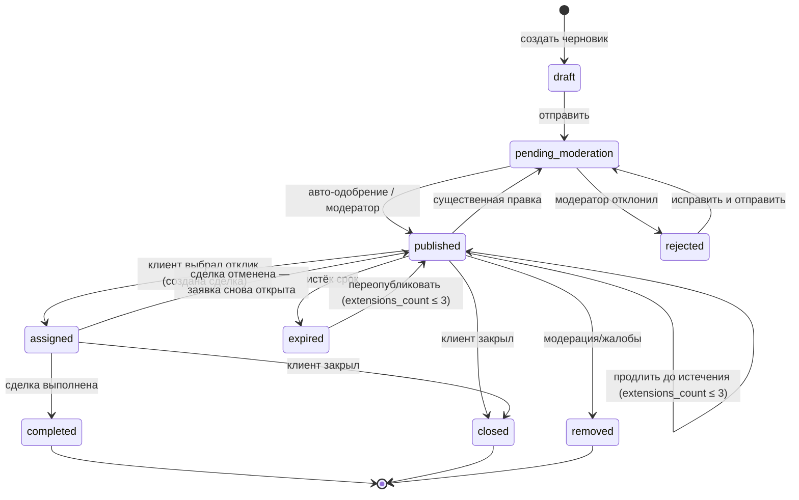

- Срок жизни `expires_at` зависит от срочности:

  | Срочность | Срок |
  |---|---|
  | `asap` | 24 ч |
  | `today` | до 23:59 текущего дня + 6 ч |
  | `this_week` | 7 дней |
  | `flexible` | 30 дней |

- **Продление:** `POST /jobs/{id}/extend` продлевает `published` до истечения (ещё один срок от текущего) или переопубликовывает `expired` (срок от момента продления); не больше 3 раз (`extensions_count`).
- Когда набирается `max_responses` активных откликов (по умолчанию **5**, настраивается по категории), приём откликов прекращается, но заявка остаётся `published`. Это защищает клиента от спама, а исполнителям показывает честные шансы («осталось 2 места», метка «откликнулся первым»). У Bark тоже не больше 5 откликов на заявку.
- **Правило публикации — одно на весь проект** ([§14.1](#141-конвейер-модерации-контента), уровни доверия — [§13.2](#132-аутентификация-и-авторизация)):
  - заявки, отклики и сообщения проходят правила (`content_rules`), затем omni-moderation, затем LLM-классификатор. Классификатор вызывается для пользователей уровня 0 и при любом флаге;
  - если всё чисто, контент публикуется сразу;
  - если есть флаг, классификатор не уверен или у категории `risk_level ≥ 1` — очередь модерации P2;
  - контент уровня 0 дополнительно выборочно проверяется после публикации;
  - профили исполнителей и портфолио новых профилей всегда проходят ручную проверку P2, прежде чем попасть в каталог.

  Это отход от рекомендации [research/06](research/06-trust-safety-growth-monetization.md#23-трение-и-лимиты) премодерировать первые публикации всех новых аккаунтов. Причина: срочные заявки приходят вечером, а ночью модераторов нет. Компенсация — лимиты для новичков, классификатор и пост-модерация ([ADR-0016](adr/0016-trust-safety-and-reviews.md)).

**Отклик (`jobs.responses.status`)**

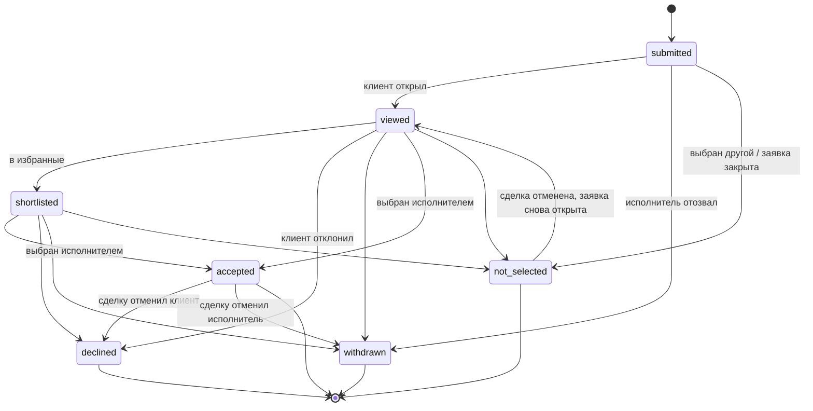

**Отмена сделки из отклика (`DealCancelled`).** Модуль `jobs` в одной транзакции:
- возвращает заявку в `published`;
- переводит отклики `not_selected` в `viewed` с причиной «сделка отменена», чтобы клиент мог выбрать прежних кандидатов;
- переводит отменённый `accepted` в `declined`, если отменил клиент, или в `withdrawn`, если исполнитель;
- пересчитывает `responses_count` — в нём только активные отклики (`submitted`, `viewed`, `shortlisted`).

Если при этом лимит `max_responses` уже исчерпан, новые отклики не принимаются, но выбрать можно из восстановленных.

**Сделка (`deals.deals.status`) и отзывы**

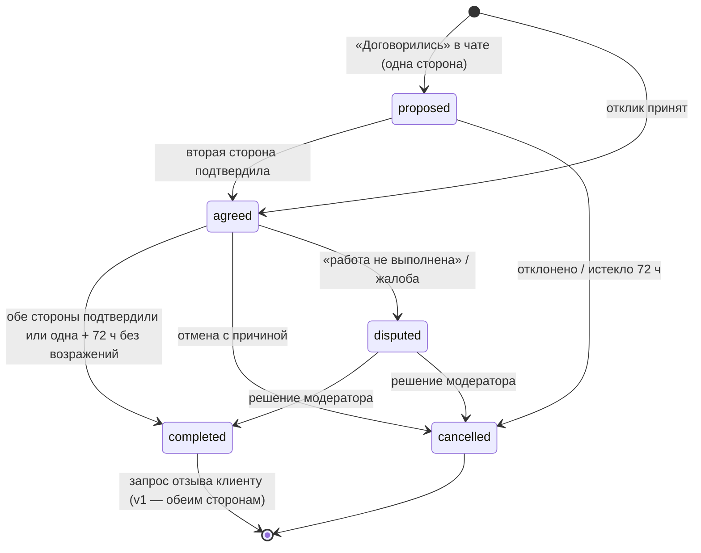

Отзывы:

- **Кто может оставить.** Отзыв можно оставить только по сделке в статусе `completed`. Сделку в статусе `cancelled` клиент может отметить как «не пришёл / не выполнил» — это отдельный сигнал в `moderation`, отзыва при этом нет.
- **Окно** — 14 дней после завершения. Напоминания — через 24 ч и за 2 дня до закрытия окна.
- **MVP: отзыв оставляет только клиент** о исполнителе. Отзыв создаётся со статусом `under_review` и публикуется сразу после автопроверок (правила, классификатор); при флаге уходит к модератору. Второго отзыва в MVP нет, поэтому скрывать первый было бы бессмысленно.
- **v1: double-blind.** Когда появляются оценки клиентов исполнителями, отзыв хранится со статусом `hidden`, пока не случится одно из двух: вторая сторона оставила свой отзыв или окно закрылось. Тогда оба отзыва публикуются одновременно, и отзывы не пишутся «в ответ» на чужую оценку.
- **Ответ.** Исполнитель может один раз публично ответить на отзыв (`reply_body`).
- **Показ рейтинга** — байесовское среднее `(C·m + Σr) / (C + n)`, где `m` — средний рейтинг по категории, `C = 5`. Пример при `m = 4,6`: одна «пятёрка» даёт 4,67, 40 отзывов со средним 4,8 дают 4,78. По этому же значению работает фильтр «рейтинг от». При `n < 3` вместо числа показывается «Новый специалист».
- **Ранжирование** — по нижней границе доверительного интервала с Dirichlet prior (`rating_lower_bound`). Так новичок не обгоняет опытного мастера за одну «пятёрку» ([§9.4](#94-ранжирование)).

**Профиль исполнителя** и **медиа**

| Сущность | Переходы статусов |
|---|---|
| Профиль | `draft` → `pending_review` → `published` ↔ `hidden` (сам скрыл); `published` → `suspended` (модерация). Правки опубликованного профиля применяются сразу, но отправляют новый контент на пост-модерацию |
| Медиа | `pending_upload` → `uploaded` → `processing` → `ready` / `failed` / `rejected` |

### 7.10. Soft delete, ретеншн и аудит

**Soft delete.** Удалённый пользователем объект получает `deleted_at` и сразу пропадает из выдачи. Физически удаляется или анонимизируется задачей ретеншна.

**Удаление аккаунта** (требование Telegram к ботам, App Store 5.1.1(v), Google Play, ZZPL). Есть уже в MVP ([ADR-0018](adr/0018-mvp-scope-anonymous-no-payments.md)):
1. Запрос из приложения, веб-оболочки или бота (`identity.deletion_requests`). Grace-период — 7 дней, запрос можно отменить.
2. Затем задача `identity.process_deletions`:
   - удаляет `auth_identities`, сессии, каналы уведомлений, телефон, аватар, медиа, сообщения, подписки, избранное;
   - заменяет имя на «Удалённый пользователь»;
   - удаляет написанные пользователем отзывы и пересчитывает рейтинги ([ADR-0016](adr/0016-trust-safety-and-reviews.md));
   - снимает профиль исполнителя с публикации и удаляет его вместе с отзывами о нём;
   - записывает HMAC телефона и Telegram ID в `identity.deleted_identity_hashes` на 12 месяцев.

   Повторная регистрация тем же номером или аккаунтом помечается сигналом риска `reregistered_after_deletion`. Данные при этом не восстанавливаются. Это закрывает «отмывание» рейтинга через удаление и новую регистрацию. Судьбу отзывов при удалении обсудить с юристом после MVP (§19.3).
3. **Legal hold.** Сущности, связанные с открытыми `moderation.cases` и `deals.disputes`, не удаляются до решения. Медиа: `media.purge_deleted` спрашивает порт `media.api.LegalHold` (реализует moderation — файлы-доказательства `cases.media_ids` и кейсы о самом файле; споры — с 6.1c) и откладывает удержанный файл на сутки.
4. Сохраняются только обезличенные сделки для статистики и записи, которые закон требует хранить:
   - бухгалтерские документы по покупкам;
   - журнал акцептов ToS и решения модерации — в пределах срока исковой давности.

   Эти записи хранятся с псевдонимизированным `user_id`.

**Как это устроено (2.12a).** identity исполняет запрос одной транзакцией на аккаунт: хэши способов входа, обезличенный `User` (имя «Удалённый пользователь», без способов входа и телефона), отзыв сессий и событие `UserDeleted`. Подписчики удаляют своё сами: specialists — профиль и портфолио (событие `ProfileDeleted`, на него подписан прайс в pricing и read-model поиска), media — все файлы владельца (задачей `media.discard_media`, как удаление владельцем), notifications — ленту, доставки, каналы и настройки, growth — атрибуцию. Legal hold аккаунта — порт `identity.api.DeletionHold`, его реализует moderation (открытые кейсы о пользователе); споры добавит 6.1c. Ключ HMAC — `APP_HASH_KEY`, на stage и проде обязателен.

**Матрица сроков хранения** (основания — [research/05 §1.9](research/05-legal-and-payments-serbia.md#19-сроки-хранения)):

| Данные | Срок | Основание |
|---|---|---|
| Бухгалтерские документы (покупки, чеки) | 5 лет | ст. 28 Zakon o računovodstvu |
| Главная книга / леджер платежей | 10 лет | там же |
| Акцепты ToS и согласия, решения модерации, жалобы | 3 года с момента, когда стало известно о вреде, но не более 5 лет | исковая давность (ст. 376 ZOO) |
| Аккаунт и профиль | до удаления + 7 дней grace + ≤ 30 дней в бэкапах | минимизация |
| Заявки и отклики | 24 месяца после закрытия, затем удаление или анонимизация | обосновать в реестре обработки |
| Переписка | 12 месяцев после последнего сообщения закрытого или неактивного диалога | минимизация ([ADR-0010](adr/0010-messaging-hybrid-chat.md)) |
| Контент, отклонённый модерацией | 6 месяцев (окно апелляции), затем удаление | апелляции ([§14.4](#144-отзывы-санкции-споры)) |
| HMAC телефона и Telegram ID удалённых аккаунтов | 12 месяцев | антифрод (законный интерес) **[Допущение]** |
| Документы верификации (v1, если хранятся у нас) | 30 дней после решения **[Допущение]** | минимизация (проверки Didit не храним вовсе) |
| Журналы безопасности и доступа | 12 месяцев | рекомендация |
| Выполненные задачи очереди | 7 дней | эксплуатация |
| Удалённые медиа | физическое удаление через 30 дней | эксплуатация |

Матрицу исполняет ночная задача `platform.retention_sweep` ([§12.3](#123-периодические-задачи)). Она пропускает сущности под legal hold.

**Аудит:**
- `platform.audit_log` (append-only) фиксирует:
  - действия модераторов и администраторов;
  - просмотр чувствительных данных (телефон, документы, переписка по жалобе);
  - смену ролей;
  - ручные начисления в `billing`;
  - повторное использование refresh-токена.
- Переходы статусов заявок и сделок пишутся в `*.status_history`.

Этого достаточно для разбора споров, для подсчёта затронутых записей при утечке (ZZPL, 72 ч) и для отчёта о прозрачности.

### 7.11. Модуль goods (после MVP, итерация «Вещи»)

Модель верхнего уровня — для итерации «Вещи» ([§20.5](#205-итерация-вещи-после-mvp)). В MVP схемы `goods` нет. Эскиз DDL пилота, индексы и триггерные проверки — [research/08 §6.7](research/08-goods-marketplace.md#67-модель-данных-верхнего-уровня), полный DDL пишется перед пилотом.

| Таблица | Назначение |
|---|---|
| `goods.listings` | Объявление: продавец, `seller_status` (`non_trader` / `trader`, `trader` — только с B2C), статус, `hidden_reason`, заголовок, описание, язык, категория (`catalog.categories`, `vertical='goods'`, составной FK), `attrs jsonb`, состояние, тип сделки (`sell` / `free`), цена в para, торг, город, район, `point_public`, способы передачи, обложка, `bumped_at`, `expires_at`, `sold_at`, `version`. В пилоте — ещё `category_path`, `search_vector` и `title_norm` для ленты и FTS без read-model, по образцу `jobs.jobs` |
| `goods.listing_media` | До 10 фото: ссылка на `media.assets`, порядок |
| `goods.sales` | Бронь и продажа: `listing_id`, `seller_id`, `buyer_id`, `conversation_id` (UUID без FK — `messaging` выше по DAG). Основание для обмена контактами и будущих отзывов. В интерфейсе — «покупка» и «продажа», слово «сделка» остаётся за услугами |
| `goods.favorites`, `goods.saved_searches` | Избранное и подписки на поиск (город, районы, категории, цена, `attr_tokens text[]`, сохранённый `tsquery`, режим `instant` / `digest`) — зеркало `jobs.alerts` |
| `goods.status_history` | Аудит переходов |
| `goods.listing_index` (стадия «Раздел») | Read-model выдачи: категории с предками, `attr_tokens[]`, цена, бейджи продавца, `sort_ts`, `title_norm`, `search_vector`, `card jsonb`. Индексы частичные |
| `goods.facet_counts` (стадия «Раздел») | Предвычисленные счётчики по городу и категории, пересчёт периодической задачей |

**Статусы.**

| Сущность | Значения |
|---|---|
| Объявление `listings.status` | `draft`, `pending_moderation`, `active`, `reserved`, `sold`, `expired`, `archived`, `rejected` |
| Скрытие `listings.hidden_reason` | `moderation`, `sanction`, `p0`, `legal` — флаг поверх `pending_moderation`, `active` и `reserved`, а не конечный статус. Снятие санкции или удовлетворённая апелляция возвращают объявление |
| Продажа `sales.status` | `reserved` → `completed` / `cancelled`, либо `sold_elsewhere` (без покупателя). Одна активная бронь и одна продажа на объявление — частичные уникальные индексы |

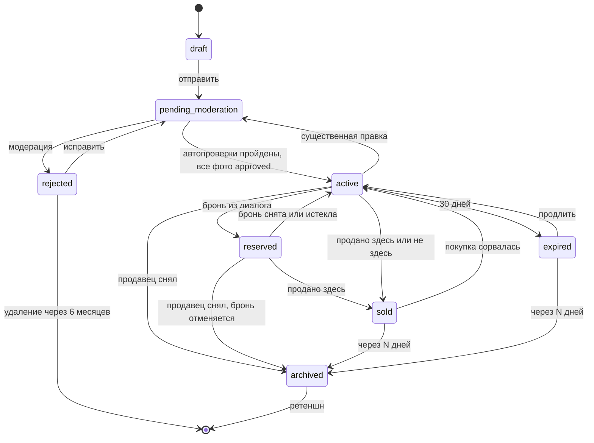

- **Инварианты.** `listings.status='reserved'` тогда и только тогда, когда есть `sales.status='reserved'`: отложенный constraint-триггер и одна транзакция. Лимит активных объявлений проверяется под `pg_advisory_xact_lock` по продавцу. Срок объявления не истекает, пока действует бронь. При бане или P0 во время брони бронь отменяется, а контакты больше не открываются.
- **Цена.** Хранится в para, основная цена — RSD, как в [§7.1](#71-соглашения). Рядом — справочный пересчёт в EUR и помощник «ввести в евро» по курсу NBS. Можно ли цену в EUR, как на KP, — вопрос юристу ([research/08 §10](research/08-goods-marketplace.md#10-открытые-вопросы-к-владельцу), п. 22). Тип сделки «обмен» в пилот не входит.
- **Ретеншн** (строки для матрицы [§7.10](#710-soft-delete-ретеншн-и-аудит) с запуском «Вещей-0», **[Допущение: сроки]**): закрытые объявления — 24 месяца, затем анонимизация; варианты фото закрытых объявлений — 30 дней после закрытия, оригиналы — вместе с объявлением; отклонённые и скрытые — 6 месяцев; `goods.sales` и решения по жалобам — в пределах исковой давности; избранное и поиски — до удаления. Legal hold действует, как для услуг.
- **Ссылки на удалённое.** Deep link `g_…` и `/g/<id>` показывают «объявление снято», поисковикам отдаётся 410.

---

## 8. API-дизайн

### 8.1. Стиль и соглашения

| Аспект | Решение |
|---|---|
| Стиль | REST поверх HTTPS, JSON. Ресурсы во множественном числе, действия над состоянием — подресурсы-глаголы (`POST /jobs/{id}/close`), когда переход state machine не сводится к PATCH |
| Контракт | OpenAPI 3.1 генерируется из кода backend и публикуется как артефакт CI. Типизированные клиенты для Mini App и мобильного приложения генерируются из него |
| Версионирование | Мажорная версия в пути: `/api/v1`. Внутри v1 изменения только аддитивные (новые поля и эндпоинты). Ломающее изменение = `/api/v2` параллельно, v1 живёт минимум 6 месяцев после выхода мобильного приложения. Устаревание сообщается заголовками `Deprecation` и `Sunset` |
| Клиент | Каждый запрос несёт `X-Client: tma/1.3.0` (или `ios/…`, `android/…`). По нему сервер решает про forced update и собирает статистику версий |
| Локализация | `Accept-Language: ru \| sr-Latn \| sr-Cyrl` (MVP), `en` — v1. Справочники приходят на этом языке. UGC — как есть, с полем `lang`; сербская кириллица при запросе `sr-Latn` конвертируется в латиницу |
| Идентификаторы | UUIDv7 в виде строк. Для deep links — base62-форма (22 символа) с префиксом типа ([§11.4](#114-deep-links)) |
| Даты | RFC 3339 в UTC (`2026-09-26T18:00:00Z`); клиент показывает в `Europe/Belgrade` |
| Деньги | `{"amount": 500000, "currency": "RSD"}` — в минимальных единицах; клиент форматирует |
| Идемпотентность | Заголовок `Idempotency-Key` обязателен для POST, создающих ресурсы или деньги (заявки, отклики, сообщения, покупки). Ответ кэшируется на 24 ч в `platform.idempotency_keys` |
| Конкурентность | Изменение агрегатов с `version` принимает `If-Match: "<version>"`, при конфликте — `412` |
| Rate limiting | Ответ `429` с `Retry-After`, плюс заголовки `RateLimit-Limit` / `RateLimit-Remaining` / `RateLimit-Reset` |
| Трассировка | `X-Request-ID` (генерируется, если не пришёл) и `traceparent` (W3C); `trace_id` возвращается в ошибках |

### 8.2. Аутентификация и сессии

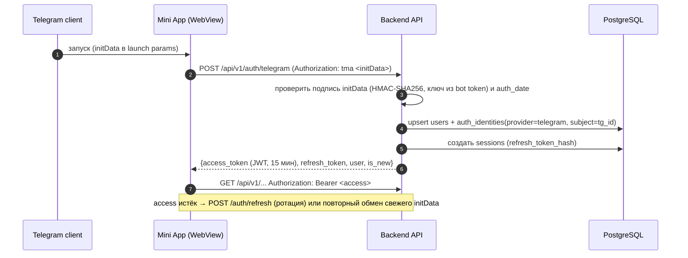

- **Обмен initData на собственную сессию** ([ADR-0009](adr/0009-authentication-and-identity.md)).
  - Проверяем подпись `hash`: `secret = HMAC_SHA256(key="WebAppData", msg=bot_token)`, сравнение в constant time. `auth_date` — не старше **1 часа**, допуск расхождения часов 60 с. `aiogram.utils.web_app` `auth_date` не проверяет, поэтому проверяем сами.
  - На каждом запросе initData не отправляем: строка большая, это bearer-секрет, а у мобильного приложения её нет.
  - Альтернативная проверка без токена бота (Ed25519 `signature`) описана в [отчёте по Telegram](research/02-telegram-platform.md#34-проверка-третьей-стороной-ed25519).
- **Access token** — JWT на 15 минут, подпись асимметричная (EdDSA или ES256; ключи ротируются, у каждого есть `kid`). Клеймы: `sub` (user id), `sid` (session id), `plat` (tma/ios/…), `amr` (способ входа, например `tg_webapp`), `tl` (trust level, [§13.2](#132-аутентификация-и-авторизация)), `roles` (только для персонала). Пользователь с активным ограничением `suspended` или `banned` (`identity.restrictions`) отсекается при refresh. Для немедленного отзыва `sid` попадает в denylist Valkey на время жизни access-токена.
- **Refresh token** — случайные 256 бит; в БД хранится только SHA-256. Токен ротируется при каждом использовании, а повторное использование старого токена отзывает всю цепочку сессии (детектор кражи). Срок: 30 дней для мобильных приложений, 7 дней для TMA.
- **Хранение на клиенте:**

  | Клиент | Access token | Refresh token |
  |---|---|---|
  | Mini App | В памяти | Только в памяти, живёт до закрытия приложения. Нужен, чтобы продлевать сессию, пока Mini App открыт или свёрнут дольше часа. При каждом запуске — новый обмен свежего initData |
  | Мобильное приложение | В памяти | iOS Keychain / Android Keystore |

  Cookies не используем. Mini App ходит в API по тому же origin (`app.<domain>/api/*`), поэтому нет CORS и preflight-запросов. Отдельно: правило Bot API 10.2 требует, чтобы сам SPA Mini App жил на одном origin (методы `Telegram.WebApp.*` недоступны со страниц чужого домена). На обычные API-запросы оно не распространяется.

- **Задел под App Store** — те же `sessions`, другие провайдеры в `auth_identities`:

  | Эндпоинт | Назначение |
  |---|---|
  | `POST /auth/apple` | Sign in with Apple: `identity_token` → проверка JWKS Apple |
  | `POST /auth/google` | Google Sign-In |
  | `POST /auth/phone/start`, `POST /auth/phone/verify` | OTP через Telegram Gateway или SMS |
  | `POST /auth/telegram/oidc` | «Войти через Telegram» в нативном приложении: официальный SDK (OIDC, Authorization Code + PKCE, обмен кода на backend). Связь с аккаунтом Mini App — по claim `id` (**[Допущение]**: совпадает с `user.id` Bot API, проверить на тестовом аккаунте) |
  | `POST /auth/telegram/link/start` → бот → `POST /auth/telegram/link/complete` | Запасной вариант привязки Telegram без OIDC: deep link `t.me/<bot>?start=link_<nonce>` |

- **Слияние аккаунтов.** Если новый провайдер уже привязан к другому пользователю, запускается процедура merge. Выполняется она только после подтверждения владения обоими способами входа.

### 8.3. Формат ошибок (RFC 9457 Problem Details)

```json
{
  "type": "https://api.<domain>/problems/validation-error",
  "title": "Validation failed",
  "status": 422,
  "code": "validation_error",
  "detail": "Бюджет «до» меньше бюджета «от»",
  "errors": [{"field": "budget.max", "code": "lt_min", "message": "Должно быть ≥ 3000 RSD"}],
  "trace_id": "4bf92f3577b34da6a3ce929d0e0e4736"
}
```

- `code` — стабильный машинный код: клиент ветвится по нему, а не по тексту.
- `detail` и `message` локализуются по `Accept-Language`.
- Коды ответов:

  | Код | Когда |
  |---|---|
  | 400 | Синтаксис |
  | 401 | Нет или истёк токен |
  | 403 | Нет прав или действует санкция: `code: "restricted"`, `restriction: "posting_blocked"`, `until` |
  | 404 | Ресурс не найден |
  | 409 | Конфликт state machine, например `job_not_open` |
  | 412 | Версия устарела |
  | 422 | Валидация |
  | 426 | Нужен апдейт клиента |
  | 429 | Лимит |
  | 503 | Техработы: `code: "maintenance"`, `Retry-After`; флаг `platform.maintenance` в client-config, сам `/client-config` отвечает и в техработы |
  | 5xx | Сбой; без деталей, с `trace_id` |

### 8.4. Пагинация, фильтры, сортировка

- **Курсорная (keyset) пагинация** по умолчанию: `?limit=20&cursor=<opaque>` → `{"items": [...], "next_cursor": "..."}`. Курсор — base64url от ключа сортировки (`published_at, id`); он стабилен при вставках.
- **Поиск с сортировкой по релевантности** использует offset-пагинацию с потолком: `?page=3`, максимум 500 результатов **[Допущение]**. Пользователи дальше не листают, а keyset по плавающему score нестабилен.
- **Фильтры** — плоские query-параметры, списки через запятую: `?category=57&district=12,14&lang=ru,sr&price_max=300000&rating_min=4&modes=at_client&available_today=true&verified=true`.
- **Гео:** `?near=45.2464,19.8517&radius_km=5` (lat,lon). `sort=distance` требует `near`.
- **Сортировка:** `sort=relevance|rating|distance|price|newest`.

### 8.5. Основные эндпоинты по модулям

Путь — относительно `/api/v1`. 🔓 — доступно без авторизации (гость: каталог, профили, публичные заявки; нужно для шаринга и будущего веба), остальное требует токен.

**identity**

| Метод и путь | Назначение |
|---|---|
| `POST /auth/telegram` 🔓 | Обмен initData на сессию |
| `POST /auth/refresh` 🔓, `POST /auth/logout` | Ротация refresh token; выход |
| `POST /auth/apple`, `/auth/google`, `/auth/phone/*`, `/auth/telegram/oidc`, `/auth/telegram/link/*` | Этап 2 (App Store) |
| `GET /me`, `PATCH /me` | Текущий пользователь, возможности (`can_post_jobs`, `has_profile`), флаги; имя, язык, город |
| `POST /me/consents` | Принятие правил площадки (с 18+) и политики; v1 — полный журнал согласий (аналитика, маркетинг, AI) |
| `PATCH /me/privacy` | Приватность: показывать ли Telegram и телефон после договорённости (`identity.users.privacy`) |
| `POST /me/phone/verify-telegram` | Подтверждение телефона контактом из Telegram (`requestContact`) — добровольный бейдж, повышает `trust_level` |
| `GET /me/blocks`, `PUT /me/blocks/{user_id}`, `DELETE /me/blocks/{user_id}` | Блокировки пользователей |
| `POST /me/deletion`, `DELETE /me/deletion` | Запрос и отмена удаления аккаунта |
| `POST /me/data-export` | Выгрузка данных (ZZPL): v1; в MVP — вручную по запросу в поддержку ([ADR-0018](adr/0018-mvp-scope-anonymous-no-payments.md)) |
| `GET /client-config` 🔓 | Минимальные версии клиентов, feature flags, версии юрдокументов и их тексты по языкам (S48, `legal_documents`), лимиты загрузки |

**catalog / geo / search**

| Метод и путь | Назначение |
|---|---|
| `GET /categories` 🔓 | Дерево категорий с `price_hint` для подсказки цены (кэшируется, ETag) |
| `GET /cities` 🔓, `GET /cities/{id}/districts` 🔓 | Справочники гео |
| `GET /geo/resolve?lat=&lon=` 🔓 | Точка → город и район |
| `GET /suggest?q=` 🔓 | Автодополнение: категории, теги, «популярные запросы» |
| `GET /specialists` 🔓 | Поиск по каталогу (фильтры и сортировки из 8.4) → карточки |
| `GET /specialists/count` 🔓 | Сколько найдёт выдача с теми же фильтрами — «Показать N» в шторке S06 (до 1000) |
| `GET /specialists/by-category?city_id=` 🔓 | Видимые специалисты города по категориям (с подкатегориями) — дерево S04; кэш 5 минут |
| `GET /specialists/{id}` 🔓 | Публичный профиль S08 одним запросом (BFF `interfaces/http/views`): профиль, первые три позиции прайса и три работы, рейтинг, бейджи; ETag, `max-age=60`. Скрытый, снятый санкцией или удалённый профиль — 404 без объяснения, как в поиске |
| `GET /specialists/{id}/services` 🔓, `GET /specialists/{id}/portfolio` 🔓 | Весь прайс с группами (S09) и все готовые работы (S10) одним ответом: прайс — до 50 позиций, работ — в пределах лимита портфолио |
| `GET /specialists/{id}/reviews?kind=deal\|pre_platform` 🔓 | Отзывы S11 (BFF): рейтинг с гистограммой и средними по критериям из `reviews.rating_aggregates`; сами отзывы постранично и `kind` — с 7.2 и 7.6, до того список пуст. Скрытый профиль — 404 |
| `GET /me/favorites`, `PUT /me/favorites/profile/{id}`, `DELETE /me/favorites/profile/{id}` | Избранное: «мои мастера» S12 — карточки, как в выдаче, только видимые в каталоге, новые первыми; до 100 (`favorites_full`); повтор и удаление отсутствующего — без ошибки |
| `GET /me/favorites/jobs`, `PUT /me/favorites/job/{id}`, `DELETE /me/favorites/job/{id}` | Сохранённые заявки (5.3): сердечко S15, сегмент «Задачи» S12 — карточки, как в ленте, только открытые (опубликована, публична, срок не вышел), новые сохранения первыми; сохранить можно видимую опубликованную (иначе 404); до 100 (`saved_jobs_full`); повтор и удаление отсутствующего — без ошибки. Модуль `jobs` (`jobs.saved_jobs`): карточка и видимость заявки — у него |
| `GET /me/saved-searches`, `POST /me/saved-searches`, `DELETE /me/saved-searches/{id}` | v1: сохранённые поиски с уведомлением |
| `GET /price-benchmarks?category=&city=` 🔓 | Ценовые ориентиры (v1) |

**specialists / pricing** (кабинет исполнителя)

| Метод и путь | Назначение |
|---|---|
| `POST /me/profile` | Создать профиль (`kind`: `pro` или `casual`) |
| `GET /me/profile`, `PATCH /me/profile` | Свой профиль и его правка |
| `POST /me/profile/submit` | Отправить на проверку и публикацию |
| `POST /me/profile/hide`, `POST /me/profile/show` | Скрыть или вернуть в каталог |
| `PUT /me/profile/categories`, `PUT /me/profile/areas` | Категории, районы выезда |
| `PUT /me/profile/availability` | «Доступен сегодня до 20:00», отпуск, рабочие часы (v1) |
| `GET /me/profile/services`, `POST /me/profile/services`, `PATCH /me/profile/services/{id}`, `DELETE /me/profile/services/{id}` | Прайс-лист |
| `PUT /me/profile/services/order` | Порядок позиций прайса |
| `POST /me/profile/portfolio`, `PATCH /me/profile/portfolio/{id}`, `DELETE /me/profile/portfolio/{id}` | Портфолио |
| `GET /me/profile/stats` | Просмотры, обращения, отклики, конверсия (v1) |
| `POST /me/profile/declaration` | v1: декларация исполнителя — `trader_status`, право работать в Сербии, налоги |
| `POST /me/profile/review-invites` | Ссылка-приглашение прошлому клиенту на «отзыв до платформы» (не больше 5 на профиль) |

**media**

| Метод и путь | Назначение |
|---|---|
| `POST /media/uploads` | Инициировать загрузку: `{purpose, mime_type, size_bytes}` → `{media_id, multipart, part_size, parts: [{part_number, url, headers}], expires_at}`: один presigned PUT (`part_number = null`) или план multipart для видео больше 50 MB |
| `POST /media/uploads/{id}/parts` | Новые presigned URL: `{part_numbers?}` — нужные части, без номеров — все (ссылка истекла, обрыв) |
| `POST /media/uploads/{id}/complete` | Завершить загрузку: `{parts: [{part_number, etag}]}` (у одного PUT — пусто) → HEAD-проверка → обработка. Недостающие части — 409 `media_upload_incomplete` с `missing_parts` |
| `GET /media/{id}` | Статус и варианты (для поллинга после загрузки); у ролика — ещё `video` и `duration_ms` |
| `DELETE /media/{id}` | Удалить своё медиа |

**jobs** (доска заявок и отклики)

| Метод и путь | Назначение |
|---|---|
| `POST /jobs` | Создать заявку — сразу на проверку (`pending_moderation`) или уже `published`; черновик хранит клиент (5.2) |
| `POST /jobs/parse` | v1: свободный текст или голос → черновик заявки (категория, срочность, бюджет, район) |
| `GET /jobs` 🔓 | Лента доски: `city_id`, `category` (с подкатегориями), `district`, `lat` + `lon` + `radius_km`, `urgency`, `budget_from`, `lang`, `has_photos=true`, курсор; свежие сверху; свои и скрытые зрителем — нет; `feed=alerts` (по моим подпискам) — с 5.7 |
| `GET /jobs/count` 🔓 | Сколько заявок с теми же фильтрами: «Показать N» S14; `new_hours` — «N новых задач рядом» на Главной |
| `GET /jobs/{id}` 🔓 | Детали, фото и `viewer_role` (`owner` / `viewer`); блок клиента — имя, «в «Соседях» с…», сколько заявок публиковал; гость и исполнитель видят опубликованную заявку со смещённой точкой; точная точка и адрес — владельцу и выбранному исполнителю; исполнителю — его отклик `my_response` (`id`, `status`, `review`): MainButton «Вы откликнулись» на S15 (5.5); прямой запрос — только приглашённым; вошедший не владелец — просмотр (не чаще раза в сутки от человека), `views_count` — владельцу (S23, 5.6) |
| `PATCH /jobs/{id}` | Правка владельцем (существенные правки → повторная модерация) |
| `POST /jobs/{id}/close`, `/extend` | Переходы state machine: закрыть с причиной; продлить `published` до истечения или переопубликовать `expired` (не больше 3 раз). Отдельного `submit` нет: заявка создаётся отправленной. Возврат в `published` после отмены сделки происходит автоматически по событию `DealCancelled` |
| `POST /jobs/{id}/invites`, `GET /jobs/{id}/invites` | Пригласить специалистов из каталога в свою открытую заявку (S21, S23; 5.6): `{profile_ids}`, до 10 на заявку (409 `job_invites_full`), повтор — без дублей; профиль скрыт, удалён или автор под санкцией — 404 `invitee_not_found`, свой — 409 `own_profile_invite`. Новому приглашённому — уведомление `job.invited`. `GET` — кого пригласили, по порядку |
| `DELETE /jobs/{id}` | Удалить (soft) |
| `POST /jobs/{id}/hide` | «Не интересно» — скрыть из своей ленты |
| `GET /me/jobs?status=` | Заявки клиента (S22), новые первыми; `new_responses` — отклики, которых он ещё не видел (бейдж), то же поле у `GET /jobs/{id}` владельцу |
| `POST /jobs/{id}/responses` | Откликнуться (5.4, Idempotency-Key): `{message, price_type, price_amount, availability_note, template_id?}` — из своего шаблона отклик хранит его id (чужой — 404 `response_template_not_found`); профиль — опубликованный профиль специалиста автора, если есть. Пять мест на заявку под блокировкой её строки; 409 `job_not_open`, `own_job`, `already_responded`, `job_full`; суточный лимит по уровню доверия — 429. Текст — на проверку: клиент видит отклик после неё |
| `GET /me/response-templates`, `POST /me/response-templates` (Idempotency-Key), `PATCH /me/response-templates/{id}`, `DELETE /me/response-templates/{id}` | Шаблоны откликов (5.5): не больше двух, по порядку, первый — основной (S16 подставляет его сразу), `limit` — «1 из 2» на S57; третий — 409 `response_templates_full`; `PATCH` — название, предложение целиком (`message` и `price_type` вместе), `primary: true` — «Сделать основным»; после удаления основным становится следующий. Оба шаблона доступны кнопками прямо в уведомлении бота (отклик в один тап, callback `jr:<job>:<tpl>`, id в base62) |
| `GET /jobs/{id}/responses` | Отклики на свою заявку (владелец; чужая — 404): прошедшие проверку, по порядку, с `is_first` — «Откликнулся первым» |
| `GET /jobs/{id}/response-cards` | BFF S23 (`interfaces/http/views/my_job.py`, 5.6): те же отклики карточками — исполнитель из specialists (профиль, основной район, фото), reviews (рейтинг или «Новый»), identity (имя подработчика, «Телефон подтверждён»), `is_new` — новые для клиента. Ответ отмечает отклики просмотренными (`responses_seen_at`, мимо версии заявки): бейдж S22 гаснет, `response.received` о них не уходит. S23 опрашивает раз в 15 секунд |
| `GET /me/responses?status=` | Мои отклики (исполнитель): группы чипов S17 — `active`, `accepted`, `not_selected`, `archive`; страницы по курсору, `counts` по группам, `today` — «сегодня откликов: 3 из 50» |
| `GET /responses/{id}` | Свой отклик с заявкой — форма правки S16 (5.5); чужой — 404 |
| `PATCH /responses/{id}`, `POST /responses/{id}/withdraw` | Правка и отзыв отклика исполнителем, пока клиент не решил (иначе 409 `response_not_active`); правка — снова на проверку; версия заявки растёт |
| `POST /responses/{id}/shortlist`, `/decline`, `/accept` | Действия клиента; `accept` → создаёт сделку, возвращает `deal_id` |
| `GET /me/job-alerts`, `POST /me/job-alerts`, `PATCH /me/job-alerts/{id}`, `DELETE /me/job-alerts/{id}` | Подписки на новые заявки |
| `POST /specialists/{id}/requests` | Прямой запрос специалисту из каталога (S08, S09; 5.6, Idempotency-Key): тело — как у `POST /jobs`, заявка с `visibility=direct` и приглашением этого профиля; модерация — та же, после публикации специалисту `job.invited`. Видят её только клиент и приглашённые: остальным — 404, в ленте её нет, откликнуться может только приглашённый |

**deals / reviews**

| Метод и путь | Назначение |
|---|---|
| `GET /me/deals?role=client\|performer&status=`, `GET /deals/{id}` | Сделки |
| `POST /conversations/{id}/deal` | «Договорились» из чата → сделка `proposed` |
| `POST /deals/{id}/confirm` | Вторая сторона подтверждает договорённость |
| `POST /deals/{id}/complete`, `/cancel`, `/dispute` | Выполнено / отмена с причиной / спор |
| `POST /deals/{id}/review` | Оставить отзыв: оценка, критерии, текст; фото — v1 |
| `POST /reviews/{id}/reply` | Публичный ответ исполнителя |
| `GET /review-invites/{token}` 🔓, `POST /review-invites/{token}` | Форма «отзыва до платформы» по приглашению (вход через Telegram обязателен, отдельная метка, в рейтинг не входит) |
| `GET /me/reviews?direction=received\|written` | Мои отзывы |

**messaging**

| Метод и путь | Назначение |
|---|---|
| `GET /conversations` | Список диалогов с последним сообщением и счётчиком непрочитанных |
| `POST /conversations` | Начать диалог: `{response_id}` или `{profile_id}` для прямого обращения |
| `GET /conversations/{id}/messages?cursor=&direction=older\|newer` | История |
| `POST /conversations/{id}/messages` | Отправить `{client_msg_id, kind, body, media_id?}` |
| `POST /conversations/{id}/read` | Отметить прочитанным до `message_id` |
| `POST /conversations/{id}/share-contact` | Поделиться своим Telegram-контактом или телефоном. Доступно только при сделке в статусе `agreed`, до этого `409 contacts_locked` ([§11.5](#115-переписка-модель-чата)) |
| `GET /realtime` | v1: SSE-поток событий `message.new`, `message.read`, `response.new`, `deal.updated` (авторизация — [§11.6](#116-realtime)) |

**notifications**

| Метод и путь | Назначение |
|---|---|
| `GET /me/notifications?limit=&cursor=`, `POST /me/notifications/read` | Центр уведомлений: `{items: [{id, type, title, body, link, created_at, read}], next_cursor, unread_count}` на языке Accept-Language; прочитать — `{ids}` или `{all: true}` → `{unread_count}` |
| `GET /me/notification-settings`, `PUT /me/notification-settings` | Группы × каналы (`notifications.preferences`: `{group, telegram, in_app, mandatory}`), тихие часы и час дайджеста (`notifications.user_settings`), может ли бот писать. PUT заменяет целиком; служебную группу выключить нельзя — 422 `notification_group_mandatory` |
| `POST /me/telegram/write-access` | Mini App сообщает, что пользователь разрешил боту писать (`requestWriteAccess`) |
| `POST /me/push-devices`, `DELETE /me/push-devices/{id}` | Этап 2: токены APNs/FCM |

**moderation** (пользовательская часть)

| Метод и путь | Назначение |
|---|---|
| `POST /reports` | Жалоба: `{target_type, target_id, reason, comment}` |
| `POST /me/verification`, `GET /me/verification` | Верификация и её статус: телефон — MVP; документ (KYC), бизнес и лицензия — v1 |
| `POST /appeals` | Обжалование решения модерации (MVP: кнопки «Обжаловать» есть в уведомлениях о санкциях) |
| `POST /deals/{id}/dispute` | Спор по сделке (см. deals / reviews): вторая сторона отвечает в течение 48 ч |

**billing** (v1, после MVP — [ADR-0018](adr/0018-mvp-scope-anonymous-no-payments.md))

| Метод и путь | Назначение |
|---|---|
| `GET /billing/products?channel=telegram_stars` | Витрина: планы и бусты с ценой в канале клиента |
| `POST /billing/checkout` | `{price_id, target?}` → в v1 только Stars: `invoice_link` (Mini App вызывает `openInvoice`). Оплата картой через веб — этап 2 / после юрлица |
| `GET /me/subscription`, `GET /me/entitlements`, `GET /me/purchases` | Состояние подписки, права и квоты, история покупок |
| `POST /billing/apple/transactions`, `POST /billing/google/purchases` | Этап 2: подтверждение IAP |

**growth**

| Метод и путь | Назначение |
|---|---|
| `GET /me/referral` | Код, ссылка, статистика приглашений |
| `POST /share` | `{entity_type, entity_id}` → deep link и `prepared_message_id` для `shareMessage` |

**goods** (после MVP, итерация «Вещи»; эскиз ресурсов, контракт фиксируется в OpenAPI перед «Вещами-0»; все ресурсы — под флагом `goods.enabled`)

| Ресурс | Назначение |
|---|---|
| `/goods/listings` 🔓 (чтение), `/goods/listings/{id}` 🔓 | Лента и поиск: город, район, категория, цена, состояние; keyset по `(sort_ts, id)` с моментом первого запроса, чтобы подъём объявлений не давал дублей. Карточка объявления (BFF) с живым статусом. Чтение идёт через пул `app_goods_read`. В стадии «Раздел» — фильтры по атрибутам и фасеты |
| `/goods/listings` (запись), `/goods/listings/{id}/…` | Подача, правка (существенная — повторная модерация), переходы state machine: отправить, продлить, поднять, «продано здесь / не здесь», снять ([§7.11](#711-модуль-goods-после-mvp-итерация-вещи)) |
| `/me/goods/listings`, `/me/goods/favorites`, `/me/goods/saved-searches` | Мои объявления, избранное, сохранённые поиски (пилот и дальше) |
| `/conversations` с `{listing_id}`, команда брони в диалоге | Диалог «объявление × покупатель» и «Забронировать» — ресурсы `messaging`, которые вызывают фасад `goods` (пилот). В «Вещах-0» своего чата нет: покупатель пишет продавцу в Telegram напрямую |

Существующие ресурсы получают новые значения: `POST /media/uploads` — `purpose='listing'`, `POST /reports` — `target_type='listing'`, `POST /share` — `entity_type='listing'`. В MVP нового API для вещей нет: opt-in на S58 сохраняется через `PUT /me/notification-settings` ([§20.5](#205-итерация-вещи-после-mvp)).

**Интеграции (не публичные)**

| Метод и путь | Назначение |
|---|---|
| `POST /integrations/telegram/webhook` | Updates бота; проверка заголовка `X-Telegram-Bot-Api-Secret-Token` |
| `POST /integrations/apple/notifications`, `/integrations/google/rtdn`, `/integrations/psp/{name}` | Вебхуки платёжных каналов (этап 2 / v1) |

**Admin API** (`/admin/api/v1`, роли `moderator` / `support` / `admin`, отдельный аудит)

| Путь | Назначение |
|---|---|
| `/cases` | Очередь модерации: взять, решить, эскалировать |
| `/users/{id}` | Карточка пользователя со всей активностью, санкции |
| `/reports` | Жалобы |
| `/verification-requests` | Проверка документов |
| `/categories`, `/tags`, `/search-terms`, `/cities`, `/districts` | Справочники |
| `/content-rules` | Стоп-слова и правила |
| `/broadcasts` | Объявления через бота с учётом лимитов |
| `/audit-log` | Журнал действий |
| `/feature-flags`, `/client-config` | Флаги и конфигурация клиентов |

### 8.6. Пример: карточка специалиста в выдаче

```json
{
  "id": "0192f3a1-7c2e-7b8a-9f10-3c2d1e0f4a5b",
  "kind": "pro",
  "display_name": "Алексей М.",
  "headline": "Электрик, 12 лет опыта. Люстры, розетки, щитки",
  "avatar": {"url": "https://cdn.<domain>/m/…/thumb.webp", "placeholder": "3OcRJYB4d3h/iIeHeEh3eIhw+j2w"},
  "categories": [{"id": 57, "name": "Электрик"}],
  "district": {"id": 14, "name": "Лиман"},
  "languages": ["ru", "sr", "en"],
  "work_modes": ["at_client"],
  "price_from": {"amount": 250000, "currency": "RSD", "unit": "visit"},
  "rating": {"value": 4.9, "count": 37},
  "badges": ["phone_verified"],
  "available_today": true,
  "promoted": false,
  "distance_m": 2000
}
```

`distance_m` считается от публичной точки профиля (`base_point_public`) и округляется до 500 м, чтобы по серии запросов с разными `near=` нельзя было вычислить адрес специалиста ([§7.6](#76-гео)). `badges` без `id_verified` в MVP: KYC — v1.

### 8.7. Контрактное тестирование и SDK

- Схема OpenAPI проверяется в CI: `oasdiff` (или аналог) ищет ломающие изменения относительно `main` и роняет сборку, если изменение не аддитивное.
- Клиенты (`packages/api-client` в монорепо фронтенда) генерируются из схемы при каждом изменении. Mini App и будущее мобильное приложение используют один и тот же пакет.
- На каждый публичный эндпоинт есть хотя бы один тест уровня API: happy path, права доступа, валидация.

---

## 9. Поиск и фильтрация

Решение — [ADR-0006](adr/0006-search-in-postgresql.md). Замеры, SQL и конфигурации проверены в лаборатории: [research/07](research/07-postgres-lab-and-infra.md), [lab/](research/lab/README.md).

### 9.1. Сценарии и где они живут

| Сценарий | Модуль и данные | Индексы | Замер (лаборатория, тёплое соединение) |
|---|---|---|---|
| Каталог специалистов: фильтры, сортировка, keyset | `search.specialist_index` (read-model) | GIN `category_ids`, btree `(city_id, score DESC, profile_id DESC)`, GIN `district_ids` | 0,15–0,8 мс; через JOIN — в 2,5–5 раз медленнее |
| Каталог по радиусу или ближайшие | Та же read-model | GiST `base_point` | радиус 5 км — 1,3 мс; KNN — 0,1–0,8 мс |
| Каталог со свободным текстом | Та же read-model + таксономия | GIN `search_vector` | 2–4 мс; худший случай («ремонт» по всей стране) — 16 мс |
| Лента доски заявок | `jobs.jobs` | Частичные индексы `WHERE status = 'published'` | 0,01–0,4 мс; радиус — 1,4 мс |
| Персональная лента по подпискам | `jobs.jobs` + развёрнутые подписки | Частичный `(category_id, published_at DESC, id DESC)` | 0,26 мс (наивный EXISTS — 19 мс) |
| Матчинг новой заявки с подписками | `jobs.alerts` | GIN по массивам, GiST по `area` | 0,9 мс на 317 подписчиков из 74k |
| Автодополнение и «возможно, вы имели в виду» | `catalog.search_terms` | btree `norm` (префикс), GiST trgm | 0,007–0,2 мс |

**Как обновляется read-model (4.1).** Подписчики событий профиля, прайса, каталога, санкций, удаления аккаунта и готового фото профиля только отмечают профили в `search.pending_profiles`: строка на профиль, в ней самое раннее событие для метрики лага. Пересобирает одна задача `search.flush_index` на всех (dedup: пока она ждёт, вторая не ставится). Пачка до 200 профилей берётся под `SKIP LOCKED`; строки собираются через фасады модулей ниже по DAG несколькими запросами на пачку; upsert, удаление лишних строк и снятие отметок идут одной транзакцией. В индексе только опубликованные профили, чей автор не удалён и не скрыт санкцией (приостановка, бан, теневой бан). У срочной санкции пересборка ставится на её конец (`search.reindex_profiles`). Ночная `search.reconcile_index` отмечает все опубликованные профили и все строки индекса; `cli reindex --all` делает то же и пересобирает в процессе CLI. Лаг — гистограмма `search_index_lag_seconds`; бенчмарк 1 000 событий разом — p95 4,7 с. Фото в карточке — `media_id` и плейсхолдер: ссылку с коротким сроком строит выдача (4.2). Рейтинг (7.2), бейджи и фильтр «проверенные» (v1) пока пустые.

### 9.2. Конвейер запроса каталога

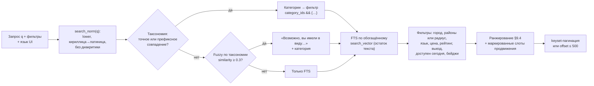

- **Порядок этапов (4.2).** Запрос целиком или его начало в словаре → FTS (AND → префикс → OR, имя — по триграммам) → ближайшее слово словаря («Возможно, вы имели в виду»). Нечёткое совпадение — последним: имя мастера или редкое слово прайса FTS находит точнее похожей категории. Курсор следующей страницы хранит этап, которым найдена первая. Слово есть и у раздела, и у его услуги («грузчики» — «Переезды» и «Грузчики») — выдача по услуге: раздел смешал бы все свои услуги (4.3b).
- **Нулевая выдача.** Сначала мягкий fallback: AND → префиксный `слово:*` → OR. Если результатов всё равно нет, показываем подсказки: «ослабьте фильтры», «разместите заявку — мастера откликнутся сами». Запрос пишется в `search.query_log` для пополнения таксономии; еженедельный разбор — `cli query-log-report` (самые частые написания, языки, подсказка, сколько раз пустоту дали фильтры).
- **Язык запроса.** Интерпретации ru, sr и en объединяются через OR. Язык UI даёт своей интерпретации больший вес в ранжировании.

### 9.3. Обработка текста

Функции проверены в лаборатории (`lab/sql/03_search_functions.sql`). Файлы словарей не нужны, поэтому всё работает и на managed-сервисах.

```sql
-- IMMUTABLE-обёртка: сам unaccent() STABLE и в индексах/generated columns падает
CREATE FUNCTION public.f_unaccent(text) RETURNS text LANGUAGE sql IMMUTABLE PARALLEL SAFE STRICT
  RETURN public.unaccent('public.unaccent'::regdictionary, $1);

-- сербская кириллица → латиница (однозначно; диграфы lj/nj/dž)
CREATE FUNCTION public.sr_cyr2lat(t text) RETURNS text LANGUAGE sql IMMUTABLE PARALLEL SAFE STRICT
  RETURN replace(replace(replace(replace(replace(replace(
    translate(t, 'абвгдђежзијклмнопрстћуфхцчшАБВГДЂЕЖЗИЈКЛМНОПРСТЋУФХЦЧШ',
                 'abvgdđežzijklmnoprstćufhcčšABVGDĐEŽZIJKLMNOPRSTĆUFHCČŠ'),
    'љ','lj'),'њ','nj'),'џ','dž'),'Љ','Lj'),'Њ','Nj'),'Џ','Dž');

-- сербская FTS-конфигурация без диакритики: «elektricar» = «električar» = «електричар»
CREATE TEXT SEARCH CONFIGURATION public.sr_unaccent (COPY = pg_catalog.serbian);
ALTER TEXT SEARCH CONFIGURATION public.sr_unaccent
  ALTER MAPPING FOR word, hword, hword_part, asciiword, asciihword, hword_asciipart
  WITH public.unaccent, pg_catalog.serbian_stem;

-- запрос: OR интерпретаций на трёх языках
CREATE FUNCTION public.q_all(q text) RETURNS tsquery LANGUAGE sql IMMUTABLE PARALLEL SAFE STRICT
  RETURN websearch_to_tsquery('pg_catalog.russian', q)
      || websearch_to_tsquery('public.sr_unaccent', public.sr_cyr2lat(q))
      || websearch_to_tsquery('pg_catalog.english', q);
```

**Документ поиска специалиста** (`search_vector`) собирается при обновлении read-model:

| Вес | Состав |
|---|---|
| A | Имя; названия категорий профиля на ru, sr-Latn, en |
| B | Синонимы категорий из таксономии |
| C | Заголовки услуг прайса |
| D | Текст «о себе» (конфигурация по `content_lang`; сербский предварительно проходит `sr_cyr2lat`). Пока `content_lang` не заполняется, «о себе» и прайс идут и в русскую, и в сербскую конфигурацию |

Обогащение названиями категорий поднимает полноту межъязыкового поиска с ~52% до 100% (лаборатория, запрос «электрик»).

**Правила:**
- `ts_rank_cd` считается по тому же tsquery, что и фильтр; нормализация 32 даёт значения 0..1 для смешивания с другими сигналами.
- Сербские стоп-слова (`i, u, za, na, od, do, sa, se, je, da, ili, po, pri, kod`) вырезаются в приложении до построения запроса.
- **`đ` → `dj` до FTS.** Перед `to_tsvector` и `websearch_to_tsquery` сербский текст (и документ, и запрос) проходит замену `đ` → `dj` (`Đ` → `Dj`). Иначе `unaccent` превратит `đ` в `d`, и «gradjevina» не совпадёт с «građevina». Ключ `search_norm()` для pg_trgm и автодополнения делает ту же замену; полный текст функции — в `lab/sql/03_search_functions.sql`.
- Поиск по имени идёт по хранимой колонке `name_norm` с GiST trgm, а не по выражению (выражение — 9 мс из-за пересчёта).

### 9.4. Ранжирование

Итоговый балл считается в SQL. Веса — конфигурация (feature flags), чтобы калибровать без деплоя:

```text
rank = 0.35 · text_relevance        -- ts_rank_cd (0..1); без текста запроса = 0, веса перераспределяются
     + 0.25 · rating_lower_bound    -- нижняя граница доверительного интервала рейтинга (Dirichlet prior)
     + 0.15 · trust                 -- бейджи: телефон 0.3, KYC 0.5, бизнес/лицензия 0.2
     + 0.10 · responsiveness        -- медиана времени ответа, доля отвеченных заявок за 30 дней
     + 0.05 · activity              -- свежесть активности, полнота профиля
     + 0.10 · availability_boost    -- «доступен сегодня» при «Срочно» (urgent, чип S03)
     × distance_decay               -- exp(−d / d0) при сортировке «рядом»; d0 = 3 км
```

- **Продвижение** (v1) не входит в `rank`. Продвигаемые карточки занимают фиксированные слоты (например, 1-е и 6-е место), помечены «Продвигается» / «Promovisano», в слот попадают только если подходят под фильтры. Так выполняется требование ст. 20 ZZP и закона о рекламе, и рейтинг нельзя купить.
- **Страница «Как мы сортируем»** описывает факторы без точных весов (ст. 28 ZZP), ссылка стоит рядом с выдачей. Страница — v1 вместе с остальными раскрытиями онлайн-площадки ([ADR-0018](adr/0018-mvp-scope-anonymous-no-payments.md)).
- Новичок с 1–2 отзывами показывается как «Новый специалист». Нижняя граница интервала не даёт ему подняться выше опытного мастера за одну «пятёрку».

### 9.5. Фильтры и гео

| Фильтр | Реализация |
|---|---|
| Категория с потомками | `category_ids && ARRAY[:id]`: в `category_ids` уже лежат предки, рекурсия не нужна |
| Город / районы | `city_id = :c`, `district_ids && ARRAY[:ids]` |
| Радиус от точки клиента | `ST_DWithin(base_point_public, :p::geography, :r)`, сортировка `base_point_public <-> :p`; расстояние в ответе округляется до 500 м ([§7.6](#76-гео)) |
| «Выезжает ко мне» | `ST_DWithin(base_point, :p, 30000) AND ST_DWithin(base_point, :p, travel_radius_m)`. Первое условие с константой включает GiST, второе уточняет радиус конкретного специалиста (как в лаборатории, `lab/sql/bench/a11_rm_travels_to_client_point.sql`) |
| Язык общения | `languages && ARRAY[:langs]` |
| Цена | `price_from <= :max`; в выбранной категории — через `search.specialist_category_prices` |
| Рейтинг, бейджи | `rating_bayes >= :x` (фильтр — по показываемому байесовскому среднему), `badges @> ARRAY['phone_verified']` (в v1 — и `id_verified`) |
| Доступен сегодня | `available_until > now()` |
| Формат работы | `work_modes && ARRAY['at_client']` |

- **Только `geography` и метры.** `ST_DWithin` по `geometry(4326)` считает градусы и совпадает со всеми строками — ловушка, найденная в лаборатории.
- **Район по точке** определяется `ST_Covers(boundary, point)` при записи. В запросах используется готовый `district_id`.

### 9.6. Лента заявок и матчинг подписок

**Лента** (модуль `jobs`) — keyset по `(published_at, id)` поверх частичных индексов:
- по умолчанию: заявки города, свежие сверху;
- фильтры: категории, районы или радиус, срочность, бюджет, язык;
- «по моим подпискам» — подписки заранее разворачиваются в id листьев категорий и районы.

**Матчинг при публикации заявки** (задача `jobs.match_alerts`, запускается по событию `JobPublished`):

```sql
SELECT a.id, a.user_id, a.delivery
FROM jobs.alerts a
WHERE a.is_active
  AND a.category_ids && :job_category_path                 -- заявка: категория + предки
  AND a.city_id = :city_id
  AND (   (cardinality(a.district_ids) = 0 AND a.area IS NULL)   -- весь город
       OR a.district_ids && ARRAY[:district_id]
       OR ST_Intersects(a.area, :point_public::geometry))
  AND (a.min_budget IS NULL OR :budget_max IS NULL OR :budget_max >= a.min_budget)
  AND (cardinality(a.urgencies) = 0 OR :urgency = ANY (a.urgencies))
  AND (cardinality(a.languages) = 0 OR a.languages && :job_languages)
  AND a.user_id <> :client_id;
```

Затем из результата исключаются заблокированные клиентом пользователи и исполнители с активными ограничениями, применяются лимиты частоты. После этого для каждого подписчика ставится задача `notifications.notify` с `dedupe_key = job.matched:{job_id}:{user_id}` (§11).

### 9.7. Автодополнение

`GET /suggest?q=` выполняет два запроса по `catalog.search_terms`:
1. префикс `norm LIKE 'elek%'` — btree; при builtin C.UTF-8 `text_pattern_ops` не нужен;
2. fuzzy `norm % :q` с KNN `ORDER BY norm <-> :q`.

По одной строке на категорию, не больше 8 подсказок, 0,2 мс. Кэш ответа — 5 минут в Valkey по нормализованному префиксу.

**Как это устроено (4.3a).** Префикс — от двух букв, похожие — от трёх и только для категорий, которых нет среди найденных по началу. Категория показывается словом, набранным буквально или тем же алфавитом, поэтому ключ кэша — ввод без регистра и лишних пробелов в своём алфавите, а не `search_norm`. Кэш — порт `platform.cache.JsonCache` на Valkey: недоступный Valkey — промах, а не ошибка. У `/suggest` свои счётчики лимита (60 / 120 в минуту): набор текста не съедает лимит выдачи.

### 9.8. Эволюция

Поиск спрятан за портом `SearchPort` (`search_specialists(filters, q, sort, page)`). Выносим его в Typesense или Meilisearch, если выполнится любое из условий:
- p95 поиска на проде > 200 мс (выше SLO из §2.4) при нормальной нагрузке;
- поиск заметно мешает OLTP-запросам;
- нужны фасеты со счётчиками в каждом запросе;
- нужна типотолерантность по всему тексту;
- индекс вырос до ~1M документов.

Read-model уже денормализована, поэтому нужен только адаптер синхронизации по тем же событиям. Семантический поиск («нужно что-то сделать с проводкой») — этап 2: `pgvector` уже доступен в PGDG-сборке.

**Раздел «Вещи» (после MVP, итерация «Вещи»).** У вещей свой порт `GoodsSearchPort` и своя выдача в модуле `goods` ([§5.8](#58-модуль-goods-после-mvp-итерация-вещи)): в пилоте — лента и FTS по `goods.listings` на частичных индексах, в стадии «Раздел» — read-model `goods.listing_index` и фасеты. В поиске услуг и `/suggest` появляется фильтр по `catalog.vertical`, иначе «холодильник» уведёт поиск услуг в категорию вещей. Словарь брендов живёт в `catalog.search_terms`. Typesense для вещей — по триггеру M2 ([§18.3](#183-раздел-вещи-дешёвые-меры-и-триггеры-выделения-после-mvp-итерация-вещи)). Подробно — [research/08 §6.8](research/08-goods-marketplace.md#68-влияние-на-поиск-медиа-модерацию-чат-бот-и-deep-links).

---

## 10. Медиа-пайплайн

Решение — [ADR-0007](adr/0007-media-storage-and-processing.md).

### 10.1. Типы и лимиты (MVP, гипотезы)

| Назначение | Тип | Лимит исходника | Количество | Модерация |
|---|---|---|---|---|
| Аватар | Фото | 10 MB | 1 | Авто |
| Портфолио | Фото / видео | 15 MB / 200 MB и ≤ 60 с | До 60 фото и 6 видео на профиль | Авто; для новых профилей — ручная очередь P2 |
| Заявка | Фото | 15 MB | До 6 | Авто |
| Сообщения (v1) | Фото | 10 MB | — | Авто, по жалобе — человек |
| Отзыв (v1) | Фото | 10 MB | До 4 | Авто |
| Верификация (ручная L4/L5, v1) | Фото / PDF | 10 MB | — | Модератор; удаление через 30 дней после решения **[Допущение]** |
| Объявление вещи (после MVP, итерация «Вещи», `purpose='listing'`) | Фото, в том числе альбом через бота | Как у заявки **[Допущение]** | До 10 | Vision-проверка **всех** фото; объявление не становится `active`, пока все фото не `approved` |

Допустимые форматы:
- **фото:** JPEG, PNG, WebP, HEIC/HEIF (конвертируются);
- **видео:** MP4, MOV (HEVC и H.264 — перекодируются);
- **документы:** PDF.

### 10.2. Загрузка

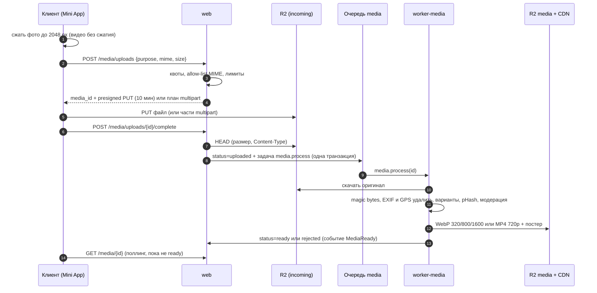

- R2 не поддерживает presigned POST с `content-length-range`. Поэтому размер и тип проверяются `HEAD` после загрузки, а lifecycle удаляет мусор из `incoming` через 2 дня.
- В CORS бакета: `AllowedOrigins: https://app.<domain>`, методы `PUT`, `GET`, `ExposeHeaders: ETag` (нужен для multipart).
- При сбое загрузки клиент повторяет её по частям: свой загрузчик `useMediaUploads` в `packages/hooks` ([ADR-0012](adr/0012-mini-app-frontend-and-mobile-path.md), [спайк 0.24](spikes/0.24-webview-upload.md)). Обрыв сети и 5xx — повтор той же ссылки с паузой, 400/403 — новая ссылка; «Повторить» догружает только недостающие части. Незавершённые multipart-загрузки убирает lifecycle.

### 10.3. Обработка

| Шаг | Изображения | Видео |
|---|---|---|
| Проверка типа | magic bytes, не заголовок клиента; отклонение полиглотов и сверхбольших разрешений (decompression bomb guard) | magic bytes MP4/MOV; `ffprobe` по заголовкам, без декодирования: кодек, длительность ≤ 60 с, разрешение, частота кадров |
| Нормализация | Автоповорот по EXIF, цвета — в sRGB по встроенному ICC, затем **удаление всех метаданных** (EXIF с GPS, XMP, ICC); HEIC → WebP (pillow-heif) | Перекодирование H.264 (yuv420p) + AAC, 720p, `-movflags +faststart`, удаление метаданных |
| Варианты | WebP `thumb` 320 / `md` 800 / `lg` 1600 px по длинной стороне, без увеличения (маленькое фото получает меньше вариантов); thumbhash-плейсхолдер | MP4 720p (`video`); постер — те же WebP-варианты и thumbhash |
| Антифрод | pHash → поиск дубликатов у других аккаунтов (признак фейкового портфолио) | pHash постера |
| Модерация | OpenAI `omni-moderation`; при срабатывании — SafeSearch или Rekognition; итог — `moderation_status` | Кадры раз в 2–3 с → те же проверки |
| Результат | `variants` в `media.assets`, событие `MediaReady` или `MediaRejected` | То же |

Воркер `worker-media` — отдельный процесс с ограничениями CPU и памяти. ffmpeg запускается через `asyncio.create_subprocess_exec` с таймаутом по длине и размеру кадра (120–900 с). Задача идемпотентна: при повторе варианты перезаписываются.

- **Какой файл обрабатывается.** Оригинал читается из `incoming` с `If-Match` по ETag, сверенному при `complete`: presigned PUT живёт ещё до 10 минут, и подменённый после проверки файл получает `rejected` (mismatch).
- **Изоляция.** Недоверенный файл декодирует дочерний процесс с таймаутом (60 с) и лимитами CPU и памяти; секретов воркера он не видит (окружение — белым списком). Ответ процесса (`answer.json`) проверяется: принимаются только известные имена вариантов и причины.
- **Кто виноват.** Причину по вине файла называет сам процесс — файл `rejected`. Сбой самой обработки (таймаут, падение или убийство процесса — OOM-kill, рестарт; наша ошибка) — повтор задачи и Sentry; третий такой запуск (`attempts`) отклоняет файл как `unreadable`, чтобы бомба не жгла CPU бесконечно.
- **Отказы** — `rejected` с причиной в `failure_reason`: `unsupported` (по magic bytes это не JPEG, PNG, WebP или HEIC), `too_many_pixels` (больше 64 MP — decompression bomb; размер кадра проверяется до декодирования, у HEIF берётся основное изображение, а не первый кадр), `unreadable` (не декодируется). Отклоняют файл только ответы хранилища о нём самом (подменён, пропал); остальные 4xx — сбой конфигурации: задача повторяется.
- **Зависшая обработка.** `media.retry_stuck` каждые 15 минут ставит снова фото, которые дольше 15 минут `uploaded` или `processing`, и ролики, которые так дольше часа (перекодирование само идёт до 15 минут: второй запуск поверх первого только тратил бы попытки); зависшие дольше суток получают `rejected` (unreadable) — оригинал в incoming всё равно уберёт lifecycle. Запуски, умершие вместе с воркером, тоже считаются попытками: следующий после третьего отклоняет файл, не начиная работу. Запуск, сорванный хранилищем (5xx, сеть), попытку не тратит: иначе затянувшийся сбой хранилища отклонил бы исправные файлы.
- **Память.** JPEG декодируется сразу уменьшенным (draft), кадр уменьшается до 1600 px до поворота и цветовых преобразований.
- **Оригинал не храним.** После обработки сырой файл с EXIF удаляет задача `media.delete_objects`: клиент уже уменьшает фото до ≈ 2048 px, самый крупный вариант — 1600 px.
- **Видео** (шаг 2.2b). Ролик скачивается потоком во временный каталог (до 200 MB — не в память); контейнер — только MP4/MOV по magic bytes, ffmpeg и ffprobe читают его демуксером `mov` принудительно и только протоколом `file` (плейлист HLS или concat под видом видео иначе прочитал бы чужие файлы и адреса).
  - **Проверка.** `ffprobe` читает только заголовки контейнера и ничего не декодирует: видеокодек H.264, HEVC или MPEG-4, ≤ 60 с (`too_long`, допуск 0,5 с на смещение дорожек), кадр от 16 px до 4096 × 3072 (`too_many_pixels`), ≤ 240 кадров/с. Обложка (attached_pic) роликом не считается; звук вне списка (AAC, ALAC, MP3, Opus, LPCM) отбрасывается, ролик остаётся.
  - **Декодирование** — только в ffmpeg и только выбранных потоков: белый список декодеров и предел кадра (`-max_pixels`) не обойти ни заголовком, солгавшим ffprobe, ни сменой SPS посреди потока. Процессу — два потока декодера, предел CPU и памяти (`prlimit`), окружение белым списком, своя группа процессов (при таймауте убивается целиком); stdout читается с пределом, от stderr хранится хвост.
  - **Выход.** H.264 yuv420p + AAC (стерео, 48 кГц), длинная сторона ≤ 1280 с чётными сторонами, ≤ 30 кадров/с, VBV ≤ 4 Мбит/с, `+faststart`, без метаданных (геопозиция iPhone не переносится), поворот по матрице дисплея; HDR (HLG/PQ) — тонмаппинг в SDR bt709 (zscale). Кадр около первой секунды проходит конвейер фото: постер — варианты `thumb`/`md`/`lg` и ThumbHash, сам ролик — `m/{id}/video.mp4`.
  - **Кто виноват.** Не прошёл проверку — файл (`unsupported`, `too_long`, `too_many_pixels`); перекодирование упало, зависло или процесс убит — повтор задачи, после третьего запуска — `unreadable`.

### 10.4. Раздача

- **Публичные варианты** (портфолио, аватары, фото опубликованных заявок) — `https://cdn.<domain>/m/{asset_id}/{variant}.webp`. Ключи неизменяемые, поэтому `Cache-Control: public, max-age=31536000, immutable`. Клиент выбирает вариант через `srcset`.
- **Приватные объекты** (вложения чата, документы, оригинал на время обработки) выдаются только presigned GET на 5 минут после проверки прав.
- **Без CDN** (dev, тесты: `S3_PUBLIC_BASE_URL` пуст) варианты отдаются presigned GET бакета `media` на час.
- **Непубличные назначения** (сообщения, отзывы, документы — v1) кладут варианты в `private`: только presigned GET на 5 минут.
- **Видео** — MP4 с range-запросами; в ответе API — отдельное поле `video` (адрес и размеры), постер — в `variants` (в `srcset` ролику не место). В WebView — `playsinline preload="metadata"` без автозапуска: трафик не тратится, пока человек не нажал «смотреть».
- **Позже:** imgproxy за CDN с подписанными URL — ресайз на лету под DPI мобильных клиентов (этап 2).

### 10.5. Жизненный цикл

| Событие | Что происходит |
|---|---|
| `pending_upload` старше 24 ч | `failed` (abandoned), запись остаётся; объект и незавершённый multipart удаляет задача `media.delete_objects` (`media.cleanup_orphans`) |
| Soft delete пользователем | Сразу снимается с публикации: API его не отдаёт, публичные варианты `media.hide_variants` переносит в `private` (`hidden_at`; не вышло — страховка `media.hide_deleted` каждые 15 минут); кэш CDN по URL сбрасывается вместе с CDN (прод-контур). Объекты удаляются через 30 дней (`media.purge_deleted`, раз в час). Недогруженный файл хранить незачем — его сразу убирает `media.delete_objects` |
| Не тот файл при `complete` (размер или тип) | `failed` (mismatch); объект удаляет `media.delete_objects` |
| Работу убрали из портфолио, фото профиля сменили (2.11) | Модуль выше по DAG вызывает `MediaApi.discard` в своей транзакции: задача `media.discard_media` встаёт вместе с его записью и после commit удаляет файл, как soft delete пользователем; сбой — повтор воркером |
| Отклонено модерацией | Скрыто, хранится 6 месяцев (окно апелляции), затем удаляется |
| Удаление аккаунта | Все медиа пользователя удаляются в рамках `identity.process_deletions`, кроме медиа под legal hold (открытые кейсы и споры) |
| Жалоба «это я на фото, удалите» | Кейс P1, по решению — удаление за ≤ 2 рабочих дня (ст. 20 ZET) |

**Фото объявлений (после MVP, итерация «Вещи»).** Префикс `listing/`, обработка в очереди `media_goods`, для объявлений бот — основной канал загрузки фото, а не запасной. Сроки хранения — задачами `media.purge_deleted` и `platform.retention_sweep`, а не правилами R2: правила не знают статуса объявления и legal hold. Публичные варианты кэшируются как `immutable`, поэтому при снятии объявления модерацией, P0, удалении аккаунта и жалобе на ПД варианты сразу удаляются из бакета `media`, а кэш CDN сбрасывается по URL. Поправки к [ADR-0007](adr/0007-media-storage-and-processing.md) — в ADR-0019, подробно — [research/08 §6.8](research/08-goods-marketplace.md#68-влияние-на-поиск-медиа-модерацию-чат-бот-и-deep-links).

### 10.6. Локально и в тестах

- **Локально:** Garage 2.4 (S3 API) в `docker-compose.dev.yml`, те же presigned-операции. На просроченную ссылку Garage отвечает 400 вместо 403, клиент обрабатывает оба кода.
- **В интеграционных тестах** Garage поднимается через testcontainers. Для R2-специфики (checksum `when_required`) есть отдельный smoke-тест на stage.

---

## 11. Уведомления и realtime

### 11.1. Каналы

| Канал | Когда | Назначение |
|---|---|---|
| Telegram-бот | MVP | Основной канал этапа 1: у Mini App нет push-уведомлений. Сообщения с кнопками-deep links |
| Центр уведомлений в Mini App | MVP | История событий: запасной путь, если бот заблокирован или писать запрещено |
| Push (APNs / FCM через Expo) | Этап 2 | Мобильное приложение. Новый адаптер модуля `notifications`, остальная логика не меняется |
| E-mail | Этап 2, опционально | Чеки, важные юридические уведомления |

Бот не пишет первым. Разрешение получаем контекстно ([ADR-0011](adr/0011-telegram-bot-integration.md)):
- `/start`;
- `requestWriteAccess` после публикации заявки или создания подписки.

Чекбокс write access при первом запуске есть только у direct-link Mini App, а у нас Main Mini App, поэтому на него не рассчитываем.

Состояние хранится в `notifications.channels`. Ответ 403 (бот заблокирован) выключает канал. Статус следует за человеком: остановил бота — апдейт `my_chat_member` со статусом `kicked` выключает канал сразу, запустил снова (`member`) или нажал /start — включает (шаг 2.3b). Порядок — по времени событий: /start, обработанный после остановки, но нажатый раньше неё, канал не включит (даты Telegram — в целых секундах; остановку в ту же секунду выключит первый ответ 403).

### 11.2. Конвейер

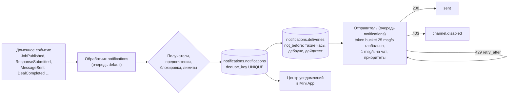

- **Идемпотентность.** Уникальный `dedupe_key` (например, `response.received:{job_id}:{начало окна}`) и `UNIQUE (notification_id, channel_id)` в доставках.
- **Как устроено (шаг 2.3a).** Подписчик события (очередь `notifications`) вызывает один use case `Notify`: в одной транзакции — уведомление, доставка в личный чат с ботом (если тип ходит в бот, группа включена и боту можно писать) и задача `notifications.send`, поставленная на `not_before` (`JobQueue.enqueue(…, not_before=…)`). Текст не хранится: `payload` — машинные параметры и код deep link, а текст собирается по шаблонам gettext на языке читателя — при показе в центре и при отправке. При отправке настройки проверяются заново: группу выключили за ночь — `suppressed`, тихие часы продлили — доставка ждёт их нового конца (срочное — нет). Отправка at-least-once: упади воркер между отправкой и записью итога, сообщение уйдёт ещё раз. Удалённому пользователю и в выключенный канал — `suppressed`.
- **Группы S43** («группа × канал»: бот, приложение): `job_matches` — «Заявки по подпискам», `responses` — «Отклики и выбор», `messages`, `deals` — «Сделки, споры, отзывы», `marketing` — «Новости «Соседей»» (только по согласию, по умолчанию выключена). Служебная `account` — решения модерации и санкции — не выключается: без неё человек не узнает, почему контент не виден или действие запрещено. Теневой бан пользователю не сообщается.
- **Дебаунс.** Несколько откликов на одну заявку за 5 минут собираются в одно сообщение (5.4): первый отклик ставит задачу на конец окна, следующие, пока она ждёт, ничего не ставят — замок очереди Procrastinate по заявке. Если сообщения в чате пришли, пока получатель активен в этом диалоге Mini App (heartbeat), уведомление не отправляется.
- **Тихие часы** 22:00–08:00 (Europe/Belgrade, настраиваются в `notifications.user_settings`) действуют для всего, кроме сообщений чата, выбора исполнителя, `deal.proposed` и заявок со срочностью `asap`.
- **Приоритеты** (при перегрузке первые идут раньше):

  | Приоритет | Что входит |
  |---|---|
  | P0 | Сообщения чата, выбор исполнителя, `deal.proposed`, `dispute.opened`, безопасность |
  | P1 | Отклики, приглашения в заявку, напоминания о сделке, отмена сделки, решения модерации |
  | P2 | Новые заявки по подпискам, запросы отзывов |
  | P3 | Дайджесты, истечение заявок, напоминания о профиле |

- **Отправитель (шаг 2.3b).** Адаптер `TelegramSender` на aiogram `Bot` перед каждым сообщением занимает слот лимитера в Valkey: 25 msg/s на бота и 1 msg/s на чат по модели GCRA — точный слот сразу, одним Lua-скриптом (атомарно для всех воркеров, время — часы Valkey). Слот не дальше 3 с — задача ждёт его на месте; дальше — доставка один раз переставляется к сроку, не тратя попытку (очередь из тысяч уведомлений расходится по слотам за один проход, без перебора). Ждущее из-за своего чата сообщение занимает слот бота только в момент отправки и не сдвигает очередь бота. Ответы: 429 — пауза всем отправкам на `retry_after`; 403 и «chat not found» — канал выключен, доставка `failed`; прочие 400 — `failed` без повтора; сеть, 5xx и нечитаемый ответ — повтор задачи, после 5 неудач — `failed`; доставку, зависшую в `queued` дольше суток после срока, закрывает `notifications.expire_stale` (`failed`, `stale`). Приоритет P0–P3 — приоритет задачи `notifications.send` в очереди: при перегрузке P0 уходят первыми. У очереди `notifications` свой пул в процессе воркера (§12.2): рассылка не занимает места обработчиков событий и периодических задач. Valkey недоступен — лимитер пропускает (притормозит сам Telegram). Проверка канала — `cli notify-test --user <Telegram id или id>`: команда ждёт, пока доставку отправит воркер.
- **Скорость рассылки.** При лимите ≈25–30 msg/s рассылка новой заявки уходит 200 подписчикам примерно за 8 с, 10 000 — примерно за 6 мин. Поэтому подписки точные (категория × район × бюджет), а для не срочных — режим «дайджест». Отправку можно приоритизировать по свежести подписки и активности исполнителя. «Ранний доступ» для Pro — только кандидат после заключения юриста ([§15.1](#151-модель-по-этапам)). Paid broadcasts доступны только от 100 000 MAU и 100 000 Stars на балансе.

### 11.3. Каталог уведомлений (MVP)

| Тип | Кому | Канал | Приоритет | Кнопки |
|---|---|---|---|---|
| `job.matched` | Исполнитель с подходящей подпиской | Бот (мгновенно или дайджест) | P2 | «Откликнуться» (deep link `j_…`), до двух кнопок «Откликнуться шаблоном» (callback `jr:<job>:<tpl>`, id в base62), «Не интересно», «Пауза подписки» |
| `response.received` | Клиент | Бот + in-app, дебаунс окном 5 мин (5.4): первый отклик ставит задачу на конец окна, остальные, пока она ждёт, — ничего (замок очереди по заявке); в тексте — видимые клиенту и ещё не открытые отклики | P1 | «Посмотреть отклики» |
| `response.accepted` / `response.not_selected` | Исполнитель | Бот + in-app | P0 / P3 | «Открыть сделку» (адрес — только внутри Mini App, в тексте бота его нет), «Написать» |
| `job.invited` | Приглашённый специалист | Бот + in-app | P1 | «Посмотреть заявку», «Откликнуться шаблоном» |
| `message.received` | Участник диалога | Бот (если не в диалоге) + in-app | P0 | «Ответить» (открывает диалог) |
| `deal.proposed` | Вторая сторона договорённости | Бот + in-app | P0 | «Подтвердить», «Отклонить»; истекает через 72 ч |
| `deal.cancelled` | Вторая сторона сделки (отмена системой — обе, кроме удалённого аккаунта) | Бот + in-app | P1 | «Открыть сделку»; кто отменил и причина, клиенту из отклика — «заявка снова открыта, прежние отклики вернулись» |
| `dispute.opened` | Вторая сторона сделки | Бот + in-app | P0 | «Ответить» (48 ч на ответ) |
| `deal.reminder` | Обе стороны | Бот | P1 | «Открыть» (за 2 ч до времени) |
| `deal.completion_prompt` | Стороны, которые ещё не отметили | Бот | P1 | «Да, выполнено» (callback `dc:<deal>`, бот deals), «Нет, проблема» (web_app `d_` → S52) |
| `review.request` | Клиент (v1 — обе стороны) | Бот | P2 | Оценка 1–5 кнопками, «Написать отзыв» |
| `review.published` | Исполнитель | Бот + in-app | P3 | «Ответить на отзыв» |
| `moderation.decision` | Автор контента | Бот + in-app | P1 | «Исправить», «Обжаловать» |
| `profile.published` | Исполнитель | Бот + in-app | P1 | «Открыть профиль» — модерация одобрила профиль (2.8a) |
| `job.expiring` | Клиент | Бот | P3 | «Продлить», «Закрыть: исполнитель найден» (бот спросит: здесь или в другом месте); после срока заявки не отправляется |
| `job.expired` | Клиент | Бот + in-app | P3 | «Продлить», «Закрыть» (бот спросит причину) |
| `profile.stale_reminder` | Специалист | Бот | P3 | Не чаще раза в 2 недели: «Обновить профиль», «Включить „доступен сегодня“» |
| `account.restricted` | Пользователь | Бот + in-app | P0 | «Подробнее», «Обжаловать» |

Тексты — шаблоны gettext по локали получателя. Дата и время — в часовом поясе получателя (сущность `date_time` Bot API 9.5). Когда заявка закрыта, кнопка «Откликнуться» в разосланных сообщениях заменяется на `DisabledButton` (Bot API 10.3).

Кнопки действий в чате — callback: данные `<действие>:<id base62>[:<аргумент>]` не длиннее 64 байт, кодек общий (`platform/telegram/callbacks.py`): кнопку рисует notifications, нажатие обрабатывает бот модуля сущности теми же use cases, что и API. У уведомления, которое со временем становится неправдой («закроется через 2 ч»), есть срок актуальности `valid_until`: позже него доставка в бот не уходит (`suppressed`, `late`), в том числе если тихие часы кончаются позже.

**Вещи (после MVP, итерация «Вещи»).** Бот у услуг и вещей один, и кто заблокирует его из-за дайджестов вещей, не получит ни подходящих заявок, ни сообщений чата. Поэтому:
- группа `goods` в `notifications.preferences`, типы `listing.expiring`, `saved_search.matched`, `listing.reserved`;
- уведомления вещей — **только по явному opt-in**, по умолчанию дайджест не чаще раза в сутки, свой лимит на пользователя; мгновенный режим сохранённого поиска — только для тех, кто его включил;
- массовые рассылки — очередь `notifications_bulk`: токен берётся сразу из общего бакета 25 msg/s и из подбюджета вещей ≤ 5 msg/s. Сообщения чата по объявлению — P0, как у услуг;
- блокировки бота видны по `my_chat_member`; их рост выше базовой линии услуг — стоп-критерий, рассылки вещей выключаются ([§19.1](#191-риски)).

До итерации с вещами связано одно разовое сообщение: о запуске «Вещей-0» — только тем, кто нажал «Сообщить о запуске» на S58 ([§20.5](#205-итерация-вещи-после-mvp)). Текст — «Теперь вещь можно продать через бота: отправьте фото — сделаем карточку для чата», а не «раздел открылся»: полного раздела в «Вещах-0» нет. На время «Вещей-0» сегмент «Вещи» по-прежнему ведёт на S58, но без бейджа «скоро»: S58 предлагает «Продайте вещь: отправьте боту фото» и открывает чат с ботом. Главная раздела G01 — только с пилота **[Допущение]**.

### 11.4. Deep links

Схема — `t.me/<bot>?startapp=<код>`, код не длиннее 64 символов `[A-Za-z0-9_-]`, без префикса `_tgr_`. Кодек общий для backend и фронтенда: пакет `packages/links` и `platform/telegram/deeplinks.py` (им пользуются бот и модуль `growth`), golden-векторы `packages/links/golden.json` общие.

`<base62>` — UUID в base62, ровно 22 символа.

| Код | Экран | Пример |
|---|---|---|
| `j_<base62>` | Заявка (S15 или S23 — по роли) | `j_1Xh3kQ9vB7mZ2pR4sT8dLq` |
| `s_<base62>` | Профиль специалиста (S08) | `s_4bN8wE2rT6yU1iO3pA5sDf` |
| `c_<base62>` | Диалог (S30) | `c_034W1ovwx2XBd7GhiJ9CHv` |
| `d_<base62>` | Сделка (S26) | `d_6kL3jH8gF1dS4aZ7xC2vBn` |
| `h` | Главная (S03) | `h` |
| `n` | Мастер новой заявки (S20a; команда бота `/new`) | `n` |
| `m_jobs` | Мои заявки (S22; команда бота `/jobs`) | `m_jobs` |
| `l_terms`, `l_privacy` | Правила площадки, политика конфиденциальности (вкладка S48; команды бота `/terms`, `/privacy`) | `l_terms` |
| `…_r<code>` | Суффикс реферала или атрибуции канала — только суффикс, не тип | `s_4bN8wE2rT6yU1iO3pA5sDf_rAB12CD`, `h_rAB12CD` |

Команды боту — `t.me/<bot>?start=<param>`: `link_<nonce>` — привязка Telegram к аккаунту нативного приложения (этап 2). Других префиксов нет.

Кнопка web_app в сообщении бота открывает адрес как есть: `start_param` в неё Telegram не передаёт. Поэтому бот кладёт тот же код в адрес — `https://<app>/?startapp=<код>`, — а Mini App берёт его, когда в launch params кода нет (`packages/platform`). Такой код — только навигация: атрибуцию backend берёт из подписанного initData или из `/start`.

**Зарезервировано под раздел «Вещи»** (после MVP, итерация «Вещи»; префиксы зарезервированы [ADR-0019](adr/0019-goods-section-module-deferred.md) (п. 15), отметка — в шапке [ADR-0011](adr/0011-telegram-bot-integration.md), [research/08 §6.8](research/08-goods-marketplace.md#68-влияние-на-поиск-медиа-модерацию-чат-бот-и-deep-links)):

| Код | Экран | С какой стадии |
|---|---|---|
| `g_<base62>` | Объявление | «Вещи-0» |
| `gu_<base62>` | Продавец или распродажа «Уезжаю» | «Вещи-0» |
| `gh` | Главная раздела «Вещи» | Пилот |
| `gs_<id>` | Сохранённый поиск (кнопка в дайджесте) | Пилот |
| `gc_<code>` | Витрина чата-партнёра | «Раздел» |

`gh` и `h` — разные типы; юнит-тесты кодека проверяют лимит 64 символа. Суффикс `_r<code>` — атрибуция чатов-партнёров. Веб-путь объявления — `/g/<id>` с Open Graph, он опирается на веб-оболочку v1. Карточка для чата — `savePreparedInlineMessage` + `shareMessage`.

Для веба и будущих universal links используются те же сущности: `https://<domain>/j/<id>`, `/s/<id>`. Страница по такой ссылке предлагает «Открыть в Telegram» или «Продолжить в браузере» и отдаёт Open Graph для превью в Viber и WhatsApp (v1).

### 11.5. Переписка (модель чата)

Решение — гибрид ([ADR-0010](adr/0010-messaging-hybrid-chat.md)): наш модуль `messaging` — источник истины, Telegram — канал доставки.

| Этап | Что есть |
|---|---|
| **MVP** | Диалог на отклик или прямое обращение; экран диалога в Mini App (текст, поллинг 3–5 с, пока экран открыт); уведомление в боте с кнопкой «Ответить»; «Договорились» создаёт сделку (`proposed` → вторая сторона подтверждает → `agreed`); **до сделки `agreed` обмен контактами недоступен**, а телефоны, ссылки и @username в сообщениях автоматически маскируются с подсказкой «контакты откроются после договорённости»; после `agreed` у каждой стороны появляется кнопка «Поделиться контактом» (Telegram или телефон): каждый делится своим, явным действием. Это и есть наш double opt-in. Плюс автопроверки сообщений («предоплата», фишинг) с баннером безопасности |
| **v1** | Ответ прямо из бота: reply на уведомление или активный диалог в FSM; SSE-поток событий; фото в сообщениях; автоперевод ru ↔ sr по кнопке |
| **Этап 2** | Нативный чат в iOS/Android на том же API + push |

Топики в личных чатах с ботом не используем: пока они включены, Telegram берёт 15% со всех покупок за Stars в боте. Business-ботов не делаем, это доступ к личной переписке специалиста.

### 11.6. Realtime

- **MVP.** Поллинг с ETag, пока экран открыт:

  | Экран | Интервал |
  |---|---|
  | Диалог | 3–5 с |
  | Список откликов | 15 с |
  | Центр уведомлений | При фокусе |

  Нагрузка ничтожна (§2.3), инфраструктура не нужна.
- **v1.** `GET /api/v1/realtime` — **SSE** (Server-Sent Events) с событиями `message.new`, `message.read`, `response.new`, `deal.updated`. Fan-out между репликами `web` идёт через Valkey pub/sub. SSE выбран вместо WebSocket, потому что:
  - события однонаправленные (сервер → клиент), а мутации идут через REST;
  - SSE проходит через Cloudflare и HTTP/2 без апгрейда соединения;
  - встроенное переподключение (`Last-Event-ID`).

  **Авторизация.** Браузерный `EventSource` не отправляет заголовок `Authorization`. Поэтому поток открывается через fetch-стрим с bearer-токеном, а для мобильного клиента и запасного пути — с короткоживущим одноразовым ticket в query (`POST /realtime/ticket` → `GET /realtime?ticket=…`, TTL 60 с).
- **Этап 2.** Мобильное приложение использует тот же SSE на переднем плане и push в фоне.

---

## 12. Фоновые задачи

Решение — [ADR-0008](adr/0008-background-jobs-and-outbox.md): **Procrastinate 3.10**, очередь в PostgreSQL.

### 12.1. События и задачи

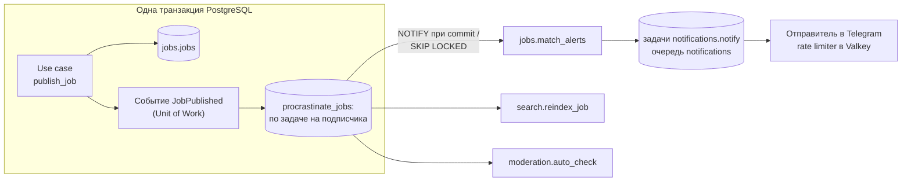

- **Порт `JobQueue`** (`enqueue(task, payload, dedup_key, not_before, priority)`) в `platform/queue`: `not_before` — не запускать раньше (тихие часы, пауза после 429), `priority` — из ждущих задач раньше берутся с большим (P0 уведомлений). Прикладной код ничего не знает о Procrastinate.
- **Диспетчер событий** при commit Unit of Work ставит по задаче на каждого подписчика события **на том же соединении и в той же транзакции**. Откат транзакции отменяет и задачи, commit делает их видимыми воркерам (NOTIFY). Таблица задач и есть outbox: dual write не возникает.
- **Запасной путь**, если спайк не подтвердит транзакционную постановку через SQLAlchemy: таблица `platform.outbox` + relay (`FOR UPDATE SKIP LOCKED`). Интерфейс `JobQueue` не меняется.

### 12.2. Очереди и процессы

| Очередь | Что в ней | Процесс | Concurrency на старте |
|---|---|---|---|
| `default` | Обработчики событий, read-model поиска, автомодерация, AI-классификация, ретеншн | `worker` | 8–16 |
| `notifications` | Fan-out по подписчикам, отправка в Telegram (позже push) | `worker`, свой пул (2.3b) | 4, лимитер 25 msg/s на бота и 1 msg/s на чат |
| `media` | Pillow, ffmpeg, модерация медиа | `worker-media` | Число ядер / 2 |
| `goods` (после MVP, итерация «Вещи») | События `goods` и задачи их подписчиков, индексация, матчинг сохранённых поисков, истечение броней и объявлений (`goods.expire_reservations`) | `worker` | Калибруется на пилоте. Переиндексация — с `queueing_lock` по `listing_id` |
| `media_goods` (после MVP, итерация «Вещи») | Фото объявлений, сборка альбомов из бота, vision-проверка | `worker-media` | 1–2 |
| `notifications_bulk` (после MVP, итерация «Вещи») | Совпадения сохранённых поисков и дайджесты вещей | `worker` | Общий token bucket 25 msg/s + подбюджет ≤ 5 msg/s |

### 12.3. Периодические задачи

Периодические задачи объявляются через `@app.periodic`. Procrastinate выполняет их с HA: сколько бы ни было воркеров, запуск один.

| Задача | Расписание | Что делает |
|---|---|---|
| `jobs.expire_jobs` | каждые 5 мин | `published` с `expires_at < now()` → `expired`, уведомление владельцу |
| `jobs.expiry_reminders` | каждые 15 мин | «Заявка закроется через 2 ч» |
| `jobs.alert_digests` | ежечасно и в 09:00 | Дайджесты для подписок с `delivery = digest` |
| `deals.completion_prompts` | каждые 15 мин | «Работа выполнена?» через 3 ч после `scheduled_at` (время не договорено — через 24 ч после `agreed_at`); отметка `completion_prompted_at` |
| `deals.auto_complete` | ежечасно | Одна сторона подтвердила, прошло 72 ч → `completed`, запрос отзыва клиенту (v1 — обеим сторонам) |
| `deals.expire_proposed` | каждые 15 мин | `proposed` старше 72 ч без подтверждения → `cancelled` («истекло»), уведомление инициатору |
| `deals.reminders` | каждые 15 мин | `deal.reminder` за 2 ч до `scheduled_at` |
| `disputes.response_sla` | каждые 30 мин | Вторая сторона не ответила за 48 ч → спор уходит модератору с пометкой «нет ответа» |
| `reviews.reminders` | ежечасно | Напоминание об отзыве через 24 ч после завершения и за 2 дня до закрытия окна 14 дней |
| `reviews.reveal_expired` | ежечасно (v1) | Double-blind: окно 14 дней закрылось → публикация отзыва, написанного одной стороной |
| `specialists.stale_profile_reminders` | ежедневно в 11:00 | `profile.stale_reminder` не чаще раза в 2 недели, если профиль давно не обновлялся и «доступен сегодня» не включался |
| `specialists.reset_availability` | каждые 5 мин | Снять «доступен сегодня» по `available_until` |
| `search.reconcile_index` | ночью | Полная сверка read-model с источниками (≈5 с на 50k профилей) |
| `pricing.recompute_benchmarks` | ночью (v1) | Медианы цен по категориям и городам |
| `billing.expire_entitlements` | каждые 10 мин (v1) | Истечение подписок и бустов |
| `media.cleanup_orphans` / `media.purge_deleted` | ежечасно / ночью | Мусор `pending_upload`; физическое удаление через 30 дней. Доказательства открытых кейсов (legal hold) откладываются на сутки (`held_until`) |
| `identity.trust_aging` | ежедневно в 02:41 UTC | Уровень доверия 1 тем, кто 14 дней без нарушений и действующих санкций ([ADR-0016](adr/0016-trust-safety-and-reviews.md) §2); понижает уровень сама санкция, сразу |
| `moderation.rate_limit_signals` | каждые 15 мин | Систематические 429 (≥ 5 по одному лимиту за сутки) → сигнал риска `rate_limit_exceeded`, один на пользователя, лимит и сутки ([§13.3](#133-антиспам-лимиты)) |
| `identity.process_deletions` | ежечасно | Удаление аккаунтов после grace-периода ([§7.10](#710-soft-delete-ретеншн-и-аудит)) |
| `moderation.legal_notice_sla` | каждые 30 мин (v1, [ADR-0018](adr/0018-mvp-scope-anonymous-no-payments.md)) | Эскалация жалоб по ст. 20 ZET, у которых скоро истекает срок 2 рабочих дня |
| `moderation.purge_verification_docs` | ночью (v1) | Удаление документов после `purge_after` |
| `platform.retention_sweep` | ночью | Исполнение матрицы сроков хранения [§7.10](#710-soft-delete-ретеншн-и-аудит): заявки и отклики — 24 мес, переписка — 12 мес, отклонённый контент — 6 мес, хэши удалённых аккаунтов — 12 мес. Пропускает сущности под legal hold |
| `platform.idempotency_cleanup` | ежечасно | Ключи старше 24 ч |
| `procrastinate.retry_stalled_jobs` | каждые 5 мин | Возврат задач, зависших после падения воркера |
| `procrastinate.remove_old_jobs` | ночью | Ретеншн выполненных задач (7 дней) |
| `ops.heartbeat` | каждую минуту | Пинг в Healthchecks.io: жив ли воркер |
| `notifications.expire_stale` | ежечасно | Доставки, зависшие в `queued` дольше суток после срока, → `failed` (`stale`) |
| `ops.queue_lag` | каждую минуту | Лаг очередей — возраст самой старой готовой к запуску задачи (отложенная — с `scheduled_at`) → метрика `procrastinate_queue_lag_seconds`; выше порога (`notifications` > 2 мин, остальные > 10 мин) — предупреждение в логе |

### 12.4. Идемпотентность и надёжность

- **Доставка at-least-once.** Защиты:
  - `queueing_lock` по ключу сущности — в очереди не больше одной ожидающей задачи на ключ;
  - уникальные ограничения в БД: `dedupe_key` уведомлений, `(channel, external_id)` платежей, `(job_id, performer_id)` откликов;
  - проверка текущего состояния перед действием («заявка ещё `published`?»).
- **Retry** — экспоненциальный с джиттером, 5–8 попыток. После них задача переходит в `failed`, срабатывает алерт в Sentry и метрика `jobs_failed_total`.
- **Внешние вызовы с таймаутами.** Telegram:
  - 429 → пауза на `retry_after`;
  - 403 → канал выключен, без повторов;
  - 400 → без повторов.

  AI и KYC — circuit breaker: после 5 сбоев подряд провайдер минуту не вызывается, затем одна пробная проверка; у текста и изображений свои предохранители, а ошибка про конкретный запрос (400, 413, 422) предохранитель не трогает. Вся AI-проверка укладывается в `AI_TIMEOUT_SECONDS`. Если модерация недоступна (сбой, таймаут, открытый предохранитель, отказ модели, нет ключа на stage и проде), порт возвращает отдельный тип `Unavailable` с причиной — не исключение и не «чисто», — и контент уходит в ручную очередь, а не публикуется без проверки. В dev и тестах без ключей работают заглушки (`platform/ai/stubs.py`).
- **Длинные задачи** (транскодинг) идемпотентны: при повторе результат перезаписывается, прогресс виден в `media.assets.status`.
- **Метрики:**
  - возраст старейшей задачи по очередям (алерт: > 2 мин для `notifications`, > 10 мин для `default`);
  - число `failed`;
  - длительность по типам задач.

---

## 13. Безопасность и защита данных

### 13.1. Модель угроз (кратко)

| Угроза | Мера |
|---|---|
| Подделка личности Telegram (фальшивый `initData`) | Проверка HMAC на сервере, `auth_date` ≤ 1 ч, constant-time сравнение. `initDataUnsafe` не используется, `initData` не логируется |
| Кража токенов | Короткий access (15 мин); refresh с ротацией и детектом повторного использования; denylist `sid` в Valkey при бане; только HTTPS |
| Подделка webhook Telegram | `X-Telegram-Bot-Api-Secret-Token`, узкий `allowed_updates`, секретный путь |
| Нарушение авторизации (IDOR) | Проверка владения в каждом application-сервисе (политики модуля); UUIDv7 вместо последовательных id; тесты прав на каждый эндпоинт |
| Спам и фрод | Rate limiting (§13.3), лимиты для новых аккаунтов, конвейер модерации ([§14](#14-модерация-и-trust--safety)) |
| Утечка персональных данных | Минимизация, шифрование, журналы доступа, контакты и адрес скрыты до выбора, удаление EXIF |
| Вредоносные файлы | Прямая загрузка в изолированный бакет, проверка magic bytes, декодер в изолированном воркере, лимиты размера и разрешения, без исполняемых типов |
| Инъекции | ORM и параметризованные запросы; FTS-запросы через `websearch_to_tsquery` (безопасен к синтаксису); CSP в Mini App; экранирование при рендере сообщений бота (HTML parse mode) |
| Компрометация админки | Cloudflare Access + отдельная аутентификация персонала (argon2 + TOTP), RBAC, аудит каждого действия |
| Цепочка поставки | Lock-файлы (uv, pnpm), Renovate/Dependabot, `pip-audit` и `pnpm audit` в CI, образы по digest, зеркало в GHCR |

Целевой уровень — **OWASP ASVS L2** для API.

### 13.2. Аутентификация и авторизация

- **Аутентификация** — [ADR-0009](adr/0009-authentication-and-identity.md), [§8.2](#82-аутентификация-и-сессии).
- **Авторизация** — три уровня:
  1. **Возможности аккаунта:** «есть профиль исполнителя», «телефон подтверждён», `trust_level`.
  2. **Ограничения** из `identity.restrictions` (санкции), проверяются в use case.
  3. **Владение ресурсом.** Правило владения живёт в политике модуля (`jobs/domain/policies.py`), а не в роутере.
- **Роли персонала** (`moderator`, `support`, `admin`) действуют только в admin API и SQLAdmin (`/admin` в процессе `web`, публикуется как `admin.<domain>` за Cloudflare Access). Доступ к персональным данным при разборе жалоб фиксируется в `platform.audit_log` (кто, что, когда, по какому кейсу).

**Уровни доверия (`identity.users.trust_level`, claim `tl`)** — от них зависят антиспам-лимиты (§13.3) и правило публикации ([§7.9](#79-жизненные-циклы-и-state-machines), [§14.1](#141-конвейер-модерации-контента)). Пересчитываются задачей по событиям (телефон, сделка, подтверждённая жалоба); подтверждённая жалоба или санкция понижает уровень.

| Уровень | Название | Условие | Что меняется |
|---|---|---|---|
| 0 | Новый | Только Telegram-аккаунт | Минимальные лимиты; любой контент проходит LLM-классификатор; выборочная пост-модерация |
| 1 | Базовый | Подтверждён телефон (добровольно) **или** ≥ 14 дней на платформе без подтверждённых жалоб | Классификатор — только при флаге правил |
| 2 | Проверенный | ≥ 3 завершённые сделки без подтверждённых жалоб | Повышенные лимиты; ссылки в профиле разрешены |
| 3 | Доверенный | KYC (v1) + ≥ 10 завершённых сделок | Максимальные лимиты; доступ к Top и платным функциям (v1) |

### 13.3. Rate limiting

Счётчики — sliding window в Valkey (`limits`). Грубые IP-лимиты стоят ещё на краю, в Cloudflare. Стартовые значения:

| Действие | Лимит |
|---|---|
| `POST /auth/*` | 10/мин на IP, 30/ч на Telegram-пользователя |
| Поиск и каталог (гость / вошедший) | 60 / 120 в минуту |
| Создание заявок | Уровень 0–1: 3 активные и 5 новых в сутки; уровень ≥ 2: 20 в сутки |
| Отклики | Уровень 0–1: 10 в сутки; уровень ≥ 2: 50 в сутки. Плюс лимит 5 откликов на заявку |
| Сообщения | Уровень 0–1: 20 в час; уровень ≥ 2: 100 в час. Новых диалогов — не больше 5 в час |
| Загрузки медиа | 50 в час, 1 GB в сутки на пользователя |
| Жалобы | 20 в сутки (защита от злоупотреблений, DSA Art. 23) |
| Вещи (после MVP, итерация «Вещи»): первые сообщения по объявлениям | Уровень 0–1: 20 в час. Плюс детектор одинакового первого сообщения нескольким продавцам (так работают рассылки Classiscam) |
| Вещи (после MVP, итерация «Вещи»): загрузки с `purpose='listing'`, включая альбомы через бота | Отдельный суточный лимит ≈ 300 фото, режим «Уезжаю» его поднимает |
| Вещи (после MVP, итерация «Вещи»): активные объявления | 20 одновременно активных у частного лица с подтверждённым телефоном, ниже для `trust_level 0`. Месячного лимита на подачу нет. Лот из нескольких вещей — одно объявление, «Отдам даром» в лимит не входит, режим «Уезжаю» поднимает лимит до 30 на 30 дней. Бесплатный подъём — раз в 4 дня |

При превышении API отвечает 429 с `Retry-After`. Систематическое превышение — сигнал риска в `moderation.risk_signals`.

Строки «Вещи» — стартовые пороги **[Допущение]** из [research/08 §5.5 и §6.1](research/08-goods-marketplace.md#61-что-переиспользуется). Лимиты услуг «новых диалогов — не больше 5 в час» и «загрузки медиа — 50 в час» на вещи не распространяются: покупатель, который спросил «ещё продаётся?» у шести продавцов, получил бы 429, а распродажа «Уезжаю» на 30 объявлений ждала бы загрузки 3–6 часов.

Это **антиспам**, он не зависит от тарифа. Продуктовая квота из монетизации — отдельная сущность. В v1 это entitlement `active_responses`: сколько откликов одновременно ждут решения клиента, бесплатно 10, с Pro 30 ([§15](#15-монетизация)). В MVP entitlements нет.

### 13.4. Защита данных (ZZPL) — что заложено в систему

Основание — [research/05 §1, §7](research/05-legal-and-payments-serbia.md#7-compliance-чек-лист-для-архитектуры).

**Объём в MVP** ([ADR-0018](adr/0018-mvp-scope-anonymous-no-payments.md)): команда запускается анонимно, без юрлица. Поэтому в MVP входят технические меры, которые не требуют юрлица:
- минимизация данных;
- правила площадки с одной галочкой (в ней же 18+);
- краткая политика конфиденциальности в BotFather;
- удаление аккаунта и данных по запросу;
- шифрование, журналы доступа, маскирование ПД в логах.

Остальное из таблицы ниже — реестр согласий, автоматический экспорт, ROPA, реестр вендоров и DPA, представитель — делается в v1 или после появления юрлица. Юридические вопросы MVP не блокируют. Риск принят владельцем ([§19.1](#191-риски)).

| Требование | Реализация |
|---|---|
| Правовые основания и согласия (ст. 12, 15) | MVP: `terms` (правила площадки с 18+) и `privacy`. v1: `identity.consents` с версиями для декларации исполнителя, аналитики, маркетинга, точной геолокации и передачи во внешние AI (`ai_processing`). Отзыв согласия — в один шаг. Согласие на ПД отделено от ToS |
| Cookies и хранилище на устройстве (ст. 160 ZEK 2023) | До согласия — только технически необходимое: сессия в памяти, язык, безопасность. Клиентская аналитика и её идентификаторы — только после opt-in; по умолчанию серверные события без device ID |
| Минимизация | Район вместо точного адреса, адрес — только выбранному исполнителю, телефон — только по «Поделиться контактом», EXIF удаляется, документы KYC у нас не хранятся (Didit), гражданство не собираем |
| Права субъектов (права — ст. 23–38 ZZPL, срок ответа 30 дней — ст. 21) | MVP: `POST /me/deletion`, исправление через профиль, выгрузка вручную по запросу. v1: `POST /me/data-export` (JSON и медиа, асинхронно). Учёт SLA в поддержке |
| Безопасность обработки (ст. 50) | TLS 1.2+; шифрование at rest (диски VM, бэкапы pgBackRest с `repo-cipher-type=aes-256-cbc`, R2 с SSE); RBAC, 2FA для персонала, журнал доступа к ПД, маскирование ПД в логах (structlog processor) |
| Утечки (ст. 52–53) | Runbook: оценка → уведомление Poverenik в течение 72 ч по форме → уведомление пользователей при высоком риске. Подсчёт затронутых записей — из аудита |
| Реестр обработки (ROPA, ст. 47) | Документ в `docs/compliance/` (отдельно от этого документа), связан с модулями и хранилищами; обновляется при изменении схемы |
| Обработчики и передача (ст. 45, 64) | DPA с Hetzner (DE), Cloudflare (DPF), OpenAI, Anthropic, Didit, Sentry, Grafana. Реестр вендоров с локацией и основанием передачи. Американские сервисы — только участники DPF |
| Представитель в Сербии (ст. 44) | Нужен, только если оператор — иностранное юрлицо. Решается после MVP вместе с выбором юрлица |
| Сроки хранения | Матрица в [§7.10](#710-soft-delete-ретеншн-и-аудит); исполняют задачи ретеншна |
| Внешние AI (App Store 5.1.2(i)) | В AI уходит минимум: текст без ФИО и контактов, без изображений людей там, где это не нужно. Раскрыто в политике конфиденциальности; в iOS — отдельное согласие |

152-ФЗ: сервис не таргетирует РФ (нет .ru, рублей, рекламы в РФ, услуг в РФ), гражданство не собирается. Отсюда риск — в основном блокировка в РФ, а не штрафы **[Допущение]** ([research/05 §2](research/05-legal-and-payments-serbia.md#2-применимость-152-фз-рф-и-gdpr)).

### 13.5. Секреты, логи, бэкапы

- **Секреты:** SOPS + age в git; runtime-переменные через Kamal; ротация токена бота, ключей JWT (`kid`) и ключей R2 — по регламенту и при инциденте.
- **Логи:** JSON (structlog) с `request_id`, `trace_id`, `user_id` (внутренний UUID, не Telegram ID) и `job_id`. ПД маскируются: телефоны, `initData`, токены, тексты сообщений. Хранение в Grafana Cloud — 14 дней (бесплатный тариф), журналы безопасности — 12 месяцев в объектном хранилище.
- **Бэкапы:**
  - pgBackRest: PITR 14 дней, копия у второго провайдера, шифрование;
  - ежемесячный автоматический restore-тест ([ADR-0015](adr/0015-hosting-and-deployment.md));
  - медиа в R2 не бэкапим отдельно: оригиналы лежат в `private`, при необходимости v1 — репликация в B2.

---

## 14. Модерация и trust & safety

Решение — [ADR-0016](adr/0016-trust-safety-and-reviews.md). Основа — [research/06](research/06-trust-safety-growth-monetization.md).

### 14.1. Конвейер модерации контента

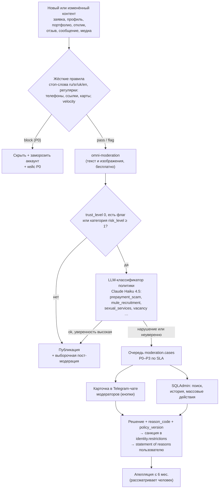

**Правило публикации — одно на весь проект** (уровни — [§13.2](#132-аутентификация-и-авторизация)):
- профили исполнителей и портфолио новых профилей всегда проходят ручную проверку P2, прежде чем появиться в каталоге;
- заявки, отклики и сообщения публикуются после автопроверок: правила, omni-moderation, LLM-классификатор. Классификатор вызывается для уровня 0 и при любом флаге. Если есть флаг, классификатор не уверен или у категории `risk_level ≥ 1`, контент уходит в очередь P2;
- контент уровня 0 выборочно проверяется после публикации.

Сценарий «срочно вечером» не ждёт модератора. LLM-классификатор — Must в MVP: на нём держится модерация по риску.

**Как устроено (шаг 2.6).** Контентный модуль в транзакции, где объект стал «на проверке», публикует событие `ModerationRequested` (тип и id объекта, автор, правка ли); подписчик `moderation.auto_check` читает текст и файлы через адаптер цели (`moderation/infrastructure/targets/<тип>.py` — фасад модуля-владельца: `content`, `publish`, `hide`) и решает маршрут (`moderation/domain/pipeline.py`). Сообщение чата видно сразу (6.3a): адаптер отдаёт его как уже видимое (`TargetContent.visible`), и очередь скрывает его только при признаке нарушения (`Routing.flagged`: слово словаря, velocity, omni, метка классификатора, кроме `contact_leak`); недоступный AI, сомнение классификатора и детекторы контактов и предоплаты открывают кейс, не пряча сообщение — контакты в переписке закрывает маскирование, о предоплате предупреждает памятка. Внешние вызовы — до транзакции; публикация или скрытие, кейс и заморозка аккаунта при P0 — в одной. Решение модератора действует на объект через тот же адаптер: одобрение публикует (и снимает заморозку автопроверки), отказ скрывает. До чата модераторов (2.5b) и админки (2.7b) кейсы смотрят и решают командами `cli moderation-queue` и `cli moderation-decide` (решает только роль moderator или admin).

**Жёсткие правила (шаг 2.4).** Словарь `moderation.content_rules` загружается из `backend/seeds/moderation/content_rules.yaml` (`cli seed`) и сравнивается со **скелетом** текста (`platform/text/normalize.py`): регистр, письменность (кириллица и латиница), «цифры вместо букв», повторы, «п.р.е.д», невидимые символы, ударения, буквы-двойники других алфавитов и русский транслит сводятся к одной форме, поэтому сербское слово в словаре пишется один раз. Детектор контактов и предоплаты (`platform/text/contact_masking.py`) работает всегда, без словаря. Velocity — один текст от нескольких аккаунтов или повтор автора (отпечаток — скелет без контактов, счётчики в Valkey, fail open). Набор примеров `seeds/moderation/rule_examples.yaml` проверяет `cli seeds-validate`. Во внешний AI уходит текст без контактов, имени и id автора.

Это отход от рекомендации [research/06](research/06-trust-safety-growth-monetization.md#23-трение-и-лимиты) премодерировать первые публикации всех новых аккаунтов. Компенсация — лимиты для новичков (§13.3), классификатор и пост-модерация ([ADR-0016](adr/0016-trust-safety-and-reviews.md)).

### 14.2. Очереди и SLA

| Очередь | Что попадает | Автодействие | SLA (08:00–23:00) |
|---|---|---|---|
| P0 Safety | Наркотики, вербовка, оружие, сексуальные услуги, угрозы, дети | Скрыть, заморозить аккаунт | ≤ 1 ч |
| P1 Fraud | «Взял предоплату», фишинг, самозванцы, «это я на фото» | Скрыть ссылки, ограничить действия | ≤ 2 ч |
| Legal notice (v1) | Заявления третьих лиц о незаконном контенте (ст. 20 ZET). В MVP такие жалобы идут очередью P1 ([ADR-0018](adr/0018-mvp-scope-anonymous-no-payments.md)) | Таймер `due_at` | ≤ 2 рабочих дня |
| P2 Premod | Профили и портфолио новых, флаги классификаторов | Держать до решения | ≤ 30 мин |
| P3 Verification (v1) | KYC-исключения, APR, лицензии | — | ≤ 24 ч |
| Appeals | Апелляции | — | ≤ 72 ч |

### 14.3. Верификация и бейджи

| Уровень | Как | Когда | Бейдж |
|---|---|---|---|
| L0 Telegram | Проверка `initData` | Всегда (MVP) | — |
| L1 Телефон | `requestContact` (`contact.user_id == from.id`) | MVP: добровольно, повышает `trust_level` до 1 | «Телефон подтверждён» |
| L2 Личность | Didit (500 KYC/мес бесплатно). Храним результат, но не изображения | v1: категории «дети», «уход», «ключи от дома» (в MVP они не запускаются) и платные функции | «Личность подтверждена» + дата |
| L3 Видеозвонок | Модератор, 5–10 мин | v1: Top-статус, спорные случаи | «Проверен вручную» |
| L4 Бизнес | Ручная сверка MB/PIB в APR — проверка декларации, а не источник статуса | v1, по желанию | «Предприниматель (APR)» |
| L5 Квалификация | Документы, реестры (адвокаты, судебные переводчики) | v1: юридические, медицинские и прочие регулируемые категории | «Лицензия проверена» |
| L6 Портфолио | pHash-дубликаты (MVP), выборочный reverse image search (v1) | Новые профили, Top | «Портфолио проверено» |

### 14.4. Отзывы, санкции, споры

- **Отзывы** ([§7.9](#79-жизненные-циклы-и-state-machines)):
  - только по сделкам `completed`, окно 14 дней;
  - в MVP отзыв оставляет клиент, публикуется сразу после автопроверок;
  - в v1 появляются оценки клиентов исполнителями и double-blind;
  - один ответ исполнителя;
  - показ — байесовское среднее, ранжирование — нижняя граница интервала, «Новый специалист» при n < 3;
  - детекция сговора (связи, время, граф, схожесть текста) → заморозка веса → ручная проверка;
  - «отзывы до платформы» — отдельно, в рейтинг не входят.
- **Санкции:** предупреждение → страйк 1 (лимиты на 7 дней) → страйк 2 (запрет откликов на 30 дней) → страйк 3 (бан). Серьёзные нарушения — сразу приостановка. P0 — перманентный бан по телефону, хэшу Telegram ID и хэшу документа (если был KYC). Апелляции (`POST /appeals`) работают с MVP, окно — 6 месяцев; до его конца отклонённый контент хранится скрытым.
- **Споры** (`deals.disputes`): вторая сторона получает 48 ч на ответ → медиация → решение и statement of reasons → апелляция. Эскроу нет ([ADR-0017](adr/0017-payments-for-services-outside-platform.md)), поэтому инструменты — санкции, снятие бейджей, чёрные списки и предупреждения другим пользователям.
- **Вещи (после MVP, итерация «Вещи»)** — [research/08 §4, §6.8–6.9](research/08-goods-marketplace.md#69-модерация-в-масштабе):
  - `target_type='listing'`, отдельный промпт и метки для объявлений: `prohibited_item`, `reseller`, `counterfeit`, `phishing_link` / `lookalike_domain`, `off_platform_payment`, `animal`, `currency_exchange`, `ok`. Метки услуг `not_a_service_request` и `vacancy` сработали бы на каждом объявлении. Закрытый список 8–10 категорий, словарь запретов и антифишинговая политика — до запуска «Вещей-0»;
  - vision-проверка всех фото (Claude Haiku 4.5): `omni-moderation` не видит на фото оружие, наркотики и лекарства. Anthropic становится обработчиком изображений — это расходится с [§13.4](#134-защита-данных-zzpl--что-заложено-в-систему) «без изображений людей там, где это не нужно», поэтому нужны политика конфиденциальности, ROPA и в iOS согласие `ai_processing`;
  - санкции по вертикалям (`identity.restrictions.scope`, `kind='selling_blocked'`), P0, мошенничество и фишинг — всегда на весь аккаунт. Узкое место — часы модераторов в окне 08:00–23:00, график дежурств утверждается до запуска пилота.

### 14.5. Прозрачность и публичные страницы

В MVP есть только «Правила площадки» и краткая политика конфиденциальности. Остальные страницы и раскрытия появляются в v1 или вместе с юрлицом ([ADR-0018](adr/0018-mvp-scope-anonymous-no-payments.md)).

| Страница | Основание | Когда |
|---|---|---|
| «Как мы сортируем» — параметры ранжирования, ссылка из выдачи | ст. 28 ZZP | v1 |
| «Как мы проверяем отзывы» | ст. 19–20 ZZP | v1 |
| «Правила площадки» — запрещённые услуги, в том числе вакансии и найм; формулировки «задачи» и «заказы», а не «работа» и «вакансии» | Риск посредничества в трудоустройстве | MVP |
| Текст о распределении обязанностей «платформа — исполнитель» рядом с офферами | ст. 28 ч. 1 п. 4 ZZP | v1 |
| Статус исполнителя `trader` / `non_trader` по декларации: бейдж в карточке и в отклике. Для `non_trader` — предупреждение, что закон о защите потребителей к нему не применяется | ст. 28 ч. 1 п. 2–3 ZZP | v1 |
| Страница реквизитов: наименование, адрес, e-mail, регистрационные данные, надзорный орган, PIB и номер PDV, цены с налогами | ст. 6 ZET, ст. 12 и 27 ZZP | v1, после юрлица |
| Контакты для жалоб | App Store 1.2 | MVP (поддержка через бота) |
| Отчёт о прозрачности раз в полгода | DSA как ориентир | v1 |

---

## 15. Монетизация

Решения — [ADR-0014](adr/0014-monetization-and-billing.md) и [ADR-0017](adr/0017-payments-for-services-outside-platform.md).

### 15.1. Модель по этапам

| Этап | Что продаём | Кому | Канал оплаты |
|---|---|---|---|
| **MVP (0–3 мес. после запуска)** | Ничего; модуля billing нет ([ADR-0018](adr/0018-mvp-scope-anonymous-no-payments.md)). Статус Founding для первых 150–200 специалистов, лист ожидания Pro | — | — |
| **v1** (после ворот ликвидности в паре «город × категория») | `pro_month`: видимость и инструменты — бейдж Pro, 1 буст в месяц, статистика, расширенное портфолио, 30 активных откликов вместо 10. «Ранний доступ к заявкам» — только кандидат после заключения юриста: похоже на плату за доступ к работе. Плюс `boost_profile_7d` и `boost_response` — всё маркируется. Цены **[Допущение]**: Pro — 990–2 490 RSD-экв. ([research/01](research/01-competitors-and-market.md#54-монетизация-по-этапам)) или 990–1 490 ([research/06](research/06-trust-safety-growth-monetization.md#64-ценовые-якоря-в-сербии)) | Только профили `pro` | Telegram Stars (подписка на 30 дней, разовые инвойсы) |
| **v1.5** (эксперимент) | «Плата за взаимный интерес»: исполнитель платит, когда его выбрали или открыли контакт | 1–2 категории, A/B | Stars |
| **Этап 2** | Те же SKU | pro | Apple IAP, Google Play Billing; веб — сербский эквайринг (карта, IPS) после выбора юрлица, с фискальными чеками |
| **Позже** | «Срочно» для клиентов, B2B-тарифы (салоны, бригады), «безопасная сделка» через лицензированного PSP | — | — |

**Чего не делаем:**
- комиссию со сделки — обходится и требует лицензии;
- плату за отклик — главная боль на рынке;
- плату за доступ к заявкам с `casual` — риск посредничества в трудоустройстве;
- ссылки на внешнюю оплату цифрового из Telegram, iOS и Android.

**Ворота ликвидности** в паре «город × категория» — 4 недели подряд выполняются все условия:

| Метрика | Порог |
|---|---|
| Response rate@4h | ≥ 70% |
| Fill rate | ≥ 35% |
| Медианный win rate | ≥ 15% |

### 15.2. Как это заложено в систему

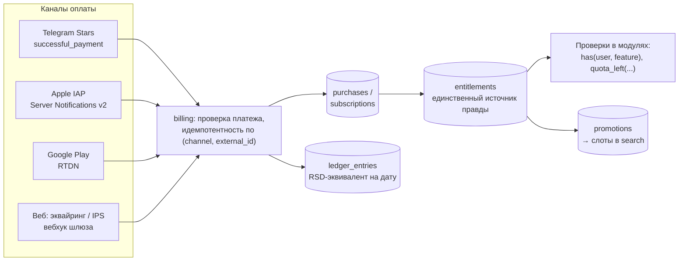

- **Каталог SKU и цены по каналам:** `billing.products` + `billing.prices` (XTR, IAP-SKU, Play-SKU, RSD).
- **Проверки в коде** идут по фичам, а не по планам: `quota(user, "active_responses")`, `has(user, "pro_badge")`. Поэтому в новом канале — только новый адаптер.
- **Учёт.** Каждая транзакция хранит RSD-эквивалент на дату и канал. Налоговая квалификация выручки в Stars и Gram (TON) — открытый вопрос к бухгалтеру после MVP.
- **Обязательно для Stars:** команды `/paysupport` и `/terms`, возвраты через `refundStarPayment`.
- **В MVP модуля billing нет** ([ADR-0018](adr/0018-mvp-scope-anonymous-no-payments.md)). Лимит 5 откликов на заявку и антиспам-лимиты (§13.3) — простые счётчики в модулях `jobs` и `platform`. Статус Founding — флаг профиля. Схемы `billing.*` и сервис entitlements появляются в v1 без переделки других модулей: проверки уже спрятаны за портом `Entitlements` (`platform/entitlements/port.py`, с 5.4), который в MVP возвращает «без ограничений» (`UnlimitedEntitlements`); отклик сверяется с квотой `active_responses`.
- **Вещи (после MVP, итерация «Вещи»).** Раздел бесплатный. Монетизация (≈ 1–1,5 pw) — бусты и подписка магазинов за Stars: SKU `goods_*` для частных продавцов без KYC, `promotions.target_type='listing'`. Включается только при юрлице, готовом `billing` и 4 неделях подряд «живого» раздела. Базовая выручка ≈ €390 в месяц, после revenue share админам ≈ €270–310 — меньше стоимости владения стадии «Раздел» ≈ €375–730 в месяц ([research/08 §5.2, §5.7](research/08-goods-marketplace.md#57-стоимость-владения)).

---

## 16. Инфраструктура и DevOps

Решение — [ADR-0015](adr/0015-hosting-and-deployment.md). Основа — [research/07 §4](research/07-postgres-lab-and-infra.md#4-часть-b-инфраструктура).

### 16.1. Локальная разработка (docker-compose)

`infra/compose/docker-compose.dev.yml`:

| Сервис | Образ | Назначение | Порт (только 127.0.0.1) |
|---|---|---|---|
| `postgres` | Свой: `postgres:18.6-trixie` + `postgresql-18-postgis-3` (PGDG), Dockerfile в `infra/postgres/`. Инициализация с UTF-8 `LC_CTYPE`, роли, расширения, FTS-конфигурации | Основная БД, очередь задач | 5432 → свободный (например, 55432) |
| `valkey` | `valkey/valkey:9.1` | Кэш, rate limits, FSM бота | 6379 → свободный |
| `garage` | `dxflrs/garage:v2.4.1` (`--single-node --default-bucket`) | S3 для медиа; бакеты `incoming`, `media`, `private` | 3900 |
| `imgproxy` (профиль `media`, v1) | `darthsim/imgproxy:v4.0.15` | Ресайз на лету из Garage | 8080 |
| `mailpit` | — | Не нужен: e-mail не используется | — |

Процессы `web`, `bot`, `worker` в разработке запускаются вне Docker через `uv run` с hot reload. Бот в dev работает в polling-режиме (отдельный тестовый бот). Для проверки Mini App на телефоне используется тестовое окружение Telegram (там допускается HTTP) или туннель `cloudflared`.

**Правила:**
- образы закрепляются по digest;
- в Docker-лимитах — `cpuset`, а не `cpus`, иначе CFS-квота искажает замеры;
- порты биндятся на `127.0.0.1`.

### 16.2. Окружения

| Окружение | Где | Данные | Telegram |
|---|---|---|---|
| dev | Ноутбук | Сиды: справочники, таксономия, синтетика | Тестовый бот (test environment) |
| stage | Hetzner CX23, всё на одной VM | Анонимизированные сиды, отдельные бакеты R2 | Отдельный бот, тестовые Stars |
| prod | Hetzner nbg1/fsn1: `app-1` + `db-1` (CX33) | Боевые | Основной бот с Main Mini App |

### 16.3. Продакшен

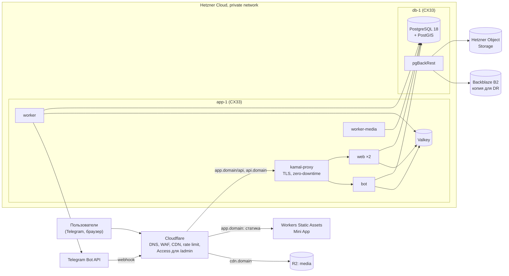

### 16.4. CI/CD

| Этап | Что происходит |
|---|---|
| PR (backend) | `ruff`, `mypy` (strict для domain и application), `import-linter`, pytest (unit + интеграция на PostGIS service-контейнере из нашего образа + Garage), `alembic check`, smoke `show_trgm('тест')`, schemathesis по OpenAPI, `oasdiff` против `main`, `pip-audit` |
| PR (frontend) | Генерация `api-client` из свежего `openapi.json` (падение при расхождении), `tsc`, ESLint, Vitest, Playwright (браузерная оболочка), бюджет бандла |
| merge в `main` | Сборка образа backend (amd64) → `ghcr.io/<org>/backend:<sha>` по digest; `wrangler deploy` Mini App на stage; `kamal deploy -d stage` |
| Релиз | Ручное подтверждение → `kamal deploy -d production`: pre-deploy hook `alembic upgrade head`, healthcheck `/up`, переключение без простоя; откат — `kamal rollback <version>` |
| Ежемесячно | Workflow `restore-test`: восстановление последнего бэкапа на временную VM и smoke-тесты |

**Миграции** — только expand/contract. Каждая миграция совместима с предыдущей версией приложения:
- `SET lock_timeout = '3s'`;
- `CREATE INDEX CONCURRENTLY` в `autocommit_block`;
- удаление колонок — отдельным релизом после того, как код перестал их читать.

### 16.5. Наблюдаемость

| Что | Инструмент | Алерты (стартовые) |
|---|---|---|
| Ошибки | Sentry: FastAPI, SQLAlchemy, свои middleware для aiogram и Procrastinate; фронт — `@sentry/react` | Новый тип ошибки; частота ошибок > 1% запросов |
| Метрики | `prometheus-client` + Grafana Alloy → Grafana Cloud: RED-метрики API, лаг очередей, 429 от Telegram, латентность поиска, лаг read-model, `pg_stat_statements` через postgres_exporter, node exporter | p95 API: warning > 150 мс 15 мин, critical > 300 мс 10 мин; лаг `notifications` > 2 мин; диск > 80%; реплика или бэкап не свежие |
| Логи | structlog JSON → Loki (Grafana Cloud) | Всплеск 5xx, ошибки webhook Telegram |
| Трейсы | OpenTelemetry (FastAPI, SQLAlchemy, psycopg) → Tempo — вторым шагом, с семплированием | — |
| Uptime и cron | UptimeRobot (`/up`, Mini App); Healthchecks.io: heartbeat воркеров, pgBackRest, restore-тест | Пропуск heartbeat |
| Продуктовые метрики | Серверные события → PostHog EU и дашборд ликвидности по паре «город × категория». Раздел «Вещи»: в MVP — одно событие `goods_waitlist_joined` с S58, сигнал к точке решения 1 ([§20.5](#205-итерация-вещи-после-mvp)); события следующих стадий — [PRODUCT.md](PRODUCT.md#раздел-вещи-после-mvp) | Падение response rate@4h ниже порога |

### 16.6. Стоимость

Цены в месяц, без НДС. Юрлица в MVP нет ([ADR-0018](adr/0018-mvp-scope-anonymous-no-payments.md)); после регистрации НДС, вероятно, пойдёт по reverse charge — вопрос к бухгалтеру. Цены Hetzner на LB, IPv4 и трафик сверх пакета — **[Допущение]**: взяты из вторичных источников, сверить в консоли при заказе.

| Статья | MVP | Через год |
|---|---|---|
| VM (Hetzner) | 2 × CX33 = €16,98 | 2 × CX33 (app) + CX43 (db) + CX33 (реплика) + LB €7,49 ≈ €48,95 |
| Бэкапы VM и IPv4 | €3,40 + ≈ €1 | ≈ €5,40 |
| Объектное хранилище бэкапов (Hetzner Object Storage) | €6,49 | €6,49–12,96 |
| **Итого в €** | **≈ €28** | **≈ €61–67** (до €138 с dedicated CCX23 для БД, [research/07 §4.4](research/07-postgres-lab-and-infra.md#44-оценка-стоимости-b4)) |
| Cloudflare (R2, Workers, CDN, Access) | $0–5 (бесплатные лимиты) | $10–25 (500 GB медиа, egress бесплатный) |
| Backblaze B2 (вторая копия бэкапов) | ≈ $0,2 | ≈ $2 |
| Sentry, Grafana Cloud, uptime | $0 | $26–45 |
| GitHub | $0–8 | $8 |
| AI-модерация; KYC — с v1 | < $20 (omni-moderation бесплатно, LLM-классификатор) | $30–80 (с Didit KYC) |
| Telegram | $0 (paid broadcasts — только от 100 000 MAU и 100 000 Stars на балансе) | $0 |
| **Итого внешние сервисы** | **$0–35** | **$75–160** |

Раздел «Вещи» (после MVP, итерация «Вещи») вычислительную инфраструктуру не меняет. Дельта — ≈ €5–50 в месяц в реалистичном сценарии (в основном vision всех фото, плюс R2) и ≈ €90–300 в стресс-сценарии. Люди — модерация, поддержка, время основателей — стоят дороже инфраструктуры ([§20.5](#205-итерация-вещи-после-mvp)).

---

## 17. Путь в App Store и Google Play

Основа — [research/04 §5–8](research/04-frontend-and-mobile.md#5-требования-app-store-и-google-play), [ADR-0012](adr/0012-mini-app-frontend-and-mobile-path.md).

### 17.1. Что уже заложено на этапе 1

| Требование этапа 2 | Что сделано сейчас |
|---|---|
| Бизнес-логика вне клиента | Весь функционал в backend; бот и Mini App — клиенты API (§5, ADR-0003) |
| Вход без Telegram (4.2.3(i)), Sign in with Apple (4.8) | `auth_identities` с несколькими провайдерами; эндпоинты `/auth/apple`, `/auth/google`, `/auth/phone/*`, `/auth/telegram/oidc` спроектированы; сессии не зависят от платформы |
| Связь аккаунтов Telegram ↔ iOS | Telegram OIDC (claim `id`; **[Допущение]**: совпадает с `user.id` Bot API, проверить на тестовом аккаунте) + fallback `start=link_<nonce>`; сценарий слияния |
| UGC (1.2, Play UGC) | Жалобы, блокировки, фильтрация, модерация, контакты поддержки — уже в MVP |
| Удаление аккаунта в приложении (5.1.1(v)) и по веб-ссылке (Play) | `POST /me/deletion`, задача удаления, страница удаления в веб-оболочке |
| Push | `notifications.channels` поддерживает `apns` и `fcm`; `POST /me/push-devices`; уведомления — шаблоны, не завязанные на Telegram |
| IAP и Play Billing | `billing.prices` с `store_product_id`, entitlements не зависят от канала (3.1.3(b)); модуль `billing` — с v1 ([ADR-0018](adr/0018-mvp-scope-anonymous-no-payments.md)) |
| Deep links и universal links | Единая схема сущностей (`packages/links`), канонические `https://<domain>/j/<id>`; `/.well-known/` зарезервирован под AASA и `assetlinks.json` |
| Эволюция API | `/api/v1`, аддитивные изменения, `X-Client`, `/client-config` с `min_supported_version`, ответ 426 |
| Офлайн и ретраи | Курсоры, ETag, `Idempotency-Key`, `client_msg_id` |
| Общий клиентский код | `packages/api-client`, `domain`, `hooks`, `i18n`, `design-tokens`, `links`, `platform` |
| Гостевой доступ (5.1.1(v)) | Каталог и профили доступны без логина (🔓 в §8.5) |

### 17.2. Что добавляется на этапе 2

| Область | Работы |
|---|---|
| Клиент | `apps/mobile` на Expo: экраны на RN (FlashList, expo-image), Expo Router, реализации `platform` (secure-store, notifications, location, image-picker), MMKV-кэш |
| Вход | Sign in with Apple (обязателен рядом с Telegram-входом), Telegram Login SDK (OIDC), телефон + OTP (Telegram Gateway $0,01 и SMS-fallback), Google Sign-In; relay-адреса Apple (`private.icloud.com`) |
| Backend | Адаптеры провайдеров входа; APNs/FCM-отправитель (через Expo Push или напрямую); проверка IAP (App Store Server API v2) и Play (Developer API + RTDN); отзыв токенов SiwA при удалении аккаунта |
| Чат | Нативный экран диалога на том же API + push; SSE на переднем плане |
| Сторы | Apple Developer Program на организацию (D-U-N-S), Google Play Organization-аккаунт (иначе действует правило «12 тестеров × 14 дней»), privacy labels и Data safety по реестру SDK, возрастной рейтинг 18+ (анкета с вопросами про social media — обязательна с сентября 2026), демо-аккаунт для ревью, актуальный iOS SDK (с апреля 2027 — iOS 27 SDK) / target API 36 или новее на момент релиза ([research/04](research/04-frontend-and-mobile.md#5-требования-app-store-и-google-play)) |
| Оплата | Те же SKU через IAP и Play; в iOS и Android нет CTA на внешнюю оплату цифрового; оплата работы мастера — вне IAP (3.1.3(e)) |
| AI-согласие | Экран согласия на передачу данных внешним AI (5.1.2(i)) |

**Объём этапа 2:** ≈ 50–56 person-weeks ([§20](#20-roadmap)); из них мобильный клиент, вход, push, покупки и связывание аккаунтов — ≈ 30–35 pw (мобильный разработчик + поддержка backend). Backend меняется только добавлением адаптеров.

---

## 18. Масштабирование

### 18.1. Узкие места по мере роста

| Узкое место | Симптом | Первый шаг | Следующий шаг |
|---|---|---|---|
| Рассылка уведомлений | Очередь `notifications` растёт при всплеске заявок; упираемся в лимит Bot API ≈ 30 msg/s | Дебаунс и дайджесты, приоритеты (сообщения чата > отклики > новые заявки), тихие часы, точные подписки | Paid broadcasts (доступны от 100 000 MAU и 100 000 Stars на балансе); push в мобильном приложении; вынести `notifications` в отдельный сервис |
| Поиск в каталоге | p95 выдачи > 200 мс при нормальной нагрузке | Индексы по отчёту лаборатории, кэш популярных выдач (Valkey, TTL 30–60 с), read replica для поиска | Meilisearch/Typesense за `SearchPort` (read-model уже денормализована, перенос дешёвый) |
| Матчинг подписок | Долгий матчинг при тысячах подписок | GIN по `category_ids` + фильтр по городу, пакетная обработка | Инвертированный индекс в Valkey: (категория, район) → подписчики |
| Соединения к PostgreSQL | Исчерпание `max_connections` при росте реплик | Пулы в приложении (psycopg_pool) + PgBouncer ≥ 1.22 (transaction mode с `max_prepared_statements`; prepared statements psycopg работают через PgBouncer только с libpq ≥ 17) | Read replicas для чтения |
| Очередь задач в PostgreSQL | Сотни задач в секунду, bloat таблиц задач | Ретеншн, настройка autovacuum, разнесение очередей | Taskiq + Valkey Streams + outbox за тем же портом `JobQueue` |
| Транскодинг видео | Воркеры `media` съедают CPU и мешают API | Отдельная VM или машины под очередь `media` | Managed video (Cloudflare Stream / Bunny Stream) |
| Realtime-чат | Много постоянных соединений WebSocket/SSE | Отдельный процесс `realtime` с Valkey pub/sub | Выделить `messaging` |
| Медиа-трафик и хранение | Растут объём R2 и число запросов к нему (egress у R2 уже бесплатный) | CDN с долгим кэшем, варианты правильного размера, AVIF/WebP | Правила жизненного цикла для старых оригиналов; сервис ресайза на лету вместо заранее нарезанных вариантов |
| Таблицы-журналы | `messages`, `notifications`, `deliveries`, `audit_log` растут быстрее всех | Ретеншн и архивирование | Партиционирование по месяцам (`pg_partman` или декларативно) |

### 18.2. План роста по этапам

1. **Старт (до ~5k MAU).** Одна VM под процессы приложения, одна — под PostgreSQL. Масштабируемся вертикально.
2. **Рост (5–50k MAU).** 2+ реплики API за балансировщиком; воркеры на отдельной VM; PgBouncer; read replica для поиска и аналитики; кэш справочников и популярных выдач.
3. **Масштаб (50k+ MAU, несколько стран).** Выделение `notifications` и `media` в сервисы, отдельный поисковый движок, брокер событий вместо очереди задач для межсервисных событий, партиционирование журналов.

Ни один шаг не требует переписывать модули: меняется развёртывание и адаптеры за портами.

### 18.3. Раздел «Вещи»: дешёвые меры и триггеры выделения (после MVP, итерация «Вещи»)

Допуск: раздел работает как модуль `goods` и прошёл ворота пилота. Пороги стартовые, калибруются по метрикам `module="goods"` ([§5.8](#58-модуль-goods-после-mvp-итерация-вещи)) **[Допущение]**. Источник — [research/08 §6.5](research/08-goods-marketplace.md#65-метрики-триггеры-пересмотра).

**Дешёвые меры внутри монолита** — сработал триггер, принимаем меру. Выделение в сервис эти триггеры не лечит.

| # | Триггер | Порог | Мера |
|---|---|---|---|
| M2 | Объём и поиск | p95 поиска > 200 мс после кэша и индексов или ~1 млн документов | Typesense за `GoodsSearchPort` |
| M3 | Медиа | Доля `goods` в CPU `worker-media` ≥ 70% и лаг `media_goods` > 5–10 мин в пике | `worker-media` на своей VM |
| M5 | Релизы | ≥ 2 раз в месяц релиз ядра блокирован работой по вещам или наоборот | Флаги, expand/contract миграции |
| M1a | Нагрузка на БД | Доля `goods` во времени БД > 40% за 7 дней или в RPS ≥ 60% | Роль `web-goods` на отдельной VM (маршрут `/api/v1/goods/*` — на краю Cloudflare), кэш выдачи, read replica, вертикальный рост БД |

**Триггеры выделения в сервис** — только после того, как дешёвые меры приняты.

| # | Триггер | Порог |
|---|---|---|
| H1 | Отдельная команда | ≥ 2 инженера full-time только на вещах и ≥ 1 на ядре, и > 30% PR за квартал требуют согласования между командами |
| H2 | Отдельный продукт | Решение владельца: свой бренд или бот, отдельное юрлицо, white-label для админов |
| M1 | Шумный сосед после M1a | Доля `goods` во времени БД > 40% за 7 дней и p95 API услуг > 150 мс в пики вещей ≥ 3 раз в неделю |
| M4 | Инциденты | ≥ 60 минут деградации услуг за квартал с причиной в `goods` |

- **Правило решения.** Выделять при H1 или H2, либо при M1 или M4 четыре недели подряд. Дополнительно нужны низкая связность в обе стороны (N1: ≤ 5 фасадов ядра из `goods`, ≤ 3 модуля ядра вызывают `goods`, FK из ядра нет, ≤ 10 типов событий) и зрелость эксплуатации (N2: OTel-трейсинг, runbooks, дежурство минимум двух человек).
- **H3 — деньги через платформу** («безопасная сделка», эскроу, доставка с оплатой) — триггер выделения только платёжной части, как `billing` в [§5.6](#56-как-модули-будут-выделяться-позже), а не всего `goods`.
- **Не повод выделять:** «потом будет сложно вынести» (швы уже есть), «так красивее», аудитория меньше 5 тыс. MAU.
- **Путь выделения** (strangler fig), ≈ 6–12 pw и только при сработавшем триггере: роли Kamal `web-goods` и `worker-goods` → read replica и поисковый движок → схема `goods` в отдельный кластер через логическую репликацию → фасад как HTTP-клиент с сагами (продажа, каскад бана, удаление аккаунта) → события в NATS JetStream через outbox.

---

## 19. Риски и открытые вопросы

### 19.1. Риски

**Технические**

| Риск | Вероятность / влияние | Смягчение |
|---|---|---|
| Транзакционная постановка задач Procrastinate через SQLAlchemy async подтверждена только чтением кода | Средняя / высокое | Первая задача спайка. Если не подтвердится — `platform.outbox` + relay за тем же портом ([ADR-0008](adr/0008-background-jobs-and-outbox.md)) |
| SQLAlchemy 2.1 вышла 2026-09-24, часть экосистемы отстаёт (GeoAlchemy2 совместимость не заявляет) | Средняя / среднее | Smoke-тест в первую неделю; запасной вариант — 2.0.54 |
| Качество поиска на сербском: лёгкий стеммер, нет стоп-слов, пустые выдачи | Средняя / среднее | Таксономия и синонимы, fallback-цепочка, регрессионный набор «запрос → категория», журнал нулевых выдач |
| Зависимость от Telegram: правила, комиссии и пороги меняются в одностороннем порядке (paid broadcasts 10k → 100k, 15% за топики, защита origin) | Высокая / высокое | API-first, веб-оболочка, нативные приложения на этапе 2; механики Telegram — не ядро |
| Лимит рассылки ≈ 30 msg/s | Средняя / среднее | Точные подписки, дайджесты, приоритеты; push на этапе 2 |
| Self-managed PostgreSQL: bus factor, сломанные бэкапы | Средняя / высокое | pgBackRest, ежемесячный автоматический restore, runbook; managed-вариант — без изменения архитектуры |
| Фрагментация WebView (загрузка файлов на Android, HEIC и видео с iOS, пикеры на desktop) | Высокая / среднее | Тестовая матрица клиентов, fallback-пути, серверная нормализация медиа |
| Исчезновение образов и зависимостей (прецедент MinIO) | Низкая / среднее | Образы по digest, зеркало в GHCR, заменяемые адаптеры |
| Замеры лаборатории сделаны на ноутбуке | Низкая / низкое | Повторить `bench_in_container.sh` и `pgbench_run.sh` на целевой VM до запуска |

**Продуктовые**

| Риск | Вероятность / влияние | Смягчение |
|---|---|---|
| Узкий и сокращающийся русскоязычный рынок (≈ 80 тыс. человек **[Допущение]**, первичные ВНЖ −63% за 2023–2025) | Высокая / высокое | Фокус MVP — релоканты из Telegram-чатов, но интерфейс ru + sr с первого дня; сербские мастера — точечно через concierge; сербоязычные клиенты и веб-вход по телефону — v1, по сигналу спроса; мост ru ↔ sr; позже — другие страны |
| Админы чатов — привратники: контролируют доступ к основному сегменту, могут запретить посты, брать плату или уйти к конкуренту | Средняя / высокое | Партнёрство, а не конкуренция: «заявки дня», revenue share, бесплатный Pro для админов (v1); несколько чатов одновременно; свои каналы по городам и рефералы (v1) |
| Гонка с WOM: Mini App-каталог в тех же чатах с 22.09.2026, возможна связь с админами | Средняя / высокое | Раньше и глубже закрыть одну пилотную зону; отличие — доска заявок с откликами и бюджетом в RSD, отзывы только по сделкам, контакты скрыты до договорённости |
| Конкуренция: чаты диаспоры, Poisk.rs, MostApp, «Говорун» | Высокая / среднее | Дифференциация: доска заявок с бюджетом в RSD, отзывы по сделкам, лимит откликов, мгновенные подходящие заявки. Чаты — канал дистрибуции (автопостинг, revenue share админам) |
| Ликвидность («курица и яйцо») | Высокая / критическое | Supply-first, 1 зона × 5 категорий, concierge «3 предложения за час», Founding-статус для первых 150–200 специалистов, подработка как отдельная опора предложения, ворота перед открытием новых категорий |
| Обход платформы после обмена контактами | Высокая / среднее | Не берём комиссию; ценность повторных заказов (история, отзывы, «мои мастера») |
| Специалисты не готовы платить (v1) | Средняя / высокое | Freemium; Pro — видимость и инструменты: бейдж, буст раз в месяц, статистика, расширенное портфолио, 30 активных откликов вместо 10; цена ниже закрепа в чате. «Ранний доступ к заявкам» — только кандидат, после заключения юриста |
| Фейковые и «тестовые» заявки разочаровывают исполнителей | Средняя / среднее | Уровни доверия и лимиты для новых аккаунтов, LLM-классификатор, модерация, обязательный бюджет или «договорная», лимит откликов. Телефон — добровольный бейдж |
| Политическая чувствительность «русского» бренда | Средняя / среднее | Нейтральное название бренда: выбрано «Соседи» (2026-09-27) — общеславянское слово без политических ассоциаций, понятное и украинцам, и белорусам, и сербам (susedi); украинская локализация по спросу |

**Правовые** (подробно — [research/05](research/05-legal-and-payments-serbia.md#8-риски)). В MVP правовые механизмы сознательно сокращены, риски этого периода принял владелец продукта ([ADR-0018](adr/0018-mvp-scope-anonymous-no-payments.md)).

| Риск | Вероятность / влияние | Смягчение |
|---|---|---|
| Работа без юрлица анонимной командой: нет реквизитов по ст. 6 ZET, нельзя подключить эквайринг, получать выплаты Stars, публиковаться в сторах | Высокая (осознанно) / среднее | Принято владельцем; до монетизации не мешает. Юрлицо — первый шаг перед v1 |
| Подработка иностранцев без права на работу (для них — штраф 15–150 тыс. RSD и риск запрета въезда; для платформы — репутационный риск) | Средняя / среднее | Риск MVP принят владельцем. Формулировки «задачи», «заказы», «дополнительный доход», а не «работа» и «вакансии»; вакансии и найм запрещены правилами; с подработки не берём денег. Декларация исполнителя и «Легальный старт» — v1, позиция юриста — после MVP |
| Доска подработки может быть квалифицирована как посредничество в трудоустройстве | Низкая–средняя / среднее | Запрет вакансий и найма, монетизация как «продвижение услуг», заключение юриста после MVP |
| Неполные раскрытия онлайн-площадки по ZZP 35/2026 (ст. 19–20, 28; штрафы до 2 млн RSD) | Средняя / среднее | В MVP — правила площадки, политика конфиденциальности, отзывы только по сделкам, платного продвижения нет. Чек-лист [§14.5](#145-прозрачность-и-публичные-страницы) — в v1 |
| Новый закон о персональных данных вступит без переходного периода | Средняя / среднее | Уровень GDPR заранее, аналитика — на согласии |
| Налоги на выручку в Stars и Gram (TON) | Высокая / среднее | В MVP выручки нет; консультация бухгалтера до первой продажи в v1; учёт RSD-эквивалента |
| Лицензирование платёжных услуг (эскроу) | Низкая, если не делать / высокое | Деньги за услуги мимо платформы ([ADR-0017](adr/0017-payments-for-services-outside-platform.md)) |
| 152-ФЗ | Низкая / низкое **[Допущение]**: оценка без юриста | Не таргетировать РФ, не собирать гражданство |

**Раздел «Вещи» (после MVP, итерация «Вещи»)** — главные риски из [research/08 §9](research/08-goods-marketplace.md#9-риски), полный реестр там же.

| Риск | Вероятность / влияние | Смягчение |
|---|---|---|
| Конфликт с админами барахолок и потеря канала и для услуг. «Сербская барахолка» — и канал услуг, и главный соперник вещей. В Нови-Саде один админ — единственная точка вето. Для услуг этот риск выше оценён как «средняя / высокое» | **Высокая / критическое** | О вещах с админами не говорим, пока партнёрство по услугам не проработает ≥ 8 недель. «Вещи-0» кормит чаты карточками, а не заменяет их. Закрепы остаются у админов, общий чёрный список мошенников. Revenue share — слабый стимул, альтернатива — фикс за «витрину чата» или бесплатный Pro |
| Волна фишинга «получите оплату по ссылке» и репутационный удар, который переносится на услуги и на антискам по умолчанию | Высокая / высокое | Ссылки в диалогах по вещам запрещены всегда, трек-номер — структурированным сообщением, предупреждения и баннер, быстрые баны. Порог < 2 подтверждённых жалоб на 1 000 броней или продаж, опрос после «продано», стоп-кран `goods.read_only`. В позиционировании — не «защита от мошенников», а «ссылки запрещены, контакты скрыты до брони» |
| Усталость от уведомлений и блокировка бота целиком: бот у услуг и вещей один | Средняя / высокое | Уведомления вещей — только по opt-in, дайджест не чаще раза в сутки, лимит на пользователя, подбюджет ≤ 5 msg/s. Рост блокировок выше базовой линии услуг или opt-in ниже 70% — рассылки вещей выключаются ([§11.3](#113-каталог-уведомлений-mvp)) |
| Постоянная стоимость владения больше выручки | Высокая / среднее | ≈ 30–40 pw за 12–18 месяцев при всех стадиях. В стадии «Раздел» модерация, поддержка и время основателей стоят ≈ €375–730 в месяц против ≈ €270–310 выручки. Решение о каждой стадии — только с этим расчётом ([§20.5](#205-итерация-вещи-после-mvp)) |
| Размывание позиционирования и онбординга: одна фраза продукта — «проверенные мастера рядом», волна фишинга в вещах ложится на общий бренд. Заглушка S58 в MVP делает раздел видимым раньше, чем рекомендовало исследование | Средняя / высокое | S02, описание бота и формулировка продукта не меняются. Вход в вещи — только сегмент на Главной (S03). В закрытой бете сегмент по умолчанию выключен флагом (§19.2, вопрос 20). Бренд выбирается под услуги. Метрика — доля новых пользователей, пришедших через вещи и ни разу не открывших услуги |
| Ограничение бота Telegram за «regulated or questionable goods» (ToS 5.2(h)) | Низкая / критическое | Закрытый список 8–10 категорий, vision-проверка **всех** фото, метки классификатора для объявлений, премодерация по риск-сигналам ([§14.4](#144-отзывы-санкции-споры)) |
| Распыление фокуса и упущенная выгода: backend MVP — критический путь, v1 перегружен, 12–15 pw пилота — это возврат урезанных фич v1 или почти весь веб для сербов | Высокая / высокое | В MVP — только заглушка ≤ 0,25 pw. Решение — не раньше go/no-go услуг. Очередь дополнительной ёмкости: урезанный v1 → веб для сербов → вещи. Первый шаг — «Вещи-0» за 2–3 pw |

### 19.2. Открытые вопросы к владельцу продукта

Приняты разумные решения по умолчанию, работа не блокируется. Ответы могут изменить отмеченные ADR.

**Решения владельца от 2026-09-26** уже учтены во всех документах:
- основной сегмент клиентов — русскоязычные релоканты из Telegram-чатов; исполнители — русскоязычные специалисты, подработка и точечно сербские мастера через concierge;
- подработка — отдельная опора предложения;
- MVP запускается анонимно, без юрлица, платежей и юриста ([ADR-0018](adr/0018-mvp-scope-anonymous-no-payments.md)). Правовые и платёжные вопросы (№ 1, 5, 6, 9, 18 и весь [§19.3](#193-вопросы-к-сербскому-юристу-и-бухгалтеру-после-mvp-до-v1)) решаются после MVP и запуск не блокируют;
- ничего не удаляется: перенесённое из MVP уходит в v1.

**Решение владельца от 2026-09-27** — раздел «Вещи» ([§20.5](#205-итерация-вещи-после-mvp), [ADR-0019](adr/0019-goods-section-module-deferred.md)):
- «Вещи» — часть единого приложения (мастера, заявки и подработка, вещи) для СНГ-аудитории из Telegram-барахолок, а не конкурент KupujemProdajem и не отдельный продукт;
- не в MVP: в MVP только сегмент «Услуги / Вещи» на Главной и заглушка S58 с opt-in, остальное — после MVP, итерация «Вещи»;
- архитектура — модуль `goods` монолита, не микросервис; IA — вариант A из [research/08 §7.2](research/08-goods-marketplace.md#72-варианты-размещения-в-ia); название — «Вещи» (ru), «Oglasi» / «Огласи» (sr).

| # | Вопрос | Решение по умолчанию | Затрагивает |
|---|---|---|---|
| 1 | **Юрлицо и юрисдикция:** сербский DOO, компания в ЕС или холдинг? | После MVP, перед v1. По умолчанию — сербский DOO: местный эквайринг, IPS, SEF, не нужен представитель по ZZPL, Apple сам платит PDV | ADR-0014, ADR-0017, ADR-0018, §13.4 |
| 2 | **Пилотная зона и где физически команда:** Нови-Сад или центральные општины Белграда (Врачар, Стари-Град, Савски-Венац, Звездара, Нови-Београд)? | Там, где команда. Ручной онбординг и concierge требуют присутствия | Roadmap, PRODUCT.md |
| 3 | **Бренд и аудитория** — *решено владельцем*: основной сегмент — русскоязычные релоканты из Telegram-чатов | Интерфейс MVP — ru и sr (кириллица и латиница), en — v1; нейтральное название бренда — **«Соседи» / Sosedi** (решено владельцем 2026-09-27, в тот же день «Сосед» заменён на множественное число; @sosed_bot и @sosedbot заняты — имя бота с суффиксом, например @sosed_rs_bot, проверяется в BotFather); uk — по спросу | ADR-0013, PRODUCT.md |
| 4 | **Сербские исполнители на этапе 1** — *решено владельцем*: в MVP сербские мастера (сантехники, электрики) подключаются точечно через concierge и Mini App | Сербоязычные клиенты и веб-вход по телефону, уведомления по SMS или Viber — v1, по сигналу спроса | ADR-0012, §11 |
| 5 | **Подработка без права на работу:** достаточно декларации или требовать подтверждение? | После MVP. В MVP — правила площадки и формулировки «задачи» и «заказы», риск принят владельцем; декларация и «Легальный старт» — v1; подтверждение — по заключению юриста | ADR-0016, ADR-0018 |
| 6 | **Монетизация (v1):** Pro-подписка или «плата за взаимный интерес»? Готовы ли получать выручку в Stars (≈ 65% от цены, вывод в Gram) и работать 6–12 месяцев без выручки? | MVP бесплатный. В v1, после юрлица и ворот ликвидности, — Pro и бусты за Stars; взаимный интерес — A/B | ADR-0014, ADR-0018 |
| 7 | **Чат в MVP** (+1,5–2 недели) или только обмен контактами после выбора? | Базовый чат в MVP | ADR-0010 |
| 8 | **Чувствительные и запрещённые категории:** дети, уход за пожилыми, медицина, юристы, «ключи от дома» — запускать ли, с какой верификацией? | В MVP детских категорий нет: репетиторы — только для взрослых, плюс уроки сербского. Детские категории — в v1 вместе с KYC; медицина и юристы — не в первой волне | ADR-0016, ADR-0018, каталог |
| 9 | **Отзывы при удалении аккаунта:** удалять написанные отзывы (как требует Apple) или анонимизировать? | Удалять и пересчитывать рейтинг; согласовать с юристом после MVP | ADR-0016, §7.10 |
| 10 | **Оценки клиентов исполнителями:** видны только исполнителям? | Да, с v1 | ADR-0016 |
| 11 | **Видео в портфолио в MVP** и лимиты медиа | Should: ≤ 60 с, ≤ 200 MB, до 6 видео | ADR-0007 |
| 12 | **Managed или self-managed PostgreSQL**; целевые RPO/RTO | Self-managed на Hetzner, RPO ≤ 5 мин, RTO ≤ 2 ч | ADR-0005, ADR-0015 |
| 13 | **Кто модерирует** первые 3 месяца, на каких языках, в какие часы (SLA 08:00–23:00)? | Основатели; с ростом — 1–2 модератора на неполный день (ru + sr) | ADR-0016 |
| 14 | **Чаты диаспоры, WOM и Poisk.rs:** конкурировать или партнёриться? Публиковать заявки в городских каналах? | Партнёрство с админами: «заявки дня», revenue share, бесплатный Pro (v1); автопостинг заявок без персональных данных (v1) | Growth |
| 15 | **Пороги go/no-go** через 3 месяца: например, ≥ 80% заявок с откликом за 1 ч, ≥ 40% с выбором исполнителя | Утвердить [метрики PRODUCT.md](PRODUCT.md#метрики-успеха). Нижний порог пересмотра: response rate@1h < 60%, fill < 25%, repeat < 10% **[Допущение]** | Roadmap |
| 16 | **Бюджет запуска:** посевы в чатах (500–1 000 €), SaaS, AI-модерация, время модераторов | ≈ 1–2 тыс. € на первые 3 месяца + инфраструктура | Roadmap |
| 17 | **Сроки этапа 2 (iOS/Android)** и согласие на обязательный Sign in with Apple | Этап 2 после v1, SiwA обязателен | ADR-0009, ADR-0012 |
| 18 | **Показ цен в Stars (v1):** рядом с RSD-эквивалентом? | Да, Stars + «≈ N RSD» | ADR-0014 |

**Раздел «Вещи»** — вопросы из [research/08 §10](research/08-goods-marketplace.md#10-открытые-вопросы-к-владельцу), которые остаются открытыми после решения от 2026-09-27 и затрагивают архитектуру, ADR или roadmap. Полный список по разделу — в [PRODUCT.md, «Открытые вопросы к владельцу»](PRODUCT.md#открытые-вопросы-к-владельцу): там же мотив раздела и метрика продолжения, сербоязычная аудитория, проверка названия на носителях, измерения чатов и Facebook Marketplace. Ответы нужны до точки решения 1 (≈ 2027-06-08), если не сказано иное.

| # | Вопрос | Решение по умолчанию | Затрагивает |
|---|---|---|---|
| 19 | **Шаблон заявки «Уезжаю» на стороне услуг** (уборка при выезде, вывоз, переезд) — делать ли в MVP? Исследование рекомендует: сценарий «уезжающий → услуги» он закрывает и без раздела вещей | Не принято — решает владелец. Если да — ещё ≤ 0,25 pw сверх заглушки S58, из S58 ведёт ссылка на шаблон, вопрос «Продаёте вещи?» (G00) внутри шаблона — после публичного запуска | PRODUCT.md, §20.2 |
| 20 | **Показывать ли S58 в закрытой бете?** | Нет: сегмент «Вещи» выключен флагом до публичного запуска, бета проверяет ликвидность услуг | §20.5 |
| 21 | **Утверждаем ли пороги закрытия идеи** ([research/08 §1.3](research/08-goods-marketplace.md#13-самый-сильный-аргумент-против-и-что-его-опровергло-бы)) до начала измерений? | Да, до измерений чатов и интервью | §20.5 |
| 22 | **Очередь дополнительной ёмкости:** урезанный v1 → веб для сербов → вещи? Будет ли третий разработчик и идёт ли он сначала на дефицит v1? | Да, очередь принимается; третий разработчик — на дефицит v1 | §20.3, §20.5 |
| 23 | **Только C2C или со временем малый B2C** (секонд-хенды, handmade, «техника из Европы»)? | Только C2C, B2C — в полной версии после юрлица | ADR-0019, §7.11 |
| 24 | **Объявления «куплю / ищу»** (7% постов в Нови-Саде) — нужны ли? По механике это доска заявок с откликами | Отложить до стадии «Раздел» | §7.11 |
| 25 | **Когда раскрывать контакты по вещам:** после брони или продавец может открыть телефон сразу? | После брони | §5.8 (`messaging`) |
| 26 | **Путь доверия продавца:** засчитывать ли продажи в `trust_level`, нужен ли отдельный рейтинг продавца? | Отдельный агрегат рейтинга и только в полной версии; у вещей свои лимиты | §13.2, §13.3 |
| 27 | **Сроки брони и жизни объявления:** бронь 48 часов или 5 дней, объявление 30 дней? | Объявление — 30 дней, бронь — решить до пилота | §7.11 |
| 28 | **Вкладка «+» в таббаре противоречит Apple HIG** («не для действий») — заменить в нативной версии на плавающую кнопку или кнопку в шапке? | Решить до дизайна этапа 2 | PRODUCT.md, §17 |
| 29 | **Переговоры с админами барахолок:** кто из основателей и когда (не раньше 8 недель партнёрства по услугам)? Что предлагаем: фикс за «витрину чата», бесплатный Pro, revenue share, общий чёрный список? | Не раньше 8 недель партнёрства по услугам | Growth |
| 30 | **Кто и в какие часы модерирует товары,** привлекаем ли модераторов-партнёров? Нужен ли отдельный SLA для жалоб P1 по вещам (≤ 2 ч)? | Основатели в «Вещах-0», график дежурств — до пилота | ADR-0016, §14 |
| 31 | **Черногория** (@montenegro_market) — только после проверки вещей в Сербии? | Да | §7.11 (валюта) |
| 32 | **Что показывают сегмент «Вещи» и S58, если точка решения закрыла идею или отложила её до этапа 2?** | Решения нет — решает владелец до точки решения 1. Технически сегмент выключается флагом в `/client-config` без релиза (§20.5) | ADR-0019, §20.5, PRODUCT.md |

### 19.3. Вопросы к сербскому юристу и бухгалтеру (после MVP, до v1)

По [ADR-0018](adr/0018-mvp-scope-anonymous-no-payments.md) эти вопросы запуск MVP не блокируют. Закрыть их нужно до монетизации, публичного масштабирования и выхода в сторы.

1. Форма юрлица и налоговая структура: DOO, ЕС или холдинг; WHT; KYC учредителей.
2. Учёт и PDV выручки в Telegram Stars и Gram (TON); фискализация продаж через Google Play для DOO; подтвердить, что выручка от Apple (ADI) — экспорт услуг.
3. Не является ли доска заявок посредничеством в трудоустройстве (ст. 44 Zakon o zapošljavanju). Что нужно от площадки для подработки иностранцев: декларация, памятки или проверка права на работу.
4. Основание передачи данных через Telegram (ОАЭ) и формулировки политики конфиденциальности.
5. Раскрытия онлайн-площадки по ст. 28 ZZP; применимость ст. 6 (прайс в машиночитаемом виде) к тарифам платформы.
6. Регламент модерации отзывов и порядок notice-and-takedown по ст. 20 ZET.
7. Нужны ли DPO и формальная DPIA (рейтинги, антифрод, геоданные).
8. Что изменит новый закон о персональных данных после принятия (законный интерес, согласия).
9. Судьба отзывов при удалении аккаунта: удалять или анонимизировать.
10. Модель «безопасной сделки» — на будущее (варианты B–F в [research/05 §6.6](research/05-legal-and-payments-serbia.md#66-эскроу-и-безопасная-сделка)).
11. Раздел «Вещи» (после MVP, итерация «Вещи»): вопросы 18–30 из [research/08 §10](research/08-goods-marketplace.md#10-открытые-вопросы-к-владельцу) — хостинг-режим C2C-доски, ст. 28 ZZP в бесплатном разделе, цена в EUR, «отдам даром» для животных, санкционные товары и другие. Закрыть до пилота «Вещи-lite».

---

## 20. Roadmap

Команда: 1 backend-разработчик (Python) + 1 фронтенд-разработчик (TypeScript), дизайнер на неполный день, основатели — продукт, онбординг специалистов и модерация. Оценки — в person-weeks (pw), **[Допущение]** ±25%. Объём MVP сужен по [ADR-0018](adr/0018-mvp-scope-anonymous-no-payments.md); всё перенесённое учтено в v1 (§20.3).

```mermaid
gantt
    title Ориентировочный roadmap (старт 2026-10-05, 2 разработчика)
    dateFormat YYYY-MM-DD
    axisFormat %b %y
    section Этап 0
    Фундамент и спайки                    :f0, 2026-10-05, 3w
    section MVP (Telegram)
    Разработка MVP                        :m1, after f0, 19w
    Закрытая бета с founding-специалистами :b1, 2027-01-25, 6w
    Публичный запуск MVP (пилотная зона)   :milestone, l1, 2027-03-08, 0d
    section v1
    Правовой контур, монетизация, веб для сербов, мост ru-sr :v1, 2027-03-15, 16w
    section Этап 2
    iOS и Android на Expo, бизнес-аккаунты  :s2, after v1, 22w
    section Итерация Вещи, после MVP
    Заглушка S58 с публичным запуском       :milestone, gs58, 2027-03-08, 0d
    Измерения чатов и интервью, основатели  :gr0, 2027-04-05, 8w
    Точка решения 1, не раньше go или no-go услуг :milestone, gd1, 2027-06-08, 0d
    v1.5 возврат урезанного v1              :v15, after v1, 4w
    Вещи-0 в v1.5                           :g0, after v15, 2w
    Тест Вещей-0 в пилотной зоне            :g0t, after g0, 8w
    Точка решения 2                         :milestone, gd2, after g0t, 0d
    Пилот Вещи-lite, только по воротам      :g3, after g0t, 8w
    Пилот в зоне, 8 недель                  :g4, after g3, 8w
```

Секция «Итерация Вещи» — базовый путь из [research/08 §8.3](research/08-goods-marketplace.md#83-рекомендуемая-последовательность): стадии после «Вещей-0» наступают только по точкам решения. Веха заглушки S58 стоит на публичном запуске по решению по умолчанию ([§19.2](#192-открытые-вопросы-к-владельцу-продукта), вопрос 20). Бар этапа 2 на схеме не сдвинут, влияние вещей на него — в [§20.5](#205-итерация-вещи-после-mvp).

### 20.1. Этап 0 — фундамент и спайки (≈ 3 недели, ≈ 5–6 pw)

- Монорепо, `uv` и pnpm, CI (линтеры, тесты, import-linter, oasdiff), Terraform (Hetzner, Cloudflare), Kamal, образ PostgreSQL + PostGIS с правильной локалью, stage-окружение.
- Спайки:
  - транзакционная постановка Procrastinate через SQLAlchemy;
  - SQLAlchemy 2.1 + GeoAlchemy2;
  - проверка `initData` и JWT;
  - загрузка в R2 из WebView на iOS и Android (HEIC, видео);
  - прогон бенчмарков лаборатории на целевой VM.
- Контент: таксономия и синонимы для 5 категорий на ru и sr (английские синонимы — для поиска); полигоны районов пилотной зоны (OSM/RGZ + ручные «народные» районы).
- Дизайн-система на токенах Telegram, ключевые экраны в прототипе.
- Правила площадки (одна страница) и краткая политика конфиденциальности — своими силами; юрист — после MVP.

### 20.2. MVP — Telegram, пилотная зона, 5 категорий (≈ 19 недель, ≈ 34,5–34,75 pw)

Состав — Must из [PRODUCT.md](PRODUCT.md#состав-mvp).

| Блок | Backend, pw | Mini App, pw |
|---|---|---|
| Идентичность: вход по initData, онбординг с одной галочкой (правила площадки и 18+), согласия, настройки приватности, блокировки, удаление аккаунта; экспорт данных — вручную по запросу | 1 | 1,5 |
| Каталог: гео, таксономия, поиск (read-model, FTS, опечатки), фильтры, профиль специалиста, избранное | 3,5 | 2,5 |
| Кабинет исполнителя (pro и casual): профиль, прайс, портфолио, медиа-конвейер, бейдж «Телефон подтверждён», шаблоны откликов | 2,5 | 2,5 |
| Доска заявок: создание, модерация, лента, подписки, отклики (лимит 5), приглашения, выбор исполнителя, прямой запрос, сделки (`proposed` → `agreed`, отмена, спор) | 4 | 3,5 |
| Переписка (базовая): маскирование контактов до договорённости, «Поделиться контактом» после `agreed` | 1 | 1,5 |
| Отзывы: оставляет только клиент, ответ исполнителя, рейтинг (байесовское среднее, нижняя граница) | 0,75 | 1 |
| Уведомления и бот: команды, шаблоны, rate limiter, тихие часы, дайджесты, deep links, шаринг карточек | 2 | 0,5 |
| Trust & safety: правила, omni-moderation, LLM-классификатор, уровни доверия и лимиты, очереди, чат модераторов, SQLAdmin, аудит, жалобы, санкции, апелляции | 2,5 | 0,5 |
| Правила площадки и политика конфиденциальности, аналитика событий, дашборд ликвидности | 0,25 | 0,5 |
| Задел «Вещи» (решение владельца): сегмент «Услуги / Вещи» на S03 с бейджем «скоро», экран-заглушка S58 «Вещи — скоро», кнопка «Сообщить о запуске» (opt-in, событие `goods_waitlist_joined`). Всего ≤ 0,25 pw, делится **[Допущение]** | ≤ 0,05 | ≤ 0,2 |
| Стабилизация: нагрузочный прогон, безопасность, наблюдаемость, запуск | 1,5 | 1,5 |
| **Итого** | **≈ 19–19,05** | **≈ 15,5–15,7** |

- **Сроки.** При 1 backend + 1 фронтенд MVP занимает ≈ 19 недель разработки после 3 недель фундамента. Узкое место — backend: фронтенд загружен ≈ 15,5–15,7 недели, остаток уходит на полировку и тестовую матрицу WebView.
- **Закрытая бета** (с 2027-01-25, с 14-й недели разработки, 6 недель): каталог, доска, подписки, уведомления, модерация; 150–200 founding-специалистов и concierge.
- **Публичный запуск** (2027-03-08, после 19 недель разработки): чат, отзывы, шаринг, полировка.
- **Вариант ускорения:** второй backend-разработчик или fullstack — MVP за ≈ 13–14 недель.
- **Перенесено в v1** ([ADR-0018](adr/0018-mvp-scope-anonymous-no-payments.md)): модуль billing, KYC и детские категории, формальные раскрытия, декларация исполнителя, автоматический экспорт данных, таймер юридических уведомлений, double-blind, «Легальный старт».
- **Задел «Вещи»** (≤ 0,25 pw) укладывается в резерв фронтенда, backend-часть — доли дня. Итог MVP — ≈ 34,5–34,75 pw, сроки не меняются. Модуля `goods` в MVP нет. Состав заглушки и меры против размывания позиционирования — [§20.5](#205-итерация-вещи-после-mvp).
- **После MVP, итерация «Вещи»** — весь раздел «Вещи», кроме заглушки: модуль `goods`, правки ядра, экраны раздела ([§20.5](#205-итерация-вещи-после-mvp)).

### 20.3. v1 — правовой контур, монетизация и рост аудитории (≈ 16 недель, ≈ 38 pw)

Первый шаг — юрлицо ([ADR-0018](adr/0018-mvp-scope-anonymous-no-payments.md)): без него не включить реквизиты по ст. 6 ZET, выплаты Stars и эквайринг.

| Блок | Оценка, pw |
|---|---|
| Правовой контур (перенесён из MVP): реквизиты по ст. 6 ZET, «Как мы сортируем» и «Как мы проверяем отзывы» (S50, S51), статус `trader` / `non_trader` в карточке и отклике, декларация исполнителя, автоматический экспорт данных, таймер юридических уведомлений «2 рабочих дня» | 2 |
| Монетизация за Stars: модуль `billing` целиком (каталог продуктов, entitlements, леджер), Pro, бусты, `/paysupport`, учёт; ворота ликвидности. `/billing/checkout` — только Stars; оплата картой — на этапе 2, после юрлица | 6 |
| KYC (Didit) и детские категории; проверка APR и лицензий (бейджи L4, L5) | 2 |
| Веб-оболочка со входом по телефону для сербоязычных клиентов и исполнителей (по сигналу спроса): Telegram Gateway + SMS, уведомления по SMS или Viber (по решению), SEO-страницы профилей с Open Graph | 6 |
| Мост ru ↔ sr: автоперевод заявок, откликов и сообщений по кнопке (кэш, лимиты) | 2,5 |
| AI-разбор заявки из текста или голоса | 2,5 |
| Каналы по городам (автопостинг), inline mode и guest mode, реферальная программа с наградами, атрибуция каналов для revenue share админам | 3 |
| Переписка v1: ответ прямо в боте, SSE, фото в сообщениях | 3,5 |
| Отзывы v1: оценки клиентов исполнителями, double-blind для обеих сторон, фото в отзывах и фильтр «с фото», отзывы «до платформы» (если не вошли в MVP), споры v1 | 2,5 |
| Карта, рабочие часы, пакеты с фиксированной ценой, ценовые ориентиры по данным, сохранённые поиски | 5 |
| Английский интерфейс, второй город, новые категории (по воротам ликвидности), IPS QR для прямой оплаты | 2,5 |
| «Легальный старт»: гид по легальной подработке, партнёрства с бухгалтерами и агентствами (контент готовят основатели) | 0,5 |
| **Итого** | **≈ 38** |

Объём больше ёмкости двух разработчиков за 16 недель (≈ 32 pw): либо третий разработчик с начала v1, либо «Карта…» и «AI-разбор» уходят в следующий релиз. Порядок: правовой контур → монетизация → остальное.

Раздела «Вещи» в v1 нет: «Вещи-0» — в релизе v1.5, после возврата урезанных фич v1 и только по точке решения 1 ([§20.5](#205-итерация-вещи-после-mvp)).

### 20.4. Этап 2 — нативные приложения и масштаб (≈ 22 недели, ≈ 50–56 pw)

| Блок | Оценка, pw |
|---|---|
| Expo-приложение: экраны, навигация, медиа, карты | 20–25 (мобильный разработчик) |
| Вход в нативном приложении: Sign in with Apple, Telegram OIDC SDK, телефон | 3 |
| Push-уведомления | 2 |
| Оплата: IAP и Play Billing, проверка покупок | 3 |
| Оплата картой на вебе (после юрлица и выбора PSP) | оценка — после выбора PSP |
| Связывание и слияние аккаунтов | 2 |
| Бизнес-аккаунты: салоны, бригады, несколько специалистов под одним брендом | 6 |
| Запись по слотам и календарь | 6 |
| «Безопасная сделка» через лицензированного PSP (при положительном заключении юриста и спросе) | 6 |
| Семантический поиск и рекомендации (`pgvector`); поисковый движок — по триггерам [§9.8](#98-эволюция) | 3 |
| Экраны вещей в Expo — только если пилот «Вещи-lite» прошёл ворота (после MVP, итерация «Вещи», [§20.5](#205-итерация-вещи-после-mvp)) | 5–9 (мобильный разработчик), сверх 50–56 |

**Дальше:** украинская локализация, другие страны релокации (Черногория и др.) — архитектура это допускает: города, валюта и языки хранятся как данные.

### 20.5. Итерация «Вещи» (после MVP)

Раздел «Вещи» — продажа б/у и прочих вещей частными лицами внутри единого приложения. Архитектура — [§5.8](#58-модуль-goods-после-mvp-итерация-вещи) и [§7.11](#711-модуль-goods-после-mvp-итерация-вещи), решение — [ADR-0019](adr/0019-goods-section-module-deferred.md), обоснование и расчёты — [research/08 §1 и §8](research/08-goods-marketplace.md#8-влияние-на-roadmap-и-трудозатраты).

**Решение владельца.** Исследование рекомендовало не показывать раздел в MVP вовсе ([research/08 §1.2](research/08-goods-marketplace.md#12-вердикт)); владелец решил показать заглушку и зафиксировать архитектуру на будущее, а риск размывания позиционирования снижаем так: S02, описание бота и формулировка продукта не меняются, вход — только сегмент на Главной, модуль `goods` в MVP не пишется, экраны раздела (G01–G34) до точки решения 1 не проектируются. До ответа на вопрос 20 из [§19.2](#192-открытые-вопросы-к-владельцу-продукта) действует решение по умолчанию, а не решение владельца: в закрытой бете сегмент выключен флагом.

**Задел в MVP (≤ 0,25 pw)** — в объёме MVP ([§20.2](#20-roadmap)):
- на Главной (S03) — сегмент «Услуги / Вещи», у «Вещей» бейдж «скоро». Сегмент включается флагом в `/client-config`, по умолчанию — к публичному запуску, и выключается без релиза;
- новый экран S58 «Вещи — скоро» с кнопкой «Сообщить о запуске». Это opt-in: согласие сохраняется в `notifications.preferences` через `PUT /me/notification-settings`, при необходимости Mini App запрашивает `requestWriteAccess` **[Допущение: способ хранения]**;
- серверное событие аналитики `goods_waitlist_joined` — бесплатный сигнал спроса к точке решения 1;
- название в интерфейсе — «Вещи» (ru), «Oglasi» / «Огласи» (sr). IA раздела — вариант A из [research/08 §7.2](research/08-goods-marketplace.md#72-варианты-размещения-в-ia): сегмент на Главной, в пилоте «+» с выбором «Заявка на услугу / Продать вещь» и фильтр в Сообщениях «Все / Услуги / Вещи»;
- шаблон заявки «Уезжаю» на стороне услуг — рекомендация исследования, решения нет ([§19.2](#192-открытые-вопросы-к-владельцу-продукта), вопрос 19).

**Стадии итерации «Вещи»** ([research/08 §8.1, §8.3](research/08-goods-marketplace.md#81-оценка-по-стадиям), оценки ±30% **[Допущение]**):

| Стадия | Когда | Состав | pw |
|---|---|---|---|
| Измерения и интервью | Апрель–май 2027, силами основателей | Измерения продаваемости в чатах, 10–15 интервью с продавцами и покупателями (не с админами) | Время основателей |
| **Точка решения 1** | ≈ 2027-06-08, не раньше 3-месячного go/no-go услуг | Условия — ниже | — |
| «Вещи-0» | Релиз v1.5 (≈ 2027-07-05 → 2027-08-16) после возврата урезанных фич v1 (7,5 pw, ≈ 4 недели) | Минимальный модуль `goods`: объявление, фото, статусы «активно», «продано», «снято». Альбом боту с экраном согласия, страница карточки со статусом, карточка для чата через `shareMessage`, распродажа «Уезжаю» с кнопками заявок на услуги, vision всех фото и словарь запретов, префиксы `g_` и `gu_`. Своего чата нет: покупатель пишет продавцу в Telegram | ≈ 2–3 |
| Тест «Вещей-0» → **точка решения 2** | 6–8 недель в пилотной зоне, ≈ до 2027-10-11 | Пороги закрытия — ниже | — |
| Пилот «Вещи-lite» | Только по точке решения 2. С дополнительным разработчиком — параллельно этапу 2, готовность ≈ декабрь 2027. Пилот 8 недель, ворота ≈ конец января — февраль 2028 | «Вещи C2C-lite»: только частные лица, закрытый список 8–10 категорий, лента, поиск, чат с бронью, дайджест, раскрытия ст. 28 ZZP, меры изоляции [§5.8](#58-модуль-goods-после-mvp-итерация-вещи) | ≈ 12–15 (≈ 10–12 поверх «Вещей-0») |
| «Раздел» | После ворот пилота: 4 недели подряд «живой раздел» | Атрибуты и фильтры, read-model и фасеты, мгновенные сохранённые поиски, профиль продавца, «витрина чата», кросспостинг в партнёрские чаты | ≈ 5,5–6,5 (всего ≈ 17–21) |
| Монетизация | Юрлицо, `billing` v1, 4 недели «живого» раздела | Бусты и подписка магазинов за Stars ([§15.2](#152-как-это-заложено-в-систему)) | ≈ 1–1,5 |
| Экраны вещей в Expo | Этап 2 | Перенос экранов раздела в нативное приложение | ≈ 5–9 |
| Полная версия | Только по отдельному решению после «Раздела». B2C, доставка и эскроу — не раньше этапа 2 и после юриста | Отзывы по продажам, B2C-магазины, автоперевод, API курьеров и др. | ≈ 17–30 |

**Точка решения 1** — нужны все условия ([research/08 §8.3](research/08-goods-marketplace.md#83-рекомендуемая-последовательность)):
- пилотная зона услуг 4 недели подряд проходит ворота «новая категория или зона» из [PRODUCT.md](PRODUCT.md#ворота-и-go--no-go);
- непрерывно выполняются ворота монетизации: response rate@4h ≥ 70%, fill rate ≥ 35%, медианный win rate ≥ 15%;
- партнёрство по услугам с ключевым чатом зоны работает ≥ 8 недель;
- измерения и интервью не закрыли идею: она закрывается, если в чатах за 30 дней продаётся ≥ 50% постов или меньше 4 из 10–15 собеседников называют поиск, статусы, мошенничество или «пост тонет» реальной болью;
- готовы словарь запретов, антифишинговая политика и правило о фото.

Условие research/08 о коротком ADR про модуль `goods` выполнено: [ADR-0019](adr/0019-goods-section-module-deferred.md) принят 2026-09-27. Сигнал `goods_waitlist_joined` с S58 учитывается как дополнительный, а не как замена условий. Если условия не выполнены, идея ждёт этапа 2 или закрывается. Что тогда показывают сегмент «Вещи» и S58 — открытый вопрос ([§19.2](#192-открытые-вопросы-к-владельцу-продукта), вопрос 32).

**Точка решения 2 — пороги закрытия идеи** после 6–8 недель «Вещей-0» ([research/08 §1.3](research/08-goods-marketplace.md#13-самый-сильный-аргумент-против-и-что-его-опровергло-бы), стартовые пороги **[Допущение]**, утвердить до измерений). Идея закрывается, если выполнено любое:
- меньше 25 карточек в неделю;
- меньше 30% продавцов создают вторую карточку за 30 дней;
- админ ключевого чата запрещает карточки;
- из «Уезжаю» меньше 10 заявок на услуги за весь срок;
- opt-in бота или response rate услуг в зоне просели.

Идея идёт дальше, если все пороги выполнены, есть партнёр-админ и есть ёмкость вне очереди. Ворота пилота «Вещи-lite» — 4 недели подряд «живой раздел»: ≥ 800 активных объявлений, ≥ 25 новых в день, ≥ 40% объявлений с сообщением за 72 ч, ≥ 20% продано за 30 дней, < 2 подтверждённых жалоб на мошенничество на 1 000 броней или продаж, ≥ 5% пользователей вещей с заявкой на услугу, guardrails услуг не просели ([research/08 §5.3](research/08-goods-marketplace.md#53-cold-start-и-ворота-пилота)). Не пройдены — план выключения там же. Если идея закрывается на первом шаге, потери — ≈ 0,25 pw, на втором — ≈ 2–3 pw, а не 12–15.

**Полная стоимость владения** ([research/08 §5.7](research/08-goods-marketplace.md#57-стоимость-владения), **[Допущение]**):

| Стадия | Деньги, € в месяц | Выручка раздела, € в месяц |
|---|---|---|
| «Вещи-0» | ≈ 1–2, модерация — основатели, минуты в день | 0 |
| Пилот | ≈ 5–15 плюс ≈ €100 на закрепы за весь пилот и ≈ 30–60 ч основателей, дежурство в окне 08:00–23:00 | 0 |
| «Раздел» | ≈ 375–730: 0,25–0,5 ставки модератора, поддержка, revenue share | ≈ 270–310 после revenue share, только после монетизации |

Трудоёмкость на 12–18 месяцев при прохождении всех стадий — **≈ 30–40 pw**, включая итерации пилота, экраны в Expo и постоянную поддержку модуля ≈ 0,5–1 pw за квартал.

**Влияние на этап 2** ([research/08 §5.7, §8.2](research/08-goods-marketplace.md#82-где-разместить-варианты)):
- «Вещи-0» сдвигает этап 2 на ≈ 1–1,5 недели;
- пилот без дополнительного разработчика — ещё на ≈ 7–9 недель плюс итерации пилота;
- все стадии силами той же команды из двух разработчиков — на ≈ 12–16 недель (узкое место — backend), и сам этап 2 растёт на экраны вещей (≈ 5–9 pw);
- отсрочка этапа 2 откладывает и смягчение риска «зависимость от Telegram» ([§19.1](#191-риски)).

Очередь дополнительной ёмкости: урезанный v1 → веб для сербов → вещи. «Вещи-0» — исключение как дешёвый тест, но не раньше go/no-go услуг и после возврата урезанных фич v1.
