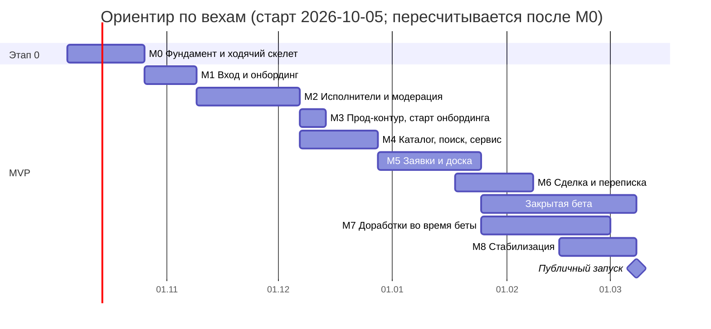

# План разработки: от пустого репозитория до публичного запуска MVP

Составлен 2026-09-27, пересмотрен 2026-09-27 по замечаниям трёх ревью (порядок шагов, покрытие PRODUCT, исполнимость). Это рабочий план: по нему ассистент (Claude Code) пишет код шаг за шагом, а владелец продукта проверяет и принимает каждый шаг. Статусы шагов обновляются в [обзоре](#4-обзор-шагов) после приёмки.

Имя продукта для пользователей — «Соседи» (Sosedi), решение владельца от 2026-09-27 (в тот же день заменило «Сосед»); перед созданием prod-бота владелец подтверждает его окончательно (Q8). Технические имена (`specialist_app`, пакеты, compose-проект) от названия не зависят.

**Опирается на:** [ARCHITECTURE.md][arch] (особенно [§20][a20]), [PRODUCT.md][prod], [ADR-0001…0020](adr/README.md), в первую очередь [ADR-0020][adr20] (паттерны кода), [OWNER_CHECKLIST.md][oc] (ключи и решения владельца), утверждённый дизайн: 71 артборд и `Main.dc.html` (дизайн-система). После шага 0.0 дизайн лежит в `design/`, ссылки на него заработают тогда же.

## Содержание

1. [Как читать план](#1-как-читать-план)
2. [Как работаем](#2-как-работаем)
3. [Вехи и календарь](#3-вехи-и-календарь)
4. [Обзор шагов](#4-обзор-шагов)
5. [M0. Фундамент и ходячий скелет](#m0-фундамент-и-ходячий-скелет)
6. [M1. Вход и онбординг](#m1-вход-и-онбординг)
7. [M2. Исполнители: медиа, модерация, кабинет](#m2-исполнители-медиа-модерация-кабинет)
8. [M3. Прод-контур и старт онбординга](#m3-прод-контур-и-старт-онбординга)
9. [M4. Каталог, поиск, сервисные экраны](#m4-каталог-поиск-сервисные-экраны)
10. [M5. Заявки и доска](#m5-заявки-и-доска)
11. [M6. Выбор, сделка, переписка — ворота беты](#m6-выбор-сделка-переписка--ворота-беты)
12. [M7. Закрытая бета и доработки](#m7-закрытая-бета-и-доработки)
13. [M8. Стабилизация и публичный запуск](#m8-стабилизация-и-публичный-запуск)
14. [Что нужно от владельца по шагам](#14-что-нужно-от-владельца-по-шагам)
15. [Параллельная работа владельца](#15-параллельная-работа-владельца)
16. [Соответствие: блок MVP → шаги](#16-соответствие-блок-mvp--шаги)
17. [Соответствие: экран → шаг](#17-соответствие-экран--шаг)
18. [После MVP](#18-после-mvp)
19. [Допущения плана](#19-допущения-плана)

---

## 1. Как читать план

- **Вехи** M0…M8 идут от пустого репозитория до публичного запуска. У каждой вехи есть контрольная точка — то, что можно показать целиком.
- **Шаг** — работа на одну-две сессии ассистента. Ориентир размера: одна миграция, один модуль, не больше 5 эндпоинтов или 2 экранов. Номер шага — `<веха>.<n>`. Крупные шаги разбиты заранее на подшаги `a`, `b`, `c` (например, 0.15a–0.15c). У подшага свои «Зависит от», «Готово, когда» и «Проверка», принимается он отдельно. Если шаг всё равно вырос, он делится так же, и это отмечается в плане.
- **Порядок.** Номер отражает рекомендуемый порядок. Обязательный порядок задаёт только колонка «Зависит от»: шаг можно брать, когда все его зависимости приняты.
- **Вертикальные срезы.** Сначала сквозной «ходячий скелет» (шаг 0.22): Mini App открывается в Telegram, входит по initData, получает JWT, пишет в БД и показывает ответ. Дальше каждый шаг добавляет законченный кусок: эндпоинт вместе с экраном, который его использует.
- **Ссылки вперёд.** Кнопка, CTA или переход на экран, которого ещё нет, до шага этого экрана скрыт, заглушек не делаем. Шаг экрана-цели в разделе «Mini App» перечисляет, какие входы он включает. Каждое «с шага N» в плане имеет пару в шаге N. Deep link на неготовую цель ведёт на Главную; маршрут `startapp` включает шаг экрана-цели.
- **Поля шага:**

| Поле | Что в нём |
|---|---|
| Цель | Зачем шаг нужен |
| Зависит от | Номера шагов, которые должны быть приняты раньше |
| Нужно от владельца | Пункты [OWNER_CHECKLIST.md][oc]: **K…** — прислать или сделать, **Q…** — решить |
| Backend / Mini App / Инфраструктура, бот | Что делаем в каждой части. «—» — ничего |
| Результат | Что можно показать |
| Готово, когда | Проверяемые критерии |
| Проверка | Команды, которыми это проверяется |
| Ссылки | Разделы документов, ADR, экраны |

- **Спайки** этапа 0 ([§20.1][a20]) — отдельные шаги с полями «Успех» и «План Б». Итог спайка — короткая запись в `docs/spikes/<шаг>-<тема>.md`; если сработал план Б — новый ADR.
- **Экраны** — коды из [PRODUCT.md][p-screens] и дизайна: S01–S58, сообщения бота B1 и B2, тёмные эталоны D03, D13, D30.
- **Рабочие имена шагов.** В ранних черновиках шаги назывались рабочими именами; ADR-0020 («Что сделать») приводит их рядом с номерами шагов, чек-лист владельца ссылается только на номера. Соответствие:

| Имя в других документах | Шаг |
|---|---|
| `repo-bootstrap`, `FE-00` | 0.0, 0.1 |
| `backend-skeleton`, `import-linter-dag` | 0.2 |
| `postgres-image`, `dev-compose` | 0.3 |
| `platform-settings-observability` | 0.4 |
| `test-harness` | 0.5a |
| `ci-backend` | 0.5b; образ backend — 0.23 |
| `spike-sqla21-geoalchemy` | 0.6 |
| `platform-db-base` | 0.7a, 0.7b |
| `spike-procrastinate-tx` | 0.8 |
| `alembic` | 0.9 |
| `platform-uow`, `platform-events-contracts` | 0.10 |
| `platform-di` | 0.11 |
| `platform-queue` | 0.10 (порт и постановка), 0.12 (воркер) |
| `worker-skeleton` | 0.12 |
| `http-foundation`, `valkey-ratelimit` | 0.13a, 0.13b |
| `platform-security` | 0.14 |
| `identity-core` | 0.15a–0.15c |
| `FE-01`, `FE-02` | 0.16a; CI фронта — 0.16b |
| `FE-03`, `FE-05`, `FE-07` | 0.17 |
| `FE-04` | 0.18 |
| `FE-08` | 0.19a–0.19c |
| `FE-06`, `openapi-contract` | 0.20 |
| `FE-09`, `FE-10` | 0.21a, 0.21b |
| `bot-skeleton` | 0.22 |
| `backend-image-entrypoints` | 0.23 |
| `platform-storage` | 0.24 |
| Terraform, Kamal, stage | 0.25a–0.25e |
| `admin-backoffice` | 2.7a, 2.7b |
| `FE-A` | 1.5a, 1.5b |
| `FE-B` | 2.9–2.11 |
| `FE-C` | 4.4–4.8 |
| `jobs-core` | 5.1; подагрегат «отклик» — 5.4 |
| `FE-D` | 5.2, 5.6 |
| `FE-E` | 5.3, 5.5, 5.7 |
| `FE-F` | 6.2, 6.5 |
| `FE-G` | 6.4, 6.5 |
| `FE-H` | 7.3, 7.6 |
| `FE-I` | 2.12a, 4.7, 4.9 |
| `FE-J` | 7.4, 7.5 |
| `FE-K` | 8.1 |
| `FE-L` | 8.2 |

---

## 2. Как работаем

### Цикл одного шага

1. **Анонс.** Ассистент называет шаг, цель, что понадобится от владельца (K/Q) и что будет показано.
2. **Ветка.** `step/<номер>-<slug>`, например `step/0.15a-identity-domain`. Репозиторий на GitHub появляется в шаге 0.1 (K3). Push ветки — по согласию владельца. Если push владелец не даёт, раз в неделю делается `git bundle` во внешнее хранилище, которое выберет владелец.
3. **Реализация.** Код и тесты пишутся вместе, малыми порциями, по [ADR-0020][adr20].
4. **Проверки.** `make check` зелёный (состав — [Definition of Done](#definition-of-done-для-любого-шага)).
5. **Показ.** Вывод команд, скриншоты, для экранов — отчёт «эталон рядом с фактом» и открытие в Telegram на телефоне владельца через dev-бота.
6. **Приёмка.** Владелец принимает шаг или даёт правки. Правки — в той же ветке.
7. **Коммит.** Только после «принято» и с согласия владельца. Сообщение: `<шаг>: <что сделано>`. С шага 0.5b — PR с зелёным CI и шаблоном из ADR-0020 §15 (шаблон появляется в 0.15c).
8. **Статус.** Ассистент отмечает шаг в [обзоре](#4-обзор-шагов), прогоняет `make plan-check` и называет следующий шаг.

Правила:
- Шаг не считается готовым, пока проверки не зелёные. Отключать тест или правило линтера ради зелёного прогона нельзя.
- Спайк не удался — применяем план Б, пишем ADR, и только потом идём дальше.
- Новое решение, меняющее архитектуру, — новый ADR. ARCHITECTURE.md, PRODUCT.md и `adr/README.md` правит тот, кто их ведёт.
- Пробелы API (поле нужно экрану, но его нет в [§8.5][a85]) закрываются аддитивно в том же шаге и перечисляются в описании PR.
- Шаги ассистент ведёт по одному. Параллельно шагам идёт только работа владельца ([§15](#15-параллельная-работа-владельца)). Какие шаги можно брать раньше номера — в списке ниже.

**Что можно брать раньше номера** (зависимости это позволяют):
- 0.8 (спайк Procrastinate) — сразу после 0.6, рядом с 0.7a и 0.7b; 0.14 (initData и JWT) — сразу после 0.4.
- Фронт 0.16a–0.19c — в любой момент после 0.1, например между шагами backend 0.6–0.13b.
- 0.27 (контент) — в любой момент после 0.2; ответы владельца по Q18 и Q19 нужны на неделе 1.
- 0.28 (именованный туннель) — как только владелец пришлёт K11.
- 4.3a (`/suggest`) — рядом с 4.1: нужен только справочник 1.3b.
- 5.4 (отклики, backend) — сразу после 5.1, до экранов 5.2 и 5.3.
- 7.2 (отзывы, backend) — параллельно 6.2–6.5: нужны только 4.6 и 6.1b.

### Где выполнять команды

- Команды `uv run …` выполняются в каталоге `backend/`, пути к тестам — от него: `tests/spikes/…`, `src/app/modules/<модуль>`. В `pyproject.toml` заданы `testpaths` и `rootdir`, `env_file` в настройках — абсолютный путь от `settings.py`, поэтому `.env` находится из любого каталога.
- `cli <команда>` в плане — это `uv run python -m app.entrypoints.cli <команда>` в `backend/`. Из корня то же самое — `make cli ARGS='<команда>'`.
- Команды `make …`, `pnpm …`, `docker …`, `gh …` выполняются из корня репозитория. Terraform — `terraform -chdir=infra/terraform/<env>`, Kamal — через `make kamal ARGS='…'` (обёртка передаёт путь к конфигурации в `infra/kamal`).
- Скриншот-тесты Playwright запускаются только в Docker-образе `mcr.microsoft.com/playwright` одной версии — локально и в CI (`make e2e`). Так базовые скриншоты не зависят от шрифтов macOS.

### Definition of Done для любого шага

| Проверка | Как |
|---|---|
| Код в своём модуле и слое, паттерны по ADR-0020 | `uv run lint-imports`, архитектурные тесты `tests/architecture` (с 0.15c), ESLint boundaries |
| Unit-тесты domain; use cases и фасады — на реальном PostgreSQL в откатываемой транзакции ([ADR-0020][adr20] §11); покрытие domain и application ≥ 80% | `uv run pytest -m "unit or integration" --cov` |
| Интеграционные тесты адаптеров на реальном PostGIS (SQLite, фейковые UoW и in-memory репозитории запрещены) | `uv run pytest -m integration` |
| API-тест на каждый новый эндпоинт: успех, права (чужой ресурс → 404 или 403), валидация | `uv run pytest src/app/modules/<x>/tests/api` |
| Типы и стиль | `uv run mypy` (strict на `src/app`), `uv run ruff check`, `uv run ruff format --check`; `pnpm turbo run typecheck lint` |
| Миграции: одна head, upgrade и downgrade, без расхождений | `make migrate-roundtrip` — в testcontainers: `upgrade head` → `downgrade base` → `upgrade head` → `alembic check` → `alembic heads`. На dev-БД — только `make migrate`, чтобы не сносить сиды |
| OpenAPI: клиент перегенерирован, контракт зелёный | `make openapi && make contract` (schemathesis, oasdiff), `git diff --exit-code backend/openapi.json packages/api-client`. До ворот беты (6.7) ломающие изменения разрешены с меткой `api-breaking` в PR и перегенерацией клиента; с 6.7 oasdiff блокирует их |
| Экраны: совпадают с артбордом; есть загрузка, пустое состояние, ошибка, офлайн; MainButton и BackButton по SPEC §2 | 1) `make design-compare GREP=<S..>` — отчёт «эталон рядом с фактом» для светлой темы и ru (pixelmatch с порогом и масками данных — справочно), владелец принимает визуально. 2) После приёмки снимается базовая линия `make e2e GREP=<S..> UPDATE=1`, дальше она служит регрессией: 390×844, светлая и тёмная темы, ru и sr-Latn. Тёмная тема и sr-Latn сверяются только регрессией; D03, D13 и D30 владелец сверяет с эталонами вручную |
| Тексты: ru и sr-Cyrl, sr-Latn сгенерирован, литералов в JSX нет | `make i18n-check` |
| Аналитика (с 1.7): доменные события, от которых зависят метрики PRODUCT, уходят в аналитику | Тест «событие отправлено после commit»; событие есть в таксономии `platform/analytics/events.py` |
| Модерация (с 2.6): новый тип контента подключён к конвейеру адаптером цели | Интеграционный тест «чисто → опубликовано, флаг → P2» для этого типа |
| Данные пользователя (с 2.12a): модуль с ПД подписан на `UserDeleted`; с 2.12b — и зарегистрировал правило хранения | Тест обезличивания со сдвигом часов |
| Блокировки (с 4.7): выдача, лента, матчинг и переписка не показывают заблокированных | Тест «заблокированный не виден» в шаге экрана или API |
| Логи без ПД, секретов в diff нет | тест маскирования, gitleaks в pre-commit (с 0.1), `make audit` (с 0.23) |
| Документация | README команд; `docs/spikes/…` для спайков; ADR для новых решений; статус в плане; `make plan-check` зелёный |
| Показано и принято | Владелец сказал «принято» |

**Состав `make check` по шагам.** Цель, инструмента которой ещё нет, печатает `SKIP (появится в шаге N)` и не падает. Шаг, который вводит инструмент, включает его в `make check` и в CI в том же PR.

| Что входит | С шага |
|---|---|
| `plan-check`, gitleaks | 0.1 |
| ruff, ruff format, mypy, lint-imports, `pytest -m unit` | 0.2 |
| `pytest -m integration` (testcontainers) | 0.5a |
| `migrate-roundtrip` | 0.9 |
| Архитектурные тесты `tests/architecture` | 0.15c |
| `pnpm turbo run typecheck lint test` | 0.16a |
| `i18n-check` фронта (актуальность sr-Latn) | 0.17; каталоги backend — с 1.2 |
| `openapi`, `contract`, diff api-client | 0.20 |
| `e2e` (Playwright в Docker), axe, бюджет бандла | 0.19a (галерея), 0.21b (Mini App) |
| `audit` (pip-audit, pnpm audit) | 0.23 |
| Регрессионный набор поиска | 4.3b |

### Секреты

Полные правила — [OWNER_CHECKLIST.md, «Правила обращения с секретами»][oc-secrets]. Коротко:
- В git секреты не попадают никогда. `backend/.env`, `infra/compose/.env`, `infra/terraform/<env>/.env`, `apps/tma/.env.local`, файлы state Terraform, `*.pem`, `*.key` — в `.gitignore` с шага 0.1. В git — только `*.env.example` без значений.
- Dev-ключи можно прислать в чат. Ассистент кладёт их в `.env`, не печатает в терминал и не коммитит.
- Stage- и prod-ключи владелец вписывает сам, в своём окне Терминала: `make secret NAME=… TARGET=…` (с шага 0.4; цели `stage` и `production` — с 0.25c). Порядок — [OWNER_CHECKLIST.md, «Как вписать секрет»][oc-howto].
- `backend/.env` содержит только dev-настройки приложения. Токены инфраструктуры (Hetzner, Cloudflare для Terraform) — в `infra/terraform/stage/.env` и `infra/terraform/prod/.env`, чтобы они не попадали в контейнер при `--env-file`.
- Dev-секреты ассистент генерирует сам — сразу в `.env`, без вывода: пароли ролей БД (`make secrets-dev`, с 0.3), ключи Garage (`make garage-init`, с 0.3), ключи JWT (`cli jwt-keys`, с 0.14), ключ HMAC. Секреты stage и prod (ключи JWT, `secret_token` вебхука, пароли ролей БД, ключ HMAC, пароли шифрования pgBackRest, deploy-ключи) создаёт владелец командой `make gen-secret` и сразу сохраняет копию в менеджер паролей ([K10a][k10a]).
- Хук gitleaks в pre-commit не даёт закоммитить секрет. Попавший в коммит секрет ротируется сразу.
- Способ хранения секретов stage и prod — решение [Q1][oc-q], нужно к шагу 0.25c. До него секреты stage не оформляем.
- Всё, что прошло через чат, ротируется перед публичным запуском ([K43][k43], шаг 8.4).

### Единые команды

Корневой `Makefile` появляется в шаге 0.1 и растёт по шагам.

| Команда | Что делает | С шага |
|---|---|---|
| `make doctor` | Версии uv, Python, Node, pnpm, Docker Compose, cloudflared; свободны ли порты 55442, 56379, 59100, 59103, 8000, 5173 (`lsof`) | 0.1 |
| `make plan-check` | Сверяет таблицу обзора: зависимости существуют, циклов нет, ворота 3.4, 6.7 и 8.5 транзитивно зависят от своих обязательных шагов | 0.1 |
| `make cli ARGS='…'` | Команды `entrypoints/cli.py` (Typer) из корня | 0.2 |
| `make up`, `make down`, `make ps`, `make logs` | Локальные сервисы, только compose-проект `specialist-dev` | 0.3 |
| `make pg-image`, `make pg-smoke [ENV=…]`, `make psql` | Сборка нашего образа PostgreSQL; smoke БД (локаль, pg_trgm, PostGIS, роли); psql под ролью `app` | 0.3; `ENV=stage` — 0.25c, `ENV=prod` — 3.1b |
| `make secrets-dev`, `make garage-init` | Пароли ролей и секреты приложения; ключ Garage и бакеты — в `infra/compose/.env` и `backend/.env`, без вывода | 0.3; `secrets-dev` дополняется в 0.4 |
| `make secret NAME=… TARGET=…`, `make secrets-check` | Скрытый ввод секрета владельцем и проверка «задан / пуст» без значений ([«Как вписать секрет»][oc-howto]) | 0.4 (`dev`, `tf-stage`, `tf-prod`); `stage`, `production` — 0.25c |
| `make gen-secret NAME=… ENV=…`, `make gen-age ENV=…` | Генерация секрета stage или prod в окне владельца: показ один раз, запись в GitHub или SOPS по Q1 | 0.25c |
| `make lint`, `typecheck`, `test`, `test-int` | Проверки backend (`test-int` сначала собирает образ через `pg-image`) | 0.2, 0.5a |
| `make migrate`, `make migrate-roundtrip` | `alembic upgrade head` на dev; раунд-трип миграций в testcontainers | 0.9 |
| `make seed`, `make seed-demo SCALE=small\|lab` | Справочники; демо-данные через use cases (только dev и stage) | 1.3b, 2.8c |
| `make dev-web`, `dev-bot`, `dev-worker`, `dev-worker-media`, `dev-tma` | Процессы с hot reload вне Docker | 0.12–0.22 |
| `make dev` | Всё сразу через honcho и `Procfile.dev`: compose, миграции, процессы, туннель; печатает URL | 0.22 |
| `make dev-bg`, `make dev-restart`, `make dev-stop` | Тот же стенд в фоне (переживает закрытие терминала и IDE, лог `.tunnel-logs/dev.log`); перезапуск только процессов без смены адресов туннеля; остановка. Стенд сам пересоздаёт quick tunnel, который Cloudflare удалил после долгого обрыва связи | 0.22 |
| `make tunnel` | Туннели на 5173 и Garage, запись адресов в `.env`, перезапуск web, menu button | 0.22; именованный — 0.28 |
| `make e2e [PKG=…] GREP=… [UPDATE=1]`, `make design-compare GREP=…` | Playwright в Docker; отчёт «эталон рядом с фактом» | `e2e` — 0.19a (галерея) и 0.21b (Mini App); `design-compare` — 0.19c |
| `make openapi`, `make contract` | Экспорт `openapi.json` и генерация api-client; schemathesis и oasdiff | 0.20 |
| `make i18n-check`, `make audit` | Каталоги переводов; pip-audit, pnpm audit, gitleaks | 0.17 и 1.2, 0.23 |
| `make new-module NAME=…` | Новый модуль по шаблону copier | 0.15c |
| `make check` | Проверки Definition of Done, состав — таблица выше | 0.2 |
| `make bench-search`, `make lighthouse URL=…` | Сиды масштаба лаборатории и p95 поиска; холодный старт Mini App с мобильным троттлингом | 4.2, 4.8 |
| `make bench-vm`, `make loadtest ENV=stage` | Бенчмарки лаборатории на VM; нагрузочный прогон | 0.26, 8.3 |

### Локальные порты и имена

На машине работают чужие контейнеры других проектов. Их не трогаем: никаких `docker system prune`, `docker compose down -v` и остановок вне своего проекта.

| Что | Адрес |
|---|---|
| PostgreSQL (dev) | `127.0.0.1:55442` |
| Valkey | `127.0.0.1:56379` |
| Garage S3 / admin | `127.0.0.1:59100` / `127.0.0.1:59103` |
| web (uvicorn) | `127.0.0.1:8000` |
| Mini App (Vite) | `127.0.0.1:5173`, proxy `/api` → 8000 |
| Контейнер backend при проверке образа | `127.0.0.1:18000` |
| Тесты | Случайные порты testcontainers, метка `com.specialist.tests=true` |
| Compose-проект | `specialist-dev` (тома получают этот префикс) |

Заняты чужими контейнерами (запущенными и остановленными): 5432 (`tasks_postgres`, `tasks_postgres2`, `auralocalinvent02d79_postgres`), 5433 и 6380 (`mytelegramschedulehelper-*`), 6379 (`tasks_redis`, `auralocalinvent02d79_redis`), 8088 (`auralocalinvent02d79-pgadmin-1`), 8100 (`tasks_redpanda_console`), 9000–9001 (`tasks_minio`), 9092 (`auralocalinvent02d79_kafka`), 9093 (`tasks_redpanda`), 3010 и 9190 (`aura_li_sandbox_*`). Лаборатория `specialist-lab` — 55432, 59000, 59010, 59020–59021, 58080. Локальные программы — 6188, 6189, 8899, 15611, 63342.

### Паттерны кода — коротко

Правила — в [ADR-0020][adr20]. Если этот раздел с ним расходится, прав ADR.
- **Слои модуля** одинаковы во всех 15 модулях `modules/`: обязательны `api.py` (контракт), `errors.py`, `di.py`, `domain/`, `application/`, `infrastructure/`, `tests/`; входные адаптеры `http/`, `bot/`, `admin/`, `tasks.py` — по необходимости. Импорт — только вниз, проверяет import-linter. `billing` до v1 — пустой каркас.
- **Unit of Work** — один `async with uow` на команду: HTTP-запрос, Telegram-update или задачу. Commit делает только UoW. Фасад другого модуля работает в транзакции вызывающего.
- **Repository** — один на корень агрегата, возвращает доменные объекты; ORM не выходит из `infrastructure`. Запись без бизнес-правил — простая форма репозитория без агрегата. Чтение для экранов — query-сервисы (CQRS-lite). Generic CRUD-репозиториев нет.
- **Синглтон** — только объект dishka со `Scope.APP` (engine, Valkey, Bot, Procrastinate, ключи JWT, S3, AI-адаптеры, `Clock`). Глобальных клиентов на уровне модулей нет.
- **Порты и адаптеры** для всего внешнего: БД, очередь, S3/R2, Telegram, OpenAI, Anthropic, поиск, Entitlements, аналитика, время. У внешних сервисов (Telegram, S3/R2, AI, аналитика, `Clock`) есть фейк, адаптер выбирается настройкой; БД и очередь в тестах настоящие.
- **Единый порядок внутри модуля:** миграция → domain (state machine, политики, unit-тесты) → репозиторий → use cases → фасад `api.py` → HTTP (роутеры и API-тесты) → события и `tasks.py` → хендлеры бота → адаптер модерации и подписка на `UserDeleted` → `.importlinter` и OpenAPI. Новый модуль и use case создаются шаблоном copier (с шага 0.15c).
- **Фронтенд:** данные — только хуки `packages/api-client`; Telegram — только `packages/platform`; `QueryClient`, i18n, Sentry и платформа создаются один раз в `app/`; экран — папка `features/<группа>/<sNN-имя>/`.

---

## 3. Вехи и календарь

Календарь — ориентир из [§20][a20]: старт 2026-10-05, этап 0 — 3 недели, MVP — 19 недель, закрытая бета с 2027-01-25, публичный запуск 2027-03-08. Оценка §20 сделана для двух разработчиков, а в плане 115 шагов, которые ассистент ведёт по одному, и узкое место — приёмка владельцем. Поэтому даты заведомо оптимистичны. После M0 ассистент считает фактический темп (шагов в неделю, среднее время приёмки) и пересчитывает календарь; дальше пересчёт — после каждой вехи. **Порядок шагов важнее дат.** Праздники (Новый год, 7 января) в ориентир не заложены.

**Порядок после 2.5a — сначала ядро (решение владельца 2026-10-01).** Дальше идут шаги, результат которых владелец видит в Mini App: 2.6 → 2.8a–c → 2.9–2.11 → 2.12a → 4.1–4.6 → 4.8 → 5.1–5.6 → 6.1a–6.4. Сроки хранения и выгрузка данных (2.12b) — до прод-ворот 3.4. Чат модераторов и апелляции (2.5b), вход персонала и админка (2.7a–b), жалобы и блокировки (4.7), прод-контур (3.x) и остальное — до ворот закрытой беты 6.7, по мере готовности владельца (K29, K30, домен и Hetzner). До этого модерация облегчённая: правила и детектор 2.4, в dev вместо AI — заглушки, решения по кейсам — командами `cli`. «Вещи» — после MVP (решение 2026-09-27 подтверждено).

| Веха | Шаги | Ориентир | Контрольная точка |
|---|---|---|---|
| M0. Фундамент и ходячий скелет | 0.0–0.28 (42) | Этап 0, недели 1–3: 2026-10-05 → 10-23 | Mini App в Telegram входит по initData и показывает данные из БД; спайки закрыты; CI зелёный; stage поднят (если пришли ключи) |
| M1. Вход и онбординг | 1.1–1.7 (10) | MVP, недели 1–2: 10-26 → 11-06 | Новый пользователь проходит онбординг на трёх письменностях; события онбординга видны в аналитике |
| M2. Исполнители: медиа, модерация, кабинет | 2.1–2.12b (19) | Недели 3–6: 11-09 → 12-04 | Специалист с телефона создаёт профиль с фото, модератор одобряет его (до 2.5b — командой), бот сообщает о публикации; аккаунт можно удалить |
| M3. Прод-контур и старт онбординга | 3.1a–3.4 (6) | Неделя 7: 12-07 → 12-11 | Прод с бэкапами и мониторингом; ворота 3.4 пройдены — основатели начинают онбординг founding-специалистов |
| M4. Каталог, поиск, сервисные экраны | 4.1–4.9 (10) | Недели 7–9: 12-07 → 12-25 | Клиент находит специалиста по-русски и по-сербски; настройки и центр уведомлений работают |
| M5. Заявки и доска | 5.1–5.7 (7) | Недели 10–13: 12-28 → 2027-01-22 | Заявка за ≈ минуту приходит исполнителю в бот, отклик — в один тап |
| M6. Выбор, сделка, переписка | 6.1a–6.7 (10) | Недели 13–15: 2027-01-18 → 02-05 | Сквозной сценарий J1 на двух аккаунтах; решение о старте беты |
| M7. Закрытая бета и доработки | 7.1–7.7 (7) | Недели 14–18: 2027-01-25 → 02-26 | Отзывы, шаринг, заглушка «Вещи»; итоги беты против порогов |
| M8. Стабилизация и запуск | 8.1–8.5 (5) | Недели 17–19: 2027-02-15 → 03-05 | Публичный запуск 2027-03-08 |

Всего 115 шагов и подшагов: 42 — фундамент (этап 0), 73 — MVP до запуска.

---

## 4. Обзор шагов

Статусы: «ожидает», «в работе», «на проверке», «принят». Владелец — пункты [OWNER_CHECKLIST.md][oc], по шагам — [§14](#14-что-нужно-от-владельца-по-шагам). В колонке «Зависит от» — прямые зависимости; `make plan-check` считает транзитивные. Необязательные для запуска шаги: 0.28 (удобство dev), 2.2b (видео — Should по Q22) и 7.6 (Should).

| Шаг | Что | Зависит от | Владелец | Статус |
|---|---|---|---|---|
| 0.0 | Сохранить утверждённый дизайн | — | K2 (копия дизайна) | на проверке |
| 0.1 | Старт: тулчейн, git, GitHub | 0.0 | K1, K2, K3, K10, Q2, Q5, Q15 | на проверке |
| 0.2 | Скелет backend и границы модулей | 0.1 | — | на проверке |
| 0.3 | Локальное окружение: образ PostgreSQL и compose | 0.1 | — | на проверке |
| 0.4 | Настройки и логи | 0.2 | K20, Q17 (по желанию) | на проверке |
| 0.5a | Тестовый контур backend | 0.2, 0.3 | — | на проверке |
| 0.5b | CI backend | 0.5a | K3, Q5 | на проверке |
| 0.6 | Спайк: SQLAlchemy 2.1 + GeoAlchemy2 + psycopg 3 | 0.5a | — | на проверке |
| 0.7a | Ядро: базовые типы домена | 0.2 | — | на проверке |
| 0.7b | Каркас БД и основа репозиториев | 0.4, 0.6, 0.7a | — | на проверке |
| 0.8 | Спайк: транзакционная постановка задач | 0.6 | — | на проверке |
| 0.9 | Миграции Alembic | 0.3, 0.7b, 0.8 | — | на проверке |
| 0.10 | Unit of Work, доменные события, порт очереди | 0.8, 0.9 | — | на проверке |
| 0.11 | DI-контейнер dishka | 0.4, 0.10 | — | на проверке |
| 0.12 | Воркер и периодические задачи | 0.11 | K33 (по желанию) | на проверке |
| 0.13a | HTTP-каркас: ошибки RFC 9457, middleware, `/up` | 0.11 | — | на проверке |
| 0.13b | Курсор, If-Match, rate limit | 0.13a | — | на проверке |
| 0.14 | Спайк: initData и JWT | 0.4 | — | на проверке |
| 0.15a | identity: домен, репозитории, use cases | 0.10, 0.14 | — | на проверке |
| 0.15b | identity: HTTP и лимиты | 0.13b, 0.15a | — | на проверке |
| 0.15c | Архитектурные тесты и шаблоны copier | 0.15b | — | на проверке |
| 0.16a | Фронтенд-монорепо, токены, шрифты | 0.0, 0.1 | Q3 | на проверке |
| 0.16b | CI frontend | 0.5b, 0.16a | — | на проверке |
| 0.17 | Пакеты i18n, links, domain | 0.16a | — | на проверке |
| 0.18 | Пакет platform (Telegram-адаптер) | 0.16a | — | на проверке |
| 0.19a | ui-web: примитивы, иконки, галерея | 0.16a, 0.17 | — | на проверке |
| 0.19b | ui-web: остальные базовые компоненты | 0.19a | — | на проверке |
| 0.19c | Спайк: PNG-эталоны артбордов | 0.19a | — | на проверке |
| 0.20 | OpenAPI-контракт и api-client | 0.15b, 0.16a | — | на проверке |
| 0.21a | Каркас Mini App | 0.18, 0.19a, 0.20 | Q4 | на проверке |
| 0.21b | Тестовый контур фронта | 0.16b, 0.19b, 0.21a | — | на проверке |
| 0.22 | Dev-бот, туннель, сквозной вход | 0.15b, 0.21a | Q6, Q7, K4, K6, K7, K8 | принят |
| 0.23 | Образы и публикация в GHCR | 0.5b, 0.12, 0.22 | — | на проверке |
| 0.24 | Спайк: загрузка медиа из WebView | 0.11, 0.22 | K8 | на проверке |
| 0.25a | Stage: VM в Hetzner (Terraform) | 0.23 | K14, K14a (по Q14), K15, K10a, Q12, Q13, Q14, Q16 | ожидает |
| 0.25b | Stage: Cloudflare — DNS, R2, WAF | 0.25a | K11, K12 (`terraform`), K13 (включить R2), Q9, Q10 | ожидает |
| 0.25c | Stage: деплой backend и БД (Kamal) | 0.25b | Q1, K10a, K13 (ключи), K15 (deploy-ключ), K16, K18, K19, K20 | ожидает |
| 0.25d | Stage: Mini App на Workers и прокси `/api` | 0.25c | K12 (`ci-wrangler`) | ожидает |
| 0.25e | Stage: бот и webhook | 0.22, 0.25d | K17, Q11 | ожидает |
| 0.26 | Спайк: бенчмарки на VM и проверка R2 | 0.24, 0.25e | — | ожидает |
| 0.27 | Контент: таксономия, районы, черновики текстов | 0.2 | Q18, Q19, K21, K22 | на проверке |
| 0.28 | Именованный dev-туннель | 0.22 | K11, K6 (вариант C), Q9, Q10 | ожидает |
| 1.1 | Идемпотентность, аудит, флаги, client-config | 0.12, 0.13b, 0.21a | — | на проверке |
| 1.2 | Локализация backend | 0.13a | — | на проверке |
| 1.3a | Справочник гео | 0.6, 0.9, 0.15c, 0.27, 1.2 | K21, Q18 | на проверке |
| 1.3b | Справочник категорий и сиды | 1.3a | K21, Q19 | на проверке |
| 1.4a | identity: согласия, ограничения, город, намерение, доверие | 0.15b, 1.1, 1.3a | — | на проверке |
| 1.4b | Каналы уведомлений и атрибуция | 1.4a | — | на проверке |
| 1.5a | Mini App: S48, S49 — правовые тексты и системные состояния | 0.19c, 0.21b, 0.22, 0.27, 1.1 | K22 | на проверке |
| 1.5b | Mini App: S01, S02a–c — онбординг | 1.4b, 1.5a | — | на проверке |
| 1.6 | Бот: /start, команды, тексты | 0.17, 0.22, 1.2, 1.4b | K5, K23, Q25 | на проверке |
| 1.7 | Аналитика: порт, адаптер, таксономия событий | 1.4b | K32 (по желанию; для прода — к 3.4) | на проверке |
| 2.1 | Медиа: загрузка | 0.24, 1.4a | — | на проверке |
| 2.2a | Медиа: обработка фото и раздача | 2.1 | — | на проверке |
| 2.2b | Медиа: видео | 2.2a | Q22 | на проверке |
| 2.3a | Уведомления: модель и конвейер | 0.12, 1.2, 1.4b, 1.6 | — | на проверке |
| 2.3b | Уведомления: отправитель, лимитер, статус канала | 2.3a | — | на проверке |
| 2.4 | AI-порты, контент-правила, детектор контактов | 0.9, 0.11 | K25, K26, K28 | на проверке |
| 2.5a | Кейсы, санкции, уровни доверия, сигналы риска | 1.4a, 2.3b, 2.4 | — | на проверке |
| 2.5b | Чат модераторов и апелляции | 1.5a, 2.5a | K29, Q21 | ожидает |
| 2.6 | Конвейер автомодерации | 1.3b, 2.2a, 2.5a | K27, Q20 | на проверке |
| 2.7a | Вход персонала | 1.1, 2.5a | K9, K30 | ожидает |
| 2.7b | Админка: разделы и Admin API | 1.3b, 2.7a | K30, K31 (для stage) | ожидает |
| 2.8a | Профили исполнителей (specialists) | 1.3b, 2.1, 2.6 | Q24 | на проверке |
| 2.8b | Прайс (pricing) | 2.8a | — | на проверке |
| 2.8c | Демо-данные: `seed-demo` | 2.2a, 2.8b | — | на проверке |
| 2.9a | Mini App: S31, S32a–c | 1.5b, 2.8b | — | на проверке |
| 2.10 | Mini App: S33, S34, S38 | 2.9a | — | на проверке |
| 2.11 | Mini App: S35, S36, S37 | 2.2a, 2.9a | — | на проверке |
| 2.12a | Удаление аккаунта по запросу — S45 | 2.2a, 2.5a, 2.8b, 2.9a | — | на проверке |
| 2.12b | Сроки хранения и выгрузка данных | 2.12a | — | на проверке |
| 3.1a | Прод: VM и сеть (Terraform) | 0.25b, 0.26 | K38, K12 (`tf-prod`), Q27 (№ 12) | ожидает |
| 3.1b | Прод: PostgreSQL на db-1 | 3.1a | K19 (prod), K18 (при SOPS), K10a | ожидает |
| 3.1c | Прод: деплой, Access, prod-бот | 0.25e, 2.7b, 3.1b | Q8, K19 (prod), K29 (prod), K30, K31, K39, K40a | ожидает |
| 3.2 | Бэкапы и restore-тест | 3.1b | K10a, K19 (restore-test), K33, K36, K37 | ожидает |
| 3.3 | Наблюдаемость | 3.1c | K20, K33, K34, K35, K35a | ожидает |
| 3.4 | Ворота онбординга на проде | 1.7, 2.5b, 2.10, 2.11, 2.12b, 3.2, 3.3 | K22, K29, K32, Q21 | ожидает |
| 4.1 | Read-model поиска | 1.3b, 2.8b, 2.9a, 2.12a | — | на проверке |
| 4.2 | Поиск: запрос, фильтры, ранжирование | 2.8c, 4.1 | — | на проверке |
| 4.3a | Автодополнение `/suggest` | 0.13b, 1.3b | — | на проверке |
| 4.3b | Регрессионный набор поиска | 4.2, 4.3a | K21 | на проверке |
| 4.4 | Mini App: S04, S05, S06 | 1.5b, 4.2, 4.3a | — | на проверке |
| 4.5 | Mini App: S08, S09, S10 | 2.11, 4.4 | — | на проверке |
| 4.6 | Mini App: S11, S12 | 4.5 | — | на проверке |
| 4.7 | Жалобы и блокировки: S46, S44 | 2.5b, 2.7b, 4.5 | K24 | на проверке |
| 4.8 | Главная S03 | 1.1, 4.3b, 4.4, 4.5 | — | на проверке |
| 4.9 | Сервис: S42, S43, S47, `/settings` | 1.5b, 1.6, 2.3b, 2.12a | K23, Q25 | на проверке |
| 5.1 | Заявки: домен и API | 1.3b, 2.1, 2.6, 2.8c | — | на проверке |
| 5.2 | Mini App: S20a–d, S21 — создание заявки | 2.10, 4.3a, 4.8, 5.1 | Q22, Q23, Q28 | в работе |
| 5.3 | Лента заявок: S13, S14, S15 | 4.6, 5.2 | — | на проверке |
| 5.4 | Отклики: backend | 2.3b, 5.1 | — | на проверке |
| 5.5 | Mini App: S16, S17, S57 и шаблоны откликов | 5.3, 5.4 | — | на проверке |
| 5.6 | Мои заявки, приглашения, прямой запрос: S22, S23 | 4.5, 4.8, 5.2, 5.5 | — | на проверке |
| 5.7 | Подписки и уведомления: S18, S19, B1 | 2.3b, 4.7, 5.6 | — | на проверке |
| 6.1a | Сделки: агрегат и выбор исполнителя | 5.4 | — | на проверке |
| 6.1b | Сделки: задачи, уведомления, кнопки бота | 2.3b, 6.1a | — | на проверке |
| 6.1c | Споры | 2.5b, 2.7b, 6.1a | — | на проверке |
| 6.2 | Mini App: S24, S25, S26, S52 | 5.6, 6.1b, 6.1c | — | на проверке |
| 6.3a | Переписка: диалоги, сообщения, маскирование | 2.4, 2.6, 4.7, 6.1a | Q27 (№ 7) | на проверке |
| 6.3b | Переписка: «Договорились», контакты, уведомления | 2.3b, 6.3a | — | на проверке |
| 6.4 | Mini App: S29, S30 | 4.7, 6.2, 6.3b | — | на проверке |
| 6.5 | Mini App: S53, S54, приватность | 4.9, 6.4 | — | на проверке |
| 6.6 | Дашборд ликвидности и метрики ворот | 0.25e, 1.7, 5.7, 6.1b | K32 | ожидает |
| 6.7 | Ворота закрытой беты | 2.10, 3.4, 4.8, 4.9, 5.5, 5.7, 6.5, 6.6 ‖ запасная ветка: 6.2 вместо 6.5 | K22, K25, K26, K28, K29, K40a, K41, K42, Q26, Q27 | ожидает |
| 7.1 | Старт закрытой беты | 6.7 | — | ожидает |
| 7.2 | Отзывы: backend | 4.6, 6.1b | — | на проверке |
| 7.3 | Mini App: S27, S28, S11 с ответами, B2 | 6.2, 7.2 | — | на проверке |
| 7.4 | Шаринг карточек | 1.6, 4.5, 5.3, 5.6, 6.2, 6.4 | K5 (inline mode, если нужен) | на проверке |
| 7.5 | Задел «Вещи»: S58 и сегмент на Главной | 1.7, 4.8, 4.9, 5.2 | Q23, Q26 | ожидает |
| 7.6 | Should-пункты по решению владельца | 2.2a, 7.3 | Q22 | ожидает |
| 7.7 | Итоги беты | 7.1 | Q27 (№ 15) | ожидает |
| 8.1 | Браузерная оболочка (минимум) | 2.12a, 4.5, 5.3 | — | на проверке |
| 8.2 | Тест-матрица WebView, тёмная тема, производительность | 6.5, 7.3, 7.4, 7.5, 8.1 | K8, K41, K42 | ожидает |
| 8.3 | Нагрузочный прогон | 3.3, 5.7, 6.3b, 7.2 | — | ожидает |
| 8.4 | Безопасность и приватность | 2.12b, 6.5, 7.4 | K43 | в работе |
| 8.5 | Публичный запуск | 7.3, 7.4, 7.7, 8.2, 8.3, 8.4 | K40b (превью, splash), Q26, Q27 | ожидает |

---

## M0. Фундамент и ходячий скелет

**Итог вехи:** Mini App открывается в Telegram на телефоне владельца, входит по initData, получает JWT, читает и пишет данные в БД. Спайки этапа 0 закрыты. CI зелёный с первой недели. Stage поднят, если пришли ключи; если нет — шаги 0.25a–0.26 идут параллельно с M1–M2 и блокируют только прод (3.1a) и дашборд ликвидности (6.6). Контент для справочников и правовых текстов (0.27) готовится параллельно коду.

### 0.0. Сохранить утверждённый дизайн

- **Цель.** Утверждённый дизайн лежит во временном каталоге `/private/tmp/…`, который macOS чистит при перезагрузке. Копируем его первым действием, не дожидаясь остальных решений.
- **Зависит от.** —
- **Нужно от владельца.** [K2][k2] — только согласие на копирование дизайна в `design/`. `git init` для этого шага не нужен.
- **Backend.** —
- **Mini App.** Копия `design-canvas` в `design/`: `ui.css`, `SPEC.md`, `project/` — 72 файла `.dc.html` (71 артборд и `Main.dc.html`) и `canvas.json`. `design/README.md`: откуда взято, ссылка на холст https://claude.ai/artifact/AWVeVGWKQZQ8cAAyCjgnEH, правило «эталон не правим, только новые версии»; заметка, что `support.js` отдаёт хост холста (в папке его нет), `ui.css` подключён как `/_blob/…`, шрифты грузятся с Google Fonts — для рендера нужны подмена и сеть (0.19c). `design/MANIFEST.sha256`.
- **Результат.** Дизайн в каталоге проекта с контрольными суммами.
- **Готово, когда.** 72 файла `.dc.html` на месте, `canvas.json` есть, контрольные суммы совпадают с источником.
- **Проверка.** `ls design/project/*.dc.html | wc -l` → 72; `shasum -a 256 -c design/MANIFEST.sha256`.
- **Ссылки.** [SPEC][spec], [ADR-0012][adr12].

### 0.1. Старт: тулчейн, git, GitHub

- **Цель.** Поставить инструменты нужных версий, завести репозиторий и сразу его резервную копию на GitHub.
- **Зависит от.** 0.0
- **Нужно от владельца.** [K1][k1] (обновить uv и Python, включить pnpm; дополнительно `brew install gitleaks` и `uv tool install pre-commit`), [K2][k2] (`git init`), [K3][k3] (приватный репозиторий и `gh auth login`; можно ли ассистенту делать push), [K10][k10] и [Q15][oc-q] (менеджер паролей и 2FA — до первой регистрации: GitHub, затем Hetzner и Cloudflare), [Q2][oc-q] (`blog2.html` и `.idea`: по умолчанию не трогаем), [Q5][oc-q] (аккаунт или организация на GitHub). Параллельно, без блокировки шага: [Q9][oc-q] и [K11][k11] (домен и Cloudflare — к 0.28 и 0.25b), [Q18][oc-q] и [Q19][oc-q] (к 0.27, неделя 1), регистрация в Hetzner ([Q16][oc-q]).
- **Backend.** Шаблонные `main.py` и `pyproject.toml` из корня переезжают в `backend/`.
- **Mini App.** —
- **Инфраструктура.** `brew upgrade uv`; `uv python install 3.14` (не ниже 3.14.5) и `.python-version`; `corepack enable pnpm`; gitleaks и pre-commit. `git init`; `.gitignore` (`.env` и `.env.*` кроме `*.env.example` — это покрывает `backend/.env`, `infra/compose/.env`, `infra/terraform/<env>/.env`, `apps/tma/.env.local`; `*.tfstate`, `*.tfstate.*`, `.terraform/`, `*.auto.tfvars`, `.venv`, `__pycache__`, `node_modules`, `*.pem`, `*.key`, `.idea`, `dist`, `coverage`); `.editorconfig`; `README.md` с командами запуска; корневой `Makefile` ([«Единые команды»](#единые-команды)); каталоги `apps/`, `packages/`, `infra/{compose,postgres,kamal,terraform,monitoring,runbooks,dev}`, `.github/workflows/`, `scripts/`; `.pre-commit-config.yaml` с gitleaks. `scripts/plan_check.py` и `make plan-check`: разбирает таблицу [обзора](#4-обзор-шагов), проверяет, что зависимости существуют и циклов нет, а ворота 3.4, 6.7 и 8.5 транзитивно зависят от своих обязательных шагов. `make doctor` проверяет и занятость портов. Remote `origin` и первый push — после согласия владельца.
- **Результат.** Репозиторий со структурой и дизайном на GitHub; первый коммит — по согласию.
- **Готово, когда.** `make doctor` показывает Python ≥ 3.14.5 и свободные порты; `backend/.env` игнорируется git; хук gitleaks ловит тестовый секрет; `make plan-check` зелёный; `git remote -v` показывает приватный репозиторий (или записано, что push делает владелец, и настроен еженедельный `git bundle`).
- **Проверка.** `make doctor`; `git check-ignore -v backend/.env infra/compose/.env infra/terraform/stage/.env`; `pre-commit run --all-files`; `make plan-check`; `gh repo view --json visibility`.
- **Ссылки.** [§4][a4], [§6][a6], [§13.5][a135], [ADR-0004][adr4].

### 0.2. Скелет backend и границы модулей

- **Цель.** Пакет backend с инструментами качества; контракты DAG — в первом же коммите кода ([ADR-0002][adr2]).
- **Зависит от.** 0.1
- **Нужно от владельца.** —
- **Backend.** `backend/pyproject.toml` под uv: `requires-python = ">=3.14,<3.15"`, пины по §4 и ADR-0004 (fastapi ~=0.141.1, uvicorn[standard] 0.54, sqlalchemy[asyncio] 2.1.x, psycopg[binary,pool] 3.3, alembic 1.20, geoalchemy2 0.20, shapely 2.1, pydantic 2.13 (<2.14 из-за aiogram), pydantic-settings 2.15, dishka 1.10, aiogram 3.31, procrastinate 3.10, redis 7.4 (<8), limits 5.8, pyjwt 2.15, structlog, sentry-sdk, prometheus-client, babel, typer; dev — pytest 9, pytest-asyncio, testcontainers 4.15, httpx, polyfactory, schemathesis, ruff 0.16, mypy 2.3, import-linter 2.15, copier). В `[tool.pytest.ini_options]` — `testpaths`, `rootdir`, маркеры `unit`, `integration`, `bench`. Дерево `src/app/{platform,modules,interfaces,entrypoints}`. `platform/` с подпакетами из §6 и [ADR-0020][adr20] §1: `kernel`, `contracts`, `http`, `audit`, `testing`, `port.py` в подпакетах (пустые `__init__.py`). 15 модулей `modules/` по одному шаблону ADR-0020 §1: обязательные `api.py`, `errors.py`, `di.py`, `domain/`, `application/`, `infrastructure/`, `tests/` (`billing` — пустой каркас до v1, без таблиц и кода; в geo и catalog `domain/` содержит только перечисления и VO). `entrypoints/_wiring.py` — заготовка `make_container` (ADR-0020 §7); `entrypoints/cli.py` на Typer — пустое приложение, команды добавляют шаги; `make cli`. Конфиги ruff (правила и `banned-api`) и mypy strict на весь `src/app` — из ADR-0020 §10. `backend/.importlinter` по ADR-0020 §1: слои модуля (`module-layers`), чистые `domain`/`application`/`api`/`errors` (`pure-core`, запрет фреймворков), DAG §5.4 (рёбра к billing зарезервированы), «снаружи виден только `api`», `platform` не видит `modules` и `interfaces`. Архитектурный тест: намеренно запрещённый импорт роняет `lint-imports`. `make check` в первой версии (состав — [таблица](#definition-of-done-для-любого-шага)).
- **Mini App.** —
- **Результат.** Пустой каркас, на котором зелёны все проверки.
- **Готово, когда.** `uv sync`, ruff, mypy, lint-imports и pytest зелёные; негативный тест ловит нарушение слоя и DAG; `make check` печатает SKIP для ещё не введённых проверок.
- **Проверка.** `cd backend && uv sync && uv run ruff check && uv run ruff format --check && uv run mypy && uv run lint-imports && uv run pytest -m unit`; `make check`; `make cli ARGS='--help'`.
- **Ссылки.** [§4][a4], [§5.2][a52], [§5.4][a54], [§5.5][a55], [§6][a6], [ADR-0002][adr2], [ADR-0004][adr4], [ADR-0020][adr20] §1, §10 и «Что сделать» п. 1–2.

### 0.3. Локальное окружение: образ PostgreSQL и compose

- **Цель.** Своя БД с правильной локалью, Valkey и S3 локально, без конфликтов с чужими контейнерами; один bootstrap БД для dev, stage и prod.
- **Зависит от.** 0.1
- **Нужно от владельца.** —
- **Backend.** —
- **Mini App.** —
- **Инфраструктура.** `infra/postgres/Dockerfile` по образцу [лаборатории][lab]: `postgres:18.6-trixie` по digest + `postgresql-18-postgis-3` из PGDG (arm64 и amd64); `make pg-image`. `initdb --locale-provider=builtin` с C.UTF-8. `infra/postgres/bootstrap.sql` — всё, что требует суперпользователя: роли `app` (`max_parallel_workers_per_gather=0`, `plan_cache_mode=force_custom_plan`, `statement_timeout=5s`, `idle_in_transaction_session_timeout=30s`), `migrator` (`lock_timeout=3s`), `readonly`, `backup`; расширения postgis, pg_trgm, unaccent, btree_gin, btree_gist, pg_stat_statements. Этот же файл применяют accessory на stage (0.25c) и провижининг `db-1` (3.1b). FTS-конфигурации ru/sr (lab/sql/02), ICU-коллации (lab/sql/06) и функции поиска суперпользователя не требуют и создаются миграцией `platform_0001` (0.9). `make secrets-dev`: скрипт генерирует пароли ролей в `infra/compose/.env` и `backend/.env` без вывода, повторный запуск ничего не меняет. `infra/compose/docker-compose.dev.yml` с `name: specialist-dev`: postgres (наш образ), `valkey/valkey:9.1`, `dxflrs/garage:v2.4.1 --single-node`; порты — [«Локальные порты и имена»](#локальные-порты-и-имена), только 127.0.0.1; образы по digest, healthcheck, лимиты через cpuset. `make garage-init`: ключ, бакеты `incoming`, `media`, `private`, CORS (PUT, GET, `ExposeHeaders: ETag`); ключи — в `backend/.env`.
- **Результат.** `make up` поднимает три сервиса.
- **Готово, когда.** Все сервисы healthy; smoke БД проходит; чужие контейнеры не затронуты.
- **Проверка.** До и после: `docker ps -a --format '{{.ID}} {{.Names}} {{.State}}'` по контейнерам вне проекта `specialist-dev` — набор и состояния совпадают; у запущенных совпадает `docker inspect -f '{{.State.StartedAt}}'`; контейнеры в состоянии `restarting` (сейчас `tasks_redpanda`) из сравнения исключаются. `make secrets-dev && make up && make ps`; `make pg-smoke` (`SHOW lc_ctype` → `C.UTF-8`, `SELECT show_trgm('тест')` не пуст, `SELECT postgis_full_version()`, роли `app` и `migrator` с параметрами); `docker compose -p specialist-dev exec valkey valkey-cli ping` → `PONG`.
- **Ссылки.** [§16.1][a161], [ADR-0005][adr5], [ADR-0006][adr6], [ADR-0007][adr7], [ADR-0020][adr20] §4 (таймауты роли `app`), [research/07][r07].

### 0.4. Настройки и логи

- **Цель.** Одна конфигурация на все процессы и логи без персональных данных с первого дня.
- **Зависит от.** 0.2
- **Нужно от владельца.** [K20][k20], [Q17][oc-q] — по желанию: без DSN Sentry просто выключен.
- **Backend.** `platform/settings.py` на pydantic-settings: `env_file` — абсолютный путь к `backend/.env` от расположения `settings.py`; группы db, valkey, telegram, jwt, s3, sentry, ai, analytics; секреты — `SecretStr`. `backend/.env.example` без значений. `platform/observability`: structlog JSON с контекстом `request_id`, `trace_id`, `user_id` (внутренний UUID, не Telegram ID), `job_id`; процессор маскирования телефонов, initData, токенов и текстов сообщений; Sentry включается по DSN; заготовка prometheus-client. `make secrets-dev` дополняется секретами приложения. Скрипты владельца `make secret NAME=… TARGET=dev|tf-stage|tf-prod` (скрытый ввод, в ответ — только имя и длина) и `make secrets-check` («задан» или «пуст» по каждому имени, без значений) — по [OWNER_CHECKLIST.md, «Как вписать секрет»][oc-howto]; цели `stage` и `production` добавляет 0.25c.
- **Mini App.** —
- **Результат.** Любой процесс стартует с проверенными настройками и пишет чистые JSON-логи.
- **Готово, когда.** Unit-тесты маскирования (телефон `+381…`, initData, `Bearer …`, токен бота); без обязательного секрета — понятная ошибка при старте; тест «все поля Settings есть в `.env.example`»; тест «в значениях `.env` нет кавычек» (Docker `--env-file` их не снимает); `make secret` и `make secrets-check` не печатают значений (тест на выводе скрипта).
- **Проверка.** `uv run pytest -m unit -k "settings or masking"`; `make secrets-check`.
- **Ссылки.** [§6][a6], [§13.5][a135], [§16.5][a165], [ADR-0020][adr20] §10.

### 0.5. Тестовый контур и CI backend (0.5a–0.5b)

- **Цель.** Интеграционные тесты на настоящем PostGIS, изолированные от dev-окружения, и независимый прогон на чистой машине с первой недели.
- **Ссылки.** [§16.4][a164], [ADR-0004][adr4], [ADR-0005][adr5], [ADR-0020][adr20] §11 и «Что сделать» п. 1.

**0.5a. Тестовый контур backend.**
- **Зависит от.** 0.2, 0.3
- **Нужно от владельца.** —
- **Backend.** Фикстуры testcontainers на нашем образе PostGIS (`make test-int` сначала вызывает `make pg-image`), Valkey и Garage со случайными портами и своей меткой `com.specialist.tests=true`; сессия на тест с откатом; httpx `AsyncClient` к приложению; polyfactory; каталог `platform/testing` для фейков (заполняется в следующих шагах); раскладка тестов по [ADR-0020][adr20] §11.
- **Результат.** `make test-int` поднимает контейнеры и проходит smoke.
- **Готово, когда.** Smoke-тест проверяет lc_ctype, `show_trgm('тест')` и PostGIS; dev-БД не затронута; через 30 секунд после прогона контейнеров с нашей меткой не остаётся (контейнер Ryuk живёт ещё около 10 секунд).
- **Проверка.** `make test-int`; `sleep 30; docker ps -a --filter label=com.specialist.tests=true` → пусто. Чужие testcontainers не трогаем.

**0.5b. CI backend.**
- **Зависит от.** 0.5a
- **Нужно от владельца.** [K3][k3], [Q5][oc-q] (если не даны в 0.1).
- **Инфраструктура.** `.github/workflows/ci-backend.yml`: uv sync с кэшем, ruff, mypy, lint-imports, `pytest -m unit`, `pytest -m integration` на тех же testcontainers, что локально: перед тестами `docker build infra/postgres` с кэшем слоёв GitHub Actions (второго механизма с service-контейнерами нет). `concurrency` с `cancel-in-progress`, path-фильтр `backend/**` и `infra/postgres/**`. Следующие шаги добавляют в workflow свои проверки (миграции — 0.9, архитектурные тесты — 0.15c, контракт — 0.20, pip-audit — 0.23).
- **Результат.** Первый PR с зелёными проверками.
- **Готово, когда.** CI зелёный на PR; прогон укладывается в 10 минут; повторный push отменяет старый прогон.
- **Проверка.** `gh pr checks`; `gh run list --workflow ci-backend.yml`.
- **Если репозитория ещё нет.** Workflow пишется и коммитится, шаг остаётся «в работе». Зависящие шаги (0.16b, 0.21b и дальше) принимаются по локальному `make check` с пометкой в обзоре, а CI догоняет их при первом push.

### 0.6. Спайк: SQLAlchemy 2.1 + GeoAlchemy2 + psycopg 3

- **Цель.** Подтвердить, что ORM работает с PostGIS на выбранных версиях (SQLAlchemy 2.1 вышла 2026-09-24, GeoAlchemy2 совместимость не заявляет).
- **Зависит от.** 0.5a
- **Нужно от владельца.** —
- **Backend.** `backend/tests/spikes/test_sqla_geo.py`: `Geography(POINT, 4326)` и `ST_DWithin` в метрах; `Geometry(MULTIPOLYGON)` и `ST_Covers`; KNN `<->`; JSONB; `int[]` под GIN; async-сессия на собственном engine теста. Попутно ([ADR-0005][adr5]): переход psycopg 3 на server-side prepared statements после 5 выполнений и эффект `force_custom_plan` на типовом гео-запросе (EXPLAIN).
- **Mini App.** —
- **Результат.** Записка `docs/spikes/0.6-sqla-geoalchemy.md` с выводом и цифрами.
- **Успех.** Все тесты зелёные на SQLAlchemy 2.1.x и GeoAlchemy2 0.20; планы запросов с `force_custom_plan` используют индексы.
- **План Б.** Пин SQLAlchemy 2.0.54, повтор тестов, ADR «SQLAlchemy 2.0 до совместимости GeoAlchemy2».
- **Готово, когда.** Решение по версии принято и записано; пины в `pyproject.toml` соответствуют решению.
- **Проверка.** `uv run pytest tests/spikes/test_sqla_geo.py -m integration -v`.
- **Ссылки.** [§20.1][a20], [ADR-0004][adr4], [ADR-0005][adr5], [research/03][r03].

### 0.7. Ядро и каркас БД (0.7a–0.7b)

- **Цель.** Общая основа для всех моделей и репозиториев, чтобы модули писались одинаково.
- **Ссылки.** [§7.1][a71], [§6][a6], [ADR-0005][adr5], [ADR-0020][adr20] §2, §5, §11 и «Что сделать» п. 1.

**0.7a. Ядро: базовые типы домена.**
- **Зависит от.** 0.2
- **Нужно от владельца.** —
- **Backend.** `platform/kernel` без I/O и фреймворков по [ADR-0020][adr20] §2: `AggregateRoot` (запись событий `_record`, `pull_events`), `VersionedAggregate` (`version`, `ensure_version`, `mark_persisted`), `StatusChange`, `aggregate_state`, `Money` (bigint + currency, только RSD), `LocalizedText`, `GeoPoint`, типизированные ID и `new_id()` (UUIDv7), `Principal`, `Page`/`PageRequest`, порт `Clock` и `FakeClock`, базовые ошибки (`NotFoundError`, `ConflictError`, `ConcurrentModificationError`, `StaleVersionError` и др. по ADR-0020 §9). `platform/testing`: `assert_same_state`.
- **Готово, когда.** Unit-тесты: арифметика и сравнение `Money`, запрет смешения валют, монотонность `new_id()`, fallback `LocalizedText`, запись и сбор событий агрегата, `ensure_version` бросает `StaleVersionError`, `aggregate_state` не видит полей с «_».
- **Проверка.** `uv run pytest -m unit -k kernel`.

**0.7b. Каркас БД и основа репозиториев.**
- **Зависит от.** 0.4, 0.6, 0.7a
- **Нужно от владельца.** —
- **Backend.** `platform/db`: async engine на psycopg 3 и psycopg_pool с прогревом, `async_sessionmaker(expire_on_commit=False)`, `DeclarativeBase` с naming convention, `MetaData(schema=…)` на модуль; миксины (UUIDv7 PK с `server_default uuidv7()`, `created_at`/`updated_at` timestamptz UTC, `deleted_at`, `version` как `version_id_col`); типы колонок Money, StrEnum + text CHECK, LocalizedText (JSONB с CHECK локалей), GeoPoint; `lazy='raise'` по умолчанию. Основа репозиториев по [ADR-0020][adr20] §5: образец SQL-репозитория агрегата с узкими `get`, `get_for_update`, `add`, `save` (явный `select` с `populate_existing`, мапперы `to_domain` и `apply`, `version` ставит репозиторий, строки `status_history`, перевод `IntegrityError` по имени constraint, soft delete) — без generic CRUD по полям; основа query-сервиса (Core `select()` → frozen dataclass, keyset). Передача агрегата в UoW (`uow.track`) подключается в 0.10. Фейков репозиториев нет: репозитории и use cases тестируются на реальном PostgreSQL (ADR-0020 §11).
- **Результат.** Модель-образец с репозиторием и query-сервисом в тестах.
- **Готово, когда.** Интеграционные тесты: UUIDv7 монотонны; конкурентная правка `version` → `StaleDataError` на flush (перевод в `ConcurrentModificationError` — 0.10); нарушение unique по имени constraint → доменная ошибка; soft delete с частичным unique; ленивый доступ к связи падает; round-trip `add` → `get` проходит `assert_same_state`.
- **Проверка.** `uv run pytest -m integration -k "db_base or repository_roundtrip"`.

### 0.8. Спайк: транзакционная постановка задач Procrastinate

- **Цель.** Снять главный риск [ADR-0008][adr8]: задача ставится в той же транзакции, что и данные.
- **Зависит от.** 0.6 (можно вести рядом с 0.7a и 0.7b: спайку нужны только engine и сессия, их тест создаёт сам)
- **Нужно от владельца.** —
- **Backend.** `backend/tests/spikes/test_procrastinate_tx.py`: соединение сессии `(await session.connection()).get_raw_connection().driver_connection` → `task.configure(connection=conn).defer_async(...)`. Сценарии: rollback удаляет задачу; commit делает её видимой воркеру (LISTEN/NOTIFY); `queueing_lock` даёт `AlreadyEnqueued`; всё работает через psycopg_pool.
- **Mini App.** —
- **Результат.** Записка `docs/spikes/0.8-procrastinate-tx.md`.
- **Успех.** Четыре сценария зелёные.
- **План Б.** Таблица `platform.outbox` + relay (`SELECT … FOR UPDATE SKIP LOCKED`) за тем же портом `JobQueue`; ADR с решением. UoW и use cases от этого не меняются ([ADR-0020][adr20] §4).
- **Готово, когда.** Выбран и записан механизм; шаг 0.10 знает, какой адаптер постановки писать.
- **Проверка.** `uv run pytest tests/spikes/test_procrastinate_tx.py -m integration -v`.
- **Ссылки.** [§12.1][a121], [§20.1][a20], [ADR-0008][adr8], [ADR-0020][adr20] §4 (постановка под savepoint адаптера `JobQueue`), [research/03][r03].

### 0.9. Миграции Alembic

- **Цель.** Одна цепочка миграций для всех модулей, безопасная для выкладки без простоя, и одинаковые объекты БД во всех окружениях.
- **Зависит от.** 0.3, 0.7b, 0.8
- **Нужно от владельца.** —
- **Backend.** `backend/migrations`: async `env.py`, `include_schemas`; `include_name` и `include_object` исключают схему `procrastinate` и объекты PostGIS (`spatial_ref_sys`, `topology`, `tiger`), иначе `alembic check` видит ложные расхождения. Имена ревизий `<module>_NNNN_<slug>`; шаблон ревизии (`SET lock_timeout='3s'`, `CREATE INDEX CONCURRENTLY` в `autocommit_block`, expand/contract); миграции идут под ролью `migrator`. Состав `platform_0001_init`: схемы модулей MVP; FTS-конфигурации ru/sr (lab/sql/02); ICU-коллации ru-RU, sr-Latn-RS, sr-Cyrl-RS (lab/sql/06); SQL-функции поиска по lab/sql/03 (`f_unaccent`, `sr_cyr2lat`, конфигурация `sr_unaccent`, `search_norm` с заменой đ→dj, `q_all`); DDL схемы `procrastinate` (или `platform.outbox`, если сработал план Б в 0.8). Служебные таблицы `platform` (идемпотентность, аудит, client-config, флаги) — миграция `platform_0002` в шаге 1.1. `make migrate-roundtrip` гоняет раунд-трип в testcontainers; CI получает его же.
- **Mini App.** —
- **Результат.** `make migrate` создаёт схему на dev-БД.
- **Готово, когда.** Раунд-трип `upgrade head` → `downgrade base` → `upgrade head` в testcontainers зелёный; `alembic check` без расхождений; одна head; тест `search_norm('Građevina') = search_norm('gradjevina')`; FTS-конфигурации и коллации создаются под ролью `migrator` без суперпользователя.
- **Проверка.** `make migrate`; `make migrate-roundtrip`.
- **Ссылки.** [§6][a6], [§9.3][a93], [§16.4][a164], [ADR-0005][adr5], [ADR-0006][adr6], [ADR-0008][adr8], [ADR-0020][adr20] §10 (имена миграций и ограничений).

### 0.10. Unit of Work, доменные события, порт очереди

- **Цель.** Одна транзакция на команду: данные, события и задачи фиксируются или откатываются вместе.
- **Зависит от.** 0.8, 0.9
- **Нужно от владельца.** —
- **Backend.** По [ADR-0020][adr20] §4 и «Что сделать» п. 3. Порт `platform/db/port.py` (`UnitOfWork`: `track`, `add_event`, `require_active`), адаптер `SqlAlchemyUnitOfWork` (собственный флаг `_active`, `session.begin()` не вызывает) и база query-сервисов `SqlQuery` (`platform/db/query.py`: вне UoW сразу возвращает соединение в пул). Порт `platform/queue/port.py` (`TaskRef[P]`, `JobQueue.enqueue(task, payload, dedup_key)`) и адаптер постановки по итогу 0.8: `ProcrastinateJobQueue` на соединении сессии, каждая задача — под savepoint, `AlreadyEnqueued` — успех (или вставка в `platform.outbox` при плане Б). Репозитории из 0.7b передают агрегаты в UoW (`uow.track`). `async with uow`: при выходе UoW проверяет забытый `save` (`UnsavedAggregateError`), забирает события агрегатов (`pull_events()`) и из `add_event`, диспетчер через `JobQueue` на том же соединении ставит по задаче на каждого подписчика, затем COMMIT; при исключении — ROLLBACK, сессия снова пригодна. Вложенный `async with` падает (`NestedTransactionError`), запись вне UoW — `WriteOutsideUnitOfWorkError`; `require_active()` для командных методов фасадов и простых записей; `StaleDataError` SQLAlchemy переводится в `ConcurrentModificationError` (409, в задаче — повтор). Несовпадение `If-Match` проверяет агрегат (`ensure_version` → `StaleVersionError`, ответ 412 — в 0.13b). Фейков UoW и очереди нет: тесты идут на реальном PostgreSQL, поставленные задачи видны хелпером `queued_tasks(session)` из `platform/testing`. `platform/contracts/events`: базовое событие (frozen dataclass, `event_id` UUIDv7, `occurred_at`, `schema_version`), валидация payload через `pydantic.TypeAdapter` в обёртке очереди, реестр «тип события → задачи».
- **Mini App.** —
- **Результат.** Тестовый use case пишет строку и ставит задачу атомарно.
- **Готово, когда.** Тесты из ADR-0020 «Что сделать» п. 3: «rollback отменяет запись и задачу», «commit делает видимыми обе», «вложенный `async with` падает», «`require_active` без транзакции падает», «повторная постановка с тем же `dedup_key` не ломает бизнес-транзакцию», «после неудачного commit следующий `async with uow` в том же скоупе работает», «чтение до блока не мешает UoW», «query-сервис вне UoW возвращает соединение в пул», «забытый `save` → `UnsavedAggregateError`», «`StaleDataError` → `ConcurrentModificationError` (409)», «`IntegrityError` по имени constraint → доменная ошибка»; плюс «фасад нижнего модуля работает в транзакции вызывающего»; unit-тесты реестра и сериализации событий.
- **Проверка.** `uv run pytest -k "uow or events or job_queue"`.
- **Ссылки.** [§5.2][a52], [§12.1][a121], [ADR-0008][adr8], [ADR-0020][adr20] §2, §3, §4.

### 0.11. DI-контейнер dishka

- **Цель.** Одна сборка зависимостей для web, bot и worker; синглтоны только через `Scope.APP`.
- **Зависит от.** 0.4, 0.10
- **Нужно от владельца.** —
- **Backend.** `platform/di.py` (`PlatformProvider`) по таблице [ADR-0020][adr20] §7. Здесь `Scope.APP`: настройки, engine и пул, `async_sessionmaker`, клиент Valkey, Procrastinate `App`, `Clock`, реестр подписчиков событий. Провайдеры внешних клиентов добавляются в их шагах: ключи JWT (0.14), rate limiter (0.13b), aiogram `Bot` (0.22), S3-клиент (0.24), каталоги переводов (1.2), `httpx.AsyncClient` и AI-адаптеры (2.4), аналитика (1.7). `Scope.REQUEST`: `AsyncSession`, UoW, `JobQueue` на соединении сессии, репозитории, query-сервисы, use cases, фасады, `Principal`, локаль. `modules/<x>/di.py` — провайдер модуля. Интеграции dishka с FastAPI и aiogram; в задачах scope открывается вручную.
- **Mini App.** —
- **Результат.** Контейнер собирается в `entrypoints` одинаково для всех процессов.
- **Готово, когда.** Тесты из ADR-0020 «Что сделать» п. 4: APP-объект создаётся один раз; use case и фасад другого модуля получают одну сессию в одном REQUEST scope; контейнер `entrypoints/_wiring.py::make_container` собирается для `web`, `bot` и `worker` (у `worker` нет провайдера `Principal`); архитектурный тест — вне `platform/di.py` и провайдеров модулей нет глобальных клиентов (engine, Redis, Bot, boto3).
- **Проверка.** `uv run pytest -k di`.
- **Ссылки.** [§4][a4], [§6][a6], [ADR-0004][adr4], [ADR-0008][adr8], [ADR-0020][adr20] §7 и «Что сделать» п. 4.

### 0.12. Воркер и периодические задачи

- **Цель.** Фоновые задачи и периодические работы с повторами и наблюдаемостью.
- **Зависит от.** 0.11
- **Нужно от владельца.** [K33][k33] — по желанию: ping URL Healthchecks.io для heartbeat.
- **Backend.** `platform/queue` (порт и постановка — из 0.10): обёртка задач (scope dishka, structlog-контекст `job_id` и `event_id`, Sentry, отображение ошибок по ADR-0020 §9); очереди `default`, `notifications`, `media`; retry экспоненциальный с джиттером, 5–8 попыток. Периодические задачи: `procrastinate.retry_stalled_jobs` (каждые 5 мин), `procrastinate.remove_old_jobs` (ночью, хранение 7 дней), `ops.heartbeat` (раз в минуту). `interfaces/worker` — одна функция регистрации подписчиков для всех процессов; `entrypoints/worker.py` с ролями `worker` (default, notifications) и `worker-media` (media).
- **Mini App.** —
- **Результат.** `make dev-worker` выполняет задачи и пишет heartbeat.
- **Готово, когда.** E2E: use case → событие → задача подписчика выполнена воркером; heartbeat в логе; упавшая задача повторяется с задержкой.
- **Проверка.** `make dev-worker` (в логе `ops.heartbeat`); `uv run pytest -k queue_e2e -m integration`.
- **Ссылки.** [§5.7][a57], [§12][a12], [ADR-0008][adr8], [ADR-0020][adr20] §3 (обёртка задач, `TaskRef`), §7, §9.

### 0.13. HTTP-каркас (0.13a–0.13b)

- **Цель.** Единые правила API для всех модулей: ошибки, пагинация, версии, лимиты.
- **Ссылки.** [§8.1][a81], [§8.3][a83], [§8.4][a84], [§13.3][a133], [ADR-0003][adr3], [ADR-0020][adr20] §9, §10 и «Что сделать» п. 5 (идемпотентность по §4 — в 1.1).

**0.13a. Ошибки RFC 9457, middleware, `/up`.**
- **Зависит от.** 0.11
- **Нужно от владельца.** —
- **Backend.** `interfaces/http`: фабрика FastAPI, префикс `/api/v1`, сборка роутеров модулей и `views/`; `interfaces/http/errors.py` — RFC 9457 (`type`, `title`, `status`, `code`, `detail`, `errors[]`, `trace_id`) по таблице ADR-0020 §9 (409 — переход state machine, 412 — `StaleVersionError`, 403 `restricted`, 426 — старый клиент); генератор `operationId` по правилу ADR-0020 §10. Middleware: `X-Request-ID`, `traceparent`, `X-Client` (426), `Accept-Language`. `/up` — liveness без обращения к БД (готовность БД проверяют pre-deploy миграции и `pg-smoke`). `entrypoints/web.py` (uvicorn на 127.0.0.1:8000).
- **Результат.** `make dev-web` поднимает API.
- **Готово, когда.** Тесты формата ошибки, отображения каждого класса ошибок ADR-0020 §9, 426; `/up` отвечает 200 при остановленной БД.
- **Проверка.** `make dev-web`; `curl -si http://127.0.0.1:8000/up` → 200; `curl -si http://127.0.0.1:8000/api/v1/nope` → `application/problem+json`.

**0.13b. Курсор, If-Match, rate limit.**
- **Зависит от.** 0.13a
- **Нужно от владельца.** —
- **Backend.** `platform/http`: `IfMatch`, курсор keyset (base64url от `(sort_key, id)`, ответ `{items, next_cursor}`); провайдер `Principal` в `interfaces/http/di.py` (тип — в `platform/kernel` из 0.7a, заполняется из JWT в 0.15b). Rate limit на `limits` 5.8 в Valkey (sliding window): 429 + `Retry-After` + `RateLimit-*`; провайдер лимитера в DI. Каждое превышение увеличивает счётчик пользователя в Valkey; по нему модерация пишет сигналы риска (2.5a).
- **Готово, когда.** Тесты курсора, `If-Match` (устаревшая версия → 412 через `StaleVersionError`), 429 с заголовками, счётчик превышений растёт.
- **Проверка.** `uv run pytest -k "cursor or if_match or rate_limit"`.

### 0.14. Спайк: initData и JWT

- **Цель.** Проверить вход на эталонных векторах до появления бота — на синтетическом токене.
- **Зависит от.** 0.4
- **Нужно от владельца.** —
- **Backend.** `platform/security`: проверка initData — secret = HMAC_SHA256(key='WebAppData', msg=bot_token), сравнение `hash` в constant time, `auth_date` не старше 1 ч, допуск часов 60 с; initData не логируется, полям `initDataUnsafe` не доверяем. Access JWT на 15 мин (EdDSA, `kid` с первого дня; клеймы `sub`, `sid`, `plat`, `amr`, `tl`, `roles`). Refresh: 256 бит, хранится только SHA-256, ротация при каждом использовании, повтор отзывает всю цепочку (здесь — на фейковом хранилище, в БД — в 0.15a); denylist `sid` в Valkey. `cli jwt-keys` кладёт ключи в `.env`.
- **Mini App.** —
- **Результат.** Записка `docs/spikes/0.14-initdata-jwt.md`.
- **Успех.** Векторы зелёные: валидный initData, просроченный `auth_date`, подменённое поле, чужой бот, нет `hash`; JWT — истёкший, чужой `kid`, неверная подпись; ротация и повтор refresh.
- **План Б.** ES256 вместо EdDSA (оба разрешены [ADR-0009][adr9]).
- **Готово, когда.** Алгоритм подписи выбран и записан; ключи генерируются командой.
- **Проверка.** `uv run pytest -m unit -k "initdata or jwt or refresh"`; `cli jwt-keys` (повторный запуск ключи не перезаписывает без `--rotate`).
- **Ссылки.** [§8.2][a82], [§13.2][a132], [ADR-0009][adr9], [research/02][r02].

### 0.15. Модуль identity — эталонный срез (0.15a–0.15c)

- **Цель.** Первый модуль строго по ADR-0020; все следующие модули повторяют его устройство.
- **Ссылки.** [§5.3][a53], [§5.5][a55], [§7.3][a73], [§8.2][a82], [§8.5][a85], [ADR-0009][adr9], [ADR-0020][adr20] §11, §12, §15 и «Что сделать» п. 6–8.

**0.15a. Домен, репозитории, use cases.**
- **Зависит от.** 0.10, 0.14
- **Нужно от владельца.** —
- **Backend.** Миграция `identity_0001`: `users` (без `home_city_id` — его вместе с FK на `geo.cities` добавит `identity_0002` в 1.4a), `auth_identities`, `sessions`, `restrictions`, `user_roles`. Domain: пользователь, сессия, политики, state machine статуса аккаунта. Порты и `SqlUserRepository`, `SqlSessionRepository` с мапперами. Use cases: `AuthenticateTelegram` (upsert пользователя и `auth_identities(provider='telegram')`, снимок профиля, сессия с `bot_id`), `RefreshSession` с ротацией и отзывом цепочки, `Logout`. Событие `UserRegistered`. Контракт `identity/api.py` (`IdentityApi`: `get_user`, проверка «можно ли») и `application/facade.py`.
- **Готово, когда.** Unit-тесты domain; тесты use cases на реальном PostgreSQL в откатываемой транзакции (фейки — только для внешнего, ADR-0020 §11); round-trip репозиториев через `assert_same_state`; повтор refresh отзывает цепочку в БД; покрытие domain и application ≥ 80%.
- **Проверка.** `uv run pytest src/app/modules/identity -m "unit or integration" --cov=app.modules.identity`.

**0.15b. HTTP и лимиты.**
- **Зависит от.** 0.13b, 0.15a
- **Нужно от владельца.** —
- **Backend.** `POST /auth/telegram` 🔓 (`Authorization: tma <initData>`), `POST /auth/refresh` 🔓, `POST /auth/logout`, `GET /me`, `PATCH /me` (имя и язык; город и намерение — 1.4a). `Principal` из клеймов JWT; `suspended` и `banned` отсекаются при refresh. Лимиты `/auth/*`: 10 в минуту на IP, 30 в час на пользователя. `cli dev-initdata` — initData, подписанный dev-секретом (только в dev).
- **Результат.** Вход по синтетическому initData возвращает токены; `GET /me` отдаёт пользователя из БД.
- **Готово, когда.** API-тесты: успех; просроченный initData → 401; повтор refresh → отзыв цепочки; валидация `PATCH /me`; 429 на `/auth/telegram`; эндпоинты в OpenAPI.
- **Проверка.** `uv run pytest src/app/modules/identity/tests/api`; в `backend/`: `TOKEN=$(uv run python -m app.entrypoints.cli dev-initdata)` и `curl -s -X POST -H "Authorization: tma $TOKEN" http://127.0.0.1:8000/api/v1/auth/telegram`.

**0.15c. Архитектурные тесты и шаблоны copier.**
- **Зависит от.** 0.15b
- **Нужно от владельца.** —
- **Backend.** Архитектурные тесты `backend/tests/architecture` по ADR-0020 §15. Шаблоны copier `backend/templates/module` и `backend/templates/use_case`, снятые с identity; `make new-module NAME=<имя>` (обёртка над `uv run --project backend copier copy …` из корня). `.github/pull_request_template.md` с чек-листом ADR-0020 (в PR — пункты «адаптер модерации», «подписка на `UserDeleted`», «события аналитики» из DoD). `backend/src/app/modules/README.md` «как устроен модуль». Архитектурные тесты — в `make check` и CI.
- **Готово, когда.** Архитектурные тесты зелёные; `make new-module NAME=tmp_check` создаёт модуль, который проходит `make check` (затем удаляется).
- **Проверка.** `uv run pytest tests/architecture`; `make new-module NAME=tmp_check && make check`.

### 0.16. Фронтенд-монорепо и CI фронта (0.16a–0.16b)

- **Цель.** Каркас TypeScript-монорепо и дизайн-токены, взятые из утверждённого `ui.css`; проверка на чистой машине.
- **Ссылки.** [SPEC][spec], [ADR-0012][adr12], [ADR-0020][adr20] §13 и «Что сделать» п. 10, [research/04][r04].

**0.16a. Монорепо, токены, шрифты.**
- **Зависит от.** 0.0, 0.1
- **Нужно от владельца.** [Q3][oc-q] (палитра; по умолчанию — фирменная, как на макетах, светлая или тёмная по теме Telegram).
- **Mini App.** Корневые `package.json`, `pnpm-workspace.yaml`, `turbo.json`; `apps/tma` (пустой пакет) и `packages/{api-client,domain,hooks,platform,i18n,design-tokens,links,ui-web,config}` (имена пакетов совпадают с каталогами). TypeScript strict + `noUncheckedIndexedAccess`, ESLint с правилами ADR-0020 §13 (boundaries, запрет `@tma.js/*` и прямых HTTP-клиентов, i18next), Prettier, Vitest; общие конфиги в `packages/config`. `packages/design-tokens`: `tokens.json` из `:root` и `.theme-dark` в `ui.css` (цвета, радиусы card 16 / field 12 / btn 12, типошкала, размеры иконок и аватаров, палитра av1–av5); генерация `tokens.css` (светлая тема и `[data-theme=dark]`), блока `@theme` для Tailwind 4 и TS-экспорта для этапа 2. Шрифты Onest (400/500/600/700) и Unbounded (500/600) — self-host woff2, подмножества latin, latin-ext, cyrillic, cyrillic-ext; preload Onest 400 и 600; `font-display: swap`.
- **Результат.** Монорепо собирается; токены совпадают с макетами.
- **Готово, когда.** Сборка и тесты зелёные; тест сверяет `tokens.css` с `ui.css`; контраст текстовых пар ≥ 4,5:1 в обеих темах; в подмножествах шрифтов есть č ć đ š ž и кириллица.
- **Проверка.** `pnpm install && pnpm turbo run build typecheck lint test`; `pnpm -F design-tokens check:contrast`.

**0.16b. CI frontend.**
- **Зависит от.** 0.5b, 0.16a
- **Нужно от владельца.** —
- **Инфраструктура.** `.github/workflows/ci-frontend.yml`: pnpm install с кэшем, `pnpm turbo run typecheck lint test`; `concurrency` с `cancel-in-progress`, path-фильтр `apps/**`, `packages/**`. Дальше в workflow добавляются: diff api-client (0.20), Playwright (0.19a, 0.21b), бюджет бандла (0.21b), pnpm audit (0.23). На PR Playwright гоняет только chromium и затронутые экраны, полная матрица — ночью, чтобы уложиться в 2 000 минут Actions бесплатного плана.
- **Готово, когда.** CI зелёный на PR.
- **Проверка.** `gh pr checks`.

### 0.17. Пакеты i18n, links, domain

- **Цель.** Общие библиотеки фронта: переводы и форматы, кодек deep links, клиентские правила домена.
- **Зависит от.** 0.16a
- **Нужно от владельца.** —
- **Backend.** —
- **Mini App.** `packages/i18n`: i18next + react-i18next + ICU; неймспейсы по группам экранов; ru и sr-Cyrl ведутся руками, sr-Latn генерируется транслитерацией (Љ→Lj, Њ→Nj, Џ→Dž; «ЉУБАВ»→«LJUBAV»), en — ключи на v1; плюралы; форматтеры денег (минимальные единицы → «5 000 RSD» с NBSP в ru, «5.000 RSD» в sr), дат в Europe/Belgrade, относительного времени, расстояния «≈ 1,5 км»; выбор локали: `/me.language` → `language_code` Telegram → navigator → ru; любой `sr*` без явного выбора кириллицы даёт sr-Latn (по PRODUCT латиница — умолчание); `{{appName}}` из конфига; глоссарий. `packages/links`: base62 ⇄ UUID ровно 22 символа; коды `j_`, `s_`, `c_`, `d_`, `h`, суффикс `_r<code>`; ≤ 64 символов `[A-Za-z0-9_-]`, без `_tgr_`; `g_`, `gu_`, `gh`, `gs_`, `gc_` зарезервированы; golden-векторы `packages/links/golden.json` — общие с backend. `packages/domain`: статусы и допустимые действия заявки, отклика, сделки; счётчик мест; бакеты бюджета; типы цены и единицы; правило «Новый специалист» при < 3 отзывах. `make i18n-check` проверяет актуальность sr-Latn.
- **Результат.** Библиотеки с тестами, готовые для экранов.
- **Готово, когда.** Unit-тесты транслитерации, плюралов и форматтеров во всех трёх локалях; выбора локали (`language_code=sr` → sr-Latn, явный выбор sr-Cyrl сохраняется); кодека (лимит 64, разница `gh` и `h`); правил domain; проверка актуальности сгенерированного sr-Latn.
- **Проверка.** `pnpm -F i18n -F links -F domain test`; `make i18n-check`.
- **Ссылки.** [§7.4][a74], [§11.4][a114], [ADR-0012][adr12], [ADR-0013][adr13].

### 0.18. Пакет platform (Telegram-адаптер)

- **Цель.** Экраны не зависят от Telegram SDK и работают в Telegram, браузере и тестах.
- **Зависит от.** 0.16a
- **Нужно от владельца.** —
- **Backend.** —
- **Mini App.** Интерфейс `Platform` и три реализации: `tma` (@tma.js/sdk-react; методы новее SDK — через `postEvent`), `browser` (MainButton в контенте, история браузера, `navigator.share` или копирование, localStorage), `mock` (`mockTelegramEnv`). Возможности: launch params и сырой initData, тема, viewport (`viewportStableHeight`), safe area и content-safe area, BackButton, MainButton, SecondaryButton, haptics, popup и confirm, closing confirmation, `disableVerticalSwipes`, `requestWriteAccess`, `requestContact`, `shareMessage`, `openLink` и `openTelegramLink`, DeviceStorage и CloudStorage, LocationManager, `isVersionAtLeast`. Хуки `useMainButton`, `useSecondaryButton`, `useBackButton` (сначала закрывает шторку), `useClosingConfirmation`. Тема: `data-theme` по `colorScheme` и `themeChanged`; `setHeaderColor`, `setBackgroundColor`, `setBottomBarColor`. Фолбэки по версиям: SecondaryButton до 7.10 → кнопка в контенте; DeviceStorage до 9.0 → CloudStorage или localStorage.
- **Результат.** Адаптер с тестами на mock.
- **Готово, когда.** Unit-тесты на mock; ESLint падает на прямом импорте `@tma.js/*` из `apps/tma`.
- **Проверка.** `pnpm -F platform test`; `pnpm turbo run lint`.
- **Ссылки.** [ADR-0012][adr12], [ADR-0020][adr20] §13, [research/02][r02], [research/04][r04].

### 0.19. Компоненты ui-web и эталоны (0.19a–0.19c)

- **Цель.** Компоненты 1:1 по классам `ui.css` и PNG-эталоны всех артбордов для сверки экранов.
- **Ссылки.** [SPEC][spec] §2–3, §6, [ADR-0012][adr12].

**0.19a. Примитивы, иконки, галерея.**
- **Зависит от.** 0.16a, 0.17
- **Нужно от владельца.** —
- **Mini App.** Минимум, нужный каркасу 0.21a и ходячему скелету, на Tailwind 4 поверх токенов: Stack/HStack, заголовки и SectionTitle, Card, Button, IconButton, Badge, Avatar, TabBar; ≈ 60 иконок из SPEC §3 как `<Icon name size>` (штрих 1.8, `aria-hidden`). Галерея — отдельный Vite-вход внутри `packages/ui-web` (`pnpm -F ui-web gallery`), не часть `apps/tma`: компоненты × светлая/тёмная тема × ru/sr-Latn/sr-Cyrl. Свой конфиг Playwright в `packages/ui-web`; `make e2e` запускает его в Docker-образе `mcr.microsoft.com/playwright`. Не переносим: `.tgh` (хром Telegram), `.mbar` в Telegram (нативная кнопка), `.tgchat`/`.botmsg`/`.kb` (это сообщения бота).
- **Готово, когда.** У каждого компонента — запись в галерее, тест Vitest (рендер и доступность), скриншот Playwright; владелец сверил галерею с `Main.dc.html`.
- **Проверка.** `pnpm -F ui-web test`; `make e2e PKG=ui-web`.

**0.19b. Остальные базовые компоненты.**
- **Зависит от.** 0.19a
- **Нужно от владельца.** —
- **Mini App.** Group/Row, Tiles/Tile, Chips/Chip, AvatarStack, Photo, Price, SearchField, Field/Input/Textarea, Segmented, Option, Switch, Steps, ProgressBar, Stars, Banner, EmptyState, Toast, Skeleton. Остальные компоненты — при первом использовании: TimePicker и DatePicker (2.10), Sheet (4.4), MapView (5.2), Timeline (6.2), ChatBubbles и Composer (6.4).
- **Готово, когда.** Те же критерии, что в 0.19a, для каждого компонента.
- **Проверка.** `pnpm -F ui-web test`; `make e2e PKG=ui-web`.

**0.19c. Спайк: PNG-эталоны артбордов.**
- **Зависит от.** 0.19a (не блокирует каркас 0.21a; нужен к первому экранному шагу 1.5a)
- **Нужно от владельца.** —
- **Mini App.** `pnpm design:render`: Playwright в Docker рендерит каждый из 71 артборда в PNG 390×высота из SPEC §6 (D03, D13, D30 — тёмная тема) в `design/reference/`. Ссылка `/_blob/…` подменяется на `design/ui.css`, `support.js` — на локальную заглушку, шрифты — на self-host woff2 из 0.16a (сеть не нужна). `Main.dc.html` рендерится отдельно как эталон галереи. `make design-compare GREP=…` собирает отчёт «эталон рядом с фактом» — его используют все экранные шаги.
- **Результат.** 71 PNG-эталон и отчёт сравнения.
- **Успех.** Эталоны совпадают с холстом при визуальной проверке владельцем на 5 выборочных артбордах.
- **План Б.** Снять эталоны скриншотами холста.
- **Готово, когда.** Эталоны созданы; отчёт сравнения работает на галерее.
- **Проверка.** `pnpm design:render && ls design/reference/*.png | wc -l` → 71.

### 0.20. OpenAPI-контракт и api-client

- **Цель.** Backend и фронт связаны схемой: клиент генерируется, расхождение роняет сборку.
- **Зависит от.** 0.15b, 0.16a
- **Нужно от владельца.** —
- **Backend.** `cli openapi` пишет `backend/openapi.json` (OpenAPI 3.1); schemathesis по схеме; oasdiff против последней принятой схемы в `main`. До ворот беты (6.7) oasdiff в режиме предупреждения: ломающее изменение допустимо с меткой `api-breaking` в PR и перегенерацией клиента; с 6.7 — блокирует.
- **Mini App.** `packages/api-client`: orval генерирует типы, fetchers, хуки TanStack Query, Zod-схемы и MSW-моки. Свой mutator: база `/api/v1` на том же origin; Bearer только из памяти; заголовки `Accept-Language`, `X-Client: tma/<версия>`, `Idempotency-Key` для создающих POST, `If-Match`; разбор RFC 9457 в `ApiError {code, errors[], trace_id}`; 401 → refresh, при неудаче — колбэк `onReauth`, который передаёт `apps/tma` (повторный обмен initData через `packages/platform`; сам api-client от platform не зависит); 403 `restricted` → S49b; 426 → «обновите Telegram»; 429 → ждём `Retry-After`. В CI фронта — diff api-client.
- **Результат.** `make openapi` обновляет схему и клиент одной командой.
- **Готово, когда.** Повторный `make openapi` не даёт diff; schemathesis зелёный на эндпоинтах identity; unit-тесты mutator, включая колбэк `onReauth`.
- **Проверка.** `make openapi && git diff --exit-code backend/openapi.json packages/api-client`; `make contract`.
- **Ссылки.** [§8.7][a87], [ADR-0003][adr3], [ADR-0012][adr12].

### 0.21. Каркас Mini App и тестовый контур фронта (0.21a–0.21b)

- **Цель.** Приложение с навигацией, темой и safe area как можно раньше в Telegram; полный набор фронтенд-тестов — следом.
- **Ссылки.** [§8.2][a82], [ADR-0012][adr12], [ADR-0020][adr20] §13 и «Что сделать» п. 10, [research/04][r04].

**0.21a. Каркас Mini App.**
- **Зависит от.** 0.18, 0.19a, 0.20
- **Нужно от владельца.** [Q4][oc-q] (минимальная iOS; по умолчанию iOS 15+).
- **Mini App.** `apps/tma` на Vite 8 + React 19. Структура по ADR-0020 §13: `app/` (провайдеры-синглтоны QueryClient, i18n, platform, Sentry; роутер; error boundary), `routes/`, `features/<группа>/<sNN-имя>/`. TanStack Router (в Telegram — memory/hash history, в браузере — browser history; launch params читаются до роутера; `ready()` как можно раньше); TanStack Query без pull-to-refresh; Zustand для UI-состояния; формы — React Hook Form + Zod. Layout: TabBar скрыт при показанном MainButton; отступы safe area и content-safe area; max-width на Desktop; code splitting по маршрутам. CSP: `frame-ancestors` для `web.telegram.org`, `connect-src` и `img-src` — свой origin и CDN медиа (хост тайлов карты добавляется в 5.2 по Q28). Dev-сервер 127.0.0.1:5173 с proxy `/api` → 127.0.0.1:8000; `server.allowedHosts` берётся из `.env` (адрес туннеля).
- **Результат.** Каркас с таббаром открывается в браузере.
- **Готово, когда.** Сборка проходит; `build.target` соответствует Q4; smoke-тест Vitest рендерит каркас на `mock`-платформе.
- **Проверка.** `make dev-tma` → http://127.0.0.1:5173; `pnpm -F tma build && pnpm -F tma test`.

**0.21b. Тестовый контур фронта.**
- **Зависит от.** 0.16b, 0.19b, 0.21a
- **Нужно от владельца.** —
- **Mini App.** MSW-моки из orval и фикстуры из SPEC §4 (Нови-Сад, 9 специалистов, заявки J1–J6); проекты Playwright — webkit 390×844, chromium 360×800, 375×667, desktop 1280×800, все в Docker-образе; `mockTelegramEnv`; обе темы; локали ru и sr-Latn (sr-Cyrl — smoke); axe-core; бюджет первого экрана ≤ 200 KB gz (`pnpm -F tma size`); `make design-compare` для экранов `apps/tma`. Playwright и бюджет — в CI фронта.
- **Результат.** Каркас проходит e2e, axe и бюджет.
- **Готово, когда.** e2e, axe и проверка бюджета зелёные локально и в CI.
- **Проверка.** `make e2e`; `pnpm -F tma build && pnpm -F tma size`.

### 0.22. Dev-бот, туннель и сквозной вход — контрольная точка M0

- **Цель.** Ходячий скелет: Mini App в Telegram → initData → JWT → запрос к API → запись в БД → ответ на экране.
- **Зависит от.** 0.15b, 0.21a
- **Нужно от владельца.** [Q6][oc-q] (где живёт dev-бот; по умолчанию основная среда + туннель), [Q7][oc-q] (способ HTTPS), [K4][k4] (токен и @username dev-бота), [K6][k6] (quick tunnel: разрешение на `brew install cloudflared`), [K7][k7] (только при тестовой среде), [K8][k8] (телефоны). Свой Telegram user id (K9) появится в логе после первого `/start`, подтверждение нужно только к 2.7a.
- **Backend.** Команда `cli set-menu-button <url>` выставляет menu button через Bot API.
- **Mini App.** Экран-заглушка: после входа показывает имя и внутренний id из `GET /me`; переключатель языка пишет его через `PATCH /me`; тема и BackButton следуют за Telegram. HMR через wss:443 туннеля.
- **Инфраструктура, бот.** `interfaces/bot` на aiogram 3.31 + dishka-aiogram: middlewares (пользователь по `from.id` через identity, локаль, логирование), FSM в Valkey, регистрация роутеров из `modules/<x>/bot`; `/start` создаёт аккаунт тем же use case, что и Mini App, и отвечает кнопкой web_app; в dev — polling; `entrypoints/bot.py`. `make tunnel` поднимает quick tunnel на 5173 и второй — на Garage 59100, разбирает адреса, пишет `PUBLIC_APP_URL` и `S3_PUBLIC_ENDPOINT` в `backend/.env`, перезапускает web, вызывает `cli set-menu-button` и печатает напоминание обновить Main Mini App (K5), если он уже включён. `make dev` (honcho + `Procfile.dev`): compose, миграции, web, bot, worker, worker-media, tma и туннель одной командой, печатает URL. Если Vite dev-сервер через quick tunnel работает нестабильно (лимит одновременных запросов, нет SSE) — запасной режим `make dev TMA=preview`: `vite build --watch` + `vite preview`. Если K11 уже есть, сразу делаем 0.28 (именованный туннель).
- **Результат.** Владелец открывает бота на телефоне, жмёт кнопку и видит своё имя, пришедшее из БД.
- **Готово, когда.** Тест хендлера `/start` на фейковом Update; ручная проверка на iOS и/или Android; в логах нет initData и токенов; перезапуск `make tunnel` сам обновляет menu button.
- **Проверка.** `make dev`; в Telegram: `/start` → «Открыть» → экран с именем; `make psql` → `select id, created_at from identity.users;` показывает запись.
- **Ссылки.** [§8.2][a82], [§16.1][a161], [ADR-0009][adr9], [ADR-0011][adr11], [research/02][r02].

### 0.23. Образы и публикация в GHCR

- **Цель.** Backend собирается в один образ; образы backend и PostgreSQL публикуются, чтобы stage и prod брали ровно то, что прошло CI.
- **Зависит от.** 0.5b, 0.12, 0.22
- **Нужно от владельца.** —
- **Backend.** `backend/Dockerfile`: один образ, роли `web`, `bot`, `worker`, `worker-media` через entrypoint; `cli` доступен в образе (сиды, реиндекс, ключи JWT, экспорт OpenAPI, smoke БД).
- **Mini App.** —
- **Инфраструктура.** Workflow `images.yml`: по merge в main — `ghcr.io/<org>/backend:<sha>` (amd64) и `ghcr.io/<org>/postgres:<digest>` из `infra/postgres` (для accessory на stage; тот же образ CI может брать как кэш слоёв). `make audit`: pip-audit, pnpm audit, gitleaks — локально и в CI. Dependabot (или Renovate). Расход минут Actions: path-фильтры, `cancel-in-progress`, кэш образа PostgreSQL; при нехватке — план Team или self-hosted раннер (решает владелец).
- **Результат.** Образ backend запускается локально и публикуется из main.
- **Готово, когда.** `docker build` проходит локально; контейнер в роли web отвечает на `/up` в сети dev-окружения; после merge образы видны в GHCR.
- **Проверка.** `docker build -t specialist/backend:dev backend`; `docker run --rm --network specialist-dev_default --env-file backend/.env -e DB_HOST=postgres -e VALKEY_HOST=valkey -p 127.0.0.1:18000:8000 specialist/backend:dev web` (имена переменных — по `settings.py`; `-e` переопределяет `127.0.0.1` из `.env` на имена сервисов compose) и `curl -s 127.0.0.1:18000/up`; `make audit`; `gh api /user/packages?package_type=container` (или страница организации).
- **Ссылки.** [§16.4][a164], [ADR-0002][adr2], [ADR-0003][adr3], [ADR-0015][adr15].

### 0.24. Спайк: загрузка медиа из WebView

- **Цель.** Убедиться, что фото и видео с телефона доходят до хранилища по presigned URL.
- **Зависит от.** 0.11, 0.22
- **Нужно от владельца.** [K8][k8] (iPhone и Android с включённой отладкой WebView).
- **Backend.** `platform/storage` (порт `StoragePort` и адаптер на boto3 с `request_checksum_calculation=when_required`; провайдер S3 в DI): presigned PUT на 10 мин, multipart, HEAD-проверка размера и типа, presigned GET на 5 мин; бакеты `incoming`, `media`, `private`; просроченная ссылка — 400 у Garage и 403 у R2, обрабатываем оба. Временный эндпоинт спайка только в dev.
- **Mini App.** Страница `/__spike/upload`: камера и галерея, мультивыбор, HEIC, видео через multipart, прогресс, повтор после обрыва.
- **Инфраструктура.** Публичный хост Garage для presign даёт второй туннель из `make tunnel` (или `dev-s3.` из 0.28): HTTPS-страница не может сделать PUT на localhost.
- **Результат.** Записка `docs/spikes/0.24-webview-upload.md` с таблицей «устройство × сценарий».
- **Успех.** С iPhone и Android загружаются 3 фото разом (включая HEIC) и видео больше 50 MB через multipart; HEAD подтверждает размер; обрыв и повтор работают.
- **План Б.** Если мешает Garage за туннелем — повтор на stage R2 в 0.26. Если multipart в WebView не работает — видео уходит в Should ([Q22][oc-q]), фото грузятся целиком.
- **Готово, когда.** Интеграционный тест presign → upload → HEAD на Garage зелёный; ручной прогон на двух телефонах записан.
- **Проверка.** `uv run pytest -k storage -m integration`; ручной чек-лист на телефонах.
- **Ссылки.** [§10.2][a102], [§10.6][a106], [§20.1][a20], [ADR-0007][adr7], [research/04][r04].

### 0.25. Stage на Hetzner и Cloudflare (0.25a–0.25e)

- **Цель.** Окружение, куда каждый merge в main выкатывается автоматически. Шаг разбит так, чтобы каждый подшаг просил у владельца только свои ключи.
- **Ссылки.** [§16.2][a162], [§16.3][a163], [§16.4][a164], [ADR-0011][adr11], [ADR-0012][adr12], [ADR-0015][adr15].

**0.25a. VM в Hetzner (Terraform).**
- **Зависит от.** 0.23
- **Нужно от владельца.** [K14][k14] (проект stage и токен), [K15][k15] (SSH-ключи), [Q12][oc-q] (регион), [Q13][oc-q] (доступ по SSH), [Q14][oc-q] (где хранить state Terraform; при удалённом state — ключ [K14a][k14a]), [Q16][oc-q] (аккаунты и бюджет). С первого секрета stage — копии в менеджере паролей ([K10a][k10a]).
- **Инфраструктура.** `infra/terraform/stage`: hcloud — CX23 (размер — переменная `stage_server_type`, её использует 8.3), firewall, SSH-ключи, бэкапы VM; cloud-init с Docker. Токены — в `infra/terraform/stage/.env` (`make secret … TARGET=tf-stage`).
- **Готово, когда.** Повторный `terraform plan` без изменений; SSH по ключу работает.
- **Проверка.** `terraform -chdir=infra/terraform/stage plan`; `ssh stage true`.

**0.25b. Cloudflare: DNS, R2, WAF.**
- **Зависит от.** 0.25a
- **Нужно от владельца.** [K11][k11] (домен и Cloudflare, если не пришли раньше), [K12][k12] (токен `terraform`), [K13][k13] (включить R2; S3-ключи — в 0.25c), [Q9][oc-q] (домен; достаточно технического — название не нужно), [Q10][oc-q] (поддомены).
- **Инфраструктура.** Terraform cloudflare: DNS по плоской схеме `stage-app`, `stage-api`, `stage-cdn`, `stage-admin`; бакеты R2 stage с CORS и lifecycle; WAF-исключение для webhook; SSL Full (strict).
- **Готово, когда.** Повторный `terraform plan` без изменений; записи DNS резолвятся; бакеты R2 stage созданы с CORS и lifecycle (presign на R2 проверяется в 0.25c, когда ключи лежат в секретах stage).
- **Проверка.** `terraform -chdir=infra/terraform/stage plan`; `dig +short stage-api.<domain>`.

**0.25c. Деплой backend и БД (Kamal).**
- **Зависит от.** 0.25b
- **Нужно от владельца.** [Q1][oc-q] (хранение секретов stage и prod — решение нужно здесь), [K13][k13] (S3-ключи R2 stage), [K15][k15] (deploy-ключ stage для CI — `make gen-secret`), [K16][k16] (PAT для GHCR, если понадобится), [K18][k18] (только при SOPS), [K19][k19] (секреты GitHub Actions; пароли ролей БД, ключи JWT, `secret_token` и HMAC владелец создаёт `make gen-secret`), [K10a][k10a] (копии в менеджере паролей), [K20][k20] (Sentry для stage).
- **Backend.** Настройки stage.
- **Инфраструктура.** `infra/kamal`: роли web, bot, worker, worker-media с лимитами; accessories — Valkey и PostgreSQL из `ghcr.io/<org>/postgres` (volume, порт только во внутренней сети Docker, пароли ролей из секретов stage); `bootstrap.sql` применяется при первом старте accessory так же, как в dev. Pre-deploy hook: `make pg-smoke ENV=stage`, затем `alembic upgrade head`; healthcheck `/up`. `deploy.yml`: merge в main → образ из 0.23 → `kamal deploy -d stage`. После деплоя — `cli seed` (справочники, с 1.3b) и `cli seed-demo --scale small` (с 2.8c). Секреты — по решению Q1: `make secret` получает цели `stage` и `production`, появляются `make gen-secret` и `make gen-age` (при SOPS). `/admin` на stage не публикуется до 2.7b (нужен Access, K31).
- **Результат.** API stage отвечает; миграции и smoke БД проходят в pre-deploy.
- **Готово, когда.** `kamal deploy -d stage` проходит; `/up` отвечает; `kamal accessory details postgres -d stage` показывает работающую БД; smoke `show_trgm('тест')` и список расширений совпадают с dev; presign на R2 stage работает; `make secrets-check` показывает все секреты stage заданными; `kamal rollback` проверен.
- **Проверка.** `make kamal ARGS='deploy -d stage'`; `curl -s https://stage-api.<domain>/up`; `make kamal ARGS='accessory details postgres -d stage'`; `make pg-smoke ENV=stage`.

**0.25d. Mini App на Workers и прокси `/api`.**
- **Зависит от.** 0.25c
- **Нужно от владельца.** [K12][k12] (токен `ci-wrangler` для CI).
- **Mini App.** Сборка и `wrangler deploy` на Workers Static Assets (`stage-app.<domain>`). `/api/*` на том же origin: Worker с `run_worker_first` для `/api/*` проксирует запросы на `stage-api.<domain>` по TLS; остальное отдаёт статика. `index.html` — no-cache, хэшированные ассеты — immutable. Деплой — в `deploy.yml` после Kamal.
- **Готово, когда.** `https://stage-app.<domain>` открывается; `https://stage-app.<domain>/api/v1/client-config` (с 1.1; до него — `/api/v1/nope` с problem+json) отвечает через прокси.
- **Проверка.** `curl -si https://stage-app.<domain>/api/v1/nope`.

**0.25e. Stage-бот и webhook.**
- **Зависит от.** 0.22, 0.25d
- **Нужно от владельца.** [K17][k17] (stage-бот), [Q11][oc-q] (среда stage-бота).
- **Инфраструктура, бот.** Webhook stage-бота с `secret_token` и узким `allowed_updates` на `stage-api.<domain>`; `cli bot-setup --env stage` (с 1.6); menu button на `stage-app.<domain>`.
- **Результат.** Stage-бот открывает Mini App на `https://stage-app.<domain>` со входом.
- **Готово, когда.** Вход в stage-боте работает; запрос без `secret_token` отклоняется.
- **Проверка.** Вход через stage-бота на телефоне; `curl -s -X POST https://stage-api.<domain>/<webhook-path>` без заголовка → 401.

### 0.26. Спайк: бенчмарки на целевой VM и проверка R2

- **Цель.** Подтвердить цифры лаборатории на настоящей VM и специфику R2 с телефонов; по итогу выбрать размеры prod-VM (3.1a).
- **Зависит от.** 0.24, 0.25e
- **Нужно от владельца.** — (телефоны — как в 0.24)
- **Backend.** —
- **Mini App.** Повтор страницы спайка 0.24 на stage R2.
- **Инфраструктура.** Прогон бенчмарков [лаборатории][lab] на CX23 и сравнение с research/07 §2.7; prepared statements и `force_custom_plan` на реальной VM; smoke R2: presign с `when_required`, 403 на просроченную ссылку, CORS с `ExposeHeaders: ETag`.
- **Результат.** Записка `docs/spikes/0.26-vm-bench-r2.md`.
- **Успех.** TPS и p95 в пределах поправки ×2–4 из [§2.3][a23]; загрузка на R2 с iOS и Android проходит.
- **План Б.** Если VM не тянет — CX33 для stage и пересчёт стоимости. Если R2 режет загрузку — правим CORS и checksum; видео — в Should.
- **Готово, когда.** Записка с цифрами принята владельцем.
- **Проверка.** `make bench-vm`; ручной чек-лист загрузки с телефонов.
- **Ссылки.** [§2.3][a23], [§20.1][a20], [ADR-0005][adr5], [ADR-0007][adr7], [research/07][r07].

### 0.27. Контент: таксономия, районы, черновики текстов

- **Цель.** Подготовить контент этапа 0 ([§20.1][a20]) заранее, чтобы утверждение владельцем не останавливало 1.3a, 1.3b и 1.5a на критическом пути.
- **Зависит от.** 0.2 (нужна только команда проверки данных)
- **Нужно от владельца.** [Q18][oc-q] (пилотная зона) и [Q19][oc-q] (категории первой волны) — ответ на неделе 1; [K21][k21] (правки таксономии и «народные» районы); [K22][k22] (правки черновиков правил и политики).
- **Backend.** Данные для сидов: `backend/seeds/geo/<город>.geojson` — полигоны районов пилотной зоны из OSM и RGZ с атрибуцией источника; `backend/seeds/catalog/taxonomy.yaml` — 5 категорий, теги, синонимы на ru, sr-Cyrl, sr-Latn и en, `risk_level`, ориентиры `price_hint`; черновик набора «запрос → категория» (≈ 100 строк, расширяется в 4.3b). `cli seeds-validate`: схема YAML, валидность полигонов, CHECK локалей.
- **Mini App.** Черновики на ru в `content/legal/ru/`: правила площадки (18+, запрет вакансий, «задачи» и «заказы»), краткая политика конфиденциальности, политика модерации с кодами причин. Политика с первой версии перечисляет обработчиков: OpenAI и Anthropic (проверка текстов), PostHog EU (серверная аналитика), Sentry, Cloudflare и Hetzner (хостинг), Telegram. Перевод на sr — после правок владельца, вычитка — K41.
- **Результат.** Файлы данных и текстов, готовые к загрузке в 1.3a, 1.3b и 1.5a.
- **Готово, когда.** `cli seeds-validate` зелёный; владелец ответил по Q18 и Q19 и вернул правки к черновикам (утверждение — в 1.3a, 1.3b и 1.5a).
- **Проверка.** `cli seeds-validate`; просмотр `content/legal/ru/*.md` владельцем.
- **Ссылки.** [§7.5][a75], [§7.6][a76], [§13.4][a134], [§20.1][a20], [PRODUCT: пилот и категории][prod].

### 0.28. Именованный dev-туннель

- **Цель.** Постоянные адреса dev-окружения: Main Mini App (K5), menu button, CORS и presign для загрузок настраиваются один раз, а не после каждого перезапуска туннеля.
- **Зависит от.** 0.22
- **Нужно от владельца.** [K11][k11] (домен и Cloudflare), [K6][k6] вариант C (`cloudflared tunnel login` в браузере на этой машине), [Q9][oc-q], [Q10][oc-q] (`dev-app.`, `dev-s3.`).
- **Инфраструктура.** Именованный туннель `specialist-dev`: `dev-app.<domain>` → 127.0.0.1:5173, `dev-s3.<domain>` → 127.0.0.1:59100. Конфигурация `infra/dev/cloudflared.yml` без секретов; файл учётных данных туннеля — в `~/.cloudflared`, вне репозитория. `make tunnel` с `TUNNEL=named` (по умолчанию, если конфигурация есть) пишет постоянные `PUBLIC_APP_URL` и `S3_PUBLIC_ENDPOINT`; CORS Garage и `allowedHosts` Vite — на постоянные хосты; menu button выставляется один раз. K5 — на `https://dev-app.<domain>`.
- **Результат.** Ссылки `t.me/<dev-бот>?startapp=…` и загрузки с телефона работают после любого перезапуска без действий владельца.
- **Готово, когда.** Перезапуск `make tunnel` не меняет адреса; с телефона открывается ссылка `startapp=h` и проходит загрузка фото на `dev-s3`.
- **Проверка.** `make tunnel` дважды и сравнение `PUBLIC_APP_URL`; ручная проверка на телефоне.
- **Ссылки.** [§16.1][a161], [ADR-0011][adr11], [OWNER_CHECKLIST: K6][k6].

---

## M1. Вход и онбординг

**Итог вехи:** новый пользователь из Telegram проходит онбординг (S01 → S02a → S02b → S02c) на ru, sr-Latn или sr-Cyrl и попадает на Главную; вернувшийся сразу видит Главную. Бот отвечает на команды входа. Справочники городов, районов и категорий заполнены. Регистрация и онбординг видны в аналитике.

### 1.1. Идемпотентность, аудит, флаги, client-config

- **Цель.** Сквозные механизмы платформы, которые нужны каждому следующему модулю.
- **Зависит от.** 0.12, 0.13b, 0.21a
- **Нужно от владельца.** —
- **Backend.** Миграция `platform_0002`: `platform.idempotency_keys`, `platform.audit_log`, `platform.client_config`, `platform.feature_flags`. `Idempotency-Key` обязателен для создающих POST, ответ кэшируется на 24 ч; periodic `platform.idempotency_cleanup`. Сервис аудита (только добавление). `GET /client-config` 🔓 — минимальные версии клиентов (426), флаги (сегмент «Вещи», веса ранжирования), версии правовых документов; ETag.
- **Mini App.** client-config читается при старте; хук `useFlag`. Заголовок `Idempotency-Key` уже ставит mutator из 0.20.
- **Результат.** `GET /client-config` отдаёт флаги; повторный POST безопасен.
- **Готово, когда.** API-тесты: повторный POST с тем же ключом → тот же ответ без второй записи; тот же ключ с другим телом → ошибка; запись аудита неизменяема; client-config отдаёт 304 по ETag; `useFlag` покрыт unit-тестом.
- **Проверка.** `curl -s http://127.0.0.1:8000/api/v1/client-config`; `uv run pytest -k "idempotency or audit or client_config"`; `pnpm -F tma test`.
- **Ссылки.** [§5.3][a53], [§7.10][a710], [§8.1][a81], [§12.3][a123], [ADR-0020][adr20] §4 (идемпотентность тремя блоками UoW, порт `AuditLog`).

### 1.2. Локализация backend

- **Цель.** Все тексты API, бота и уведомлений — на языке получателя.
- **Зависит от.** 0.13a
- **Нужно от владельца.** —
- **Backend.** `platform/i18n`: Babel и gettext-каталоги в `backend/locales` (ru; sr_Cyrl — исходник; sr_Latn генерируется; en — ключи на v1); выбор локали из `Accept-Language` или `ui_locale`; однозначная транслитерация sr-Cyrl → sr-Latn (Љ→Lj, Њ→Nj, Џ→Dž); разрешение LocalizedText по цепочкам fallback §7.4; `detail` ошибок по ключам `errors.<code>`; тексты бота — из тех же каталогов; провайдер каталогов в DI.
- **Mini App.** —
- **Результат.** Ошибка API приходит на языке запроса.
- **Готово, когда.** Unit-тесты транслитерации и fallback; архитектурный тест: у каждого `code` есть ключ в ru и sr_Cyrl; `make i18n-check` проверяет, что sr_Latn сгенерирован из актуального sr_Cyrl.
- **Проверка.** `make i18n-check`; `curl -s -H 'Accept-Language: sr-Latn' http://127.0.0.1:8000/api/v1/nope`.
- **Ссылки.** [§7.4][a74], [ADR-0013][adr13], [ADR-0020][adr20] §9.

### 1.3. Справочники: гео и категории (1.3a–1.3b)

- **Цель.** Города, районы и таксономия пилотной зоны — основа профилей, заявок и поиска. Данные подготовлены в 0.27, здесь — модули, API и загрузка.
- **Ссылки.** [§7.3][a73], [§7.5][a75], [§7.6][a76], [§9.5][a95], [ADR-0005][adr5], [ADR-0006][adr6], [ADR-0013][adr13], [PRODUCT: пилот и категории][prod].

**1.3a. Справочник гео.**
- **Зависит от.** 0.6, 0.9, 0.15c, 0.27, 1.2
- **Нужно от владельца.** [K21][k21] — утверждение районов и «народных» названий из 0.27; [Q18][oc-q] (уже дан в 0.27).
- **Backend.** Модуль `geo` (шаблон copier), миграция `geo_0001`: `geo.cities`, `geo.districts` (int identity, JSONB-названия, MultiPolygon под GiST); резолв точки в район через `ST_Covers`, без полигона — ближайший центр района; публичная точка с детерминированным смещением 300–500 м; только geography и метры; `GET /cities` 🔓 (с признаком «скоро» для неактивных городов — пробел §8.5), `GET /cities/{id}/districts` 🔓, `GET /geo/resolve` 🔓; фасад для identity, specialists и jobs. `cli seed` — гео-часть, идемпотентно.
- **Готово, когда.** Интеграционные тесты: точка в полигоне → район; точка вне полигонов → ближайший центр; публичная точка стабильна и в 300–500 м от исходной; повторный `cli seed` ничего не меняет.
- **Проверка.** `make seed`; `curl -s http://127.0.0.1:8000/api/v1/cities`; `curl -s "http://127.0.0.1:8000/api/v1/geo/resolve?lat=<lat>&lon=<lon>"` (точка из пилотной зоны).

**1.3b. Справочник категорий и сиды.**
- **Зависит от.** 1.3a
- **Нужно от владельца.** [K21][k21] — утверждение таксономии и синонимов из 0.27; [Q19][oc-q].
- **Backend.** Модуль `catalog`, миграция `catalog_0001`: `catalog.categories` (`parent_id` + `path int[]`, JSONB-имя с CHECK локалей, `price_hint` по городам, `risk_level`), `tags`, `search_terms` (ru, sr-Latn, sr-Cyrl, en → категория или тег, ключ `norm`); `GET /categories` 🔓 с ETag; событие `CatalogChanged`. `make seed` загружает гео и каталог; на stage — `cli seed` после деплоя.
- **Результат.** API отдаёт города, районы и дерево 5 категорий на трёх языках.
- **Готово, когда.** Интеграционные тесты: у категорий есть предки в `path`; ETag → 304; синонимы на всех письменностях находят свою категорию по `norm`.
- **Проверка.** `make seed`; `curl -si -H 'If-None-Match: <etag>' http://127.0.0.1:8000/api/v1/categories` → 304.

### 1.4. identity и первые сквозные таблицы (1.4a–1.4b)

- **Цель.** Всё, что нужно онбордингу на сервере: согласие с правилами, проверка «можно ли», город и намерение, разрешение писать, источник прихода.
- **Ссылки.** [§7.3][a73], [§8.5][a85], [§13.2][a132], [ADR-0009][adr9], [ADR-0011][adr11], [ADR-0018][adr18].

**1.4a. Согласия, ограничения, город, намерение, уровень доверия.**
- **Зависит от.** 0.15b, 1.1, 1.3a
- **Нужно от владельца.** —
- **Backend.** Миграция `identity_0002`: `identity.consents` с версиями (правила площадки с 18+ и политика — одна галочка); `users.home_city_id` с FK на `geo.cities` (справочники — листья DAG, [§5.2][a52] п. 4); `users.intent`. `POST /me/consents`; `PATCH /me` принимает город и `intent` (аддитивно, пробел §8.5). `restrictions` — единая точка «можно ли»: при запрете `RestrictedError` → 403 `restricted`; событие `UserRestricted`. `trust_level` 0 и каркас пересчёта: правила уровня 1 по телефону — после MVP (подтверждение телефона перенесено в v1), по сроку без жалоб и понижение санкцией — 2.5a, уровень 2 по сделкам — 6.1a. Событие `UserUpdated`.
- **Готово, когда.** API-тесты: без согласия создающие действия дают 403 с кодом; ограниченный пользователь получает 403 `restricted`; повторное согласие идемпотентно; несуществующий город → 422.
- **Проверка.** `uv run pytest src/app/modules/identity`; `make contract`.

**1.4b. Каналы уведомлений и атрибуция.**
- **Зависит от.** 1.4a
- **Нужно от владельца.** —
- **Backend.** Модуль `notifications`, первая часть: `notifications.channels` и `POST /me/telegram/write-access`. Модуль `growth`: `growth.attributions` — первое касание по `startapp` и суффиксу `_r`, подписчик на `UserRegistered`.
- **Готово, когда.** API-тесты: разрешение писать сохраняется и идемпотентно; атрибуция пишется один раз и не перезаписывается вторым касанием.
- **Проверка.** `uv run pytest src/app/modules/notifications src/app/modules/growth`; `make contract`.

### 1.5. Mini App: онбординг и системные экраны (1.5a–1.5b)

- **Цель.** Первый пользовательский срез: правовые тексты и системные состояния, затем запуск и онбординг.
- **Ссылки.** [PRODUCT: экраны A, G][p-screens], [§8.2][a82], [§13.4][a134], [ADR-0009][adr9], [ADR-0011][adr11]; дизайн S01, S02a–c, S48, S49a, S49b.

**1.5a. S48, S49 — правовые тексты и системные состояния.**
- **Зависит от.** 0.19c, 0.21b, 0.22, 0.27, 1.1
- **Нужно от владельца.** [K22][k22] — утверждение правил площадки и политики конфиденциальности из 0.27. Политика раскрывает передачу текстов в OpenAI и Anthropic и серверную аналитику PostHog EU до того, как на проде появятся реальные данные (3.4) и боевые ключи (6.7).
- **Backend.** Тексты правовых документов с версиями — в client-config.
- **Mini App.** S48: правила и политика на ru и sr по версиям из client-config. S49: нет сети (S49a) с «Повторить»; ошибка; техработы; «обновите Telegram» (426 или `!isVersionAtLeast`); «аккаунт ограничен» (S49b, без кнопки обжалования — её включает 2.5b).
- **Готово, когда.** S48 и S49 приняты по отчёту «эталон рядом с фактом», базовые скриншоты сняты; тексты на ru и sr-Cyrl, sr-Latn сгенерирован.
- **Проверка.** `make design-compare GREP="S48|S49"`; `make e2e GREP="S48|S49"`.

**1.5b. S01, S02a–c — онбординг.**
- **Зависит от.** 1.4b, 1.5a
- **Нужно от владельца.** —
- **Mini App.** S01: лоадер и скелетон; `POST /auth/telegram`, `GET /client-config`, `GET /me`; разбор `startapp` через `packages/links` — неготовые цели ведут на Главную (до 4.8 — заглушка), маршрут каждой цели включает её шаг. S02a: язык (ru, srpski, српски; English — «скоро») и город (`GET /cities`, «скоро» у неактивных) → `PATCH /me {language, city}`. S02b: намерение → `PATCH /me {intent}`. S02c: 4 правила, ссылка на S48, галочка «18+ и правила» → `POST /me/consents`, «Разрешить уведомления» → `requestWriteAccess` → `POST /me/telegram/write-access`, MainButton «Начать». Смена языка — без перезагрузки. Гость (без согласия) видит каталог с 4.4; создающие действия требуют S02c.
- **Результат.** Новый пользователь проходит S01 → S02a → S02b → S02c → Главная (заглушка); вернувшийся сразу попадает на Главную.
- **Готово, когда.** Экраны приняты по отчёту сравнения; есть загрузка, ошибка, офлайн; MainButton и BackButton по SPEC §2; проверено владельцем на телефоне.
- **Проверка.** `make e2e GREP="S01|S02"`; в Telegram — пройти онбординг заново после `cli dev-reset-user <telegram_id>` (только dev).

### 1.6. Бот: /start, команды, тексты

- **Цель.** Бот встречает пользователя, открывает Mini App и понимает deep links.
- **Зависит от.** 0.17, 0.22, 1.2, 1.4b
- **Нужно от владельца.** [K5][k5] (Main Mini App у dev-бота; на постоянный адрес `dev-app.`, если 0.28 уже сделан, иначе на адрес quick tunnel с обновлением после перезапуска), [K23][k23] и [Q25][oc-q] (поддержка).
- **Backend.** Кодек deep links в `platform/telegram` на тех же golden-векторах, что `packages/links`.
- **Mini App.** —
- **Инфраструктура, бот.** `/start [payload]`: приветствие на языке клиента, кнопка «Открыть приложение» (web_app) с тем же `startapp`, атрибуция `_r` через growth. Команды `/app`, `/help`, `/terms`, `/privacy`, `/language`. `/help` — по решению Q25: ссылка на аккаунт поддержки (`openTelegramLink`) или приём обращения в основном боте с пересылкой в чат поддержки (PRODUCT: «диалог с поддержкой через бота»). `cli bot-setup --env dev` выставляет `setMyName`, `setMyDescription`, `setMyShortDescription`, `setMyCommands` на ru и sr и menu button. HTML parse mode с экранированием. Проверка на dev-боте, нужен ли inline mode для `savePreparedInlineMessage` и `shareMessage` (шаринг — 7.4): если нужен, владелец включает его в BotFather ([K5][k5]), потом у stage- и prod-ботов (K17, K40a). Остальные команды — в своих шагах: `/available` (2.10), `/settings` (4.9), `/jobs`, `/new` (5.6), `/feed`, `/alerts` (5.7).
- **Результат.** В dev-боте работают команды и ссылки вида `t.me/<bot>?startapp=h`.
- **Готово, когда.** Тесты хендлеров на фейковых Update, включая все golden-векторы; тексты в ru, sr-Cyrl и sr-Latn; проверено владельцем.
- **Проверка.** `uv run pytest -k bot`; `cli bot-setup --env dev`; в Telegram: `/start`, `/help`, `/language`.
- **Ссылки.** [PRODUCT: бот][p-bot], [§11.4][a114], [ADR-0011][adr11].

### 1.7. Аналитика: порт, адаптер, таксономия событий

- **Цель.** Метрики воронки и ликвидности копятся с первого дня: онбординг founding-специалистов на проде (3.4) уже измеряется.
- **Зависит от.** 1.4b
- **Нужно от владельца.** [K32][k32] — по желанию сейчас (в dev работает фейк); на stage и prod — к 3.4.
- **Backend.** `platform/analytics`: порт, адаптер PostHog EU (без device ID, `distinct_id` — внутренний UUID, без ПД в свойствах), фейк для dev и тестов; провайдер в DI. События отправляет задача-подписчик после commit. Таксономия — `platform/analytics/events.py`: имя, свойства, какая метрика PRODUCT из него считается. Здесь подключаются `user_registered` (с источником атрибуции), `onboarding_completed`, `write_access_granted`. Остальные события добавляет шаг их модуля (правило DoD): `profile_submitted`, `profile_published`, `pro_waitlist_joined` (2.8a), `phone_verified` (v1), `report_created` (4.7), `job_published`, `job_closed`, `job_expired` (5.1), `response_submitted` (5.4), `invite_sent`, `direct_request_sent` (5.6), `alert_created`, `job_matched_notified` (5.7), `deal_agreed`, `deal_completed`, `deal_cancelled` (6.1a), `dispute_opened` (6.1c), `conversation_started`, `message_sent` (6.3a), `contact_shared` (6.3b), `review_published` (7.2), `share_created`, `attribution_recorded` (7.4), `goods_waitlist_joined` (7.5). SLA модерации считается SQL-запросом по `moderation.cases` (2.5a), не событиями.
- **Mini App.** Клиентский SDK аналитики не подключаем (только после согласия, v1).
- **Результат.** Регистрация и онбординг видны в аналитике (в dev — в логе фейка).
- **Готово, когда.** Тест: событие уходит только после commit и не уходит при rollback; в свойствах нет ПД (тест на маскирование); таксономия покрывает все метрики [PRODUCT][p-metrics], у каждой метрики указан шаг-источник.
- **Проверка.** `uv run pytest -k analytics`; с ключом K32 — событие видно в PostHog.
- **Ссылки.** [§15.1][a151], [§16.5][a165], [PRODUCT: метрики][p-metrics], [ADR-0019][adr19].

---

## M2. Исполнители: медиа, модерация, кабинет

**Итог вехи:** founding-специалист с iPhone и Android создаёт профиль pro с фото и прайсом, профиль уходит в очередь P2, модератор одобряет его кнопкой в Telegram-чате модераторов, бот сообщает специалисту о публикации. Пользователь может удалить аккаунт, поддержка — выгрузить его данные. Supply идёт первым: каталогу нужны профили до беты.

### 2.1. Медиа: загрузка

- **Цель.** Любой экран может загрузить фото прямо в хранилище по presigned URL.
- **Зависит от.** 0.24, 1.4a
- **Нужно от владельца.** —
- **Backend.** Модуль `media`: `media.assets` со state machine `pending_upload → uploaded → processing → ready / failed / rejected`. `POST /media/uploads` (purpose, квоты, allow-list MIME, лимиты §10.1; ответ — `media_id` и presigned PUT или план multipart для видео больше 50 MB), `POST /media/uploads/{id}/parts`, `POST /media/uploads/{id}/complete` (HEAD-проверка; статус `uploaded` и задача `media.process` в одной транзакции), `GET /media/{id}`, `DELETE /media/{id}`. Лимит 50 загрузок в час и 1 GB в сутки. Periodic `media.cleanup_orphans` (`pending_upload` старше 24 ч).
- **Mini App.** Загрузчик в `packages/hooks`: сжатие фото на клиенте до ≈ 2048 px (с фолбэком, где нет OffscreenCanvas), presigned PUT, прогресс, повтор, поллинг `GET /media/{id}`; демо в галерее ui-web.
- **Результат.** Фото с телефона загружается и получает статус `uploaded`.
- **Готово, когда.** API-тесты: превышение квоты → 429; чужой `media_id` → 404; запрещённый MIME → 422; интеграционный тест presign → PUT → complete на Garage.
- **Проверка.** `uv run pytest src/app/modules/media`; `pnpm -F hooks test`.
- **Ссылки.** [§7.8][a78], [§10.1][a101], [§10.2][a102], [§13.3][a133], [ADR-0007][adr7].

### 2.2. Медиа: обработка и раздача (2.2a–2.2b)

- **Цель.** Безопасные варианты изображений без метаданных и быстрая раздача.
- **Ссылки.** [§10.3][a103], [§10.4][a104], [§10.5][a105], [ADR-0007][adr7].

Шаг разделён при работе (2026-09-29): фото не ждут решения по видео и ffmpeg.

**2.2a. Фото.**
- **Зависит от.** 2.1
- **Нужно от владельца.** —
- **Backend.** Роль `worker-media`, очередь `media`: тип по magic bytes, защита от decompression bomb, автоповорот, удаление всех EXIF и GPS, HEIC через pillow-heif, WebP 320/800/1600, thumbhash. Задача идемпотентна, публикует `MediaReady` или `MediaRejected`. Раздача: публичные варианты по неизменяемым ключам (`cdn.<domain>/m/{asset_id}/{variant}.webp`, локально — Garage), приватные — presigned GET на 5 мин после проверки прав. Periodic `media.purge_deleted` (через 30 дней). Шаг автомодерации изображений подключается в 2.6.
- **Mini App.** Компонент Photo показывает thumbhash-плейсхолдер, затем вариант нужного размера.
- **Результат.** Загруженное фото превращается в WebP-варианты (до трёх, без увеличения) без EXIF.
- **Готово, когда.** Тесты: HEIC с GPS → WebP без EXIF и GPS; повторный запуск задачи не плодит варианты; decompression bomb → `rejected`.
- **Проверка.** `make dev-worker-media`; `uv run pytest src/app/modules/media -m integration`.

**2.2b. Видео.**
- **Зависит от.** 2.2a
- **Нужно от владельца.** [Q22][oc-q] (берём ли видео в портфолио; от этого зависит ffmpeg на машине и в образе). По умолчанию Q22 — «Should: делаем, если укладываемся в сроки».
- **Backend.** ffmpeg в образе и на машине разработчика: `ffprobe` (контейнер, кодеки, ≤ 60 с), перекодирование в H.264 + AAC 720p с `+faststart`, постер WebP 800 px, удаление метаданных; таймаут 120 с; та же задача `media.process`.
- **Mini App.** Видео в портфолио: постер с иконкой «play» (`Photo`), плеер `VideoPlayer` — `playsinline muted preload="metadata"`.
- **Результат.** Ролик с iPhone (HEVC `.mov`) играет в WebView Android и iOS.
- **Готово, когда.** Тесты: HEVC → MP4 H.264 без метаданных и с постером; ролик длиннее 60 с → `rejected`; повтор задачи не плодит файлы.
- **Проверка.** `uv run pytest src/app/modules/media -m integration -k video`.

### 2.3. Уведомления (2.3a–2.3b)

- **Цель.** Любой модуль может уведомить пользователя через бота с учётом лимитов Telegram, тихих часов и дублей.
- **Ссылки.** [§11.1][a111], [§11.2][a112], [§11.3][a113], [§12.2][a122], [§12.4][a124], [ADR-0011][adr11].

**2.3a. Модель и конвейер.**
- **Зависит от.** 0.12, 1.2, 1.4b, 1.6
- **Нужно от владельца.** —
- **Backend.** Модуль `notifications`: `preferences` (группы × каналы), `user_settings` (тихие часы 22:00–08:00 Europe/Belgrade, час дайджеста), `notifications` (UNIQUE `dedupe_key`), `deliveries` (`not_before` для тихих часов, дебаунса и дайджеста; UNIQUE(notification_id, channel_id)). Конвейер: событие → задача `notifications.notify` → рендер gettext по локали получателя с кнопками deep links → порт отправителя (здесь — фейк). API (экраны — в 4.9): `GET /me/notifications`, `POST /me/notifications/read`, `GET/PUT /me/notification-settings`. Первые типы: `moderation.decision`, `account.restricted`.
- **Готово, когда.** Тесты: тихие часы переносят доставку; повтор события не создаёт дубль; выключенная группа не создаёт доставку; рендер на трёх письменностях.
- **Проверка.** `uv run pytest src/app/modules/notifications -k "notify or preferences"`.

**2.3b. Отправитель, лимитер, статус канала.**
- **Зависит от.** 2.3a
- **Нужно от владельца.** —
- **Backend.** `platform/telegram`: порт отправителя и адаптер на aiogram `Bot` как HTTP-клиенте (провайдер в DI), token bucket в Valkey (25 msg/s всего, 1 msg/s на чат), приоритеты P0–P3; ответы: 429 → пауза на `retry_after`, 403 → канал выключен, 400 → без повтора. Статус канала следует за пользователем: апдейт `my_chat_member` (`kicked` → канал выключен, `member` → включён) и `/start` включают канал обратно. Метрика лага очереди `notifications`. `cli notify-test --user <id>`.
- **Результат.** Владелец получает тестовое уведомление в dev-боте.
- **Готово, когда.** Unit-тесты лимитера; тесты: 403 выключает канал; 429 ставит паузу; `my_chat_member` и `/start` возвращают канал; остановка и запуск бота пользователем отражаются в `channels`.
- **Проверка.** `uv run pytest src/app/modules/notifications -k "sender or limiter or channel"`; `cli notify-test --user <id>`.

### 2.4. AI-порты, контент-правила, детектор контактов

- **Цель.** Автопроверки контента за портами, чтобы разработка шла без ключей, а ключи включались настройкой; детектор контактов, доступный и модерации, и переписке без нарушения DAG.
- **Зависит от.** 0.9, 0.11
- **Нужно от владельца.** [K25][k25] (OpenAI) и [K26][k26] (Anthropic) — можно позже, до них работают фейки; [K28][k28] (стоп-слова и реальные примеры — начать собирать).
- **Backend.** `platform/ai`: порты `Moderation` (OpenAI omni-moderation), `PolicyClassifier` (Claude Haiku 4.5, `claude-haiku-4-5`; метки из ADR-0016: `prepayment_scam`, `off_platform_payment`, `mule_recruitment`, `drug_courier`, `sexual_services`, `weapons`, `contact_leak`, `spam_ad`, `not_a_service_request`, `vacancy`, `ok`; ответ JSON с уверенностью и объяснением), `SecondaryImage` (по решению Q20). Адаптеры с таймаутами и circuit breaker, `httpx.AsyncClient` в DI; фейки по умолчанию в dev и тестах; в AI уходит минимум — без ФИО и контактов. `platform/text/contact_masking.py` — shared kernel: детектор телефонов, ссылок, @username, номеров карт с обфускацией и шаблонов предоплаты; чистые функции без обращения к БД. По DAG §5.4 `moderation` стоит над `messaging`, поэтому переписка (6.3a) вызывает детектор из `platform`, а не фасад модерации. Модуль `moderation`: `content_rules` — стоп-слова ru, sr (обе письменности), uk, en с обфускацией и velocity-правила; использует детектор из `platform/text`.
- **Mini App.** —
- **Результат.** Правила находят контакты и мошеннические шаблоны на наборе примеров.
- **Готово, когда.** Unit-тесты детектора и правил на наборе (сначала синтетика ассистента, затем K28); circuit breaker: недоступный AI → вердикт «в ручную очередь»; контрактные тесты адаптеров на записанных ответах; негативный тест: импорт `moderation` из `messaging` роняет `lint-imports`; живой вызов — ручной `ai-smoke` при наличии ключей.
- **Проверка.** `uv run pytest -k "contact_masking or rules or ai_adapters"`; `uv run lint-imports`; `make seeds-validate` (словарь и набор примеров); `cli ai-smoke` (с ключами; `--record tests/unit/platform/recorded` заменяет записанные ответы настоящими).
- **Ссылки.** [§5.4][a54], [§12.4][a124], [§13.4][a134], [§14.1][a141], [ADR-0016][adr16].

### 2.5. Модерация: кейсы, санкции, чат модераторов (2.5a–2.5b)

- **Цель.** Инструмент модератора и справедливые санкции до того, как появятся первые профили.
- **Ссылки.** [§13.2][a132], [§13.3][a133], [§14.2][a142], [§14.4][a144], [ADR-0016][adr16]; дизайн S49b.

**2.5a. Кейсы, санкции, уровни доверия, сигналы риска.**
- **Зависит от.** 1.4a, 2.3b, 2.4
- **Нужно от владельца.** —
- **Backend.** `moderation.cases` с очередями P0 Safety (≤ 1 ч), P1 Fraud (≤ 2 ч; в MVP сюда же жалобы третьих лиц и споры — тип кейса `dispute` добавляет 6.1c), P2 Premod (≤ 30 мин), Appeals (≤ 72 ч). Решение — с `reason_code` и `policy_version`, пользователю — statement of reasons (`moderation.decision`). Лестница санкций: предупреждение → страйк 1 → страйк 2 → бан, страйки сгорают через 180 дней; санкции ставятся только через фасад identity (`restrictions`, событие `UserRestricted`) и уведомляются (`account.restricted`). Уровни доверия: санкция и подтверждённая жалоба понижают уровень; periodic `identity.trust_aging` (раз в сутки) повышает до 1 через 14 дней без подтверждённых жалоб. `moderation.risk_signals`; periodic `moderation.rate_limit_signals` (каждые 15 мин) читает счётчики превышений из 0.13b через порт платформы и пишет сигнал при систематических 429. `moderation.reports.due_at` — заводим сразу, задел v1. SLA по очередям считается запросом по `cases` (доля решённых в срок) — для дашборда 6.6. Всё пишется в `audit_log`. `cli staff-grant --tg-id <id> --role moderator|support|admin` — выдача ролей в `identity.user_roles` по списку из K29 (пароль, TOTP и SQLAdmin — 2.7a). Legal hold для медиа: `media.purge_deleted` (2.2a) пропускает файлы открытых кейсов — через фасад `moderation`.
- **Готово, когда.** Тесты state machine кейса и лестницы санкций; санкция → 403 `restricted` на запись; `trust_aging` со сдвигом часов повышает уровень, санкция понижает; серия 429 даёт сигнал риска.
- **Проверка.** `uv run pytest src/app/modules/moderation src/app/modules/identity/tests/integration/test_trust_and_staff.py tests/integration/test_moderation_sanctions.py`; `make cli ARGS='staff-grant --tg-id <id> --role moderator'`.
- **Решено по умолчанию (2026-10-01).** Страйк 1 — новая санкция identity `limited` («лимиты новичка» на 7 дней, действий не запрещает); SLA P0–P2 — в часы 08:00–23:00 по Белграду, апелляции — 72 календарных часа; нарушение опускает уровень доверия до 0, через 14 дней без нарушений — снова 1; систематические 429 — от 5 по одному лимиту за сутки; загрузку медиа запрещают только приостановка и бан (публикацию проверяет контентный модуль).

**2.5b. Чат модераторов и апелляции.**
- **Зависит от.** 1.5a, 2.5a
- **Нужно от владельца.** [K29][k29] — закрытый чат модераторов с dev-ботом и список персонала (чаты свои для каждого окружения: dev здесь, stage — по желанию, prod — в 3.1c); [Q21][oc-q] (кто модерирует и в какие часы).
- **Backend.** `POST /appeals` (окно 6 мес) → кейс в Appeals. Чат модераторов: бот присылает карточку кейса с кнопками «Одобрить», «Отклонить с причиной», «Эскалировать»; кнопка проверяет роль нажавшего в `identity.user_roles` и вызывает тот же use case, что и админка.
- **Mini App.** S49b: причина, срок, кнопка «Обжаловать» → `POST /appeals`.
- **Результат.** Кейс появляется в чате модераторов, решение кнопкой доходит до пользователя.
- **Готово, когда.** Апелляция создаёт кейс в Appeals; кнопка от пользователя без роли игнорируется с ответом; S49b принят по отчёту сравнения.
- **Проверка.** `uv run pytest src/app/modules/moderation -k "appeals or moderator_chat"`; `cli moderation-demo` → карточка в чате → «Отклонить» → пользователю приходит решение; `make e2e GREP=S49b`.

### 2.6. Конвейер автомодерации

- **Цель.** Каждый новый контент проходит одинаковую цепочку проверок и публикуется или попадает к человеку.
- **Зависит от.** 1.3b, 2.2a, 2.5a
- **Нужно от владельца.** [K27][k27], [Q20][oc-q] (вторичная проверка изображений; по умолчанию — пока без неё, сработавшее идёт в ручную очередь).
- **Backend.** `moderation.auto_check` по событиям `*Submitted`: правила → omni-moderation → LLM-классификатор (для `trust_level` 0 и при любом флаге). Итог: чисто → публикация; флаг, неуверенный вердикт или `risk_level ≥ 1` категории → P2; P0 → скрыть и заморозить. Выборочная пост-модерация уровня 0 ([§14.1][a141]): доля опубликованного контента пользователей уровня 0 (по умолчанию 10%, настраивается флагом) после публикации уходит в P2. Реестр адаптеров цели `moderation/infrastructure/targets/<тип>.py`: адаптер вызывает фасад нижнего модуля, чтобы опубликовать или скрыть объект, поэтому цикла с контентными модулями нет. Здесь — только тестовая цель на фейках. Каждый контентный модуль добавляет свой адаптер в своём шаге: профиль (2.8a), портфолио (6.7, вместе с модерацией изображений), заявка, включая прямой запрос (5.1), отклик (5.4), сообщение (6.3a), отзыв (7.2). Фото-доказательства спора (6.1c) проходят модерацию изображений в `media.process`, сам спор — отдельный кейс P1. Шаг модерации в `media.process`: omni-moderation для изображений, при срабатывании — вторичная проверка или ручная P2. Метрика доли контента, ушедшего в P2. До чата модераторов (2.5b) и админки (2.7b) решения по кейсам — командами `cli moderation-queue` и `cli moderation-decide` (решение владельца 2026-10-01: сначала ядро продукта).
- **Mini App.** —
- **Результат.** Тестовый контент на фейках проходит все ветки конвейера.
- **Готово, когда.** Тесты: чистый текст публикуется; стоп-слово → P2; AI недоступен → P2; P0 → скрыто; выборка уровня 0 попадает в P2 после публикации; решение записано в `audit_log`.
- **Проверка.** `uv run pytest src/app/modules/moderation -k "pipeline or auto_check"`; `make cli ARGS='moderation-queue'` и `make cli ARGS='moderation-decide <case> approve --by <tg_id>'`.
- **Сделано (2026-10-01).** Контентный модуль публикует `ModerationRequested` (сущность, автор, правка ли), конвейер читает объект через адаптер цели (`ModerationTarget`: `content`, `publish`, `hide`) и публикует, ставит в очередь или скрывает в одной транзакции с кейсом; P0 по правилам замораживает аккаунт (`suspended` по кейсу), одобрение снимает заморозку. Классификатору верим с уверенности 0,8; выборка уровня 0 — флаг `moderation.sample_rate` (10% по умолчанию), детерминированно по id объекта. Модерация изображений в `media.process` перенесена ближе к бете — в шаг 6.7 (решение «сначала ядро»).
- **Ссылки.** [§7.9][a79] (правило публикации), [§10.3][a103], [§14.1][a141], [ADR-0007][adr7], [ADR-0016][adr16].

### 2.7. Админка (2.7a–2.7b)

- **Цель.** Персонал работает с кейсами, пользователями, справочниками и контент-правилами без деплоя.
- **Ссылки.** [§8.5][a85] (Admin API), [§13.2][a132], [ADR-0009][adr9], [ADR-0016][adr16], [ADR-0020][adr20] §1.

**2.7a. Вход персонала.**
- **Зависит от.** 1.1, 2.5a
- **Нужно от владельца.** [K9][k9] (подтвердить свой Telegram user id для роли admin), [K30][k30] (пароль и TOTP вводите сами в терминале).
- **Backend.** `interfaces/admin`: SQLAdmin на `/admin` в процессе web. Вход персонала: argon2 + TOTP; `cli staff-create` (пароль вводится в терминале, секрет TOTP показывается один раз). Роли из `identity.user_roles` (выдача — `cli staff-grant` из 2.5a): moderator не видит разделов admin.
- **Готово, когда.** Тесты: без TOTP вход невозможен; moderator не видит разделы admin; неудачные входы ограничены лимитом.
- **Проверка.** `make dev-web` → http://127.0.0.1:8000/admin; `uv run pytest -k admin_auth`.

**2.7b. Разделы и Admin API.**
- **Зависит от.** 1.3b, 2.7a
- **Нужно от владельца.** [K31][k31] для stage: без Cloudflare Access маршрут `stage-admin` на stage не публикуется. [K30][k30] — e-mail персонала для Access.
- **Backend.** Разделы: кейсы (жалобы появятся в 4.7, споры — в 6.1c), пользователи и ограничения, справочники (категории, теги, search-terms, города, районы), feature flags, client-config, контент-правила (стоп-слова и шаблоны; каждое изменение — в аудит; строки из сида — `origin = seed` — следующий `cli seed` перезаписывает, поэтому в админке они только для чтения или правка переводит строку в `origin = admin`: выбрать в этом шаге), журнал аудита. Регулярки пока приходят только из сида: CHECK `regex_from_seed` в `moderation.content_rules` (2.4), потому что `re` в Python не ограничивает время перебора и одна неудачная регулярка остановила бы проверку контента. Из админки — слова, фразы и домены; регулярки из админки — только с движком линейного времени (RE2) и отдельной миграцией, снимающей CHECK, с той же проверкой, что в `seeds-validate` (компиляция, пустое совпадение, двойные буквы, вложенные квантификаторы), и прогоном по `rule_examples.yaml`. Запись словаря из админки берёт тот же `pg_advisory_xact_lock`, что импорт `cli seed`: иначе импорт при деплое и правка в админке перетирают друг друга. Правка через SQLAdmin — только справочники и контент-правила; решения по агрегатам — через use cases (ADR-0020 §1). Admin API `/admin/api/v1` для тех же сущностей, включая `/content-rules`; рассылки (broadcasts) — через очередь `notifications` с общим лимитером. Доступ к ПД пишется в `audit_log`.
- **Инфраструктура.** На stage `/admin` публикуется на `stage-admin.<domain>` только за Access (K31); до него маршрут выключен в конфигурации kamal-proxy.
- **Результат.** Владелец входит в админку с TOTP, правит справочник и стоп-слово без деплоя.
- **Готово, когда.** Тесты: каждое изменение пишет аудит; правка категории выпускает `CatalogChanged`; новое стоп-слово начинает действовать без перезапуска; рассылка идёт через лимитер.
- **Проверка.** `uv run pytest -k admin`; на stage без Access `curl -si https://stage-admin.<domain>/admin` не отдаёт админку.

### 2.8. Исполнители: профили, прайс, демо-данные (2.8a–2.8c)

- **Цель.** Серверная часть кабинета исполнителя и данные, на которых меряются поиск и лента.
- **Ссылки.** [§5.3][a53], [§7.3][a73], [§7.7][a77], [§7.9][a79], [§8.5][a85], [§15.2][a152], [ADR-0014][adr14].

**2.8a. Профили исполнителей (specialists).**
- **Зависит от.** 1.3b, 2.1, 2.6
- **Нужно от владельца.** [Q24][oc-q] (лист ожидания Pro). Умолчание плана: отметка `pro_waitlist_at` в профиле и событие `pro_waitlist_joined`; вход — кнопка «Хочу узнать первым» в рассылке бота founding-специалистам (2.7b), без слова «Pro» в экранах MVP.
- **Backend.** Модуль `specialists`: профиль `pro` или `casual`, один активный на пользователя; статусы `draft → pending_review → published ↔ hidden`, `published → suspended`; переход casual → pro — отдельной командой с повторной премодерацией; `profile_categories`, `service_areas`, `portfolio_items` и `portfolio_media`; форматы работы `work_modes` (выезжаю / у себя) и `travel_radius_km` (3, 5, 10) для S32c и фильтра «выезжает ко мне»; доступность (`available_until`, `vacation_until`); `base_point` и `base_point_public`; статус Founding — флаг `is_founding` ([§15.2][a152]), выставляется `cli founding-mark` или действием в админке, в экранах MVP бейджа нет (на макетах его нет; бейдж и бесплатный Pro — v1 по ADR-0014); колонки-задел v1 из DDL §7.3 — без логики. Кабинет `/me/profile*`: создать, править (пост-модерация), submit, hide/show, категории, районы, доступность, портфолио. Адаптеры модерации `profile` и `portfolio`. События `ProfileSubmitted`, `ProfilePublished`, `ProfileUpdated`, `ProfileHidden`, `AvailabilityChanged`. Periodic `specialists.reset_availability`, `specialists.stale_profile_reminders` + уведомление `profile.stale_reminder` (кнопку «Включить «доступен сегодня»» подключает 2.10). Раздел профилей в админке с действием «Founding». Аналитика: `profile_submitted`, `profile_published`, `pro_waitlist_joined`.
- **Результат.** Профиль проходит путь draft → P2 → published через API.
- **Готово, когда.** Тесты state machine профиля; submit → кейс P2 → одобрение → `published` и уведомление (интеграционный тест ветки «чисто → опубликовано, флаг → P2»); чужой профиль → 404; переход casual → pro снова ведёт в P2; покрытие ≥ 80%.
- **Проверка.** `uv run pytest src/app/modules/specialists tests/integration/test_profile_moderation.py`; `make contract`.
- **Сделано (2026-10-01, порядок «сначала ядро»).** Профиль, категории (до 5, первая — основная), районы выезда (база и публичная точка — центр первого района: точного адреса мастер S32c не спрашивает), кабинет `/me/profile*` (создать, править, категории, районы, submit, hide/show, become-pro), адаптер модерации `profile`, уведомление `profile.published`, аналитика `profile_submitted` и `profile_published`, `cli founding-mark`. Отказ модерации возвращает новый профиль в черновик с `rejection_reason`, опубликованный — приостанавливает. Перенесено к своим экранам: портфолио и адаптер `portfolio` — в 2.11 (S37), доступность (`PUT /me/profile/availability`, `specialists.reset_availability`, `specialists.stale_profile_reminders`) — в 2.10 (S38), лист ожидания Pro (Q24) — к рассылке 2.7b, действие «Founding» в админке — 2.7b.

**2.8b. Прайс (pricing).**
- **Зависит от.** 2.8a
- **Нужно от владельца.** —
- **Backend.** Модуль `pricing`: `pricing.services`; типы цены fixed, from, range, hourly, per_unit, negotiable; только RSD (CHECK); `/me/profile/services*`, `PUT /me/profile/services/order`; событие `PriceListChanged`. `pro` без позиции прайса не отправляется на проверку (проверка в specialists через фасад pricing).
- **Готово, когда.** API-тесты CRUD и порядка; `pro` без прайса → 409 при submit; покрытие ≥ 80%.
- **Проверка.** `uv run pytest src/app/modules/pricing`; `make contract`.
- **Сделано (2026-10-01).** `/me/profile/services*` (список, добавить, изменить с `clear` и «Скрыта» — `is_active`, удалить со сжатием порядка, порядок целиком), до 50 позиций, цены в пара; «Специалист» без видимой позиции прайса не уходит на проверку — `missing` содержит `services` и в 409 submit, и в GET /me/profile (порт `specialists.api.PriceList`, реализует pricing). `category_id` позиции — необязательный: первую позицию мастер S32c добавляет без группы.

**2.8c. Демо-данные: `seed-demo`.**
- **Зависит от.** 2.2a, 2.8b
- **Нужно от владельца.** —
- **Backend.** `cli seed-demo --scale small|lab`: фабрики polyfactory для профилей, прайса и портфолио (фото-заглушки проходят обычную обработку media); данные создаются через use cases, модерация в dev и stage — адаптером «одобрить всё». Идемпотентно: фиксированный seed, повторный запуск не плодит дубли. `--scale lab` — объёмы лаборатории (research/07). На prod команда отказывается работать. Следующие шаги расширяют генератор: заявки (5.1), отклики (5.4), сделки (6.1a), отзывы (7.2). `make seed-demo`.
- **Готово, когда.** Повторный запуск даёт те же количества; на prod-настройках команда падает с понятной ошибкой.
- **Проверка.** `make seed-demo SCALE=small` дважды и `make psql` → `select count(*) from specialists.profiles;` не меняется.
- **Сделано (2026-10-02).** `cli seed-demo --scale small|lab` (`make seed-demo`): специалист — чистая функция номера (`random.Random` с фиксированным seed), узнаётся по Telegram ID от 5·10¹⁵ — выше 52 бит настоящих ID, войти под ним из Telegram нельзя. Половина — по-русски, половина — по-сербски латиницей; 13 листьев каталога со своими заголовками, рассказом «о себе», позициями прайса (фикс, «от», за час, длительность, описания) и подписями работ; районы Нови-Сада, языки, формат работы и радиус, у трети — «доступен сегодня». Всё через use cases: вход, согласия, профиль, категории, районы, прайс, портфолио, отправка; одобряет сид сам через фасад specialists. Контейнер сида — без подписок `moderation.auto_check`, аналитики, уведомлений и атрибуции (`EventRegistry.without`): демо-люди не попадают в очередь модераторов, воронки и ленты; обработка фото и будущие проекции поиска остаются. Фото — JPEG-заглушки цвета категории через обычные `StartUpload` → хранилище → `CompleteUpload`, обрабатывает worker-media (без S3 — без фото). Прерванный запуск доделывает черновики. Проверено на dev-стенде: 60 опубликованных (42 «Специалиста», 18 «Подработка»), 205 позиций прайса, 82 работы, все фото `ready`; повтор — «0 created, 60 already there». `small` — 17 с; `lab` (50 000, без фото) — порядка трёх часов. `content_lang` профиля сид не заполняет: язык описания определит 4.1.

### 2.9. Mini App: S31, S32a–c

- **Цель.** Специалист с телефона создаёт профиль и отправляет его на проверку.
- **Ссылки.** [PRODUCT: экраны F][p-screens], [PRODUCT: flow 1][p-flows], [§8.5][a85], [§14.3][a143]; дизайн S31, S32a–c.

Шаг разделён 2026-10-01: экраны — 2.9a; подтверждение телефона (2.9b) перенесено в v1 (решение владельца 2026-10-01: меньше шагов для пользователей на старте). Его описание — ниже, на будущее.

**2.9a. Mini App: S31, S32a–c.**
- **Зависит от.** 1.5b, 2.8b
- **Нужно от владельца.** —
- **Backend.** `PATCH /me/profile {kind}` меняет тип черновика (вернулись на S32a и выбрали другой); у проверенного профиля тип меняет только `POST /me/profile/become-pro` — с повторной проверкой.
- **Mini App.** S31: имя и город; без профиля — «Стать специалистом» и «Найти подработку» (мастер с отмеченным типом), с профилем — карточка кабинета со статусом (черновик продолжает мастер с шага, где чего-то не хватает; кабинет S33 — в 2.10); уведомления; язык (строкой «Язык» в S43 — с 4.9); правила. S32a: тип → `POST /me/profile {kind, city_id}` или `PATCH` типа черновика. S32b: подкатегории каталога (до 5, «Другие категории»), «коротко о себе» со счётчиком, «о себе», языки → `PUT /me/profile/categories`, `PATCH /me/profile`. S32c: районы города (`PUT /me/profile/areas`), формат (выезжаю / у себя / и так, и так), радиус выезда 3/5/10 км, первая позиция прайса (для pro обязательна; `POST /me/profile/services` или `PATCH` первой), MainButton «Отправить на проверку». Черновик сохраняется по MainButton каждого шага, несохранённый ввод живёт между шагами. Аватар — фото из Telegram: загрузчика на артбордах S32 нет, свой аватар — в S34 (2.10).
- **Результат.** Профиль уходит на проверку: кейс в очереди модерации (`cli moderation-queue`, с 2.5b — карточка в чате модераторов).
- **Готово, когда.** S31 и S32a–c приняты по отчёту сравнения; все состояния; проверено на iOS и Android.
- **Проверка.** `make e2e PKG=tma GREP="S31|S32"`; ручной сценарий на телефоне.

**2.9b. Подтверждение телефона — v1, не в MVP.**
- **Зависит от.** 2.9a
- **Нужно от владельца.** —
- **Backend.** `POST /me/phone/verify-telegram`: контакт из `requestContact` принимается, только если `contact.user_id == from.id`; один телефон на аккаунт; бейдж «Телефон подтверждён», `trust_level` 1; событие `PhoneVerified`. Хендлер контакта в боте. Аналитика `phone_verified`.
- **Mini App.** Карточка «Подтвердить телефон» на S32c (по артборду) → `requestContact`; после подтверждения — бейдж.
- **Готово, когда.** Телефон подтверждается из Mini App и из бота; чужой контакт отклоняется; бейдж виден на S32c и в кабинете.
- **Проверка.** `make test-backend`; `make e2e PKG=tma GREP="S32c"`; ручной сценарий на телефоне.

### 2.10. Mini App: S33, S34, S38

- **Цель.** Кабинет специалиста: статус, правка профиля, доступность.
- **Зависит от.** 2.9a
- **Нужно от владельца.** —
- **Backend.** Полнота профиля в % в `GET /me/profile` (аддитивно, пробел §8.5); `PUT /me/profile/availability`.
- **Mini App.** S33: статус, полнота с подсказками, переключатель «Доступен сегодня», быстрые ссылки, «Посмотреть как клиент» (блок «За 30 дней» скрыт — v1). S34: редактирование, hide/show. S38 — по артборду: «Доступен сегодня» с вариантами «до 18:00 / 20:00 / 22:00» и «Пауза или отпуск» (скрыть профиль — hide/show); расписание на неделю — v1. S39 «Верификация» и строка о ней в S33 — в v1, вместе с подтверждением телефона.
- **Инфраструктура, бот.** `/available`: кнопки «до 18:00», «до 22:00», «выключить». Кнопка «Включить «доступен сегодня»» в `profile.stale_reminder` (2.8a) вызывает тот же use case.
- **Результат.** Специалист управляет профилем и доступностью из Mini App и из бота.
- **Готово, когда.** Экраны приняты по отчёту сравнения; доступность сбрасывается задачей; `/available` и кнопка напоминания работают.
- **Проверка.** `make e2e GREP="S33|S34|S38"`; `/available` в dev-боте; `cli notify-test --type profile.stale_reminder --user <id>`.
- **Ссылки.** [PRODUCT: экраны F][p-screens], [§12.3][a123]; дизайн S33, S34, S38.
- **Сделано (2026-10-01, первый PR).** Полнота профиля в `GET /me/profile`: процент и подсказки по порядку (категории, «коротко о себе», подробное «о себе», языки, районы и формат; у «Специалиста» — прайс и описания позиций; портфолио добавит 2.11). S33 — статус, полнота с первой подсказкой, переход к правке; черновик и «нужны правки» продолжают мастер S32 (MainButton). S34 — имя, «коротко о себе», «о себе», языки, районы; уходит только изменённое. Карточка на S31 ведёт в кабинет. Фото профиля («Изменить фото» на S34) — вместе с загрузкой портфолио в 2.11. Второй PR — доступность: `PUT /me/profile/availability` (время по Белграду, сегодня; прошедшее — 422 `availability_past`), событие `AvailabilityChanged`, periodic `specialists.reset_availability` (каждые 5 минут), S38 (варианты «до 18/20/22», «Пауза или отпуск» — hide/show), переключатель и строка «Доступность» на S33, `/available` в боте (те же варианты и «Выключить»; в общем меню команды нет — она только для специалистов). Напоминание `profile.stale_reminder` и periodic `specialists.stale_profile_reminders` — в 5.7, вместе с подписками на заявки: специалисту есть куда возвращаться.

### 2.11. Mini App: S35, S36, S37 — контрольная точка M2

- **Цель.** Прайс и портфолио — то, по чему клиент выбирает специалиста.
- **Зависит от.** 2.2a, 2.9a
- **Нужно от владельца.** —
- **Backend.** —
- **Mini App.** S35: позиции по категориям, порядок перетаскиванием → `PUT …/order` (ценовой ориентир — v1). Фото профиля на S34 («Изменить фото») — тем же загрузчиком, что портфолио. S36: категория, название, тип цены, суммы, единица, длительность, описание. S37: работы и альбомы, загрузка фото с прогрессом, подписи, порядок (видео — только по Q22, шаг 7.6).
- **Результат.** Founding-специалист с iPhone и Android создаёт профиль pro с фото и прайсом → P2 → модератор одобряет в чате → бот сообщает о публикации.
- **Готово, когда.** Экраны приняты по отчёту сравнения; HEIC с iPhone становится WebP без EXIF; сценарий контрольной точки пройден владельцем.
- **Проверка.** `make e2e GREP="S35|S36|S37"`; ручной сценарий на двух телефонах.
- **Ссылки.** [PRODUCT: flow 1][p-flows], [§7.7][a77], [§10][a10]; дизайн S35–S37.
- **Сделано (2026-10-01, первый PR).** S35 — позиции по группам (категории профиля по его порядку, потом остальные, в конце «без группы»), тип цены и длительность под названием, «Скрыта» у выключенной; «…» — «Выше», «Ниже», «Скрыть»/«Показать» в нативном попапе Telegram: перетаскивание с артборда в WebView спорит со свайпом закрытия, порядок — `PUT …/order`. S36 — название, группа, цена (фикс, «от», за час), длительность (до 1 часа, 1–2 часа, полдня, весь день), описание; уходит только изменённое, убранное — через `clear`; «Удалить позицию» — после подтверждения. Строка «Прайс» с числом позиций в кабинете S33. Дальше в 2.11 — портфолио S37 и фото профиля.
- **Сделано (2026-10-01, второй PR).** Портфолио: работа — один файл (фото или ролик) с подписью до 120 знаков и местом по порядку; лимиты — 60 фото и 6 роликов (`portfolio_full`), они же приходят в `GET /me/profile/portfolio`. `POST` прикрепляет загруженный файл назначения `portfolio` в конец (Idempotency-Key; файл может ещё обрабатываться; чужой — 404, отклонённый — 409), `PUT …/order`, `PATCH …/{id}` (подпись), `DELETE …/{id}` — файл удаляется после записи. Фото профиля — `PUT /me/profile/avatar` (файл назначения `avatar`, прежний удаляется); хранится в `specialists.profiles.avatar_media_id`: identity ниже media по DAG и показать фото не может, `identity.users.avatar_media_id` — задел для фото клиента (v1). Полнота профиля считает работы (от трёх) и фото профиля: категории, «коротко о себе», районы и прайс — по 15, «о себе» — 20, портфолио — 15, фото и языки — по 10, описания позиций — 10. S37 — плитки по порядку; «Фото или видео» грузит несколько файлов с прогрессом прямо в сетке, загруженный сразу становится работой, а пока сервер его обрабатывает — превью с устройства; лишнее сверх лимитов не грузится (баннер), файл без обработки — плитка «Не подходит» с «Убрать». Нажатие на работу — экран работы: крупно, подпись, место («Раньше» / «Позже» вместо перетаскивания, как в S35), «Убрать из портфолио». S34 — «Изменить фото», меняется сразу. Строка «Портфолио» с числом работ в S33. Видео в S37 — сразу: обработка роликов готова в 2.2b, Q22 по умолчанию «делаем»; в 7.6 остаётся видео в карточке S10. Перенесено: адаптер модерации `portfolio` — в 6.7 вместе с модерацией изображений (до него новые работы сразу `published`), альбомы (несколько файлов в работе) — v1.

### 2.12a. Удаление аккаунта по запросу — S45

- **Цель.** До того как на проде появятся реальные данные (3.4), пользователь может удалить аккаунт: требование Telegram к ботам, App Store 5.1.1(v), Google Play и ZZPL. Поиску (4.1) нужен контракт `UserDeleted`: удалённых нет в выдаче.
- **Зависит от.** 2.2a, 2.5a, 2.8b, 2.9a
- **Нужно от владельца.** —
- **Backend.** `identity.deletion_requests`: `POST /me/deletion`, `DELETE /me/deletion` (отмена), grace 7 дней; `deletion_scheduled_at` в `GET /me`. Periodic `identity.process_deletions` (ежечасно) с legal hold (открытые кейсы модерации о пользователе, позже — споры) и HMAC Telegram ID и телефона в `deleted_identity_hashes` (12 мес, ключ `APP_HASH_KEY`); событие `UserDeleted` и обезличивание в модулях, которые уже есть: identity, specialists, pricing, media, notifications, growth (модерация и согласия хранятся по закону с тем же псевдонимным `user_id`). Каждый следующий модуль с ПД подписывается на `UserDeleted` в своём шаге (правило DoD). Повторная регистрация по хэшу → сигнал риска `reregistered_after_deletion`.
- **Mini App.** S45: что удалится и что останется, MainButton цвета danger, отмена запроса. Вход — строка «Удалить аккаунт» на S31 (из S43 — с 4.9, из `/settings` бота — с 4.9); пока удаление запланировано, на S31 — дата и «Отменить».
- **Результат.** Запрос на удаление ставит grace-период и исполняется задачей.
- **Готово, когда.** Тест со сдвигом часов: через 7 дней данные обезличены во всех существующих модулях, повторная регистрация распознаётся по хэшу и даёт сигнал риска; аккаунт под legal hold не удаляется до решения; S45 принят по отчёту сравнения.
- **Проверка.** `uv run pytest -k "deletion"`; `make e2e GREP=S45`.
- **Ссылки.** [§7.10][a710], [§12.3][a123], [§13.4][a134], [ADR-0018][adr18]; дизайн S45.
- **Сделано (2026-10-01).** Запрос и отмена (`POST`/`DELETE /me/deletion`, повтор — тот же срок), дата в `GET /me`. `identity.process_deletions` каждый аккаунт исполняет своей транзакцией: хэши способов входа (HMAC, 12 мес), `User.forget` — имя «Удалённый пользователь», без способов входа, телефона, города и намерения, событие `UserDeleted`; сессии отозваны в БД и Valkey. Открытый кейс модерации о пользователе откладывает удаление (`moderation` реализует `identity.api.DeletionHold`). Подписчики `UserDeleted`: specialists — профиль снят с каталога, удалён и обезличен, работы портфолио удалены, событие `ProfileDeleted` (его подписчик pricing удаляет прайс, позже — read-model поиска 4.1); media — все файлы владельца удаляются задачей `media.discard_media`, как DELETE владельца; notifications — лента, доставки, каналы и настройки; growth — атрибуция. `UserRegistered` получил `reregistered` и `had_sanctions`: тот же Telegram за 12 месяцев — сигнал `reregistered_after_deletion` (вес 3, если у прежнего аккаунта были нарушения). S45 по артборду, «Нужна пауза?» — только у профиля, видимого клиентам (ведёт к паузе S38); на S31 — строка «Удалить аккаунт», а при запланированном удалении — дата и «Отменить». Имя «Удалённый пользователь» сервер хранит по-русски: экраны, где появятся чужие удалённые аккаунты (сделки, отзывы), покажут его на языке интерфейса.

### 2.12b. Сроки хранения и выгрузка данных

- **Цель.** Данные не хранятся дольше матрицы сроков, поддержка выгружает данные пользователя по запросу — до прод-ворот 3.4.
- **Зависит от.** 2.12a
- **Нужно от владельца.** —
- **Backend.** `platform.retention_sweep` (ночью): модули регистрируют свои правила по матрице §7.10 (заявки и отклики — 24 мес, переписка — 12 мес, отклонённый контент — 6 мес, хэши удалённых аккаунтов — 12 мес), сущности под legal hold пропускаются. Выгрузка по запросу (ZZPL, срок 30 дней): `cli export-user-data <user_id>` — JSON и ссылки на медиа, запись в `audit_log`; runbook `infra/runbooks/data-export.md` и `infra/runbooks/deletion-request.md` (запрос через поддержку). Удаление персоны в PostHog по `UserDeleted` — когда в проде включится PostHog (K32).
- **Mini App.** —
- **Результат.** Поддержка выгружает данные одной командой, сроки хранения исполняются сами.
- **Готово, когда.** Тест со сдвигом часов: просроченное удаляется, сущность под legal hold — нет; выгрузка содержит данные всех модулей и пишет аудит.
- **Проверка.** `uv run pytest -k "retention or export"`; `cli export-user-data <id>`.
- **Ссылки.** [§7.10][a710], [§12.3][a123], [§13.4][a134], [ADR-0018][adr18].
- **Сделано (2026-10-04).** Реестр `platform/privacy`: модуль объявляет правило хранения и раздел выгрузки в своём `privacy.py` (слой выше `infrastructure`, грузится вместе с `tasks.py`). `platform.retention_sweep` — ночью в 03:37 UTC, правила по очереди, модули выше по DAG первыми; сбой правила — Sentry, остальные идут дальше. Правила: `identity.deleted_identity_hashes` — хэши удалённых аккаунтов через 12 месяцев; `jobs.jobs_and_responses` — закрытые, выполненные, истёкшие и снятые заявки через 24 месяца после закрытия (истёкшие — после срока), отклонённые модерацией — через 6 месяцев, вместе с откликами, фото, историей, приглашениями, скрытыми и сохранёнными; `messaging.conversations` — диалог целиком (участники, сообщения с файлами, обмены контактами) через 12 месяцев после последнего сообщения. Оно заменило `messaging.purge_messages` из 6.3a: тот стирал текст каждого сообщения старше года, а матрица считает срок от последнего сообщения диалога. Legal hold — порт `platform/privacy/port.RetentionHold`, его реализует moderation: открытый кейс о заявке, отклике или сообщении, идущий спор по сделке диалога (`DealsApi.disputed_deals`). Удержанное проверяется следующей ночью. Переписка держит FK на заявку и отклик: заявку удаляют только без диалога (`jobs.api.JobReferences`, реализует messaging). Остальное в матрице исполняют свои задачи: удалённые медиа — `media.purge_deleted` (30 дней), выполненные задачи очереди — `procrastinate.remove_old_jobs` (7 дней). Решения модерации, жалобы и акцепты (3–5 лет) — правило не раньше 2029 года; журналы безопасности (12 мес.) живут вне БД (§13.5); бухгалтерия и леджер — v1 с платежами. Выгрузка: `cli export-user-data <id или Telegram id> [--output файл] [--note обращение]` — JSON с разделами 12 модулей с ПД (geo и catalog — справочники, billing в MVP пуст): строки их таблиц без секретов и служебного, у media — presigned-ссылки на файлы на 24 часа, у pricing — прайс по профилю из фасада specialists; запись `privacy.user_data.exported` в `audit_log` с разделами и номером обращения. Не выгружаются сообщения собеседника, заметки и доказательства модераторов, сигналы риска. Runbooks `infra/runbooks/data-export.md` и `infra/runbooks/deletion-request.md`: запрос только с того же Telegram-аккаунта, ответ — в 30 дней (ZZPL ст. 21). Тест `tests/integration/test_retention.py` со сдвигом часов: просроченное удалено, под кейсом модерации — осталось, заявка с живым диалогом ждёт его; выгрузка содержит все разделы и пишет аудит. Перенесено: удаление персоны в PostHog по `UserDeleted` — вместе с включением PostHog на проде (K32).

---

## M3. Прод-контур и старт онбординга

**Итог вехи:** прод с бэкапами и мониторингом готов принять настоящие данные, и это подтверждено воротами 3.4. Только после них основатели начинают онбординг founding-специалистов ([§15](#15-параллельная-работа-владельца)). Название продукта ([Q8][oc-q]) — блокер шага 3.1c: username prod-бота потом не поменять. PRODUCT.md фиксирует название «Соседи» решением владельца от 2026-09-27; если владелец подтверждает его как окончательное, блокер снят. Если нет, M4 идёт дальше на stage, а 3.1c и онбординг сдвигаются; крайний срок — за 4 недели до беты.

### 3.1. Прод-окружение (3.1a–3.1c)

- **Цель.** Боевое окружение по [§16.3][a163] с ручным релизом и той же БД, что в dev и на stage.
- **Ссылки.** [§16.3][a163], [§16.4][a164], [ADR-0015][adr15].

**3.1a. VM и сеть (Terraform).**
- **Зависит от.** 0.25b, 0.26
- **Нужно от владельца.** [K38][k38] (Hetzner prod), [K12][k12] (тот же токен `terraform` — `make secret … TARGET=tf-prod`), [Q27][oc-q] (№ 12 — self-managed PostgreSQL, RPO ≤ 5 мин, RTO ≤ 2 ч). Регион и SSH — как решено в Q12 и Q13.
- **Инфраструктура.** `infra/terraform/prod`: `app-1` и `db-1` (размеры по итогам 0.26, по умолчанию CX33), private network, firewall Hetzner и ufw, unattended-upgrades, SSH только по ключу, бэкапы VM; cloud-init ставит Docker на `app-1` и пакеты PostgreSQL 18 + PostGIS из PGDG на `db-1`. Токены — в `infra/terraform/prod/.env`.
- **Готово, когда.** Повторный `terraform plan` без изменений; порт БД на `db-1` недоступен из интернета.
- **Проверка.** `terraform -chdir=infra/terraform/prod plan`; `nc -z -w3 <публичный IP db-1> 5432` → отказ.

**3.1b. PostgreSQL на db-1.**
- **Зависит от.** 3.1a
- **Нужно от владельца.** [K19][k19] — первые секреты `production`: пароли суперпользователя и ролей `app`, `migrator`, `readonly`, `backup` владелец создаёт `make gen-secret ENV=production`; [K18][k18] — prod age-ключ (только при SOPS); [K10a][k10a] — копии в менеджере паролей.
- **Инфраструктура.** `infra/postgres/provision.sh` (идемпотентный, запускается по SSH из `make db-provision ENV=prod`): `initdb` с builtin C.UTF-8 и тот же `bootstrap.sql`, что в dev-образе и на stage (роли с параметрами, расширения); порт БД — только в private network. FTS-конфигурации, коллации и функции создаст миграция `platform_0001` при первом релизе. `make pg-smoke ENV=prod` через SSH-туннель.
- **Готово, когда.** Smoke проходит (`lc_ctype`, `show_trgm('тест')`, `postgis_full_version()`, роли и их параметры); список расширений и ролей совпадает со stage; повторный запуск `provision.sh` ничего не меняет.
- **Проверка.** `make db-provision ENV=prod` дважды; `make pg-smoke ENV=prod`.

**3.1c. Деплой, Access, prod-бот.**
- **Зависит от.** 0.25e, 2.7b, 3.1b
- **Нужно от владельца.** [Q8][oc-q] (название; подтвердить «Соседи» или назвать другое), [K40a][k40a] (создать prod-бот и прислать username; в BotFather включить Main Mini App на `https://app.<domain>` и указать ссылку на политику конфиденциальности; медиа-превью и финальный splash — [K40b][k40b] в 8.5), [K39][k39] (R2 prod), [K19][k19] (остальные секреты `production`: deploy-ключ, токен prod-бота, ключи R2 и JWT, `secret_token`), [K30][k30] и [K31][k31] (e-mail персонала и Cloudflare Access для админки), [K29][k29] — prod-часть: закрытый чат модераторов с prod-ботом, Telegram id модераторов.
- **Backend.** Настройки prod; webhook prod-бота с `secret_token`; `cli bot-setup --env prod` (имя, описания и команды на ru и sr); prod-чат модераторов в настройках; учётки персонала на проде: `cli staff-create` и `cli staff-grant` через `kamal app exec`.
- **Mini App.** `wrangler deploy` на `app.<domain>` с прокси `/api` как на stage; `index.html` — no-cache, хэшированные ассеты — immutable.
- **Инфраструктура.** Cloudflare: `app.`, `api.`, `cdn.`, `admin.<domain>`, R2 prod (EU), Access для admin. Kamal `-d production`; pre-deploy — `make pg-smoke ENV=prod`, затем `alembic upgrade head`; релиз — вручную через `workflow_dispatch`.
- **Результат.** Прод-бот открывает Mini App на `https://app.<domain>`; ссылки `t.me/<prod-бот>?startapp=…` открывают Mini App.
- **Готово, когда.** Релиз проходит с pre-deploy миграциями; `/up` отвечает; `kamal rollback` проверен; админка недоступна без Access; карточка из prod-чата модераторов обрабатывается кнопкой; ссылка `startapp=h` открывает Главную.
- **Проверка.** `gh workflow run deploy.yml -f env=production`; `curl -s https://api.<domain>/up`; `make kamal ARGS="app exec -d production 'python -m app.entrypoints.cli db-smoke'"`; `curl -si https://admin.<domain>/admin` → редирект на Access.

### 3.2. Бэкапы и restore-тест

- **Цель.** Данные founding-специалистов не теряются: RPO ≤ 5 мин, RTO ≤ 2 ч.
- **Зависит от.** 3.1b
- **Нужно от владельца.** [K36][k36] (Hetzner Object Storage), [K37][k37] (Backblaze B2), [K19][k19] — секреты GitHub для `restore-test.yml`: токен hcloud проекта `specialist-backup` для временной VM, ключи обоих репозиториев pgBackRest, пароли шифрования `repo1-cipher-pass` и `repo2-cipher-pass`; [K10a][k10a] — копии паролей шифрования в менеджере паролей (восстановление проверяется с копией оттуда); [K33][k33] — ping URL pgBackRest и restore-теста.
- **Backend.** —
- **Mini App.** —
- **Инфраструктура.** pgBackRest 2.59 на `db-1`: полный бэкап раз в неделю, дифференциальный ежедневно, WAL непрерывно (archive-async), шифрование aes-256-cbc; два репозитория — Hetzner Object Storage и B2; хранение 4 недели полных, PITR 14 дней. `restore-test.yml` раз в месяц: восстановление на временную VM, `postgis_full_version()`, smoke-тесты, пинг Healthchecks, удаление VM. Runbook `infra/runbooks/restore.md`.
- **Результат.** Первое восстановление из бэкапа на отдельной VM.
- **Готово, когда.** restore-тест зелёный; бэкап расшифрован паролем из менеджера паролей, а не с сервера, и место копии записано в runbook (K10a). RPO измерен: в БД пишется строка-маркер с меткой времени T, выполняется PITR на момент T, маркер на месте, отставание архива WAL ≤ 5 мин. RTO — длительность прогона `restore-test.yml` по логу, ≤ 2 ч. Числа записаны в `infra/runbooks/restore.md`.
- **Проверка.** `gh workflow run restore-test.yml`; `pgbackrest info` на `db-1`.
- **Ссылки.** [§13.5][a135], [§16.4][a164], [ADR-0015][adr15].

### 3.3. Наблюдаемость

- **Цель.** Ошибки, метрики и логи stage и prod видны до того, как о проблеме напишут пользователи.
- **Зависит от.** 3.1c
- **Нужно от владельца.** [K20][k20] (Sentry; для stage — уже в 0.25c), [K33][k33] (Healthchecks.io), [K34][k34] (UptimeRobot), [K35][k35] (Grafana Cloud), [K35a][k35a] (канал алертов: e-mail, по желанию — Telegram-чат с отдельным alert-ботом).
- **Backend.** Метрики prometheus-client: RED API, лаг очередей, 429 от Telegram, латентность поиска, лаг read-model (с 4.1); Sentry-middleware для aiogram и Procrastinate.
- **Mini App.** `@sentry/react` с релизами и source maps.
- **Инфраструктура.** Grafana Alloy → Grafana Cloud (метрики и Loki) на stage и prod, postgres_exporter, node exporter; стартовые алерты §16.5 (p95 API > 150 мс 15 мин, лаг `notifications` > 2 мин, диск > 80%, бэкап не свежий, всплеск 5xx, ошибки webhook); UptimeRobot на `/up` и Mini App; Healthchecks: heartbeat воркеров, pgBackRest, restore-тест. Дашборды и алерты как код в `infra/monitoring`.
- **Результат.** Дашборд API и алерты владельцу.
- **Готово, когда.** Тестовая ошибка видна в Sentry (backend и Mini App); тестовый алерт доходит; выборочная проверка Loki — ПД нет.
- **Проверка.** `cli sentry-test` (на stage через `kamal app exec`); остановить worker на stage → алерт о пропуске heartbeat.
- **Ссылки.** [§16.5][a165], [ADR-0015][adr15].

### 3.4. Ворота онбординга на проде

- **Цель.** Реальные персональные данные попадают на прод только когда есть бэкап, мониторинг, модераторы, удаление и политика, которая раскрывает всех включённых обработчиков.
- **Зависит от.** 1.7, 2.5b, 2.10, 2.11, 2.12b, 3.2, 3.3
- **Нужно от владельца.** [K22][k22] (утверждённые правила и политика в prod-версии client-config), [K29][k29] и [Q21][oc-q] (prod-чат модераторов и дежурства 08:00–23:00), [K32][k32] (PostHog EU для воронки онбординга).
- **Backend.** —
- **Mini App.** —
- **Инфраструктура.** Чек-лист `docs/checklists/onboarding-gate.md` (создаётся в шаге) и его прогон на проде.
- **Результат.** Подписанный чек-лист; владелец начинает онбординг founding-специалистов.
- **Готово, когда.** Бэкап и restore-тест свежие; алерты доходят; в prod-чате модераторов есть дежурные, тестовый профиль проходит P2 за SLA; политика в prod перечисляет обработчиков, которые реально включены (OpenAI и Anthropic — если ключи уже стоят, PostHog, Sentry, Cloudflare, Hetzner); удаление аккаунта и выгрузка данных проверены на тестовом аккаунте в prod; события онбординга видны в PostHog; prod-бот настроен (Main Mini App, ссылка на политику).
- **Проверка.** Прогон чек-листа; `curl -s https://api.<domain>/up`; тестовый профиль через prod-бота.
- **Ссылки.** [§13.4][a134], [§13.5][a135], [§14.2][a142], [ADR-0018][adr18].

---

## M4. Каталог, поиск, сервисные экраны

**Итог вехи:** клиент находит специалиста запросом на русском, сербской латинице или кириллице, с опечатками, фильтрует выдачу и открывает карточку. Гость видит каталог до принятия правил. Работают жалобы и блокировки, центр уведомлений и настройки.

### 4.1. Read-model поиска

- **Цель.** Одна денормализованная строка на опубликованный профиль — быстрый поиск без JOIN по модулям.
- **Зависит от.** 1.3b, 2.8b, 2.9a, 2.12a
- **Нужно от владельца.** —
- **Backend.** Модуль `search`: `search.specialist_index` — `kind`, `category_ids` с предками, `district_ids`, `base_point` и `base_point_public`, `work_modes`, `travel_radius_m`, языки, `price_from`, `rating_bayes`, `rating_lower_bound`, бейджи, `available_until`, `promoted_until` (пусто в MVP), `activity_score`, хранимая `name_norm`, `search_vector` с весами A–D, готовая `card` jsonb (поле `response_time_median` заполняет 6.3b, до этого «Обычно отвечает за …» скрыто); плюс `search.specialist_category_prices`. Проектор обновляет строки задачами в очереди `default` по событиям `ProfilePublished`, `ProfileUpdated`, `ProfileHidden`, `PriceListChanged`, `AvailabilityChanged`, `CatalogChanged`, `PhoneVerified` (бейдж и фильтр «проверенные»), `UserUpdated` (имя), `UserRestricted` (скрыть при бане, вернуть после снятия), `UserDeleted` (удалить строку); с 7.2 — `RatingChanged`. Ночной `search.reconcile_index`. Индексы из лаборатории (lab/sql/14–15). Метрика лага.
- **Mini App.** —
- **Результат.** Опубликованные профили появляются в индексе.
- **Готово, когда.** Тесты: публикация добавляет строку, скрытие удаляет, бан скрывает, удаление аккаунта удаляет, reconcile чинит рассинхрон; лаг p95 < 10 с на прогоне из 1 000 событий (тест печатает число).
- **Проверка.** `uv run pytest -k readmodel`; `uv run pytest -m bench -k readmodel_lag`; `make cli ARGS='reindex --all'`.
- **Ссылки.** [§9.1][a91], [§9.3][a93], [ADR-0006][adr6], [research/07][r07].
- **Сделано (2026-10-02).** Модуль `search`, миграция `search_0001`: `search.specialist_index` (колонки §7.3 плюс `user_id`, `source_updated_at`, `indexed_at`; индексы лаборатории, частичные `WHERE is_listed`), `search.specialist_category_prices` (цена «от» в категории и всех её предках) и очередь пересборки `search.pending_profiles`. Подписчики `ProfilePublished`, `ProfileUpdated`, `ProfileHidden`, `ProfileDeleted`, `AvailabilityChanged`, `PriceListChanged`, `CatalogChanged`, `UserRestricted`, нового `UserRestrictionsLifted`, `UserDeleted` и `MediaReady` (фото профиля) только отмечают профили. Пересобирает одна задача `search.flush_index` на всех (dedup): пачка до 200 под `SKIP LOCKED`, строки — через фасады specialists, identity, pricing, catalog, geo и media, чужие схемы не читаются. В индексе — опубликованные профили, чей автор не удалён и не скрыт санкцией (приостановка, бан, теневой бан — `identity.api.hidden_from_search`). У срочной санкции пересборка ставится на её конец (`search.reindex_profiles`); снятие санкций по кейсу шлёт `UserRestrictionsLifted`. «Подработка» в индексе с `is_listed = listed_in_catalog`. Документ: A — имя и названия категорий на ru, sr-Latn, sr-Cyrl, en; B — словарь и теги категорий; C — позиции прайса; D — «коротко о себе» и «о себе». Сербский текст проходит `đ`/`ђ` → `dj` — запрос 4.2 должен делать так же. `content_lang` профиля не заполняется, поэтому «о себе» и прайс идут и в русскую, и в сербскую конфигурацию. Карточка — имя, headline, фото (`media_id` и плейсхолдер: ссылку с коротким сроком строит выдача 4.2), район, языки, цена «от», «договорная»; рейтинг пуст до 7.2. Базовый балл до отзывов — активность: фото, «о себе», прайс, свежесть правки. Ночная `search.reconcile_index` (03:23) и `cli reindex --all` (пересборка в процессе CLI, без воркера). Лаг — гистограмма `search_index_lag_seconds`; бенчмарк: 1 000 событий разом по 100 профилям — p95 4,7 с. Приоритет задачи пересборки проверен и отклонён: пересборка шла на каждое событие, p95 вырос до 6,1 с. Не подписаны: `PhoneVerified` (подтверждение телефона — v1), `UserUpdated` (в карточке имя профиля, а не пользователя), `RatingChanged` (7.2). Межмодульные тесты — в `tests/integration/test_search_readmodel.py`: тестам модуля import-linter не даёт звать чужие use cases. Бенчмарки по умолчанию не запускаются (`-m "not bench"` в `addopts`).

### 4.2. Поиск: запрос, фильтры, ранжирование

- **Цель.** Выдача по тексту, фильтрам и расстоянию с понятным порядком.
- **Зависит от.** 2.8c, 4.1
- **Нужно от владельца.** —
- **Backend.** Порт `SearchPort.search_specialists(filters, q, sort, page)`. Конвейер: таксономия (точное или префиксное совпадение) → fuzzy с «Возможно, вы имели в виду» → FTS по `q_all` с fallback AND → префикс → OR. По умолчанию выдача показывает только `kind='pro'`: по PRODUCT профиль подработки в каталоге по умолчанию не виден. Фильтры §9.5: районы, радиус через `ST_DWithin` по geography, «выезжает ко мне» — по `travel_radius_m` профиля (константа 30 км, если радиус не задан), цена до, рейтинг от, языки, формат, «доступен сегодня», «проверенные», «есть отзывы». Расстояние считается от `base_point_public` и округляется до 500 м. Ранжирование по §9.4, веса — во флагах; «Новый специалист» при n < 3. Для релевантности — offset до 500. Нулевая выдача пишется в `search.query_log` и возвращает подсказки. `GET /specialists` 🔓; лимиты 60 в минуту для гостя и 120 для вошедшего. `make bench-search`: `seed-demo --scale lab` и замер p95 набора запросов с выводом числа.
- **Mini App.** —
- **Результат.** «электрик», «električar» и «електричар» дают одну выдачу.
- **Готово, когда.** Тесты транслита и опечаток; ловушки лаборатории покрыты тестами (geometry вместо geography, đ→dj, радиус «выезжает ко мне»); casual не попадает в выдачу без явного фильтра; `make bench-search` показывает p95 < 200 мс.
- **Проверка.** `uv run pytest src/app/modules/search -k query`; `make bench-search`; `curl -s "http://127.0.0.1:8000/api/v1/specialists?q=električar"`.
- **Ссылки.** [§9.2][a92], [§9.4][a94], [§9.5][a95], [ADR-0006][adr6].
- **Сделано (2026-10-02).** `GET /specialists` 🔓 — use case `SearchSpecialists` за портом `SpecialistSearch` (PostgreSQL, read-model 4.1). Этапы до первой непустой выдачи: запрос целиком или его начало (от трёх букв) в словаре категорий (`catalog.api`: `match_query`) → FTS по документу: все слова → по началу слов → любое слово, имя — по триграммам `name_norm` → ближайшее слово словаря, «Возможно, вы имели в виду» (`similar_term`, тем же алфавитом, каким набран запрос). Отклонение от §9.2: нечёткое совпадение — последним, а не до FTS: имя мастера или редкое слово прайса FTS находит точнее похожей категории. Узнанная, но пустая категория уступает FTS. Запрос разбирается целиком: «остаток текста» после слова словаря не выделяется. Сербские стоп-слова (латиница и кириллица) вырезаются, `đ`/`ђ` → `dj` — как в документе 4.1. Фильтры §9.5: категория с подкатегориями, районы, радиус (`ST_DWithin` по geography), «выезжает ко мне» (свой радиус выезда, 30 км по умолчанию, только `at_client`), цена «до» (в выбранной категории — по её цене), рейтинг, языки, формат, «доступен сегодня», «проверенные», «есть отзывы»; «Подработка» — только по `kind=casual`. Сортировки: релевантность (балл §9.4, с точкой клиента × exp(−d/3 км)), рейтинг, расстояние (KNN), цена. Бонус «доступен сегодня» — только с `urgent` (чип «Срочно» на S03): всегда включённый, он перебивал совпадение с текстом. Веса — флаг `search.weights`; отзывчивость (6.3b), рейтинг (7.2) и бейджи (v1) пока не дают сигнала. «Новый специалист» — меньше трёх отзывов; расстояние в карточке — шагом 500 м; фото — вариант `thumb` через `media.api`. Пагинация — смещение до 500 для всех сортировок; курсор хранит этап первой страницы. Пустая выдача с текстом пишется в `search.query_log` (миграция `search_0002`, без пользователя) и получает подсказки `relax_filters` и `post_job`. Лимиты 60 / 120 в минуту — новая зависимость `GuestOrUserRateLimit` и `optional_principal` (недействительный токен на открытом эндпоинте — гость). `InvalidCursorError` переехал в `platform.kernel.pagination`. `make bench-search`: 50 000 строк read-model из настоящего каталога пишутся проектором напрямую — `seed-demo --scale lab` шёл бы часами через use cases, а выдача читает только read-model. Регрессионный набор запросов (139) и просмотр с фильтрами: p50 32 мс, p95 100 мс; первая карточка из ожидаемой категории — у 85% запросов набора (промахи — пробелы словаря, это 4.3b).

### 4.3. Автодополнение и регрессионный набор (4.3a–4.3b)

- **Цель.** Подсказки при вводе и защита качества поиска от регрессий.
- **Ссылки.** [§9.7][a97], [ADR-0006][adr6].

**4.3a. Автодополнение `/suggest`.**
- **Зависит от.** 0.13b, 1.3b (можно брать рядом с 4.1)
- **Нужно от владельца.** —
- **Backend.** `GET /suggest?q=` 🔓: префикс `norm LIKE` по btree и fuzzy `%` с KNN по `catalog.search_terms`; одна строка на категорию, не больше 8; кэш 5 мин в Valkey по нормализованному префиксу.
- **Готово, когда.** Тесты префикса и опечаток на трёх письменностях; `/suggest` p95 < 50 мс с кэшем (тест печатает число).
- **Проверка.** `uv run pytest -m bench -k suggest`; `curl -s "http://127.0.0.1:8000/api/v1/suggest?q=mani"`.
- **Сделано (2026-10-02).** `GET /suggest?q=` 🔓 (модуль search, словарь — `catalog.api.suggest`): сначала слова словаря, которые начинаются с введённого (от двух букв, btree по `norm`), затем похожие по триграммам (от трёх, `%` и KNN `<->`); одна строка на категорию (`DISTINCT ON`), не больше 8; только активные и не запрещённые. Категория показывается словом, набранным буквально или тем же алфавитом («елек» → «Електричар», «elek» → «Električar»), название — на языке Accept-Language. Кэш 5 минут — новый порт `platform.cache.JsonCache` на Valkey (недоступен — промах, а не ошибка). Ключ — ввод без регистра и лишних пробелов в своём алфавите, а не `search_norm`: от алфавита зависит слово подсказки. В ответе `Cache-Control: private, max-age=300`; лимиты — свои счётчики 60 / 120 в минуту, чтобы набор текста не съедал лимит выдачи. «Популярные запросы» из §8 — после накопления журнала запросов. Бенчмарк: 503 ввода (начала запросов регрессионного набора) — из словаря p95 4,7 мс, из кэша p95 0,3 мс.

**4.3b. Регрессионный набор поиска.**
- **Зависит от.** 4.2, 4.3a
- **Нужно от владельца.** [K21][k21] — просмотреть набор «запрос → категория» и утвердить порог.
- **Backend.** Регрессионный набор из 200+ запросов с опечатками и транслитом в `backend/tests/search_regression.yaml` (черновик — из 0.27) — в `make check` и CI. Отчёт `cli query-log-report` для еженедельного разбора нулевых выдач.
- **Результат.** Набор в CI и отчёт по журналу запросов.
- **Готово, когда.** Доля попаданий не ниже порога, утверждённого владельцем (предложение — 95%).
- **Проверка.** `uv run pytest -k search_regression`; `cli query-log-report`.
- **Сделано (2026-10-02).** Набор — 213 запросов в `seeds/catalog/queries.yaml` (было 139; черновик набора лежал там с 0.27, а не в `tests/search_regression.yaml`): все 13 услуг, ru, sr латиницей и кириллицей, en, разговорные формы, опечатки («электрк», «сантехнк»), сербский без диакритики («ciscenje stana», «sisanje»). `tests/integration/test_search_regression.py` — в `make check` (`test-int`) и CI: read-model по три специалиста на листовую категорию таксономии, как их собирает проектор 4.1 (общий с бенчмарком `tests/plugins/search_lab.py`), первая карточка выдачи должна быть из ожидаемой категории; тест печатает долю и промахи. Было 85,6% на 139 запросах; после правок словаря — 100% на 213. Словарь (`taxonomy.yaml`): «сифон», «мелирование», «уборщица», «мойка окон», «вывоз мебели», «nosači za selidbu», «frizerka» и др. — под промахи. Поиск: слово есть и у раздела, и у его услуги («грузчики», «носачи») — `match_query` оставляет услугу, раздел отбрасывает. `cli query-log-report [--days 7] [--limit 50]` — запросы без результатов за период: самое частое написание, сколько раз, языки, подсказка, сколько раз с фильтрами. Порог в тесте — 95%, предложение владельцу (K21): набор и порог ждут его просмотра.

### 4.4. Mini App: S04, S05, S06

- **Цель.** Категории, выдача и фильтры; гостевой каталог.
- **Зависит от.** 1.5b, 4.2, 4.3a
- **Нужно от владельца.** —
- **Backend.** Число специалистов в категории для S04 — поле `count` в `GET /categories` (аддитивно, пробел §8.5).
- **Mini App.** S04: дерево категорий с числом специалистов. S05: карточки SpecialistCard, фильтры и сортировка (relevance, rating, distance, price) в search params, offset-пагинация, пустое состояние (CTA «Разместите заявку» скрыт до 5.2). S06: шторка фильтров, MainButton «Показать N». Новый компонент Sheet (focus trap, закрытие по BackButton). Гость без согласия видит S04–S06; действия, требующие входа, ведут в S02c.
- **Результат.** Поиск на трёх письменностях с фильтрами на телефоне.
- **Готово, когда.** Фильтры переживают Back; экраны приняты по отчёту сравнения; пустая выдача показывает подсказки; гостевой сценарий покрыт e2e.
- **Проверка.** `make e2e GREP="S04|S05|S06"`.
- **Ссылки.** [PRODUCT: экраны A][p-screens], [PRODUCT: flow 2][p-flows], [§8.4][a84]; дизайн S04–S06.
- **Сделано (2026-10-02).** S04: дерево услуг города — раздел раскрывается на месте, услуга ведёт в выдачу; справа — сколько специалистов (с подкатегориями), в подписи — ориентир цены города, как на артборде. S05: строка поиска, чипы «Фильтры (n)», выбранной категории, «Свободен сегодня» и «До 3 км» (спрашивает местоположение у Telegram), сколько нашлось, карточки `SpecialistCard` (фото с ThumbHash или инициалы, рейтинг «4,9 (37)» или «Новый специалист», район с расстоянием, языки, «Сегодня до 20:00», «Телефон подтверждён», «от N RSD»), «Ещё специалисты» по курсору, «Возможно, вы имели в виду …», пустая выдача с советом ослабить фильтры и «Сбросить фильтры». S06: новый компонент `Sheet` (модальный диалог, фокус внутри, Escape и затемнение закрывают, «Назад» Telegram — экраном) — сортировка, районы с «Ещё N», цена до, язык общения, формат, категория вторым видом шторки, «Свободен сегодня», «Есть отзывы»; изменения — черновик, MainButton «Показать N» применяет их, «Назад» закрывает без изменений. Фильтры и порядок — в параметрах адреса (переживают «Назад», ими можно поделиться); их правка заменяет запись истории. Гость видит S04–S06 без входа; S03 до 4.8 — строка поиска и «Все услуги». Backend: `GET /specialists/count` («Показать N», те же этапы разбора, до 1000) и `GET /specialists/by-category` (числа дерева, кэш 5 минут). Отклонение: числа не в `GET /categories` — дерево там с ETag, а числа меняются с каждой публикацией и зависят от города. Отложено: переход в профиль S08 (4.5, до того карточка не ссылка), «в избранное» (4.6), «Не нашли свою услугу?» и «Разместите заявку» (5.2), «только проверенные» (бейджи v1), карта (v1). Сортировки «по цене» в шторке нет — на артборде три варианта; сервер её умеет. Бюджет первого экрана: sr-Latn собирается из sr-Cyrl при старте той же транслитерацией, что у генератора (файлы sr-Latn остаются для ревью и i18n-check, тест сверяет), — 194,8 KB вместо 200,7. Тесты: компоненты (`Sheet`, `SpecialistCard`), хуки выдачи, 9 сценариев Vitest (дерево, карточки, опечатка, пустая выдача, фильтры после «Назад», гость, «Показать N», «Назад» в шторке, выбор категории), e2e гостем × 2 темы × 2 языка × 4 устройства с axe-core; галерея — разделы «SpecialistCard» и «Sheet». Отчёт сравнения — `make design-compare GREP="S04|S05|S06"`.

### 4.5. Mini App: S08, S09, S10 — карточка специалиста

- **Цель.** Экран, на котором клиент решает, писать ли специалисту.
- **Зависит от.** 2.11, 4.4
- **Нужно от владельца.** —
- **Backend.** BFF `GET /specialists/{id}` (профиль + прайс + портфолио + рейтинг + бейджи) в `interfaces/http/views`; `GET /specialists/{id}/services`, `GET /specialists/{id}/portfolio`; ETag.
- **Mini App.** S08: шапка, бейджи, «Доступен сегодня до …», «Обычно отвечает за …» (скрыто, пока нет данных — 6.3b), топ прайса, превью портфолио и отзывов, памятка «не платите предоплату незнакомым». Скрыты до своих шагов: MainButton «Написать …» (прямой запрос — 5.6, диалог — 6.4), «Поделиться» (7.4), «Пожаловаться» и «Заблокировать» (4.7). S09: прайс-лист («Заказать эту услугу» скрыта до 5.2). S10: просмотрщик на тёмном фоне, свайп, `disableVerticalSwipes`. Маршрут deep link `s_` → S08.
- **Результат.** Карточка специалиста открывается из выдачи и по ссылке `startapp=s_…`.
- **Готово, когда.** S08 принят по отчёту сравнения; карточка грузится одним запросом BFF; скрытый профиль → 404; ссылка `s_` открывает S08.
- **Проверка.** `make e2e GREP="S08|S09|S10|deeplink-s"`; `curl -s http://127.0.0.1:8000/api/v1/specialists/<id>`.
- **Ссылки.** [§8.6][a86], [§11.4][a114], [ADR-0003][adr3]; дизайн S08–S10.
- **Сделано (2026-10-02).** Backend: BFF `interfaces/http/views/specialist.py` — `GET /specialists/{id}` (профиль, город и районы выезда на языке Accept-Language, категории, «доступен сегодня до», первые три позиции прайса и три работы со счётчиками; рейтинг и бейджи — пока пусто и `is_new`, до 7.2 и v1), `GET /specialists/{id}/services` (весь прайс и группы-категории в порядке позиций), `GET /specialists/{id}/portfolio` (все работы с готовыми файлами); ETag и `max-age=60` с `Vary: Accept-Language`, лимиты 60 / 120 в минуту своими счётчиками. Профиль виден, если опубликован, а автор не удалён и не скрыт санкцией, — иначе 404, как в поиске. Фасады: `SpecialistsApi.public_profile`, `PricingApi.public_services`; деньги — `MoneyOut`, как у своего прайса. Mini App: S08 — шапка (фото, имя, «коротко о себе», рейтинг или «Новый специалист», район), бейджи «Сегодня до …» и «Телефон подтверждён», памятка о предоплате, «Цены» с «Весь прайс · N», «Работы» с «Все · N» (плитка открывает эту работу в S10), «О себе» с языками и районами выезда; S09 — прайс по группам, под названием длительность и единица («до 1 часа · за визит») и описание; S10 — просмотрщик на тёмном фоне при любой теме (новый `useColorSchemeOverride` перекрашивает приложение и шапку Telegram), свайп, стрелки и клавиатура, миниатюры по четыре с «+N», вертикальные свайпы Telegram выключены; открытая работа — в адресе, листание заменяет запись истории. Скрытый профиль — «Профиль недоступен» с переходом к каталогу. Карточка выдачи S05 ведёт в S08; deep link `s_` → S08 (`START_TARGETS`). Компоненты: `Photo` — `fit="contain"` и декоративное фото без подписи, `LinkButton` — ссылкой. Отложено, как в плане: MainButton «Написать …» (5.6, 6.4), «Предложить заявку» (5.6), «В избранное» (4.6), «Поделиться» (7.4), отзывы (7.2), «Обычно отвечает за …» (6.3b), «Пожаловаться» и «Заблокировать» (4.7), «Заказать эту услугу» на S09 (5.2); расстояние «≈ 1,5 км от вас» в шапке — без точки клиента не считается. Тесты: интеграционные BFF (карточка с ETag и 304, язык названий, прайс и портфолио, скрытый, снятый санкцией и неизвестный — 404/422), хуки карточки, 7 сценариев Vitest (профиль одним запросом, из выдачи и обратно, `s_` и «Назад» на главную, недоступный профиль, прайс по группам, просмотрщик со свайпом, миниатюрами и «Назад», стрелки и клавиатура), e2e гостем × 2 темы × 2 языка × 4 устройства с axe-core и `deeplink-s`. Бюджет первого экрана — 196,5 KB из 200. Отчёт сравнения — `make design-compare GREP="S08|S09|S10"`.

### 4.6. Mini App: S11, S12

- **Цель.** Отзывы о специалисте (пока без данных) и избранное.
- **Зависит от.** 4.5
- **Нужно от владельца.** —
- **Backend.** Каркас модуля `reviews` шаблоном copier: миграция `reviews_0001` с `rating_aggregates`, фасад и `GET /specialists/{id}/reviews?kind=deal|pre_platform` с пустыми агрегатами (логика отзывов — 7.2). Избранное — модуль `search`, таблица `search.favorites`: `GET /me/favorites?type=profile|job`, `PUT/DELETE /me/favorites/profile/{id}` (заявки — в 5.3).
- **Mini App.** S11: распределение оценок, «Новый специалист» (ответы специалиста — 7.3, вкладка «До платформы» — 7.6). S12: избранные специалисты (сегмент заявок включает 5.3).
- **Результат.** Специалиста можно сохранить и найти в избранном.
- **Готово, когда.** Экраны приняты по отчёту сравнения; избранное согласовано между S05, S08 и S12.
- **Проверка.** `make e2e GREP="S11|S12"`.
- **Ссылки.** [§5.2][a52] п. 7, [§7.3][a73], [PRODUCT: экраны A][p-screens]; дизайн S11, S12.
- **Сделано (2026-10-02).** Backend: модуль `reviews` — миграция `reviews_0001` (`rating_aggregates` с гистограммой звёзд `distribution` — её нет в §7.3, добавлена для S11), фасад `ReviewsApi.summaries`; BFF `GET /specialists/{id}/reviews` — рейтинг, гистограмма и средние по критериям, список отзывов пуст до 7.2, `kind` и курсор — с 7.2 и 7.6; карточка S08 берёт рейтинг из агрегатов и получила поле `reviews` (последний отзыв, с 7.2). Избранное — модуль `search`: миграция `search_0003` (`search.favorites`), `GET /me/favorites` (карточки, как в выдаче, только видимые в каталоге, новые первыми — сборка карточек вынесена из выдачи в `application/cards.py`), `PUT` и `DELETE /me/favorites/profile/{id}` (повтор без ошибки, невидимый профиль — 404, больше 100 — `favorites_full`); заявки — с 5.3. Удаление аккаунта удаляет избранное (`search.forget_favorites` по `UserDeleted`). Mini App: S11 — средняя оценка, звёзды, число отзывов, распределение оценок, средние по критериям, отзывы по сделкам («Ирина С.», «Сентябрь · Люстры и карнизы», звёзды, текст, «Сделка в «Соседях»») или «Отзывов пока нет»; S08 — раздел «Отзывы» с последним отзывом и «Все N» → S11, сердечко в шапке; S12 — «мои мастера» карточками выдачи, сердечко убирает сразу, пусто — «Найти специалиста», гостю — «Откройте в Telegram»; вход — строка «Избранное» в новой группе «Моя активность» на S31. Сердечко на S05, S08 и S12 — из одного списка избранного (оптимистично, с откатом), гостю его нет. Новое в пакетах: `format.month`, хуки `useFavorites`, `useToggleFavorite`, `useSpecialistReviews`. Отклонение от артборда: оценка на S11 — токеном `h1-xl` (28 px) вместо 40 px — такого размера в токенах нет. Скрыто до своих шагов: вкладка «До платформы» (7.6), ответ специалиста (7.3), «Пожаловаться» (4.7), «Как мы проверяем отзывы» (S51), сегмент «Задачи» на S12 (5.3). Бюджет первого экрана — 197,8 KB из 200: следующему шагу с экранами нужна ленивая загрузка неймспейсов i18n. Тесты: интеграционные (избранное через API, рейтинг на S08 и S11, удаление аккаунта с избранным), юнит-тесты use case избранного, хуки (оптимистичное сердечко с откатом, гостю — без запроса), 7 сценариев Vitest, e2e S11 и S12 × 2 темы × 2 языка × 4 устройства с axe-core; обновлены скриншоты S08, S31 и S49a. Отчёт сравнения — `make design-compare GREP="S11|S12"`.

### 4.7. Жалобы и блокировки: S46, S44

- **Цель.** Пользователь может пожаловаться на любой объект и заблокировать собеседника.
- **Зависит от.** 2.5b, 2.7b, 4.5
- **Нужно от владельца.** [K24][k24] — второй Telegram-аккаунт: с этого шага нужны двусторонние сценарии (жалоба и блокировка другого пользователя).
- **Backend.** `POST /reports` (причины по типу объекта, 20 в сутки) → кейс P1 или P0; раздел жалоб в админке. `identity.user_blocks`: `PUT /me/blocks/{id}`, `DELETE /me/blocks/{id}`, `GET /me/blocks`; фасад identity отвечает «заблокирован ли»; поиск исключает заблокированных здесь, лента (5.3), матчинг подписок (5.7), приглашения (5.6) и переписка (6.3a) — в своих шагах (правило DoD); если лента и приглашения уже сделаны (порядок «сначала ядро», 2026-10-01), фильтр в них добавляет этот шаг. Событие `ReportCreated`; аналитика `report_created`.
- **Mini App.** S46 — общая шторка жалобы (с этого шага на S08 и S11; S15 — с 5.3, S30 — с 6.4). S44 — список блокировок. «Пожаловаться» и «Заблокировать» в меню S08.
- **Результат.** Жалоба из Mini App появляется в чате модераторов.
- **Готово, когда.** Заблокированный не виден в S05; двадцать первая жалоба за сутки → 429; S44 и S46 приняты по отчёту сравнения; сценарий пройден на двух аккаунтах.
- **Проверка.** `make e2e GREP="S44|S46"`; `uv run pytest -k "reports or blocks"`.
- **Ссылки.** [§8.5][a85], [§14.2][a142], [PRODUCT: экраны G][p-screens]; дизайн S44, S46.
- **Сделано (2026-10-03).** Решение владельца 2026-10-01 (сначала ядро продукта): карточка жалобы в чате модераторов (2.5b) и раздел жалоб в админке (2.7b) отложены до беты вместе с ними — жалоба открывает кейс, его видно в `cli moderation-queue` (повод `report:<причина>`), решают его `cli moderation-decide`. Жалобы (модуль `moderation`): `POST /reports` — на профиль специалиста, заявку, отзыв, сообщение или собеседника (`user`; из чата — с `conversation_id`, модератору — где читать переписку); причины — свои у типа (профиль: `fraud`, `fake_profile`, `offensive`, `prohibited`, `other`; заявка: `fraud`, `prohibited`, `spam`, `offensive`, `other`; отзыв: `defamation`, `offensive`, `personal_data`, `spam`, `other`; сообщение: `fraud`, `offensive`, `spam`, `personal_data`, `other`; собеседник: ещё `no_show` и `fake_profile`). Угрозы и оскорбления, запрещённое и незаконное — кейс P0, остальное — P1; автодействий P0 по одной жалобе нет (иначе жалобой можно было бы прятать чужое). На кого — автор объекта, который жалующийся видит (адаптер `FacadeReportTargets` через фасады specialists, jobs, reviews, messaging, identity): иначе 404 `report_target_not_found`, свой объект — 422 `invalid_report`. Повтор того же человека на тот же объект, пока кейс открыт, — та же жалоба (200, без второго повода и без расхода лимита): уникальность «кто — что» стала частичным индексом `WHERE status = 'open'` (`moderation_0005`, плюс индекс по `case_id`); решение по кейсу закрывает его жалобы — нарушение `resolved` (подтверждённая жалоба, как в 2.5a), нет нарушения — `rejected`; новая жалоба после решения — снова повод. Двадцать в сутки на человека (Valkey, `moderation.reports`), двадцать первая — 429 `reports_limit`. Текст жалобы — только в `moderation.reports`, в поводе кейса — причина и id. Событие `ReportCreated`, аналитика `report_created` (`target`, `reason`, `queue`). Блокировки (модуль `identity`): `identity.user_blocks` (`identity_0006`), `PUT` и `DELETE /me/blocks/{user_id}` (повтор — без ошибки, себя — 409 `cannot_block_self`, предел — 1000, `blocks_full`), BFF `GET /me/blocks` (`views/blocks.py`: «Олег Р.», у специалиста — фото и профиль); у карточки S08 — `user_id` для «Заблокировать». Фасад: `blocked_ids` и `blocks_with` — правило в обе стороны, сторона (`by_me`/`by_them`) — только для «Разблокировать»; `get_user(…, viewer_id)` и `users(…, viewer_id)` отдают блокировку тем же запросом (S15 остался в трёх чтениях). Фильтр там, где он уже есть: выдача S05, «Показать N» и избранное S12 (порт `Blocklist` в search, `user_id <> ALL`); лента, счётчик и сохранённые заявки (`hidden_clients`, новый use case `CountJobs`), карточка S15 и отклик — 404; отклики на S23 и в `GET /jobs/{id}/responses` не показываются, выбрать такой — 404 (имена и блокировки — одним чтением `identity.users(…, viewer_id)`, у S23 те же 6 запросов); приглашения и прямой запрос — `invitee_not_found`; переписка — начать новый диалог нельзя (409 `cannot_start_conversation`, `blocked`), начатый открывается для чтения, написать, «Договорились» и «Поделиться контактом» — 409 `conversation_closed` (`blocked`), в диалоге — `blocked` и `blocked_by_me`. Блокировка в диалог не пишется: разблокировали — переписка снова открыта. Удаление аккаунта стирает блокировки в обе стороны, жалобы остаются в модерации с тем же псевдонимным id (§7.10), открытый кейс по жалобе на человека держит удаление его аккаунта (legal hold 2.12a). Mini App: S46 — одна шторка на все экраны (экран зовёт `openReport`, рисует её `ReportHost` у точки сборки своим чанком, неймспейс `safety` — тоже своим): «Что случилось?» по типу объекта, «Подробности», у профиля и собеседника — «Также заблокировать», срок рассмотрения по очереди, «Жалоба отправлена»; пока шторка открыта, MainButton экрана спрятана. Входы: S08 — строки «Пожаловаться на профиль» и «Заблокировать» (подтверждение попапом Telegram) или «Разблокировать», у заблокированного нет «Написать» и «Предложить заявку»; S11 — «⋯» у отзыва; S15 — «Пожаловаться» рядом с «Не интересно»; S30 — «⋯» в шапке (попап: «Пожаловаться», «Заблокировать»/«Разблокировать»), при блокировке вместо композера — «Вы заблокировали собеседника…» с «Разблокировать» или «Собеседник недоступен». S44 по артборду, вход — строка «Заблокированные» с числом на S43. Блокировка сразу убирает специалиста из загруженных выдачи, «Свободны сегодня» и избранного (с откатом при ошибке), ленты, счётчики и переписка перечитываются в фоне. Отличия от макетов: меню «⋯» в шапке Telegram у Mini App своих пунктов не имеет — на S08 действия строками внизу, как «Пожаловаться на профиль» на артборде; заголовок шторки — по типу объекта («Пожаловаться на профиль»), имя — строкой ниже (имена не склоняем), «Также заблокировать специалиста» по умолчанию выключено; кнопка «Отправить жалобу» — в шторке (MainButton под затемнением осталась бы у экрана), на низких экранах до неё прокрутка; в S44 под именем — «С 14 сентября» (пол не известен). Тесты: интеграционные — жалоба становится кейсом P1, угроза — P0 и тем же кейсом, повтор, решение закрывает жалобы, двадцать первая — 429 (Valkey), из чата — с диалогом, нельзя на себя и на невидимое; блокированный не виден в S05, счётчике и избранном в обе стороны и снова виден после разблокировки, лента, S15 и отклик, отклики на S23 и выбор, приглашение, переписка только для чтения; блокировки в identity, предел и удаление аккаунта; юнит — фильтр выдачи и избранного, аналитика; Vitest — S46 с S08, S11, S15 и S30, подтверждение и отказ, лимит, S44 и S43; e2e S44 и S46 × 2 темы × 2 языка × 4 устройства с axe-core, отправка и меню чата; обновлены скриншоты S15 и S43. Отложено: карточка жалобы в чате модераторов и ответ жалующемуся о решении (2.5b), раздел жалоб в админке (2.7b), фильтр матчинга подписок (5.7 — со своим шагом; отклик заблокированного на S23 скрыт, но место из пяти он занимает, пока сам не отзовёт); карточка S08 того, кто заблокировал зрителя, не скрывается (ответ S08 кэшируется публично, а §8.5 этого не требует) — написать и предложить заявку ему нельзя. Сценарий на двух аккаунтах (K24) — проверка владельца, двусторонние случаи покрыты тестами.

### 4.8. Главная S03 — контрольная точка M4

- **Цель.** Точка входа клиента, собранная из блоков готовых экранов.
- **Зависит от.** 1.1, 4.3b, 4.4, 4.5
- **Нужно от владельца.** —
- **Backend.** —
- **Mini App.** S03: сегмент «Услуги / Вещи · скоро» — за флагом client-config, выключен (S58 — в 7.5); чип города и района; строка поиска с `/suggest` (debounce); плитки категорий; чипы «Срочно», «Доступны сегодня», «Рядом со мной» (LocationManager); «Свободны сегодня рядом» — `GET /specialists?available_today=true&sort=distance`; «недавно просмотренные» — в DeviceStorage. Скрыты до своих шагов: CTA «Разместить заявку» (5.2), «Ищете подработку? N новых задач рядом» (5.3), «Мои активные заявки» (5.6). Маршрут deep link `h` → S03 (Главная-заглушка из 1.5b заменяется). Тёмная тема по D03.
- **Результат.** Клиент находит специалиста с Главной по-русски и по-сербски.
- **Готово, когда.** S03 принят по отчёту сравнения, D03 сверен вручную; холодный старт < 2,5 с на профиле «средний Android» Lighthouse (мобильный троттлинг). Замер — на stage, если он поднят (0.25d), иначе локально через туннель; повтор на реальных устройствах — в 8.2.
- **Проверка.** `make e2e GREP="S03|D03"`; `make lighthouse URL=https://stage-app.<domain>`.
- **Ссылки.** [PRODUCT: экраны A][p-screens], [§20.5][a205]; дизайн S03, D03.
- **Сделано (2026-10-02).** S03 по артборду: «Услуги / Вещи» (флаг `goods.segment`, «Вещи» — заглушка S58); чип города — нажатие спрашивает местоположение у Telegram, и в чипе ближайший район («Нови-Сад · Лиман»), а «Свободны сегодня рядом» — ближние первыми; заголовок «Найдём мастера рядом»; строка поиска с подсказками `/suggest` (с задержкой 250 мс): подсказка — выдача категории, Enter — выдача по тексту; «Что нужно сделать?» — пять разделов плитками (выдача раздела) и «Все услуги» (S04); «Свободны сегодня рядом» — две карточки выдачи с сердечком и «Все» (выдача «Свободен сегодня», с точкой — по расстоянию). Экран — в фиче catalog: он из её блоков, а фичи не импортируют друг друга (`features/home` убран). Deep link `h` → S03, как и было. Отклонения от текста шага — по утверждённому артборду: чипов «Срочно», «Доступны сегодня», «Рядом со мной» и «недавно просмотренных» на нём нет (их роль у чипа города и блока «Свободны сегодня рядом»); выбор района вручную — с настройками (4.9). Скрыто до своих шагов: «Не хотите искать сами? Создать заявку» (5.2), «Ищете подработку?» (5.3), «Мои активные заявки» (5.6). Бюджет первого экрана: сербские тексты — отдельным чанком (в первом экране — русский целиком и общий неймспейс сербского, приложение ждёт чанк до первого кадра, без сети — русский), — 193,3 KB вместо 197,8. Холодный старт — `make coldstart` вместо Lighthouse (новых зависимостей не нужно): Playwright, профиль «средний Android» Lighthouse (процессор ×4, медленный 4G), пустой кэш, ответы API с задержкой 200 мс — заголовок Главной за 2,2 с (бюджет 2,5); для этого e2e-сервер сжимает ответы, как Cloudflare, а чанк экрана, с которого открыли, грузится сразу, параллельно со входом. Новое в пакетах: `useSuggest`, `useAvailableToday`, `nearestDistrict`; `Tile` — ссылка с переходом внутри приложения и серая иконка. Тесты: хуки (ближайший район), 5 сценариев Vitest (город, разделы и «свободны сегодня»; плитка → выдача и «Все услуги»; подсказки и Enter; чип города с точкой и «Все»; «Вещи»), e2e S03 × 2 темы (D03 — тёмная) × 2 языка × 4 устройства с axe-core. Отчёт сравнения — `make design-compare GREP="S03|D03"`.

### 4.9. Сервис: S42, S43, S47, `/settings`

- **Цель.** Центр уведомлений (запасной канал для тех, кто не разрешил боту писать), настройки и помощь — до того, как участники беты начнут получать уведомления.
- **Зависит от.** 1.5b, 1.6, 2.3b, 2.12a
- **Нужно от владельца.** [K23][k23] и [Q25][oc-q] (контакт поддержки, если ещё не даны).
- **Backend.** Используются API 2.3a (`/me/notifications`, `/me/notification-settings`) и `PATCH /me`.
- **Mini App.** S42: лента уведомлений по курсору, «прочитано», обновление при фокусе, переход к объекту по deep link (неготовые цели — на Главную). **S42 сделан раньше, 2026-09-30, по просьбе владельца** (вход — строка «Уведомления» в S31 со счётчиком непрочитанных, баннер «Разрешить боту писать»; шестерёнка S43 появится с S43). S43: язык ru / sr-Latn / sr-Cyrl (en — «скоро») с переключением без перезагрузки и сменой языка бота; город; уведомления «группа × канал»; тихие часы; «Удалить аккаунт» → S45; экспорт данных — «через поддержку» (runbook 2.12). Раздел приватности добавляет 6.5, переключатель `goods_launch` — 7.5. S47: FAQ, правила безопасности, «Написать в поддержку» — по решению Q25 (как `/help` в 1.6).
- **Инфраструктура, бот.** `/settings`: язык, тихие часы, группы уведомлений, «Удалить аккаунт» (кнопка ведёт в S45).
- **Результат.** Смена языка мгновенно меняет интерфейс и тексты бота; пользователь выключает группу уведомлений.
- **Готово, когда.** Экраны приняты по отчёту сравнения; тихие часы переносят доставку; выключенная группа не присылает уведомления; `/settings` работает.
- **Проверка.** `make e2e GREP="S42|S43|S47"`; `/settings` в dev-боте.
- **Ссылки.** [PRODUCT: экраны G][p-screens], [§11.1][a111], [§11.2][a112]; дизайн S42, S43, S47.
- **Сделано (2026-10-03).** Бот: `/settings` — первой строкой языки (те же кнопки `lang:`, что у /language: бот identity меняет `ui_locale` и отвечает «Готово» уже на новом языке), уведомления в боте по группам (✅ / ▫️, служебной группы нет) и тихие часы 22:00–08:00 — нажатие переключает и перерисовывает кнопки; «Все настройки» (`m_settings` → S43) и «Удалить аккаунт» (`m_deletion` → S45); команда — в меню бота. Переключение читает и пишет настройки в одной транзакции под блокировкой строки `user_settings`: параллельные апдейты двойного нажатия не теряют второе. Контакт поддержки — `support_username` в client-config (K23, Q25; пока не задан — «скоро»). Mini App: S43 по артборду — язык сегментами «Русский / Srpski / Српски» и «English — скоро»: PATCH /me, интерфейс и бот переключаются без перезагрузки (до ответа отмечен выбранный); город — шторка с городами, как на S02a; уведомления «группа × канал» (бот и приложение) и тихие часы — отметка видна сразу, PUT /me/notification-settings уходит по одному запросу за раз, ошибка возвращает отметку; «Мой Telegram» (6.5); «Экспорт моих данных» — чат с поддержкой (runbook 2.12), без контакта — «скоро»; «Удалить аккаунт» → S45; версия приложения. S47: «Безопасные сделки», частые вопросы-раскрывашки с поиском (без поиска раскрыт первый), «Правила площадки» → S48, MainButton «Написать в поддержку», без контакта — неактивная «Поддержка — скоро». S31 — как на артборде: группа «Приложение» («Язык · Русский» и «Настройки» → S43) и «Помощь» → S47; список языков и «Удалить аккаунт» переехали в S43. S42 — шестерёнка «Настройки уведомлений» → S43. Скрыто до своих шагов: «Заблокированные» (S44, 4.7), переключатель «Мой номер телефона» (v1, вместо него подсказка 6.5); время тихих часов в MVP не меняется — только включить и выключить. Отклонение от артборда: иконки строк — плитками, как на остальных экранах приложения. Новое в пакетах: `CheckButton`, `danger` у `Row` и `RowIcon`, `IconButton` со ссылкой (ui-web); `useUpdateNotificationSettings`, `useSupportLink` (hooks). Бюджет первого экрана — 194,9 KB из 200 (S43 и S47 — своими чанками, тексты — в неймспейсе account). Тесты: интеграционные (/settings на фейковых Update — до /start, клавиатура, группа и тихие часы, двойное нажатие, служебная группа, язык; контакт поддержки в client-config), хуки (отметка сразу, запросы по одному, откат своей отметки), Vitest S43 (язык — перенесены с S31, город, уведомления, экспорт), S47, S31, ссылки бота; e2e S43 и S47 × 2 темы × 2 языка × 4 устройства с axe-core и сценарий «отметка уведомления, язык, вход из S42»; обновлены скриншоты S31, S42 и S49a. Отчёт сравнения — `make design-compare GREP="S43|S47"`.

---

## M5. Заявки и доска

**Итог вехи:** клиент публикует заявку с фото, она проходит модерацию по риску и примерно за минуту приходит подписанному исполнителю в бот карточкой B1. Исполнитель откликается в один тап шаблоном; лимит 5 откликов соблюдается и в UI, и в API. Клиент видит отклики на S23.

### 5.1. Заявки: домен и API

- **Цель.** Агрегат заявки с полным жизненным циклом.
- **Зависит от.** 1.3b, 2.1, 2.6, 2.8c
- **Нужно от владельца.** —
- **Backend.** Модуль `jobs`: state machine заявки по §7.9; `jobs.status_history` (переходы, §7.10); политики владения в `jobs/domain/policies.py`; срок жизни по срочности; продление не больше 3 раз. `POST /jobs` (+ `Idempotency-Key`; ответ — `published` или `pending_moderation`), `PATCH /jobs/{id}` (`If-Match` → 412), `POST /jobs/{id}/close` с причиной, `POST /jobs/{id}/extend`, `DELETE /jobs/{id}` (soft), `GET /jobs/{id}` 🔓 (гость видит публичную часть; `viewer_role` — пробел §8.5), `GET /me/jobs?status=`. Черновик заявки хранится только на клиенте (5.2): `POST /jobs/{id}/submit` из §8.5 не делаем, заявка создаётся сразу отправленной — отклонение от §8.5, отмечается в PR. Антиспам-лимиты §13.3 по уровню доверия: уровни 0–1 — 3 активные и 5 новых в сутки, уровень ≥ 2 — 20 в сутки; превышение → 429. Правило публикации — через конвейер модерации (`JobSubmitted`), адаптер цели `job` (он же обслуживает прямой запрос из 5.6). Точный адрес приватен. Periodic `jobs.expire_jobs`, `jobs.expiry_reminders`; уведомления `job.expiring` и `job.expired` с кнопками [Продлить] и [Закрыть]; их callback-хендлеры в боте вызывают те же use cases, что API. Подписка на `UserDeleted` и правило хранения 24 мес. `seed-demo` создаёт заявки. События `JobSubmitted`, `JobPublished`, `JobUpdated`, `JobClosed`, `JobExpired`; аналитика `job_published`, `job_closed`, `job_expired`.
- **Mini App.** —
- **Результат.** Заявка проходит путь создание → модерация → публикация → закрытие через API и кнопки бота.
- **Готово, когда.** Тесты state machine и политик (чужая заявка → 404, не владелец не закрывает); устаревший `If-Match` → 412; четвёртое продление → 409; лимиты по уровням 0, 1 и 2 дают 429 на своей границе; гость получает публичную часть без адреса; интеграционный тест модерации «чисто → опубликовано, флаг → P2»; кнопки [Продлить] и [Закрыть] работают на фейковом Update; покрытие ≥ 80%.
- **Проверка.** `uv run pytest src/app/modules/jobs`; `make contract`.
- **Ссылки.** [§7.3][a73], [§7.9][a79], [§7.10][a710], [§8.5][a85], [§13.3][a133], [ADR-0018][adr18], [ADR-0020][adr20] §2, §5 и «Что сделать» п. 9 (первый агрегат с подагрегатами).
- **Сделано (2026-10-02, первая часть: домен и API).** Модуль `jobs`: агрегат `Job` со state machine §7.9, фото — подагрегат `job_media`, каждый переход — в `jobs.status_history` (клиент, модератор или система; миграция `jobs_0001`). Срок жизни: «срочно» — 24 ч, «сегодня» — до 23:59 по Белграду и ещё 6 ч, «на неделе» — 7 дней, «не срочно» — 30 дней. Продление — ещё один срок от текущего, если он не вышел (иначе от «сейчас»), не больше трёх раз: четвёртое — 409 `job_extend_limit`. API: `POST /jobs` (Idempotency-Key), `GET /jobs/{id}` 🔓, `PATCH /jobs/{id}` (If-Match → 412), `POST /jobs/{id}/close` и `/extend`, `DELETE /jobs/{id}`, `GET /me/jobs?status=`. Отклонение от §8.5: `POST /jobs/{id}/submit` нет — черновик живёт на клиенте, заявка создаётся сразу на проверке. Пробел §8.5 закрыт полем `viewer_role` (`owner` / `viewer`): гость и исполнитель видят опубликованную заявку с районом и точкой, смещённой на 300–500 м; точная точка, адрес и причина отказа — только владельцу; чужая неопубликованная — 404. Модерация: `ModerationRequested` → адаптер цели `job`. Чистая публикуется; флаг, неуверенный классификатор или категория с риском ≥ 1 — в P2. Отказ ждавшей проверки — «отклонена»: клиент правит, и заявка снова на проверке; отказ опубликованной — «снята». Существенная правка опубликованной или истёкшей (текст, категория, бюджет, фото) — снова на проверку; срочность, время и адрес — без проверки. Лимиты §13.3: уровни 0–1 — 3 активные (на проверке и опубликованные) и 5 новых в сутки, уровень ≥ 2 — 20 в сутки; 429 `active_jobs_limit` и `daily_jobs_limit`. Квота тратится последней: отказ по данным её не съедает. `UserDeleted` → `jobs.forget_client`: открытые заявки закрываются, все уходят из выдачи, точная точка и адрес стираются — и у удалённых раньше. События `JobSubmitted`, `JobPublished`, `JobUpdated`, `JobClosed`, `JobExpired`.
- **Сделано (2026-10-02, вторая часть: срок заявки).** Periodic `jobs.expire_jobs` (каждые 5 мин: опубликованные со сроком в прошлом — «истекла») и `jobs.expiry_reminders` (каждые 15 мин: за 2 ч до конца — событие `JobExpiring`, одно напоминание за срок; продление и новая публикация его сбрасывают, миграция `jobs_0002`). Каждая заявка — своей короткой транзакцией, не больше 500 за проход. Уведомления `job.expiring` (только бот) и `job.expired` (бот и лента): подписчики notifications читают заявку через `JobsApi.job_brief` и молчат, если её уже продлили или закрыли. Кнопки — callback: «Продлить» (если продлевали меньше трёх раз) и «Закрыть: исполнитель найден» у `job.expiring` или «Закрыть» у `job.expired`. Формат данных кнопок — общий кодек `platform/telegram/callbacks.py`: `jx:<id>` и `jc:<id>[:found|:<причина>]`, id в base62. Бот jobs (`jobs/bot/handlers.py`) вызывает те же ExtendJob и CloseJob, что Mini App: «Закрыть» сначала спрашивает причину кнопками под тем же сообщением (у «исполнитель найден» — здесь или в другом месте), рядом остаётся «Продлить»; итог заменяет сообщение. Чужая заявка — «не найдена». Новое в notifications — срок актуальности (`valid_until`): «закроется через 2 ч» не уходит, если тихие часы кончатся позже конца срока или очередь задержала отправку (`suppressed`, `late`). Ошибки бота подставляют параметры («продлевали 3 раза»). Аналитика `job_published` (категория, город, срочность, повторная ли), `job_closed` (причина), `job_expired`. `seed-demo`: 20 демо-клиентов (`small`) с одной-двумя опубликованными заявками на русском или сербском; без S3 заявки пропускаются. Отличие от §11.3: подпись «Закрыть: исполнитель найден» вместо «нашёл исполнителя» — без рода. Правило хранения 24 мес. — с механизмом хранения 2.12b.

### 5.2. Mini App: S20a–d, S21 — создание заявки

- **Цель.** Клиент публикует заявку с телефона за пару минут.
- **Зависит от.** 2.10, 4.3a, 4.8, 5.1
- **Нужно от владельца.** [Q22][oc-q] (подсказка рыночной цены — Should), [Q23][oc-q] (шаблон «Уезжаю»), [Q28][oc-q] (провайдер тайлов карты).
- **Backend.** —
- **Mini App.** Мастер `/jobs/new/$step`: черновик автосохраняется в DeviceStorage (фолбэк — localStorage); пока форма «грязная», включён `enableClosingConfirmation`. S20a: текст, подсказка категории через `/suggest`, фото (`purpose=job`). S20b: срочность, время (TimePicker, DatePicker из 2.10), район и точка на лениво загружаемой карте (новый компонент MapView; `GET /geo/resolve`), приватный адрес. Карта — по Q28; по умолчанию Leaflet + protomaps-leaflet и файл PMTiles пилотной зоны в R2 (`cdn.`/`stage-cdn.`, локально — Garage), атрибуция OSM; CSP дополняется хостом тайлов, если он внешний; чанк карты не входит в бюджет первого экрана, его размер проверяется отдельно. S20c: «Фикс / Диапазон / Договорная», бакеты RSD, единица, подсказка из `price_hint` (Should, по Q22), предупреждение о ставке ниже минимальной оплаты, язык, «только проверенные». S20d: превью, MainButton «Опубликовать». S21: статус (опубликована или на проверке), число уведомлённых (`notified_count`, наполнится в 5.7); если канал бота выключен — контекстный запрос «Сообщать об откликах?» → `requestWriteAccess` → `POST /me/telegram/write-access`. Скрыты до своих шагов: «Пригласить специалистов» (5.6), «Поделиться в чат» (7.4). Включаются здесь: CTA «Разместить заявку» на S03 и в пустой выдаче S05, «Заказать эту услугу» на S09 (S20 с предзаполнением категории и услуги).
- **Результат.** С телефона публикуется заявка J1 с двумя фото.
- **Готово, когда.** S20a–d и S21 приняты по отчёту сравнения; повторное нажатие «Опубликовать» не создаёт дубль; черновик переживает закрытие Mini App; e2e: при выключенном канале S21 показывает запрос разрешения и после согласия канал включён; чанк карты грузится только на экранах с картой (S20b, S15), его размер записан в описании PR.
- **Проверка.** `make e2e GREP="S20|S21"`; `pnpm -F tma size`; ручной сценарий на телефоне.
- **Ссылки.** [PRODUCT: экраны C][p-screens], [PRODUCT: flow 3][p-flows], [§11.1][a111], [ADR-0011][adr11], [ADR-0012][adr12], [research/03][r03], [research/04][r04]; дизайн S20a–d, S21.
- **Сделано (2026-10-02, первая часть: мастер без карты).** Мастер `/jobs/new` → `/when` → `/budget` → `/preview` → `/done`. Черновик — только на клиенте: zustand и DeviceStorage (в браузере — localStorage), запись с задержкой ввода, срок жизни — неделя, после публикации стирается. Пока в черновике есть ввод, Telegram спрашивает подтверждение закрытия. Ключ идемпотентности — один на черновик: двойное «Опубликовать» и повтор после ошибки дают одну заявку. S20a: категория подбирается по тексту (`/suggest`), пока человек не выбрал её сам в шторке «раздел → услуга»; до шести фото (`purpose=job`). S20b: «Срочно / Сегодня (окна 9–12…18–21, прошедшие недоступны) / В ближайшие дни / Дата и время»; своя дата сама становится `today`, `this_week` или `flexible`; время — по Белграду. Район города — в шторке, город — из профиля; приватный адрес. Точка на настоящей карте (MapView, тайлы по Q28) — вторая часть; пока, как на артбордах, схема района `MapPreview` («исполнители видят только эту область»). S20c: фикс, диапазон или договорная; «за работу / час / визит»; ориентир `price_hint` категории для города (Q22 — по данным каталога); предупреждение, если ставка за час ниже минимальной (`MIN_HOURLY_RSD`, допущение); языки общения. «Только с подтверждённым телефоном» скрыт — подтверждение телефона в v1. S20d: карточка, как её увидят исполнители, и «кто что увидит». S21: «опубликована» или «на проверке»; если боту нельзя писать — «Сообщать об откликах?» (`requestWriteAccess` → `POST /me/telegram/write-access`). «Пригласить» (5.6), «Поделиться» (7.4) и «К заявке» (5.6) скрыты, MainButton «Готово» ведёт на Главную. Входы: «Создать заявку» в таббаре, карточка «Не хотите искать сами?» на S03, кнопка в пустой выдаче S05, позиция прайса S09 — с её категорией и названием. Неймспейс `jobs` грузится своим чанком: первый экран — 197,9 KB.
- **Осталось (вторая часть).** Карта: компонент MapView (по умолчанию Q28 — Leaflet + protomaps-leaflet и PMTiles пилотной зоны в R2, локально — Garage), выбор точки и `GET /geo/resolve`; чанк карты вне бюджета первого экрана, его размер — в PR. Шаблон «Уезжаю» — по Q23.

### 5.3. Лента заявок: S13, S14, S15

- **Цель.** Исполнитель видит подходящие заявки и открывает их.
- **Зависит от.** 4.6, 5.2
- **Нужно от владельца.** — (второй аккаунт [K24][k24] пригодится для проверки на двух аккаунтах.)
- **Backend.** `GET /jobs`: keyset по `(published_at, id)` на частичных индексах `WHERE status='published'`; фильтры: категории, районы или радиус, срочность, бюджет от, язык, «только с фото»; заявки заблокированных и заблокировавших не показываются (если блокировки 4.7 появятся позже ленты — фильтр добавляет 4.7). `GET /jobs?near=&count=true` — число новых заявок рядом для блока на S03. `POST /jobs/{id}/hide` («не интересно»). Избранные заявки: `PUT/DELETE /me/favorites/job/{id}`. Блок клиента в `GET /jobs/{id}` («на платформе с…» — пробел §8.5). `seed-demo --scale lab` даёт 1 000 заявок для замера.
- **Mini App.** Сегмент «Лента» во вкладке «Заявки»; стартовый сегмент — по намерению из S02b. S13: виртуализация списка, счётчик мест «3 из 5», «15 мин назад» (переключатель «По моим подпискам» включает 5.7). S14: шторка фильтров, MainButton «Показать N» (SecondaryButton «Сохранить как подписку» включает 5.7). S15: размытая точка на карте, MainButton «Откликнуться · осталось N мест» / «Вы откликнулись» / «Мест нет» (форма отклика — с 5.5), скрыть, пожаловаться (S46). Сегмент заявок в S12. Блок «Ищете подработку? N новых задач рядом» на S03. Маршрут deep link `j_` → S15 для исполнителя и гостя (для владельца заявки — S23 с 5.6). Тёмная тема по D13.
- **Результат.** Аккаунт B видит заявку аккаунта A в ленте и по ссылке `startapp=j_…`.
- **Готово, когда.** S13, S14, S15 приняты по отчёту сравнения, D13 сверен вручную; скрытая заявка не возвращается; заявка заблокированного автора не видна; прокрутка 1 000 заявок в Playwright с троттлингом CPU 4× не даёт long tasks длиннее 50 мс (порог утверждает владелец).
- **Проверка.** `make e2e GREP="S12|S13|S14|S15|deeplink-j"` (тёмная тема — D13); `make feed-perf`.
- **Ссылки.** [PRODUCT: экраны B][p-screens], [PRODUCT: flow 4][p-flows], [§9.6][a96]; дизайн S13–S15, D13.
- **Сделано (2026-10-02, первая часть: backend).** `GET /jobs` 🔓 — опубликованные публичные заявки города, свежие сверху, keyset по `(published_at, id)`. Фильтры: категории с подкатегориями (`category_path &&`, GIN), районы, радиус от точки зрителя (`ST_DWithin` по смещённой точке, GiST), срочность, бюджет «от» (верх диапазона или фикс; договорные не подходят), язык (и заявки без языка), «только с фото». В карточке — начало описания (280 знаков), до трёх превью `thumb`, число фото, расстояние шагом 100 м, счётчик откликов; названия категорий и районов — из справочников клиента. Свои заявки и скрытые («не интересно», `POST /jobs/{id}/hide`, таблица `jobs.hidden_jobs`, миграция `jobs_0003`) зритель не видит. `GET /jobs/count` 🔓 — «Показать N» S14 и «N новых задач рядом» (`new_hours`). Лимиты — 60 / 120 в минуту. `GET /jobs/{id}` отдаёт фото (`md`) и блок клиента (пробел §8.5): имя, «в «Соседях» с…», число публиковавшихся заявок. Пути `/jobs/{id}` — только с UUID: `/jobs/count` не путается с заявкой. Скрытое забывается при удалении аккаунта. `seed-demo --scale lab` — 1 000 заявок (500 клиентов × 2). Блокировки (4.7) ещё не сделаны — фильтр по ним добавит 4.7. Избранные заявки (`PUT/DELETE /me/favorites/job/{id}`, сегмент S12) — с экранами.
- **Сделано (2026-10-02, вторая часть: экраны).** Вкладка «Заявки» — три сегмента со своими адресами (`/jobs`, `/jobs/responses`, `/jobs/mine`; «Мои отклики» и «Мои заявки» — заглушки до 5.5 и 5.6), таббар виден на всех. S13 (D13): «Заявки рядом», чипы «Фильтры N», «До 3 км» (спрашивает местоположение), выбранные категории, «Сегодня», «Срочные»; «N заявок · новые сверху»; карточка — бюджет или «Договорная», «Срочно» / «Сегодня 18–21» / «На неделе» / дата, категория, «15 мин назад», начало описания, до трёх превью, «Лиман, ≈ 1,2 км», полоски мест «откликов 3 из 5» (на узком экране — второй строкой); следующая страница — когда «Показать ещё» доезжает до экрана; пусто — «Сбросить фильтры». Фильтры — в адресе (переживают «Назад» из заявки). S14: радиус 1/3/5/10 км «от вас · Лиман» (ближайший к точке район), разделы каталога, «Когда нужно» (сегодня — срочные и сегодняшние, на неделе — ещё и недельные), «Только срочные», «Только с фото», «Бюджет от» и «Язык общения» вторым видом шторки; MainButton «Показать N» считает черновик с паузой, «Назад» закрывает без изменений. S15: фото, «когда» и категория, бюджет с единицей («за всю работу»), места «Откликов 3 из 5 · Осталось 2 места», описание и язык общения, «Где» — район на схеме и «≈ 2,3 км от вас» (точка ленты в адресе), «Точный адрес увидит только выбранный исполнитель», заказчик («В «Соседях» 3 месяца · 2 заявки», «Телефон подтверждён» — только если правда), «Не интересно» (вошедшему) — заявка пропадает из ленты сразу; чужая неопубликованная или удалённая — «Заявка недоступна»; своя — с пометкой «так её видят исполнители». Deep link `j_` → S15 (гостю и исполнителю). S03: «Ищете подработку? N новых задач рядом» (за сутки, своим чанком: первый экран 197,3 KB из 200, Главная на «среднем Android» — 2,4 с). ui-web: `JobCard`, сегменты-ссылки `SegmentedNav`, подпись раздела у `Card`. MainButton «Откликнуться · осталось N мест» / «Вы откликнулись» / «Мест нет» появится с формой отклика (5.5), «Пожаловаться» — с S46 (4.7), «Поделиться» — с 7.4. Стартовый сегмент по намерению S02b перенесён в 5.6: пока «Мои заявки» — заглушка, клиента туда вести рано.
- **Сделано (2026-10-02, третья часть).** Сохранённые заявки — в модуле `jobs`, а не в `search.favorites`, как задумывалось в §7.3: карточка и видимость заявки — у `jobs` (иначе модулю search понадобились бы фасад карточек и копия схемы); миграция `jobs_0004` (`jobs.saved_jobs`, как `hidden_jobs`), `GET /me/favorites/jobs` (открытые, новые сохранения первыми, без расстояния), `PUT` и `DELETE /me/favorites/job/{id}` (повтор без ошибки, невидимая — 404, больше ста — `saved_jobs_full`); удаление аккаунта забывает сохранённое. S15: сердечко у заголовка (вошедшему исполнителю), оптимистично, с откатом и текстом ошибки. S12: сегменты «Мастера · N / Задачи · N» со своими адресами (`/favorites`, `/favorites/jobs`), «Задачи» — карточки ленты, пусто — «К ленте заявок». S13: список виртуальный (`@tanstack/react-virtual`, прокрутка окна). Замер `make feed-perf` (Chromium, CPU ×4): 1 000 заявок, 50 страниц колесом до конца — в DOM 9 карточек, long tasks — 0 (порог 50 мс — на утверждение владельцу). Фильтр заявок заблокированных авторов добавит 4.7.

### 5.4. Отклики: backend

- **Цель.** Исполнитель откликается, лимит мест соблюдается атомарно, антиспам — по уровню доверия.
- **Зависит от.** 2.3b, 5.1 (можно брать до 5.2 и 5.3)
- **Нужно от владельца.** —
- **Backend.** Подагрегат «отклик» в модуле `jobs` (`domain/response.py`): `POST /jobs/{id}/responses` (+ `Idempotency-Key`), атомарный лимит 5 откликов на заявку (`max_responses` переопределяется категорией; `get_for_update`), `PATCH /responses/{id}`, `POST /responses/{id}/withdraw`, `GET /me/responses?status=`, `GET /jobs/{id}/responses` для владельца заявки (с признаком `is_first` — «Откликнулся первым»); 409 `job_not_open`. Антиспам §13.3: уровни 0–1 — 10 откликов в сутки, уровень ≥ 2 — 50; превышение → 429. Порт `Entitlements` — в `platform/entitlements/port.py` с заглушкой «без ограничений» ([§15.2][a152], ADR-0020 §8); пакет `billing` остаётся пустым каркасом до v1 ([ADR-0018][adr18]), рёбер DAG к нему в MVP нет. Модерация: `ResponseSubmitted` → `auto_check`, адаптер цели `response`; текст уровня 0 проходит классификатор; отклик с флагом скрыт от клиента до решения P2. Уведомление клиенту `response.received` с дебаунсом 5–10 мин (кнопка «Посмотреть отклики» — ссылка `j_`, экран S23 появляется в 5.6). Подписка на `UserDeleted`. `seed-demo` создаёт отклики. События `ResponseSubmitted`, `ResponseWithdrawn`; аналитика `response_submitted` (с `is_first` и временем от публикации — для TTFR и response rate).
- **Mini App.** —
- **Результат.** Отклик создаётся через API, клиент получает уведомление.
- **Готово, когда.** Конкурентный тест: 10 параллельных откликов → ровно 5 принято, остальные 409; изменение отклика увеличивает версию заявки (ADR-0020 §5, «Что сделать» п. 9); дебаунс склеивает три отклика в одно уведомление; лимиты по уровням дают 429 на своей границе; отклик с флагом не виден владельцу заявки до решения; интеграционный тест модерации «чисто → опубликовано, флаг → P2».
- **Сделано (2026-10-02, первая часть).** Подагрегат «отклик» (`domain/response.py`): создаётся, правится и отзывается методами заявки под блокировкой её строки, версия заявки растёт и от правки отклика; миграция `jobs_0005` (`jobs.responses`: один неудалённый отклик на заявку от исполнителя, `review` — проверка текста, `revision` — проверенная редакция). Место занимают активные отклики (отправлен, просмотрен, в избранных) — и на проверке, чтобы «3 из 5» не обгоняло правду; закрытая, снятая или удалённая заявка переводит их в «не выбран». API: `POST /jobs/{id}/responses` (Idempotency-Key; 409 `job_not_open`, `own_job`, `already_responded`, `job_full`; невидимая заявка — 404), `PATCH /responses/{id}` и `POST /responses/{id}/withdraw` (пока клиент не решил, иначе 409 `response_not_active`; чужой — 404), `GET /me/responses?status=active|accepted|not_selected|archive` (страницы, числа на чипах, «сегодня откликов: 3 из 50»), `GET /jobs/{id}/responses` — владельцу, только прошедшие проверку, с «Откликнулся первым». Отклик — от опубликованного профиля специалиста, если он есть. Антиспам: 10 / 50 откликов в сутки по уровню доверия (429), квота тратится последней — отказ «мест нет» её не съедает. Порт `Entitlements` (`platform/entitlements`) с заглушкой «без ограничений» — квота `active_responses` (v1). Модерация: адаптер цели `response`, клиент видит отклик после проверки: чистый — сразу после автопроверки, с флагом — после решения P2, нарушение скрывает отклик и освобождает место. Удаление аккаунта отзывает его активные отклики (`jobs.withdraw_performer_responses`). `seed-demo` — ноль–три отклика демо-специалистов на каждую демо-заявку. Тесты: 10 параллельных откликов на пять мест — ровно пять (остальные `job_full`), правка и отзыв увеличивают версию заявки, лимиты 429 на своих границах для уровня 0 и проверенного, «чисто → видно, флаг → P2 → скрыт», удаление аккаунта; юнит-тесты подагрегата.
- **Сделано (2026-10-02, вторая часть).** Уведомление клиенту `response.received` (бот и лента): дебаунс окном 5 минут — подписчик `ResponseSubmitted` ставит `notifications.notify_responses` на конец окна с замком очереди по заявке, поэтому три отклика за окно — одна задача и одно уведомление; в тексте — видимые клиенту и ещё не открытые отклики («Новый отклик» или «Новых откликов: 3» на заявку «…»), кнопка «Посмотреть отклики» — ссылка `j_` (экран владельца S23 — 5.6); если отклики ещё на проверке, клиент их уже открыл или заявку закрыли — ничего. Решение модерации по отклику ведёт исполнителя к его заявке. Аналитика `response_submitted`: `is_first` и минуты от публикации (TTFR, response rate). Тесты: дебаунс «три отклика — одно уведомление «3»», тексты на трёх письменностях, ссылка решения по отклику.
- **Проверка.** `uv run pytest src/app/modules/jobs -k responses`; `make contract`.
- **Ссылки.** [§7.9][a79], [§13.3][a133], [§14.1][a141], [§15.2][a152], [ADR-0018][adr18], [ADR-0020][adr20] §5, §8.

### 5.5. Mini App: S16, S17, S57 и шаблоны откликов

- **Цель.** Отклик с телефона за пару тапов, свои отклики и шаблоны.
- **Зависит от.** 5.3, 5.4
- **Нужно от владельца.** —
- **Backend.** Шаблоны: `GET/POST/PATCH/DELETE /me/response-templates` (до 2, основной).
- **Mini App.** S16: сообщение из шаблона или новое; цена «Фикс / От / За час / Договорная»; «когда смогу»; превью того, что увидит клиент; «сохранить как шаблон»; обработка 409 и 429. S17: «активные / выбран / не выбран / архив», отозвать, изменить. S57: до 2 шаблонов, основной. Сегмент «Мои отклики» во вкладке «Заявки». Включается MainButton «Откликнуться» на S15.
- **Результат.** Аккаунт B откликается на заявку аккаунта A с S15; отклик виден у B на S17 и у A через уведомление (экран S23 — в 5.6).
- **Готово, когда.** S16, S17, S57 приняты по отчёту сравнения; третий шаблон → 409 с понятным текстом; сценарий пройден на двух аккаунтах.
- **Сделано (2026-10-02, первая часть: backend).** Шаблоны откликов (`domain/template.py`; миграция `jobs_0006`: `jobs.response_templates`, `position` 0 — основной, мягкое удаление): `GET /me/response-templates` — по порядку, с `limit: 2`; `POST` (Idempotency-Key) — третий 409 `response_templates_full` с `limit`, гонку двух «Новый шаблон» сериализует advisory lock пользователя; `PATCH /me/response-templates/{id}` — название, предложение целиком, `primary: true` — «Сделать основным» (шаблон встаёт первым, остальные — за ним); `DELETE` — основным становится следующий. Ошибка в шаблоне — 422 `invalid_response_template` («Проверьте шаблон»), чужой или удалённый — 404 `response_template_not_found`. Отклик из шаблона: `template_id` в `POST /jobs/{id}/responses` (чужой — 404) хранится в отклике — та же точка входа для кнопки бота в 5.7. `GET /jobs/{id}` отдаёт исполнителю его отклик `my_response` (`id`, `status`, `review`) — для MainButton «Вы откликнулись» на S15. Удаление аккаунта стирает тексты шаблонов. На макете S57 — «3 из 10»; по этому плану и ARCHITECTURE — до двух (оба помещаются кнопками в уведомление бота), экран покажет «N из 2».
- **Сделано (2026-10-02, вторая часть: экраны).** S15: MainButton «Откликнуться · осталось N мест» → S16 (гостю — сначала согласие S02c), «Вы откликнулись» → S17, «Мест нет» — не нажимается; у своей заявки кнопки нет. S16 (`/jobs/{id}/respond`): шапка заявки (бюджет, «Лиман · сегодня 18–21», места «3 из 5»), сообщение, цена «Фикс / От / За час / Договорная», «Когда смогу», «Контакты откроются после договорённости»; пустую форму заполняет основной шаблон, чипы вставляют другой, «Мои шаблоны» → S57; «Сохранить как шаблон» — название из первой фразы после приветствия (переименовать — на S57), при двух шаблонах галочка приглушена с подсказкой; «Предпросмотр» — шторка «Так отклик увидит клиент»; MainButton «Отправить отклик» с ключом идемпотентности на тело формы, 409 и 429 — текстом сервера, отправлено → S17 «клиент увидит его после проверки». Свой активный отклик правится там же («Правка отклика», «Сохранить изменения»; `GET /responses/{id}`). S17: чипы с числами (чип — в адресе), «Сегодня откликов: 3 из 50 — лимит по уровню доверия», карточки: выбран — «Вас выбрали — договоритесь в чате», ждёт решения — состояние, «На проверке», «Первый отклик», места, «Открыть заявку», «Изменить», «Отозвать отклик» с подтверждением; не выбран и отозван — приглушённо со временем решения; «Показать ещё». S57 (`/jobs/responses/templates`): «Основной» и «В боте», «Изменить» и «Новый шаблон» — шторка с названием и полями предложения, «Удалить шаблон» с подтверждением, «Сделать основным», «Шаблонов: N из 2», третий — «удалите один». ui-web: у кнопок `outline` снова видна рамка (общий `border-0` перебивал её на всех экранах), `Checkbox disabled`, `LinkButton danger`. Отличия от макетов: на S17 добавлено «Изменить» (по плану), «Открыть чат» и «Сделка» у выбранного — с перепиской и сделкой (6.x); на S57 — до двух шаблонов, а не «3 из 10».
- **Проверка.** `make e2e GREP="S16|S17|S57"`; `uv run pytest src/app/modules/jobs -k templates`.
- **Ссылки.** [PRODUCT: экраны B][p-screens], [PRODUCT: flow 4][p-flows]; дизайн S16, S17, S57.

### 5.6. Мои заявки, приглашения, прямой запрос: S22, S23

- **Цель.** Клиент управляет заявкой, видит отклики и приглашает специалистов.
- **Зависит от.** 4.5, 4.8, 5.2, 5.5
- **Нужно от владельца.** —
- **Backend.** Счётчик просмотров (пробел §8.5); `POST /jobs/{id}/invites` и уведомление `job.invited` с кнопками «Посмотреть заявку» (ссылка `j_` → S15) и «Откликнуться шаблоном» (callback → use case отклика из 5.4); заблокированного пригласить нельзя. Прямой запрос `POST /specialists/{id}/requests` — заявка с `visibility=direct`, проходит модерацию адаптером `job`. Аналитика `invite_sent`, `direct_request_sent`.
- **Mini App.** Сегмент «Мои заявки» во вкладке «Заявки» (каркас сегментов — 5.3); стартовый сегмент вкладки — по намерению из S02b (клиент — «Мои заявки», остальные — «Лента»; перенесено из 5.3; с 2026-10-03 по решению владельца вкладка всегда открывает «Ленту», «Мои заявки» — сегментом). S22: «активные / в работе / завершённые / архив», бейдж новых откликов. S23: статус и срок, просмотры, список откликов (`GET /jobs/{id}/responses`) с поллингом 15 с и меткой «Откликнулся первым», правка с `If-Match`, закрытие с причиной, продление, приглашение подходящих специалистов (переход к S24 включает 6.2). Маршрут deep link `j_` → S23 для владельца заявки (по `viewer_role`). Включаются здесь: MainButton «Написать …» на S08 — прямой запрос (с 6.4 — диалог), «Заказать эту услугу» на S09 с `visibility=direct`, «Пригласить специалистов» на S21, «Мои активные заявки» на S03.
- **Инфраструктура, бот.** `/jobs` (мои заявки с кнопками), `/new` (кнопка в Mini App).
- **Результат.** Приглашённый специалист получает уведомление; прямой запрос уходит конкретному специалисту; клиент видит отклики на S23.
- **Готово, когда.** S22 и S23 приняты по отчёту сравнения; 412 при конкурентной правке показывает понятное сообщение; «Откликнуться шаблоном» из `job.invited` создаёт отклик; ссылка `j_` ведёт владельца на S23, исполнителя — на S15; `/jobs` работает.
- **Сделано (2026-10-02, первая часть: backend).** Приглашения (`domain/invite.py`, миграция `jobs_0007`: `jobs.invites` с `performer_id` — владельцем профиля): `POST /jobs/{id}/invites` — владелец зовёт до десяти специалистов в открытую заявку (409 `job_invites_full`; повтор — без дублей и второго уведомления; скрытый профиль или автор под санкцией — 404 `invitee_not_found`, свой — 409 `own_profile_invite`), `GET /jobs/{id}/invites` — кого позвали. Прямой запрос `POST /specialists/{id}/requests` (Idempotency-Key) — тот же CreateJob с `visibility=direct` и приглашением профиля, модерация адаптером `job`; после публикации (`JobPublished.direct`) `jobs.announce_direct_request` зовёт приглашённого. Видимость (`policies.can_view`): прямой запрос видят только владелец и приглашённые — карточка, «Не интересно», сохранение и отклик остальным — 404, в ленте его нет. Событие `JobInvited` → уведомление `job.invited` («Вас приглашают откликнуться» / «Прямой запрос»: «Посмотреть заявку» и «Откликнуться: «…»» на каждый шаблон получателя; уже откликнувшемуся — без шаблонов) и аналитика `invite_sent` / `direct_request_sent`. Кнопка шаблона — callback `jr:<заявка>:<шаблон>` (кодек `platform/telegram/callbacks.py`, id шаблона в base62), бот jobs вызывает `RespondWithTemplate` — тот же Respond, что S16; ошибки (мест нет, уже откликались, лимит дня, шаблон удалён, правила не приняты) — текстом на нажатие. Просмотры: открытие заявки вошедшим не владельцем — `views_count + 1`, не чаще раза в сутки от человека (окно лимитера Valkey), отдельным UPDATE мимо версии заявки; `views_count` — владельцу в `GET /jobs/{id}`. Удаление аккаунта стирает его приглашения. Бот `/jobs` и `/new`, экраны S22, S23 и входы (S08, S09, S21, S03) — вторая часть.
- **Сделано (2026-10-02, вторая часть: экраны клиента).** S22 «Мои заявки» (`/jobs/mine`): «+» — новая заявка, чипы «Все / Активные / В работе / Завершённые / Архив» (на «Все» — разделами), карточка — бюджет, «когда» и категория, район, места «откликов 3 из 5» или «Ждём откликов», «3 отклика — выберите исполнителя» и «2 новых» (`new_responses`: отклики, прошедшие проверку после последнего просмотра — `jobs.responses_seen_at`, миграция `jobs_0008`), на проверке и закрытые — словами. S23 «Своя заявка» (`/jobs/{id}/manage`): статус и «Опубликована 15 мин назад», «когда», район «точный адрес откроется выбранному», бюджет «5 000 RSD · фикс, за работу», просмотры, места; «Пригласить» — шторка с подходящими специалистами каталога (категория и город заявки, «Приглашён»), «Продлить» — когда срок на исходе или вышел, «Поднять» — v1; отклики карточками из BFF `GET /jobs/{id}/response-cards` (фото, имя, рейтинг или «Отзывов пока нет», район, цена, сообщение, «Откликнулся первым», «Телефон подтверждён», «Подработка», «Новый») с опросом раз в 15 секунд — ответ отмечает отклики просмотренными мимо версии заявки; «Закрыть заявку» спрашивает причину. Ссылка `j_` и S15 своей заявки ведут владельца на S23, S21 — MainButton «К заявке». Вкладка «Заявки» клиенту (намерение S02b) открывается «Моими заявками». На Главной S03 — «Мои активные заявки» (своим чанком). Остались: «Изменить» с `If-Match` и 412, прямой запрос с S08 и S09, «Пригласить специалистов» на S21, бот `/jobs` и `/new`.
- **Сделано (2026-10-02, третья часть: правка, прямой запрос, бот).** «Изменить» на S23 (заявка опубликована, на проверке или ждёт исправлений) открывает тот же мастер S20a–d с данными заявки (`?edit=<id>`, шапка «Шаг N из 4 · правка заявки»; правка не пишется в черновик DeviceStorage), MainButton «Сохранить изменения» — `PATCH /jobs/{id}` с `If-Match` той версии, которую правили; если заявку успели изменить — 412 и предупреждение «Заявку уже изменили в другом месте — откройте её заново и повторите правку» с «Открыть заявку». Прямой запрос: MainButton «Написать» на S08 (на своём профиле её нет) и позиции прайса S09 открывают мастер с плашкой «Прямой запрос: <имя>. Заявку увидит и откликнуться на неё сможет только этот специалист» и «Отправить всем исполнителям»; публикация — `POST /specialists/{id}/requests`, S21 — «Запрос отправлен» (на проверке — «получит после проверки»). S21 опубликованной заявки — «Пригласите специалистов» тем же списком, что шторка S23. Бот: `/new` — кнопка мастера заявки, `/jobs` — активные заявки строками «название — на проверке / ждём откликов / откликов: 3 из 5, новых: 1» и кнопками на каждую (ссылка `j_` → S23), «Все мои заявки» и «Новая заявка»; без аккаунта — «Сначала нажмите /start»; обе команды — в меню бота (`cli bot-setup`) и в ответе на непонятное сообщение. Новые коды deep links (§11.4): `n` — мастер S20a, `m_jobs` — S22; в обоих кодеках и golden-векторах, источники атрибуции `new_job` и `mine` (миграция `growth_0003`). Тесты: golden-векторы и форма ссылок, маршруты `n` и `m_jobs`, бот — `/new`, `/jobs` без аккаунта, без активных (и с закрытыми — «Все мои заявки»), список с состояниями, порядком, обрезкой длинного названия и кнопками, экранирование названий; Vitest — правка с `If-Match` и 412, прямой запрос с S08 до S21, «Отправить всем», «Пригласить» на S21; e2e S23 — с «Изменить».
- **Проверка.** `make e2e GREP="S22|S23|deeplink-j"`; `/jobs` в dev-боте; ручной сценарий на двух аккаунтах.
- **Ссылки.** [PRODUCT: экраны C][p-screens], [§11.3][a113], [§11.6][a116]; дизайн S22, S23.

### 5.7. Подписки и уведомления: S18, S19, B1 — контрольная точка M5

- **Цель.** Главная механика ликвидности: новая заявка быстро доходит до подходящих исполнителей.
- **Зависит от.** 2.3b, 4.7, 5.6
- **Нужно от владельца.** —
- **Backend.** `jobs.alerts`: `GET/POST/PATCH/DELETE /me/job-alerts` — категории (разворачиваются в листья), районы или точка + радиус, бюджет от, срочность, язык, «сразу / дайджест»; статистика «N заявок за неделю» (пробел §8.5). Задача `jobs.match_alerts` по `JobPublished`: SQL из §9.6, исключение блокировок и ограничений, лимиты частоты; постановка `notifications.notify` с `dedupe_key = job.matched:{job}:{user}` — через `JobQueue` по имени задачи, без импорта notifications. `notified_count` у заявки. Periodic `jobs.alert_digests`. Режим ленты `feed=alerts`. Аналитика `alert_created`, `job_matched_notified`. Periodic `specialists.stale_profile_reminders` и уведомление `profile.stale_reminder` (перенесено из 2.10): не чаще раза в 2 недели, если профиль давно не обновлялся и «доступен сегодня» не включался; кнопка ведёт в S38.
- **Mini App.** S18: список подписок, вкл/выкл, статистика. S19: форма подписки. Включаются здесь: SecondaryButton «Сохранить как подписку» на S14 (с предзаполнением) и переключатель «По моим подпискам» на S13. При создании подписки, если канал бота выключен, — контекстный запрос «Присылать новые заявки в бот?» → `requestWriteAccess`.
- **Инфраструктура, бот.** B1: карточка заявки с кнопками [Откликнуться] (`startapp=j_…` → S15), [Шаблон «…»] (callback `respond:<job>:<tpl>` → тот же use case, что S16), [Не интересно], [Пауза подписки]; после закрытия заявки кнопки становятся неактивными. Команды `/feed`, `/alerts`.
- **Результат.** Аккаунт A публикует заявку → аккаунт B получает B1 → жмёт «Шаблон» → отклик виден на S23 у A.
- **Готово, когда.** Задержка «публикация → доставка B1» p95 < 2 мин на 1 000 подписчиков с фейковым отправителем (тест печатает число); заблокированный не получает B1; import-linter не видит импорта notifications из jobs; e2e: запрос разрешения при создании подписки; B1 совпадает с макетом; сценарий пройден на двух аккаунтах.
- **Сделано (2026-10-04).** Backend. Подписки (`domain/alert.py`, миграция `jobs_0010`: `jobs.alerts`): `GET/POST/PATCH/DELETE /me/job-alerts` — категории (раздел разворачивается в листья), город, районы или точка с радиусом 0,5–30 км, бюджет «от», срочности, языки, «сразу / подборкой», выключатель и пауза; до десяти (`job_alerts_full`), новая — с Idempotency-Key; в списке у каждой «N заявок за неделю». Условие §9.6 — одно выражение `alert_fits` для новой заявки, ленты `feed=alerts` (и счётчика) и недельного числа. `jobs.match_alerts` по `JobPublished` — только первая публикация публичной заявки (прямой запрос — нет): без блокировок в обе стороны (4.7), удалённых и тех, кому санкция запрещает откликаться; по карточке на человека; лимит частоты — 10 в час и 40 в сутки «сразу», сверх — в подборку; совпадения, `notified_count` и постановка `notifications.notify_job_matched` с ключом `job.matched:{job}:{user}` — одной транзакцией, по имени задачи (`platform/contracts/notices.py`; import-linter: jobs не импортирует notifications), приоритет ниже уведомлений из событий. Подборки — `jobs.alert_digests` ежечасно по часу дайджеста человека (`notifications_0006`, тип `job.digest`, до 20 заявок). B1 по артборду: [Откликнуться] (`j_` → S15), [Шаблон «…»] (тот же Respond, что S16), [Не интересно] (тот же HideJob, что S15), [Пауза подписки] на неделю → «Снять паузу»; закрытая заявка гасит кнопки (`retire_job_cards`). Бот: `/alerts` (подписки строками, пауза на сегодня или неделю, «Настроить подписки» → `m_alerts`), `/feed` (последние по подпискам, «Открыть ленту» → `m_feed`); тексты в трёх локалях. `specialists.stale_profile_reminders` (`specialists_0003`): опубликованному профилю без изменений 30 дней, не «доступен» и не в отпуске — `profile.stale_reminder` не чаще раза в 14 дней, кнопки → S38 (`m_availability`) и S33 (`m_profile`). Аналитика `alert_created`, `job_matched_notified`. Mini App. S18 (`/jobs/alerts`): карточки по артборду — название по первой категории («… и ещё N»), подпись (подкатегории раздела или раздел услуги), переключатель (сразу, с откатом при ошибке), «До 3 км · Лиман · от 2 000 RSD · русский», «Присылать сразу» / «Подборкой раз в день, в 09:00» / «На паузе до …», «N заявок за неделю», «Изменить», «Удалить» с подтверждением; тихие часы строкой со ссылкой на S43; MainButton «Новая подписка», одиннадцатая — «удалите одну». S19 (`/jobs/alerts/new`, `/jobs/alerts/{id}`): категории чипами, «Весь город» или радиус 1/3/5/10 км от точки человека (подпись — ближайший район), «Бюджет от», «Сразу / Раз в день», «Только срочные», язык (шторка), тихие часы — общий переключатель S43; MainButton «Сохранить подписку» (новая — ключ на тело формы, правка — PATCH условий целиком). Включены: SecondaryButton «Сохранить как подписку» на S14 — S19 с фильтрами шторки, после сохранения — S18; на S13 колокольчик → S18 и чип «По моим подпискам» (`feed=alerts`, в адресе `alerts`; подписок нет — «Настроить подписки»); S21 — «Уведомили N исполнителей рядом». Боту нельзя писать — на S18 (куда ведёт сохранение) карточка «Присылать новые заявки в бот?» → `requestWriteAccess` → `POST /me/telegram/write-access` (общий `BotChannel` с S21). Ссылки `m_alerts`, `m_feed`, `m_availability`, `m_profile`. Отличия от макетов: на S19 добавлен чип «Весь город» (иначе радиус не снять), районы подписки, созданной не из формы, — отдельным чипом; «Весь город» вместо «Весь Нови-Сад» и «До 3 км · Лиман» вместо «от Лимана» (названия не склоняем, как на S14); на S13 чип «По моим подпискам» стоит вторым. Тесты: интеграционные — CRUD и предел, матчинг §9.6 по категории, районам, радиусу, бюджету, срочности и языку, блокировки в обе стороны и санкция, повтор задачи, лимит частоты, B1 на языке получателя, подборки, `feed=alerts`, удаление аккаунта, напоминание о профиле; бот на фейковых Update — отклик шаблоном из B1, «Не интересно», пауза, `/alerts`, `/feed`; закрытая заявка гасит кнопки; `-m bench` «публикация → доставка B1» на 1 000 подписчиков (настоящий отправитель с лимитером Valkey, фейковый Bot API; печатает p50/p95/максимум, порог p95 — 2 мин); Vitest — S18 (список, переключатель, удаление, пусто, запрос разрешения), S19 (новая с одним POST, проверка категорий, правка PATCH), S14 → S19 с фильтрами, S13 `feed=alerts` и «Настроить подписки», хуки подписок, ссылки; e2e S18 и S19 × 2 темы × 2 языка × 4 устройства с axe-core и запрос разрешения после новой подписки; обновлены скриншоты S13. Сценарий на двух аккаунтах (K24) — проверка владельца.
- **Проверка.** `uv run pytest -k "match_alerts or digests"`; `uv run pytest -m bench -k match_latency`; `make e2e GREP="S18|S19"`; ручной сценарий на двух аккаунтах.
- **Ссылки.** [§9.6][a96], [§11.1][a111], [§11.2][a112], [§11.3][a113], [§12.3][a123], [ADR-0006][adr6], [ADR-0011][adr11]; дизайн S18, S19, B1.

---

## M6. Выбор, сделка, переписка — ворота беты

**Итог вехи:** полный сценарий J1 на двух аккаунтах: публикация → отклики → выбор → сделка `agreed` → переписка и обмен контактами → «Работа выполнена». Спор доводится до решения модератора. Работает дашборд ликвидности с метриками ворот PRODUCT. Принято решение о старте закрытой беты — по основной или запасной ветке ворот 6.7.

### 6.1. Сделки (6.1a–6.1c)

- **Цель.** Агрегат сделки; выбор исполнителя атомарно создаёт сделку; спор доводится до решения.
- **Ссылки.** [§5.2][a52] п. 3, [§7.9][a79], [§8.5][a85], [§12.3][a123], [§14.4][a144], [ADR-0016][adr16], [ADR-0017][adr17], [ADR-0020][adr20] §4.

**6.1a. Агрегат и выбор исполнителя.**
- **Зависит от.** 5.4
- **Нужно от владельца.** —
- **Backend.** Модуль `deals`: state machine по §7.9 (`proposed → agreed → completed / cancelled / disputed`), `origin` (response, catalog, chat); ссылки вверх (`job_id`, `response_id`) — UUID без FK + `title_snapshot`; `deals.status_history`. Фасад для jobs: принятие отклика создаёт `agreed` в той же транзакции (`Deal.agree_from_response`); фасад для messaging: «Договорились» → `proposed`. Эндпоинты: `POST /responses/{id}/accept`, `…/shortlist`, `…/decline`; `GET /me/deals?role=&status=`; `GET /deals/{id}`; `POST /deals/{id}/confirm`, `…/complete`, `…/cancel`. На `DealCancelled` заявка возвращается в `published`, отклики `not_selected` → `viewed`. События `DealAgreed`, `DealCompleted`, `DealCancelled`; в jobs — `ResponseAccepted`, `ResponseDeclined`. Подписчик `identity.recompute_trust` на `DealCompleted`: ≥ 3 завершённые сделки без подтверждённых жалоб → уровень 2. Подписка на `UserDeleted`. `seed-demo` создаёт сделки. Аналитика `deal_agreed`, `deal_completed`, `deal_cancelled`.
- **Готово, когда.** Тест атомарности: сбой в deals откатывает accept в jobs; все переходы state machine покрыты; адрес виден только исполнителю в `agreed`; третья завершённая сделка поднимает уровень доверия до 2.
- **Сделано (2026-10-02, первая часть).** Модуль `deals`: агрегат сделки (`domain/deal.py`) — `agreed` сразу из отклика (`agree_from_response`), `proposed` из чата (`propose`, 6.4) и подтверждение второй стороной (`confirm`; предложившему — 409), «Работа выполнена» от каждой стороны (вторая отметка завершает, повтор ничего не меняет), отмена стороной с причиной (`plans_changed`, `no_agreement`, `no_contact`, `other`) и системой (`expired`, `account_deleted`); условия — снимок названия заявки, категория, цена отклика (`price_type` и `agreed_price` в пара, только RSD). Миграция `deals_0001`: `deals.deals` (один отклик — одна сделка, `uq_deals_response_id`; ссылки вверх по DAG без FK) и `deals.status_history` (создание — без исходного статуса). События `DealAgreed`, `DealCompleted`, `DealCancelled`. Фасад `DealsApi.create_agreed` работает в транзакции вызывающего. API: `GET /me/deals?role=&status=` (курсор), `GET /deals/{id}` (стороне; чужая — 404), `POST /deals/{id}/confirm`, `…/complete`, `…/cancel`. Jobs: `POST /responses/{id}/accept` — отклик принят, остальные — «не выбран», заявка «в работе» (`selected_response_id`), сделка создаётся в той же транзакции, ответ — `deal_id` и заявка; `…/shortlist` — «в избранные», `…/decline` — место освобождается (`ResponseDeclined`). Подписчики `jobs.reopen_job` (DealCancelled: заявка снова опубликована — со свежим сроком, если прежний вышел; «не выбран» → «просмотрен», выбранный — «отозван» исполнителем или «отклонён»; места по активным) и `jobs.complete_job` (DealCompleted: заявка завершена, «нашёлся здесь»). Заявку «в работе» клиент не закрывает и не удаляет — сначала отмена сделки. Выбранный исполнитель видит заявку «в работе» и завершённой, с точной точкой и адресом; остальным она не видна. Тесты: state machine сделки и решения клиента (юнит), атомарность — сделку не создать (отклик уже занят) → выбор откатывается, выбор и адрес, «Работа выполнена» с двух сторон → заявка завершена, отмена → заявка снова открыта и выбрать можно прежнего кандидата, причины отмены, «в избранные» и «отклонить», подтверждение «Договорились», списки сделок по роли, статусу и курсору. Вторая часть — ниже.
- **Сделано (2026-10-02, вторая часть).** Уровень доверия: `identity.completed_deals` (миграция `identity_0005`) — по строке на сторону завершённой сделки, пишет подписчик `identity.record_completed_deal` (DealCompleted) и сразу пересчитывает уровень; ключ (пользователь, сделка) — повтор задачи факт не удваивает. Правило `deals_completed`: три завершённые сделки → уровень 2; «без подтверждённых жалоб» держат прежние потолки — санкция и нарушение за 14 дней опускают до 0; ежедневный `identity.trust_aging` тоже учитывает сделки. Удаление аккаунта: `deals.cancel_user_deals` (UserDeleted) — система отменяет идущие сделки и предложения (`account_deleted`), заявка второй стороны снова открыта; сделка под спором ждёт модератора (6.1c). Аналитика: `deal_agreed`, `deal_completed`, `deal_cancelled` — по событию на каждую сторону (`role`: fill rate по клиентам, win rate и концентрация по исполнителям), с `origin`, категорией, у отмены — кем и почему. Исправлено: `invite_sent` и `direct_request_sent` (5.6) были объявлены без свойств, и задача `analytics.capture_job_invited` падала на каждом приглашении — теперь подключены. `seed-demo`: каждая третья демо-заявка с откликами — «в работе» (клиент выбрал первый отклик), каждая шестая — сделка завершена. Тесты: правило уровня 2 (юнит), третья завершённая сделка — уровень 2 обеим сторонам и повтор задачи без нового факта, удалённый аккаунт отменяет сделку и заявка снова открыта, события сделки — по копии на сторону с разными id, приглашения в аналитику, seed-demo со сделками.
- **Проверка.** `uv run pytest src/app/modules/deals src/app/modules/jobs -k "accept or deal"`.

**6.1b. Задачи, уведомления, кнопки бота.**
- **Зависит от.** 2.3b, 6.1a
- **Нужно от владельца.** —
- **Backend.** Periodic: `deals.completion_prompts`, `deals.auto_complete` (запрос отзыва в нём включает 7.2), `deals.expire_proposed` (72 ч), `deals.reminders`. Уведомления: `response.accepted`, `response.not_selected`, `deal.cancelled`, `deal.reminder`, `deal.completion_prompt` ([Да, выполнено] [Нет, проблема]).
- **Инфраструктура, бот.** Callback-хендлеры `deal.completion_prompt`: [Да, выполнено] → use case `complete`; [Нет, проблема] → кнопка web_app со ссылкой `d_` на S52 (маршрут — 6.2). Продолжение B2 (оценка 1–5 и отзыв) — 7.3.
- **Готово, когда.** Тесты задач со сдвигом часов; [Да] на фейковом Update завершает сделку; повтор callback идемпотентен.
- **Сделано (2026-10-02).** Сроки сделки (`domain/deal.py`, миграция `deals_0002`: `reminded_at`, `completion_prompted_at` и частичные индексы проходов): `remind` — за 2 ч до времени, `prompt_completion` — через 3 ч после него, а без времени — через сутки после договорённости, спрашивает тех, кто ещё не отметил; `auto_complete` — одна сторона отметила «выполнено», 72 ч без возражений (`DealCompleted.auto`); `expire_proposal` — «Договорились» без ответа 72 ч → `cancelled` (`expired`). Каждое — один раз, под блокировкой строки; периодические `deals.reminders`, `deals.completion_prompts`, `deals.expire_proposed` (каждые 15 минут) и `deals.auto_complete` (ежечасно) — один use case `SweepDeals` с проходом по типу. Время сделки — из окна заявки (`preferred_from`) при выборе отклика. Уведомления: `response.accepted` выбранному («Клиент выбрал вас», «Открыть сделку» `d_`, адреса в тексте нет), `response.not_selected` остальным откликнувшимся (`JobsApi.passed_over`), `deal.cancelled` второй стороне — кто и почему (отмена системой — обеим, кроме удалённого аккаунта; клиенту из отклика — «заявка снова открыта»), `deal.reminder` обеим, `deal.completion_prompt` с «Да, выполнено» (callback `dc:<deal>`) и «Нет, проблема» (web_app `d_`; экран спора S52 — 6.2). Бот deals: «Да, выполнено» — тот же CompleteDeal, что S26, сообщение заменяется итогом; повтор ничего не меняет, у завершённой — «Сделка завершена». Фасады: `DealsApi.deal_brief`, `JobsApi.passed_over`. Тесты: сроки в домене (юнит), проходы со сдвигом часов, повторный проход без второго напоминания, уведомления из очереди (выбран, не выбран, отмена с причиной и «заявка снова открыта», вопрос только тем, кто не отметил), тексты на трёх письменностях, «Да, выполнено» на фейковых Update — отметка, завершение, повтор и чужая сделка. Отклонение от §12.3: у сделки из отклика без окна времени вопрос «Работа выполнена?» приходит через 24 ч после выбора (допущение — уточнить с владельцем по данным беты).
- **Проверка.** `uv run pytest src/app/modules/deals -k "periodic or notify or bot"`.

**6.1c. Споры.**
- **Зависит от.** 2.5b, 2.7b, 6.1a
- **Нужно от владельца.** —
- **Backend.** `deals.disputes` (48 ч на ответ). `POST /deals/{id}/dispute`, `POST /deals/{id}/dispute/respond` (ответ второй стороны), `POST /deals/{id}/dispute/withdraw` (отзыв спора) — два последних аддитивно к §8.5. Доказательства — медиа с `purpose=dispute` в приватном бакете; presigned GET только участникам и модератору, каждый просмотр модератором — в `audit_log`. `DealDisputed` → модерация создаёт кейс `kind=dispute` в очереди P1 с карточкой в чате модераторов. Periodic `disputes.response_sla`: нет ответа за 48 ч → пометка «нет ответа» в кейсе. Use case `ResolveDispute` в moderation: исход сделки `completed` или `cancelled` через фасад deals (moderation стоит выше deals по DAG), при необходимости санкция через фасад identity, statement of reasons и уведомления обеим сторонам. Уведомление `dispute.opened` (P0). Вкладка споров в SQLAdmin. Сделка под спором — legal hold (2.12). Аналитика `dispute_opened`. Legal hold: медиа открытого спора `media.purge_deleted` не стирает до его закрытия.
- **Готово, когда.** Тесты: спор → кейс P1; ответ и отзыв спора меняют состояние; без ответа за 48 ч кейс помечается; решение модератора переводит сделку и уведомляет стороны; доступ модератора к доказательствам пишет аудит; удаление аккаунта участника спора откладывается.
- **Сделано (2026-10-03).** Решение владельца 2026-10-01 (сначала ядро продукта): карточка спора в чате модераторов (2.5b) и вкладка споров в SQLAdmin (2.7b) — отложены до беты вместе с ними; модератор видит и решает спор командами `cli`. Спор (`deals/domain/dispute.py`, миграция `deals_0003`): сторона идущей сделки — что случилось (`no_show`, `quality`, `prepayment_taken`, `damage`, `safety`, `other`), описание до 2000, до шести своих фото назначения `dispute` (`media_0005`: варианты — в приватном бакете, presigned GET на 5 минут); сделка — `disputed`: под спором её не завершить и не отменить, сроки 6.1b её не трогают, удаление аккаунта её не отменяет. 48 ч на ответ второй стороны; ответ — один, и после срока, пока нет решения. Открывший отзывает спор, пока нет решения, — сделка снова `agreed` (новый переход `disputed → agreed`); следующий спор — после отзыва или решения (один идущий на сделку — частичный уникальный индекс). Решение модератора — `completed` (работа выполнена: заявка завершена, клиенту — отзыв) или `cancelled` (новая причина отмены `dispute`, `cancelled_by` — `moderator`; заявка снова открыта). API: `POST /deals/{id}/dispute`, `…/dispute/respond`, `…/dispute/withdraw` (лимит — 5 споров в сутки на человека), ответ — спор стороне той же формы, что `dispute` в карточке S26 (BFF берёт сделку и последний спор одним запросом). События `DealDisputed`, `DisputeAnswered`, `DisputeUnanswered`, `DisputeWithdrawn`, `DisputeResolved`. Periodic `deals.dispute_response_sla` (каждые 30 минут; `disputes.response_sla` §12.3 — имя задачи с модуля): 48 ч без ответа → `no_response`. Модерация (`moderation_0004`): кейс объекта `dispute` с поводом `dispute` о второй стороне — P1, «ущерб, грубость или угрозы» (`safety`) — P0; срок P1 — SLA с конца 48 ч на ответ (раньше решать нечего), ответ приближает его; ответ и «нет ответа» — поводы кейса (`details.event`), фото обеих сторон — `media_ids` кейса; отзыв закрывает кейс без решения (`dispute_withdrawn`); задачи могут прийти в любом порядке. `ResolveDispute` одной транзакцией: исход сделки через фасад deals (`DealsApi.settle_dispute`), решение по кейсу общим `CaseDecider` (выделен из DecideCase) и, если нужно, санкция второй стороне по лестнице через фасад identity; `moderation-decide` спор не решает (409 `case_kind_conflict`). `cli dispute-show <кейс> --by <tg>` — стороны, что случилось, ответ, сроки и ссылки на фото (5 минут), каждый просмотр — `moderation.dispute.evidence_viewed` в audit_log; `cli dispute-resolve <кейс> completed|cancelled --by <tg> --reason <код> [--severity minor|serious|critical] [--note …]`. Legal hold: удаление аккаунта стороны идущего спора ждёт (DeletionHold — и открывшая, и вторая сторона), `media.purge_deleted` не стирает фото идущего спора (LegalHold — через фасад deals и кейс). Уведомления: `dispute.opened` второй стороне (P0; что случилось, срок, «Ответить» — новая ссылка `p_` сразу на S52), `dispute.resolved` обеим (новый тип, `notifications_0005`; служебная группа — statement of reasons: что решила поддержка и причина), `deal.cancelled` при отмене по спору не дублируется; санкция — ещё `moderation.decision` («Решение по спору: нарушение») и `account.restricted`. Бот: «Есть проблема» под «Работа выполнена?» — `p_` (S52 без S26); «Да, выполнено» по сделке под спором — «решение примет поддержка», без отметки. Под спором контакты сторон не прячутся снова (чат, Telegram в карточке S26, «Поделиться контактом»: спор открывают только по договорённости), второе «Договорились» в том же диалоге — 409, как у идущей сделки. Аналитика `dispute_opened` (`role`, `kind`, `origin`, `category`). Тесты: спор — в домене (юнит), API: спор → кейс P1 и уведомление второй стороне, ответ и отзыв, «нет ответа» через 48 ч помечает кейс, решение через cli переводит сделку и уведомляет обе стороны, просмотр доказательств пишет аудит, удаление аккаунта и очистка фото ждут спор; бот под спором; тексты на трёх письменностях. Отличия от §7.3: `deals.disputes` — `respondent_id`, фото массивами (`media_ids`, `response_media_ids`) вместо `evidence jsonb`, статусы `open`/`answered`/`no_response`/`resolved`/`withdrawn`, `outcome` и `reason_code` вместо `resolution`, без `case_id` (кейс — объект `dispute` в moderation). Не сделано здесь: модерация изображений в `media.process` (её ещё нет ни для одного назначения), переписка в кейсе — ссылкой на сделку, показ текста чата модератору — с чатом модераторов 2.5b; второй стороне ответ открывшего не присылается уведомлением (видно в S52).
- **Проверка.** `uv run pytest -k dispute`.

### 6.2. Mini App: S24, S25, S26, S52

- **Цель.** Клиент выбирает исполнителя, обе стороны ведут сделку, проблема оформляется спором.
- **Зависит от.** 5.6, 6.1b, 6.1c
- **Нужно от владельца.** —
- **Backend.** —
- **Mini App.** S24: мини-профиль, сообщение, цена; MainButton «Выбрать исполнителем», «В избранные», «Отклонить» (SecondaryButton «Написать» включает 6.4). Переход с S23 на S24 включается здесь. S25: шторка «что откроется исполнителю» → accept → S26. S26: таймлайн (новый компонент Timeline), адрес только исполнителю, MainButton «Работа выполнена», SecondaryButton «Есть проблема» → S52, отмена с причиной, памятка о предоплате («Поделиться контактом» включает 6.5). S52: тип проблемы, описание, доказательства (загрузка с `purpose=dispute`), ответ второй стороны, отзыв спора. Маршрут deep link `d_` → S26 (из уведомлений — сразу S52, если спор открыт).
- **Результат.** На двух аккаунтах: 3 отклика → выбор → `agreed` → «Работа выполнена»; спор открывается, вторая сторона отвечает.
- **Готово, когда.** S24–S26 и S52 приняты по отчёту сравнения; SecondaryButton с фолбэком в контент на старых клиентах; кнопка [Нет, проблема] из бота открывает S52.
- **Сделано (2026-10-02, первая часть: выбор и сделка без спора).** BFF `GET /deals/{id}/card` (`interfaces/http/views/deal.py`): сделка стороне — условия, вторая сторона (исполнитель — профиль, фото и рейтинг; клиент — имя), место (район, точный адрес — владельцу и выбранному, правило jobs), вехи (отклик, выбор, отметки «Работа выполнена», завершение, отмена); фасады `DealsApi.deal_for`, `JobsApi.deal_job`. Mini App: карточка отклика S23 ведёт на S24 — мини-профиль (ссылкой на S08), предложение «Цена за работу», «Когда сможет», сообщение, «Ваш бюджет — …», «Отклонить»; MainButton «Выбрать исполнителем» открывает шторку S25 «Выбрать этого исполнителя?» — что изменится сразу (адрес исполнителю, уведомление остальным), «если сделка сорвётся — заявку можно снова открыть»; подтверждение создаёт сделку и ведёт на S26. S26 (`/deals/{id}`, deep link `d_`): название и статус, время и цена, вторая сторона, адрес с копированием («адрес видите только вы и …»), таймлайн (новый компонент ui-web `Timeline`), памятка о предоплате клиенту; MainButton «Работа выполнена», «Отменить сделку» с причиной. S23 заявки «в работе» — «Исполнитель выбран» и «Открыть сделку», S17 выбранного — «Открыть сделку». Хуки `useDealCard`, `useAcceptResponse`, `useDeclineResponse`, `useCompleteDeal`, `useCancelDeal`, `useMyDeals`. Отличия от макетов: имя в заголовке S25 не склоняется («Выбрать этого исполнителя?»), пункт «Поделиться контактом» в S25 — с 6.5; «Написать» (6.4), «Есть проблема» → S52 (6.1c) и отзыв (7.2) — в своих шагах. Осталось (вторая часть): S52 — после 6.1c.
- **Сделано (2026-10-03, вторая часть: S52).** S52 (`/deals/{id}/dispute`, отдельный чанк; deep link `p_`): по артборду — «Проблема со сделкой», строка сделки, «Что случилось?» строками группы (новый компонент ui-web `RadioRow`), «Опишите, что произошло», «Фото» с подсказкой (загрузка `purpose=dispute` через `useMediaUploads`), памятка «… получит уведомление и 48 часов на ответ», MainButton «Отправить» после выбора и текста. Спор идёт — бейдж статуса, «Ваше сообщение» / «Сообщение второй стороны» с фото, ответ; второй стороне — «Нужен ваш ответ», срок и форма ответа (MainButton «Ответить», и после 48 ч), открывшему — «Отозвать спор» с подтверждением (сделка снова идёт, назад на S26); решено — решение поддержки с причиной и «К сделке»; сделка не идёт — объяснение. Хуки `useOpenDispute`, `useRespondDispute`, `useWithdrawDispute`: ответ сервера — в кэш карточки сделки, списки — в фоне. S26: SecondaryButton «Есть проблема» (под спором — «Спор по сделке», после решения — «Решение по спору»; старый клиент — кнопкой в контенте), «Открыт спор: сделка на паузе…», «Сделку отменила поддержка по итогам спора». Маршрут deep link: `d_` → S26, `p_` → S52 (кнопка «Есть проблема» бота и уведомления о споре). e2e S52: форма по ссылке `p_`, «Ждём ответа» после отправки и экран второй стороны — скриншоты × тема × язык и axe. Отличия от макета: высота поля описания — как у всех полей (104 px, на артборде 88), варианта «Ущерб имуществу» (`damage`) в форме нет — как на артборде, он есть только в API.
- **Проверка.** `make e2e GREP="S24|S25|S26|S52|deeplink-d"`; ручной сценарий на двух аккаунтах.
- **Ссылки.** [PRODUCT: экраны C, D][p-screens], [PRODUCT: flow 4][p-flows]; дизайн S24–S26, S52.

### 6.3. Переписка: backend (6.3a–6.3b)

- **Цель.** Базовый чат по отклику или прямому обращению с маскированием контактов до договорённости.
- **Ссылки.** [§11.5][a115], [§11.6][a116], [§13.3][a133], [ADR-0010][adr10].

**6.3a. Диалоги, сообщения, маскирование.**
- **Зависит от.** 2.4, 2.6, 4.7, 6.1a
- **Нужно от владельца.** [Q27][oc-q] (№ 7 — базовый чат в MVP; подтвердить).
- **Backend.** Модуль `messaging`: диалоги `kind=job_response` (первое сообщение — сам отклик) и `kind=direct`; `participants`, `messages` (`client_msg_id` для идемпотентности), прочтения. `GET /conversations`, `POST /conversations {response_id | profile_id}`, `GET /conversations/{id}/messages?cursor&direction` с ETag и 304, `POST /conversations/{id}/messages`, `POST /conversations/{id}/read`. До `agreed` телефоны, ссылки и @username маскируются детектором из `platform/text` (2.4); баннеры безопасности — по шаблонам предоплаты оттуда же. Заблокированный не может написать и не видит диалог. Лимиты §13.3 по уровню доверия: 20 или 100 сообщений в час, не больше 5 новых диалогов в час. `MessageSent` → автомодерация, адаптер цели `message` (флаг → сообщение скрыто, кейс P2). Подписка на `UserDeleted` и правило хранения 12 мес. События `ConversationStarted`, `MessageSent`; аналитика `conversation_started`, `message_sent`.
- **Готово, когда.** Тесты маскирования («+381 64…», «t.me/…», «@nick», обфускация); повтор `client_msg_id` не дублирует; чужой диалог → 404; заблокированный получает отказ; лимиты по уровням; интеграционный тест модерации сообщения.
- **Проверка.** `uv run pytest src/app/modules/messaging tests/integration/test_messaging.py`.
- **Сделано (2026-10-02).** Модуль `messaging` (миграция `messaging_0001`). Диалог — агрегат с участниками (`domain/conversation.py`): по отклику (`job_response`, один на отклик) начинает клиент заявки или исполнитель отклика, первое сообщение — сам отклик (`offer`: текст, цена, «когда смогу»); прямой (`direct`, один на пару) — клиент из карточки специалиста (S08). Отступление от §7.3: у `conversations` есть `client_id` и `performer_id` — для проверки «две разные стороны» и частичного уникального индекса прямого диалога пары; два одновременных «Написать» сериализует advisory lock пары. `GET /conversations` — свои диалоги по активности (keyset): вторая сторона, последнее сообщение и непрочитанные одним запросом (LATERAL). `GET /conversations/{id}/messages` — последние, `direction=older` — раньше, `direction=newer` — поллинг S30; ETag, 304 и `Cache-Control: private, no-cache`. `POST …/messages` — 201; повтор `client_msg_id` под замком диалога возвращает то же сообщение без новых событий, тот же ключ в другом диалоге — 422. `POST …/read` — прочитанное движется только вперёд (UUIDv7). Контакты открыты, когда сделка диалога (или его отклика) `agreed` или `completed`; до этого хранится скрытый текст с отметкой `masked`, просьба о предоплате — отметка `prepayment` для памятки. Санкция `messaging_blocked` или блокировка аккаунта — 403 `restricted`; фильтр блокировок пользователей добавит 4.7 (ещё не сделан). Лимиты в Valkey: 20 или 100 сообщений в час (уровень доверия ≥ 2), 5 новых диалогов в час. Чужой диалог — 404, закрытый — только читать (409 `conversation_closed`). Модерация: `ModerationRequested(message)` после отправки, адаптер цели `message`; в проверку идёт текст без контактов (их правило — маскирование, ADR-0010). Сообщение видно сразу, поэтому конвейер получил `TargetContent.visible` и `Routing.flagged` ([§14.1][a141]): видимое скрывается только при признаке нарушения; скрытое вторая сторона видит без текста, автор — как есть, одобрение модератора возвращает. `UserDeleted` стирает текст сообщений автора, `messaging.purge_messages` (ежедневно) — текст старше 12 месяцев. События `ConversationStarted`, `MessageSent`; аналитика `conversation_started` (`kind`, `initiator`) и `message_sent` (`role`, `masked`). Q27 № 7 — по умолчанию (базовый чат в MVP). Уведомления о сообщениях, «Договорились» и обмен контактами — 6.3b; экраны S29 и S30 — 6.4.

**6.3b. «Договорились», контакты, уведомления.**
- **Зависит от.** 2.3b, 6.3a
- **Нужно от владельца.** —
- **Backend.** `POST /conversations/{id}/deal` («Договорились» → `proposed` через фасад deals). `POST /conversations/{id}/share-contact` — только при `agreed`, иначе 409 `contacts_locked`; `contact_shares`. Уведомление `message.received` с дебаунсом, кнопка «Ответить» — ссылка `c_` (маршрут — 6.4); открытый диалог подавляет уведомление. Periodic `search.response_time_stats` (раз в час): медиана времени первого ответа специалиста в диалогах за 30 дней → поле `response_time_median` в карточке поиска («Обычно отвечает за …» на S08; показывается при ≥ 5 диалогах). Событие `ContactShared`; аналитика `contact_shared`.
- **Результат.** Два пользователя переписываются через API; контакты скрыты до сделки.
- **Готово, когда.** 409 до `agreed`; дебаунс и подавление уведомления покрыты тестами; время ответа считается на сидах.
- **Проверка.** `uv run pytest src/app/modules/messaging tests/integration/test_chat_deals.py tests/integration/test_chat_notifications.py tests/integration/test_response_times.py`.
- **Сделано (2026-10-02, первая часть: договорённость и контакты).** `POST /conversations/{id}/deal` — «Договорились» в прямом диалоге: что, цена и когда (впереди, не дальше трёх месяцев) → сделка `proposed` через фасад `DealsApi.propose` и системное сообщение в ленте в одной транзакции; пока предложение ждёт или сделка идёт — 409 `deal_in_progress`, после отмены или завершения можно снова. В диалоге по отклику договорённость — выбор отклика клиентом (S24): там 409 `cannot_propose`. Событие `DealProposed` → уведомление `deal.proposed` второй стороне («Клиент (исполнитель) предлагает договориться», кнопка «Посмотреть условия» — к сделке). Подписчики `DealAgreed` и `DealCancelled` пишут в ленту диалога «Договорились» и отмену (кто и почему); выбранный отклик делает сделку сделкой своего диалога — контакты в нём открываются. Повтор задачи второго сообщения не пишет (ключ `<событие>:<сделка>`, частичный уникальный индекс). Системные сообщения не считаются непрочитанными. `POST /conversations/{id}/share-contact` — только при сделке `agreed` или `completed` (иначе 409 `contacts_locked`): username Telegram — из подписанной initData (не старше суток), телефон — из подписанного ответа `requestContact` (`InitDataVerifier.verify_contact`); контакт должен быть своим (Telegram id совпадает), иначе 422 `invalid_contact`. Контакт уходит второй стороне сообщением `contact_share`; повтор — то же сообщение (200). `messaging.contact_shares` (миграция `messaging_0002`) хранит, кто, чем и по какой сделке поделился, сам контакт — только в сообщении (стирается с аккаунтом и сроком хранения). Событие `ContactShared`; аналитика `contact_shared` (`contact_type`, `role`). 
- **Сделано (2026-10-02, вторая часть: уведомления и время ответа).** `message.received`: подписчик `MessageSent` ставит `notifications.notify_messages` на конец окна в 1 мин (замок очереди по диалогу и получателю — серия сообщений даёт одно уведомление); в конце окна фасад `MessagingApi.message_notice` отвечает, что сказать: ничего, если всё прочитано или получатель смотрит диалог прямо сейчас (каждый опрос S30 продлевает метку присутствия в Valkey на 20 с), иначе «Ana пишет», начало последнего видимого текста (до 100 знаков) и сколько новых; кнопка «Ответить» — ссылка `c_` (маршрут — 6.4). Контакт, которым поделились, тоже `MessageSent`. `deal.proposed` — по §11.3 с кнопками «Подтвердить» и «Отклонить» прямо в боте (callback `dy`/`dn`, бот deals: те же ConfirmDeal и новый DeclineDeal) и «Посмотреть условия»; в тексте — что, когда и цена словами языка («3 500 RSD», «от …», «договорная»). `POST /deals/{id}/decline` (S53) отклоняет только ждущее предложение — подтверждённую сделку так не отменить. Время ответа: `MessagingApi.response_times` — медиана от первого сообщения клиента до первого ответа исполнителя по диалогам за 30 дней (`percentile_cont`), не меньше пяти диалогов с ответом; periodic `search.response_time_stats` (раз в час) пишет её в `search.specialist_index.response_time_minutes` (миграция `search_0004`), у кого диалогов стало меньше — снимает. Пересборка строки индекса обновляет только колонки проектора — время ответа (и будущий рейтинг) не стирается. Карточка S08 (BFF) отдаёт `response_time_minutes` через новый фасад `SearchApi`.

### 6.4. Mini App: S29, S30

- **Цель.** Экраны переписки.
- **Зависит от.** 4.7, 6.2, 6.3b
- **Нужно от владельца.** —
- **Backend.** Счётчики для бейджей таббара («Заявки N», «Сообщения N») — `GET /me/badges` или поля `GET /me` (аддитивно, пробел §8.5).
- **Mini App.** S29: диалоги с контекстом «Заявка: …», непрочитанные, счётчик на вкладке. S30: поллинг 3–5 с по ETag, пока экран открыт; оптимистичная отправка; маска контактов с подсказкой «контакты откроются после договорённости»; баннер безопасности; «Договорились»; пожаловаться (S46) и заблокировать; композер над клавиатурой по `viewportStableHeight`; кнопка «Прикрепить фото» скрыта (v1). Новые компоненты ChatBubbles и Composer. Включаются здесь: MainButton «Написать» на S08 и SecondaryButton «Написать» на S24 открывают диалог. Маршрут deep link `c_` → S30. Тёмная тема по D30.
- **Результат.** Два аккаунта переписываются в Mini App.
- **Готово, когда.** S29 и S30 приняты по отчёту сравнения, D30 сверен вручную; телефон в сообщении до договорённости замаскирован; «Ответить» из уведомления открывает диалог.
- **Проверка.** `make e2e GREP="S29|S30|D30|deeplink-c"`; ручной сценарий на двух телефонах.
- **Сделано (2026-10-02, первая часть: backend и экраны без e2e).** Backend: диалог в списке и шапке — карточкой (`messaging/application/cards.py`): имя второй стороны (у специалиста — с его опубликованной карточки, иначе имя аккаунта; удалённый — без имени), ссылка на S08, название заявки и сделка; данные других модулей — пачкой на страницу (новые фасадные методы `IdentityApi.users`, `SpecialistsApi.profiles_of`, `JobsApi.job_titles`, `DealsApi.deal_briefs`). `GET /conversations?role=client|performer` — вкладки S29. `GET /me/badges` (BFF) — «Заявки N» (новые отклики на свои открытые заявки, `JobsApi.unseen_responses`) и «Сообщения N» (непрочитанные, `MessagingApi.unread_total`). Mini App: неймспейс переводов `messages`; хуки `useConversations`, `useChat` (последние сообщения опрашиваются раз в 4 с — браузер переспрашивает по ETag; «Показать раньше» — страницы назад; всё пришедшее копится по id; отправка оптимистична, неотправленное — «повторить» с тем же `client_msg_id`; новое от собеседника отмечается прочитанным), `useProposeDeal`, `useStartConversation`, `useBadges`. Компоненты ui-web `ChatList`, `Bubble`, `SystemNote`, `MaskedText` (контакт «•••» плашкой) и `Composer` (растёт до пяти строк, Enter — отправка). S29: сегменты «Все / Я клиент / Я исполнитель», строки — инициалы, имя, время, «Заявка: …» или «Из профиля специалиста», что со сделкой, последнее сообщение («Вы: …»), непрочитанные; памятка «телефоны и ссылки видны после договорённости». S30 (`/messages/{id}`, deep link `c_`): шапка с именем (ссылка на S08) и статусом сделки; «Договорились» в прямом диалоге — шторка «что, цена, когда» → сделка `proposed`; клиенту в диалоге по отклику — «К откликам» (S23); памятка о предоплате, «с чего начат диалог», маска с подсказкой «контакты откроются после договорённости», памятка о предоплате под такой просьбой, скрытое модерацией, отклик карточкой с ценой, контакт ссылкой, события сделки системными строками; закрытый диалог — без композера. Таббар — счётчики «Заявки» и «Сообщения». S08: MainButton «Написать» открывает диалог (гостю — по-прежнему мастер прямой заявки), «Предложить заявку» — прямой запрос (5.6), «Обычно отвечает за …» в «О себе». Фейк backend переписки для Vitest и e2e (`testing/chatBackend.ts`). Отличия от макетов и что осталось: «Прикрепить фото» скрыта (v1), имя в «Вы написали …» не склоняется — «Диалог из профиля специалиста»; «Пожаловаться» и «Заблокировать» — 4.7; SecondaryButton «Написать» на S24 включён вместе с экранами сделки в 6.5 (2026-10-03).
- **Сделано (2026-10-04, вторая часть: e2e).** `e2e/chat.spec.ts`: S29 — три диалога макета (прямой с замаскированным телефоном и непрочитанными, по отклику, свой отклик «Договорились»), памятка «телефоны и ссылки…»; S30 — прямой диалог из S29: шапка с «Договорились», памятка о предоплате, маска с подсказкой «контакты откроются после договорённости», отметка прочитанного; тёмная тема S30 — эталон D30 (в имени теста «(D30)», `GREP=D30` её находит); скриншоты × 2 темы × 2 языка × 4 устройства с axe-core (S30 — снимок экрана: композер прилип к низу). S24 — SecondaryButton «Написать» (нажатие событием клиента Telegram) открывает диалог по отклику. Найдено и исправлено: последнее сообщение и подсказка под ним уходили под прилипший композер — прокрутка теперь к концу документа, а не к последнему сообщению; у S30 не было заголовка `h1` (имя собеседника стало заголовком); время в своём пузыре на акценте светлой темы — контраст 3,98:1, стало 4,6:1 (`opacity-90`). Отличия от макетов (для отчёта сравнения): в превью S29 телефон маскируется целиком («•••», на артборде «+381 6•• ••• ••»), строка «Из профиля специалиста» без специальности, непрочитанные — рядом со временем, статус сделки и «Отклик» — текстом, не плашкой; в шапке S30 — своя «⋯» (меню жалобы и блокировки), поэтому «Ещё не договорились» переносится на вторую строку. Отчёт сравнения — `make design-compare GREP="S29|S30|D30"`, новый эталон S08 снимается при приёмке.
- **Ссылки.** [PRODUCT: экраны E][p-screens], [ADR-0010][adr10]; дизайн S29, S30, D30.

### 6.5. Mini App: S53, S54 — договорённость, контакты, приватность

- **Цель.** «Договорились» в чате превращается в сделку, после неё стороны делятся контактами с учётом настроек приватности.
- **Зависит от.** 4.9, 6.4
- **Нужно от владельца.** —
- **Backend.** Уведомление `deal.proposed` с кнопками [Подтвердить] [Отклонить]. `PATCH /me/privacy`: показывать ли Telegram-ссылку и телефон после договорённости (по умолчанию — Telegram-ссылка да, телефон только по явному действию в S54).
- **Mini App.** S53: суть, цена, время, кто предложил; «Подтвердить» → `agreed`, «Отклонить»; вход из чата, из бота и по `d_`. S54: шторка — Telegram-ссылка (если есть username и разрешено настройкой) или телефон через `requestContact`; предупреждение о безопасности. Включаются здесь: «Поделиться контактом» на S26 и раздел приватности в S43.
- **Инфраструктура, бот.** Кнопки уведомления вызывают те же use cases, что и S53.
- **Результат.** После «Договорились» и подтверждения обе стороны делятся контактами.
- **Готово, когда.** S53 и S54 приняты по отчёту сравнения; до `agreed` — 409 с понятным текстом; предложение истекает через 72 ч; выключенная настройка скрывает Telegram-ссылку.
- **Проверка.** `make e2e GREP="S53|S54|S43"`; ручной сценарий на двух аккаунтах.
- **Сделано (2026-10-03, первая часть: backend и экраны без e2e).** Ветка включает экраны сделки 6.2a поверх переписки (общий контракт, deep links `c_` и `d_`) и SecondaryButton «Написать» на S24 — диалог по отклику. Backend: `identity.users.privacy` — `Privacy` (`show_telegram`, по умолчанию да; `show_phone` — v1), `PATCH /me/privacy` (ответ — как `GET /me`, поле `privacy`); фасад `IdentityApi.telegram_contacts` — @username из снимка профиля входа через Telegram у тех, кто его показывает. После `agreed` или `completed` @username второй стороны — в карточке сделки (`DealCounterpartOut.telegram`) и в карточке диалога (`counterpart_telegram`); до договорённости и при выключенной настройке — null. У ждущего предложения — `proposed_at` и `proposal_expires_at` (создание + 72 ч, `DealSummary.proposal_expires_at`). Mini App: S53 на S26 — второй стороне ждущего предложения «… предлагает договориться», условия (что, когда, цена), «Если не ответить за 72 часа, договорённость отменится», MainButton «Подтвердить» и «Отклонить» (`useAnswerProposal`); предложившему — «Ждём, когда вторая сторона подтвердит договорённость» со сроком. Вход в S53: из чата — полоса «Сделка «…» · Посмотреть условия» (после договорённости — «Открыть сделку»), из бота — «Посмотреть условия» (`d_`), по deep link `d_`. После договорённости в S26 — «Контакты»: Telegram второй стороны (открывается в Telegram) и «Поделиться контактом» — в диалог сделки с открытой шторкой (`?share`; диалога по отклику ещё нет — сначала создаётся). S54 в шапке S30: свой @username (если он есть и «Мой Telegram» включён) или телефон через `requestContact` (платформа `shareContact()` ждёт подписанный ответ Telegram до 3 с); памятка про коды из SMS и данные карты; отказ Telegram — «Телефон не отправлен». S43 (`/settings`, строка «Настройки» в S31) пока только с разделом «Показывать после договорённости» — переключатель «Мой Telegram»; язык, город, уведомления и тихие часы — 4.9. Решение по умолчанию (QUESTIONS.md № 5): Telegram виден после договорённости без отдельного действия, телефон — только явным «Поделиться контактом».
- **Сделано (2026-10-04, вторая часть: e2e).** `e2e/chat.spec.ts`: S53 — исполнитель по ссылке `d_` из бота: «Елена К. предлагает договориться», условия, срок 72 ч; MainButton «Подтвердить» — сделка договорена; S54 — после договорённости шторка «Поделиться контактом» из шапки диалога: @username из initData и «Номер телефона»; скриншоты × 2 темы × 2 языка × 4 устройства с axe-core (S54 — снимок экрана, как у шторок). S43 с переключателем «Мой Telegram» покрыт e2e 4.9. Находка: в WebKit после «Подтвердить» консоль пишет, что CSP `style-src 'self'` не дал применить встроенную таблицу стилей; экран верный, источник не найден (в коде приложения `<style>` нет) — в тесте это сообщение разрешено явно, разобрать отдельно. Отличия от артборда: S53 — без иконки сверху и иконок строк, вместо района — город (в фикстуре предложения района нет), «Отклонить» — ссылкой, а не SecondaryButton; S54 — варианты радиокнопками с иконками, а не чекбоксами, памятка — предупреждением, «Не сейчас» — ссылкой, имя в заголовке не склоняется («Поделиться контактом»), в шапке вместо «Сделка» — кнопка «Поделиться контактом». Отчёт сравнения — `make design-compare GREP="S53|S54"`.
- **Ссылки.** [PRODUCT: экраны D, E][p-screens], [§11.5][a115]; дизайн S53, S54.

### 6.6. Дашборд ликвидности и метрики ворот

- **Цель.** Меряем всё, от чего зависят ворота беты и go/no-go PRODUCT, по паре «город × категория».
- **Зависит от.** 0.25e, 1.7, 5.7, 6.1b
- **Нужно от владельца.** [K32][k32] (PostHog EU, если не дан в 1.7).
- **Backend.** Метрики из событий 1.7 и SQL под ролью `readonly`: response rate@1h, @4h, @24h; доля заявок с ≥ 1 откликом за 1 ч и ≥ 3 за 24 ч; медиана TTFR; глубина; fill rate@7d; completion rate; медианный win rate; supply/demand; доля еженедельно откликающихся специалистов и weekly active specialists; opt-in уведомлений (доля с включённым каналом); repeat rate клиентов за 60 дней; жалобы на мошенничество на 1 000 сделок; SLA модерации по очередям (из `moderation.cases`); концентрация (доля топ-10% специалистов в выборах). Review rate подключает 7.2, K-фактор шаринга — 7.4. Алерт на падение response rate@4h ниже порога. `cli beta-report --week <N>` — еженедельный отчёт для 7.1.
- **Mini App.** —
- **Результат.** Дашборд ликвидности на событиях stage (и prod — с 3.4).
- **Готово, когда.** Каждая метрика таблицы [PRODUCT: метрики][p-metrics] либо на дашборде, либо помечена шагом, который её подключит; расчёт проверен тестом на сидах `seed-demo` с известным ответом; алерт срабатывает на тестовом падении.
- **Проверка.** `uv run pytest -k "analytics or metrics"`; `cli beta-report --week 0`; дашборд PostHog.
- **Ссылки.** [§15.1][a151], [§16.5][a165], [PRODUCT: метрики][p-metrics], [ADR-0019][adr19].

### 6.7. Ворота закрытой беты

- **Цель.** Решение go/no-go по старту беты по проверяемому чек-листу.
- **Зависит от.** Основная ветка — 2.10, 3.4, 4.8, 4.9, 5.5, 5.7, 6.5, 6.6. Запасная ветка «без переписки» — те же шаги, но 6.2 вместо 6.5 (переписка 6.3a–6.5 не готова).
- **Выбор ветки.** Запасная ветка допустима, только если к дате старта беты (ориентир 2027-01-25 или дата, которую назначит владелец после пересчёта календаря) 6.5 не принят, а 6.2 принят. Тогда после выбора исполнителя основатели связывают стороны вручную по runbook `infra/runbooks/concierge-contact.md` (создаётся в шаге), а переписка выходит отдельным релизом в первые недели беты и проходит пункты чек-листа про чат повторно. Решение о ветке записывается в чек-лист.
- **Нужно от владельца.** [K22][k22] (финальные тексты, включая шаблоны уведомлений), [K25][k25] и [K26][k26] (боевые ключи AI), [K28][k28] (реальные примеры для калибровки классификатора), [K29][k29] (дежурства модераторов), [K40a][k40a] (prod-бот настроен в 3.1c — проверить), [K41][k41] (вычитка ключевых экранов на сербском), [K42][k42] (прогон на своих устройствах), [Q26][oc-q] (сегмент «Вещи» в бете — по умолчанию выключен), [Q27][oc-q] (№ 15 — пороги go/no-go).
- **Backend.** Исправление найденного на прогоне; боевые AI-адаптеры включены в prod. Модерация изображений в `media.process` (из 2.6): omni-moderation для изображений, при срабатывании — вторичная проверка или ручная P2. Адаптер модерации `portfolio` (из 2.11): новая работа — `pending`, подпись и файл — на автопроверку, по решению — опубликовать или скрыть. Калибровка детектора контактов и предоплаты (2.4) на примерах K28, в том числе известные пробелы: домен со словом-зоной без пути («majstor.me») и зона смешанного регистра («Majstor.Rs», «ivan@gmail.Com»), «linktr.ee», сотни словами в номере, сумма перед «на карту» и «заранее»; ложные срабатывания «Termini 08 09 10 11 12 h», «Stavke: 01 02 03 04 05», «Nalog 0000123456», «noon.to be honest».
- **Mini App.** Исправление найденного; флаг сегмента «Вещи» выключен.
- **Инфраструктура.** Прод-релиз кандидата; проверка алертов, бэкапа и restore-теста. С этого шага oasdiff блокирует ломающие изменения API.
- **Результат.** Подписанный чек-лист `docs/checklists/beta-gate.md` (создаётся в шаге).
- **Готово, когда.** Сквозной сценарий J1 в prod на двух аккаунтах (в запасной ветке — до выбора исполнителя и concierge-связи); жалоба, блокировка и спор проходят до решения модератора; модерация работает на боевых ключах, SLA P2 ≤ 30 мин в 08:00–23:00; политика в prod раскрывает включённых обработчиков (OpenAI, Anthropic, PostHog); удаление аккаунта работает; уведомления учитывают тихие часы и настройки S43; бэкап и restore-тест свежие; алерты доходят; нет открытых блокеров; smoke на iOS и Android; ссылки `startapp` prod-бота открывают нужные экраны; число опубликованных профилей не ниже порога владельца (цель по PRODUCT — 150–200 founding-специалистов).
- **Проверка.** Прогон чек-листа; `make plan-check`; `curl -s https://api.<domain>/up`; дашборд ликвидности.
- **Ссылки.** [§20.2][a20], [PRODUCT: состав MVP][p-mvp], [PRODUCT: метрики][p-metrics], [ADR-0016][adr16].

---

## M7. Закрытая бета и доработки

**Итог вехи:** 6 недель беты с founding-специалистами и первыми клиентами. Параллельно добавляются отзывы, шаринг и заглушка «Вещи» — объём публичного запуска. В конце — итоги беты против порогов go/no-go.

### 7.1. Старт закрытой беты

- **Цель.** 150–200 founding-специалистов и первые клиенты в пилотной зоне; меряем ликвидность каждую неделю.
- **Зависит от.** 6.7
- **Нужно от владельца.** Операционная часть — [§15](#15-параллельная-работа-владельца): concierge «3 предложения за час» по первым заявкам, 3–5 админов чатов, дежурства модераторов.
- **Backend.** Инструмент concierge: представление в админке «заявки без откликов дольше 30 мин» и уведомление в чат модераторов (он же чат concierge) о каждой такой заявке. Профиль создаёт сам специалист со своего телефона, при необходимости — вместе с основателем; создание профиля от имени пользователя не делаем: нужны согласие с правилами и собственный аккаунт специалиста. Дежурные исправления; еженедельный разбор `query_log` и доли P2; уточнение контент-правил на реальных примерах через админку (2.7b), без деплоя.
- **Mini App.** Дежурные исправления по отзывам тестеров.
- **Инфраструктура.** Ежедневная проверка алертов; релиз — только после smoke на stage.
- **Результат.** Первая когорта в бете; первый еженедельный отчёт: заявки, отклики, response rate@1h и @4h, fill rate, win rate, opt-in уведомлений, SLA модерации.
- **Готово, когда.** Первая когорта founding-специалистов и клиентов приглашена и активна; отчёт за неделю 1 опубликован; найденное разобрано в шаги плана или буфер. Итоги беты — отдельный шаг 7.7.
- **Проверка.** Дашборд ликвидности; `cli beta-report --week 1`.
- **Ссылки.** [§20.2][a20], [PRODUCT: состав MVP][p-mvp], [PRODUCT: метрики][p-metrics].

### 7.2. Отзывы: backend

- **Цель.** Отзывы только по реальным сделкам и честный рейтинг.
- **Зависит от.** 4.6, 6.1b (можно вести параллельно 6.2–6.5)
- **Нужно от владельца.** —
- **Backend.** Модуль `reviews` (каркас из 4.6): отзыв оставляет только клиент, только по сделке `completed`, окно 14 дней; `POST /deals/{id}/review`; статус `under_review` → публикация после автопроверок (адаптер цели `review`, при флаге — к модератору); жалоба на отзыв — через S46 (4.7) в очередь P1; один ответ исполнителя `POST /reviews/{id}/reply`, отзыв не редактируется; `GET /me/reviews?direction=received|written`. `rating_aggregates`: байесовское среднее (C=5, m — среднее по категории) для показа и фильтра, нижняя граница для ранжирования, затухание с half-life 12 мес. Детекция накруток по графу и времени — v1 (PRODUCT: W), в MVP её нет. `RatingChanged` → переиндексация поиска. Periodic `reviews.reminders`. Уведомления `review.request` (включается и в `deals.auto_complete` из 6.1b), `review.published`. Подписка на `UserDeleted`. `seed-demo` создаёт отзывы. События `ReviewPublished`, `ReviewRemoved`, `RatingChanged`; аналитика `review_published`; review rate — на дашборд 6.6.
- **Mini App.** —
- **Результат.** Отзыв по завершённой сделке меняет рейтинг в выдаче.
- **Готово, когда.** Тесты: отзыв без `completed` → 409; после 14 дней → 409; второй ответ → 409; рейтинг обновлён в индексе поиска за < 10 с; интеграционный тест модерации отзыва.
- **Проверка.** `uv run pytest src/app/modules/reviews`.
- **Сделано (2026-10-03, первая часть: отзыв, проверка, ответ, рейтинг в выдаче).** Модуль `reviews`: таблица `reviews.reviews` (миграция `reviews_0002`; отступления от §7.3 — `category_id` (снимок категории сделки), `reply_status`, `version`; у `rating_aggregates` — `last_published_at`). `POST /deals/{id}/review` — клиент по сделке `completed` не позже 14 дней (иначе 409 `review_not_allowed`: `not_completed`, `window_closed`, `not_client`), один раз (409 `review_exists`): оценка 1–5, критерии (качество, пунктуальность, общение, соответствие цене) по желанию, текст до 2000; отзыв `under_review`, `ModerationRequested(review)` → адаптер цели `review`: чистый — публикуется, нарушение — снят. `POST /reviews/{id}/reply` — один ответ того, о ком отзыв (403 `not_review_subject`, 409 `reply_exists`), только на опубликованный; ответ проверяется отдельно — новая цель модерации `review_reply` (миграция `moderation_0003`: нарушение скрывает ответ, а не отзыв). `GET /me/reviews?direction=received|written` (S28): полученные — опубликованные обо мне со своим ответом в любом статусе и `can_reply`, написанные — мои в любом статусе с ответом, прошедшим проверку; имя второй стороны и название сделки. Рейтинг (`domain/rating.py`): показ и фильтр — байесовское среднее `(C·m + Σwᵢrᵢ)/(C + Σwᵢ)`, `C = 5`, `m` — средние категорий отзывов профиля, притянутые к 4,6 весом 20 отзывов; ранжирование — нижняя граница среднего с Dirichlet prior (единица на звезду, z = 1,645); вес отзыва вдвое меньше каждые 12 месяцев; число, гистограмма и средние по критериям — без весов. `ReviewPublished`/`ReviewRemoved` → `reviews.recompute_on_*` (advisory lock профиля) → `RatingChanged` → `search.on_rating_changed`: рейтинг стал колонками проектора поиска (`rating_bayes`, `rating_lower_bound`, `rating_count`, балл), профиль без отзывов ранжируется по априорной границе ≈ 2,05 — выше профиля с одной «единицей». BFF: S08 — рейтинг байесовским средним и последний отзыв, S11 — отзывы по сделкам с ответами (курсор), автор — «Имя Ф.»; карточка сделки — свой отзыв (`my_review`) и `review_until`. Жалоба на отзыв — с 4.7.
- **Сделано (2026-10-03, вторая часть: просьбы, уведомления, удаление, сиды).** `DealCompleted` → `reviews.open_request`: строка `reviews.review_requests` (миграция `reviews_0003`) и `ReviewRequested(first)`; periodic `reviews.reminders` (ежечасно, `SKIP LOCKED`) — `reminder` через сутки и `last_call` за 2 дня до конца окна, пока отзыва нет (оба просрочены — только последнее). Уведомления: `review.request` клиенту («Как прошла работа?», «Оцените работу», «Осталось 2 дня…»; кнопка «Оставить отзыв» — к сделке `d_`, срок жизни — до конца окна; отзыв уже есть или исполнитель удалён — молчим), `review.published` исполнителю (оценка и начало текста, «Ответить на отзыв» — новая ссылка `m_reviews`, экран S28 — 7.3, до того — Главная). `UserDeleted` → `reviews.forget_user`: отзывы автора стёрты и сняты (рейтинг пересчитается), его ответы стёрты, просьбы удалены. Ночной `reviews.recompute_ratings` — затухание и средние категорий. Аналитика `review_published` (`rating`, `has_text`) — review rate для 6.6. `seed-demo`: по каждой выполненной демо-сделке клиент оставляет отзыв (оценка 2–5, часть — без текста), сид его одобряет и пересчитывает рейтинг. Тексты уведомлений и ошибок на трёх языках (сербский — «утисак», как в Mini App).
- **Ссылки.** [§7.3][a73], [§7.9][a79], [§14.4][a144], [ADR-0016][adr16].

### 7.3. Mini App: S27, S28, S11 с ответами, B2

- **Цель.** Клиент оставляет отзыв из бота или Mini App, специалист отвечает.
- **Зависит от.** 6.2, 7.2
- **Нужно от владельца.** —
- **Backend.** —
- **Mini App.** S27: звёзды; критерии — качество, пунктуальность, общение, цена; текст (фото — v1). S28: история сделок в обеих ролях, отзывы полученные и написанные, ответ на отзыв. S11: отзывы с ответами специалиста.
- **Инфраструктура, бот.** B2 — продолжение `deal.completion_prompt` из 6.1b: после [Да, выполнено] → оценка 1–5 кнопками → «Написать отзыв» (S27 с предзаполненной оценкой).
- **Результат.** Сделка → B2 в боте → оценка → S27 → отзыв виден на S08 и S11.
- **Готово, когда.** S27, S28, S11 приняты по отчёту сравнения; B2 совпадает с макетом.
- **Проверка.** `make e2e GREP="S27|S28|S11"`; ручной сценарий через бот.
- **Сделано (2026-10-03, первая часть: экраны, бот и backend для них, без e2e).** Backend (по плану «—», но экранам и B2 понадобилось): `DealMarkedDone` — отметила одна сторона, вторая сразу получает «Работа выполнена?» («Исполнитель (клиент) отметил работу «…» выполненной. Всё в порядке?»; тот же ключ, что у вопроса по сроку, — второй раз не спросим); «Да, всё хорошо» и «Есть проблема» — одним рядом (ряды кнопок в порте Telegram); `review.request` — «Оцените работу» со звёздами «1 ★ … 5 ★» одним рядом и «Открыть форму отзыва» (к сделке); звезда — отзыв без текста сразу на проверку (бот reviews, `rv:`), второй раз — «уже оставили», через 14 дней — «срок вышел». BFF S28 `GET /me/deal-history` — свои сделки в обеих ролях: вторая сторона (имя с карточки специалиста), отзыв и `review_until` (`DealsApi.my_deals`, `ReviewsApi.review_states`). Mini App: S27 (`/deals/{id}/review`) — вторая сторона и сделка, звёзды с подписью («Хорошо»), «Что понравилось?» (отмеченным критериям ставится оценка отзыва), текст до 2000, «Фото к отзыву — скоро», «Опубликовать отзыв» после выбора оценки, «Спасибо! Отзыв появится после проверки»; нельзя — объяснение (уже оставили, не завершена, срок вышел, отзыв пишет клиент). S26 — шаг «Отзыв» в таймлайне, MainButton «Оставить отзыв» клиенту завершённой сделки, «Отзыв можно оставить до …», статус своего отзыва. S28 (`/deals`, строка «Сделки и отзывы» в S31; `m_reviews` — вкладка «Отзывы») — «Сделки»: «Активные» и «Завершённые» с ролью, отзывом со звёздами или «Оставить отзыв», кто отменил; «Отзывы»: «Обо мне» с ответом в шторке (один, виден после проверки) и «Мои» со статусом. S11 — ответ специалиста под отзывом и «Показать ещё». Отличия от макетов: в «Что понравилось?» нет «Чистоты» — её нет среди критериев S11 и backend (QUESTIONS.md № 6); звезда в боте сразу оставляет отзыв без текста — подробный отзыв через «Открыть форму отзыва» до нажатия (№ 7).
- **Сделано (2026-10-04, вторая часть: e2e).** `e2e/reviews.spec.ts`: S27 — по ссылке `d_` на завершённую сделку → MainButton «Оставить отзыв» → 4 звезды «Хорошо», «Качество» и «Пунктуальность», текст артборда; «Опубликовать отзыв» — «Спасибо! Отзыв появится после проверки»; S28 — из профиля «Сделки и отзывы»: идущая, завершённая без отзыва с «Оставить отзыв», с оставленным отзывом и отменённая исполнителем, как на артборде; вкладка «Отзывы» — «Обо мне» с «Ответить». S11 — на третий отзыв в фикстуре ответил специалист, как на артборде; e2e проверяет «Ответ специалиста», скриншоты S11 обновлены. Скриншоты × 2 темы × 2 языка × 4 устройства с axe-core. e2e-фейк API теперь отдаёт `/me/deal-history`, `/me/reviews` и `/reviews/{id}/reply`. Отличия от артборда: на S27 заголовок крупнее (`h1` экрана), вторая сторона — карточкой, без «Чистоты» (№ 6); на S11 подпись «Ответ специалиста» вместо «Ответ Алексея» (имя не склоняется). Отчёт сравнения — `make design-compare GREP="S27|S28|S11"`.
- **Ссылки.** [PRODUCT: экраны D][p-screens], [PRODUCT: flow 5][p-flows]; дизайн S27, S28, B2.

### 7.4. Шаринг карточек

- **Цель.** Карточки специалистов и заявок расходятся по чатам диаспоры и открываются в нужном экране. Маршруты deep links уже включены в шагах экранов-целей: `s_` (4.5), `j_` (5.3, 5.6), `d_` (6.2), `c_` (6.4), `h` (4.8).
- **Зависит от.** 1.6, 4.5, 5.3, 5.6, 6.2, 6.4
- **Нужно от владельца.** [K5][k5] — inline mode у dev-, stage- и prod-ботов, если проверка в 1.6 показала, что он нужен для `savePreparedInlineMessage`; иначе ничего.
- **Backend.** Модуль `growth`: `POST /share {entity_type, entity_id}` → deep link и `prepared_message_id` (`savePreparedInlineMessage`); атрибуция по суффиксу `_r`. Аналитика `share_created`, `attribution_recorded`; K-фактор — на дашборд 6.6.
- **Mini App.** «Поделиться» на S08, S10, S15, S21, S23 через `platform.shareMessage`; фолбэки — `t.me/share/url` или копирование ссылки.
- **Результат.** Карточка специалиста уходит в чат, нажатие открывает S08 у другого пользователя.
- **Готово, когда.** Сквозной e2e: каждый golden-вектор открывает свой экран; атрибуция записывается; сценарий пройден на двух аккаунтах.
- **Проверка.** `pnpm -F links test`; `make e2e GREP="deeplinks|share"`; ручной сценарий.
- **Сделано (2026-10-04).** Backend: BFF `POST /share {entity_type, entity_id}` (`interfaces/http/views/share.py`) — делиться можно только публичным: опубликованным профилем, чей автор не скрыт санкцией (как S08), и заявкой, которую видит гость (опубликована, не прямой запрос, не удалена; фасад `JobsApi.public_job`), иначе 404; лимит 10 / 30 в минуту гостю и вошедшему. Ответ — `url` `https://t.me/<bot>?startapp=s_…|j_…`, `start_param`, подпись `text` и `prepared_message_id`. Модуль growth: коды приглашения `growth.referral_codes` (growth_0004) — один на аккаунт, создаётся при первом шаринге, суффикс `_r<код>` в ссылке вошедшего (у гостя — без), удаление аккаунта стирает код; первое касание по такой ссылке записывает код в `attributions.referral_code`. Карточка для `shareMessage` — порт `PreparedMessages` (platform/telegram): `savePreparedInlineMessage` с текстом «Имя — специалист в «Соседях»» и «коротко о себе» и районом или «Название — заявка в «Соседях»» и районом, кнопка-ссылка «Открыть профиль» / «Открыть заявку» (url, а не web_app — работает в группах и каналах); без адреса, точки и контактов; таймаут 5 с, любая ошибка — без карточки, клиент делится ссылкой; inline mode не нужен (K5, проверено в 1.6). Аналитика: `share_created` (entity, prepared) и `attribution_recorded` (source, has_referral) — событиями ShareCreated и AttributionRecorded после commit; K-фактор — из них и `user_registered`. Mini App: `useShare` (@sosed/hooks) — POST /share по нажатию, карточка в выбор чата или ссылка (`t.me/share/url`; в браузере — `navigator.share` или копирование с тостом «Ссылка скопирована»); закрытое окно выбора чата ссылкой не дублируется. S08 — значок рядом с сердечком (всем), S10 — справа от счётчика (ссылка на профиль: у работы своего кода нет), S15 — рядом с сердечком, S23 — «Поделиться» в действиях, S21 — «Поделиться в чат»: ссылка в поле, «Скопировать» и «Отправить в чат Telegram». Заявкой — только опубликованной не прямым запросом. Тесты: unit кодека ссылки и аналитики, интеграционные growth (код один, `_r`, карточка, без карточки, гость, атрибуция и стирание кода) и `POST /share` (профиль, заявка, гость, 404 прямому запросу, истёкшей и неизвестному), Vitest `useShare` и S08, e2e `share.spec` (S08 и S15 уходят в чат, ссылка с кодом открывает экран у другого) и `deeplink-s`, `deeplink-j`; разбор каждого golden-вектора в экран — `routes/startapp.test.ts`. Первый экран — 196,1 KB из 200. Отличия: превью карточки — текст без фото (фото из R2 в карточке — после проверки на stage-боте); ручной сценарий на двух аккаунтах — за владельцем.
- **Ссылки.** [§8.5][a85], [§11.4][a114], [ADR-0011][adr11], [research/02][r02].

### 7.5. Задел «Вещи»: S58 и сегмент на Главной

- **Цель.** Бесплатный сигнал спроса к точке решения 1 без модуля `goods`.
- **Зависит от.** 1.7, 4.8, 4.9, 5.2
- **Нужно от владельца.** [Q26][oc-q] (в бете выключено, включаем на запуске), [Q23][oc-q] (шаблон «Уезжаю»).
- **Backend.** Opt-in через `PUT /me/notification-settings` (группа `goods_launch`); серверное событие `goods_waitlist_joined`. Модуля `goods`, его таблиц и правок ядра нет.
- **Mini App.** Сегмент «Услуги / Вещи · скоро» на S03 включается флагом client-config. S58 — по PRODUCT и утверждённому макету: кнопка «Сообщить о запуске» в контенте экрана (таббар виден, поэтому не MainButton); если боту ещё нельзя писать — сначала `requestWriteAccess`; после нажатия — состояние «Готово! Бот напишет, когда раздел «Вещи» откроется». Карточка «Переезжаете? Закажите переезд, уборку или сборку мебели» всегда ведёт на обычное создание заявки S20a. Ссылка на шаблон «Уезжаю» — только если его примут по Q23. Отписка — переключатель группы `goods_launch` в S43 (добавляется здесь).
- **Результат.** Нажавшие на S58 записаны в preferences и в аналитику.
- **Готово, когда.** Флаг выключает сегмент без релиза; S58 принят по отчёту сравнения; событие видно в PostHog; переключатель в S43 снимает подписку.
- **Проверка.** `make e2e GREP="S58|S43"`; переключить флаг в админке и увидеть сегмент.
- **Ссылки.** [§20.5][a205], [ADR-0019][adr19], [PRODUCT: экраны H][p-screens]; дизайн S58.

### 7.6. Should-пункты по решению владельца

- **Цель.** Сделать то, что владелец отметил в Q22, если укладываемся в сроки.
- **Зависит от.** 2.2a, 7.3
- **Нужно от владельца.** [Q22][oc-q] (что берём).
- **Backend.** (а) «Отзывы до платформы»: `review_invites` (не больше 5, отдельная метка, в рейтинг не входят), `POST /me/profile/review-invites`, `GET/POST /review-invites/{token}`. (б) Видео в портфолио: ffprobe ≤ 60 с, H.264 720p faststart, постер; multipart. (в) pHash-дубликаты (L6). Подсказка рыночной цены — в шаге 5.2.
- **Mini App.** (а) S55, S56, вкладка «До платформы» на S11. (б) Видео в S10 (`playsinline muted preload=metadata`); в S37 ролики загружаются с 2.11.
- **Результат.** Выбранные пункты работают; не взятые помечены «v1».
- **Готово, когда.** По каждому взятому пункту — тесты и приёмка экранов.
- **Проверка.** `make e2e GREP="S55|S56"`; `uv run pytest -k "review_invites or video or phash"`.
- **Ссылки.** [PRODUCT: состав MVP][p-mvp] (Should), [§10.3][a103], [§14.3][a143], [ADR-0016][adr16]; дизайн S55, S56.

### 7.7. Итоги беты

- **Цель.** Решение о публичном запуске на данных беты, а не на ощущениях.
- **Зависит от.** 7.1 (по истечении 6 недель беты или раньше — по решению владельца)
- **Нужно от владельца.** [Q27][oc-q] (№ 15 — пороги go/no-go из PRODUCT, если ещё не подтверждены).
- **Backend.** —
- **Mini App.** —
- **Инфраструктура.** Отчёт `docs/checklists/beta-results.md`: метрики беты против ворот PRODUCT (response rate@1h, ≥ 3 откликов за 24 ч, fill rate, TTFR, доля еженедельно откликающихся специалистов, repeat rate, review rate) и против нижнего порога пересмотра; список правок до запуска с их шагами.
- **Результат.** Итог беты и решение владельца: запускаемся, запускаемся с правками или переносим.
- **Готово, когда.** Отчёт с цифрами из `cli beta-report` за все недели принят владельцем; решение записано.
- **Проверка.** `cli beta-report --week all`; дашборд ликвидности.
- **Ссылки.** [PRODUCT: метрики][p-metrics], [§20.2][a20].

---

## M8. Стабилизация и публичный запуск

**Итог вехи:** публичный запуск в пилотной зоне (ориентир 2027-03-08): чат, отзывы, шаринг, полировка, проверенные нагрузка и безопасность.

### 8.1. Браузерная оболочка (минимум)

- **Цель.** Ссылки на карточки специалистов и заявок открываются и без Telegram. Шаг предусмотрен [ADR-0012][adr12], но не входит в Must PRODUCT и в бюджет [§20.2][a20]; если не укладываемся, владелец переносит его в v1 при приёмке 7.7.
- **Зависит от.** 2.12a, 4.5, 5.3
- **Нужно от владельца.** —
- **Backend.** —
- **Mini App.** Тот же SPA с `platform=browser`: гостевой просмотр `/s/<id>` (S08) и `/j/<id>` (S15); страница «Открыть в Telegram / Продолжить в браузере»; статическая страница «Как удалить аккаунт» с инструкцией (через Mini App S45 или `/settings` бота) — для будущего требования Google Play, без веб-входа; MainButton в контенте, своя кнопка «назад». Остальной каталог в браузере, Open Graph и веб-вход — v1.
- **Инфраструктура.** Без `X-Frame-Options: DENY`; `frame-ancestors` включает `web.telegram.org`.
- **Результат.** `/s/<id>` открывается в Safari и Chrome без Telegram.
- **Готово, когда.** e2e браузерной оболочки зелёный; проверено на телефоне в браузере.
- **Проверка.** `make e2e GREP=browser-shell` (проект desktop и мобильный chromium).
- **Ссылки.** [§17.1][a171], [ADR-0012][adr12], [research/04][r04].
- **Сделано (2026-10-04).** Тот же SPA вне Telegram (`platform=browser`, обычная история браузера): корневой экран (`routes/shell.tsx`) в браузере вместо таббара рисует свою оболочку — шапку «Соседи» с кнопкой «Назад» (`useBackButtonState` в `packages/platform`: видна, пока у экрана есть обработчик «Назад», нажатие — как у кнопки Telegram) и MainButton в контенте. Адаптер браузера больше не подкладывает пустую запись в историю ради «назад» браузера: она ломала историю роутера, «назад» браузера теперь просто ведёт по истории. Открыты в браузере (`routes/browser.ts`): веб-ссылки `/s/<id>` и `/j/<id>` (id — base62, как в коде startapp, или UUID), гостевые S08–S11 и S15, S48 и «Как удалить аккаунт» `/delete-account`. Веб-ссылка — страница «Открыть в Telegram» (`https://t.me/<бот>?startapp=s_…` или `j_…` — кодек `packages/links`) / «Продолжить в браузере» (гостевой просмотр); внутри Telegram такой адрес сразу открывает экран. Остальные экраны вне Telegram — та же страница без «Продолжить», с кодом startapp этого экрана: «Написать» и «Предложить заявку» гостя на S08 — `s_` той же карточки, «Откликнуться» на S15 — `j_`, сделка, спор, диалог, настройки и удаление — свои коды, иначе главная `h`. «Как удалить аккаунт» — для будущего требования Google Play, без входа: шаги через Mini App (Профиль → «Настройки» → «Удалить аккаунт», S45) и через `/settings` бота, что удалится и что останется — строки S45 (неймспейс account), кнопка «Открыть «Соседей» в Telegram» сразу на S45 (`m_deletion`), без доступа к Telegram — поддержка из client-config. Имя бота — `VITE_TELEGRAM_BOT` при сборке (`apps/tma/.env.example`; в e2e — `sosed_e2e_bot`), без него вместо кнопки — «Ссылка на Telegram появится…». Оболочка, правила и страницы — своими чанками, тексты — новым неймспейсом `web` (ru, sr-Cyrl, sr-Latn сгенерирован); первый экран 196,5 KB из 200 (+0,9 KB: маршруты и кодек startapp, который теперь используют и ленивые чанки); вне Telegram Главная не прогревается. CSP прежний: `frame-ancestors https://web.telegram.org`, `X-Frame-Options` нет — e2e проверяет заголовки собранного приложения. Тесты: Vitest — правила браузера и коды startapp, веб-ссылки, `useBackButtonState`, адаптер браузера, оболочка целиком (веб-ссылка → S08 → «Назад», «Написать» гостем → Telegram, битая ссылка, удаление аккаунта); e2e `browser-shell` на desktop и chromium-360 — `/s/<id>`, S08 в браузере и «Как удалить аккаунт» × 2 темы × 2 языка (язык и тема — из браузера) с axe-core, `/j/<id>` → S15 → «Откликнуться» → Telegram, главная, заголовки. Отложено: каталог в браузере, Open Graph и веб-вход — v1 (по плану); проверка на телефоне в Safari и Chrome — владельцем на стенде; `VITE_TELEGRAM_BOT` — задать в сборке stage и prod (Cloudflare, 0.25d).

### 8.2. Тест-матрица WebView, тёмная тема, производительность

- **Цель.** Всё работает на реальных клиентах Telegram и укладывается в бюджеты.
- **Зависит от.** 6.5, 7.3, 7.4, 7.5, 8.1
- **Нужно от владельца.** [K8][k8] (устройства), [K41][k41] (вычитка сербских строк), [K42][k42] (полный прогон на своих устройствах).
- **Backend.** —
- **Mini App.** Полный прогон матрицы: Telegram iOS (iPhone с вырезом и 375×667), Android (средний и слабый), Desktop (macOS, Windows, Linux), Web K и A, браузерная оболочка. Проверки: safe area, клавиатура и `viewportStableHeight` (S16, S20, S30), фото и HEIC, кнопки и closing confirmation, смена темы на лету, ручная сверка D03/D13/D30, длинные строки sr-Latn на MainButton и в таббаре, доступность (axe, цели ≥ 44 px, контраст ≥ 4,5:1, `prefers-reduced-motion`), бюджет ≤ 200 KB gz, холодный старт < 2,5 с на среднем Android по 4G (Lighthouse на stage и замер на устройстве).
- **Результат.** Отчёт матрицы `docs/checklists/webview-matrix.md`.
- **Готово, когда.** Блокеров нет; регрессионные скриншоты всех MVP-экранов в светлой и тёмной темах, ru и sr-Latn, зелёные; sr-Cyrl вычитан носителем.
- **Проверка.** `make e2e`; `pnpm -F tma size`; `make lighthouse URL=https://stage-app.<domain>`; чек-лист матрицы.
- **Ссылки.** [§19.1][a191], [ADR-0012][adr12], [research/04][r04].

### 8.3. Нагрузочный прогон

- **Цель.** Подтвердить SLO с запасом до запуска.
- **Зависит от.** 3.3, 5.7, 6.3b, 7.2
- **Нужно от владельца.** —
- **Backend.** Правки по результатам: индексы, запросы из `pg_stat_statements`, настройки пула. Для прогона — фейковый адаптер отправителя Telegram с той же латентностью и тем же лимитером (включается настройкой только на stage).
- **Mini App.** —
- **Инфраструктура.** Stage на время прогона увеличивается до конфигурации prod через переменную Terraform `stage_server_type` (0.25a): увеличить → прогон → вернуть. k6 (в Docker) против stage: вход, каталог и поиск, лента, отклик, поллинг диалога, уведомления; нагрузка — пиковый RPS через 12 месяцев (30–60 по [§2.3][a23]) ×2; данные — `seed-demo --scale lab`. Рассылка заявки 10 000 подписчикам через лимитер и фейковый отправитель (≈ 6 мин) не мешает приоритетным уведомлениям. По желанию — smoke Uvicorn против Granian ([ADR-0004][adr4]).
- **Результат.** Отчёт с цифрами и списком правок.
- **Готово, когда.** SLO [§2.4][a24] выполняются: API p95 < 150 мс, p99 < 400 мс; поиск p95 < 200 мс; уведомление о новой заявке p95 < 2 мин; лаг read-model p95 < 10 с; ошибок < 0,1%; stage возвращён к обычному размеру.
- **Проверка.** `make loadtest ENV=stage`; дашборд Grafana во время прогона; `terraform -chdir=infra/terraform/stage plan` после возврата — без изменений.
- **Ссылки.** [§2.3][a23], [§2.4][a24], [§18][a18].

### 8.4. Безопасность и приватность

- **Цель.** Закрыть OWASP ASVS L2 для API и правила защиты данных MVP.
- **Зависит от.** 2.12b, 6.5, 7.4
- **Нужно от владельца.** [K43][k43] (ротация всего, что прошло через чат).
- **Backend.** Проход по ASVS L2; отчёт покрытия тестов прав (у каждого эндпоинта есть тест «чужой ресурс»); ревизия лимитов §13.3; выборочная проверка логов на ПД; заголовки безопасности; pip-audit без high.
- **Mini App.** CSP; токены только в памяти; в бандле нет секретов; pnpm audit без high.
- **Инфраструктура.** Админка за Access + TOTP; SSH только по ключу; firewall; webhook с `secret_token`; runbooks в `infra/runbooks`: восстановление БД, ротация секретов, откат релиза, утечка данных (уведомление Poverenik за 72 ч), удаление и выгрузка данных (из 2.12). Финальная ревизия политики конфиденциальности: обработчики (OpenAI, Anthropic, PostHog и другие) раскрыты с 1.5a, здесь сверяем текст с тем, что реально включено в prod.
- **Результат.** Чек-лист `docs/checklists/asvs-l2.md` и проверенные runbooks.
- **Готово, когда.** Открытых high нет; runbooks прогнаны «на сухую»; ротация выполнена; политика совпадает с включёнными обработчиками.
- **Проверка.** `make audit`; `uv run pytest -k authz`; чек-лист ASVS.
- **Сделано (2026-10-04, код и документы; инфраструктура, ротация K43, прогоны runbooks и сверка политики — впереди).** Адрес клиента за Cloudflare и kamal-proxy: uvicorn с `forwarded_allow_ips="*"` брал левый адрес X-Forwarded-For, который пишет сам клиент, — лимиты `/auth/*` и гостевого поиска по IP обходились подменой заголовка; теперь `ClientAddressMiddleware` читает X-Forwarded-* только от своих прокси (`APP_TRUSTED_PROXIES`, по умолчанию loopback и частные сети) и CF-Connecting-IP — только если к прокси подключился край Cloudflare (`APP_CLOUDFLARE_IPS`). Заголовки безопасности API: nosniff, `X-Frame-Options: DENY`, `Referrer-Policy: no-referrer`, CSP `default-src 'none'` на `/api/v1`, HSTS на HTTPS, `no-store` для ответов на запросы с Authorization, без `Server`; Mini App — nosniff, Referrer-Policy и Permissions-Policy в `_headers`. Отчёт покрытия тестов прав — `tests/architecture/test_authz_coverage.py`: 57 операций с id классифицированы, у владельческих и смешанных — тест «чужой ресурс» с маркером `authz`; добавлены проверки 16 операций, дыр не найдено. Маскирование: секрет webhook, адреса клиента и email в событиях Sentry. pip-audit — 0; pnpm audit — 1 high (braces, только линтер, исключение не добавлено — решение владельца). Токены Mini App — только в памяти, в бандле нет секретов. Чек-лист `docs/checklists/asvs-l2.md`; runbooks `infra/runbooks`: восстановление БД, откат релиза, ротация секретов, утечка данных (Poverenik за 72 ч).
- **Ссылки.** [§13][a13], [§2.4][a24], [ADR-0009][adr9], [ADR-0015][adr15], [ADR-0018][adr18].

### 8.5. Публичный запуск

- **Цель.** Выпустить MVP для всех в пилотной зоне.
- **Зависит от.** 7.3, 7.4, 7.7, 8.2, 8.3, 8.4
- **Нужно от владельца.** [K40b][k40b] — оформление prod-бота: медиа-превью на ru, sr и en, финальный splash, логотип (Main Mini App, описание и ссылка на политику настроены в 3.1c по K40a), [Q26][oc-q] (включить сегмент «Вещи» — по умолчанию да), [Q27][oc-q] (№ 15 — пороги go/no-go), коммуникация запуска через партнёрские чаты.
- **Backend.** Флаги запуска; заморозка `/api/v1`: дальше только аддитивные изменения (oasdiff в строгом режиме с 6.7).
- **Mini App.** Финальные тексты; сегмент «Вещи» по Q26.
- **Инфраструктура.** Релиз с тегом; план отката; расширенное дежурство на 2 недели.
- **Результат.** MVP открыт для всех в пилотной зоне.
- **Готово, когда.** Go/no-go пройден по итогам беты (7.7) и воротам PRODUCT; `make plan-check` подтверждает, что все обязательные шаги приняты; релиз выкачен; мониторинг чистый 48 ч; ретроспектива и черновик плана v1.
- **Проверка.** Чек-лист `docs/checklists/launch.md`; `make plan-check`; `curl -s https://api.<domain>/up`; дашборд ликвидности.
- **Ссылки.** [§20.2][a20], [PRODUCT: метрики][p-metrics], [ADR-0011][adr11], [ADR-0018][adr18].

---

## 14. Что нужно от владельца по шагам

Подробности по каждому пункту — как получить, куда попадёт, сколько стоит — в [OWNER_CHECKLIST.md][oc]. Решения Q… собраны в разделе [«Решения владельца»][oc-q]. Если значение уже есть, его можно прислать заранее: шаги от этого только ускоряются. Пункты, которые стоит запустить сразу, хотя шаг до них ещё не дошёл, — домен (Q9, K11), регистрация в Hetzner и Cloudflare (Q16), пилотная зона и категории (Q18, Q19): верификация аккаунтов и утверждение контента занимают дни.

| Шаг | Что прислать, сделать или решить | Пункт |
|---|---|---|
| 0.0 | Согласие скопировать дизайн в `design/` | [K2][k2] |
| 0.1 | Разрешение обновить uv, поставить CPython ≥ 3.14.5, включить pnpm, поставить gitleaks и pre-commit | [K1][k1] |
| 0.1 | Согласие на `git init` | [K2][k2] |
| 0.1 | Приватный репозиторий на GitHub и `gh auth login`; можно ли ассистенту push; аккаунт или организация | [K3][k3], [Q5][oc-q] |
| 0.1 | Менеджер паролей и 2FA — до первой регистрации | [K10][k10], [Q15][oc-q] |
| 0.1 | Что делать с `blog2.html` и `.idea` (по умолчанию не трогаем) | [Q2][oc-q] |
| 0.1 (запустить) | Домен и Cloudflare (нужны к 0.28 и 0.25b); регистрация в Hetzner | [Q9][oc-q], [K11][k11], [Q16][oc-q] |
| 0.4 | Sentry DSN для dev — по желанию; Sentry или GlitchTip | [K20][k20], [Q17][oc-q] |
| 0.5b | Если не дано в 0.1: GitHub | [K3][k3], [Q5][oc-q] |
| 0.12 | Ping URL Healthchecks.io для heartbeat — по желанию | [K33][k33] |
| 0.16a | Палитра: фирменная (по умолчанию) или цвета Telegram | [Q3][oc-q] |
| 0.21a | Минимальная версия iOS (по умолчанию 15+) | [Q4][oc-q] |
| 0.22 | Где живёт dev-бот и способ HTTPS | [Q6][oc-q], [Q7][oc-q] |
| 0.22 | Токен и @username dev-бота | [K4][k4] |
| 0.22 | Quick tunnel: разрешение на `brew install cloudflared` | [K6][k6] |
| 0.22 | Тестовые аккаунты — только если выбрана тестовая среда | [K7][k7] |
| 0.22 | Какие телефоны и ПК есть, отладка WebView | [K8][k8] |
| 0.24 | iPhone и Android для спайка загрузки | [K8][k8] |
| 0.25a | Hetzner: проект stage и токен; SSH-ключи; регион; доступ по SSH; state Terraform (и ключ к нему, если state удалённый); аккаунты и бюджет; копии секретов stage | [K14][k14], [K15][k15], [K14a][k14a], [K10a][k10a], [Q12][oc-q], [Q13][oc-q], [Q14][oc-q], [Q16][oc-q] |
| 0.25b | Домен (достаточно технического) и Cloudflare; токен Cloudflare `terraform`; включить R2; поддомены | [K11][k11], [K12][k12], [K13][k13], [Q9][oc-q], [Q10][oc-q] |
| 0.25c | Хранение секретов stage и prod; S3-ключи R2 stage; deploy-ключ stage; PAT для GHCR (если нужен); age-ключ (только при SOPS); секреты GitHub Actions и их копии; Sentry для stage | [Q1][oc-q], [K13][k13], [K15][k15], [K16][k16], [K18][k18], [K19][k19], [K10a][k10a], [K20][k20] |
| 0.25d | Токен Cloudflare `ci-wrangler` для CI | [K12][k12] |
| 0.25e | Stage-бот; его среда | [K17][k17], [Q11][oc-q] |
| 0.27 | Пилотная зона и категории — ответ на неделе 1; правки черновиков таксономии, районов, правил и политики | [Q18][oc-q], [Q19][oc-q], [K21][k21], [K22][k22] |
| 0.28 | Домен и `cloudflared tunnel login` для именованного dev-туннеля | [K11][k11], [K6][k6], [Q9][oc-q], [Q10][oc-q] |
| 1.3a, 1.3b | Утверждение районов, таксономии и синонимов | [K21][k21], [Q18][oc-q], [Q19][oc-q] |
| 1.5a | Утверждение правил и политики (политика раскрывает OpenAI, Anthropic, PostHog) | [K22][k22] |
| 1.6 | Main Mini App у dev-бота (на постоянный адрес, если сделан 0.28); inline mode — если проверка покажет, что он нужен для шаринга | [K5][k5] |
| 1.6 | Контакт поддержки и способ связи | [K23][k23], [Q25][oc-q] |
| 1.7 | PostHog EU — по желанию сейчас, обязательно к 3.4 | [K32][k32] |
| 2.2b | Берём ли видео в портфолио | [Q22][oc-q] |
| 2.4 | Ключи OpenAI и Anthropic (можно позже, до них — фейки) | [K25][k25], [K26][k26] |
| 2.4 | Стоп-слова и реальные примеры для калибровки | [K28][k28] |
| 2.5b | Чат модераторов с dev-ботом и список персонала; кто и когда модерирует | [K29][k29], [Q21][oc-q] |
| 2.6 | Вторичная проверка изображений | [K27][k27], [Q20][oc-q] |
| 2.7a | Подтвердить свой Telegram user id; пароль и TOTP для админки | [K9][k9], [K30][k30] |
| 2.7b | Cloudflare Access для `stage-admin` и e-mail персонала | [K31][k31], [K30][k30] |
| 2.8a | Как хранить лист ожидания Pro (умолчание плана — отметка в профиле и событие) | [Q24][oc-q] |
| 3.1a | Hetzner prod; токен `terraform` для prod (`tf-prod`); подтвердить self-managed PostgreSQL | [K38][k38], [K12][k12], [Q27][oc-q] |
| 3.1b | Секреты `production`: пароли ролей БД (`make gen-secret`), prod age-ключ при SOPS; копии в менеджере паролей | [K19][k19], [K18][k18], [K10a][k10a] |
| 3.1c | Название (подтвердить «Соседи» или назвать другое); prod-бот с Main Mini App и ссылкой на политику; R2 prod; остальные секреты `production`; Access и e-mail персонала; prod-чат модераторов и id модераторов | [Q8][oc-q], [K40a][k40a], [K39][k39], [K19][k19], [K30][k30], [K31][k31], [K29][k29] |
| 3.2 | Hetzner Object Storage и Backblaze B2; секреты GitHub для restore-теста; копии паролей шифрования pgBackRest; ping URL бэкапа и restore-теста | [K36][k36], [K37][k37], [K19][k19], [K10a][k10a], [K33][k33] |
| 3.3 | Sentry, Healthchecks.io, UptimeRobot, Grafana Cloud; канал алертов | [K20][k20], [K33][k33], [K34][k34], [K35][k35], [K35a][k35a] |
| 3.4 | Утверждённые тексты в prod; дежурства модераторов; PostHog | [K22][k22], [K29][k29], [Q21][oc-q], [K32][k32] |
| 4.3b | Просмотр регрессионного набора «запрос → категория» и порог | [K21][k21] |
| 4.7 | Второй Telegram-аккаунт | [K24][k24] |
| 4.9 | Контакт поддержки, если ещё не дан | [K23][k23], [Q25][oc-q] |
| 5.2 | Подсказка рыночной цены; шаблон «Уезжаю»; провайдер тайлов карты | [Q22][oc-q], [Q23][oc-q], [Q28][oc-q] |
| 6.3a | Подтвердить базовый чат в MVP (§19.2 № 7) | [Q27][oc-q] |
| 6.6 | PostHog EU, если ещё не дан | [K32][k32] |
| 6.7 | Финальные тексты; боевые ключи AI; реальные примеры для калибровки; дежурства модераторов; проверка prod-бота; вычитка сербского; прогон на своих устройствах; «Вещи» в бете; пороги go/no-go | [K22][k22], [K25][k25], [K26][k26], [K28][k28], [K29][k29], [K40a][k40a], [K41][k41], [K42][k42], [Q26][oc-q], [Q27][oc-q] |
| 7.4 | Inline mode у ботов — только если проверка в 1.6 показала, что он нужен | [K5][k5] |
| 7.5 | S58 в бете и на запуске; шаблон «Уезжаю» | [Q26][oc-q], [Q23][oc-q] |
| 7.6 | Какие Should-пункты берём | [Q22][oc-q] |
| 7.7 | Пороги go/no-go, если ещё не подтверждены | [Q27][oc-q] |
| 8.2 | Устройства, вычитка сербского, полный прогон | [K8][k8], [K41][k41], [K42][k42] |
| 8.4 | Ротация всего, что прошло через чат | [K43][k43] |
| 8.5 | Оформление prod-бота: медиа-превью, финальный splash, логотип; «Вещи» на запуске; пороги go/no-go | [K40b][k40b], [Q26][oc-q], [Q27][oc-q] |

Пункты Q28 (провайдер тайлов карты) и уточнения K1 (gitleaks и pre-commit), K19 (секреты restore-теста), K29 (свой чат модераторов на каждое окружение) внесены в [OWNER_CHECKLIST.md][oc]; номера шагов в чек-листе сверены с этим планом.

Только владелец делает руками: регистрацию аккаунтов, 2FA и карты; всё в BotFather; `gh auth login` и `cloudflared tunnel login` в браузере; ввод значений в секреты GitHub; проверку на телефонах; согласие на каждый коммит.

---

## 15. Параллельная работа владельца

Код — не всё: без операционной части MVP не взлетит ([PRODUCT: состав MVP][p-mvp]). Эта работа идёт параллельно шагам ассистента, которые идут по одному.

| Когда | Что делает владелец | Зачем |
|---|---|---|
| M0, неделя 1 | Согласия K1, K2, K3; решения Q2–Q7, Q15; dev-бот; телефоны. Пилотная зона и категории (Q18, Q19). Начать регистрацию в Hetzner и Cloudflare и покупку домена (Q9, K11): верификация может занять дни | Сквозной вход на неделе 1; именованный туннель и stage в конце этапа 0; контент 0.27 |
| M0–M1 | Правки черновиков таксономии, синонимов и «народных» районов; правка и утверждение правил и политики | Сиды geo и catalog (1.3a, 1.3b), онбординг (1.5a) |
| M1–M2 | Список кандидатов в founding-специалисты по 5 категориям; договорённости о встречах | Онбординг начнётся сразу после ворот 3.4 |
| M2 | Чат модераторов и дежурства; ключи AI; стоп-слова и реальные примеры; решение по вторичной проверке изображений | Профили идут только через P2-премодерацию |
| M2–M3 | Подтвердить название «Соседи» (Q8) или выбрать другое; prod-бот с Main Mini App и ссылкой на политику; prod-чат модераторов; PostHog | Username prod-бота потом не поменять; ворота 3.4 |
| M3–M5 | После ворот 3.4 — ручной онбординг 150–200 founding-специалистов (со своего телефона специалиста, при необходимости вместе с основателем); договорённости с 3–5 админами чатов | Каталогу нужны профили к бете |
| M4–M5 | Второй Telegram-аккаунт (к 4.7); просмотр регрессионного набора поиска; еженедельный разбор нулевых выдач; провайдер тайлов (Q28) | Двусторонние сценарии, качество поиска, карта в заявке |
| M6 | Вычитка сербского; финальные тексты; прогон на своих устройствах; боевые ключи AI | Ворота беты |
| M7 | Бета: concierge «3 предложения за час» по первым заявкам, еженедельный разбор метрик, решения по Should-пунктам и по объёму 8.1; итоги беты | Доказать ликвидность |
| M8 | Медиа-превью и splash prod-бота; коммуникация запуска через партнёров; go/no-go | Публичный запуск |

---

## 16. Соответствие: блок MVP → шаги

Состав — Must из [PRODUCT.md][p-mvp] и блоки [§20.2][a20]. `make plan-check` проверяет, что каждый шаг из этой таблицы, кроме Should, транзитивно входит в зависимости 8.5.

| # | Блок MVP | Шаги |
|---|---|---|
| 1 | Вход через Telegram, онбординг, правила площадки (одна галочка, 18+), разрешение на уведомления — при онбординге и в контексте (после публикации заявки, при создании подписки) | 0.14, 0.15a–c, 0.22, 1.1, 1.4a, 1.4b, 1.5a, 1.5b, 1.6, 2.3b, 5.2, 5.7 |
| 2 | Профили pro и casual: прайс, фото-портфолио, «доступен сегодня», шаблоны откликов (бейдж «Телефон подтверждён» — v1) | 2.1, 2.2a, 2.2b, 2.8a, 2.8b, 2.9a, 2.10, 2.11, 5.5 |
| 2а | Статус Founding и лист ожидания Pro | 2.8a (флаг `is_founding`, лист ожидания по Q24), 2.7b (рассылка) |
| 3 | Каталог: поиск с таксономией ru/sr/en, опечатками и транслитом, фильтры, сортировка, профиль, отзывы, избранное | 1.3a, 1.3b, 4.1–4.6, 4.8, 7.3 |
| 4 | Доска заявок: создание и модерация по риску, лента, подписки с мгновенными уведомлениями и откликом в один тап, лимит 5 откликов, приглашения, выбор исполнителя, сделка, отмена, спор, прямой запрос | 5.1–5.7, 6.1a–c, 6.2 |
| 5 | Базовая переписка: маскирование контактов, «Договорились», «Поделиться контактом» после договорённости | 2.4, 6.3a, 6.3b, 6.4, 6.5 |
| 6 | Отзывы клиента по сделкам, ответ специалиста, рейтинг | 4.6 (каркас), 7.2, 7.3 |
| 7 | Trust & safety: жалобы и блокировки, правила, omni-moderation, LLM-классификатор, очереди в чате модераторов и SQLAdmin, санкции, апелляции, споры, уровни доверия и антиспам-лимиты | 1.4a, 2.4, 2.5a, 2.5b, 2.6, 2.7a, 2.7b, 4.7, 5.1, 5.4, 6.1c, 6.3a |
| 8 | Уведомления через бота и центр уведомлений; deep links и шаринг карточек | 1.6, 2.3a, 2.3b, 4.9, 5.7, 7.4; маршруты deep links — 4.5, 4.8, 5.3, 5.6, 6.2, 6.4 |
| 9 | Правила площадки и политика; удаление аккаунта; экспорт данных — вручную через поддержку | 0.27, 1.5a, 2.12a, 2.12b, 4.9, 8.4 |
| 10 | Серверная аналитика и дашборд ликвидности | 1.7, 6.6 (события — в шагах модулей) |
| 11 | Интерфейс на ru и sr (латиница и кириллица) | 0.17, 1.2, 8.2 |
| 12 | Задел «Вещи»: сегмент «Услуги / Вещи · скоро» и заглушка S58 с opt-in | 1.1 (флаг), 4.8 (сегмент), 7.5 |
| Should | Видео в портфолио, подсказка рыночной цены, «отзывы до платформы», pHash-дубликаты | 5.2, 7.6 |
| §20.1 | Этап 0: монорепо, uv и pnpm, CI, образ PostgreSQL + PostGIS, Terraform, Kamal, stage, спайки, контент | 0.0–0.28 |
| §20.2 | Стабилизация: наблюдаемость, бэкапы, прод, нагрузка, безопасность, запуск | 3.1a–3.4, 8.1–8.5 |
| Опер. | Founding-специалисты, concierge, партнёры, модерация силами основателей, закрытая бета и её итоги | 3.4, 6.7, 7.1, 7.7, [§15](#15-параллельная-работа-владельца) |

**Спайки этапа 0** ([§20.1][a20] и ADR):

| Спайк | Шаг | План Б |
|---|---|---|
| SQLAlchemy 2.1 + GeoAlchemy2 (+ prepared statements и `force_custom_plan`) | 0.6 | SQLAlchemy 2.0.54 |
| Транзакционная постановка задач Procrastinate через SQLAlchemy | 0.8 | `platform.outbox` + relay за портом `JobQueue` |
| Проверка initData и JWT на эталонных векторах | 0.14 | ES256 вместо EdDSA |
| Рендер `.dc.html` в PNG-эталоны | 0.19c | Скриншоты холста |
| Загрузка из WebView iOS и Android (HEIC, видео, multipart) | 0.24, 0.26 | Stage R2 вместо Garage за туннелем; видео — в Should |
| Бенчмарки лаборатории на целевой VM, специфика R2 | 0.26 | CX33 и пересчёт стоимости; правки CORS и checksum |
| Uvicorn против Granian (по желанию) | 8.3 | Остаёмся на Uvicorn |

**Типы уведомлений MVP** ([§11.3][a113]) подключаются вместе с модулем-источником; кнопки уведомлений — в том же шаге:

| Тип | Шаг | Кнопки и их обработчики |
|---|---|---|
| `moderation.decision`, `account.restricted` | 2.3a, 2.5a | Обжаловать → S49b (2.5b) |
| `profile.stale_reminder` | 5.7 | «Включить «доступен сегодня»» — ссылка на S38 |
| `job.expiring`, `job.expired` | 5.1 | [Продлить], [Закрыть] — callback `jx:`/`jc:`, бот jobs (5.1) |
| `response.received` | 5.4 | «Посмотреть отклики» (`j_` → S23 с 5.6) |
| `job.invited` | 5.6 | «Посмотреть заявку» (`j_` → S15), «Откликнуться шаблоном» — 5.6 |
| `job.matched` (B1) | 5.7 | [Откликнуться], [Шаблон], [Не интересно], [Пауза] — 5.7 |
| `response.accepted`, `response.not_selected`, `deal.cancelled`, `deal.reminder` | 6.1b | Ссылка `d_` → S26 (6.2) |
| `deal.completion_prompt` (начало B2) | 6.1b | [Да, выполнено] → complete — 6.1b; [Нет, проблема] → S52 (`p_`, 6.1c); оценка и отзыв — 7.3 |
| `dispute.opened`, `dispute.resolved` | 6.1c | «Ответить», «Посмотреть решение» (`p_` → S52) |
| `message.received` | 6.3b | «Ответить» (`c_` → S30, 6.4) |
| `deal.proposed` | 6.5 | [Подтвердить], [Отклонить] — 6.5 |
| `review.request` (B2), `review.published` | 7.2, 7.3 | Оценка 1–5, «Написать отзыв» — 7.3 |

**Периодические задачи сверх §12.3**, которые добавляет план: `identity.trust_aging` и `moderation.rate_limit_signals` (2.5a), `search.response_time_stats` (6.3b); `disputes.response_sla` §12.3 называется `deals.dispute_response_sla` (6.1c: имя задачи — с модуля). ARCHITECTURE §12.3 обновляет тот, кто ведёт документ.

---

## 17. Соответствие: экран → шаг

| Экран | Что | Шаг | Релиз |
|---|---|---|---|
| S01 | Запуск | 1.5b | MVP |
| S02a, S02b, S02c | Онбординг: язык и город, намерение, правила | 1.5b | MVP |
| S03 | Главная | 4.8; CTA «Разместить заявку» — 5.2; «Ищете подработку?» — 5.3; «Мои активные заявки» — 5.6; сегмент «Вещи» — 7.5 | MVP |
| S04 | Категории | 4.4 | MVP |
| S05 | Результаты поиска | 4.4 | MVP |
| S06 | Фильтры каталога | 4.4 | MVP |
| S07 | Карта | — | v1 |
| S08 | Профиль специалиста | 4.5; жалоба и блокировка — 4.7; «Написать» — 5.6 (прямой запрос), 6.4 (диалог); «Обычно отвечает» — 6.3b; «Поделиться» — 7.4 | MVP |
| S09 | Прайс-лист специалиста | 4.5; «Заказать эту услугу» — 5.2, 5.6 | MVP |
| S10 | Портфолио и просмотрщик | 4.5; видео — 7.6 | MVP |
| S11 | Отзывы о специалисте | 4.6; ответы — 7.3; «До платформы» — 7.6 | MVP |
| S12 | Избранное | 4.6; заявки — 5.3 | MVP |
| S13 | Лента заявок | 5.3; «По моим подпискам» — 5.7 | MVP |
| S14 | Фильтры ленты | 5.3; «Сохранить как подписку» — 5.7 | MVP |
| S15 | Заявка (вид исполнителя) | 5.3; «Откликнуться» — 5.5 | MVP |
| S16 | Форма отклика | 5.5 | MVP |
| S17 | Мои отклики | 5.5 | MVP |
| S18 | Подписки на заявки | 5.7 | MVP |
| S19 | Подписка (форма) | 5.7 | MVP |
| S20a–S20d | Создание заявки | 5.2 | MVP |
| S21 | Заявка опубликована | 5.2; приглашения — 5.6; шаринг — 7.4 | MVP |
| S22 | Мои заявки | 5.6 | MVP |
| S23 | Управление заявкой | 5.6; переход к S24 — 6.2 | MVP |
| S24 | Отклик (вид клиента) | 6.2; «Написать» — 6.4 | MVP |
| S25 | Подтверждение выбора | 6.2 | MVP |
| S26 | Сделка | 6.2; «Поделиться контактом» — 6.5 | MVP |
| S27 | Оставить отзыв | 7.3 | MVP |
| S28 | Сделки и отзывы | 7.3 | MVP |
| S29 | Диалоги | 6.4 | MVP |
| S30 | Диалог | 6.4 | MVP |
| S31 | Профиль (аккаунт) | 2.9a | MVP |
| S32a–S32c | Стать исполнителем | 2.9a | MVP |
| S33 | Кабинет специалиста | 2.10 | MVP |
| S34 | Редактирование профиля | 2.10 | MVP |
| S35 | Прайс-лист (редактор) | 2.11 | MVP |
| S36 | Позиция прайса | 2.11 | MVP |
| S37 | Портфолио (редактор) | 2.11; видео — 7.6 | MVP |
| S38 | Доступность | 2.10 | MVP |
| S39 | Верификация | — | v1 (телефон и документы) |
| S40 | Pro и продвижение | — | v1 |
| S41 | Приглашения (рефералы) | — | v1 |
| S42 | Уведомления | 4.9 | MVP |
| S43 | Настройки | 4.9; приватность — 6.5; `goods_launch` — 7.5 | MVP |
| S44 | Заблокированные | 4.7 | MVP |
| S45 | Удаление аккаунта | 2.12a | MVP |
| S46 | Жалоба (шторка) | 4.7 | MVP |
| S47 | Помощь | 4.9 | MVP |
| S48 | Правовые документы | 1.5a | MVP |
| S49 (S49a, S49b) | Системные состояния | 1.5a; обжалование в S49b — 2.5b | MVP |
| S50 | Как мы сортируем | — | v1 |
| S51 | Как мы проверяем отзывы | — | v1 |
| S52 | Проблема со сделкой (спор) | 6.2 (backend — 6.1c) | MVP |
| S53 | Подтверждение договорённости | 6.5 | MVP |
| S54 | Поделиться контактом | 6.5 | MVP |
| S55 | Приглашения на «отзыв до платформы» | 7.6 | Should MVP |
| S56 | Отзыв по приглашению | 7.6 | Should MVP |
| S57 | Шаблоны откликов | 5.5 | MVP |
| S58 | Вещи — скоро | 7.5 | MVP (заглушка) |
| B1 | Бот: новая заявка по подписке | 5.7 | MVP |
| B2 | Бот: «Работа выполнена?» и оценка | 6.1b (кнопки [Да] и [Нет]), 7.3 (оценка и отзыв) | MVP |
| D03 | Главная, тёмная тема | 4.8, 8.2 | MVP |
| D13 | Лента, тёмная тема | 5.3, 8.2 | MVP |
| D30 | Диалог, тёмная тема | 6.4, 8.2 | MVP |
| Main | Дизайн-система: компоненты, палитра, типографика | 0.16a, 0.19a–c | — |

Тёмная тема: эталоны есть только для D03, D13 и D30, их владелец сверяет вручную. Для остальных экранов тёмная тема проверяется регрессией от базовой линии, принятой при приёмке шага (Definition of Done); полный прогон — в 8.2. Бот: команды `/start`, `/app`, `/help`, `/terms`, `/privacy`, `/language` — 1.6; `/available` — 2.10; `/settings` — 4.9; `/jobs`, `/new` — 5.6; `/feed`, `/alerts` — 5.7.

---

## 18. После MVP

План следующих этапов пишется в конце M8 по итогам беты и запуска. Ориентиры:

- **v1** — ≈ 16 недель с ≈ 2027-03-15 ([§20.3][a20]). Первый шаг — юрлицо ([ADR-0018][adr18]). Правовой контур (S50, S51, статус trader / non_trader, декларация исполнителя, автоматический экспорт данных, таймер юридических уведомлений); модуль `billing` и Pro и бусты за Stars (S40) — реализация порта Entitlements вместо заглушки; бейдж Founding и бесплатный Pro для founding-специалистов ([ADR-0014][adr14]); KYC и детские категории; веб-вход по телефону и полная браузерная оболочка; мост ru ↔ sr; AI-разбор заявок; каналы, inline mode, рефералы (S41); переписка v1 (SSE, ответ из бота, фото); отзывы v1 (оценки клиентов, double-blind, детекция накруток по графу и времени); карта S07; английский интерфейс. Ключи и решения — [OWNER_CHECKLIST.md, «v1 и позже»](OWNER_CHECKLIST.md#8-v1-и-позже).
- **Итерация «Вещи»** ([§20.5][a205], [ADR-0019][adr19]). Апрель–май 2027 — измерения чатов и интервью силами основателей; ≈ 2027-06-08 — точка решения 1; в релизе v1.5 — «Вещи-0» (≈ 2–3 pw), тест 6–8 недель и точка решения 2; дальше пилот «Вещи-lite» — только по воротам. Сигнал `goods_waitlist_joined` с S58 — дополнительный, а не замена условий.
- **Этап 2** — ≈ 22 недели после v1 ([§20.4][a20], [§17][a17]): Expo для iOS и Android на тех же `packages/*`, push, IAP, бизнес-аккаунты, запись по слотам, семантический поиск.

---

## 19. Допущения плана

1. **Нумерация пунктов владельца** — K1…K57 (включая K10a, K14a, K35a, K40a, K40b) и Q1…Q28 из [OWNER_CHECKLIST.md][oc]. Номера шагов в чек-листе и ID пунктов в плане сверены 2026-09-27; при изменении нумерации шагов правятся оба документа. Рабочие имена шагов из ADR-0020 сопоставлены с номерами в [§1](#1-как-читать-план).
2. **Порты и имена локально** — compose-проект `specialist-dev`, PostgreSQL 55442, Valkey 56379, Garage 59100 и 59103, контейнер backend 18000. Проверено 2026-09-27 по `docker ps -a`, `docker inspect` и `lsof`: не пересекаются с чужими контейнерами (запущенными и остановленными), лабораторией `specialist-lab` и локальными программами.
3. **Dev-бот** — в основной среде Telegram с HTTPS-туннелем (умолчание Q6): quick tunnel с автоматизацией `make tunnel` (0.22), затем именованный туннель (0.28). ARCHITECTURE §16.2 предлагает тестовую среду; окончательно решает владелец.
4. **Порт Entitlements** в MVP — `platform/entitlements/port.py` с заглушкой «без ограничений» (ADR-0020 §8 разрешает порт в `platform`). Пакет `billing` — пустой каркас до v1: так требуют ARCHITECTURE §15.2 («в MVP модуля billing нет») и ADR-0018. Рёбра DAG к billing остаются зарезервированными, в v1 billing реализует тот же порт.
5. **Аналитика** — порт в платформе с адаптером PostHog и отправкой событий задачей-подписчиком после commit (1.7). Каждый шаг модуля добавляет свои события (DoD). В документах механизм описан только на уровне §16.5.
6. **Пробелы API** (§8.5) закрываются аддитивно в шаге экрана, которому нужно поле: `intent` и город в `PATCH /me` (1.4a), статус «скоро» у города (1.3a), число специалистов в категории (4.4), полнота профиля (2.10), `viewer_role` (5.1), «на платформе с…» у заявки и число заявок рядом (5.3), `is_first` у отклика (5.4), просмотры (5.6), `notified_count` и статистика подписки (5.7), счётчики таббара (6.4), ответ и отзыв спора (6.1c), `PATCH /me/privacy` (6.5). Отклонение: `POST /jobs/{id}/submit` не делаем — черновик заявки хранится только на клиенте (5.1). ARCHITECTURE §8.5 обновляет тот, кто ведёт документ.
7. **Переписка и бета.** По §20.2 переписка входит в публичный запуск, но без обмена контактами стороны после выбора не свяжутся. Поэтому 6.3a–6.5 стоят до ворот беты; запасная ветка 6.7 — concierge основателей по runbook.
8. **Календарь** из §20 рассчитан на двух разработчиков. В плане 114 шагов, ассистент ведёт их по одному, приёмка — у владельца. Темп пересчитывается после M0 и после каждой вехи; порядок шагов важнее дат.
9. **Новые каталоги:** `docs/spikes/` (итоги спайков), `docs/checklists/` (ворота онбординга, беты, итоги беты, матрица WebView, ASVS, запуск), `content/legal/` (правовые тексты), `backend/seeds/` (данные справочников), `infra/runbooks/` (восстановление, удаление и выгрузка данных, concierge). Дизайн-шаблон — в `design/` в корне репозитория.
10. **Инструменты, которых нет в документах:** gitleaks и pre-commit (секреты), k6 (нагрузка), copier (шаблоны модулей — из ADR-0020), Typer (CLI), honcho (`make dev`), Lighthouse CI (холодный старт), pixelmatch (отчёт сравнения с эталоном), protomaps-leaflet (карта по умолчанию, Q28). Замена на аналог — без изменения плана.
11. **Пороги-ориентиры** (регрессионный набор поиска, число профилей к бете, long tasks ленты, доля выборочной пост-модерации) предлагает ассистент, утверждает владелец.
12. **Should-пункты** (шаги 5.2 и 7.6) делаются по решению Q22; не взятое переходит в v1 без переделок. Браузерная оболочка (8.1) сужена до гостевого просмотра ссылок и может уйти в v1 по решению владельца.
13. **Детектор контактов** живёт в `platform/text` (shared kernel), потому что по DAG §5.4 `moderation` стоит над `messaging` и переписка не может вызывать фасад модерации. Стоп-слова и правила, которые правят в админке, остаются в `moderation`.
14. **Статус Founding** — флаг профиля без бейджа в MVP (на утверждённых макетах бейджа нет); бейдж и бесплатный Pro — v1 по ADR-0014. Лист ожидания Pro — по умолчанию отметка в профиле и событие, вход через рассылку бота (Q24).
15. **Объекты БД** одинаковы во всех окружениях: суперпользовательская часть — один `infra/postgres/bootstrap.sql` (dev-образ, accessory на stage, `db-1`), остальное — миграция `platform_0001`.

<!-- Ссылки -->

[arch]: ARCHITECTURE.md
[prod]: PRODUCT.md
[p-mvp]: PRODUCT.md#состав-mvp
[p-screens]: PRODUCT.md#экраны-mini-app
[p-flows]: PRODUCT.md#ключевые-user-flows
[p-bot]: PRODUCT.md#telegram-бот-команды-и-сценарии
[p-metrics]: PRODUCT.md#метрики-успеха
[spec]: ../design/SPEC.md
[lab]: research/lab/README.md
[r02]: research/02-telegram-platform.md
[r03]: research/03-backend-stack.md
[r04]: research/04-frontend-and-mobile.md
[r07]: research/07-postgres-lab-and-infra.md

[a23]: ARCHITECTURE.md#23-ожидаемая-нагрузка
[a24]: ARCHITECTURE.md#24-нефункциональные-требования-slo
[a4]: ARCHITECTURE.md#4-выбранный-стек
[a52]: ARCHITECTURE.md#52-правила-модульности
[a53]: ARCHITECTURE.md#53-каталог-модулей
[a54]: ARCHITECTURE.md#54-граф-зависимостей-модулей
[a55]: ARCHITECTURE.md#55-внутреннее-устройство-модуля
[a57]: ARCHITECTURE.md#57-точки-входа-процессы
[a6]: ARCHITECTURE.md#6-структура-репозитория
[a71]: ARCHITECTURE.md#71-соглашения
[a73]: ARCHITECTURE.md#73-ключевые-таблицы-ddl-эскизы
[a74]: ARCHITECTURE.md#74-мультиязычный-контент
[a75]: ARCHITECTURE.md#75-категории-и-теги
[a76]: ARCHITECTURE.md#76-гео
[a77]: ARCHITECTURE.md#77-прайс-лист
[a78]: ARCHITECTURE.md#78-медиа
[a79]: ARCHITECTURE.md#79-жизненные-циклы-и-state-machines
[a710]: ARCHITECTURE.md#710-soft-delete-ретеншн-и-аудит
[a81]: ARCHITECTURE.md#81-стиль-и-соглашения
[a82]: ARCHITECTURE.md#82-аутентификация-и-сессии
[a83]: ARCHITECTURE.md#83-формат-ошибок-rfc-9457-problem-details
[a84]: ARCHITECTURE.md#84-пагинация-фильтры-сортировка
[a85]: ARCHITECTURE.md#85-основные-эндпоинты-по-модулям
[a86]: ARCHITECTURE.md#86-пример-карточка-специалиста-в-выдаче
[a87]: ARCHITECTURE.md#87-контрактное-тестирование-и-sdk
[a91]: ARCHITECTURE.md#91-сценарии-и-где-они-живут
[a92]: ARCHITECTURE.md#92-конвейер-запроса-каталога
[a93]: ARCHITECTURE.md#93-обработка-текста
[a94]: ARCHITECTURE.md#94-ранжирование
[a95]: ARCHITECTURE.md#95-фильтры-и-гео
[a96]: ARCHITECTURE.md#96-лента-заявок-и-матчинг-подписок
[a97]: ARCHITECTURE.md#97-автодополнение
[a10]: ARCHITECTURE.md#10-медиа-пайплайн
[a101]: ARCHITECTURE.md#101-типы-и-лимиты-mvp-гипотезы
[a102]: ARCHITECTURE.md#102-загрузка
[a103]: ARCHITECTURE.md#103-обработка
[a104]: ARCHITECTURE.md#104-раздача
[a105]: ARCHITECTURE.md#105-жизненный-цикл
[a106]: ARCHITECTURE.md#106-локально-и-в-тестах
[a111]: ARCHITECTURE.md#111-каналы
[a112]: ARCHITECTURE.md#112-конвейер
[a113]: ARCHITECTURE.md#113-каталог-уведомлений-mvp
[a114]: ARCHITECTURE.md#114-deep-links
[a115]: ARCHITECTURE.md#115-переписка-модель-чата
[a116]: ARCHITECTURE.md#116-realtime
[a12]: ARCHITECTURE.md#12-фоновые-задачи
[a121]: ARCHITECTURE.md#121-события-и-задачи
[a122]: ARCHITECTURE.md#122-очереди-и-процессы
[a123]: ARCHITECTURE.md#123-периодические-задачи
[a124]: ARCHITECTURE.md#124-идемпотентность-и-надёжность
[a13]: ARCHITECTURE.md#13-безопасность-и-защита-данных
[a132]: ARCHITECTURE.md#132-аутентификация-и-авторизация
[a133]: ARCHITECTURE.md#133-rate-limiting
[a134]: ARCHITECTURE.md#134-защита-данных-zzpl--что-заложено-в-систему
[a135]: ARCHITECTURE.md#135-секреты-логи-бэкапы
[a141]: ARCHITECTURE.md#141-конвейер-модерации-контента
[a142]: ARCHITECTURE.md#142-очереди-и-sla
[a143]: ARCHITECTURE.md#143-верификация-и-бейджи
[a144]: ARCHITECTURE.md#144-отзывы-санкции-споры
[a151]: ARCHITECTURE.md#151-модель-по-этапам
[a152]: ARCHITECTURE.md#152-как-это-заложено-в-систему
[a161]: ARCHITECTURE.md#161-локальная-разработка-docker-compose
[a162]: ARCHITECTURE.md#162-окружения
[a163]: ARCHITECTURE.md#163-продакшен
[a164]: ARCHITECTURE.md#164-cicd
[a165]: ARCHITECTURE.md#165-наблюдаемость
[a17]: ARCHITECTURE.md#17-путь-в-app-store-и-google-play
[a171]: ARCHITECTURE.md#171-что-уже-заложено-на-этапе-1
[a18]: ARCHITECTURE.md#18-масштабирование
[a191]: ARCHITECTURE.md#191-риски
[a20]: ARCHITECTURE.md#20-roadmap
[a205]: ARCHITECTURE.md#205-итерация-вещи-после-mvp

[adr2]: adr/0002-modular-monolith.md
[adr3]: adr/0003-api-first-rest-openapi.md
[adr4]: adr/0004-backend-stack-fastapi-sqlalchemy.md
[adr5]: adr/0005-postgresql-postgis-data-platform.md
[adr6]: adr/0006-search-in-postgresql.md
[adr7]: adr/0007-media-storage-and-processing.md
[adr8]: adr/0008-background-jobs-and-outbox.md
[adr9]: adr/0009-authentication-and-identity.md
[adr10]: adr/0010-messaging-hybrid-chat.md
[adr11]: adr/0011-telegram-bot-integration.md
[adr12]: adr/0012-mini-app-frontend-and-mobile-path.md
[adr13]: adr/0013-i18n-multilingual-content.md
[adr14]: adr/0014-monetization-and-billing.md
[adr15]: adr/0015-hosting-and-deployment.md
[adr16]: adr/0016-trust-safety-and-reviews.md
[adr17]: adr/0017-payments-for-services-outside-platform.md
[adr18]: adr/0018-mvp-scope-anonymous-no-payments.md
[adr19]: adr/0019-goods-section-module-deferred.md
[adr20]: adr/0020-code-patterns-and-consistency.md

[oc]: OWNER_CHECKLIST.md
[oc-q]: OWNER_CHECKLIST.md#решения-владельца
[oc-secrets]: OWNER_CHECKLIST.md#правила-обращения-с-секретами
[oc-howto]: OWNER_CHECKLIST.md#как-вписать-секрет
[k1]: OWNER_CHECKLIST.md#k1-разрешение-обновить-инструменты-разработки
[k2]: OWNER_CHECKLIST.md#k2-разрешение-на-git-init-и-перенос-дизайна-в-репозиторий
[k3]: OWNER_CHECKLIST.md#k3-github-аккаунт-приватный-репозиторий-вход-с-этой-машины
[k4]: OWNER_CHECKLIST.md#k4-dev-бот-telegram-токен-и-username
[k5]: OWNER_CHECKLIST.md#k5-main-mini-app-у-dev-бота
[k6]: OWNER_CHECKLIST.md#k6-https-туннель-для-dev
[k7]: OWNER_CHECKLIST.md#k7-тестовые-аккаунты-telegram-только-если-выбрана-тестовая-среда
[k8]: OWNER_CHECKLIST.md#k8-устройства-для-проверки-и-отладка-webview
[k9]: OWNER_CHECKLIST.md#k9-ваш-telegram-user-id
[k10]: OWNER_CHECKLIST.md#k10-менеджер-паролей-и-2fa-на-всех-аккаунтах
[k10a]: OWNER_CHECKLIST.md#k10a-копия-секретов-stage-и-prod-в-менеджере-паролей
[k11]: OWNER_CHECKLIST.md#k11-домен-и-аккаунт-cloudflare
[k12]: OWNER_CHECKLIST.md#k12-api-токены-cloudflare-для-terraform-и-для-ci
[k13]: OWNER_CHECKLIST.md#k13-cloudflare-r2-для-stage-включение-и-s3-ключи
[k14]: OWNER_CHECKLIST.md#k14-hetzner-cloud-аккаунт-проект-stage-api-токен
[k14a]: OWNER_CHECKLIST.md#k14a-ключ-к-хранилищу-state-terraform-если-state-удалённый
[k15]: OWNER_CHECKLIST.md#k15-ssh-ключи-и-способ-доступа-к-серверам
[k16]: OWNER_CHECKLIST.md#k16-github-pat-для-скачивания-образов-на-сервер
[k17]: OWNER_CHECKLIST.md#k17-stage-бот
[k18]: OWNER_CHECKLIST.md#k18-age-ключ-только-если-в-q1-выбран-sops
[k19]: OWNER_CHECKLIST.md#k19-значения-в-секретах-github-actions
[k20]: OWNER_CHECKLIST.md#k20-sentry-или-glitchtip-dsn
[k21]: OWNER_CHECKLIST.md#k21-пилотная-зона-и-таксономия-5-категорий
[k22]: OWNER_CHECKLIST.md#k22-утверждение-текстов
[k23]: OWNER_CHECKLIST.md#k23-контакт-поддержки
[k24]: OWNER_CHECKLIST.md#k24-второй-telegram-аккаунт
[k25]: OWNER_CHECKLIST.md#k25-ключ-openai-для-omni-moderation
[k26]: OWNER_CHECKLIST.md#k26-ключ-anthropic-для-классификатора-политики
[k27]: OWNER_CHECKLIST.md#k27-вторичная-проверка-изображений--нужно-решение
[k28]: OWNER_CHECKLIST.md#k28-стоп-слова-и-датасет-реальных-примеров
[k29]: OWNER_CHECKLIST.md#k29-чат-модераторов-и-список-персонала
[k30]: OWNER_CHECKLIST.md#k30-ваша-учётка-в-админке-и-e-mail-для-cloudflare-access
[k31]: OWNER_CHECKLIST.md#k31-cloudflare-zero-trust-access
[k32]: OWNER_CHECKLIST.md#k32-posthog-eu
[k33]: OWNER_CHECKLIST.md#k33-healthchecksio
[k34]: OWNER_CHECKLIST.md#k34-uptimerobot
[k35]: OWNER_CHECKLIST.md#k35-grafana-cloud
[k35a]: OWNER_CHECKLIST.md#k35a-канал-алертов
[k36]: OWNER_CHECKLIST.md#k36-hetzner-object-storage-для-бэкапов
[k37]: OWNER_CHECKLIST.md#k37-backblaze-b2-вторая-копия-бэкапов
[k38]: OWNER_CHECKLIST.md#k38-hetzner-проект-prod-и-токен
[k39]: OWNER_CHECKLIST.md#k39-r2-для-prod-s3-ключи
[k40a]: OWNER_CHECKLIST.md#k40a-название-и-prod-бот--к-шагу-31c
[k40b]: OWNER_CHECKLIST.md#k40b-оформление-prod-бота--к-шагу-85
[k41]: OWNER_CHECKLIST.md#k41-носитель-сербского-для-вычитки
[k42]: OWNER_CHECKLIST.md#k42-полный-прогон-на-ваших-устройствах
[k43]: OWNER_CHECKLIST.md#k43-ротация-секретов-прошедших-через-чат
