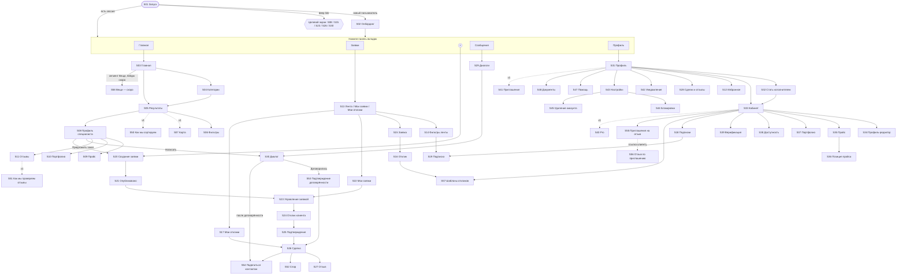
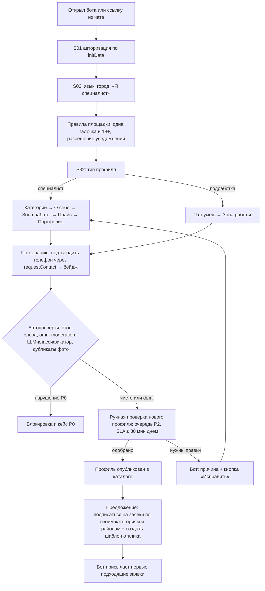
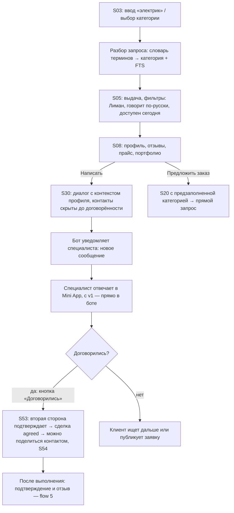
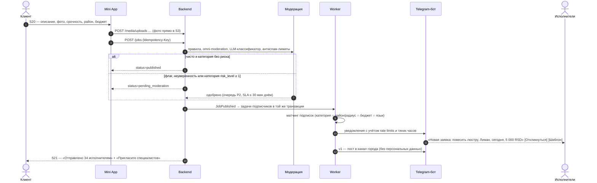
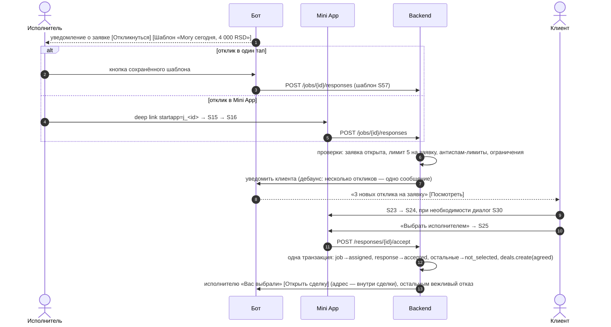
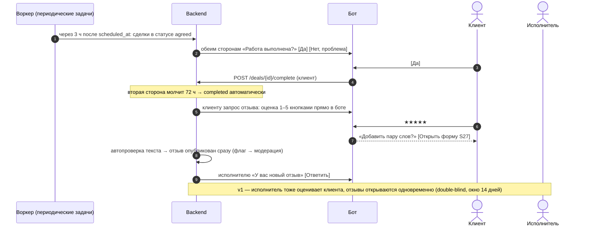
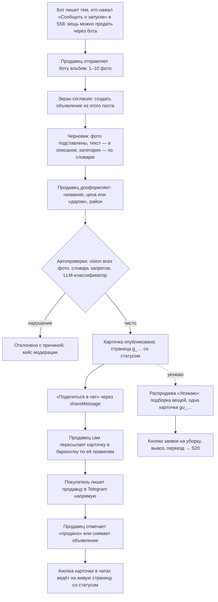

# Продукт: маркетплейс услуг специалистов в Сербии

- **Статус:** первоначальное описание продукта, v0.3 — после ревью и решений владельца от 2026-09-26 и 2026-09-27 (раздел «Вещи»)
- **Дата:** 2026-09-27
- **Название:** «Соседи» (латиницей Sosedi) — решение владельца от 2026-09-27, см. [ARCHITECTURE.md §19.2](ARCHITECTURE.md#192-открытые-вопросы-к-владельцу-продукта). Нейтральное и понятное всей аудитории (серб. susedi, укр. сусіди, бел. суседзі); покрывает мастеров, подработку и вещи. В текстах интерфейса склоняем в кавычках как существительное во множественном числе, по образцу «Одноклассников»: «в «Соседях»», «поддержка «Соседей»», ««Соседи» помогают». В сербском имя не склоняем и в косвенных падежах ставим после родового слова: «у апликацији „Соседи“». Прежнее рабочее название — Specialist App; техническое имя в коде — `specialist_app`
- **Смена названия:** 2026-09-27 владелец заменил «Сосед» (Sosed) на «Соседи» (Sosedi): «мне больше нравится во множественном числе». Технические имена (`specialist_app`, пакеты `@sosed/*`, образы `sosed-*`, usernames ботов) не меняются

**Связанные документы**

| Документ | Что в нём |
|---|---|
| [ARCHITECTURE.md](ARCHITECTURE.md) | Техническая архитектура |
| [adr/](adr/README.md) | Архитектурные решения. Границы MVP — [ADR-0018](adr/0018-mvp-scope-anonymous-no-payments.md) |
| [research/](research/README.md) | Исследования: рынок, Telegram, стек, фронтенд и сторы, право, trust & safety, PostgreSQL, маркетплейс вещей ([research/08](research/08-goods-marketplace.md)) |

## Содержание

1. [Позиционирование и ценностное предложение](#позиционирование-и-ценностное-предложение)
2. [Роли пользователей](#роли-пользователей)
3. [Киллер-фичи](#киллер-фичи)
4. [Фичи и приоритеты (MoSCoW)](#фичи-и-приоритеты-moscow)
5. [Состав MVP](#состав-mvp)
6. [Экраны Mini App](#экраны-mini-app)
7. [Ключевые user flows](#ключевые-user-flows)
8. [Telegram-бот: команды и сценарии](#telegram-бот-команды-и-сценарии)
9. [Метрики успеха](#метрики-успеха)
10. [Открытые вопросы к владельцу](#открытые-вопросы-к-владельцу)

---

## Позиционирование и ценностное предложение

**Одной фразой:** «Опиши задачу — получи предложения с ценой от проверенных мастеров рядом, на русском». Продукт работает поверх Telegram-чатов диаспоры, а не вместо них. Чаты становятся для нас каналом дистрибуции.

**Видение** (решение владельца от 2026-09-27). «Соседи» — одно приложение для русскоязычной аудитории из стран СНГ, которая сейчас живёт в Telegram-чатах: мастера, заявки и подработка, вещи. Сегодня эти задачи разбросаны по чатам «Специалисты», «Работа на день» и барахолкам. Мы собираем их в одном месте.
- **MVP — только услуги:** мастера, заявки и подработка. Одна фраза продукта, онбординг S02 и описание бота не меняются.
- **Вещи — после MVP, итерация «Вещи».** В MVP — только сегмент «Услуги / Вещи · скоро» на Главной и заглушка S58. Подробнее — [Вещи — третья опора, после MVP](#вещи--третья-опора-после-mvp).

**Целевой сегмент** (решение владельца):
- **Клиенты** — русскоязычные релоканты из Telegram-чатов.
- **Исполнители:**
  - русскоязычные специалисты;
  - люди на подработке;
  - точечно — сербские мастера в дефицитных категориях (сантехника, электрика) через concierge.
- **Сербоязычные клиенты** — после MVP, по сигналу (веб-вход по телефону).

Мультиязычность в архитектуре не меняется: ru и sr с первого дня, en — в v1.

### Рынок в цифрах

Источник — [research/01](research/01-competitors-and-market.md).

**Русскоязычные в Сербии**
- У граждан РФ на конец 2025 года — 54 917 действующих ВНЖ и 7 032 ПМЖ.
- Всего русскоязычных — ≈ 80 тыс. (коридор 67–104 тыс.): ≈ 70 тыс. RU, ≈ 8 тыс. UA, ≈ 2 тыс. BY. **[Допущение: оценка R01]**
- Приток падает: первичных ВНЖ в 2023 году было 24 068, в 2025-м — 9 003.
- География притока: Белград — 62%, Нови-Сад — 23%.
- **Вывод.** Ниша узкая и не растёт. Для MVP это плюс: аудитория сосредоточена в нескольких чатах двух городов, до неё можно дотянуться руками. Рост после MVP — через другие страны релокации или сербоязычных клиентов.

**Как сейчас ищут услуги**

| Кто ищет | Где | Что там не так |
|---|---|---|
| Русскоязычные | Telegram-чаты «Специалисты» (23K, 13K, 8K участников), «Сербская барахолка» (40K), «Работа на день» (6,6K) | Пост тонет за час, специалисту — 1 пост в неделю, отзывы хранить негде, мошенники с предоплатой, спам в личку |
| Сербы | Классифайды (KupujemProdajem: 19K объявлений в «Usluge»), Viber | Заявочной модели почти нет: по запросу «tražim majstora» находится 2 объявления |

**Мессенджеры в Сербии.** Viber — №1, WhatsApp — №2, Telegram — №8. Telegram-first подходит русскоязычным. Сербам нужен веб-вход по телефону — после MVP, по сигналу.

### Конкуренты в нашем сегменте и как бьём

| Кто | Что это | Слабое место | Как бьём |
|---|---|---|---|
| Чаты «Специалисты» (23,1K / 13,3K / 8,3K), «Работа на день» (6,6K), «Сербская барахолка» (40,3K) | Главный конкурент и одновременно наш канал. Частным — 1 пост в 7 дней, закреп 15 € в день, пост 35–120 € | Пост тонет, отзывов нет, мошенники, спам в личку | Постоянный профиль, заявка до выбора или окончания срока, отзывы по сделкам, контакты только после договорённости, push подходящих заявок |
| WOM (@WOMappBot) | Mini App-каталог специалистов с отзывами, бесплатно, в каталоге ботов с 22.09.2026. Возможно, связан с админами чата Нови-Сада — **[Не подтверждено]** | Нет доски заявок с бюджетом и откликами | Доска заявок, подписки и отклик в один тап. Гонка по скорости: закрытая бета как можно раньше. Прощупать партнёрство |
| Poisk.rs + ~24 чата | Каталог (~1 700 предложений с ценами в RSD и отзывами), продаёт платные рассылки в личку | Нет заявок, репутация спама в ЛС | Нативный Mini App, доверие вместо спама |
| «Говорун» | AI вытаскивает запросы клиентов из чатов и продаёт их специалистам по подписке | Лиды из чатов без бюджета и верификации | Заявки напрямую от клиентов — с бюджетом, районом и срочностью, на старте бесплатно |
| MostApp | Managed «мастер на час»: 440 RSD за задачу, русский интерфейс, оплата картой | Назначение исполнителя без выбора и торга; только ремонт | Выбор из откликов, прозрачная цена, больше категорий (бьюти, уборка, переезды, репетиторы) |
| Яндекс Исполнители | 100 специалистов в Белграде, 40 в Нови-Саде | По 41-ФЗ не может информировать клиентов через Telegram; верификация только по документам РФ | Telegram-native, местный контекст |
| Profi.ru, YouDo, Авито | — | В Сербии не работают | — |

**Свободная ниша** — структурированная доска заявок с бюджетом в RSD, откликами с ценой и отзывами по реальным сделкам.

**План партнёрства с админами чатов**
- Контент «заявки дня» для их чатов с deep link в Mini App.
- Посевы на старте: 500–1 000 € **[Допущение]**.
- С v1 — revenue share или фикс за размещения и бесплатный Pro для их специалистов.
- Позже — trusted flaggers из числа админов.

**Риски**
- «Админы-привратники»: их доход — реклама специалистов, они могут резать наши ссылки.
- «Гонка с WOM»: формат легко скопировать, защищают скорость, накопленные отзывы и ликвидность.

### Ценность для каждой стороны

| Сторона | Боль сегодня | Что даём |
|---|---|---|
| **Клиент** (русскоязычный релокант) | Надо листать десятки чатов; непонятно, сколько стоит; страшно нарваться на мошенника; спам в личку после вопроса в чате | Заявка за минуту с подсказкой цены в RSD → 3–5 откликов с ценой и сроком. Отзывы только по реальным сделкам, фильтр по языку общения, району и «сегодня». Контакты открываются только после договорённости, точный адрес — только выбранному исполнителю |
| **Специалист** (`pro`) | Пост в чате тонет, разрешён 1 пост в неделю, реклама стоит 15–120 €, отзывы некуда складывать | Постоянная витрина: профиль, прайс, портфолио, ссылка-визитка для чатов и Instagram. Мгновенные подходящие заявки в Telegram, отклик в один тап сохранённым шаблоном. Честные шансы: не больше 5 откликов на заявку. Отзывы копятся в профиле |
| **Ищущий подработку** (`casual`) | Разовые задачи разбросаны по чатам, нет репутации | Простой профиль за 2 минуты, подписка на задачи рядом («помочь с переездом», «собрать шкаф»), отзывы, из которых складывается репутация. Всегда бесплатно. С v1 — «Легальный старт» |
| **Сербский мастер** (точечно) | Ищет клиентов через классифайды, русскоязычные клиенты для него недоступны | Заявки от русскоязычных клиентов в дефицитных категориях (сантехника, электрика). В MVP — через concierge; после MVP — автоперевод ru ↔ sr и вход через веб по телефону |

### Подработка — отдельная опора предложения

- **Почему это важно.** Многие релоканты ищут дополнительный доход. Много исполнителей, готовых браться за задачи, — это быстрые отклики, главная метрика MVP. «Три предложения за час» становятся реальными.
- **Как устроено.** Упрощённый профиль `casual`, всегда бесплатно, подписки на задачи рядом, отклики, репутация через отзывы.
- **Правила формулировок** — в продукте, боте и маркетинге:
  - говорим «задачи», «заказы», «дополнительный доход»;
  - не говорим «работа», «вакансии», «заработок без документов».

  Вакансии и найм на площадке запрещены (модерация, метка `vacancy`).
- **«Легальный старт» — v1.** Короткий гид «как легально подрабатывать в Сербии» и партнёрства с бухгалтерами и релокационными агентствами, которые помогают оформиться. Партнёрства — возможный B2B-доход.
- **Юридические вопросы о подработке** — в бэклоге и MVP не блокируют ([ADR-0018](adr/0018-mvp-scope-anonymous-no-payments.md)).

### Вещи — третья опора, после MVP

Решение владельца от 2026-09-27. Источник цифр и оценок — [research/08](research/08-goods-marketplace.md).

- **Что это.** Продажа б/у и других вещей частными лицами. Цель — дать той же аудитории удобство: перенести барахолки из Telegram-чатов в наше приложение.
- **Чем не является.** Не конкурент KupujemProdajem за сербов и не отдельный продукт. У KP 5,66 млн объявлений и 98,2% узнаваемости, OLX и Sasomange в Сербии не выжили ([research/08 §1.1](research/08-goods-marketplace.md#11-коротко)).
- **Когда.** Не в MVP. После MVP, отдельной итерацией «Вещи», по воротам. Сначала услуги проходят свой 3-месячный go/no-go.
- **Почему не в MVP.** Спрос на структурированную замену чата не доказан: похожие площадки пусты ([§3.6](research/08-goods-marketplace.md#36-структурированные-альтернативы-почти-пусты)). Два холодных старта одновременно угрожают ликвидности услуг. v1 уже перегружен ([§8.2](research/08-goods-marketplace.md#82-где-разместить-варианты)).
- **Заглушка в MVP.** Исследование рекомендовало не показывать раздел в MVP вовсе ([§1.2](research/08-goods-marketplace.md#12-вердикт)). Владелец решил показать заглушку S58 и зафиксировать архитектуру на будущее, а риск размывания позиционирования снижаем так: S02, описание бота и одна фраза продукта не меняются, вход — только сегмент на Главной, без вкладки и пункта в «+» ([§9](research/08-goods-marketplace.md#9-риски)).
- **Позиционирование раздела** после запуска: «барахолка в Telegram с поиском и бронью: ссылки запрещены, контакты скрыты до брони, предупреждения о мошенниках». Не «защита от мошенников» и не «маркетплейс с доставкой»: оплаты, доставки, отзывов и KYC в первых стадиях нет.
- **Объём пилота — «Вещи C2C-lite»:** только частные лица, закрытый список 8–10 категорий, бесплатно, без платежей и API курьеров, с раскрытиями ст. 28 ZZP ([§4.6](research/08-goods-marketplace.md#46-минимальный-законный-вариант-вещи-c2c-lite)).
- **Название.** «Вещи» (ru), «Oglasi» / «Огласи» (sr), единица — «объявление» / «oglas». В маркетинге и постах в чатах — «барахолка». Термины: «заявка» — только услуги, «объявление» — только вещи, для вещей вместо «сделки» — «покупка» и «продажа».
- **Место в IA — вариант A** ([§7.2](research/08-goods-marketplace.md#72-варианты-размещения-в-ia)):
  - на Главной сегмент «Услуги / Вещи»;
  - в пилоте «+» даёт выбор «Заявка на услугу / Продать вещь», последний выбор запоминается;
  - в Сообщениях фильтр «Все / Услуги / Вещи»;
  - таббар не меняется, отдельной вкладки «Вещи» нет.

**Стадии** ([research/08 §8.1](research/08-goods-marketplace.md#81-оценка-по-стадиям), [§8.3](research/08-goods-marketplace.md#83-рекомендуемая-последовательность)). Оценки — ±30% **[Допущение]**.

| Стадия | Что входит | Оценка | Когда и при каком условии |
|---|---|---|---|
| Задел в MVP | Значок раздела, сегмент «Услуги / Вещи · скоро» на Главной (S03), заглушка S58 с opt-in «Сообщить о запуске». Событие `goods_waitlist_joined` — бесплатный сигнал спроса к точке решения 1 | ≤ 0,25 pw | MVP, решение владельца |
| Измерения и интервью | Панель постов в барахолках, 10–15 интервью с продавцами и покупателями, не с админами ([§3.8](research/08-goods-marketplace.md#38-покупательский-спрос-и-сезонность-что-не-измерено)) | ≈ 20–25 ч основателей | После запуска, апрель–май 2027 |
| Точка решения 1 | Делать ли «Вещи-0» | — | ≈ 2027-06-08, не раньше 3-месячного go/no-go услуг. Условия — [Метрики: раздел «Вещи»](#раздел-вещи-после-mvp) |
| «Вещи-0» | Альбом боту → карточка объявления → продавец сам пересылает её в чаты (`shareMessage`). Страница карточки со статусом. Распродажа «Уезжаю» с кнопками заявок на услуги. Без ленты, поиска и чата между незнакомцами: покупатель пишет продавцу в Telegram напрямую | ≈ 2–3 pw | Релиз v1.5, после возврата урезанных фич v1. Тест 6–8 недель в пилотной зоне → точка решения 2 |
| Пилот «Вещи-lite» | ≈ 18 экранов: лента «что нового рядом», подача в 3 шага, «даром», диалог по товару с бронью и «продано», сохранённые поиски (дайджест) | ≈ 12–15 pw (≈ 10–12 поверх «Вещей-0») | Только по точке решения 2: тяга «Вещей-0», партнёр-админ, ёмкость вне очереди. Пилот — 8 недель, затем ворота |
| «Раздел» | Атрибутные фильтры и фасеты, мгновенные сохранённые поиски, профиль продавца, «предложить цену», статистика, «витрина чата» | ≈ 5,5–6,5 pw (всего ≈ 17–21) | После ворот пилота |
| Монетизация | Подъём, выделение, топ и магазины за Stars | ≈ 1–1,5 pw | Юрлицо, `billing` из v1 и 4 недели подряд ворот «живого раздела» |
| Экраны вещей в Expo | Перенос раздела в нативные приложения | ≈ 5–9 pw | Этап 2 |
| Полная версия | Отзывы по продажам и рейтинг продавца, AI-черновик, B2C, карта, автоперевод, курьеры | ≈ 17–30 pw | Только по отдельному решению после «Раздела». Доставка и эскроу — не раньше этапа 2 и после юриста |

**Цена и влияние на roadmap** ([§5.7](research/08-goods-marketplace.md#57-стоимость-владения), [§8.2](research/08-goods-marketplace.md#82-где-разместить-варианты)) **[Допущение]**:
- полная стоимость владения за 12–18 месяцев, если пройти все стадии, — ≈ 30–40 pw;
- этап 2 сдвигается: из-за «Вещей-0» — на ≈ 1–1,5 недели; из-за пилота без дополнительного разработчика — ещё на ≈ 7–9 недель плюс итерации; если все стадии делает та же команда из двух разработчиков — на ≈ 12–16 недель, и сам этап 2 растёт на экраны вещей. Отсрочка этапа 2 откладывает и смягчение риска «зависимость от Telegram»;
- деньги: стадия «Раздел» стоит ≈ €375–730 в месяц (модерация, поддержка, время основателей), базовая выручка — ≈ €270–310 после revenue share админам. Самостоятельным бизнесом раздел не станет;
- очередь дополнительной ёмкости: урезанный v1 → веб для сербов → вещи. «Вещи-0» — исключение как дешёвый тест, но не раньше go/no-go услуг.

**Архитектура** ([research/08 §6](research/08-goods-marketplace.md#6-архитектура-модуль-или-микросервис)). Модуль `goods` модульного монолита — 17-й модуль, 16-й доменный. Не микросервис: он стоит +5,5–16 pw и не разделяет самые узкие общие ресурсы — бот, лимит рассылки, Main Mini App, вход и модераторов. Что это значит для продукта:
- один бот, один Mini App, один аккаунт и один инбокс для услуг и вещей;
- санкции по вертикалям: в `identity.restrictions` появляются область (`all` / `services` / `goods`) и вид `selling_blocked`. Спор из-за дивана не лишает специалиста откликов. P0, мошенничество и фишинг — всегда на весь аккаунт;
- категории вещей — в том же справочнике с признаком `catalog.vertical`, поиск услуг вещей не показывает;
- в диалоге по товару — роли `seller` / `buyer` в `messaging`, бронь работает как «Договорились», контакты — после брони;
- фото объявлений — префикс `listing/` в медиа, vision-проверка **всех** фото;
- deep links `g_…` (объявление) и `gu_…` (продавец или распродажа «Уезжаю»);
- флаг `goods.enabled` включает раздел, стоп-кран `goods.read_only` закрывает подачу и новые диалоги при волне фишинга;
- своя очередь Procrastinate `goods` и отдельный пул БД `app_goods_read` для ленты и поиска, чтобы всплеск вещей не бил по услугам.

Сначала — дешёвые меры внутри монолита по триггерам M1a (отдельная VM для `web-goods`, кэш выдачи, реплика, рост БД), M2 (Typesense за портом поиска), M3 (`worker-media` на своей VM) и M5 (флаги, миграции expand/contract). Выделение в сервис — только по триггерам H1 (отдельная команда), H2 (отдельный продукт), M1 (шумный сосед после M1a) или M4 (инциденты) ([§6.5](research/08-goods-marketplace.md#65-метрики-триггеры-пересмотра)). Модель данных верхнего уровня — [§6.7](research/08-goods-marketplace.md#67-модель-данных-верхнего-уровня).

### Почему уйдут из чатов (или будут пользоваться параллельно)

| Боль в чате | Наш ответ |
|---|---|
| Пост тонет за час, лимит 1 пост в 7 дней | Постоянный профиль. Заявка живёт до выбора исполнителя или окончания срока (от 24 ч до 30 дней) |
| Нет отзывов, отдельные отзовики умирают | Отзывы по подтверждённым сделкам копятся в профиле |
| Мошенники и предоплата | Антискам-проверки в переписке, жалобы и блокировки; с v1 — добровольный бейдж «Телефон подтверждён» и проверка документов |
| Спам в личные сообщения | Контакты открываются только после договорённости (исполнитель выбран или сделка подтверждена), и каждый делится своим контактом сам — double opt-in |
| Надо мониторить десятки чатов | Фильтры (район, язык, цена, «сегодня») и push подходящих заявок |
| Реклама в чате стоит 15–120 € | Базовый профиль бесплатен, продвижение (v1) дешевле закрепа |

### Пилот и категории первой волны

- **Пилотная зона** — одна на первые 8 недель: Нови-Сад или центральные општины Белграда (Врачар, Стари-Град, Савски-Венац, Звездара, Нови-Београд). Выбор зависит от того, где команда: ручной онбординг и concierge требуют присутствия. Затем — второй город.
- **Пять категорий первой волны** ([research/01 §5.2](research/01-competitors-and-market.md#52-категории-первой-волны)):

| # | Категория | Почему в первой волне |
|---|---|---|
| 1 | Мастер на час, мелкий ремонт, сборка мебели; сантехник и электрик — в режиме concierge с сербскими мастерами | Ядро доски заявок, пример из брифа «повесить люстру» |
| 2 | Бьюти (маникюр, брови и ресницы, волосы) | Самая частая категория, двигатель supply и retention |
| 3 | Уборка | Регулярный спрос |
| 4 | Переезды и грузчики | Высокий чек, частые переезды арендаторов |
| 5 | Репетиторы и сербский язык | Еженедельный спрос. В MVP — только занятия для взрослых и уроки сербского; детские занятия — с v1, вместе с проверкой документов (KYC) |

Новая категория или зона открывается только после того, как текущие прошли пороги из [Метрик успеха](#ворота-и-go--no-go).

---

## Роли пользователей

| Роль | Кто это | Что может | Как становятся |
|---|---|---|---|
| Гость | Открыл Mini App по ссылке или из поиска Telegram, но ещё не завершил онбординг | Смотреть каталог, профили специалистов, публичные заявки | Автоматически. В Telegram пользователь сразу идентифицирован через initData, поэтому «гость» — это состояние до принятия правил, а не аноним |
| Клиент | Любой пользователь | Искать, сохранять в избранное, писать специалистам, публиковать заявки, выбирать исполнителя, оставлять отзывы | Принял правила площадки: одна галочка, в ней же подтверждение 18+ |
| Специалист (`pro`) | Мастер, репетитор, юрист, фотограф и т.д. | Всё, что клиент, плюс профиль в каталоге, прайс-лист, портфолио, отклики на заявки, подписки на заявки, шаблоны откликов, отзывы о себе, продвижение (v1) | Создал профиль `pro` и прошёл ручную проверку нового профиля |
| Исполнитель на подработке (`casual`) | Человек без профессионального профиля, готовый взять разовую задачу («помочь с переездом», «повесить полку») | Всё, что клиент, плюс отклики на заявки и подписки на заявки. В каталоге по умолчанию не показывается. Всегда бесплатно | Создал упрощённый профиль `casual`: имя, фото, языки, город, «что умею»; телефон — по желанию (бейдж). Может в любой момент дорасти до `pro` |
| Модератор | Сотрудник trust & safety | Очереди модерации, решения, санкции, апелляции; с v1 — проверка документов | Роль в `identity.user_roles` |
| Поддержка | Сотрудник поддержки | Смотреть карточку пользователя, отвечать в поддержке, передавать кейсы модераторам, выгружать данные по запросу | Роль `support` |
| Администратор | Владелец и операционная команда | Всё, плюс справочники, фича-флаги, рассылки, роли | Роль `admin` |

**Один аккаунт совмещает роли.**
- Каждый пользователь — клиент. Исполнитель — это возможность, которая появляется вместе с профилем, а не отдельный аккаунт. Специалист, которому самому нужен сантехник, публикует заявку тем же аккаунтом.
- Интерфейс подстраивается под намерение из онбординга: у исполнителя стартовый экран вкладки «Заявки» — лента, у клиента — «Мои заявки».
- Отдельного «переключателя режимов», как у части конкурентов, нет: меньше путаницы, и активность в обеих ролях видна в одном месте.
- Персонал (модератор, поддержка, админ) работает в бэк-офисе через отдельный вход. Роль персонала не даёт преимуществ в пользовательской части.
- В разделе «Вещи» (после MVP, итерация «Вещи») продавец и покупатель — не роли аккаунта, а роли участника диалога по объявлению (`seller` / `buyer`). Продавать и покупать может любой пользователь, принявший правила площадки.

---

## Киллер-фичи

Каждая фича закрывает конкретную боль из исследований: 01 — рынок, 02 — Telegram, 06 — trust & safety.

| # | Киллер-фича | Почему это работает | Когда |
|---|---|---|---|
| 1 | **Доска заявок «опиши задачу — получи цены»:** бюджет в RSD, срочность, район, подсказка рыночной цены, выбор единицы (работа, час, м², визит, урок) | В чатах нет структурированных заявок, у сербских классифайдов тоже. Подсказка цены снимает споры «дёшево, а потом доплатите» | MVP (подсказка — Should) |
| 2 | **Мгновенные подходящие заявки в Telegram и отклик в один тап** сохранённым шаблоном прямо из уведомления. Подписка «категория × район или радиус × бюджет × язык» | Специалисты платят лидогенераторам («Говорун») и мониторят десятки чатов. Скорость отклика — главный фактор конверсии | MVP |
| 3 | **Не больше 5 откликов на заявку**, видимый счётчик «осталось 2 места» и метка «откликнулся первым» | Клиента не заваливают откликами, а исполнитель видит реальные шансы. У Bark тоже не больше 5 откликов на заявку. Главная боль на рынке — «платишь за отклик, а клиент молчит» | MVP |
| 4 | **Отзывы только по подтверждённым сделкам.** В MVP отзыв оставляет клиент, публикуется сразу после автопроверки. С v1 оценивают обе стороны и работает double-blind: у Airbnb доля отзывов выросла на 1,7% у гостей и на 9,8% у хостов, корреляция взаимных оценок упала на 48%. «Отзывы до платформы» — отдельно | Отзывам из чатов не верят, отдельные отзовики умирают. В Сербии фейковые отзывы запрещены (ZZP 35/2026) | MVP; double-blind — v1 |
| 5 | **Бейджи верификации с фактом и датой:** телефон через Telegram (бесплатно, добровольно); с v1 — личность (KYC Didit) и предприниматель (APR) | Мошенничество с предоплатой — боль номер один в чатах. У Профи.ру специалистов с проверенным паспортом выбирают заметно чаще **[Допущение: первоисточник не проверен]** | Телефон — MVP; KYC и APR — v1 |
| 6 | **Приватность и антискам по умолчанию.** Контакты — только после договорённости, каждый делится своим сам. До этого телефоны, ссылки и @username в сообщениях маскируются. Точный адрес — только выбранному исполнителю внутри сделки. Смещённая точка на карте, расстояние до специалиста — примерное (≈ 1,5 км). Баннеры при просьбе о предоплате, удаление EXIF | Спам в личку и утечка адреса из фото. Double opt-in, как у MyBuilder | MVP |
| 7 | **«Свободен сегодня» и фильтр «сегодня / срочно»** с подсказкой надбавки за вечер и выходные | Мелкие бытовые задачи срочные («сегодня вечером»); ни один конкурент в Сербии так не фильтрует | MVP |
| 8 | **Фильтр по языку общения и мост ru ↔ sr:** автоперевод заявок, откликов и переписки по кнопке | Русскоязычных сантехников и электриков не хватает, а сербских мастеров много. Мост расширяет supply без смены языка | Фильтр — MVP; перевод — v1 |
| 9 | **Профиль-визитка с короткой ссылкой** для чатов и Instagram; шаринг карточек и заявок в любой чат одним нажатием (`shareMessage`) | Ценность для специалиста даже без клиентов (single-player mode) + вирусная петля через чаты | MVP |
| 10 | **Заявка одним сообщением или голосом:** AI разбирает текст в категорию, срочность, бюджет и район. Пакеты с фиксированной ценой для типовых задач («сборка шкафа», «уборка 1–2-комнатной») | Скорость как в чате, но со структурой. Пакеты — бронь без торга, как у TaskRabbit и Thumbtack | v1 |

---

## Фичи и приоритеты (MoSCoW)

**Обозначения:**

| Обозначение | Значение |
|---|---|
| M | Must |
| S | Should |
| C | Could |
| W | Won't now: не входит в MVP, запланировано на указанный этап |

По решению владельца MVP запускается анонимно, без юрлица, оплаты и формальных правовых механизмов ([ADR-0018](adr/0018-mvp-scope-anonymous-no-payments.md)). Всё перенесённое стоит ниже с этапом v1 — **ничего не удалено**.

**Вход, профиль, настройки**

| Фича | MVP | Этап |
|---|---|---|
| Вход через Telegram (initData → сессия), онбординг: язык, город, намерение | M | MVP |
| Правила площадки (одна страница) и одна галочка при онбординге (в ней же 18+); краткая политика конфиденциальности; журнал версий | M | MVP |
| Полный набор согласий: маркетинг, геолокация, внешние AI, клиентская аналитика с opt-in. В MVP аналитика только серверная, без идентификаторов устройства | W | v1 |
| Разрешение боту писать (`requestWriteAccess`) в контексте | M | MVP |
| Настройки: язык, уведомления, тихие часы, приватность контактов | M | MVP |
| Блокировка пользователей, удаление аккаунта (grace 7 дней); экспорт данных — вручную по запросу | M | MVP |
| Автоматический экспорт данных (самообслуживание) | W | v1 |
| Интерфейс на `ru` и `sr`: исходник — `sr-Cyrl`, `sr-Latn` генерируется, по умолчанию латиница | M | MVP |
| Интерфейс на `en` | W | v1 |
| Веб-вход по телефону (Telegram Gateway или SMS) для сербоязычных пользователей без Telegram | W | После MVP, по сигналу |
| Нативные приложения iOS и Android, Sign in with Apple, push | W | Этап 2 |

**Исполнители**

| Фича | MVP | Этап |
|---|---|---|
| Профиль специалиста (`pro`): категории, описание, языки, город, районы или радиус, формат, контакты и видимость | M | MVP |
| Профиль «подработка» (`casual`), упрощённый, всегда бесплатно | M | MVP |
| Прайс-лист: типы цен (фикс / от / диапазон / час / за единицу / договорная), единицы, порядок | M | MVP |
| Портфолио: фото | M | MVP |
| Портфолио: видео (≤ 60 с) | S | MVP |
| «Доступен сегодня до …», отпуск | M | MVP |
| Шаблоны откликов (до 2 — для отклика в один тап в боте) | M | MVP |
| Подтверждение телефона (`requestContact`) — добровольный бейдж «Телефон подтверждён» | S | v1 (решение владельца 2026-10-01: меньше шагов для пользователей на старте) |
| Кабинет: полнота профиля, быстрые действия | M | MVP |
| «Отзывы до платформы» по приглашению (≤ 5, отдельно от рейтинга) | S | MVP |
| Декларация исполнителя: статус trader / non_trader, право работать, налоги; бейдж статуса в карточке и отклике | W | v1 |
| KYC (Didit): по желанию для всех, обязательно в детских категориях; запуск детских категорий | W | v1 |
| Проверка APR и лицензий вручную | W | v1 |
| Недельный график работы | W | v1 |
| Статистика профиля (просмотры, отклики, выборы) | W | v1 |
| Пакеты с фиксированной ценой («заказать в один тап») | W | v1 |
| «Легальный старт»: гид по легальной подработке и партнёрства с бухгалтерами и агентствами | W | v1 |
| Бизнес-аккаунты (салоны, бригады), запись по слотам | W | Этап 2 |

**Каталог и поиск**

| Фича | MVP | Этап |
|---|---|---|
| Дерево категорий, поиск с таксономией ru/sr/en, опечатками и транслитом | M | MVP |
| Фильтры: категория, район или радиус, язык, цена, рейтинг, формат, «сегодня», «проверенные» (с v1 — телефон и документы) | M | MVP |
| Сортировка: релевантность, рейтинг, расстояние (≈ 1,5 км), цена | M | MVP |
| Публичный профиль, прайс, портфолио, отзывы; избранное | M | MVP |
| Страницы «Как мы сортируем» и «Как мы проверяем отзывы» | W | v1 |
| Карта специалистов и заявок | W | v1 |
| Сохранённые поиски с уведомлением | W | v1 |
| Ценовые ориентиры по реальным данным | W | v1 |

**Доска заявок и сделки**

| Фича | MVP | Этап |
|---|---|---|
| Создание заявки: пошаговая форма, фото, срочность, бакеты бюджета и единица бюджета, район и точка, язык, «только проверенные»; черновик | M | MVP |
| Подсказка рыночной цены (справочные диапазоны по категории и городу) | S | MVP |
| AI-разбор заявки из текста или голоса | W | v1 |
| Модерация по риску: правила, omni-moderation, LLM-классификатор | M | MVP |
| Лента с фильтрами («по моим подпискам», «только с фото»), скрытие заявок | M | MVP |
| Подписки на заявки (мгновенно или дайджест) | M | MVP |
| Отклик: сообщение, цена, срок, шаблоны; лимит 5 и счётчик | M | MVP |
| Отклики клиенту, shortlist, выбор исполнителя → сделка; адрес открывается выбранному внутри сделки | M | MVP |
| Прямой запрос специалисту из каталога | M | MVP |
| Приглашение специалистов в опубликованную заявку | M | MVP |
| Закрытие, продление (до истечения и после), истечение заявки | M | MVP |
| Подтверждение выполнения, отмена (заявка снова открыта, прежние отклики возвращаются), спор (базовый) | M | MVP |
| Автопостинг заявок в городские каналы (без персональных данных) | W | v1 |
| IPS QR для прямой оплаты исполнителю | W | v1 |
| «Безопасная сделка» (эскроу через PSP) | W | Этап 2+, условно |

**Общение**

| Фича | MVP | Этап |
|---|---|---|
| Диалог по отклику или прямому обращению (текст, поллинг), уведомление в боте; маскировка контактов до сделки; «Договорились» → сделка; «Поделиться контактом» — после договорённости | M | MVP |
| Ответ прямо из бота, realtime (SSE), фото в сообщениях | W | v1 |
| Автоперевод ru ↔ sr в заявках, откликах и переписке | W | v1 |

**Отзывы**

| Фича | MVP | Этап |
|---|---|---|
| Отзыв клиента по завершённой сделке: критерии, публикация сразу после автопроверки, ответ специалиста, байесовский рейтинг, «Новый специалист» | M | MVP |
| Оценки клиентов исполнителями (видны только исполнителям) и double-blind для обеих сторон | W | v1 |
| Фото в отзывах, фильтр «с фото» | W | v1 |

**Доверие и безопасность**

| Фича | MVP | Этап |
|---|---|---|
| Жалобы на любой объект, блокировки, стоп-правила, omni-moderation | M | MVP |
| LLM-классификатор маркетплейсной политики (предоплата, дропы, эскорт, вакансии) | M | MVP |
| Очереди P0–P3, чат модераторов с кнопками, SQLAdmin | M | MVP |
| Санкции и страйки, statement of reasons, апелляции | M | MVP |
| pHash-дубликаты портфолио | S | MVP |
| Юридические уведомления с таймером 2 рабочих дня (в MVP такие жалобы идут очередью P1) | W | v1 |
| Детекция накруток отзывов по графу и времени | W | v1 |
| Отчёт о прозрачности | W | v1 |

**Уведомления и рост**

| Фича | MVP | Этап |
|---|---|---|
| Уведомления в боте (каталог MVP), центр уведомлений, дебаунс, тихие часы | M | MVP |
| Deep links (`startapp`), шаринг карточек (`shareMessage`), атрибуция источника | M | MVP |
| Статус Founding и лист ожидания Pro | M | MVP |
| Реферальная программа с наградами | W | v1 |
| Inline mode, guest mode | W | v1 |

**Монетизация** ([ADR-0014](adr/0014-monetization-and-billing.md))

| Фича | MVP | Этап |
|---|---|---|
| Pro-подписка вокруг видимости и инструментов (бейдж, 1 буст в месяц, статистика, расширенное портфолио, 30 активных откликов вместо 10) и бусты за Stars — только для `pro`, после ворот ликвидности. «Ранний доступ к заявкам» — только после заключения юриста. Цены — **[Допущение]** | W | v1 |
| A/B «плата за взаимный интерес» | W | v1.5 |
| IAP и Play Billing | W | Этап 2 |

**Правовое и аналитика**

| Фича | MVP | Этап |
|---|---|---|
| Правила площадки и краткая политика конфиденциальности (ru/sr) | M | MVP |
| Формальные раскрытия: реквизиты (ст. 6 ZET), «Кто за что отвечает», статус trader / non_trader | W | v1 |
| Продуктовые события (серверные), дашборд ликвидности по паре «город × категория» | M | MVP |

**Вещи** ([Вещи — третья опора, после MVP](#вещи--третья-опора-после-mvp), [research/08](research/08-goods-marketplace.md))

| Фича | MVP | Этап |
|---|---|---|
| Значок раздела и сегмент «Услуги / Вещи» на Главной (S03), у «Вещи» бейдж «скоро» | M | MVP, решение владельца |
| Заглушка S58 «Вещи — скоро»: чем будет полезен раздел, opt-in «Сообщить о запуске» (событие `goods_waitlist_joined`) | M | MVP, решение владельца |
| «Вещи-0»: альбом боту → карточка объявления → пересылка в чат (`shareMessage`); страница карточки со статусом; распродажа «Уезжаю» с кнопками заявок на услуги | W | После MVP, итерация «Вещи»: v1.5, после точки решения 1 |
| Пилот «Вещи-lite»: лента, подача, «даром», диалог по товару с бронью и «продано», сохранённые поиски (дайджест); только частные лица, 8–10 категорий, бесплатно | W | После MVP, итерация «Вещи»: по точке решения 2 |
| «Раздел»: атрибутные фильтры, мгновенные сохранённые поиски, профиль продавца, «предложить цену», статистика, «витрина чата» | W | После MVP, итерация «Вещи»: после ворот пилота |
| Монетизация вещей: подъём, выделение, топ, магазины за Stars | W | После MVP, итерация «Вещи»: после юрлица, `billing` и ворот «живого раздела» |
| Экраны вещей в нативных приложениях | W | После MVP, итерация «Вещи»: этап 2 |
| Отзывы по продажам и рейтинг продавца, AI-черновик, B2C-магазины, доставка и «безопасная покупка» | W | После MVP, итерация «Вещи»: полная версия по отдельному решению, доставка и эскроу — этап 2+ |

Шаблон заявки «Уезжаю» на стороне услуг (уборка при выезде, вывоз, переезд) исследование рекомендует сделать ещё в MVP. Это не решение, а [открытый вопрос владельцу](#открытые-вопросы-к-владельцу), п. 1.

---

## Состав MVP

**Цель MVP** — доказать ликвидность в одной пилотной зоне и пяти категориях: заявки быстро получают отклики и заканчиваются выбором исполнителя.

**Оценка:**
- ≈ 19 недель разработки после 3 недель фундамента при команде 1 backend + 1 frontend (узкое место — backend);
- со вторым backend- или fullstack-разработчиком — ≈ 13–14 недель ([ARCHITECTURE.md §20](ARCHITECTURE.md#20-roadmap));
- задел под «Вещи» (сегмент на Главной и заглушка S58) — ≤ 0,25 pw, решение владельца от 2026-09-27.

**Границы** — [ADR-0018](adr/0018-mvp-scope-anonymous-no-payments.md): команда анонимна, без юрлица, без оплаты и формальных правовых механизмов.

**Входит (Must):**
1. Вход через Telegram, онбординг, правила площадки (одна галочка, в ней же 18+), разрешение на уведомления.
2. Профили исполнителей `pro` и `casual`: прайс, фото-портфолио, «доступен сегодня», шаблоны откликов.
3. Каталог: поиск с таксономией ru/sr/en, опечатками и транслитом, фильтры, сортировка, профиль, отзывы, избранное.
4. Доска заявок полного цикла:
   - создание и модерация по риску;
   - лента;
   - подписки с мгновенными уведомлениями и откликом в один тап;
   - отклики с лимитом 5;
   - приглашение специалистов в заявку;
   - выбор исполнителя;
   - сделка, отмена, спор;
   - прямой запрос специалисту.
5. Базовая переписка по отклику или обращению: контакты маскируются до сделки, «Договорились», «Поделиться контактом» после договорённости.
6. Отзывы клиента по сделкам: публикация сразу после автопроверки, ответ специалиста, рейтинг.
7. Trust & safety:
   - жалобы и блокировки;
   - правила, omni-moderation и LLM-классификатор;
   - очереди в Telegram-чате модераторов и SQLAdmin;
   - санкции, апелляции.
8. Уведомления через бота и центр уведомлений; deep links и шаринг карточек.
9. Правила площадки и краткая политика конфиденциальности; удаление аккаунта; экспорт данных — вручную по запросу.
10. Серверная аналитика событий и дашборд ликвидности.
11. Интерфейс на ru и sr (латиница и кириллица).
12. Задел под раздел «Вещи» (≤ 0,25 pw): сегмент «Услуги / Вещи · скоро» на Главной и заглушка S58 с opt-in «Сообщить о запуске». Больше ничего по вещам в MVP нет: ни подачи, ни ленты, ни пункта в «+».

**Если успеваем (Should):**
- видео в портфолио;
- подсказка рыночной цены;
- «отзывы до платформы»;
- pHash-дубликаты.

**После MVP** (ничего не удалено, [ADR-0018](adr/0018-mvp-scope-anonymous-no-payments.md)):
- **v1:**
  - монетизация: Pro и бусты за Stars;
  - подтверждение телефона и бейдж «Телефон подтверждён» (решение владельца 2026-10-01: меньше шагов для пользователей на старте);
  - KYC и детские категории, проверка APR и лицензий;
  - декларация исполнителя и статус trader / non_trader, формальные раскрытия, таймер юридических уведомлений;
  - «Легальный старт»;
  - английский интерфейс;
  - автоперевод, AI-разбор заявок, автопостинг в каналы, реферальные награды;
  - realtime и ответ из бота, фото в чате и отзывах;
  - двусторонние отзывы и double-blind;
  - карта, график работы.
- **После MVP, по сигналу:** веб-вход по телефону для сербоязычных пользователей.
- **После MVP, итерация «Вещи»** (по воротам, [research/08 §8.3](research/08-goods-marketplace.md#83-рекомендуемая-последовательность)):
  - апрель–май 2027 — измерения чатов и интервью силами основателей;
  - ≈ 2027-06-08 — точка решения 1;
  - v1.5 — «Вещи-0», тест 6–8 недель, точка решения 2;
  - затем пилот «Вещи-lite» → «Раздел» → монетизация;
  - экраны вещей в Expo — на этапе 2.

  Подробнее — [Вещи — третья опора, после MVP](#вещи--третья-опора-после-mvp).
- **Этап 2:** нативные приложения.

**Операционная часть MVP** (не код, но без неё MVP не взлетит):
- 150–200 founding-специалистов, онбординг вручную;
- concierge-гарантия «3 предложения за час» по первым заявкам;
- партнёрства с 3–5 админами чатов, посевы на 500–1 000 € **[Допущение]**;
- модерация силами основателей;
- о вещах с админами барахолок не говорим, пока партнёрство по услугам не проработает ≥ 8 недель: «Сербская барахолка» — и канал услуг, и главный соперник вещей ([research/08 §5.6](research/08-goods-marketplace.md#56-конфликт-с-админами-барахолок)).

---

## Экраны Mini App

**Обозначения:** **MVP** — первый релиз; **v1** — следующий релиз; **этап 2** — нативные приложения; **после MVP, итерация «Вещи»** — экраны раздела вещей по воротам ([H. Раздел «Вещи»](#h-раздел-вещи)).

### A. Вход и поиск специалистов

| # | Экран | Содержимое | Действия | Релиз |
|---|---|---|---|---|
| S01 | Запуск | Лоадер; обмен initData на сессию; разбор deep link (`startapp`: `j_…`, `s_…`, `c_…`, `d_…`, `h`, суффикс `_r<code>`) | Автопереход на целевой экран (заявка, профиль, диалог, сделка, главная) или на онбординг | MVP |
| S02 | Онбординг | 3–4 шага: язык (ru / srpski / српски; en — v1; по умолчанию из `language_code`) → город → «Что вы хотите?» (найти специалиста / я специалист / ищу подработку) → правила площадки (одна галочка, в ней же 18+) → разрешение боту присылать уведомления | Выбор, «Разрешить уведомления» (`requestWriteAccess`), пропуск необязательных шагов | MVP |
| S03 | Главная (поиск) | Сегмент «Услуги / Вещи · скоро» вверху: по умолчанию «Услуги», у «Вещи» бейдж «скоро». Строка поиска с автодополнением; сетка категорий верхнего уровня; чипы «Срочно», «Доступны сегодня», «Рядом со мной»; CTA «Разместить заявку — мастера откликнутся сами»; «Мои активные заявки» (если есть); «Проверенные специалисты рядом»; недавно просмотренные | Поиск, переход в категорию или профиль, создание заявки; «Вещи» → S58 (с пилота «Вещи-lite» — главная раздела G01) | MVP |
| S04 | Категории | Дерево категорий с переходом вглубь, иконки, число специалистов | Выбрать категорию → S05 | MVP |
| S05 | Результаты поиска | Карточки специалистов: фото, имя, бейдж «Телефон подтверждён» (с v1), рейтинг или «Новый», район и примерное расстояние (≈ 1,5 км), «от N RSD», языки, «доступен сегодня». Сортировка; активные фильтры чипами; ссылка «Как мы сортируем» (v1); метка «Продвигается» на платных слотах (v1); переключатель «Список / Карта» (v1); пустое состояние с CTA «Разместите заявку — мастера откликнутся сами» | Открыть профиль, в избранное, фильтры | MVP |
| S06 | Фильтры каталога (шторка) | Категория, город/районы/радиус, цена до, рейтинг от, языки общения, формат (выезд / у себя / онлайн), «доступен сегодня», «только проверенные» (с v1), «есть отзывы» | Применить, сбросить | MVP |
| S07 | Карта | Специалисты или заявки на карте, кластеры, мини-карточка по тапу | Открыть карточку, изменить радиус | v1 |
| S08 | Профиль специалиста | Шапка: фото, имя, бейджи с датой проверки, рейтинг и число отзывов (или «Новый специалист»), время ответа, языки. «Доступен сегодня до 20:00». Headline и «о себе», район и формат работы, топ-позиции прайса, превью портфолио, превью отзывов. Памятка «не платите предоплату незнакомым». С v1 — статус trader / non_trader и блок «Кто за что отвечает» | MainButton «Написать» (диалог, контакты скрыты до договорённости); «Предложить заказ» (прямой запрос), избранное, поделиться, пожаловаться, заблокировать | MVP |
| S09 | Прайс-лист специалиста | Все позиции по категориям: тип цены, единица, длительность | «Заказать эту услугу» → прямой запрос с предзаполнением | MVP |
| S10 | Портфолио и просмотрщик | Галерея работ (альбомы), полноэкранный просмотр фото и видео со свайпом | Поделиться работой | MVP (фото); видео — Should MVP / v1 |
| S11 | Отзывы о специалисте | Распределение оценок, средние по критериям, отзывы по сделкам с ответами специалиста; вкладка «До платформы» (Should, в рейтинг не входят); ссылка «Как мы проверяем отзывы» (v1) | Фильтр «с фото» (v1), пожаловаться на отзыв | MVP |
| S12 | Избранное | Сохранённые специалисты (клиент) и сохранённые заявки (исполнитель) | Открыть, удалить | MVP |

### B. Доска заявок (исполнитель)

| # | Экран | Содержимое | Действия | Релиз |
|---|---|---|---|---|
| S13 | Лента заявок | Сегменты «Лента / Мои заявки / Мои отклики»; стартовый сегмент выбирается по роли. Карточки: заголовок, бюджет, бейдж срочности, район и расстояние, «15 мин назад», «откликов 3 из 5», миниатюры фото. Переключатель «По моим подпискам» | Фильтры, открыть заявку, скрыть («не интересно») | MVP |
| S14 | Фильтры ленты (шторка) | Категории, районы/радиус, срочность, бюджет от, язык общения, «только с фото» | Применить, «Сохранить как подписку» → S19 | MVP |
| S15 | Заявка (вид исполнителя) | Описание, фото, бюджет и единица, срочность и время, район (размытая точка на карте), язык; блок клиента: имя, «Телефон подтверждён» (с v1, если есть), «на платформе с…», рейтинг как клиента (v1); счётчики | MainButton «Откликнуться · осталось 2 места» (или «Вы откликнулись», «Мест нет»); поделиться, скрыть, пожаловаться | MVP |
| S16 | Форма отклика | Сообщение (из шаблона S57 или новое), цена: фикс / от / за час / договорная, «когда смогу», превью того, что увидит клиент. На заявку — не больше 5 откликов | Отправить, сохранить как шаблон | MVP |
| S17 | Мои отклики | Вкладки: активные / выбран / не выбран / архив. У выбранных — ссылка на сделку и чат | Открыть заявку, чат, отозвать отклик | MVP |
| S18 | Подписки на заявки | Список подписок с краткой сводкой и переключателем вкл/выкл; статистика «N заявок за неделю» | Создать, изменить, удалить | MVP |
| S19 | Подписка (форма) | Категории (мультивыбор), район(ы) или точка + радиус, бюджет от, срочность, язык, режим «сразу / дайджест» | Сохранить | MVP |
| S57 | Шаблоны откликов | До 2 шаблонов «сообщение + цена + когда смогу» для отклика в один тап прямо из уведомления бота | Создать, изменить, удалить, сделать основным | MVP |

### C. Клиент: заявки и выбор исполнителя

| # | Экран | Содержимое | Действия | Релиз |
|---|---|---|---|---|
| S20 | Создание заявки (4–5 шагов) | 1) «Что нужно сделать»: текст, подсказка категории по тексту, фото. 2) «Когда»: срочно / сегодня / на неделе / гибко, желаемое время. 3) «Где»: город, район, точка на карте и адрес (приватно). 4) «Бюджет»: фикс / диапазон / договорная; бакеты RSD (до 2 тыс. / 2–5 / 5–10 / 10–30 / 30–100 / 100 тыс.+); единица (за работу / час / м² / визит / урок); подсказка «обычно за это платят 2–4 тыс. RSD» (MVP — справочные диапазоны, v1 — по данным); предупреждение, если ставка ниже минимальной оплаты труда. 5) Детали: язык общения, «только проверенные исполнители». Превью. Черновик сохраняется автоматически. | MainButton «Далее» / «Опубликовать»; v1 — «Описать голосом или одним сообщением» (AI-разбор) | MVP |
| S21 | Заявка опубликована | Статус (опубликована / на проверке), сколько исполнителей получили уведомление, блок «Пригласите специалистов» (подходящие профили — приглашение в эту заявку), «Поделиться в чат» | Поделиться, пригласить, перейти к заявке | MVP |
| S22 | Мои заявки | Вкладки: активные / в работе / завершённые / архив; бейдж новых откликов | Открыть заявку, создать новую | MVP |
| S23 | Управление заявкой | Статус и срок, просмотры и отклики, список откликов (до 5: цена, рейтинг, фрагмент сообщения, бейджи, метка «откликнулся первым»), подсказка «Выберите исполнителя, чтобы открыть ему адрес» | Изменить, закрыть с причиной, продлить, пригласить специалистов, поделиться | MVP |
| S24 | Отклик (вид клиента) | Мини-профиль исполнителя (бейджи, рейтинг, отзывы, портфолио; с v1 — статус trader / non_trader), сообщение, цена, «когда сможет» | MainButton «Выбрать исполнителем»; «Написать», «В избранные», «Отклонить» | MVP |
| S25 | Подтверждение выбора | Кого выбрали, условия (цена и время), что откроется исполнителю (точный адрес — внутри сделки), что будет с остальными откликами | Подтвердить → сделка (S26) | MVP |

### D. Сделки и отзывы

| # | Экран | Содержимое | Действия | Релиз |
|---|---|---|---|---|
| S26 | Сделка | Стороны, суть заявки, договорённые цена и время, таймлайн статусов, адрес (исполнителю), памятка по безопасности | «Работа выполнена», «Отменить», «Проблема» → S52, «Поделиться контактом» → S54, чат | MVP |
| S27 | Оставить отзыв | Звёзды, критерии (качество, пунктуальность, общение, цена), текст; фото — v1. Пояснение: отзыв публикуется после автопроверки; с v1, когда оценивают обе стороны, отзывы открываются одновременно | Отправить | MVP |
| S28 | Сделки и отзывы | История сделок в обеих ролях; отзывы полученные и написанные | Открыть сделку, ответить на отзыв | MVP |
| S52 | Проблема со сделкой (спор) | Тип (не пришёл, плохое качество, взял предоплату, ущерб, безопасность), описание, доказательства (сообщения, фото); статус спора; срок ответа второй стороны — 48 ч | Отправить, ответить на спор, отозвать | MVP |
| S53 | Подтверждение договорённости | Для второй стороны после «Договорились» в чате: суть, цена, время, кто предложил. Предложение ждёт 72 ч | «Подтвердить» → сделка `agreed`; «Отклонить» | MVP |
| S56 | Отзыв по приглашению | Форма «отзыва до платформы» по ссылке от специалиста: оценка, текст, пометка «не подтверждён сделкой» | Отправить | Should MVP |

### E. Сообщения

| # | Экран | Содержимое | Действия | Релиз |
|---|---|---|---|---|
| S29 | Диалоги | Список диалогов с аватаром, контекстом («Заявка: повесить люстру»), последним сообщением, непрочитанными | Открыть; поиск по диалогам (v1) | MVP |
| S30 | Диалог | Текстовые сообщения (фото — v1); карточка контекста (заявка или профиль) сверху. Телефоны, ссылки и @username до договорённости маскируются с подсказкой «контакты откроются после договорённости». Баннер безопасности при подозрительном контенте; автоперевод ru ↔ sr (v1) | Отправить, «Договорились» (вторая сторона видит S53), «Поделиться контактом» (после договорённости, S54), пожаловаться, заблокировать | MVP |
| S54 | Поделиться контактом (шторка) | Доступна после сделки `agreed`: чем поделиться (Telegram-ссылка, если есть username; телефон через `requestContact`), предупреждение о безопасности | Поделиться своим контактом | MVP |

### F. Профиль и кабинет исполнителя

| # | Экран | Содержимое | Действия | Релиз |
|---|---|---|---|---|
| S31 | Профиль (аккаунт) | Имя и фото, город; вход в «Кабинет специалиста» или CTA «Стать специалистом / Найти подработку»; меню: мои заявки, мои отклики, сделки и отзывы, избранное, уведомления, настройки, пригласить друзей (v1), помощь, правовая информация | Навигация | MVP |
| S32 | Стать исполнителем (пошагово) | Тип (специалист / подработка) → категории → о себе (имя, фото, headline, описание, языки, опыт) → где работаю (город, районы, формат, радиус) → прайс (для `pro` хотя бы одна позиция) → портфолио (по желанию) → контакты и видимость → «Отправить на проверку» (подтверждение телефона — с v1). С v1 добавятся шаг декларации (статус trader / non_trader, право работать, налоги) и KYC для детских категорий | Далее / назад, сохранить черновик | MVP |
| S33 | Кабинет специалиста | Статус профиля, полнота профиля в % с подсказками, переключатель «Доступен сегодня», короткая статистика (v1), быстрые ссылки | Переходы в редакторы, «Посмотреть как клиент» | MVP |
| S34 | Редактирование профиля | Поля профиля | Сохранить (пост-модерация) | MVP |
| S35 | Прайс-лист (редактор) | Позиции по категориям, порядок перетаскиванием, ценовой ориентир рынка (v1) | Добавить, изменить, скрыть, удалить | MVP |
| S36 | Позиция прайса | Категория, название, тип цены, сумма(ы), единица, длительность, описание | Сохранить | MVP |
| S37 | Портфолио (редактор) | Работы и альбомы; загрузка фото (видео — Should) с прогрессом; подписи; порядок | Добавить, изменить, удалить | MVP |
| S38 | Доступность | «Доступен сегодня до …», отпуск; недельный график (v1) | Сохранить | MVP (флаг), v1 (график) |
| S39 | Верификация | С v1: телефон (по желанию, бейдж), документ (KYC Didit), регистрация бизнеса (APR), лицензии; статус и причина отказа | Пройти шаг | v1 |
| S40 | Pro и продвижение | Pro (видимость и инструменты) и бусты с ценой в Stars и «≈ N RSD», текущая подписка, остатки квот, история покупок; только для профилей `pro` | Купить (`openInvoice`), отменить | v1 |
| S41 | Приглашения | Реферальная ссылка, условия, прогресс и награды | Поделиться | v1 |
| S55 | Приглашения на «отзыв до платформы» | Ссылки для прошлых клиентов (≤ 5), статусы: отправлено, оставлен, на модерации | Создать ссылку, поделиться, отозвать | Should MVP |

### G. Сервисные экраны

| # | Экран | Содержимое | Действия | Релиз |
|---|---|---|---|---|
| S42 | Уведомления | Лента событий (новые отклики, выбор исполнителя, договорённости, споры, сообщения, отзывы, решения модерации) | Открыть объект, отметить прочитанным | MVP |
| S43 | Настройки | Язык интерфейса (ru / sr-Latn / sr-Cyrl; en — v1), город, уведомления (группы × каналы, тихие часы), приватность (показывать ли Telegram и телефон после договорённости), экспорт данных — запрос в поддержку (автоматически — v1) | Сохранить | MVP |
| S44 | Заблокированные пользователи | Список блокировок | Разблокировать | MVP |
| S45 | Удаление аккаунта | Что удалится, что останется (обезличенно), grace-период 7 дней | Подтвердить, отменить запрос | MVP |
| S46 | Жалоба (шторка) | Причина (спам, мошенничество, запрещённая услуга, оскорбления, фейк, не пришёл), комментарий | Отправить | MVP |
| S47 | Помощь | FAQ, правила безопасности (не платить предоплату незнакомым, не уходить на сторонние сайты), связь с поддержкой через бота | Написать в поддержку | MVP |
| S48 | Правовые документы | Правила площадки и политика конфиденциальности (ru/sr). С v1 — полные условия использования и страница реквизитов (ст. 6 ZET) | — | MVP |
| S49 | Системные состояния | Нет сети, ошибка, техработы, «обновите Telegram», аккаунт ограничен (причина, срок, как обжаловать) | Повторить, обжаловать | MVP |
| S50 | Как мы сортируем | Параметры ранжирования без точных весов, маркировка продвижения; ссылка из выдачи (ст. 28 ZZP) | — | v1 |
| S51 | Как мы проверяем отзывы | Отзывы только по сделкам, «до платформы» — отдельно, правила модерации отзывов | — | v1 |

### H. Раздел «Вещи»

В MVP — только заглушка S58 и сегмент на Главной (S03), решение владельца от 2026-09-27. Остальные экраны вещей — после MVP, итерация «Вещи» ([Вещи — третья опора, после MVP](#вещи--третья-опора-после-mvp)).

| # | Экран | Содержимое | Действия | Релиз |
|---|---|---|---|---|
| S58 | Вещи — скоро | Значок раздела, заголовок «Раздел „Вещи“ скоро». Чем будет полезен: продать и купить вещи у своих, без поиска по чатам; отдать даром; распродажа при переезде с кнопками заявок на переезд и уборку. Подачи, ленты и сбора объявлений нет. Ссылка на шаблон «Уезжаю» — только если его примут ([вопрос 1](#открытые-вопросы-к-владельцу)). В «Вещах-0» (после MVP, итерация «Вещи») — тот же экран без «скоро»: «Продайте вещь: отправьте боту фото — получится карточка для чата». G01 — только с пилота **[Допущение]** | Кнопка «Сообщить о запуске» в контенте экрана (таббар виден, поэтому не MainButton — как в утверждённом макете) — opt-in: бот один раз напишет о запуске. Если боту ещё нельзя писать — сначала `requestWriteAccess`. После нажатия — «Готово! Бот напишет, когда раздел „Вещи“ откроется»; отписаться — в настройках уведомлений (S43). Серверное событие `goods_waitlist_joined`. Карточка «Переезжаете? Закажите переезд, уборку или сборку мебели уже сейчас» ведёт на обычное создание заявки S20a (это не шаблон «Уезжаю»). В «Вещах-0» MainButton — «Отправить фото боту», открывает чат с ботом (G18) | MVP |

**IA раздела после MVP** — вариант A ([research/08 §7.2](research/08-goods-marketplace.md#72-варианты-размещения-в-ia)):
- S03 — сегмент «Услуги / Вещи» с пилота ведёт в G01 вместо S58. В «Вещах-0» он ещё ведёт в S58, но без бейджа «скоро» (см. S58);
- «+» — выбор «Заявка на услугу / Продать вещь», последний выбор запоминается;
- S29 — фильтр «Все / Услуги / Вещи»;
- в пилоте меняются ещё S12 (сегмент «Вещи»), S20 (шаблон «Уезжаю», если его не сделают в MVP), S28 («Покупки и продажи»), S31 («Мои объявления», «Сохранённые поиски»), S42 и S43 (группа «Вещи»), S46 (причины жалоб для товаров), S47 («Как безопасно купить и продать») — всего ≈ 11 экранов;
- S02 не меняется ни сейчас, ни в пилоте. Вариант «Купить или продать вещь» в онбординге ломает определение намерения «клиент или исполнитель» и размывает позиционирование.

**Черновой список экранов вещей — после MVP, итерация «Вещи», не проектируются до точки решения 1** ([research/08 §7.3](research/08-goods-marketplace.md#73-черновой-список-экранов)). Список нужен для оценки, а не как задание дизайнеру.

Стадии: **У** — шаблон «Уезжаю» на стороне услуг, если его примут (это не задел S58); **0** — «Вещи-0»; **П** — пилот «Вещи-lite», упрощённо; **Р** — «Раздел»; **Полн.** — полная версия после юрлица и ворот монетизации; **Эт. 2+** — после PSP и договоров с курьерами.

| # | Экран | Одной строкой | Основа | Стадия |
|---|---|---|---|---|
| G00 | Вопрос «Продаёте вещи?» | Один вопрос внутри шаблона «Уезжаю» после публичного запуска, событие аналитики. Только если шаблон будет ([вопрос 1](#открытые-вопросы-к-владельцу)) | Новый, минимальный | У |
| G01 | Вещи (главная раздела) | Поиск, плитки категорий, чипы «Рядом», «Даром», «Могу отправить», лента свежих объявлений сеткой в 2 колонки | Новый | П |
| G02 | Категории вещей | Дерево в 2 уровня с числом объявлений | Как S04 | П |
| G03 | Выдача | Сетка или список, сортировка «свежие / дешевле / ближе», чипы фильтров, «Сохранить поиск», пустое состояние с подпиской | Новый | П |
| G04 | Фильтры (шторка) | Категория, цена, состояние, район или радиус, «могу отправить», «даром» | Как S06 | П |
| G05 | Карточка объявления | Галерея, цена и «торг», состояние, описание, район без точки, мини-профиль продавца, памятка безопасности. MainButton «Написать продавцу». Статусы «бронь» и «продано» — текстом и значком. В «Вещах-0» — упрощённая страница со статусом, без чата | Новый | 0 (упрощённо), П |
| G06 | Просмотр фото | Полноэкранная галерея | S10 | П |
| G07 | Подача · 1. Фото | До 10 фото, обложка, порядок. Правило «только свои фото, без узнаваемых лиц, особенно детей» | Новый | П |
| G08 | Подача · 2. Что продаёте | Название, подсказка категории (3–5 вариантов), состояние, описание | Новый | П |
| G09 | Подача · 3. Цена и где | Цена / торг / даром, район, «могу отправить», превью, автосохранение черновика | Новый | П |
| G10 | Опубликовано | Статус проверки, «Поделиться в чат» (`shareMessage`), «Разместить ещё» | Как S21 | 0 (карточка), П |
| G11 | Мои объявления | Вкладки «Активные / Бронь / Черновики / Архив», быстрые действия | Новый | П |
| G12 | Управление объявлением | Просмотры, диалоги, «Забронировать», «Продано», «Продлить», «Изменить» | Как S23 | П |
| G13 | Бронь (шторка) | Кому бронируем (из диалогов), срок, что откроется покупателю | Вариант S53 | П |
| G14 | Продано (шторка) | Кому продано (из диалогов или «не здесь»). Покупатель получает запрос подтверждения — основа North Star раздела | Новый | 0 (только «продано»), П |
| G15 | Сохранённые поиски | Список с «+N новых», вкл/выкл, режим «сразу / дайджест» | Как S18 | П (дайджест), Р (мгновенно) |
| G16 | Профиль продавца | Объявления продавца, бейджи, «на платформе с», «продано N»; отзывы — с полной версии | Упрощённый S08 | Р |
| G17 | Диалог по товару | S30 с карточкой товара сверху, быстрые вопросы, у продавца — «Забронировать» и «Продано» | Вариант S30 | П |
| G18 | Подача альбомом через бота | 1–10 фото боту → экран согласия «Создать объявление из этого поста» → черновик → «Дооформить объявление» | Бот | 0, П (без AI) |
| G19 | AI-черновик | Название, категория, состояние, описание по фото; подсказка цены по похожим | Новый | Полн. |
| G20 | Предложить цену (шторка) | Своя цена, лимит офферов в день, «Принять / Отклонить / Встречная» | Новый | Р |
| G21 | Атрибутные фильтры | Размер, бренд, модель, память, габариты по категориям | Расширение G04 | Р |
| G22 | Карта объявлений | Кластеры, радиус | Как S07 | Полн. |
| G23 | Распродажа «Уезжаю» | Подборка вещей продавца «Уезжаю 15.10, продаю всё», одна карточка для шаринга, кнопки заявок на уборку, вывоз и переезд | Новый | 0, П (упрощённо) |
| G24 | Продвижение объявления | Поднятие, выделение, топ за Stars, метка «Продвигается» | Новый | Полн. |
| G25 | Статистика продавца | Просмотры, избранное, диалоги, продажи | Новый | Р |
| G26 | Кабинет магазина (B2C) | Статус trader, реквизиты, витрина | Новый | Полн. |
| G27 | Массовая загрузка | CSV или фото пачкой для магазина | Новый | Эт. 2+ |
| G28 | Оформление отправки | Курьер или пакетомат, кто платит, наложенный платёж | Новый | Эт. 2+ |
| G29 | Отслеживание посылки | Статусы и трек-номер | Новый | Эт. 2+ |
| G30 | Безопасная покупка | Оплата через PSP с удержанием до подтверждения | Новый | Эт. 2+ |
| G31 | Спор по покупке | «Не пришло», «не как в описании», доказательства | Как S52 | Эт. 2+ |
| G32 | Подписки на продавцов | Лента новых вещей от подписок | Новый | Эт. 2+ |
| G33 | Поиск по фото | «Найти похожее» по снимку | Новый | Эт. 2+ |
| G34 | Витрина чата-партнёра | Лента объявлений конкретного чата под его названием | Вариант G01 | Р |

- **«Вещи-0»** — 4 элемента: G18, упрощённая G05, G10, упрощённая G23, плюс «продано» из G14.
- **Пилот** — ≈ 18 экранов и шторок в упрощённом виде (G01–G15, G17, G18, G23).
- **Доступность.** В критерии приёмки G01–G17: alt-текст для фото, статусы не только цветом, контраст бейджей поверх фото, подписи у иконок фильтров, галерея без жестов, `prefers-reduced-motion` ([§7.7](research/08-goods-marketplace.md#77-локализация-и-доступность)).

**Итого 58 экранов и шторок** (S01–S58; экраны вещей G00–G34 сюда не входят):
- **53 — в MVP.** S55 и S56 из них — Should, S58 — заглушка «Вещи» по решению владельца. Часть экранов в урезанном виде: портфолио без видео, доступность без графика, верификация — только телефон.
- **5 — в v1:** S07, S40, S41, S50, S51.

### Карта навигации

**Общие элементы и навигация**
- Шторки S46 (жалоба), S54 (контакт), S06 и S14 (фильтры), а также системные состояния S49 доступны со многих экранов. На карте они показаны только там, где основные.
- Кнопка «Назад» — нативная `BackButton` Telegram.
- Основное действие экрана — `MainButton`; когда она показана, нижняя панель вкладок скрывается.
- Таббар из-за вещей не меняется: ни в MVP, ни в пилоте отдельной вкладки «Вещи» нет. Экраны G… на карте не показаны — они после MVP, итерация «Вещи».

---

## Ключевые user flows

### 1. Онбординг специалиста

С v1 в этот flow добавятся декларация исполнителя (статус trader / non_trader, право работать, налоги) и KYC для детских категорий ([ADR-0018](adr/0018-mvp-scope-anonymous-no-payments.md)).

### 2. Поиск и контакт специалиста (каталог)

### 3. Публикация заявки

### 4. Отклик на заявку и выбор исполнителя

### 5. Отзыв

### 6. «Вещи-0»: карточка для чата — план после MVP

После MVP, итерация «Вещи». Делается только после точки решения 1 и не проектируется раньше ([research/08 §1.2](research/08-goods-marketplace.md#12-вердикт), [§8.1](research/08-goods-marketplace.md#81-оценка-по-стадиям)). Своей ленты, поиска и чата нет: «Вещи-0» кормят барахолки карточками, а не заменяют их.

- Текст пересланного поста берётся, только если автор поста и отправитель совпадают. Иначе — только фото, с флагом модерации ([§6.8](research/08-goods-marketplace.md#68-влияние-на-поиск-медиа-модерацию-чат-бот-и-deep-links)).
- Объявление не публикуется, пока все фото не прошли vision-проверку.
- Статусы в «Вещах-0» — «активно», «продано», «снято».
- Что меряем и когда закрываем идею — [Метрики: раздел «Вещи»](#раздел-вещи-после-mvp).

---

## Telegram-бот: команды и сценарии

**Команды (меню бота)**

| Команда | Что делает |
|---|---|
| `/start [payload]` | Приветствие на языке Telegram-клиента, кнопка «Открыть приложение» (web_app). Разбор deep link: `j_…`, `s_…`, `c_…`, `d_…`, `h`, суффикс `_r<code>`. На этапе 2 — `link_<nonce>` (привязка аккаунта) |
| `/app` | Открыть Mini App (дублирует menu button) |
| `/new` | Создать заявку: кнопка в Mini App (MVP). В v1 — «опишите задачу одним сообщением или голосом»: бот собирает черновик и открывает его на подтверждение |
| `/jobs` | Мои заявки: статусы, число новых откликов, кнопки перехода |
| `/feed` | Для исполнителей: последние подходящие заявки по подпискам |
| `/available` | Для специалистов: включить или выключить «Доступен сегодня» (кнопки «до 18:00 / до 22:00 / выключить») |
| `/alerts` | Управление подписками на заявки (пауза на сегодня, на неделю, открыть настройки) |
| `/language` | Язык интерфейса и уведомлений |
| `/settings` | Уведомления, тихие часы |
| `/help` | FAQ, правила безопасности, связаться с поддержкой (диалог с поддержкой через бота) |
| `/terms`, `/privacy` | Правила площадки и политика конфиденциальности (ru/sr); с v1 — полные условия использования |
| `/paysupport` | v1, вместе с продажами за Stars: поддержка по платежам и возвраты (обязательна по правилам Telegram) |

**Исходящие сценарии (уведомления)**

| Событие | Кому | Сообщение и кнопки |
|---|---|---|
| Новая заявка по подписке | Исполнитель | Карточка заявки (категория, район, срочность, бюджет, фото-превью) · [Откликнуться] [Шаблон «…»] [Не интересно] [Пауза подписки] |
| Приглашение в заявку | Специалист | «Клиент приглашает вас откликнуться: …» · [Посмотреть заявку] |
| Новые отклики | Клиент | Дебаунс 5–10 мин: «На заявку „…“ 3 новых отклика, от 3 000 RSD» · [Посмотреть] |
| Вас выбрали / не выбрали | Исполнитель | «Клиент выбрал вас» · [Открыть сделку] (адрес и время — внутри сделки) [Написать]. Адрес в сообщении бота не отправляем |
| Предложение договорённости | Вторая сторона диалога | «… предлагает договориться: суть, цена, время» · [Подтвердить] [Отклонить]; предложение ждёт 72 ч |
| Сделка отменена | Обе стороны | Кто отменил и причина · [Открыть]. Клиенту: «Заявка снова открыта, прежние отклики вернулись» |
| Открыт спор | Вторая сторона | «Есть проблема со сделкой» · [Ответить] — в течение 48 ч |
| Новое сообщение | Участник диалога | Превью текста · [Ответить] (v1: ответ реплаем прямо в боте) |
| Напоминание о сделке | Обе стороны | За 2 ч до времени · [Открыть] |
| «Работа выполнена?» | Обе стороны | [Да] [Нет, проблема] |
| Запрос отзыва | Клиент (v1 — обе стороны) | Оценка 1–5 кнопками → [Написать отзыв] |
| Новый отзыв | Исполнитель | «У вас новый отзыв» · [Ответить] |
| Решение модерации | Автор | Опубликовано / отклонено с причиной · [Исправить] [Обжаловать] |
| Аккаунт ограничен | Пользователь | Причина и срок · [Подробнее] [Обжаловать] |
| Профиль давно не обновлялся / нет доступности | Специалист | Мягкое напоминание раз в 2 недели |
| Истекает заявка | Клиент | «Заявка закроется через 2 ч» · [Продлить] [Закрыть: нашёл исполнителя] |
| Заявка истекла | Клиент | «Заявка закрыта по сроку» · [Продлить] [Закрыть] |
| Запуск «Вещей-0» (после MVP, итерация «Вещи») | Нажавшие «Сообщить о запуске» в S58 | Одно сообщение «Теперь вещь можно продать через бота: отправьте фото — сделаем карточку для чата» · [Открыть]. Не «раздел открылся»: ленты и поиска в «Вещах-0» нет |

**Inline mode и шаринг.**
- `@bot электрик лиман` в любом чате — выдача карточек специалистов с кнопкой «Открыть» (v1).
- Кнопка «Поделиться» в профиле и заявке использует подготовленные сообщения (`savePreparedInlineMessage` + `shareMessage`) с превью и deep link.
- Когда в чатах диаспоры спрашивают «посоветуйте мастера», ответ — ссылка на карточку.

**Каналы по городам (v1).** Бот публикует новые заявки в каналы «Заявки — Белград» и «Заявки — Нови-Сад»: без персональных данных, с кнопкой «Откликнуться». Это канал привлечения исполнителей, которые ещё не пользуются Mini App.

**Вещи (после MVP, итерация «Вещи»).**
- Описание бота и меню команд из-за вещей не меняются.
- В «Вещах-0» бот — основной канал подачи: продавец присылает альбом, бот собирает черновик (flow 6).
- Уведомления вещей — только по явному opt-in, по умолчанию дайджест не чаще раза в сутки. Бот у услуг и вещей один: кто заблокирует его из-за дайджестов, перестанет получать и подходящие заявки ([research/08 §6.8](research/08-goods-marketplace.md#68-влияние-на-поиск-медиа-модерацию-чат-бот-и-deep-links)).

---

## Метрики успеха

**North Star Metric — число сделок, завершённых через платформу за неделю** (`deals.completed`, по паре «город × категория»). Эта метрика растёт, только если одновременно есть спрос, предложение, скорость и доверие.

Источник каждой цели указан в таблице: R01 — [research/01 §5.7](research/01-competitors-and-market.md#57-метрики-и-пороги-для-gono-go-допущение-ориентиры), R06 — [research/06 §7](research/06-trust-safety-growth-monetization.md#7-метрики-успеха). Сами исследования называют эти значения ориентирами. Всё, у чего источника нет, — **[Допущение]**.

### Ликвидность (главное на первые 3 месяца)

| Метрика | Определение | Цель MVP (90 дней) | Цель v1 | Источник |
|---|---|---|---|---|
| Response rate@1h | Доля заявок с ≥ 1 откликом за 1 ч (08:00–22:00) | ≥ 80% (цель успеха) | ≥ 85% | R01; v1 — [Допущение] |
| Response rate@4h | То же за 4 ч | ≥ 70% | ≥ 85% | R06 |
| Response rate@24h | То же за 24 ч | ≥ 85% | ≥ 95% | R06 |
| Глубина | Медиана откликов на заявку за 24 ч | 3–5 (лимит 5; цель успеха — ≥ 3) | 3–5 | R06, R01 |
| TTFR | Медиана времени до первого отклика | ≤ 60 мин (цель успеха — < 30 мин) | ≤ 20 мин | R06, R01 |
| Fill rate@7d | Доля заявок, где выбран исполнитель | ≥ 35% (цель успеха — ≥ 40%) | ≥ 50% | R06, R01 |
| Completion rate | Доля выборов, закрытых как выполненные | ≥ 60% | ≥ 75% | R06 |
| Win rate отклика | Медиана доли выбранных откликов у активных исполнителей | ≥ 10% | ≥ 15% | R06 |
| Supply/demand | Активных исполнителей на одну заявку в неделю в паре «категория × зона» | 3–10 | 3–10 | R06 |

### Стороны и удержание

| Метрика | Определение | Цель MVP | Цель v1 | Источник |
|---|---|---|---|---|
| Weekly active specialists | Исполнители с ≥ 1 откликом в неделю | 80–150 на одну пилотную зону (R06: 150–300 на два города) | ×3 | [Допущение] на основе R06 |
| Доля активных среди профилей | Откликались хотя бы раз в неделю | ≥ 30% | ≥ 40% | R01; v1 — [Допущение] |
| Opt-in уведомлений | Пользователи, разрешившие боту писать | ≥ 70% | ≥ 80% | [Допущение] |
| Repeat rate клиентов | Повторная заявка или прямой заказ | ≥ 25% за 60 дней | ≥ 30% за 90 дней | R01, R06 |
| 6-месячное удержание | Среди клиентов с транзакцией | Трекать | ≥ 30% (good), 50% (great) | R06 |
| K-фактор шаринга | Новые пользователи на одного активного через шаринг и рефералы | Трекать | ≥ 0,2 | [Допущение] |

### Доверие и качество

| Метрика | Определение | Цель | Источник |
|---|---|---|---|
| Review rate | Доля завершённых сделок с отзывом | ≥ 40% (MVP) → ≥ 55% (v1) | R06 (цель успеха R01 — ≥ 30%) |
| Жалобы на мошенничество | На 1 000 сделок | < 5 (MVP) → < 2 (v1) | R06 |
| SLA модерации | Доля кейсов, решённых в срок, по очередям | ≥ 95% | [Допущение] |
| Точность автомодерации | Доля верных автоблоков (выборочный аудит) | ≥ 90% | R06 |
| Доля KYC | Среди активных специалистов (KYC появляется в v1) | ≥ 30% в первые 3 месяца v1 → ≥ 60% | R06 |
| Концентрация | Доля топ-10% специалистов в выборах | ≤ 50% | R06 |

### Бизнес (с v1)

| Метрика | Определение | Цель | Источник |
|---|---|---|---|
| GMV proxy | Сумма `agreed_price` завершённых сделок | +15% месяц к месяцу | R06 [Допущение] |
| Конверсия в Pro | Доля `pro`-профилей с подпиской в парах, прошедших ворота | ≥ 5–8% | [Допущение] |
| ARPPU, LTV:CAC | По каналам оплаты | LTV:CAC ≥ 3, окупаемость CAC ≤ 12 мес. | R06 |

### Ворота и go / no-go

1. **Открытие новой категории или зоны** — по порогам R01 §5.7. Нужны все условия:

   | Метрика | Порог |
   |---|---|
   | Заявки с ≥ 1 откликом за 1 ч и ≥ 3 откликами за 24 ч | ≥ 80% |
   | Заявки с выбором исполнителя | ≥ 40% |
   | Медиана TTFR | < 30 мин |
   | Специалисты, откликающиеся еженедельно | ≥ 30% |
   | Клиенты с повторной заявкой за 60 дней | ≥ 25% |
   | Сделки с отзывом | ≥ 30% |

2. **Включение монетизации в паре «город × категория»** — по воротам R06: 4 недели подряд response rate@4h ≥ 70%, fill rate ≥ 35% и медианный win rate ≥ 15% ([ADR-0014](adr/0014-monetization-and-billing.md)).
3. **Нижний порог пересмотра через 3 месяца после запуска** **[Допущение]**: если response rate@1h < 60%, fill rate < 25% или repeat rate < 10%, пересматриваем категории, зону или ценностное предложение, а не масштабируем.
4. **Раздел «Вещи»** — точка решения 1, условия закрытия идеи и ворота пилота — ниже, в [Раздел «Вещи» (после MVP)](#раздел-вещи-после-mvp). Они не мягче ворот открытия новой категории услуг (п. 1).

### Раздел «Вещи» (после MVP)

Источник — [research/08 §1.3](research/08-goods-marketplace.md#13-самый-сильный-аргумент-против-и-что-его-опровергло-бы), [§5.3](research/08-goods-marketplace.md#53-cold-start-и-ворота-пилота), [§5.8](research/08-goods-marketplace.md#58-метрики-раздела), [§8.3](research/08-goods-marketplace.md#83-рекомендуемая-последовательность). Все пороги — стартовые **[Допущение]**. Их утверждают до начала измерений, а не после.

**Сигнал спроса в MVP.** Серверное событие `goods_waitlist_joined`: пользователь нажал «Сообщить о запуске» в S58.
- Считаем число opt-in и их долю от активных пользователей за неделю, по городу.
- Если примут шаблон «Уезжаю» ([вопрос 1](#открытые-вопросы-к-владельцу)), из S58 ведёт ссылка на него — тогда трекаем и заявки по шаблону, созданные из S58.
- Порога нет: это бесплатный сигнал к точке решения 1, а не ворота.

**North Star раздела** — число покупок за неделю по паре «город × категория», подтверждённых обеими сторонами: продавец отметил «продано здесь», покупатель подтвердил. Аналог `deals.completed` у услуг **[Допущение: выбор метрики]**. Полноценно считается с пилота: в «Вещах-0» своего чата нет, и «продано» — самоотчёт продавца.

**Точка решения 1 (≈ 2027-06-08)** — не раньше 3-месячного go/no-go услуг. Нужны все условия:
- пилотная зона услуг 4 недели подряд проходит ворота «новая категория или зона» (п. 1 выше);
- ворота монетизации R06 выполняются непрерывно (п. 2 выше);
- партнёрство по услугам с ключевым чатом зоны работает ≥ 8 недель;
- измерения чатов и интервью не закрыли идею (таблица ниже);
- готовы словарь запретов, антифишинговая политика и правило о фото.

Условие research/08 о коротком ADR про модуль `goods` выполнено: [ADR-0019](adr/0019-goods-section-module-deferred.md) принят 2026-09-27. Если условия не выполнены, идея ждёт этапа 2 или закрывается. Что тогда показывают сегмент «Вещи» и S58 — [открытый вопрос](#открытые-вопросы-к-владельцу) 4.

**Когда идея закрывается и когда идёт дальше**

| Этап | Идея закрывается, если | Идея идёт дальше, если |
|---|---|---|
| Измерения чатов и интервью, до «Вещей-0» | В чатах за 30 дней продаётся ≥ 50% постов (чат уже справляется). Меньше 4 из 10–15 собеседников называют поиск, статусы, мошенничество или «пост тонет» реальной болью | Боль названа большинством, продаваемость в чатах низкая, есть покупатели из других городов или сербы на крупное |
| «Вещи-0», 6–8 недель в пилотной зоне → точка решения 2 | Меньше 25 карточек в неделю. Меньше 30% продавцов создают вторую карточку за 30 дней. Админ ключевого чата запрещает карточки. Из «Уезжаю» меньше 10 заявок на услуги за весь срок. Opt-in бота или response rate услуг в зоне просели | Все пороги выполнены, есть партнёр-админ, есть ёмкость вне очереди |
| Пилот «Вещи-lite», 8 недель | Не пройдены ворота «живого раздела» или guardrails услуг (таблица ниже) | Ворота пройдены 4 недели подряд |

Если идея закрывается, мы теряем ≈ 0,25 pw на первом этапе и ≈ 2–3 pw на втором, а не 12–15.

**Ворота пилота «Вещи-lite»** (пилотная зона, 8 недель)

| Метрика | Открыть ленту всем | Ворота «живой раздел»: последние 4 недели подряд |
|---|---|---|
| Активных объявлений | ≥ 300–500 (concierge и участники «Вещей-0») | ≥ 800 |
| Новых объявлений в день | — | ≥ 25 |
| Объявлений с сообщением покупателя за 72 ч | — | ≥ 40% и не ниже доли постов с откликом в чатах |
| Медиана времени до первого сообщения | — | ≤ 12 ч |
| Отмечено «продано» за 30 дней | — | ≥ 20% и не ниже продаваемости в чатах |
| Мошенничество | — | < 2 подтверждённых жалоб на 1 000 броней или продаж, как цель v1 услуг |
| Кросс-продажа: пользователи вещей, создавшие заявку на услугу | — | ≥ 5% — условие продолжения |
| Guardrails услуг в зоне | — | Response rate@4h ≥ 70%, opt-in уведомлений ≥ 70%, доля заблокировавших бота — не выше базовой линии услуг |

- **Мошенничество меряем не только жалобами.** После брони схема уходит в личные сообщения, поэтому добавляем опрос после «продано» («Всё прошло нормально?») и долю банов за фишинг.
- **Стоп-кран.** Резкий рост фишинга (например, втрое выше недельной базовой линии) включает `goods.read_only`: подача и новые диалоги по вещам закрываются до разбора.
- **Ворота не пройдены** — план выключения: уведомить продавцов за 14 дней, дать выгрузить или удалить объявления, перевести ссылки `g_…` на страницу «раздел закрыт», удалить данные по ретеншну, вернуться к «Вещам-0» или выключить флагом `goods.enabled`.
- **Монетизация вещей** — только после 4 недель подряд ворот «живого раздела», при юрлице и `billing` из v1.

**Что ещё меряем** ([§5.8](research/08-goods-marketplace.md#58-метрики-раздела)):
- **ликвидность:** доля объявлений с диалогом за 24 и 72 ч, медиана времени до первого сообщения; доля проданных за 14 и 30 дней, «продано здесь» против «продано не здесь»; повторные продавцы за 60 дней; соотношение покупателей и продавцов;
- **guardrails услуг** в той же зоне и неделе: response rate@4h, доля заблокировавших бота или отключивших уведомления, лаг очереди `notifications`, доля жалоб P1;
- **размывание продукта:** доля новых пользователей, которые пришли через вещи и ни разу не открыли услуги;
- **инкрементальность:** в пилоте — «до и после» в зоне и когорты «пользуются вещами / нет» с оговоркой о самоотборе; holdout по флагу `goods.enabled` — когда в зоне ≥ 5 тыс. MAU. Сравниваем частоту сессий, удержание D30 и конверсию в заявку на услугу;
- **атрибуция** `_r<code>` по чатам-партнёрам;
- **события:** `goods_waitlist_joined` (MVP); `goods_card_created`, `goods_card_shared` («Вещи-0»); `goods_listing_created`, `goods_listing_published`, `goods_listing_viewed`, `goods_chat_started`, `goods_reserved`, `goods_sold{where}`, `goods_sale_confirmed`, `goods_saved_search_*`, `goods_to_job_created` (пилот и дальше).

---

## Открытые вопросы к владельцу

Общие вопросы продукта — в [ARCHITECTURE.md §19.2](ARCHITECTURE.md#192-открытые-вопросы-к-владельцу-продукта). Здесь — вопросы по разделу «Вещи», которые остались открытыми после решения от 2026-09-27. Источник — [research/08 §10](research/08-goods-marketplace.md#10-открытые-вопросы-к-владельцу), в скобках — номер пункта оттуда.

**Закрыто решением от 2026-09-27**
- Вердикт (п. 1): вещи — после MVP, итерацией «Вещи». В MVP — только сегмент на Главной и заглушка S58.
- Архитектура: модуль `goods` монолита, не микросервис.
- Объём: продажа вещей частными лицами. Малый B2C (п. 6) решением не закрыт — вопрос 8 ниже.
- IA — вариант A. Название — «Вещи» / «Oglasi» / «Огласи» (п. 12, остаётся проверка на носителях — вопрос 14 ниже).

**MVP**

1. **Шаблон заявки «Уезжаю» на стороне услуг в MVP?** Рекомендация исследования: уборка при выезде, вывоз и переезд одной заявкой, ≤ 0,25 pw. Шаблон оправдан самими услугами и закрывает кросс-продажу «уезжающий → услуги» без раздела вещей ([§5.4](research/08-goods-marketplace.md#54-синергия-с-услугами-и-влияние-на-их-ликвидность)). Если да — из S58 ведёт ссылка на шаблон, а после запуска внутри шаблона появится вопрос «Продаёте вещи?» (G00).
2. **С какого момента показывать сегмент и S58** — с закрытой беты (2027-01-25) или с публичного запуска (2027-03-08)? Исследование против пункта о вещах в бете: бета проверяет ликвидность услуг, лишний пункт добавляет шум в аналитику и раньше времени показывает админам барахолок, что мы идём в их продукт ([§8.3](research/08-goods-marketplace.md#83-рекомендуемая-последовательность)). Решение по умолчанию — нет, сегмент выключен флагом до публичного запуска ([ARCHITECTURE.md §19.2](ARCHITECTURE.md#192-открытые-вопросы-к-владельцу-продукта), вопрос 20).
3. **Утверждаем ли пороги закрытия идеи и ворота пилота** до начала измерений (п. 4)?
4. **Что показывают сегмент «Вещи» и S58, если точка решения закрыла идею или отложила её до этапа 2?** Решения нет. Технически сегмент выключается флагом без релиза ([ARCHITECTURE.md §19.2](ARCHITECTURE.md#192-открытые-вопросы-к-владельцу-продукта), вопрос 32).

**Ёмкость и мотив**

5. Принимается ли очередь дополнительной ёмкости: урезанный v1 → веб для сербов → вещи? Будет ли третий разработчик, и идёт ли он сначала на дефицит v1 (п. 2)?
6. Мотив раздела назван: удобство аудитории, перенос барахолок из чатов. Какая метрика решает продолжение пилота: кросс-продажа (по исследованию ≥ 5% пользователей вещей с заявкой на услугу — условие продолжения) или частота заходов и удержание D30 (п. 3)?

**Продукт раздела**

7. Пилотная зона услуг — Нови-Сад или Белград? Зона вещей следует за ней (п. 5).
8. Только C2C или со временем малый B2C: секонд-хенды, handmade, «техника из Европы» ([§4.8](research/08-goods-marketplace.md#48-b2c-размер-сегмента-и-требования), п. 6)? Решение по умолчанию — только C2C, B2C — в полной версии после юрлица ([ARCHITECTURE.md §19.2](ARCHITECTURE.md#192-открытые-вопросы-к-владельцу-продукта), вопрос 23).
9. Сербоязычная аудитория: (а) только ru, (б) показ мебели и техники сербам через автоперевод или (в) полная двуязычность? Рекомендация — (а) для «Вещей-0» и пилота ([§7.5](research/08-goods-marketplace.md#75-сербоязычная-аудитория-сценарии), п. 7).
10. Объявления «куплю / ищу» (7% постов в Нови-Саде) — отложить до «Раздела» (п. 8)?
11. Когда раскрывать контакты по вещам: после брони (предложение исследования) или продавец может открыть телефон сразу (п. 9)?
12. Засчитывать ли подтверждённые продажи в `trust_level`? Предложение — отдельный рейтинг продавца и только в полной версии (п. 10).
13. Сроки брони (48 часов или 5 дней) и жизни объявления (30 дней) (п. 11).
14. Проверяем ли название «Вещи» / «Oglasi» / «Огласи» на 5–10 носителях каждого языка до выхода S58 (п. 12)?
15. Вкладка «+» в таббаре противоречит Apple HIG («не для действий»). Заменить её в нативной версии на плавающую кнопку или кнопку в шапке (п. 13)?
16. Черногория — только после проверки вещей в Сербии (п. 14)?

**Партнёрства и операции**

17. Кто из основателей и когда (не раньше 8 недель партнёрства по услугам) ведёт переговоры с админами барахолок? Что предлагаем: фикс за «витрину чата», бесплатный Pro, revenue share, общий чёрный список мошенников (п. 15)?
18. Кто и в какие часы модерирует товары, привлекаем ли модераторов-партнёров? Нужен ли отдельный SLA для жалоб P1 по вещам (≤ 2 ч) (п. 16)?
19. Кто из основателей и когда проводит измерения чатов и 10–15 интервью (≈ 20–25 ч, апрель–май 2027)? Отдельно — доступен ли в Сербии Facebook Marketplace и пользуются ли им релоканты (п. 17).

**Юрист и бухгалтер.** 13 вопросов по вещам — [research/08 §10](research/08-goods-marketplace.md#10-открытые-вопросы-к-владельцу), п. 18–30: регистрация по ZET, ответственность физлица-оператора, ст. 28 ZZP, новые вещи от частных лиц, цена в EUR, животные, санкционные товары, б/у медизделия и другие. Задаются до пилота, вместе с [ARCHITECTURE.md §19.3](ARCHITECTURE.md#193-вопросы-к-сербскому-юристу-и-бухгалтеру-после-mvp-до-v1).
