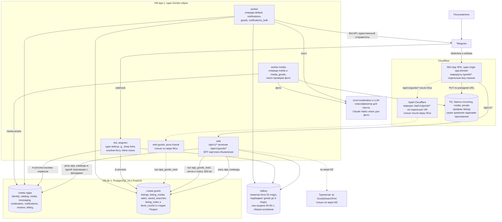
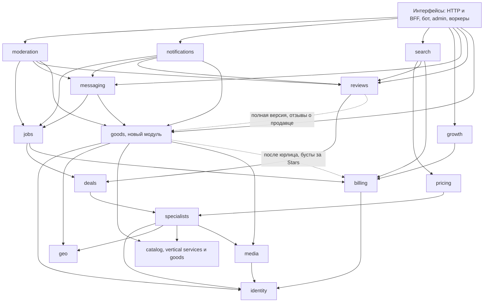
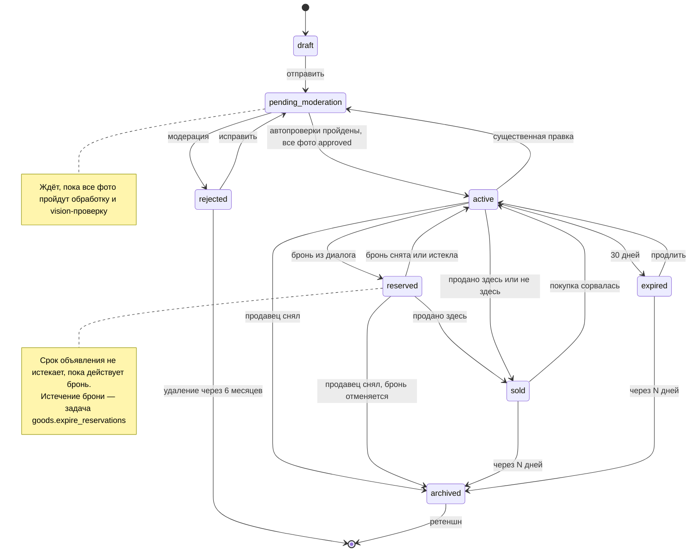
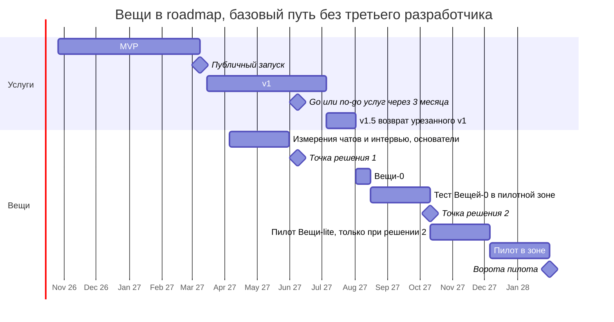

# 08. Маркетплейс вещей: рынок, спрос, право, архитектура

**Дата проверки фактов:** 2026-09-26. **Версия:** 1.1 от 2026-09-27: переработана по итогам ревью (фактчекинг, адвокат дьявола, архитектурный скептик, проверка полноты). Что изменилось — §1.4.
**Вопрос владельца.** Стоит ли добавить в Specialist отдельный раздел купли-продажи вещей: б/у и вообще предметов, C2C и, возможно, малый B2C. Может быть, архитектурно сделать его отдельным микросервисом. Мотивация: местный KupujemProdajem («купи-продаем») выглядит убого, а русскоязычные привыкли к удобному Авито.
**Контекст продукта.**
- Specialist — маркетплейс услуг и доска заявок для ≈ 80 тыс. русскоязычных релокантов в Сербии ([research/01](01-competitors-and-market.md)).
- Этап 1 — Telegram-бот и Mini App, этап 2 — App Store и Google Play.
- Backend — модульный монолит (schema-per-module, фасады, события через транзакционную постановку в Procrastinate, [ADR-0002](../adr/0002-modular-monolith.md)).
- MVP — анонимно, без юрлица и платежей ([ADR-0018](../adr/0018-mvp-scope-anonymous-no-payments.md)): 19 недель, бета 2027-01-25, запуск 2027-03-08.
- v1 — 16 недель, уже перегружен: ≈ 38 pw при ёмкости ≈ 32 ([ARCHITECTURE §20](../ARCHITECTURE.md#20-roadmap)).

> **Методика.** Отчёт сводит восемь параллельных потоков исследования:
> 1. рынок Сербии и KupujemProdajem;
> 2. спрос диаспоры, включая выборки по 1 000 сообщений из Telegram-барахолок;
> 3. право, мошенничество, доставка и оплата;
> 4. инвентаризация архитектуры: что переиспользуется;
> 5. монетизация и cold start;
> 6. UX-бенчмарк Авито, OLX, Vinted, Facebook Marketplace, KP и барахолок;
> 7. адвокат варианта «микросервис»;
> 8. адвокат варианта «модуль монолита».
>
> **Перекос методики и как он исправлен.** У вопроса «как делать» (микросервис или модуль) было два адвоката, а у вопроса «делать ли вообще» — ни одного. Рыночный поток, UX и монетизация по постановке строили вариант «да». В версии 1.1 это исправлено ревью адвоката дьявола: нулевой вариант, упущенная выгода и условия закрытия идеи собраны в §1.3 и §8.2.
>
> Квота веб-поиска в сессии закончилась, поэтому факты проверены прямым чтением первоисточников: страницы, прайс и REST API блога KP, медиакиты KP и Halo Oglasi, App Store (iTunes Lookup и RSS отзывов), Google Play, Similarweb, CompanyWall (данные APR), Wayback Machine, каталог stats.srb.guide, превью t.me, законы на paragraf.rs, прайсы курьеров, документация Telegram, Apple, Google, Cloudflare, PostgreSQL, Kamal, Procrastinate, import-linter.
>
> **Обозначения.** **[Допущение]** — наша оценка или расчёт без прямого источника. **[Не подтверждено]** — факт проверить не удалось. Курс для пересчёта: 1 € = 117,48 RSD, 1 USD = 103,28 RSD (NBS на 25.09.2026, [Kurir](https://biznis.kurir.rs/novcanik/10114631/kursna-lista-nbs-za-25-septembar-2026)). Трудоёмкость — в person-weeks (pw), ±25–30%. Где потоки расходились, в тексте стоит пометка **«Противоречие: … Решение: …»**.

## Содержание

1. [Резюме и вердикт](#1-резюме-и-вердикт)
2. [Рынок Сербии и KupujemProdajem](#2-рынок-сербии-и-kupujemprodajem)
3. [Спрос диаспоры и Telegram-барахолки](#3-спрос-диаспоры-и-telegram-барахолки)
4. [Право, мошенничество, доставка и оплата](#4-право-мошенничество-доставка-и-оплата)
5. [Монетизация и cold start](#5-монетизация-и-cold-start)
6. [Архитектура: модуль или микросервис](#6-архитектура-модуль-или-микросервис)
7. [UX-ориентиры и место в IA](#7-ux-ориентиры-и-место-в-ia)
8. [Влияние на roadmap и трудозатраты](#8-влияние-на-roadmap-и-трудозатраты)
9. [Риски](#9-риски)
10. [Открытые вопросы к владельцу](#10-открытые-вопросы-к-владельцу)
11. [Источники](#11-источники)

---

## 1. Резюме и вердикт

### 1.1 Коротко

1. **Конкурировать с KupujemProdajem за сербов нереально.**
   - На 26.09.2026 у KP 5 655 355 активных объявлений, 2 628 934 активных пользователя и 53 393 новых объявления за сутки ([главная KP](https://www.kupujemprodajem.com/)).
   - Это #5 сайт Сербии ([Similarweb](https://www.similarweb.com/website/kupujemprodajem.com/)), бренд знают 98,2% ([Media kit 2026](https://www.kupujemprodajem.com/kp-media-kit-2026-2.pdf)).
   - OLX ушёл из Сербии не позже 2017 года, Sasomange медиагруппы Mondo/Kurir с 1,2 млн объявлений закрылся ([Wayback](http://web.archive.org/web/20170424015147/http://olx.rs/), [Wayback](http://web.archive.org/web/20220531163039/https://sasomange.rs/)).
2. **KP неудобен для покупки на русском, но для продажи дорогих вещей он открыт.**
   - Интерфейс только сербский. Поиск «холодильник» даёт 0 результатов против 5 204 по «frižider» ([поиск KP](https://www.kupujemprodajem.com/pretraga?keywords=%D1%85%D0%BE%D0%BB%D0%BE%D0%B4%D0%B8%D0%BB%D1%8C%D0%BD%D0%B8%D0%BA)). KP сам советует не общаться с теми, кто пишет «на плохом сербском» ([KP](https://blog.kupujemprodajem.com/kako-da/kako-da-bezbedno-kupujete-i-prodajete-preko-kp/)).
   - Осевшая диаспора, вероятно, уже имеет сербские номера и счета, а с ними и бейджи KP **[Допущение]**. Дорогие вещи продавцы, скорее всего, будут дублировать на KP, и разделу останется дешёвый хвост с медианой ≈ 6 € (§2.5).
3. **Обмен вещами в Telegram-чатах большой, но измерено только предложение.**
   - Семь живых русскоязычных барахолок: ≈ 113 тыс. участий с пересечениями и ≈ 34,6 тыс. ID сообщений в неделю ([stats.srb.guide](https://stats.srb.guide/channels?topic=market)). Постов среди ID ≈ 11%, а в части чатов до половины постов — реклама услуг (§3.1).
   - Темп @NSbaraholka в ID сообщений в сутки: 442 (05.2023–01.2025) → 657 (01.2025–09.2026) → ≈ 1 044 (сентябрь 2026), хотя приток релокантов падает (§3.2). Рост постов, а не ID, ещё предстоит перемерить.
   - Какая доля постов продаётся и сколько покупателей на объявление, не измерено (§3.8).
4. **Спрос на структурированную замену чата не доказан.** SVALKA, Bazarbuys, барахолка Poisk.rs, SALEme, Ovdix, KupiProdaj.me пусты. У Poisk.rs есть своя сеть из ~24 чатов, то есть дистрибуция была, а детских вещей на сайте — 14 объявлений (§3.6). Шансы есть только у того, кто кормит чаты, а не заменяет их.
5. **Право.** C2C-доска вещей допустима в том же хостинг-режиме, что и доска услуг (ст. 18–20 ZET): без денег через платформу, без API курьеров, с закрытым списком категорий. Когда оператором станет DOO, продающее Pro и бусты услуг, раскрытия ст. 28 ZZP, вероятно, понадобятся и в бесплатном разделе вещей **[Допущение: к юристу]**. «Безопасная сделка» требует лицензии NBS или лицензированного партнёра, её нет даже у KP. Главная угроза — фишинг против продавцов вида «получите оплату по ссылке».
6. **Деньги и синергия.**
   - Прямая выручка базово ≈ €390 в месяц через год после включения монетизации **[Допущение, расчёт]**. Это меньше постоянных затрат на модерацию и поддержку (§5.7).
   - Кросс-продажа услуг — доли процента их спроса: ≈ 2–3 заявки в день при 4 000 объявлений в месяц против 200–500 заявок услуг в день через год (§5.4). Главный сценарий «уезжающий → уборка, вывоз, переезд» закрывается шаблоном заявки «Уезжаю» на стороне услуг, без раздела вещей.
7. **Архитектура.** Если раздел появится, правильная форма — модуль `goods` монолита, готовый к выделению, а не микросервис.
   - Микросервис добавляет ≈ 5,5–16 pw единовременно и 10–20% ёмкости команды постоянно.
   - Самые узкие общие ресурсы — бот, лимит рассылки, Main Mini App, вход и модераторы — он всё равно не разделяет.
   - Правок в ядре больше, чем казалось в версии 1.0: `messaging`, `identity.restrictions`, `catalog`, антиспам-лимиты ARCHITECTURE §13.3, медиа и ретеншн (§6.1, §6.7).
8. **Сроки.** Ни MVP, ни перегруженный v1 раздел не выдерживают.
   - В MVP — только шаблон заявки «Уезжаю» на стороне услуг и исследования силами основателей (§3.8).
   - Решение — не раньше 3-месячного go/no-go услуг (≈ 2027-06-08). Первый шаг — «Вещи-0» за ≈ 2–3 pw (§8.1).
   - Пилот «Вещи-lite» стоит ≈ 12–15 pw, а не 9–11, как в версии 1.0. Он возможен только по итогам «Вещей-0» и только на ёмкости, которую не отнимают у услуг, веба для сербов и этапа 2 (§8.2).

### 1.2 Вердикт

**Итог: отложить. Микросервис — нет. Раздел вещей — гипотеза для проверки, а не решение о разработке.** Проверять её дешёвым шагом «Вещи-0», который кормит чаты, а не конкурирует с ними, и только после того, как услуги прошли свои ворота. Если гипотеза подтвердится, раздел делается модулем `goods` монолита. Отдельный бизнес, конкурент KP для сербов и микросервис делать не стоит.

> **Почему вердикт изменился.** Версия 1.0 формулировала итог как «идея оправдана при условиях». Ревью показало, что это сильнее доказательств: ворота запуска пилота были мягче ворот открытия новой категории услуг, кросс-продажа по нашим же цифрам — доли процента, «спрос доказан» опирался на активность чатов, а не на спрос на структурированную замену, а цена упущенной выгоды не считалась. Рекомендация по архитектуре («модуль, а не микросервис») не изменилась.

| # | Решение | Почему | Условия |
|---|---|---|---|
| 1 | **Раздел «Вещи» сейчас не делать.** Гипотезу проверить после go/no-go услуг | Спрос на структурированную замену чата не доказан (§3.6). Прямая выручка меньше постоянных затрат (§5.7). Кросс-продажа — доли процента (§5.4). Два холодных старта одновременно угрожают воротам ликвидности услуг | Точка решения 1 ≈ 2027-06-08 (§8.3) |
| 2 | **Не делать** «Авито для всей Сербии», конкурента KP за сербов и отдельный бизнес | Сетевой эффект KP (5,66 млн объявлений, 98,2% узнаваемости), провал OLX и Sasomange. Выручка ниши — тысячи евро в год (§5.2) | Пересмотр только при отдельной стратегии и бюджете на сербский рынок |
| 3 | **Первый шаг — «Вещи-0»** (single-player): альбом боту превращается в карточку, продавец сам пересылает её в чаты через `shareMessage`. Плюс карточка распродажи «Уезжаю» с кнопками заявок на услуги. Без ленты, поиска и чата между незнакомцами | Кормит чаты, а не заменяет их (§3.6). Проверяет поведение за ≈ 2–3 pw. Не отнимает у админов закрепы | Условия точки решения 1 (§8.3). Условия закрытия идеи — §1.3 |
| 4 | **Пилот «Вещи-lite»** — только по итогам «Вещей-0» | ≈ 12–15 pw (§8.1). Конкурирует за ёмкость с урезанным v1, вебом для сербов и этапом 2 (§8.2) | Точка решения 2 (§8.3): тяга «Вещей-0», партнёр-админ, ёмкость вне очереди |
| 5 | **Позиционирование:** «барахолка в Telegram с поиском и бронью: ссылки запрещены, контакты скрыты до брони, предупреждения о мошенниках». Не «защита от мошенников» и не «маркетплейс с доставкой» | Эскроу и встроенная оплата невозможны без юрлица и лицензии NBS (§4.4). Отзывов, KYC и обязательного телефона в пилоте нет, поэтому обещать защиту нельзя: это ударит и по антискаму услуг | Баннер «мы не принимаем оплату и не организуем доставку» в карточке и чате |
| 6 | **Объём пилота — «Вещи C2C-lite»:** только частные лица, закрытый список 8–10 категорий, бесплатно, без платежей и API курьеров, с раскрытиями ст. 28 ZZP | Хостинг-режим ZET, запрет Telegram на «regulated or questionable goods» (5.2(h)) | Условия раздела — в ADR-0019 и в ADR, который заменит ADR-0018 после юрлица. Словарь запретов и антифишинговая политика — до запуска |
| 7 | **Архитектура — модуль `goods`, готовый к выделению**, не микросервис | Ни один триггер [ARCHITECTURE §5.6](../ARCHITECTURE.md#5-модульная-структура-backend) не сработал. Объёмы на 2–3 порядка ниже порогов. Одна транзакция на ключевых инвариантах. Микросервис стоит +5,5–16 pw и не разделяет бот и Mini App (§6.2–6.3) | ADR-0019 — короткий, статус Proposed/Deferred: «модуль, а не сервис» и триггеры §6.5, без DDL |
| 8 | **Монетизация** — позже и скромно: бусты и подписка магазинов за Stars | Базово ≈ €390 в месяц, после revenue share админам ≈ €270–310 (§5.2). Для Stars нужны юрлицо и `billing` из v1 | 4 недели подряд выполняются ворота «живого» раздела (§5.3) |
| 9 | **Где стартовать.** Зона вещей следует за зоной услуг, а не наоборот | В Нови-Саде один доминирующий чат @NSbaraholka (12,4 тыс. участников, ≥ 124 поста в сутки) — удобно для измерений, но это и единственная точка вето (§5.6) | Партнёрство по услугам с ключевым чатом зоны работает ≥ 8 недель |

**Что НЕ делать сейчас:**
- не проектировать экраны G01–G34: время дизайнера на вещи до go/no-go услуг — 0;
- не менять онбординг S02, Главную S03, «+», описание бота и одну фразу продукта;
- не вносить `goods` в ARCHITECTURE как модуль и не писать DDL в ADR;
- не показывать пункт «Продать вещи» в закрытой бете;
- не говорить с админами барахолок о вещах, пока партнёрство по услугам не проработает ≥ 8 недель.

**Что можно сейчас** (≤ 0,25 pw плюс время основателей):
- шаблон заявки «Уезжаю» на стороне услуг: уборка при выезде, вывоз, переезд. Он оправдан самими услугами;
- после решения владельца — зарезервировать префиксы deep link `g_…` в таблице [ADR-0011](../adr/0011-telegram-bot-integration.md) (§6.8);
- измерения чатов и 10–15 интервью с продавцами и покупателями (§3.8).

### 1.3 Самый сильный аргумент против и что его опровергло бы

**Аргумент против.** Раздел вещей стоит дороже, чем приносит, и почти не помогает главной метрике продукта.
- **Кросс-продажа мала.** При 4 000 объявлений в месяц — ≈ 2–3 заявки на услуги в день, это 0,4–1,5% от 200–500 заявок в день, которые услуги ждут через год. В пилоте на уровне ворот (≈ 750 объявлений в месяц) — ≈ 0,4–0,5 заявки в день, за 8 недель это даже не измерить (§5.4).
- **Дистрибуция не спасает.** Poisk.rs при своей сети ~24 чатов не получил вещей на сайт (§3.6).
- **Цена упущенной выгоды.** 12–15 pw пилота — это возврат урезанных фич v1 (7,5 pw) плюс почти весь веб для сербов (6 pw) (§8.2).
- **Постоянные затраты.** Модерация в окне 08:00–23:00, поддержка и время основателей стоят больше базовой выручки ≈ €390 в месяц (§5.7).
- **Риски для услуг.** Единственный бот, общий бренд и главный канал дистрибуции через админов (§9).

**Что опровергло бы аргумент.** Пороги — стартовые **[Допущение]**, их надо утвердить до начала измерений, а не после.

| Этап | Идея закрывается, если | Идея идёт дальше, если |
|---|---|---|
| Измерения чатов и интервью (§3.8), до «Вещей-0» | В чатах за 30 дней продаётся ≥ 50% постов (чат уже справляется). Меньше 4 из 10–15 собеседников называют поиск, статусы, мошенничество или «пост тонет» реальной болью | Боль названа большинством, продаваемость в чатах низкая, есть покупатели из других городов или сербы на крупное |
| «Вещи-0», 6–8 недель в пилотной зоне | Меньше 25 карточек в неделю. Меньше 30% продавцов создают вторую карточку за 30 дней. Админ ключевого чата запрещает карточки. Из «Уезжаю» меньше 10 заявок на услуги за весь срок. Opt-in бота или response rate услуг в зоне просели | Все пороги выполнены, есть партнёр-админ, есть ёмкость вне очереди (§8.2) |
| Пилот «Вещи-lite», 8 недель | Не пройдены ворота «живого раздела» или guardrails услуг (§5.3) | Ворота пройдены 4 недели подряд |

Если идея закрывается, мы теряем ≈ 0,25 pw на первом этапе и ≈ 2–3 pw на втором, а не 12–15.

### 1.4 Что изменилось в версии 1.1

- **Вердикт:** «оправдана при условиях» → «отложить, проверять гипотезу». Добавлены нулевой вариант, «Вещи-0» и условия закрытия идеи (§1.2–1.3, §8.2).
- **Ворота:** условия запуска выровнены с воротами «новая категория/зона» из PRODUCT.md и сдвинуты за 3-месячный go/no-go услуг. Порог мошенничества считается на 1 000 броней или продаж, как у услуг. Добавлены guardrails услуг и кросс-продажа как условие продолжения (§5.3, §8.3).
- **Оценки:** пилот ≈ 9–11 → ≈ 12–15 pw. Добавлены стоимость владения в € в месяц и экраны вещей в Expo (§5.7, §8.1).
- **Архитектура:** вывод «модуль» не изменился. Добавлены недостающие швы в ядре, модель данных без `point_exact`, скрытие поверх статуса, vision всех фото, раздельные триггеры дешёвых мер и выделения, жизненный цикл данных, модерация в масштабе (§6).
- **Новые разделы:** покупательский спрос (§3.8), география (§3.9), Черногория (§2.8), поддержка (§4.7), B2C (§4.8), метрики (§5.8), сторы, сербская аудитория, SEO, локализация и доступность (§7.4–7.7).
- **Исправлены факты:** правило origin Mini App, ToS 4.3 про согласие, Classiscam, KIRS, тарифы KP и Post Express, Авито в Википедии, штрафы ZET и ZZP, дата применения ZZP, ZZP ст. 24, ZDŽ ст. 59, HIG, пересчёт Stars, прецеденты микросервисов.

---

## 2. Рынок Сербии и KupujemProdajem

### 2.1 KP в цифрах

| Параметр | Значение | Источник |
|---|---|---|
| Активные объявления | 5 655 355: товары — 5 635 696, услуги — 19 146, вакансии — 513 | [Главная KP](https://www.kupujemprodajem.com/), 26.09.2026 |
| Активные пользователи и новые объявления | 2 628 934; 53 393 за вчера; витрин KP Izlog (B2C) — 496 | там же |
| Трафик | 14,8 млн визитов в 08.2026 (+3,96% м/м), #5 на странице сайта, #7 в рейтинге Top Websites Serbia. 7:16 мин и 21,2 страницы на визит, отказы 14,9%, прямой трафик 51,3%, Сербия — 92,7%, Россия — 0,51% | [Similarweb](https://www.similarweb.com/website/kupujemprodajem.com/), [Top websites](https://www.similarweb.com/top-websites/serbia/) |
| Бренд (Smart Plus Research, 12.2023) | Знают 98,2%, top-of-mind 64,9%. Покупали на KP 51% пользователей, продавали 78,4%. С мобильных — 71% | [Media kit 2026](https://www.kupujemprodajem.com/kp-media-kit-2026-2.pdf) |
| Владелец | Quable B.V. (Гаага). Сербскому KP Advertajzing d.o.o. на 100% владеет Quable, директор — сооснователь Ратомир Лекович. Данных о продаже KP нет | [KP: O nama](https://www.kupujemprodajem.com/o-nama), [CompanyWall/APR](https://www.companywall.rs/firma/kp-advertajzing/MMrpB53q) |
| Выручка сербского юрлица | 672,8 млн RSD (2023), 816,4 млн (2024), 1 037,7 млн (≈ 8,8 млн €, 2025); чистая прибыль 2025 года — 226,3 млн; 34 сотрудника. Это нижняя оценка: часть платежей может идти через Quable **[Допущение]** | [CompanyWall/APR](https://www.companywall.rs/firma/kp-advertajzing/MMrpB53q) |

> **Противоречие:** на странице «O nama» KP пишет о «6+ млн объявлений», а живой счётчик на главной показывает 5,66 млн. **Решение:** в расчётах используем живой счётчик на 26.09.2026. «6+ млн» — маркетинговое округление, на выводы не влияет.

### 2.2 Монетизация KP ужесточается

| Дата | Бесплатный лимит | Источник |
|---|---|---|
| 08.2024 | 20 новых объявлений в месяц | [Wayback](http://web.archive.org/web/20240803072458/https://kupujemprodajem.com/polisa-o-fer-koriscenju) |
| 01.2025 | 20 в месяц, появились группы с платной подачей | [Wayback](http://web.archive.org/web/20250127104350/https://kupujemprodajem.com/polisa-o-fer-koriscenju) |
| С 07.2026 | 10 бесплатных в месяц суммарно, повтор того же предмета не раньше чем через 15 дней | [Polisa o fer korišćenju](https://www.kupujemprodajem.com/polisa-o-fer-koriscenju), [KP FAQ](https://blog.kupujemprodajem.com/helpcentar/moji-oglasi/postavljanje-oglasa/koliko-oglasa-mogu-besplatno-da-postavim/) |

- **Платная подача** действует в 443 группах, в 66 из них бесплатной подачи нет вовсе ([PDF KP, 03.2026](https://blog.kupujemprodajem.com/wp-content/uploads/2026/03/Naplata-postavljanja-oglasa-KupujemProdajem.pdf)).
- **Под ударом как раз «переездные» категории.** Бесплатно в год можно подать: iPhone, Samsung, Xiaomi, ноутбуки, MacBook, iPad — 2 объявления; холодильники, стиральные машины, диваны, шкафы, кровати, коляски, электросамокаты — 3; телевизоры и тренажёры — 1.
- **Прайс продвижения** (от 07.08.2026, [cenovnik](https://www.kupujemprodajem.com/cenovnik)):

| Услуга | Срок | Цена, RSD |
|---|---|---|
| Obnova oglasa (поднятие) | разово | от 51 |
| Prioritetni + Pretraga | 3 дня | от 248 |
| Istaknut oglas (выделение) | срок объявления | от 256 |
| Na vrhu + Pretraga (верх выдачи) | 7 дней | от 563 |
| KP Obnavljač (автоподнятие, подача без платы) | 28 дней | от 1 835 ([KP](https://blog.kupujemprodajem.com/helpcentar/kp-prepaid-i-promocije/promocije/sta-je-kp-obnavljac-i-kako-se-aktivira/)) |
| KP Izlog (витрина продавца) | 3 / 6 / 12 мес. | 1 470 / 2 940 / 5 880 |

Платные объявления стоят выше и в группе, и в поиске по релевантности ([KP: rangiranje](https://blog.kupujemprodajem.com/helpcentar/pretraga-adresar-pracenje/sta-utice-na-rangiranje-oglasa-na-kupujemprodajem/)).

### 2.3 Доставка и оплата у KP

- **Эскроу и онлайн-оплаты товара нет.** KP «nema svoj sistem zakazivanja, preuzimanja ili otpremanja porudžbina», а «KP Isporuka» и «KP Dostava» — названия, которыми пользуются фишеры ([KP](https://blog.kupujemprodajem.com/bezbedna-kupoprodaja/kako-da-prepoznate-phishing-odnosno-pokusaj-krade-vasih-podataka/), [KP: nema sistem za plaćanje](https://blog.kupujemprodajem.com/bezbedna-kupoprodaja/da-li-kupujemprodajem-ima-svoj-sistem-za-placanje/)).
- **Заказ курьера — с 11.2024.** Только D Express, по льготным ценам 340–1 900 RSD (до 50 кг; одно место — до 20 кг, отправление из нескольких мест — до 300 кг). Наложенный платёж — 1,5%, минимум 180 RSD. Ответственность D Express — до 200 тыс. RSD ([блог KP](https://blog.kupujemprodajem.com/info/zakazivanje-kurira/), [правила](https://www.kupujemprodajem.com/zakazivanje-kurira-pravila-uslovi)).
- **Выкуп — только на текущий счёт.** «Od 14. marta, zbog izmene Zakona o poštanskim uslugama, kurirske službe više ne mogu da donose gotovinu na adresu»: продавец указывает номер текущего счёта, деньги приходят за 2–3 рабочих дня ([блог KP](https://blog.kupujemprodajem.com/info/zakazivanje-kurira/)). У релоканта без сербского счёта курьерского наложенного платежа нет (§4.4).
- **Трек-номер в чате** — кнопка «Pošalji broj pošiljke» ([KP](https://blog.kupujemprodajem.com/info/lakse-pracenje-posiljaka-kroz-kp-poruke/)). **Верифицированный отзыв** можно получить только при треке курьера со статусом «доставлено» ([KP](https://blog.kupujemprodajem.com/helpcentar/ocene-i-poruke/ocenjivanje/novo-oznaka-verifikovana-ocena/)).

### 2.4 «Убогий» ли KP

- **Средний рейтинг высокий:** iOS 4,86★ (12 362 оценки), Android 4,8★ (76,9 тыс. отзывов, 1M+ установок) ([App Store](https://apps.apple.com/rs/app/kupujemprodajem/id1400660034), [Google Play](https://play.google.com/store/apps/details?id=com.kupujemprodajem.android)).
- **Письменные отзывы злые.** С 01.2025 в сербском App Store 86 письменных отзывов со средней оценкой **1,7★** ([RSS отзывов](https://itunes.apple.com/rs/rss/customerreviews/id=1400660034/sortby=mostrecent/json)). Темы 71 негативного отзыва (один отзыв может попасть в несколько тем):
  - цены и платная подача — 52%;
  - баги и экран «Uskoro ćemo ponovo biti dostupni» — 35%;
  - блокировки, логин, VPN, вход из-за границы — 17%.
- **Функции у KP сильные:** сохранённые поиски с push раз в 8 часов, отзывы по переписке, верификация через банк, курьер с наложенным платежом ([KP Help](https://blog.kupujemprodajem.com/helpcentar/pretraga-adresar-pracenje/pretraga/kako-da-sacuvate-pretrage-na-kupujemprodajem/)).

> **Противоречие:** владелец считает KP «убогим». UX-поток и поток спроса пишут, что по функциям KP «не убогий», а рыночный поток находит средний балл 1,7★ в письменных отзывах. **Решение:** верно и то и другое. Массовый пользователь доволен (4,8★) и остаётся: сетевой эффект сильнее UX. Злятся активные продавцы, и главный раздражитель 2025–2026 годов — платная подача, а не дизайн. Для русскоязычных KP неудобен из-за языка и недоверия к иностранцам (§2.5), а не из-за функций. Значит, «сделать красивее KP» не аргумент ни для сербов, ни для наших пользователей. Аргумент — «на русском, внутри Telegram, среди своих».

### 2.5 Почему KP неудобен русскоязычным покупателям

| Барьер | Факт | Источник |
|---|---|---|
| Язык | Интерфейс только сербский (`lang="sr-RS"`, без hreflang) | [Главная KP](https://www.kupujemprodajem.com/) |
| Поиск по-русски | «холодильник» — 0, «frižider» — 5 204; «детская коляска» — 0, «kolica» — 7 352; «стиральная машина» — 0, «veš mašina» — 7 011. Сербскую кириллицу поиск транслитерирует, русскую лексику не понимает | [поиск](https://www.kupujemprodajem.com/pretraga?keywords=%D1%85%D0%BE%D0%BB%D0%BE%D0%B4%D0%B8%D0%BB%D1%8C%D0%BD%D0%B8%D0%BA), [поиск](https://www.kupujemprodajem.com/pretraga?keywords=fri%C5%BEider) |
| Недоверие к иностранцам | «Najbolje je da ne komunicirate sa licima koja … komuniciraju na engleskom jeziku ili lošem srpskom» | [KP: bezbedna kupoprodaja](https://blog.kupujemprodajem.com/kako-da/kako-da-bezbedno-kupujete-i-prodajete-preko-kp/) |
| Бейджи доверия | «Проверенный телефон» — только сербский мобильный номер. «Проверенный счёт» — аккаунту 6+ месяцев и пополнения больше 5 228 RSD за 3 месяца с одного сербского счёта | [KP: телефон](https://blog.kupujemprodajem.com/helpcentar/registracija-i-nalog/moj-nalog/verifikacija-broja-telefona/), [KP: счёт](https://blog.kupujemprodajem.com/info/novo-na-kp-verifikovani-bankovni-racun/) |
| Лимиты | Семья, которая уезжает и продаёт 15–30 предметов, упирается в 10 бесплатных в месяц и в платную подачу в «переездных» группах **[Допущение: объём распродажи]** | §2.2 |

**Чего мы не знаем.** Какая доля релокантов пользуется KP, не измерено. «Россия — 0,51%» у Similarweb — это визиты из России, а не русскоязычные в Сербии. Осевшая семейная диаспора (54 917 ВНЖ и 7 032 ПМЖ у граждан РФ на конец 2025 года, [KIRS 2025](http://kirs.gov.rs/media/uploads/Migracioni%20profil%202025%20_final.pdf)), вероятно, уже имеет сербские номера и счета **[Допущение]**, а значит, и доступ к бейджам KP. Поэтому формулировка осторожнее, чем в версии 1.0: **KP неудобен для покупки на русском, но для продажи дорогих вещей он открыт.** Продавцы техники и мебели (медиана ≈ 105 €, §3.3), скорее всего, будут дублировать объявления на KP ради 2,6 млн пользователей **[Допущение]**. Разделу останется дешёвый длинный хвост с медианой ≈ 6 €: самая низкая монетизация и самая высокая нагрузка модерации на каждый евро. Вопрос «Пользуетесь ли KP и для чего?» входит в интервью (§3.8).

### 2.6 Другие игроки и прецеденты

| Игрок | Статус | Источник |
|---|---|---|
| **Halo Oglasi** | 3,3 млн визитов в 08.2026 (#42). Сильна в недвижимости. В разделе Market 200 000+ товаров, это ≈ 3,5% от KP | [Similarweb](https://www.similarweb.com/website/halooglasi.com/), [медиакит](https://promo.halooglasi.com/cenovnik/ho_mediakit_2025.pdf) |
| **Polovni automobili** | Вертикаль авто (Inspira Grupa), 1,3+ млн объявлений, #11 | [PA](https://www.polovniautomobili.com/o-nama), [Similarweb](https://www.similarweb.com/website/polovniautomobili.com/) |
| **Limundo / Kupindo** | Аукционы и коллекционирование, #47. Условия «Kupindo zaštita» **[Не подтверждено: 403]** | [Similarweb](https://www.similarweb.com/website/limundo.com/), [Kupindo](https://www.kupindo.com) |
| **OLX (Naspers)** | В 08.2015 работал в Сербии, к 04.2017 olx.rs вёл на карьерный сайт OLX Group | [Wayback 2015](http://web.archive.org/web/20150812035852/http://www.olx.rs/), [Wayback 2017](http://web.archive.org/web/20170424015147/http://olx.rs/) |
| **Sasomange.rs** (Mondo/Kurir) | ≈ 1,2 млн объявлений и безлимитная бесплатная подача в 05.2022. Сейчас домен ведёт на biznis.kurir.rs | [Wayback 2022](http://web.archive.org/web/20220531163039/https://sasomange.rs/), [sasomange.rs](https://sasomange.rs/) |
| **Temu, AliExpress** | Temu — #19 сайт Сербии. Новые дешёвые вещи уходят к ним | [Similarweb Top](https://www.similarweb.com/top-websites/serbia/) |
| **Vinted** | В Сербии нет: в списке доменов есть HR, SI, RO, GR, HU, но не RS | [vinted.com](https://www.vinted.com/) |
| **Нишевые C2C 2026 года** | ZAGA (2 оценки), Moj Vinto (1 оценка) | [ZAGA](https://apps.apple.com/rs/app/zaga-kupi-i-prodaj/id6798286477), [Moj Vinto](https://apps.apple.com/rs/app/moj-vinto/id6797278475) |
| **Facebook Marketplace** | Масштаб в Сербии без входа в аккаунт не измерен | [Facebook Help](https://www.facebook.com/help/1889067784738765) |

> **Противоречие:** рыночный поток нашёл справку Marketplace на сербском, а UX-поток — что Сербия не вошла в расширение Marketplace на 17 стран Европы в 2017 году ([Meta, 2017](https://about.fb.com/news/2017/08/marketplace-is-expanding-to-europe/)). **Решение:** справка на сербском — это локализация языка, она не доказывает доступность в стране. Доступность Marketplace в Сербии сейчас — **[Не подтверждено]**, вопрос в §10, п. 17.

### 2.7 Сценарии входа на рынок

| Сценарий | Реалистичность | Почему |
|---|---|---|
| A. Горизонтальный классифайд «для всей Сербии» против KP | Очень низкая | Сетевой эффект, прецеденты OLX и Sasomange, команда 1–2 разработчика, нет маркетингового бюджета, Telegram у сербов только №8 среди мессенджеров ([research/01](01-competitors-and-market.md)) |
| B. Сербская вертикаль, например fashion C2C «как Vinted» | Низкая для нас | Нужны платёжный контур, эскроу, логистика и маркетинг на сербском. Это другой продукт, его уже пробуют ZAGA и Moj Vinto |
| **C. Раздел «Вещи» для русскоязычных внутри нашего Telegram-продукта** | **Низкая–средняя, не доказана** | Обмен вещами в чатах большой (§3). А вот спрос на структурированную замену чата не доказан: шесть структурированных альтернатив пусты (§3.6). Среди них Poisk.rs, у которого есть своя сеть из ~24 чатов ([PRODUCT.md](../PRODUCT.md)), то есть дистрибуция была, а вещей на сайте почти нет. Тезис версии 1.0 «провалились без дистрибуции, а у нас она будет» этим ослаблен. Проверять дешёвым шагом, который кормит чаты, а не заменяет их (§1.2, «Вещи-0») |
| D. Ничего не делать с вещами до этапа 2 | Высокая | Нулевой вариант. Вся ёмкость уходит в услуги, веб для сербов и нативные приложения. Упущенная выгода — только гипотетическая частота заходов (§5.4) |

### 2.8 Соседние рынки: Черногория

ARCHITECTURE называет другие страны релокации следующим шагом после Сербии ([ARCHITECTURE §20.4](../ARCHITECTURE.md#20-roadmap)). Для вещей это важно, потому что русскоязычная барахолка Черногории сопоставима по размеру с @NSbaraholka.

| Факт | Значение | Источник |
|---|---|---|
| Русскоязычная барахолка [@montenegro_market](https://t.me/montenegro_market) «Черногория маркет \| барахолка объявления» | 11 908 участников, 2 519 онлайн | Превью t.me, 26.09.2026 |
| Число граждан РФ, РБ и Украины с ВНЖ в Черногории | **[Не подтверждено]**: MUP CG и Monstat в этой сессии не проверены | — |
| Местные классифайды | **[Не подтверждено]** | — |
| Валюта | EUR, а не RSD. Между Сербией и Черногорией таможенная граница | **[Допущение: общеизвестно, к юристу]** |

**Архитектурные швы, если раздел когда-нибудь появится:**
- `country_code` в `geo`;
- валюта берётся из справочника страны, а не из константы `CHECK (currency = 'RSD')` в DDL (§6.7);
- список разрешённых категорий задаётся для каждой страны;
- межстрановая доставка запрещена.

**Вывод.** Черногорию нельзя рассматривать раньше, чем вещи пройдут проверку в Сербии. Вариант «Черногория раньше сербской аудитории» оценивать только после «Вещей-0» (§8). Вопрос в §10, п. 14.

---

## 3. Спрос диаспоры и Telegram-барахолки

### 3.1 Карта чатов (снимок 26.09.2026)

| Чат | Участники / онлайн | Сообщений в неделю, прирост участников | Правила и монетизация |
|---|---|---|---|
| [@serbska_baraholka](https://t.me/serbska_baraholka) «Сербская Барахолка» | 40,3 тыс. / ≈ 11,4 тыс. | 16 217, +786 в неделю ([srb.guide](https://stats.srb.guide/channels/serbska_baraholka)) | Форум с топиками. Город и цена обязательны, до 10 фото, повтор не чаще раза в 4 дня, перекупы и агентства запрещены. Закреп платный ([правила 09-20](https://telegra.ph/Pravila-chata-Serbskaya-baraholka-09-20)). Отзывы — в отдельном [@MyFeedBack_Serbia](https://t.me/MyFeedBack_Serbia) (599 участников) |
| [@NSbaraholka](https://t.me/NSbaraholka) «Б/У Барахолка Нови Сад» | 12 363 / 3 386 | 7 338, +202 | Только б/у в Нови-Саде, 2–3 фото, район самовывоза, проданное удалять. **Предоплата за бронь — бан** ([правила от 04.05.2023](https://t.me/NSbaraholka/27353); текущая редакция не проверена) |
| [@baraholkaserbija](https://t.me/baraholkaserbija) | 15 815 / 2 134 | 3 350, +103 | Сеть из 10 групп одного админа, реклама бесплатна только по понедельникам, абонемент |
| [@avito_serbia](https://t.me/avito_serbia) «Аналог Авито Сербия» | 12 641 / 1 958 | 2 787, +125 | Та же сеть |
| [@AdsSerbia](https://t.me/AdsSerbia) | 14 424 / 2 588 | 1 109, +7 | Связан с sale-me.com |
| [@belgrad_serbia](https://t.me/belgrad_serbia) | 12 685 / 3 573 | 2 760, +106 | Сеть «Эмигранты 360°» |
| [@serbiasell](https://t.me/serbiasell) | 4 838 / 1 348 | 1 027 | Услуги вынесены в отдельный чат |
| [@kids_goods_bg](https://t.me/kids_goods_bg) «Детская барахолка» | 1 989 / 617 | 500 (stale) | Детские вещи ушли в общие барахолки |

- **Итог.** Семь живых барахолок — ≈ 113 тыс. участников с сильными пересечениями и ≈ 34,6 тыс. ID сообщений в неделю. Чаты «Специалисты» ([@SpecialistsSerbia](https://stats.srb.guide/channels/SpecialistsSerbia), @serbiaspecialists, @specialistinovisada) вместе с «Работой на день» — ≈ 2,3 тыс. **Разница ~15× по ID, с поправкой на альбомы ≈ 6–10× по числу постов [Допущение].**
- **Поправка на услуги внутри барахолок.** Сравнение «×15» завышает разрыв. В @avito_serbia реклама услуг — ≈ 47% постов (§3.3), в @NSbaraholka — 3%, а «Сербская барахолка» указана в [PRODUCT.md](../PRODUCT.md) как площадка поиска услуг. Если вычесть долю услуг, разрыв по вещам ниже **[Допущение: точная поправка не посчитана]**.
- **Что считает `postsPerWeek`.** Это прирост ID сообщений, включая альбомы, ответы, удалённые и служебные сообщения. В выборке @NSbaraholka на 1 000 ID пришлось 112 постов, то есть постами были ≈ 11% ID. Для @NSbaraholka сверено вручную: ≈ 7,2 тыс. против 7,3 тыс. у srb.guide.
- **Малый B2C в каналах.** Рядом с барахолками работают каналы-магазины: [@dfprodaja](https://t.me/dfprodaja) «Техника из Европы» (3 746 подписчиков, в описании: «Не ведитесь на фейки, могут работать скамеры. Никогда не принимаем предоплату…»), [@serbiapc](https://t.me/serbiapc) «Техника на заказ в Сербию» (987 подписчиков). Это каналы, а не чаты, и к C2C-потоку они не относятся (§4.8).

> **Противоречие:** рыночный поток пишет «топ-6 чатов — 108 228 участий», поток спроса — «семь чатов — ≈ 113 тыс.». Размер «Сербской барахолки» в потоках — от 40 297 до 40 310, онлайн — от 11 364 до 11 406. **Решение:** это разные наборы (у спроса добавлен @serbiasell) и разные моменты снимка, а не расхождение фактов. В отчёте — «≈ 108–113 тыс. участий» и «40,3 тыс.». Участия не равны уникальным людям: есть пересечения, боты, сербы и люди вне Сербии **[Допущение]**.
>
> **Противоречие:** закреп в «Сербской барахолке» стоит 1 200 RSD / 10 € в день по правилам от 13.05.2026 ([telegra.ph](https://telegra.ph/Pravila-chata-Serbskaya-baraholka-05-13-3)) и 1 500 RSD / 15 € по правилам от 20.09.2026 ([telegra.ph](https://telegra.ph/Pravila-chata-Serbskaya-baraholka-09-20)). **Решение:** действует более свежая версия, 1 500 RSD / 15 € в день. Её и используем в расчётах §5.

### 3.2 Барахолки растут, хотя приток падает

| Чат | Темп, ID сообщений в сутки | Точки |
|---|---|---|
| @NSbaraholka | **442** (05.2023–01.2025) → **657** (01.2025–09.2026) → **≈ 1 044** (сентябрь 2026) | Средние между точками [27353](https://t.me/NSbaraholka/27353) (04.05.2023), [300004](https://t.me/NSbaraholka/300004) (10.01.2025) и [700000](https://t.me/NSbaraholka/700000) (11.09.2026). Сентябрь 2026 — 7 309 ID в неделю по [srb.guide](https://stats.srb.guide/channels?topic=market), то есть ≈ 1 044 в сутки |
| @serbska_baraholka | 268–341 (2023) → ≈ 2 317 (09.2026) | [20003](https://t.me/serbska_baraholka/20003), [50012](https://t.me/serbska_baraholka/50012), srb.guide |
| @avito_serbia | 152 → 306 → ≈ 400 | [30000](https://t.me/avito_serbia/30000), [90000](https://t.me/avito_serbia/90000), [200001](https://t.me/avito_serbia/200001) |

> **Ограничение метода.** Темп посчитан по ID сообщений, а не по постам. Постами в выборке @NSbaraholka оказались ≈ 11% ID (§3.1). Часть роста могут давать ответы, удалённые сообщения, служебные сообщения о входе (+202 участника в неделю) и антиспам-боты **[Допущение]**. Рост числа постов нужно перемерить одной методикой для 2023 и 2026 годов (§3.8).

При этом первичных ВНЖ у граждан РФ стало меньше: 24 068 в 2023 году ([KIRS «Migracioni profil 2023»](http://kirs.gov.rs/media/uploads/1Migracioni%20profil.pdf), по [research/01](01-competitors-and-market.md)) и 9 003 в 2025-м ([KIRS 2025](http://kirs.gov.rs/media/uploads/Migracioni%20profil%202025%20_final.pdf), табл. 6). Граждан РФ с постоянным проживанием (численность, а не выдача за год) на конец 2025 года — 7 032, или 35,9% из 19 612 постоянно проживающих иностранцев (KIRS 2025, табл. 14). Активность двигает осевшая семейная диаспора, а не волна приезжих **[Допущение: интерпретация]**.

### 3.3 Что продают

Выборки по 1 000 подряд идущих ID: @NSbaraholka — около 22 часов, @avito_serbia — около 48 часов. Альбомы склеены в посты, видны только неудалённые сообщения, поэтому это нижняя граница.

| Показатель | @NSbaraholka | @avito_serbia |
|---|---|---|
| Постов | 112 (≥ 124 в сутки), 81 автор | 272 (≈ 136 в сутки), 21% повторов и спама за 48 ч |
| Типы | продажа 79%, «куплю / ищу» 7%, «отдам даром» 6%, пристрой животных 4%, услуги 3% | реклама услуг ≈ 47%, вещи ≈ 30%, «даром» ≈ 6%, **обмен валют ≈ 6%** ([пример](https://t.me/avito_serbia/258507)) |
| Категории | **детское ≈ 33%**, одежда и обувь ≈ 20%, электроника ≈ 16%, мебель и дом ≈ 10% | электроника, одежда, мебель, авто, вещи из РФ |
| Лоты из нескольких вещей | 21% постов | 7 постов |
| Цена | **медиана 700 RSD (≈ 6 €)**, IQR 400–1 500. Техника и мебель — медиана ≈ 105 € | медиана 2 000 RSD (≈ 17 €) |
| Валюта | RSD — 75 постов, EUR — 13 | RSD — 50, EUR — 27 |
| Фото на пост | ≈ 2,6 | ≈ 2,1 |
| Явный мотив «переезд» | 1 из 112 ([пример](https://t.me/NSbaraholka/712613)) | ≈ 4 из ~100 ([шкаф IKEA](https://t.me/avito_serbia/258348)) |

**Портрет потока.** Много мелких вещей с низким чеком и самовывозом по району. Детское и одежда — больше половины потока. Доставка курьером встречается единично.

### 3.4 «Уезжают и распродают всё»: гипотеза подтверждается слабо

- **Отток растёт.** Из Сербии выехало 459 граждан РФ в 2022 году, 2 746 в 2023-м и 5 421 в 2024-м ([RZS](https://data.stat.gov.rs/Home/Result/1811010204?languageCode=sr-Latn)). Это ≈ 2,2–2,7 тыс. домохозяйств в год **[Допущение: 2–2,5 человека на домохозяйство]**.
- **Но в выборках явный мотив переезда только у 1–4% товарных постов.** По оценке, распродажи уезжающих — ≈ 2–10% потока **[Допущение]**. Основа — обычный оборот вещей в осевших семьях, прежде всего детских.

> **Противоречие:** рыночный поток и поток монетизации считают распродажу при переезде главным драйвером предложения: 15–30 предметов на семью, 11–21 объявление в день только в Белграде. Поток спроса по выборкам видит явный мотив «переезд» у 1–4% постов. **Решение:** базовым сценарием продукта считаем **регулярный оборот** («детская одежда по размеру рядом со мной»). Распродажа при отъезде — не источник объёма, а **высокоценный сценарий**: много крупных вещей сразу, и нужны вывоз, грузчики и уборка при сдаче квартиры. Поэтому режим «Уезжаю» — сценарий кросс-продаж и маркетинга, но не основа прогноза объёма. И даже кросс-продажу из него закрывает шаблон заявки на стороне услуг, без раздела вещей (§5.4). Расчёт 11–21 объявления в день из распродаж — верхняя граница: RZS, вероятно, занижает отток, а выборки не видят удалённых проданных постов.

### 3.5 Боли, которые адресует раздел

- **Пост тонет.** В Нови-Саде ≥ 124 поста в сутки, в «Сербской барахолке» по оценке 260–630 постов всех типов.
- **Нет поиска и фильтров.** Размер, район, цена и состояние пишутся свободным текстом.
- **Мошенничество и предоплата.** Бан за предоплату, отдельный чат отзывов, в каналах малого B2C предупреждения «могут работать скамеры».
- **Спам, дубли, перекупы.** 21% повторов за 48 часов в @avito_serbia, антиспам-боты.
- **Нет статусов.** «Бронь» и «продано» пишут текстом или удаляют пост ([пример](https://t.me/NSbaraholka/712031)).
- **Много ручной модерации у админов.**

**Правила чатов — готовое ТЗ для UX:** город, район, цена или «даром», фото, лоты, бронь и «продано», поднятие не чаще раза в 4–5 дней, запрет предоплаты, перекупов, лекарств, билетов и обмена валют, отдельные «куплю / ищу» и «отдам даром».

### 3.6 Структурированные альтернативы почти пусты

| Продукт | Модель | Состояние | Вывод |
|---|---|---|---|
| **SVALKA** ([svalka.trade](https://www.svalka.trade)) | Веб-классифайд RU/SR/EN, PRO за 5 $ в месяц, оплата USDT/ETH | Сам покупает рекламу в чатах: «Смотрите на пустые категории…» ([пост, 22.09.2026](https://t.me/avito_serbia/258412)) | Прямой конкурент по идее. Проблема — пустота |
| **Bazarbuys** ([@bazarbuys_bot](https://t.me/bazarbuys_bot)) | Бот «Все объявления Сербии в одном Telegram-боте» | В каталоге с 12.07.2026 ([srb.guide](https://stats.srb.guide/bots/bazarbuys_bot)), видимой тяги нет | Агрегатор над чатами |
| **Poisk.rs** ([барахолка](https://poisk.rs/market/)) | Сайт при своей сети из ~24 чатов ([PRODUCT.md](../PRODUCT.md)) | ≈ 1 470 объявлений во всех разделах, но детских — [14](https://poisk.rs/market/1/1/all/baby_products/), одежды — [20](https://poisk.rs/market/1/1/all/clothes/), для дома — [34](https://poisk.rs/market/1/1/all/for_home/). В электронике — [скам-лоты](https://poisk.rs/market/1/1/all/electronics/) | Даже своя сеть чатов не приводит вещи на сайт |
| **SALEme** ([sale-me.com](https://sale-me.com/)) | Международная доска | 12 871 объявление, из них «Личные вещи» — 144, «Детский мир» — 1, недвижимость — 4 963 | Для вещей не работает |
| **Ovdix** ([ovdix.com](https://ovdix.com/en)) | «Для экспатов и местных», автоперевод объявлений и чата | App Store с 07.2025, 1 оценка; Android — 50+ установок ([Google Play](https://play.google.com/store/apps/details?id=com.ovdix.app)) | Автоперевод сам по себе ликвидность не даёт |
| **KupiProdaj.me** ([kupiprodaj.me](https://kupiprodaj.me/)) | «Oglasi na Balkanu» | С 03.2026, 0 оценок, в основном недвижимость | — |

**Вывод.** Спрос из чата в отдельную витрину сам не переходит, и своя сеть чатов этого не меняет (Poisk.rs). Пользователи стягиваются в крупнейший общий чат, а не в специализированные площадки: @kids_goods_bg зачах, детские вещи ушли в общие барахолки (§3.1). При медиане ≈ 6 € и самовывозе пост в чат за 10 секунд — возможно, оптимальный UX, а форма объявления добавляет трение **[Допущение]**. Если шанс и есть, то у того, кто встроится в поток чатов, а не будет с ним конкурировать: публикация через бота, карточка для пересылки в чат, партнёрство с админом. Поэтому первым шагом предлагается «Вещи-0» без ленты (§1.2).

### 3.7 Объём рынка и реалистичная доля

- **Модель «сверху», от активности чатов:** Нови-Сад ≈ 2,5–5 тыс., Белград ≈ 2–6,5 тыс., **итого ≈ 4,5–11 тыс. уникальных объявлений о вещах в месяц** **[Допущение, расчёт]**.
- **Модель «снизу», от домохозяйств:** ≈ 3,2–9,9 тыс. в месяц. Порядок совпадает.

| Сценарий | Доля потока | Новых объявлений в месяц | Ориентир |
|---|---|---|---|
| Отдельная витрина без интеграции с чатами | 1–3% | ≈ 50–300 | Уровень Poisk.rs и SVALKA |
| Публикация через бота, карточки для чатов, сохранённые поиски | 10–20% | ≈ 500–2 000 | — |
| Официальный инструмент публикации в 1–2 крупных чатах (партнёрство с админом) | 30–50% | ≈ 1,5–5 тыс. | — |

Доли — экспертная оценка, бенчмарков для диаспорных Telegram-рынков нет **[Допущение]**.

> **Противоречие:** архитектурный поток для оценки нагрузки взял 300–1 000 новых объявлений в день через 12 месяцев, то есть 9–30 тыс. активных. Поток спроса оценивает **весь** поток вещей в чатах двух городов в 275–630 постов в день, а реалистичную долю платформы — в 500–2 000 объявлений в месяц. **Решение:** для продуктового планирования берём оценку спроса: **≈ 0,5–5 тыс. активных объявлений** в первый год. Цифры архитектурного потока оставляем как стресс-сценарий: они в 5–15 раз выше реалистичных, и даже при них PostgreSQL хватает с запасом (§6.7). Вывод «микросервис по нагрузке не нужен» от этого только усиливается.

### 3.8 Покупательский спрос и сезонность: что не измерено

Всё, что измерено в §3.1–3.7, — это **предложение**: посты продавцов. Покупательский спрос не измерен. Неизвестно, какая доля постов продаётся и за сколько дней и сколько покупателей приходится на одно объявление. Поэтому у ворот пилота (§5.3) нет базовой линии. Выборки сняты в двух чатах за 22–48 часов в конце сентября, в сезон «в школу», так что сезонность тоже не учтена. К тому же приток падает (§3.2), а отток растёт (§3.4): покупателей-релокантов для мебели и техники уезжающих может не хватить, и продавцы уйдут на KP (§2.5).

**Что измерить до решения о «Вещах-0»** (силами основателей, без разработки) **[Допущение: план]**:

| Измерение | Метод | Что даст |
|---|---|---|
| Базовая продаваемость | Панель из 200–300 постов в @NSbaraholka и «Сербской барахолке». Повторная проверка через 7, 14 и 30 дней: пост удалён, помечен «продано» или «бронь» | Доля «продано» в чатах — эталон для ворот §5.3 |
| Отклик | Доля постов с ответами в топиках форума «Сербской барахолки» | Аналог «сообщение покупателя за 72 ч» |
| «Куплю / ищу» | Соотношение к продажам по категориям | Где спрос больше предложения |
| Сезонность | Помесячный темп постов (не ID) методом §3.2: лето (отъезды) и сентябрь (детское) | Как сезон исказит 8-недельный пилот |
| Интервью | 10–15 продавцов и покупателей, **не админов**: где за год продавали и покупали крупное (KP или чат) и почему, пользуются ли KP и для чего, что мешает в чате | Есть ли боль, которую решает структурированный раздел |
| Кто покупает крупное у уезжающих | Вопрос в интервью и в панели (язык ответов) | Релоканты или сербы. Связано с вопросом о сербской аудитории (§7.5) |

Ворота §5.3 пересчитываются от этой базовой линии: ворота «живого раздела» должны быть не хуже чата по доле продаж за 30 дней, иначе раздел не даёт ценности сверх чата.

### 3.9 География: другие города и общенациональная лента

Около 14% притока граждан РФ живёт вне Белграда и Нови-Сада: Суботица — 2,9%, Панчево и Ниш — по 1,1%, прочие — около 9% ([research/01 §3.3](01-competitors-and-market.md)). В отличие от услуг, вещь можно отправить курьером, а крупнейшая барахолка общенациональная: в «Сербской барахолке» город в посте обязателен ([правила 09-20](https://telegra.ph/Pravila-chata-Serbskaya-baraholka-09-20)). Если пилот ограничить одним городом и ставить ворота на город, ликвидность может оказаться заниженной.

**Предложение [Допущение].** Две ленты: городская и общенациональная «могу отправить». Ворота считать отдельно для локальной и общенациональной ликвидности. Подачу из других городов в пилоте разрешать только с флагом «могу отправить». Долю постов с доставкой в общенациональных чатах измерить той же панелью (§3.8).

---

## 4. Право, мошенничество, доставка и оплата

### 4.1 Правовой режим

| Аспект | Доска услуг (MVP) | Вещи C2C | Вещи B2C (магазины, перекупщики) |
|---|---|---|---|
| Роль платформы | Хостинг (ZET ст. 18) | То же | То же, плюс «prenosilac oglasne poruke» по закону о рекламе |
| Отношения сторон | Договор услуги | Купля-продажа между физлицами: ZOO, ст. 454–457 и 478–482 ([KP о применимом праве](https://blog.kupujemprodajem.com/bezbedna-kupoprodaja/koji-su-relevantni-zakoni-za-sporove-koji-se-javljaju-u-kupoprodaji/)) | ZZP целиком: 14 дней на отказ, соответствие не меньше 1 года для б/у (ст. 59) |
| Раскрытия площадки, ZZP ст. 28 | Отложены до v1 | Вероятно, обязательны с первого дня пилота: к пилоту оператором будет DOO, которое продаёт Pro и бусты услуг, то есть trgovac, даже если раздел вещей бесплатен **[Допущение: к юристу]** | Обязательны |
| Идентификация продавца | Не нужна | Не нужна | Нужна «oglasna deklaracija», иначе площадка отвечает как рекламодатель (ст. 19–20 [Zakon o oglašavanju](https://www.paragraf.rs/propisi/zakon_o_oglasavanju.html)) |

- **ZET, хостинг и notice-and-takedown** ([ZET](https://www.paragraf.rs/propisi/zakon_o_elektronskoj_trgovini.html)):
  - освобождение от ответственности, если площадка «nije znao niti je mogao znati» и удалила контент «odmah nakon saznanja» (ст. 18);
  - общей обязанности мониторинга нет; по заявлению третьего лица или акту органа удалить **не позже 2 рабочих дней**; при обоснованном подозрении уведомить орган (ст. 20);
  - штрафы по ст. 22: для юрлица — 100 тыс. – 1,5 млн RSD, для предпринимателя — 10–300 тыс., для ответственного лица в юрлице — 10–150 тыс. Как отвечает незарегистрированное физлицо-оператор, закон прямо не говорит: вопрос юристу (§10, п. 19);
  - ст. 3 п. 2 требует регистрации для услуг «u komercijalne svrhe». Бесплатная доска без регистрации — серая зона **[Допущение]**, вопрос юристу.
- **ZZP 35/2026 распространяется и на C2C.** «Onlajn tržište» — сервис, где потребители (potrošači) заключают договоры «sa drugim trgovcima **ili potrošačima**» (ст. 5 п. 56). Ст. 28 обязывает площадку показать, является ли продавец trgovac (по его декларации), и предупредить, что к непрофессиональному продавцу ZZP не применяется. Только в ToS этого недостаточно. Штраф для юрлица — 200 тыс. RSD (ст. 210 п. 8), для других субъектов суммы другие ([ZZP](https://www.paragraf.rs/propisi/zakon-o-zastiti-potrosaca-2026.html)). Закон вступает в силу на 8-й день после публикации, а применяется через 3 месяца после этого (ст. 220, paragraf помечает «Primenjuje se odložno»), так что к запуску в 2027 году он уже будет действовать.
- **Кто trgovac: оператор, а не раздел.** Trgovac — лицо, которое действует «u okviru svoje poslovne delatnosti ili u druge komercijalne svrhe» (ст. 5 п. 2), а pružalac onlajn tržišta — «svaki trgovac», который предоставляет такую площадку (ст. 5 п. 56–57). Пилот вещей по любому сценарию §8 идёт после v1, а юрлицо — первый шаг v1 ([ARCHITECTURE §20.3](../ARCHITECTURE.md#20-roadmap)). Когда DOO продаёт Pro и бусты услуг, оно, вероятно, trgovac, и ст. 28 применяется к вещам с первого дня, даже если раздел бесплатен **[Допущение: к юристу, §10 п. 20]**. Тезис версии 1.0 «пока раздел бесплатен, ст. 28 не применяется» снят. Раскрытия по ст. 28 входят в объём пилота (§4.6). Это дёшево: статус `trader` / `non_trader` для услуг и так строится в v1.
- **Перекупщик без регистрации нарушает Zakon o trgovini.** Trgovina — закупка и продажа ради прибыли (ст. 10), торговать могут только юрлица и предприниматели (ст. 25). Физлицу грозит штраф 50–150 тыс. RSD и запрет деятельности на срок до 2 лет (ст. 69), инспекция изымает товар (ст. 50 п. 11). По ст. 3 п. 1a физлицо с «komercijalnim interesom» — trgovac ([ZT](https://www.paragraf.rs/propisi/zakon_o_trgovini.html)).
- **Налоги продавца.** Продажа личных б/у вещей не облагается налогом на прирост капитала: движимых вещей нет в закрытом перечне ст. 72 PDG ([PDG](https://www.paragraf.rs/propisi/zakon_o_porezu_na_dohodak_gradjana.html)). Систематическая перепродажа — предпринимательский доход «nezavisno od toga da li je ta delatnost registrovana» (ст. 32). Для б/у авто покупатель платит 2,5% ([ZPI](https://www.paragraf.rs/propisi/zakon_o_porezima_na_imovinu.html)).

### 4.2 Запрещённые товары: закрытый список разрешённых категорий

Правила Telegram строже закона: бот не должен «facilitate the sale of illegal, pirated, regulated or questionable goods» (5.2(h) [Bot Developer Terms](https://telegram.org/tos/bot-developers)). Значит, нужен **список разрешённых категорий**, а не только список запретов.

| Категория | Решение в пилоте | Условие | Основание |
|---|---|---|---|
| Электроника, мебель и дом, бытовая техника, детские товары, одежда и обувь (кроме белья), спорт, книги и учебники, хобби; тип сделки «отдам даром» | **Разрешено** | Закрытый список по структуре KP | Практика KP |
| Детские автокресла | **С условиями** | Фото маркировки ECE R44 или R129, отметка «не было ДТП», предупреждение в карточке **[Допущение: политика площадки]** | Дети ниже 135 см ездят только в «homologovanom bezbednosnom sedištu» (ст. 31 [ZBS](https://www.paragraf.rs/propisi/zakon_o_bezbednosti_saobracaja_na_putevima.html)) |
| Телефоны и планшеты | **С условиями** | Без блокировки iCloud или Google. Продавец подтверждает, что устройство его. Флаг модерации при «новый, без коробки и чека» и при пачке одинаковых устройств. Публичной базы для проверки IMEI мы не нашли **[Не подтверждено]** | Краденое — KZ ст. 221, практика KP |
| Оружие категорий A–D, включая ножи-оружие, баллончики и шокеры | **Запрещено** | — | [ZOM ст. 19](https://www.paragraf.rs/propisi/zakon_o_oruzju_i_municiji.html), Apple 1.1.3, Google Play Restricted Content |
| Лекарства, БАДы, ветпрепараты | **Запрещено** | — | [Zakon o lekovima ст. 134](https://www.paragraf.rs/propisi/zakon_o_lekovima_i_medicinskim_sredstvima.html) |
| Медизделия: молокоотсосы, термометры, ингаляторы, мониторы дыхания, тесты | **Запрещено** в пилоте, с примерами в правилах | Можно ли физлицу перепродать б/у медизделие — вопрос юристу (§10, п. 28) | Промет медизделий регулирует отдельный [Zakon o medicinskim sredstvima](https://www.paragraf.rs/propisi/zakon-o-medicinskim-sredstvima.html) (Sl. glasnik 105/2017), он заменил старый закон в части медизделий |
| Животные, включая пристрой | **Запрещено** | — | [ZDŽ ст. 59](https://www.paragraf.rs/propisi/zakon_o_dobrobiti_zivotinja.html): домашних животных продают только в зарегистрированных питомниках, а кроме собак и кошек — ещё в зоомагазинах |
| Табак, никотин в любой форме: вейпы, никотиновые подушечки, устройства нагревания табака | **Запрещено** | — | [Zakon o duvanu ст. 71 п. 5](https://www.paragraf.rs/propisi/zakon_o_duvanu.html) запрещает продажу «sredstvima komunikacije na daljinu». Apple 1.4.3, [Google Play](https://support.google.com/googleplay/android-developer/answer/9878810) прямо называет «nicotine pouches» |
| Алкоголь (весь, включая пиво, вино и домашнюю ракию), пиротехника | **Запрещено** | — | Политика площадки: закон онлайн-продажу не запрещает, но ZZP ст. 24 запрещает продажу лицам младше 18 лет, а возраст мы проверить не можем. Плюс Telegram 5.2(h) и сторы |
| SIM-карты, операторское оборудование, дроны | **Запрещено** **[Допущение: политика площадки]** | — | Идентификация абонентов, регистрация дронов — разбирать не стоит ради пилота |
| Домашняя еда, б/у косметика и бельё, краденое, контрафакт, билеты, цифровые аккаунты, криптовалюта, **обмен валют**, отмычки и слежка | **Запрещено** | — | Практика KP ([32 статьи](https://blog.kupujemprodajem.com/category/helpcentar/nedozvoljeno-oglasavanje/)), KZ ст. 221 |
| Санкционные товары и товары двойного назначения | **Запрещено** | Формулировку правил — с юристом (§10, п. 27) | — |
| Авто, запчасти, шины; недвижимость и аренда; услуги; вакансии | **Вне раздела** | Велосипеды и самокаты остаются в «Спорте» | Вертикали со своими лидерами и высоким риском мошенничества. Главный диаспорный кейс — машины на иностранных номерах без растаможки **[Допущение]**, это вопрос юристу (§10, п. 29). Аренда жилья — отдельная будущая вертикаль, не часть пилота. Услуги — на доске заявок |

**Фото.** Правило площадки: «только свои фото, без узнаваемых лиц, особенно детей». Детское — ≈ 33% потока в Нови-Саде (§3.3), и одежду часто снимают на ребёнке, а фото детей — фокус Poverenik ([research/05](05-legal-and-payments-serbia.md)). Туда же — документы, номера машин и виды из окна, по которым узнаётся адрес. Vision-проверка всех фото (§6.8) ищет людей и лица. Возраст модель надёжно не определит, поэтому в категории «Детское» фото с узнаваемым лицом возвращается продавцу на исправление или размывается **[Допущение: механика]**. Это отражается в реестре обработки (ROPA).

> **Противоречие:** UX-поток цитирует KP: «по закону новые вещи продают только юрлица» ([KP](https://blog.kupujemprodajem.com/helpcentar/moji-oglasi/postavljanje-oglasa/zasto-ne-mogu-da-postavim-oglas-kao-fizicko-lice/)). Правовой поток считает единичную новую личную вещь, например ненужный подарок, законной: это не торговля по ст. 10 ZT. **Решение:** в пилоте разрешаем состояние «новое» только для единичных личных вещей. Сигналы «novo, zapakovano, više komada», одинаковые новые товары и превышение лимита уходят в модерацию как флаг «похоже на перекупщика». Правило KP может быть строже закона. Окончательно — к юристу (§10, п. 21).
>
> **Противоречие:** пристрой животных — 4% постов барахолки Нови-Сада, и поток спроса предлагает отдельную категорию. Правовой поток запрещает продажу животных (ZDŽ ст. 59) и не рекомендует «отдам даром» в MVP. **Решение:** животных в пилоте нет совсем. Вопрос о бесплатном пристрое — к юристу.

### 4.3 Мошенничество

**Главная схема в Сербии — фишинг против продавца.** «Покупатель» пишет на плохом сербском с иностранного номера, затем присылает ссылку якобы от «Пост экспресс» или D Express: «деньги уже оплачены, введите номер карты и CVV, чтобы их получить». Об этом предупреждают:
- Пошта Сербии ([типичные мошенничества](https://www.posta.rs/cir/online-bezbednost/tipicne-onlajn-prevare.aspx), [13.07.2026](https://www.posta.rs/cir/info/vest-detaljnije.aspx?ID=22574));
- D Express ([16.03.2026](https://www.dexpress.rs/rs/aktuelnosti/248-upozorenje-na-prevaru), [02.07.2026](https://www.dexpress.rs/rs/aktuelnosti/256--upozorenje-pokusaj-zloupotrebe-imena-d-express-), [08.09.2026](https://www.dexpress.rs/rs/aktuelnosti/258-upozorenje-na-phishing-prevaru));
- KP (несуществующие «KP Isporuka» и «KP Dostava», [KP](https://blog.kupujemprodajem.com/bezbedna-kupoprodaja/kako-da-prepoznate-phishing-odnosno-pokusaj-krade-vasih-podataka/)).

Classiscam — scam-as-a-service через Telegram-ботов. По данным Group-IB на 08.2023, с H1 2020 по H1 2023 появилось 1 366 групп Classiscam. Из них 393 проанализированные группы атаковали пользователей в 79 странах и заработали ≈ $64,5 млн, средняя потеря — $353. Схема специально уводит разговор в мессенджеры, «to ensure that the phishing link will not be blocked» ([Group-IB](https://www.group-ib.com/blog/classiscam-2023/)). Данным три года, свежих цифр по Сербии нет **[Не подтверждено]**. Релоканты привыкли к «Авито Доставке», поэтому ссылка «оплатить через безопасную сделку» выглядит для них правдоподобно **[Допущение]**.

| Защита | Как | Когда | Основа |
|---|---|---|---|
| **Внешние ссылки в чатах по товарам запрещены всегда** | Маскируем любые URL, не только до договорённости | Пилот | Маскирование [ADR-0010](../adr/0010-messaging-hybrid-chat.md) |
| **Трек-номер как структурированное сообщение** | Продавец выбирает курьера и вводит номер, ссылку строит платформа, только на официальный домен (dexpress.rs, posta.rs, bexexpress.rs, aks.rs, cityexpress.rs) | Пилот | Новый тип сообщения, по образцу KP |
| Детектор доменов-двойников | Список официальных доменов, расстояние Левенштейна, IDN-гомоглифы | Пилот | LLM-классификатор и правила [ADR-0016](../adr/0016-trust-safety-and-reviews.md) |
| **Контекстное предупреждение продавцу** | Триггеры: CVV, kartica, «uplata je izvršena», «KP isporuka», «Post Express», «безопасная сделка», «Авито доставка», иностранные номера, WhatsApp и Viber | Пилот | Стоп-слова ADR-0016 |
| Постоянный баннер | «Мы не принимаем оплату и не организуем доставку. Ссылка на оплату — мошенничество» | Пилот | — |
| Фото | pHash-дубли между аккаунтами, vision-проверка всех фото, удаление EXIF | Пилот | pHash из [ADR-0007](../adr/0007-media-storage-and-processing.md), vision — §6.8 |
| OCR фото (телефоны, URL, водяные знаки на снимке) | Новая функция, в ADR-0007 и ADR-0016 её нет | Раздел | +0,25–0,5 pw (§8.1) |
| Лимиты для новых аккаунтов | Лимит объявлений в первые дни, бейдж «Телефон подтверждён» для дорогой электроники | Пилот | Уровни доверия ADR-0016 |
| Жалобы P1 и протокол для органов | SLA ≤ 2 ч, сохранение доказательств, уведомление органа по ст. 20 ZET | Пилот | ADR-0016 |
| Ценовые аномалии, «iPhone за полцены» | Отклонение от медианы категории → флаг | Раздел | — |
| Reverse image search | Google Web Detection, $3,50 за 1 000, первые 1 000 в месяц бесплатно ([Google](https://cloud.google.com/vision/pricing)); выборочно | Полная версия | — |

> **Противоречие:** по [ADR-0010](../adr/0010-messaging-hybrid-chat.md), а также в потоках монетизации и UX, ссылки и контакты скрыты **до договорённости** и открываются после неё. Правовой поток требует для товаров **запретить внешние ссылки всегда**. **Решение:** разделяем контакты и ссылки. Контакты (Telegram или телефон) открываются явным действием «Поделиться контактом» после брони за конкретным покупателем (§6.7). Внешние ссылки в чатах по товарам не открываются никогда. Для доставки есть структурированный трек-номер. Это расширение ADR-0010 для `kind='listing'`, услуги не затрагиваются.

### 4.4 Доставка и оплата

- **Наложенный платёж (otkupna pošiljka) законен без лицензии.** Курьер берёт деньги с получателя и переводит отправителю на счёт или почтовым переводом (ст. 39 [Zakon o poštanskim uslugama 19/2025](https://www.paragraf.rs/propisi/zakon-o-postanskim-uslugama.html)). Платформа денег не касается и остаётся техническим провайдером (ZPU ст. 3 п. 10, [ZPU](https://www.paragraf.rs/propisi/zakon_o_platnim_uslugama.html)).
- **Курьерский выкуп — только на текущий счёт.** С 14 марта курьеры не привозят наличные на адрес, выкуп перечисляется на текущий счёт продавца ([KP](https://blog.kupujemprodajem.com/info/zakazivanje-kurira/)). Альтернатива без счёта — Post Express с выплатой почтовым переводом (ZPoštU ст. 39 п. 3) **[проверить у Pošta]**.
- **Наложенный платёж защищает продавца, но не покупателя.** Вскрыть посылку до оплаты, по всей видимости, нельзя **[Допущение]**.
- **Тарифы, 09.2026:**

| Курьер | До 0,5 / 2 кг, RSD | Наложенный платёж | API | Источник |
|---|---|---|---|---|
| D Express | 450 / 600 | 1,5%, минимум 180 RSD | Закрыт авторизацией, по договору | [прайс](https://www.dexpress.rs/rs/cenovnik), [API](https://usersupport.dexpress.rs/ExternalApi/) |
| D Express через KP | 340 / 340 | 1,5%, минимум 180 RSD | Встроено в чат KP | [KP](https://blog.kupujemprodajem.com/info/zakazivanje-kurira/) |
| Post Express | 420 / 500 на адрес, 300 / 400 в отделение или паккомат. Отправления «в отделение» и «на паккомат» принимаются только на šalter, паккомат — до 15 кг | +67 RSD за otkupnu pošiljku плюс плата за перевод выкупа отправителю по прайсу платёжных услуг Pošta (сумма не уточнена) | Публичного нет | [прайс](http://www.postexpress.rs/struktura/lat/cenovnik/cenovnik-unutrasnji-saobracaj.asp) |
| BEX | **[Не подтверждено]**: таблица на JS | есть | Публичная документация, токен после договора | [API](https://bexexpress.rs/DevDocumentation) |
| AKS | 450 / 600 | с переводом на счёт 1,5%, минимум 202 RSD | Не найдено | [прайс](https://www.aks.rs/cenovnik/) |
| City Express | 510 / 715 | 216 RSD до 10 тыс., дальше 2,16% | Не найдено | [прайс](https://www.cityexpress.rs/cenovnik-domaci-transport) |

| Вариант «безопасности» | Лицензия | Когда |
|---|---|---|
| Наличные при встрече | Не нужна (ZPU ст. 3 п. 1) | Пилот |
| Курьер с наложенным платежом, который оформляет сам продавец | Не нужна | Пилот (памятка), полная версия — API курьера |
| Паккомат или отделение (Post Express, 300 RSD) | Не нужна | Пилот (памятка) |
| IPS QR для оплаты при встрече | Скорее не нужна (ст. 3 п. 10) **[Допущение: к юристу]** ([IPS NBS](https://ips.nbs.rs/ips-mesta-i-nacini-placanja/ips-elektronsko-i-mobilno-bankarstvo)) | Полная версия, при юрлице |
| Эскроу платформы | **Лицензия NBS** | Не планировать |
| PSP-партнёр со split | У партнёра, KYC продавцов-физлиц | Не раньше этапа 2 и только после юриста |

У KP эскроу нет, несмотря на масштаб. Это аргумент в пользу того, что «безопасная сделка» в Сербии упирается в регулирование и экономику, а не в UX **[вывод]**.

**Памятка продавцу-релоканту** (экран S47 «Как безопасно купить и продать», раздел вещей):
- встречайтесь лично и берите наличные — это самый простой способ;
- курьерский наложенный платёж с 14 марта приходит только на сербский текущий счёт. Счёта нет — используйте Post Express с выплатой почтовым переводом или встречу;
- никогда не переходите по ссылке «получить оплату» и не вводите данные карты: ни мы, ни KP, ни Pošta, ни D Express таких ссылок не присылают (§4.3);
- трек-номер отправляйте кнопкой «Трек-номер», а не ссылкой.

### 4.5 Что требует юрлица

| Шаг | Юрлицо | Почему |
|---|---|---|
| Бесплатная C2C-доска без платежей и API курьеров | Формально можно, как для услуг **[Допущение]** | Владелец лично отвечает за реакцию на жалобы и запросы органов (ZET ст. 20) |
| Бусты и платные размещения | **Да** | Выплаты Stars и IAP, ZZP ст. 28, ZET ст. 3 п. 2 |
| API курьеров и спецтарифы | **Да** | Токены и доступ выдают по договору |
| B2C-продавцы | **Да**, плюс сбор данных продавца | Закон о рекламе ст. 19–20, ZZP ст. 28 |
| «Безопасная сделка» | **Да**, плюс лицензия NBS или PSP | ZPU, [research/05](05-legal-and-payments-serbia.md) |

**Отличие от услуг.** Вещи повышают вероятность условия пересмотра ADR-0018 «первый серьёзный инцидент: мошенничество, требование органа». Жертвы теряют деньги, поэтому такой инцидент будет публичным, а без юрлица претензии адресованы владельцу лично **[Допущение]**.

### 4.6 Минимальный законный вариант: «Вещи C2C-lite»

1. **Кто продаёт.** Только частные лица и только свои вещи. Декларация «продаю личные вещи, не занимаюсь торговлей» — согласие с версией в `identity.consents`.
2. **Раскрытия ст. 28 ZZP — с первого дня пилота.** Пилот идёт после юрлица, а DOO, которое продаёт Pro и бусты услуг, вероятно, trgovac (§4.1). Поэтому в объём пилота входят статус продавца по его декларации, предупреждение «к частному продавцу закон о защите потребителей не применяется» в карточке и страница «Как мы сортируем» для ленты. Это дёшево: статус `trader` / `non_trader` для услуг и так строится в v1 ([ARCHITECTURE §20.3](../ARCHITECTURE.md#20-roadmap)).
3. **Что продают.** Закрытый список категорий (§4.2) и словарь запретов на ru, sr (обе письменности) и en в LLM-классификаторе.
4. **Лимиты.** Лимит активных объявлений (§5.5), флаг «похоже на перекупщика».
5. **Правила площадки:** «площадка объявлений, не сторона сделки, между физлицами действует ZOO», список запрещённых товаров, правило о фото (§4.2), «предпринимательская торговля запрещена до отдельного режима». По требованию Google Play правила принимаются до первой подачи (§7.4).
6. **Доверие.** Ссылки в чатах по товарам запрещены всегда, трек-номер структурированным сообщением, предупреждения о фишинге, баннер «у нас нет оплаты и доставки», pHash и vision-проверка всех фото, лимиты для новых аккаунтов. OCR фото (телефоны и URL на снимке) — функция новая, в ADR-0007 и ADR-0016 её нет. Она переносится в стадию «Раздел» или оценивается отдельно (§8.1).
7. **Логистика и деньги.** Встреча лично или курьер с наложенным платежом, который продавец оформляет сам. Адресов и денег платформа не хранит, эскроу нет.
8. **Жалобы.** Очередь P1 (≤ 2 ч), протокол уведомления органов по ст. 20 ZET, поддержка (§4.7).
9. **Где записать условия.** К пилоту ADR-0018 уже будет заменён: юрлицо — первый шаг v1, монетизация — условие пересмотра. Условия раздела вещей записываются в ADR-0019 и в ADR, который заменит ADR-0018, а не строкой в ADR-0018. Партнёрство с админом чата само входит в условия пересмотра ADR-0018 («партнёрства с каналами»).
10. **Позже, в полной версии:** бусты, API курьеров, IPS QR, отзывы «куплено у продавца», B2C с PIB/MB.

Трудоёмкость специфичной для вещей правовой и доверительной части — ≈ 1,5–2,5 pw сверх ядра объявлений **[Допущение]**.

### 4.7 Поддержка и инциденты

У вещей основная масса проблем случается вне платформы: покупатель не пришёл, вещь не та, наложенный платёж, фишинг. Пользователи всё равно придут в поддержку.

| Вопрос | Решение **[Допущение: объёмы и сроки]** |
|---|---|
| Объём | 5–15 обращений на 1 000 объявлений в месяц. Категории: «не пришёл», «не как на фото», «подозреваю мошенника», «моё фото в чужом объявлении», вопросы по наложенному платежу, апелляции |
| Политика | «Мы площадка объявлений, не сторона сделки и не арбитр». Мы помогаем санкциями, сохраняем доказательства и объясняем, куда обращаться |
| Шаблоны и языки | Ответы на ru и sr. SLA: жалобы P1 — ≤ 2 ч в окне 08:00–23:00 ([ARCHITECTURE §14.2](../ARCHITECTURE.md#142-очереди-и-sla)), прочие обращения — 24 ч |
| Жертвы мошенничества | Собрать доказательства (переписка, фото, профиль), применить санкции, внести в общий чёрный список с чатами-партнёрами, рекомендовать заявление в полицию (МУП, отдел по высокотехнологичной преступности **[Не подтверждено: канал обращения]**) |
| Запросы органов | Runbook: ст. 20 ZET (удаление в срок ≤ 2 рабочих дней, уведомление органа), legal hold на объявление, фото и переписку, запись в `platform.audit_log` |
| Бусты и Stars (полная версия) | Если объявление продано, истекло или снято модерацией во время буста: при продаже и истечении — перенос остатка на другое объявление, при снятии модерацией за нарушение — без возврата, при ошибке модерации — возврат через `refundStarPayment` и `/paysupport` ([ARCHITECTURE §15](../ARCHITECTURE.md#15-монетизация)) |

Время поддержки входит в стоимость владения (§5.7).

### 4.8 B2C: размер сегмента и требования

B2C отнесён к полной версии, но сегмент не измерен.

- **Что видно.** Рядом с барахолками работают каналы-магазины: [@dfprodaja](https://t.me/dfprodaja) «Техника из Европы» (3 746 подписчиков), [@serbiapc](https://t.me/serbiapc) «Техника на заказ в Сербию» (987 подписчиков) (§3.1). Секонд-хенды и handmade в каталоге srb.guide отдельно не посчитаны **[Не подтверждено]**.
- **Готовность платить неизвестна.** Прогноз §5.2 закладывает 5, 25 и 80 магазинов на подписке без источника **[Допущение]**. Подписка 25 магазинов по 500–1 000 Stars даёт ≈ €140–290 из базовых ≈ €390 в месяц, то есть без магазинов остаётся ≈ €100–250 **[Допущение, расчёт по курсу §5.2]**.
- **Требования:**
  - ZZP ст. 28 (статус trader в карточке) и закон о рекламе (oglasna deklaracija, ст. 19–20);
  - [Zakon o opštoj bezbednosti proizvoda](https://www.paragraf.rs/propisi/zakon_o_opstoj_bezbednosti_proizvoda.html) (Sl. glasnik 41/2009 и 77/2019): для производителя и дистрибьютора он действует и на б/у товар («bez obzira na to da li je nov, upotrebljavan ili prepravljen»);
  - верификация через APR (бейдж L4, [ARCHITECTURE §14.3](../ARCHITECTURE.md#143-верификация-и-бейджи)).
- **Частый диаспорный случай.** Релоканты-паушальщики (ИП в IT) продают товары под своим PIB с другим кодом деятельности **[Допущение]**. Допустимо ли это — вопрос бухгалтеру (§10, п. 30).
- **Что сделать до решения о B2C:** перечень магазинов из чатов и каналов с числом подписчиков, 5–10 интервью с владельцами, чувствительность прогноза §5.2 к числу магазинов.

---

## 5. Монетизация и cold start

### 5.1 Как зарабатывают классифайды

- **Деньги — в вертикалях, а не в б/у вещах.** У OLX за FY2026 выручка $992 млн, из них 71% — авто ($429 млн), недвижимость ($185 млн) и работа ($87 млн) ([Prosus FY2026](https://www.prosus.com/~/media/Files/P/prosus-corp-v2/results-reports-and-events-archive/annual-report/2026/fy2026-media-release.pdf)).
- **Базовая подача частным лицам бесплатна, но в пределах лимита.** С весны 2015 года Авито берёт плату за бизнес-объявления, а частным лицам оставил бесплатную подачу в части категорий ([Википедия](https://ru.wikipedia.org/wiki/Авито)). Leboncoin бесплатен для частных лиц ([Wikipedia](https://en.wikipedia.org/wiki/Leboncoin)). KP в 2025–2026 годах, наоборот, ужесточил лимиты и для частных лиц: 10 бесплатных в месяц и платная подача в 443 группах (§2.2).
- **Сбор с покупателя за защиту — самая доходная C2C-модель, но нам недоступна.** Vinted берёт с покупателя 5% + £0,70 ([Vinted UK](https://www.vinted.co.uk/how_it_works)): при GMV €10,8 млрд выручка €1,1 млрд ([Vinted 2025](https://company.vinted.com/newsroom/financial-results-2025)). Для этого нужны свои платежи и доставка.
- **Работающая схема на малом рынке:** «базовая подача бесплатна в пределах лимита, видимость и объём сверх лимита — за деньги» (KP, Авито, закрепы в барахолках).

### 5.2 SKU и прогноз выручки

Цифровые услуги внутри Telegram продаются только за Stars (6.2 [Bot Developer Terms](https://telegram.org/tos/bot-developers)), в iOS — через IAP: Apple 3.1.3(g) прямо называет «boosts» ([Apple](https://developer.apple.com/app-store/review/guidelines/)). Разработчик получает эквивалент $0,013 за Star (6.2.4 [Bot Developer Terms](https://telegram.org/tos/bot-developers)). Пользователь платит ≈ $0,99 за 50 Stars **[Допущение: цена в США, в сербском App Store проверить]** ([research/02](02-telegram-platform.md)). Отсюда 1 Star ≈ 2,045 RSD для покупателя и ≈ 1,343 RSD для нас (расчёт).

| SKU **[Допущение]** | Якорь KP | Stars | ≈ RSD для покупателя |
|---|---|---|---|
| Подъём сверх бесплатного (раз в 4 дня) | Obnova от 51 | 25 | ≈ 51 |
| Выделение на 7 дней | Istaknut от 256 | 100 | ≈ 205 |
| Топ в категории и городе на 7 дней | Na vrhu от 563 | 250 | ≈ 511 |
| Магазин на 30 дней (до 100 объявлений, автоподъём, бейдж) | Obnavljač 1 835 за 28 дней | 500–1 000 | ≈ 1 022–2 045 |

**Расхождение с ADR.** [ADR-0014](../adr/0014-monetization-and-billing.md) разрешает платные функции только профилям `pro`, а ADR-0016 и [ARCHITECTURE §14.3](../ARCHITECTURE.md#143-верификация-и-бейджи) требуют KYC для платных функций. Требовать KYC ради подъёма за 25 Stars бессмысленно. Если монетизация вещей когда-нибудь включится, ADR-0014 нужно дополнить: SKU `goods_*` доступны частным продавцам без KYC, KYC — только для магазинов, у вещей свои ворота монетизации (§5.3).

| Прогноз через 12 месяцев после включения монетизации **[Допущение]** | Консервативный | Базовый | Оптимистичный |
|---|---|---|---|
| Новых объявлений в месяц | 1 000 | 4 000 | 10 000 (нужны покупатели-сербы) |
| Доля с платным продвижением | 1,5% | 3% | 5% |
| Магазинов на подписке | 5 | 25 | 80 |
| **Итого, RSD в месяц** | ≈ 6 400 | **≈ 46 000** | ≈ 214 800 |
| **€ в месяц / в год** | ≈ 54 / 650 | **≈ 390 / 4 700** | ≈ 1 830 / 22 000 |
| **Минус revenue share админам 20–30%**, если вся выручка атрибутирована чатам, € в месяц | ≈ 38–43 | **≈ 270–310** | ≈ 1 280–1 460 |

- **Проверка здравым смыслом.** Закреп в «Сербской барахолке», проданный каждый день, даёт 1 500 × 30 = 45 000 RSD ≈ €383 в месяц. Базовый сценарий того же порядка. Для сравнения: 100 подписчиков Pro у услуг по 500 Stars дадут ≈ €571 в месяц ([ADR-0014](../adr/0014-monetization-and-billing.md)).
- **Дорогие лоты уходят на KP.** Продавцы техники и мебели, скорее всего, дублируют объявления на KP (§2.5). Бусты покупают как раз на дорогие вещи, поэтому реальная доля платных объявлений может оказаться ниже 3% **[Допущение]**.
- **Выручка меньше постоянных затрат.** Базовые ≈ €270–310 после revenue share не покрывают даже половину ставки модератора (§5.7).

> **Противоречие:** рыночный поток оценил экономику ниши в **10–60 тыс. € в год** (10–20 тыс. активных пользователей раздела × 1–3 €). Поток монетизации получил базово **≈ 4,7 тыс. € в год** (диапазон 0,65–22 тыс.). **Решение:** берём оценку потока монетизации. Она посчитана снизу, по SKU и чистой выручке со Stars. Оценка рыночного потока предполагает 10–20 тыс. активных пользователей одного раздела вещей, а это 33–130% от цели MAU всего продукта через год (15–30 тыс., [ARCHITECTURE §2.3](../ARCHITECTURE.md#2-контекст-и-ограничения)). 10–60 тыс. € — верхняя граница, достижимая только с сербскими покупателями. Оба потока сходятся в главном: **самостоятельным бизнесом раздел не станет**.

### 5.3 Cold start и ворота пилота

- **Почему старт проще, чем у услуг.** В C2C продавцы и покупатели — одни и те же люди, нужна одна сеть, а не две. Привычка уже сложилась в чатах.
- **Почему сложнее.** Каждая вещь уникальна, пустая лента проигрывает живому чату на 40 тыс. Поэтому раздел открывается как лента «что нового рядом», «отдам даром», «распродажи недели», а не как поиск. А первый шаг — «Вещи-0» вообще без ленты: он кормит чаты карточками, а не соревнуется с ними.

| Тактика | Эффект | Риск | Вердикт |
|---|---|---|---|
| **Режим «Уезжаю»:** пакет из 10–30 вещей, одна карточка «Распродажа: район, до даты», в одно касание — заявки на уборку, вывоз и переезд | 10–30 объявлений и 1–3 заявки на услуги с одного продавца | Низкий | Да, но это редкий сценарий (§5.4) |
| **«Отдам даром»** отдельной лентой | Быстрый отклик, образ сообщества; даже на KP 242 объявления «poklanjam» ([KP](https://www.kupujemprodajem.com/pokloni/pretraga?keywords=poklanjam)) | Сборщики-перекупщики | Да |
| **Импорт своих постов:** пользователь пересылает боту свой пост или альбом | Не нужно заново набирать объявление | Средний. ToS 4.3 разрешает данные, которые пользователь передал сам, только если мы ясно сообщили цель и получили «individual, explicit, active and revocable consent» ([Bot Developer Terms](https://telegram.org/tos/bot-developers)). Чужой пост с контактами или фото третьих лиц запрещает 5.2(i) | Да, при условиях: экран согласия и проверка авторства (§6.8) |
| Парсинг чатов | Быстрый объём | ToS 4.3 прямо запрещает «scraping public group or channel contents», плюс ZZPL и конфликт с админами | **Нет** |
| **Карточка объявления в чат** (`shareMessage`): продавец сам пересылает свою карточку | Трафик из чатов, формат совпадает с правилами чатов | Карточка с кнопкой бота может нарушать правила чата о рекламе. Кросспостинг от имени бота — только с согласия админа | Да, основа «Вещей-0» |
| **«Витрина чата»** для админа — лента объявлений его чата в Mini App ([NFX](https://www.nfx.com/post/19-marketplace-tactics-for-overcoming-the-chicken-or-egg-problem)) | Превращает конкурента в партнёра | +1–2 pw | В стадии «Раздел» |
| **Concierge на открытии** — помочь 10–20 уезжающим семьям выставить вещи; прямые продажи — главный ранний рычаг ([Lenny](https://www.lennysnewsletter.com/p/how-to-kickstart-and-scale-a-marketplace-911)) | Качественная стартовая лента | 20–40 ч основателей, которые нужны и услугам (§5.7) | Только на открытии пилота |
| Партнёрства: релокационные агентства, арендодатели, русскоязычные школы и садики | Сезонный приток | Низкий | Да |

> **Противоречие:** три потока предложили разные ворота пилота. Рыночный: 1 500 активных объявлений на два города, ≥ 40% получают сообщение за 72 ч, ≥ 20% продано за 30 дней, ≥ 15% продавцов воспользовались услугами. Монетизации: 800–1 500 активных, ≥ 25–50 новых в день, ≥ 40% с сообщением за 48 ч, ≥ 20% продано за 14 дней, жалоб на мошенничество < 0,5%. Спроса: ≥ 30–50 новых в день и ≥ 500–1 000 активных на город. **Решение:** единые ворота ниже, по пилотной зоне. Версия 1.0 брала порог мошенничества «< 0,5% объявлений», а это ≈ 25 жалоб на 1 000 продаж при доле «продано» 20%, в 5–12 раз мягче, чем у услуг (< 5 на 1 000 сделок в MVP и < 2 в v1, [PRODUCT.md](../PRODUCT.md#доверие-и-качество)). Теперь порог считается на 1 000 броней или продаж и не мягче v1 услуг. Все пороги — стартовые цели, а не бенчмарки **[Допущение]**.

| Метрика (пилотная зона, 8 недель) | Открыть ленту всем | Ворота «живой раздел»: последние 4 недели подряд |
|---|---|---|
| Активных объявлений | ≥ 300–500 (concierge и участники «Вещей-0») | **≥ 800** |
| Новых объявлений в день | — | **≥ 25** |
| Объявлений с сообщением покупателя за 72 ч | — | **≥ 40%** и не ниже доли постов с откликом в чатах (§3.8) |
| Медиана времени до первого сообщения | — | ≤ 12 ч |
| Отмечено «продано» за 30 дней | — | **≥ 20%** и не ниже продаваемости в чатах (§3.8) |
| Мошенничество | — | **< 2 подтверждённых жалобы на 1 000 броней или продаж**, как цель v1 услуг |
| Кросс-продажа: пользователи вещей, создавшие заявку на услугу | — | **≥ 5% — условие продолжения** |
| Guardrails услуг в зоне | — | Response rate@4h ≥ 70%, opt-in уведомлений ≥ 70%, доля заблокировавших бота — не выше базовой линии услуг (§5.8) |

**Как мерить мошенничество, а не только жалобы.** После брони контакты открываются, и схема Classiscam уходит в личные сообщения, где мы её не видим. Поэтому кроме жалоб считаем:
- выборочный опрос после «продано»: «Всё прошло нормально?» у покупателя и продавца;
- долю банов за фишинг и обращений в поддержку по мошенничеству (§4.7).

**Стоп-кран.** Резкий рост фишинга (например, втрое выше недельной базовой линии **[Допущение]**) автоматически включает `goods.read_only`: подача и новые диалоги по вещам закрываются до разбора.

**Если ворота не пройдены — план выключения:**
1. Уведомить продавцов за 14 дней **[Допущение: срок]**.
2. Дать выгрузить или удалить объявления и фото.
3. Перевести ссылки `g_…` и `/g/<id>` на страницу-заглушку «раздел закрыт».
4. Удалить данные по матрице ретеншна (§6.7) с учётом legal hold.
5. Вернуться к «Вещам-0» с чатами-партнёрами или выключить флагом `goods.enabled`.

> **Противоречие:** рыночный поток ставит в ворота «≥ 15% продавцов воспользовались услугами». Поток монетизации оценивает кросс-продажу в ≈ 65–80 заявок в месяц при 4 000 объявлений, то есть ≈ 2–3 в день и примерно 3–4% продавцов **[Допущение, расчёт]**. **Решение:** 15% — нереалистичная планка. Но и «сигнал без ворот», как в версии 1.0, слишком мягко: синергия с услугами — главное обоснование раздела. Поэтому ≥ 5% пользователей вещей с заявкой на услугу — условие продолжения, а не просто сигнал.

### 5.4 Синергия с услугами и влияние на их ликвидность

| Событие в разделе вещей | Какая услуга нужна | Механика |
|---|---|---|
| Купил шкаф, диван, кровать | Грузчики, сборка мебели | После брони — «Нужна доставка или сборка?» создаёт заявку с категорией и районом (`j_`) |
| Купил стиральную машину или плиту | Грузчики, подключение (concierge) | То же |
| Уезжаю | Распродажа, уборка при выезде, вывоз, переезд, мелкий ремонт | Шаблон «Уезжаю» на стороне услуг работает и без раздела вещей |
| Приехал | Мастер на час, уборка | Подборка «для новой квартиры» |
| «Куплю / ищу» (7% постов НС) | — | По механике это та же доска заявок с откликами. В пилот не входит, вопрос в §10, п. 8 |

**Честные цифры кросс-продажи** **[Допущение, расчёт]**:
- **Базовый сценарий** (4 000 объявлений в месяц через год после монетизации) — ≈ 65–80 заявок в месяц, ≈ 2–3 в день. Это 0,4–1,5% от 200–500 заявок в день, которые услуги ждут через год (§6.8).
- **Пилот на уровне ворот** (≥ 25 объявлений в день ≈ 750 в месяц) — ≈ 12–15 заявок в месяц, ≈ 0,4–0,5 в день. За 8 недель это на грани измеримости.
- **«Уезжаю».** 5 421 выехавший гражданин РФ в 2024 году — ≈ 2,2–2,7 тыс. домохозяйств в год, ≈ 180–225 в месяц по стране (§3.4). Если на Нови-Сад приходится ≈ 23% **[Допущение: доля по притоку, PRODUCT.md]**, это ≈ 40–50 домохозяйств в месяц. При adoption 10–20% **[Допущение]** — 4–10 домохозяйств и 4–30 заявок на услуги в месяц.
- **Явный мотив переезда** есть лишь у 1–4% постов (§3.4).

**Вывод.** Кросс-продажа — доли процента спроса на услуги. Сценарий «Уезжаю → услуги» закрывается шаблоном заявки на стороне услуг, и раздел вещей для этого не нужен.

- **Гипотеза частоты.** Вещи смотрят часто, услуги заказывают редко, поэтому раздел мог бы поднять частоту заходов и opt-in бота. Авито Услуги живут на трафике классифайда: 38% исполнителей называют Авито главным источником клиентов ([research/01](01-competitors-and-market.md)). Но у нас эта гипотеза не подкреплена ни одной цифрой. Если настоящий мотив раздела — частота, удержание или бренд, это надо назвать прямо и мерить: DAU/MAU и D30 пользователей услуг, которые пользуются вещами, против тех, кто не пользуется (§5.8).
- **Минус.** Специалистов раздел не добавляет, а время основателей отнимает у ручного онбординга. До ворот ликвидности услуг он даёт больше риска, чем пользы.

### 5.5 Бесплатные лимиты

> **Противоречие:** рыночный поток предлагает «бесплатную безлимитную подачу», поток монетизации — 15 активных объявлений, правовой — лимит 20–30 активных. **Решение:** месячного лимита на подачу, как у KP, нет. Есть лимит **одновременно активных** объявлений: 20 для частного лица с подтверждённым телефоном, ниже для `trust_level 0` **[Допущение: пороги]**. Лот из нескольких вещей — одно объявление. «Отдам даром» в лимит не входит. Режим «Уезжаю» поднимает лимит до 30 на 30 дней. Бесплатный подъём — раз в 4 дня, как в чатах. Лимит одновременно защищает от перекупщиков и помещает распродажу при отъезде (15–30 вещей).

Антиспам-лимиты [ARCHITECTURE §13.3](../ARCHITECTURE.md#133-rate-limiting) рассчитаны на услуги и ломают сценарии вещей, их нужно дополнить (§6.1).

### 5.6 Конфликт с админами барахолок

- **Риск уже в реестре:** [ARCHITECTURE §19.1](../ARCHITECTURE.md#19-риски-и-открытые-вопросы) оценивает конфликт с админами для услуг как «средняя вероятность / высокое влияние».
- **С вещами он растёт до «высокая / критическое»** (§9). Доска услуг конкурирует с одним топиком «Услуги», а раздел вещей — со всем продуктом чата: закрепами по 15 € в день и абонементами. «Сербская барахолка» одновременно канал услуг ([PRODUCT.md](../PRODUCT.md)) и главный соперник вещей.
- **Худший сценарий.** Админ «Сербской барахолки» банит ссылки нашего бота, и мы теряем канал и для услуг.
- **Нови-Сад — единственная точка вето.** Его рекомендуют за один доминирующий чат, но это же значит, что один админ может закрыть канал. Возможна и связь WOM с админами чатов **[Не подтверждено, PRODUCT.md]**.
- **Revenue share — слабый стимул.** 20–30% даже со всей базовой выручки раздела — ≈ €80–120 в месяц на все атрибутированные чаты, и только после монетизации. Один ежедневный закреп в «Сербской барахолке» даёт админу ≈ €383 в месяц (§5.2). Альтернативы: фиксированная плата за «витрину чата» или бесплатный Pro **[Допущение]**.
- **Смягчение:**
  - о вещах с админами не говорим, пока партнёрство по услугам не проработает ≥ 8 недель;
  - первый шаг кормит чаты, а не заменяет их: карточки «Вещей-0» публикуются в чатах по их правилам;
  - закрепы не трогаем, это их продукт;
  - общий чёрный список мошенников;
  - зона вещей следует за зоной услуг, а не выбирается под вещи.

### 5.7 Стоимость владения

**Трудоёмкость на 12–18 месяцев, если пройти все стадии** **[Допущение]**:

| Статья | pw | Комментарий |
|---|---|---|
| «Вещи-0» и итерации | ≈ 2,5–3,5 | §8.1 |
| Пилот «Вещи-lite» с итерациями во время 8 недель пилота | ≈ 13–17 | 12–15 pw плюс 1–2 pw на правки по ходу пилота, когда команда уже на этапе 2 |
| Стадия «Раздел» и монетизация | ≈ 6–7,5 | §8.1 |
| Экраны вещей в Expo-приложении этапа 2 | ≈ 5–9 | 25–35% к мобильной оценке 20–25 pw ([ARCHITECTURE §20.4](../ARCHITECTURE.md#20-roadmap)) **[Допущение: доля экранов]** |
| Постоянная поддержка модуля | ≈ 0,5–1 за квартал | Антифрод, словарь брендов и запретов, правки модерации, P1 вечером и в выходные |
| **Итого** | **≈ 30–40** | Для сравнения, версия 1.0 называла 9–11 pw пилота |

Если всё это делает та же команда из двух разработчиков, этап 2 сдвигается не на 5 недель, как писала версия 1.0, а на ≈ 12–16 недель (узкое место — backend: «Вещи-0», пилот с итерациями, «Раздел», монетизация), и ещё растёт сам этап 2 на экраны вещей. Отсрочка этапа 2 откладывает и смягчение риска «зависимость от Telegram» («высокая / высокое», [ARCHITECTURE §19.1](../ARCHITECTURE.md#19-риски-и-открытые-вопросы)).

**Деньги, € в месяц.** Курс отчёта: 1 USD ≈ €0,88. Ставка модератора — медианная нетто-зарплата 95 036 RSD ≈ €809 за полную ставку ([RZS, июль 2026](https://www.stat.gov.rs/sr-latn/oblasti/trziste-rada/zarade/)) **[Допущение: ставка]**. Работодатель платит сверху налоги и взносы: средняя bruto 167 402 RSD против нетто 121 346, то есть ≈ +38%. Полная стоимость ставки — ≈ €1 115.

| Статья **[Допущение, расчёт]** | «Вещи-0» | Пилот (15–50 объявлений в день) | «Раздел» (50–170 в день) | Стресс (300–1 000 в день) |
|---|---|---|---|---|
| R2 | ≈ 0 (10 GB бесплатно) | ≈ 0–2 | ≈ 1–3 | ≈ 1–27 |
| Vision всех фото (≈ $0,002 за фото, 5 фото) | ≈ 1–2 | ≈ 4–13 | ≈ 13–45 | ≈ 80–265 |
| Web Detection, `db-1` | 0 | 0 | 0 (в пределах бесплатной 1 000) | +€7,50 за CX43 и Web Detection сверх 1 000 |
| Модерация | Основатели, минуты в день | Основатели, ≈ 0,2–0,7 ч в день, но дежурство в окне 08:00–23:00 | 0,25–0,5 ставки ≈ €280–560 | 0,5–2 ставки ≈ €560–2 230 |
| Поддержка | Основатели | 1–4 ч в месяц | 2–13 ч в месяц | 0,25 ставки ≈ €280 |
| Время основателей | Интервью и панель: ≈ 20–25 ч разово | Concierge 20–40 ч разово, переговоры с админами 5–10 ч в месяц | 5–10 ч в месяц | — |
| Юрист | — | 5–10 часов консультации по §10 разово, ставка **[Не подтверждено]** | — | — |
| Revenue share админам | — | — | ≈ €80–120 после монетизации | ≈ €370–550 |
| Маркетинг (ориентир — закреп в «Сербской барахолке» ≈ €12,8 в день) | 0 | ≈ €100 (8 закрепов за пилот) | по результатам | — |
| **Деньги, € в месяц** | **≈ 1–2** | **≈ 5–15** плюс ≈ €100 на закрепы за весь пилот и ≈ 30–60 ч основателей | **≈ 375–730** | **≈ 1 300–3 400** |
| Выручка раздела, € в месяц (§5.2) | 0 | 0 | ≈ 270–310 после revenue share, только после монетизации | ≈ 1 280–1 460 (нужны сербы) |

- **Точка безубыточности.** Стадии «Раздел» нужно ≈ €375–730 в месяц, базовая выручка — ≈ €270–310. Раздел окупает себя только ближе к оптимистичному сценарию, а он требует сербских покупателей (§7.5).
- **Денежной ценности у кросс-продажи напрямую нет.** Услуги не берут комиссию и плату за отклик. Косвенная ценность — +0,4–1,5% спроса услуг (§5.4).
- **Третий разработчик.** Стоимость — по рынку, ставки IT в Сербии в этой сессии не проверялись **[Не подтверждено]**. По [ARCHITECTURE §20.3](../ARCHITECTURE.md#20-roadmap) он и так нужен, чтобы закрыть дефицит v1 (§8.2).

### 5.8 Метрики раздела

- **North Star раздела** — число покупок за неделю по паре «город × категория», подтверждённых обеими сторонами: продавец отметил «продано здесь», покупатель подтвердил. Это аналог `deals.completed` у услуг **[Допущение: выбор метрики]**.
- **Как фиксируется «продано».** Самоотчёт продавца в G14: «продано здесь» с выбором покупателя из диалогов или «продано не здесь». Подтверждение покупателя — по уведомлению. «Продано не здесь» тоже считается, но отдельно.
- **Ликвидность:**
  - доля объявлений с диалогом за 24 и 72 ч, медиана времени до первого сообщения;
  - доля проданных за 14 и 30 дней, «продано здесь» против «продано не здесь»;
  - повторные продавцы за 60 дней;
  - соотношение покупателей и продавцов.
- **Guardrails услуг** — считаются в той же зоне и неделе:
  - response rate@4h;
  - доля пользователей, заблокировавших бота или отключивших уведомления за неделю. Блокировки видны по апдейту `my_chat_member` в личном чате ([Bot API](https://core.telegram.org/bots/api));
  - лаг очереди `notifications`;
  - доля жалоб P1.
- **Инкрементальность.** Честный holdout (когорта или город без раздела) при сотнях пользователей пилота статистически слаб **[Допущение]**. Поэтому в пилоте — сравнение «до и после» в зоне и когорт «пользуются вещами / не пользуются» с оговоркой о самоотборе. Holdout по флагу `goods.enabled` — когда в зоне будет ≥ 5 тыс. MAU **[Допущение: порог]**. Сравниваем частоту сессий, удержание D30 и конверсию в заявку на услугу.
- **Размывание продукта.** Доля новых пользователей, которые пришли через вещи и ни разу не открыли услуги (§9).
- **Атрибуция** `_r<code>` по чатам-партнёрам.
- **Таксономия событий PostHog** ([ARCHITECTURE §16.5](../ARCHITECTURE.md#165-наблюдаемость)): `goods_card_created` и `goods_card_shared` («Вещи-0»), `goods_listing_created`, `goods_listing_published`, `goods_listing_viewed`, `goods_chat_started`, `goods_reserved`, `goods_sold{where}`, `goods_sale_confirmed`, `goods_saved_search_*`, `goods_to_job_created`.

---

## 6. Архитектура: модуль или микросервис

### 6.1 Что переиспользуется

Все потоки согласны: раздел ложится на текущую платформу без новых внешних сервисов. Но «работает как есть» — слишком сильная формулировка версии 1.0. Архитектурный скептик сверил её с DDL и ADR и нашёл заметно больше правок в существующих модулях. Большинство из них — новые значения CHECK-перечислений, колонки, частичные индексы и типы уведомлений: по [ADR-0003](../adr/0003-api-first-rest-openapi.md) такие изменения внутри `/api/v1` допустимы. Но вместе они стоят ≈ 2–3 pw **[Допущение]** и входят в оценку пилота (§8.1).

| Модуль | Работает как есть | Что расширить |
|---|---|---|
| `identity` | Вход по `initData` → JWT, `user_blocks`, удаление аккаунта, `trust_level` | **Санкции по вертикалям.** В `identity.restrictions` — колонка `scope ('all','services','goods')` и новый `kind='selling_blocked'`. Сейчас лестница страйков ADR-0016 глобальная: страйк 2 — «запрет откликов на 30 дней», и спор на барахолке из-за дивана лишил бы специалиста заработка. Страйки считаются по вертикалям, P0, мошенничество и фишинг — всегда `scope='all'`. **Лимиты вещей** для ARCHITECTURE §13.3 — см. ниже. **Путь доверия продавца:** уровень 2 даётся за ≥ 3 завершённые сделки услуг, поэтому продавец вещей навсегда остался бы на уровнях 0–1. Решение: либо засчитывать продажи разным покупателям, возраст аккаунта и отсутствие жалоб, либо записать, что у вещей свои лимиты независимо от уровня **[Допущение]**. Декларация продавца — в `consents`. Удалением объявлений `identity` не занимается: он ниже `goods` в DAG, объявления снимает `goods` по событию `UserDeleted` (§6.7) |
| `geo` | Города, районы, смещение 300–500 м | Правило для объявлений в [ARCHITECTURE §7.6](../ARCHITECTURE.md#76-гео): точная точка не хранится, публичная — центр района или ячейки ~500 м, либо смещение с seed = `seller_id` + `district_id`, одинаковое для всех объявлений продавца. Иначе 20–30 объявлений распродажи дают 20–30 разных смещений вокруг дома, и их среднее выдаёт адрес **[Допущение: оценка точности не проводилась]**. Расстояние в API вещей округляется до 0,5 км, как у профилей |
| `catalog` | Дерево категорий, JSONB-локализация, `search_terms` с trgm | Колонка `vertical ('services','goods')` и **составной FK**: `UNIQUE (id, vertical)` на `categories`, в `goods.listings` — `vertical GENERATED ALWAYS AS ('goods') STORED` и FK `(category_id, vertical)`; то же для `specialists` и `jobs` со значением `'services'`. Иначе заявку можно опубликовать в категорию «Коляски». CHECK `(vertical='services' OR NOT jobs_enabled)`, «только лист» — триггером. В `search_terms` — колонка `vertical` и третья цель: ключ опции атрибута (`brand:apple`). **Определения атрибутов и опции** — тоже в `catalog`: это справочник, `catalog` — лист DAG и ссылаться на `goods` не может. Фильтр по `vertical` в конвейере [ADR-0006](../adr/0006-search-in-postgresql.md) п. 5.1 и в `/suggest`, иначе запрос «холодильник» в поиске услуг уедет в категорию вещей. Регрессионный набор (200+ запросов) дополняется межвертикальными парами вида «холодильник» / «ремонт холодильника» |
| `media` | Presigned PUT, EXIF и GPS, WebP 320/800/1600, thumbhash, omni-moderation, `sha256` | `purpose='listing'`, до 10 фото, колонка `phash bit(64)`, vision-проверка **всех** фото (§6.8). Сроки хранения — задачами приложения, а не правилами R2, с учётом legal hold. Префикс `listing/` по формату `object_key = {purpose}/…`. При снятии объявления модерацией, P0, удалении аккаунта или жалобе на ПД — удаление вариантов из бакета `media` и сброс кэша CDN по URL. Поправки к [ADR-0007](../adr/0007-media-storage-and-processing.md) и [ARCHITECTURE §10.5](../ARCHITECTURE.md#105-жизненный-цикл) |
| `messaging` | Диалоги, доставка через бота, маскирование, `contact_shares` | `kind='listing'` со снимком объявления. **Роли** `seller` / `buyer` в `participants.role` (сейчас только `client`, `performer`, `support`). **Тип сообщения** `tracking` для структурированного трек-номера. **Контакты:** `contact_shares.deal_id NOT NULL` → «ровно одно из `deal_id` / `sale_id`», частичные уникальные индексы `UNIQUE (deal_id, shared_by, contact_type) WHERE deal_id IS NOT NULL` и то же по `sale_id`. Один диалог на пару «объявление × покупатель»: `UNIQUE (listing_id, buyer_id) WHERE kind='listing'`. **Команда «Забронировать»** живёт в `messaging` по образцу «Договорились» из [ADR-0010](../adr/0010-messaging-hybrid-chat.md): в одной транзакции вызывает `goods.reserve(listing_id, buyer = второй участник диалога)` и пишет системное сообщение. G13 вызывает ту же команду через BFF. Правило раскрытия контактов читает статус продажи через фасад `goods`. ≈ 0,75–1 pw **[Допущение]** |
| `moderation` | Правила, omni-moderation, LLM-классификатор, кейсы P0–P3, жалобы, страйки | `target_type='listing'`. **Отдельный промпт и метки для объявлений:** метки ADR-0016 `not_a_service_request` и `vacancy` сработали бы на каждом объявлении. Новые метки: `prohibited_item`, `reseller`, `counterfeit`, `phishing_link` / `lookalike_domain`, `off_platform_payment`, `animal`, `currency_exchange`, `ok`. 200–300 примеров объявлений на ru и sr в датасет ADR-0016. Vision-проверка фото. Страйки по вертикалям (строка `identity`) |
| `notifications` | Конвейер, `dedupe_key`, тихие часы, приоритеты P0–P3, token bucket 25 msg/s | Группа `goods`, типы `listing.expiring`, `saved_search.matched`, `listing.reserved`. Уведомления вещей — только по явному opt-in, по умолчанию дайджест не чаще раза в сутки и отдельный лимит на пользователя. Массовые рассылки берут токен сразу из двух бакетов: общего 25 msg/s и подбюджета ≤ 5 msg/s |
| `growth` | Кодек deep links, `shareMessage`, атрибуция `_r<code>` | Префиксы `g_`, `gh`, `gs_`, `gu_`, `gc_` (§6.8) |
| `billing` (v1) | Продукты, entitlements, promotions, Stars | SKU для объявлений, `promotions.target_type='listing'`, SKU `goods_*` для частных продавцов без KYC (§5.2) |
| `reviews` (полная версия) | Отзывы, агрегаты, антинакрутка | Вид `goods_sale`, отдельный агрегат рейтинга продавца по пользователю |
| `jobs` | — | Код не переиспользуется. Переносятся паттерны: state machine + `status_history`, истечение по cron, частичные индексы, матчинг подписок массивами + GIN (0,86 мс, [research/07](07-postgres-lab-and-infra.md)) |
| `admin` | SQLAdmin, модераторский чат | Представления объявлений, массовое снятие при спам-волнах, права модераторов-партнёров только на `target_type='listing'` (§6.9) |

**Антиспам-лимиты для вещей.** Таблица [ARCHITECTURE §13.3](../ARCHITECTURE.md#133-rate-limiting) и ADR-0016 рассчитаны на услуги и ломают ключевые сценарии вещей:
- «Новых диалогов — не больше 5 в час» для всех уровней: покупатель, который спросил «ещё продаётся?» у шести продавцов, получает 429;
- «Загрузки медиа — 50 в час»: распродажа «Уезжаю» на 30 объявлений по 5–10 фото — это 150–300 загрузок, то есть 3–6 часов ожидания. Альбом через бота тратит тот же лимит.

Предлагаемые строки для вещей **[Допущение: все пороги]**:

| Действие | Лимит |
|---|---|
| Первые сообщения по объявлениям | Уровень 0–1: 20 в час. Плюс детектор одинакового первого сообщения нескольким продавцам (так работают рассылки Classiscam) |
| Загрузки с `purpose='listing'`, включая альбомы через бота | Отдельный суточный лимит ≈ 300 фото, режим «Уезжаю» его поднимает |
| Активные объявления | §5.5 |

По оценке потока «модуль», переиспользуемые возможности в MVP услуг стоят ≈ 12–15 pw. Модуль получает их вызовом функции в той же транзакции, микросервис — через сетевые API **[Допущение]**.

### 6.2 Сравнение: модуль монолита против микросервиса

| Критерий | Модуль `goods` в монолите | Отдельный микросервис | Перевес |
|---|---|---|---|
| **Скорость** | Пилот ≈ 12–15 pw, раздел ≈ 17–21 pw (§8.1). Вызовы фасадов in-process, одна цепочка миграций, один OpenAPI и один `api-client` | +5,5–16 pw сверху: каркас сервиса, CI, JWKS, outbox + relay + брокер, inbox, реплики данных, саги, админка вне SQLAdmin, контрактные тесты, второй клиент. Раздел в MVP сдвинул бы запуск на ≈ 15–20 недель против ≈ 10–12 у модуля **[Допущение, расчёт по backend]** | Модуль |
| **Стоимость** | Инфраструктура €0, постоянного налога нет | База в том же кластере — €0, своя VM — ≈ +€10–11 в месяц, с брокером — до ≈ +€20 **[Допущение]**. Постоянно 10–20% ёмкости команды: 3–6 pw за 16 недель v1 **[Допущение]** | Модуль |
| **Надёжность** | Общий домен отказа: тяжёлый запрос, bloat или миграция `goods` может задеть услуги. Закрывается мерами §6.4: своя роль БД с `statement_timeout`, свой пул, свои очереди, семафор, флаги деградации, отдельная роль Kamal | Своя БД изолирует CPU и IO (только при отдельном кластере). Появляются сетевые отказы на горячем пути: «написать продавцу», бан, решение модерации. Бот, вебхук, лимит рассылки, Mini App и вход общие всё равно | Модуль при мерах изоляции |
| **Консистентность** | Одна транзакция: публикация + событие + задача модерации; решение модератора «скрыть объявление + санкция»; бронь (команда `messaging` вызывает `goods.reserve` и пишет системное сообщение в одной транзакции); удаление аккаунта | Eventual consistency и саги: продажа, каскад бана, удаление по ZZPL в двух базах, решение модерации, бусты. Окно бана — до 15 минут, срок жизни access JWT | Модуль |
| **Масштабирование** | Процессы масштабируются ролями Kamal из того же образа, поиск — read replica и движок за портом, медиа — `worker-media` на своей VM. Запас на 1–2 порядка (§6.7) | Независимое масштабирование сервиса и БД. Реально нужно при ≥ 500 тыс. – 1 млн объявлений, то есть в сценарии «конкурент KP для сербов» | Модуль сейчас, сервис — при выходе к сербам |
| **Команда** | Подходит 1–2 разработчикам: один контекст, один деплой, bus factor не ухудшается | Оправдан при отдельной команде. Предпосылок по [Fowler](https://martinfowler.com/bliki/MicroservicePrerequisites.html) нет: нет распределённой трассировки и дежурств минимум двух человек | Модуль |
| **Путь миграции** | Strangler fig: Kamal-роль → реплика и поисковый движок → схема в отдельный кластер → фасад как HTTP-клиент → события в брокер. ≈ 6–12 pw, **платим только при сработавшем триггере** | Путь пройден сразу, но цена заплачена заранее. Если граница выбрана неверно, исправление — распределённая миграция данных и API ([Newman](https://samnewman.io/blog/2015/04/07/microservices-for-greenfield/)) | Модуль |
| Правовая нагрузка | Не меняется: обязанности лежат на операторе площадки | Не меняется | — |

### 6.3 Самый сильный аргумент за микросервис и почему он не работает сейчас

Лучший аргумент адвоката микросервиса: **вещи — другой бизнес.**
- На KP вещей в ~300 раз больше, чем услуг: 5,6 млн против ≈ 19 тыс.
- Свой профиль угроз (Classiscam), свой правовой режим (запрещённые товары, B2C), свой ритм экспериментов с лентой и ранжированием, возможная отдельная судьба продукта (white-label для админов, отдельный бренд).
- Отдельный сервис фиксирует границу физически, а не дисциплиной.

Почему на горизонте MVP и v1 аргумент не работает:

| Аргумент | Проверка на наших масштабах |
|---|---|
| Масштаб данных | Реалистично 0,5–5 тыс. активных объявлений (§3.7), стресс-сценарий — 9–30 тыс. Это в 30–2 000 раз ниже порога выноса поиска (~1 млн документов, [ADR-0006](../adr/0006-search-in-postgresql.md)) |
| Независимое масштабирование | Уже доступно в монолите: роли Kamal из одного образа ([Kamal roles](https://kamal-deploy.org/docs/configuration/roles/)), отдельные очереди, `worker-media` на своей VM, `SearchPort` |
| Изоляция отказов | Процессная изоляция даёт большую часть эффекта. Модерацию и антискам изолировать нельзя: мошенник — один и тот же аккаунт в обоих разделах |
| Независимый релизный цикл | Фронт — один SPA на одном origin, бот — один вебхук. Эксперименты закрываются feature flag |
| Отдельный продукт или команда | Это жёсткие триггеры H1 и H2 (§6.5), пока не сработали |
| Платежи и доставка | Триггер H3 — выделение платёжной части, а не всего `goods`. Пока денег через платформу нет, изолировать нечего |

**У раздела тонкий собственный домен и толстые зависимости.** Своё у него — объявление, атрибуты, статусы, выдача, избранное, сохранённые поиски. Больше 12 возможностей берутся у ядра: пользователи, баны, блокировки, уровни доверия, модерация, чат с маскированием, продажа и отзывы, уведомления, бот, deep links, медиа, биллинг, удаление аккаунта. Для выделения в сервис это худший профиль.

**Бот и фронт поделить нельзя, backend — можно, но незачем.**
- **Бот один.** Main Mini App у бота один ([Telegram Mini Apps](https://core.telegram.org/bots/webapps)), вебхук у бота один ([setWebhook](https://core.telegram.org/bots/api#setwebhook)). Лимит рассылки ≈ 30 msg/s считается на бота ([Bots FAQ](https://core.telegram.org/bots/faq)). Это решающие аргументы: самые узкие ресурсы микросервис не разделяет.
- **Второй бот ради лимита — нельзя.** ToS 5.2(f) запрещает любые попытки «circumvent or otherwise undermine Telegram rate limits and moderation» ([Bot Developer Terms](https://telegram.org/tos/bot-developers)). Про второй бот там прямо ничего нет, это наше толкование. Отдельный бот допустим только как отдельный продукт со своей аудиторией (триггер H2, вариант D в §7.2).
- **Фронт держим на одном origin.** С 20.07.2026 внешние сайты, открытые по ссылкам из Mini App, по умолчанию не могут вызывать методы Mini App. Защиту можно отключить в @BotFather ([@BotNews](https://t.me/s/botnews), [research/02](02-telegram-platform.md)). Правило касается страниц фронтенда, а не backend: отдельный сервис `goods` можно проксировать по пути (`/api/v1/goods/*`) на том же origin. Но UI раздела всё равно остаётся частью общего SPA.
- **Отдельный вход и бренд** возможны без отдельного сервиса: Direct Link Mini App того же бота вида `t.me/<bot>/<app>` ([Telegram Mini Apps](https://core.telegram.org/bots/webapps)). Сейчас direct-link Mini App мы не используем ([ADR-0011](../adr/0011-telegram-bot-integration.md)).

**Прецеденты.** Авито (основан в 2007 году) начинался как монолит. Переезд на микросервисы решили начать около 2017 года, к 2023-му монолит в основном распилили, но полностью не удалили ([Хабр, 2025](https://habr.com/ru/companies/avito/articles/1080498/)). Shopify (2020) — модульный монолит на 2,8 млн строк и 37 компонентов ([Shopify Engineering](https://shopify.engineering/shopify-monolith)). Segment (2018) свёл 140+ сервисов в один: до этого трое инженеров тратили бо́льшую часть времени на то, чтобы «keeping the system alive» ([Twilio/Segment](https://www.twilio.com/en-us/blog/developers/best-practices/goodbye-microservices/)). Fowler: «you shouldn't start a new project with microservices» ([MonolithFirst](https://martinfowler.com/bliki/MonolithFirst.html)).

### 6.4 Рекомендация: модуль `goods`, готовый к выделению

**Решение.** Если раздел появится — новый bounded context `goods`: своя схема PostgreSQL, фасад `modules/goods/api.py`, события через `platform/contracts/events`, свои очереди. Образ, процессы, бот и Main Mini App — общие с услугами. Сейчас фиксируется коротким ADR-0019 «Маркетплейс вещей как модуль» в статусе Proposed/Deferred: только решение «модуль, а не сервис» и триггеры §6.5, без DDL **[рекомендация]**. Полный ADR-0019 пишется перед пилотом.

**Что ADR-0019 изменяет в других ADR** (раздел «Изменяет»):

| ADR | Поправка |
|---|---|
| [0002](../adr/0002-modular-monolith.md) | Список модулей (17-й — `goods`) и конфиг import-linter. Отступление от п. 6: read-model и `GoodsSearchPort` живут в `goods`, а не в модуле `search` |
| [0006](../adr/0006-search-in-postgresql.md) | Фильтр по `vertical` в конвейере и `/suggest`, перекрёстная ссылка на `GoodsSearchPort`, межвертикальные пары в регрессионном наборе |
| [0007](../adr/0007-media-storage-and-processing.md) | `purpose='listing'`, vision-проверка всех фото вместо или в дополнение к SafeSearch и Rekognition, сроки хранения задачами приложения, сброс кэша CDN при снятии |
| [0010](../adr/0010-messaging-hybrid-chat.md) | `kind='listing'`, роли `seller` / `buyer`, сообщение `tracking`, бронь как аналог «Договорились», внешние ссылки по товарам закрыты всегда |
| [0011](../adr/0011-telegram-bot-integration.md) | Префиксы `g_`, `gh`, `gs_`, `gu_`, `gc_`. Для `purpose='listing'` бот — основной канал загрузки фото, а не запасной |
| [0014](../adr/0014-monetization-and-billing.md) | SKU `goods_*` для частных продавцов без KYC, свои ворота монетизации вещей |
| [0016](../adr/0016-trust-safety-and-reviews.md) | Метки классификатора для объявлений, лимиты вещей, санкции по вертикалям, отзывы по продажам (полная версия) |
| [0018](../adr/0018-mvp-scope-anonymous-no-payments.md) | Не правится строкой: условия вещей — в ADR-0019 и в ADR, который заменит 0018 после юрлица (§4.6) |

> **Противоречие:** потоки назвали модуль по-разному: `listings` (архитектурный), `market` (монетизации и адвокат микросервиса), `goods` (адвокат модуля). **Решение:** `goods`. Имя `market` путается с маркетплейсом в целом и с сербским «market» в значении продуктового магазина. `listings` слишком общее, объявлениями можно назвать и заявки. Префикс deep link — `g_`, API — `/api/v1/goods/*`.

**Правила модуля.** Объединяют предложения обоих адвокатов и поправки архитектурного скептика, стоимость ≈ 0,5–1 pw сверх обычного модуля.

1. **Граница данных.** Схема `goods` хранит объявления, фото, продажи, избранное, сохранённые поиски, а в стадии «Раздел» — read-model поиска и счётчики фасетов. Всё, что уезжает при выделении вместе, лежит вместе. Определения атрибутов — в `catalog` (§6.1).
2. **FK — только вниз по DAG:** `goods` → `identity`, `geo`, `catalog`, `media`. **Из ядра в `goods` FK нет:** `messaging.conversations.listing_id`, `contact_shares.sale_id`, `reviews` хранят UUID со снимком нужных полей, а согласованность держит фасад `goods`. Иначе при выделении (шаг 3 в §6.5) эти FK окажутся между кластерами, а их снятие и саги в 2–3 pw не заложены. Ссылки вверх из `goods` — тоже UUID. Разрешённые пары FK проверяет SQL-тест в CI (пустой результат запроса к `pg_constraint` = зелёный).
3. **Импорты.** Контракты import-linter: `forbidden` — `goods` не импортирует `jobs`, `deals`, `specialists`, `pricing`, `reviews`, `search`, `messaging`, `notifications`, `moderation`, `growth`; `protected` — внутренности `goods` закрыты, наружу только `api.py` ([import-linter](https://import-linter.readthedocs.io/en/stable/contract_types/protected/)).
4. **Фасад и события с версиями.** DTO — frozen Pydantic с версионируемыми JSON-схемами. Это будущий HTTP-контракт.
5. **Изоляция чтения в БД.** Команды пишет роль `app`, как у остальных модулей: нужны межмодульные транзакции. Лента и поиск идут через **отдельный пул с собственным входом** под ролью `app_goods_read`, без `SET ROLE`: параметры `ALTER ROLE … SET` применяются только при входе ([PostgreSQL: ALTER ROLE](https://www.postgresql.org/docs/current/sql-alterrole.html)).
   - `CONNECTION LIMIT` = число процессов × размер пула с запасом. Реплики `web`, воркеры uvicorn, inline-поиск в боте и `web-goods` его увеличивают, поэтому «8» версии 1.0 годится только для двух процессов;
   - `statement_timeout = 800ms` (у `app` — 5 с);
   - `work_mem = 8MB`, `max_parallel_workers_per_gather = 0`, `plan_cache_mode = force_custom_plan`;
   - `SELECT` на `goods.listings` и `goods.listing_media` в пилоте, на read-model `goods` в стадии «Раздел», плюс таблицы `catalog`.
   Значения — стартовые, калибровать нагрузочным прогоном **[Допущение]**.
6. **Свои очереди Procrastinate:** `goods` (события, индексация, матчинг сохранённых поисков, истечение броней и объявлений), `media_goods` (фото объявлений и альбомы из бота, concurrency 1–2), `notifications_bulk` (совпадения поисков и дайджесты). Диспетчер событий направляет задачи **подписчиков** на события `goods` (автомодерация, fan-out уведомлений, закрытие диалогов при «продано») тоже в очередь `goods`, а не в общую `default` ([ARCHITECTURE §12.2](../ARCHITECTURE.md#122-очереди-и-процессы)). Иначе всплеск вещей всё равно бьёт по услугам. Массовая рассылка берёт токен сразу из двух бакетов: общего 25 msg/s и подбюджета ≤ 5 msg/s. Отдельная очередь надёжнее приоритетов: при постоянном потоке задач низкоприоритетные ждут «significant delays» ([Procrastinate](https://procrastinate.readthedocs.io/en/stable/howto/advanced/priorities.html)). Переиндексация — с `queueing_lock` по `listing_id`.
7. **HTTP.** Семафор на поиск (≤ 16 одновременных запросов на процесс, сверх — 503 с `Retry-After`), rate limits в Valkey. Когда понадобится, роль Kamal `web-goods` из того же образа с `path_prefix: /api/v1/goods` ([Kamal proxy](https://kamal-deploy.org/docs/configuration/proxy/)). kamal-proxy маршрутизирует только в пределах своего хоста, поэтому если `web-goods` уедет на отдельную VM (мера M1a в §6.5), маршрут `/api/v1/goods/*` задаётся на краю — в Cloudflare или балансировщике **[Допущение: проверить на stage]**.
8. **Mini App.** Маршруты `/goods/*` отдельным lazy-чанком, чтобы не нарушить SLO холодного старта < 2,5 с. Бюджет бандла проверяет CI.
9. **Флаги деградации:** `goods.enabled`, `goods.read_only` (стоп-кран §5.3), `goods.search_degraded` (только категория и дата, без FTS).
10. **Метрики с меткой `module="goods"`:** RED, латентность поиска, лаг очередей, доля времени БД. `pg_stat_statements` различает записи только по `userid`, `dbid`, `queryid` и `toplevel` и копит статистику до сброса ([PostgreSQL](https://www.postgresql.org/docs/current/pgstatstatements.html)), а записи `goods` идут под общей ролью `app`. Поэтому долю `goods` считаем либо через отдельные login-роли на процесс и модуль (`app_goods_rw`, `app_goods_worker`), либо через OTel-спаны БД с меткой `module`. Снимки `pg_stat_statements` — раз в час. На этих метриках считаются триггеры §6.5.
11. **Медиа.** Префикс `listing/` по формату `object_key = {purpose}/…` из ADR-0007. Сроки хранения — задачами `media.purge_deleted` и `platform.retention_sweep`, а не правилами R2 (§6.8).

> **Противоречие:** адвокат микросервиса предлагает запретить из `goods` любые FK наружу, включая `identity` и `media`, и завести роль `market_rw` с правами только на свою схему. Адвокат модуля и архитектурный поток оставляют FK вниз по DAG ([ARCHITECTURE §5.2](../ARCHITECTURE.md#5-модульная-структура-backend)) и роль `app` для записи. **Решение:** FK вниз по DAG сохраняем. Они дают ссылочную целостность, а при выделении их снятие — механический шаг (≈ 0,5 pw). Роль только на свою схему для записи не работает: команды `goods` в одной транзакции вызывают фасады `identity` и `media` и ставят задачи в таблицу Procrastinate, и роли нужны права на всё это. Runtime-изоляцию даём там, где она реально защищает услуги, — на тяжёлом чтении (`app_goods_read`). Запись защищают import-linter и SQL-тест FK.
>
> **Противоречие:** категории — своё дерево в схеме модуля (адвокат микросервиса) или `catalog.categories` с колонкой `vertical` (архитектурный поток и адвокат модуля). Атрибуты — в `catalog` (архитектурный) или в `goods` (адвокат модуля). Избранное — `search.favorites` с новым `target_type` (архитектурный) или `goods.favorites` (адвокат модуля). **Решение:** дерево категорий — в `catalog` с `vertical='goods'`: переиспользуются `search_terms`, trgm-опечатки, локализация и админка, а `catalog` — лист DAG, при выделении его копируют по событию `CatalogChanged`. Защиту от смешения вертикалей даёт составной FK `(category_id, vertical)` (§6.1). Определения и опции атрибутов версия 1.0 клала в `goods`, но словарь брендов лежит в `catalog.search_terms`, а `catalog` — лист DAG и на `goods` ссылаться не может. Поэтому атрибуты тоже в `catalog`: это справочник, и при выделении он копируется тем же событием. Значения атрибутов (`attrs`), избранное и сохранённые поиски — в `goods`: они нужны только вещам и уезжают вместе с модулем. Единый экран «Избранное» с сегментом собирает BFF.
>
> **Противоречие:** UX-поток пишет, что продажа вещи — «тот же модуль `deals` с типом». Архитектурный поток и адвокат модуля предлагают отдельную сущность. **Решение:** отдельная `goods.sales`. Сделка услуги — это исполнитель, профиль, `scheduled_at`, споры о no-show и качестве, а продажа вещи — бронь → продано. Совмещение сломает инварианты обоих. В интерфейсе продажа называется «покупка» / «продажа», слово «сделка» остаётся за услугами.

### 6.5 Метрики-триггеры пересмотра

**Допуск.** Раздел работает как модуль и прошёл ворота пилота (§5.3). Пороги — стартовые, калибровать по реальным метрикам **[Допущение]**.

Версия 1.0 смешивала в одной таблице триггеры, которые лечатся дешёвыми мерами внутри монолита, и триггеры выделения в сервис. Правило «два метрических триггера» засчитывало в пользу микросервиса M3 (медиа) и M5 (релизы), хотя выделение `goods` их не лечит: модуль `media` остаётся общим. Теперь таблиц две.

**Триггеры дешёвых мер** — сработали, значит, принимаем меру внутри монолита:

| # | Триггер | Порог | Мера |
|---|---|---|---|
| M2 | Объём и поиск | p95 поиска > 200 мс после кэша и индексов, или ~1 млн документов. Фасеты по атрибутам на каждом запросе — ожидаемо в стадии «Раздел», это не повод для сервиса | **Поисковый движок** (Typesense) за `GoodsSearchPort` |
| M3 | Медиа | Доля `goods` в CPU `worker-media` ≥ 70% и лаг очереди `media_goods` > 5–10 мин в пике | `worker-media` на своей VM |
| M5 | Релизы | ≥ 2 раз в месяц релиз ядра блокирован работой по вещам или наоборот при включённых флагах | Флаги, expand/contract миграции |
| M1a | Нагрузка на БД | Доля `goods` во времени БД > 40% за 7 дней **или** в RPS ≥ 60% | Роль `web-goods` на отдельной VM, кэш выдачи, read replica, вертикальный рост БД (CX43, €15,99) |

**Триггеры выделения в сервис** — только после того, как дешёвые меры уже приняты:

| # | Триггер | Порог | Действие |
|---|---|---|---|
| H1 | Отдельная команда | ≥ 2 инженера full-time только на вещах и ≥ 1 на ядре; > 30% PR за квартал требуют согласования между командами | Выделение по шагам ниже |
| H2 | Отдельный продукт | Решение владельца: свой бренд или бот, отдельное юрлицо, white-label для админов | Выделение, возможно отдельный продукт со своим ботом |
| M1 | Шумный сосед после мер M1a | Доля `goods` во времени БД > 40% за 7 дней, **и** p95 API услуг > 150 мс в пики вещей ≥ 3 раз в неделю | Шаг 3: схема в отдельный кластер |
| M4 | Инциденты | ≥ 60 минут деградации услуг за квартал с причиной в `goods` **[Допущение: порог]**. SLO 99,5% месячный, поэтому «вывела из SLO» версии 1.0 не измеряется | Шаги 1 и 3 ниже |

**H3 (деньги через платформу)** — триггер выделения **платёжной** части, как `billing` в [ARCHITECTURE §5.6](../ARCHITECTURE.md#56-как-модули-будут-выделяться-позже), а не всего `goods`: «безопасная сделка» через PSP, эскроу, интеграция доставки с оплатой.

**Правило решения.** Выделять в сервис — при H1 или H2, или при M1 либо M4 четыре недели подряд, после того как меры M1a–M5 уже приняты. Дополнительные условия:
- N1 — низкая связность **в обе стороны**: `goods` вызывает ≤ 5 фасадов ядра, ядро вызывает фасад `goods` из ≤ 3 модулей (`messaging`, `moderation`, `notifications`), FK из ядра в `goods` нет (§6.4 п. 2), через границу ходит ≤ 10 типов событий, контракты меняются реже раза в квартал. Основная связность идёт как раз из ядра в `goods`: правило контактов, модерация, уведомления, отзывы;
- N2 — зрелость эксплуатации: OTel-трейсинг, runbooks, дежурство минимум двух человек.

**Не повод выделять:** «потом будет сложно вынести» (швы уже есть), «так красивее», аудитория меньше 5 тыс. MAU.

> **Противоречие:** порог «отдельной команды» — ≥ 2 инженера только на вещах (адвокат микросервиса) или ≥ 3 разработчика (адвокат модуля). **Решение:** берём формулировку H1 с двумя условиями: ≥ 2 инженера full-time на вещах **и** измеримые конфликты согласования (> 30% PR). Число людей без конфликтов не повод, конфликты без выделенной команды лечатся процессом.

**Путь выделения (strangler fig, [Fowler](https://martinfowler.com/bliki/StranglerFigApplication.html)):**

| Шаг | Что делаем | Стоимость **[Допущение]** |
|---|---|---|
| 0 | Всё из §6.4 | 0,5–1 pw, сразу |
| 1 | Роли Kamal `web-goods` и `worker-goods` из того же образа | 0,5 pw |
| 2 | Read replica и поисковый движок за портом | 1–3 pw |
| 3 | Схема `goods` в отдельный кластер: `CREATE PUBLICATION … FOR TABLES IN SCHEMA goods` ([PostgreSQL](https://www.postgresql.org/docs/current/sql-createpublication.html)), затем переключение. Снять FK `goods` → ядро; FK из ядра в `goods` нет по правилу §6.4 п. 2, иначе шаг дорожает | 2–3 pw |
| 4 | Фасад → HTTP-клиент с тем же интерфейсом; саги: продажа, каскад бана, удаление аккаунта | 3–4 pw |
| 5 | События в NATS JetStream через outbox и адаптер `JobQueue` ([NATS](https://docs.nats.io/nats-concepts/jetstream)) | 1–2 pw |

Полное выделение по триггеру — ≈ 6–12 pw. Это дешевле, чем платить налог микросервиса сейчас: к моменту выделения границы уже проверены реальными данными, и платить придётся, только если триггер сработает.

### 6.6 Целевая схема

**Развёртывание (модуль, этап 1).** Пунктиром — то, что включается только по триггерам §6.5.



**Место в DAG модулей.** Схема повторяет [ARCHITECTURE §5.4](../ARCHITECTURE.md#54-граф-зависимостей-модулей) и добавляет `goods`. Стрелка — разрешённый вызов фасада и FK, но стрелки из ядра в `goods` — только вызовы фасада, без FK (§6.4 п. 2). События ходят в любую сторону через `platform/contracts` и на схеме не показаны.



`goods` стоит на уровне `specialists` и не зависит от `jobs`, `deals`, `specialists`, `pricing` и `search`.

### 6.7 Модель данных верхнего уровня

| Таблица | Назначение |
|---|---|
| `goods.listings` | Объявление: продавец, `seller_status` (`non_trader` / `trader`, как в ADR-0016 и [ARCHITECTURE §14.5](../ARCHITECTURE.md#145-прозрачность-и-публичные-страницы); `trader` — с B2C), статус, `hidden_reason` (скрытие модерацией или санкцией поверх статуса), заголовок, описание, язык, категория (`catalog.categories`, `vertical='goods'`), `attrs jsonb`, состояние, тип сделки (`sell` / `free`), цена в para, торг, город, район, публичная точка, способы передачи, обложка, `bumped_at`, `expires_at`, `sold_at`, `version`. В пилоте — ещё `category_path`, `search_vector` и `title_norm` для ленты и FTS без read-model |
| `goods.listing_media` | До 10 фото: ссылка на `media.assets`, порядок |
| `goods.sales` | Бронь и продажа: `listing_id`, `seller_id`, `buyer_id`, `conversation_id` (без FK — `messaging` выше), статус `reserved` → `completed` / `cancelled`, `sold_elsewhere`. Основание для обмена контактами и будущих отзывов |
| `goods.favorites`, `goods.saved_searches` | Избранное и подписки на поиск (город, районы, категории, цена, `attr_tokens text[]`, сохранённый `tsquery`, режим `instant` / `digest`) — зеркало `jobs.alerts` |
| `goods.status_history` | Аудит переходов |
| `goods.listing_index` (стадия «Раздел») | Read-model: `category_ids[]` с предками, `attr_tokens[]` (`brand:apple`), цена, состояние, бейджи продавца, `sort_ts`, `title_norm` для pg_trgm, `search_vector` (A — заголовок, B — категории и синонимы, C — атрибуты, D — описание), `card jsonb`. Индексы частичные, `WHERE is_listed` |
| `goods.facet_counts` (стадия «Раздел») | Предвычисленные счётчики по городу и категории, пересчёт периодической задачей |

> **Противоречие:** §8.1 версии 1.0 обещал в пилоте ленту и FTS «прямо по `listings`», но в DDL не было ни `search_vector`, ни `category_path`, ни частичных индексов, а роль `app_goods_read` получала права только на read-model. **Решение:** в пилоте колонки поиска и частичные индексы живут в `listings` по образцу `jobs.jobs` ([ARCHITECTURE §7.3](../ARCHITECTURE.md#73-ключевые-таблицы-ddl-эскизы)), а `app_goods_read` читает `listings` и `listing_media`. Read-model `listing_index` появляется в стадии «Раздел» вместе с фасетами. То, что read-model живёт в `goods`, а не в модуле `search`, — отступление от ADR-0002 п. 6 и ADR-0006, оно записывается в ADR-0019 (§6.4).

**Эскиз DDL** (пилот). Проверки, которые не выразить CHECK, — триггерами:
- «не больше 10 фото»;
- «фото принадлежат продавцу»;
- «категория — лист»;
- «`listings.status='reserved'` тогда и только тогда, когда есть `sales.status='reserved'`» — отложенным constraint-триггером, плюс обе записи меняются в одной транзакции.

```sql
CREATE TABLE goods.listings (
  id             uuid PRIMARY KEY DEFAULT uuidv7(),
  seller_id      uuid NOT NULL REFERENCES identity.users(id),
  seller_status  text NOT NULL DEFAULT 'non_trader' CHECK (seller_status IN ('non_trader','trader')),
  status         text NOT NULL DEFAULT 'draft' CHECK (status IN
                 ('draft','pending_moderation','active','reserved','sold','expired','archived','rejected')),
  hidden_reason  text CHECK (hidden_reason IN ('moderation','sanction','p0','legal')),  -- поверх статуса, обратимо
  title          text NOT NULL CHECK (char_length(title) BETWEEN 3 AND 100),
  description    text CHECK (char_length(description) <= 4000),
  content_lang   text NOT NULL,
  category_id    int  NOT NULL,
  vertical       text GENERATED ALWAYS AS ('goods') STORED,
  category_path  int[] NOT NULL,                           -- копия categories.path
  attrs          jsonb NOT NULL DEFAULT '{}',
  condition      text NOT NULL CHECK (condition IN ('new','like_new','good','fair','for_parts')),
  deal_type      text NOT NULL CHECK (deal_type IN ('sell','free')),
  price_amount   bigint CHECK (price_amount > 0),          -- para
  currency       char(3) NOT NULL DEFAULT 'RSD',           -- валюта страны города, без константы в CHECK (§2.8)
  negotiable     boolean NOT NULL DEFAULT false,
  city_id        int NOT NULL REFERENCES geo.cities(id),
  district_id    int REFERENCES geo.districts(id),
  point_public   geography(Point,4326),                    -- центр района или ячейки, точная точка не хранится
  handover       text[] NOT NULL DEFAULT '{pickup}',       -- pickup, meet, courier, post, parcel_locker
  cover_media_id uuid,
  title_norm     text,                                     -- для pg_trgm
  search_vector  tsvector,                                 -- заполняет приложение, как у jobs
  bumped_at      timestamptz,
  published_at   timestamptz,
  expires_at     timestamptz,                              -- 30 дней [Допущение]
  sold_at        timestamptz,
  version        int NOT NULL DEFAULT 1,
  created_at     timestamptz NOT NULL DEFAULT now(),
  updated_at     timestamptz NOT NULL DEFAULT now(),
  deleted_at     timestamptz,
  FOREIGN KEY (category_id, vertical) REFERENCES catalog.categories (id, vertical),
  CHECK ((deal_type = 'sell') = (price_amount IS NOT NULL)),
  CHECK (deal_type = 'sell' OR NOT negotiable)
);

CREATE TABLE goods.listing_media (
  listing_id uuid NOT NULL REFERENCES goods.listings(id) ON DELETE CASCADE,
  media_id   uuid NOT NULL REFERENCES media.assets(id),
  position   smallint NOT NULL CHECK (position BETWEEN 0 AND 9),
  PRIMARY KEY (listing_id, media_id),
  UNIQUE (listing_id, position)
);

ALTER TABLE goods.listings ADD FOREIGN KEY (id, cover_media_id)
  REFERENCES goods.listing_media (listing_id, media_id) DEFERRABLE INITIALLY DEFERRED;

CREATE TABLE goods.sales (
  id              uuid PRIMARY KEY DEFAULT uuidv7(),
  listing_id      uuid NOT NULL REFERENCES goods.listings(id),
  seller_id       uuid NOT NULL REFERENCES identity.users(id),
  buyer_id        uuid REFERENCES identity.users(id),      -- NULL только при sold_elsewhere
  conversation_id uuid,                                    -- без FK: messaging выше по DAG
  status          text NOT NULL CHECK (status IN ('reserved','completed','cancelled','sold_elsewhere')),
  reserved_until  timestamptz,
  created_at      timestamptz NOT NULL DEFAULT now(),
  CHECK ((buyer_id IS NULL) = (status = 'sold_elsewhere')),
  CHECK (buyer_id IS NULL OR buyer_id <> seller_id)
);

CREATE UNIQUE INDEX sales_one_reserved  ON goods.sales (listing_id) WHERE status = 'reserved';
CREATE UNIQUE INDEX sales_one_completed ON goods.sales (listing_id) WHERE status IN ('completed','sold_elsewhere');
CREATE INDEX listings_seller_active ON goods.listings (seller_id)
  WHERE status IN ('pending_moderation','active','reserved');
CREATE INDEX listings_feed_idx ON goods.listings (city_id, published_at DESC, id DESC)
  WHERE status = 'active' AND hidden_reason IS NULL;
CREATE INDEX listings_feed_cat_idx ON goods.listings USING gin (category_path)
  WHERE status = 'active' AND hidden_reason IS NULL;
CREATE INDEX listings_fts_idx ON goods.listings USING gin (search_vector)
  WHERE status = 'active' AND hidden_reason IS NULL;
```

- **Лимит активных объявлений** проверяется под `pg_advisory_xact_lock` по продавцу, иначе параллельные публикации его обходят.
- **Тип сделки `exchange` («обмен») из пилота убран.** Версия 1.0 держала его в CHECK без экрана, правил и правовой квалификации (договор мены по ZOO). Под «обменом» легко спрятать обмен валют или запрещённые товары. Если вернётся, то только «вещь на вещь», без денег, валюты и услуг, с полем «что хотите взамен», фильтром в выдаче и флагом модерации.

**Жизненный цикл объявления.** Скрытие модерацией или санкцией — флаг `hidden_reason` поверх статуса, а не конечный `removed`, как в версии 1.0. Поэтому снятие санкции или удовлетворённая апелляция возвращают объявление, а контент хранится 6 месяцев для апелляции ([ADR-0016](../adr/0016-trust-safety-and-reviews.md)).



Флаг `hidden_reason` может встать поверх `pending_moderation`, `active` и `reserved`. При бане или P0 во время брони бронь отменяется, диалог получает системное сообщение, а контакты больше не открываются.

**Швы в других модулях:** `catalog.categories.vertical` с составным FK; атрибуты в `catalog`; `media.assets.purpose='listing'` и `phash bit(64)`; `messaging.conversations.kind='listing'` + `listing_id` + `sale_id` (UUID без FK); роли `seller` / `buyer`; сообщение `tracking`; `messaging.contact_shares` с `deal_id` или `sale_id` и частичными уникальными индексами; `moderation.reports.target_type='listing'`; `identity.restrictions.scope`; группа `goods` в `notifications.preferences`; декларация продавца в `identity.consents`; позже `billing.promotions.target_type='listing'` и `reviews` с видом `goods_sale` и отдельным агрегатом продавца.

**Жизненный цикл данных** **[Допущение: сроки]**. Строки для матрицы [ARCHITECTURE §7.10](../ARCHITECTURE.md#710-soft-delete-ретеншн-и-аудит), их исполняет `platform.retention_sweep` с пропуском сущностей под legal hold:

| Данные | Срок |
|---|---|
| Объявления в `sold`, `expired`, `archived` | 24 месяца после закрытия, как заявки, затем анонимизация |
| Фото закрытых объявлений | Варианты в `media` удаляются через 30 дней после закрытия, оригиналы — вместе с объявлением |
| Отклонённые и скрытые модерацией | 6 месяцев (окно апелляции) |
| `goods.sales` и решения по жалобам | В пределах исковой давности (ст. 376 ZOO), как решения модерации |
| Избранное и сохранённые поиски | До удаления пользователем или аккаунта |

- **Удаление аккаунта.** `identity` стоит ниже `goods` в DAG и объявления снять не может. `goods` подписывается на `UserDeleted`: снимает объявления, удаляет фото, отменяет брони, обезличивает продажи, удаляет избранное и поиски. Диалоги закрываются системным сообщением, у второй стороны остаётся снимок карточки.
- **Legal hold.** Объявления, фото и продажи, связанные с открытыми кейсами P1, не удаляются до решения, даже после продажи или архивации.
- **Выгрузка данных** (v1) включает объявления, продажи, избранное и сохранённые поиски.
- **Ссылки на удалённое.** Deep link `g_…` и `/g/<id>` показывают «объявление снято», поисковикам отдаётся 410.
- **Карточки в чатах.** Карточки, которые продавец переслал через `shareMessage`, остаются в чатах после продажи и удаления аккаунта. Получает ли бот `inline_message_id`, чтобы отредактировать такую карточку, документация не говорит **[Не подтверждено: спайк на stage]** ([Mini Apps](https://core.telegram.org/bots/webapps)). Если нет — кнопка карточки всегда ведёт на живую страницу со статусом.

> **Противоречие:** архитектурный поток переносит правило [ARCHITECTURE §7.1](../ARCHITECTURE.md#7-модель-данных) «цены только в RSD» (расчёты между резидентами — в динарах, ст. 34 Zakon o deviznom poslovanju). Поток спроса показывает, что в EUR выставлено 15–35% постов в чатах, особенно мебель и техника, а KP разрешает цену в валюте. **Решение:** храним и показываем основной ценой RSD. Рядом — справочный пересчёт в EUR. В форме есть помощник «ввести в евро», который пересчитывает по курсу NBS. Можно ли, как у KP, разрешить цену объявления в EUR — вопрос юристу (§10, п. 22).

### 6.8 Влияние на поиск, медиа, модерацию, чат, бот и deep links

**Объёмы и нагрузка.**

| Сценарий | Новых объявлений в день | Активных | Фото в месяц | Для сравнения |
|---|---|---|---|---|
| Реалистичный, первый год (§3.7) | ≈ 15–170 | ≈ 0,5–5 тыс. | ≈ 2,5–25 тыс. **[Допущение: 5 фото]** | Услуги через год — 200–500 заявок в день |
| Стресс, архитектурный поток | 300–1 000 | 9–30 тыс. | 45–150 тыс. | Порог ADR-0006 — ~1 млн документов |
| С сербской аудиторией | ≈ 5 000 | 150–300 тыс. | ≈ 750 тыс. | KP — 5,6 млн |

Лаборатория ([research/07](07-postgres-lab-and-infra.md)): лента на частичных индексах 0,01–0,04 мс, фильтры 0,22–0,83 мс, радиус 1,3 мс, смешанная нагрузка 2 838 TPS при p95 9,1 мс на 4 ядрах (поправка на облачные vCPU ×2–4). Широкий FTS с ранжированием всех совпадений растёт линейно: 16 мс на 49 тыс. документов, по экстраполяции ≈ 50 мс на 150 тыс. **[Допущение]**. PostgreSQL хватает даже в стресс-сценарии.

| Область | Что меняется | Решение |
|---|---|---|
| **Поиск** | У вещей значимая доля запросов — бренды и модели («iphone 13», «ikea malm», «cybex»), а их нет в таксономии. Кросс-скриптовые пары («айфон» → `ajfon` против `iphone`) триграммы не сближают | **Пилот** — лента и FTS по `listings` с частичными индексами (§6.7). **Раздел** — read-model `goods.listing_index`. Словарь брендов и синонимов в `catalog.search_terms` с `vertical`, trgm по хранимому `title_norm`. Фильтр по `vertical`, чтобы вещи не попадали в поиск услуг (§6.1). По умолчанию город и категория, сортировка по свежести. **Keyset** по `(sort_ts, id)` с курсором, зафиксированным моментом первого запроса (`sort_ts <= :snapshot`), иначе подъём объявлений даёт дубли и пропуски между страницами. Для «ближе» — offset с потолком, как в [ARCHITECTURE §8.4](../ARCHITECTURE.md#84-пагинация-фильтры-сортировка). Фасеты — `facet_counts`, пересчитываемые периодически, и кэш в Valkey. При снятии объявления ключи кэша выдачи сбрасываются. Фасеты и опечатки в брендах — самые вероятные поводы для Typesense (≈ 2–3× RAM от индекса, минимум 2 vCPU, HA — 3–5 узлов, [Typesense](https://typesense.org/docs/guide/system-requirements.html)). Meilisearch хуже подходит: учитывает не больше 10 слов запроса, нет стемминга сербского ([Meilisearch](https://www.meilisearch.com/docs/learn/resources/known_limitations)) |
| **Сохранённые поиски** | Обратный матчинг: новое объявление → какие поиски ему подходят | Условия по атрибутам — в `attr_tokens text[]` с GIN: `array_ops` поддерживает `<@`, а для `jsonb` этот оператор не индексирует ни один встроенный класс GIN ([PostgreSQL GIN](https://www.postgresql.org/docs/current/gin.html)). Текстовые поиски («коляска cybex») — задача перколяции: предфильтр по городу и категории через GIN, затем проверка сохранённого `tsquery` на кандидатах. Лимит поисков на пользователя |
| **Медиа** | До 10 фото на объявление, высокая оборачиваемость | `purpose='listing'`, конвейер ADR-0007 с поправками. pHash: ImageHash ([PyPI](https://pypi.org/project/ImageHash/)), хранение `bit(64)`, расстояние `bit_count(a # b)` ([PostgreSQL 18](https://www.postgresql.org/docs/18/functions-bitstring.html)) или индекс pgvector `bit_hamming_ops` ([pgvector](https://github.com/pgvector/pgvector)). **Сроки хранения** версия 1.0 предлагала задать правилами R2 («оригинал через 30 дней, варианты закрытых через 90»). Так не выйдет: правила R2 фильтруют только по префиксу, возрасту или дате ([R2](https://developers.cloudflare.com/r2/buckets/object-lifecycles/)), не знают о статусе объявления и legal hold. А удаление оригинала через 30 дней противоречит ADR-0007, лишает перегенерации вариантов и доказательств для жалоб P1 после продажи. **Решение:** сроки — задачами `media.purge_deleted` и `platform.retention_sweep` (§6.7). **Сброс кэша.** Публичные варианты отдаются с `max-age=31536000, immutable` ([ARCHITECTURE §10.4](../ARCHITECTURE.md#104-раздача)), поэтому снятое объявление с оружием или фото по жалобе «это я» остаётся доступным по URL CDN. При снятии модерацией, P0, удалении аккаунта и жалобе на ПД варианты сразу удаляются из бакета `media`, а кэш сбрасывается по URL: на Free-плане — 800 URL в секунду ([Cloudflare](https://developers.cloudflare.com/cache/how-to/purge-cache/)). R2 — $0,015 за GB-месяц, egress бесплатный, 10 GB бесплатно ([R2](https://developers.cloudflare.com/r2/pricing/)): в реалистичном сценарии ≈ $0–2 в месяц, в стресс-сценарии $1–31 |
| **Модерация** | `omni-moderation` на изображениях проверяет только `self-harm`, `sexual`, `violence`, а `illicit` работает только для текста ([OpenAI](https://developers.openai.com/api/docs/guides/moderation)). Оружие, наркотики и лекарства на фото он не найдёт, значит, и флага по фото не будет | **Vision-проверка всех фото каждого объявления**, а не только обложки у `trust_level 0`, как в версии 1.0. Иначе продавец уровня 1 кладёт запрещённый товар на 3-е фото в категории «Спорт», и его не увидят ни модель, ни человек, а ограничение бота за «regulated goods» — риск критического влияния (§9). Модель — Claude Haiku 4.5, фото уменьшается до ~512 px: 800×600 — это ≈ 638 визуальных токенов ([Claude Vision](https://platform.claude.com/docs/en/build-with-claude/vision)), ≈ $0,002 за фото и ≈ $0,01 за объявление из 5 фото **[Допущение, расчёт]**. При 15–170 объявлениях в день — ≈ $5–50 в месяц. Проверка — в очереди `media_goods` после `MediaReady`. **Инвариант:** объявление не переходит в `active`, пока у всех его фото не `moderation_status='approved'`. Промпт ищет запрещённые товары (§4.2), паттерны Classiscam, людей и лица. Отдельные метки классификатора для объявлений (§6.1). **Что поправить в документах:** в ADR-0007 и ADR-0016 — vision для `purpose='listing'` заменяет или дополняет SafeSearch и Rekognition. Anthropic становится обработчиком изображений: это расходится с [ARCHITECTURE §13.4](../ARCHITECTURE.md#134-защита-данных-zzpl--что-заложено-в-систему) «без изображений людей там, где это не нужно», поэтому нужны политика конфиденциальности, ROPA и в iOS согласие `ai_processing` (App Store 5.1.2(i)). Узкое место — время модераторов, а не деньги (§6.9) |
| **Чат** | Сделки-услуги нет, триггер раскрытия контактов нужен новый | `kind='listing'` со снимком (заголовок, цена, обложка), роли `seller` / `buyer`. Быстрые вопросы («Ещё продаётся?», «Где забрать?»). «Забронировать» — команда `messaging`, аналог «Договорились» (§6.1): открывает «Поделиться контактом». Внешние ссылки не открываются никогда, трек-номер — сообщение `tracking`. «Продано» закрывает остальные диалоги по объявлению системным сообщением. При 1 000 объявлений в день чат даёт +15–50 тыс. сообщений в сутки, партиционирование `messages` может понадобиться раньше **[Допущение]** |
| **Бот и уведомления** | Лимит ≈ 25–30 msg/s общий с услугами. **Усталость:** бот у услуг и вещей один | Сообщения чата — P0, как у услуг. Совпадения сохранённых поисков — очередь `notifications_bulk` с подбюджетом ≤ 5 msg/s. Уведомления вещей — только по явному opt-in, по умолчанию дайджест не чаще раза в сутки, свой лимит на пользователя. Пользователь, которому надоели дайджесты, блокирует бота целиком, и тогда не доходят ни подходящие заявки услуг, ни сообщения чата **[Допущение: отправка заблокировавшему пользователю невозможна]**. Блокировки видны по `my_chat_member` ([Bot API](https://core.telegram.org/bots/api)) — это стоп-критерий пилота (§5.3). Карточка — `sendPhoto` с inline-клавиатурой (у `sendMediaGroup` нет `reply_markup`, [Bot API](https://core.telegram.org/bots/api)). Inline-поиск «@bot коляска» — в полной версии |
| **Альбом и импорт через бота** | [ADR-0011](../adr/0011-telegram-bot-integration.md) называет бота только запасным путём для фото (до 20 MB) | Для `purpose='listing'` бот становится основным каналом — это поправка к ADR-0011. Альбом приходит отдельными апдейтами с общим `media_group_id` и без признака конца ([Bot API](https://core.telegram.org/bots/api#message)), поэтому сборка — с окном 1–2 с в Valkey (экземпляров бота 1–2). Скачивание через `getFile` и загрузка в R2 — задачей в `media_goods`, а не в обработчике вебхука. Загрузки через бота считаются в лимит вещей (§6.1). **Импорт пересланного поста** требует явного согласия по ToS 4.3: кнопка «Создать объявление из этого поста» с текстом о цели и записью в `identity.consents`. Текст импортируется, только если `forward_origin.type='user'` и `sender_user.id == from.id`, либо это собственное сообщение. При `hidden_user`, `chat` или `channel` берём только фото без текста, ставим флаг модерации и сверяем pHash с чужими фото: иначе это самозванство и скрапинг через пересылку. ≈ 0,75–1 pw backend **[Допущение]** |
| **Deep links и шаринг** | Новые типы сущностей | `g_<base62>` (объявление, 24 символа при лимите 64), `gh` (главная раздела), `gs_<id>` (сохранённый поиск — кнопка в дайджесте), `gu_<id>` (продавец или распродажа «Уезжаю»), `gc_<code>` (витрина чата). Юнит-тесты кодека: лимит 64 символа, `gh` и `h` — разные типы. Веб-путь `/g/<id>` с Open Graph опирается на блок v1 «Веб-оболочка… SEO-страницы с Open Graph». Если этот блок перенесут, запасной путь — `t.me/share/url` без OG или минимальный Worker с OG только для `/g/` **[Допущение]**. Карточка для чата — через `savePreparedInlineMessage` + `shareMessage`. Суффикс `_r<code>` — атрибуция чатов-партнёров. Префиксы резервируются в таблице [ADR-0011](../adr/0011-telegram-bot-integration.md) до первого шаринга |
| **Identity и доверие** | Роли продавца и покупателя в каждом объявлении | Засчитывать ли подтверждённые продажи в `trust_level` — открытый вопрос: фиктивная продажа другу дешёвая. Рейтинг продавца — отдельный агрегат (полная версия), продажа дивана не должна влиять на рейтинг электрика |

> **Противоречие:** потоки предложили разные префиксы deep link: `l_` (архитектурный), `g_` и `gh` (UX), `i_` (адвокат микросервиса), `g_` (адвокат модуля). **Решение:** `g_<base62>` для объявления и `gh` для главной раздела, плюс `gs_`, `gu_`, `gc_`. Префикс совпадает с именем модуля `goods`, с номерами экранов G01… и с веб-путём `/g/<id>`. `l_` визуально путается с `1` и `I`. Суффикс `_r` остаётся только суффиксом, как требует ADR-0011.

**Стоимость инфраструктуры (дельта к [ARCHITECTURE §16.6](../ARCHITECTURE.md#16-инфраструктура-и-devops)).** В реалистичном сценарии — ≈ €5–50 в месяц: в основном vision всех фото, плюс R2 и Web Detection в пределах бесплатной 1 000. В стресс-сценарии — ≈ €90–300 в месяц плюс, возможно, более ранний переход `db-1` с CX33 на CX43 (+€7,50). Вычислительная инфраструктура у модуля не меняется. Полная стоимость владения с людьми — §5.7.

### 6.9 Модерация в масштабе

Узкое место — не деньги на модели, а часы людей в окне 08:00–23:00 при SLA P1 ≤ 2 ч и P2 ≤ 30 мин ([ARCHITECTURE §14.2](../ARCHITECTURE.md#142-очереди-и-sla)).

| Сценарий **[Допущение, расчёт]** | Объявлений в день | Кейсов в день (флаги 10–15% + жалобы 1–2%) | Часов в день при 3–5 мин на кейс | Кто |
|---|---|---|---|---|
| «Вещи-0» | 3–15 карточек | < 3 | минуты | Основатели |
| Пилот | 15–50 | ≈ 2–8 | ≈ 0,2–0,7 | Основатели, но дежурство 15 часов в сутки |
| «Раздел» | 50–170 | ≈ 6–29 | ≈ 0,3–2,4 | 0,25–0,5 ставки |
| Стресс | 300–1 000 | ≈ 33–170 | ≈ 1,7–14 | 0,5–2 ставки |

- **Цель автоматизации:** ≥ 85% решений по объявлениям без человека при точности автоблоков ≥ 90%, как у услуг ([PRODUCT.md](../PRODUCT.md#доверие-и-качество)) **[Допущение: цель]**.
- **График.** Главная проблема пилота — не объём, а присутствие: P1 ≤ 2 ч требует, чтобы кто-то смотрел очередь каждые 2 часа 15 часов в сутки. Для команды из 1–2 человек и основателей это ощутимо, график дежурств надо утвердить до запуска.
- **Режим перегрузки:** премодерация только для `trust_level 0`, заморозка подачи во время спам-волны, флаг `goods.read_only`.
- **Модераторы-партнёры** из админов барахолок: права только на `target_type='listing'`, все действия — в `platform.audit_log` **[Допущение: после партнёрства]**.
- **Языки.** Модерация на ru и sr, стоп-слова `uk` уже есть в ADR-0016.
- **Апелляции** — очередь Appeals, ≤ 72 ч.
- Часы переносятся в стоимость владения (§5.7).

---

## 7. UX-ориентиры и место в IA

### 7.1 Что на самом деле значит «удобно, как на Авито»

| Слой | Что у лидеров | Можем ли мы |
|---|---|---|
| **1. Подача за минуту** | Авито: подсказка категории (до 5 вариантов) и «Создать автоописание» по фото ([AvitoTech](https://habr.com/ru/companies/avito/articles/903716/), [AvitoTech](https://habr.com/ru/companies/avito/articles/948626/)). OLX Auto Description ([OLX Group](https://www.olxgroup.com/news/how-olx-uses-ai-to-reduce-repetitive-work/)). Meta AI делает черновик по фото и предлагает цену ([Meta, 03.2026](https://about.fb.com/news/2026/03/facebook-marketplace-new-meta-ai-tools-make-selling-faster-and-easier/)) | **Да.** Пилот — подсказка категории словарём и trgm. AI-черновик по фото — в полной версии |
| **2. Чат с карточкой и статусами** | Vinted: карточка в шапке диалога, «Забронировать», «Продано», «Предложить цену», бронь сама истекает через 5 дней ([строки UI Vinted](https://www.vinted.co.uk/help/1018-selling-step-by-step)). Авито: 4 млн новых чатов в день, 13% вопросов обрабатывает LLM ([AvitoTech](https://habr.com/ru/companies/avito/articles/975804/)); скрытие номеров — на 52% меньше подтверждённого телефонного мошенничества ([AvitoTech](https://habr.com/ru/companies/avito/articles/665436/)) | **Да.** Почти всё уже есть в гибридном чате |
| **3. Оплата, доставка, защита покупателя** | Авито Доставка с удержанием оплаты с 2018 года ([AvitoTech](https://habr.com/ru/companies/avito/articles/422239/)); Vinted Buyer Protection | **Нет** до юрлица и PSP (§4.4). Главный разрыв ожиданий: раздел надо честно называть «барахолкой с поиском и бронью» (§1.2), отзывы появятся только в полной версии |

**Где у нас преимущество перед KP и чатами — механики Telegram:**
- продавец отправляет боту альбом, как привык в барахолке, и получает черновик;
- карточку объявления продавец сам пересылает в барахолку через `shareMessage`: формат совпадает с правилами чатов (город, цена, текст);
- бот может присылать новое объявление по сохранённому поиску сразу, а не раз в 8 часов, как KP, — но только тем, кто явно включил мгновенный режим, иначе растут блокировки бота (§6.8) ([KP](https://blog.kupujemprodajem.com/helpcentar/pretraga-adresar-pracenje/pretraga/kako-da-sacuvate-pretrage-na-kupujemprodajem/)). Спрос на «поиск + уведомления» подтверждают боты-мониторы @stanbeobot, @polovniauto_bot, @bazarbuys_bot ([srb.guide](https://stats.srb.guide/bots));
- inline-поиск «@bot детская коляска» в любом чате.

**Ограничения Mini App:** нативного медиапикера нет, только `<input type="file">`. На клиенте — сжатие до ~2048 px и удаление EXIF (иначе утечёт геопозиция дома), HEIC конвертируется на сервере ([Mini Apps](https://core.telegram.org/bots/webapps)).

### 7.2 Варианты размещения в IA

Сейчас в таббаре пять вкладок: Главная, Заявки, «+», Сообщения, Профиль ([PRODUCT.md](../PRODUCT.md)). Жёсткого лимита в HIG нет, но он рекомендует держать не больше пяти видимых вкладок («aim for a default list of five or fewer»). Лишние вкладки уходят во вкладку More, а её HIG просит избегать («Avoid overflow tabs»). Таббар — для навигации, а не для действий: «Use a tab bar to support navigation, not to provide actions» ([Apple HIG](https://developer.apple.com/design/human-interface-guidelines/tab-bars)). HIG относится к нативному iOS (этап 2), а не к Mini App, но менять навигацию дважды дорого. Поэтому шестую вкладку не рассматриваем.

**Попутная находка.** Текущая вкладка «+» из PRODUCT.md — действие в таббаре, это противоречит HIG. Для нативной версии её стоит заменить на плавающую кнопку или кнопку в шапке (§10, п. 13).

| Вариант | Схема | Плюсы | Минусы |
|---|---|---|---|
| **A. Сегмент на Главной и «+» с выбором** | Главная: «Услуги / Вещи»; «+» → «Заявка на услугу / Продать вещь»; Сообщения: «Все / Услуги / Вещи». Онбординг S02, описание бота и одна фраза продукта не меняются | Таббар и сценарии MVP не меняются. Включается feature-флагом. Один инбокс и профиль доверия, работает кросс-продажа | Вещи на втором уровне. Лишний тап на пути к заявке (лечится запоминанием последнего выбора) |
| B. Отдельная вкладка «Вещи», заявки уходят в хаб «Услуги» | «Услуги» (специалисты и заявки), «Вещи», «+», Сообщения, Профиль | Вещи видны с первого экрана, ежедневный повод открыть приложение | Лента заявок, главный экран исполнителя, уходит на второй уровень. Переделка S03, S13, онбординга. Если вещи не взлетят — пустая вкладка на главном месте |
| C. Единая Главная, как у Авито | Один поиск, плитки «Специалисты», «Подработка», «Вещи» | Самая привычная модель | Смешение намерений («сантехник» и «смеситель»), нужен федеративный поиск по разным сущностям. Самая большая переделка |
| D. Отдельный бот и Mini App | Свой бренд | Отдельный Main Mini App | Два онбординга, два инбокса, пропадает кросс-продажа. Имеет смысл только при триггере H2 |

**Рекомендация.** Для «Вещей-0» новых мест в IA не нужно: вход — через бота, сценарий «Уезжаю» и карточку. Для пилота — **A** под флагом `goods.enabled`, вход только через сегмент на Главной и «Уезжаю». Переход к **B** — когда вещи дают ≥ 30% сессий 4 недели подряд и доска заявок стабильна **[Допущение]**. **C** и **D** не делаем.

**Название.** В интерфейсе — «Вещи» (ru) и «Oglasi» / «Огласи» (sr), единица — «объявление» / «oglas». В маркетинге и постах в чатах — «барахолка», описание бота не меняется. Нейтральное название бренда ([ARCHITECTURE §19.2](../ARCHITECTURE.md#192-открытые-вопросы-к-владельцу-продукта)) выбирается под услуги, независимо от вещей: одно имя для «мастеров» и для «барахолки» — другая задача. «Маркет» путается с маркетплейсом в целом, а по-сербски «market» — продуктовый магазин **[Допущение]**. Обе версии названия проверить на 5–10 носителях каждого языка. Термины: «заявка» — только услуги, «объявление» — только вещи, вместо «сделки» для вещей — «покупка» и «продажа».

### 7.3 Черновой список экранов

Стадии: **З** — задел в MVP услуг; **0** — «Вещи-0», single-player; **П** — пилот «Вещи-lite», упрощённо; **Р** — «Раздел» после ворот пилота; **Полн.** — полная версия после юрлица и ворот монетизации; **Эт. 2+** — после PSP и договоров с курьерами. Экраны не проектируются до точки решения 1 (§1.2): список нужен для оценки, а не как задание дизайнеру.

| # | Экран | Одной строкой | Основа | Стадия |
|---|---|---|---|---|
| G00 | Вопрос «Продаёте вещи?» | Не пункт меню беты, а один вопрос внутри шаблона «Уезжаю» после публичного запуска («что продаёте», «когда уезжаете»), событие аналитики | Новый, минимальный | З |
| G01 | Вещи (главная раздела) | Поиск, плитки категорий, чипы «Рядом», «Даром», «Могу отправить», лента свежих объявлений сеткой в 2 колонки | Новый | П |
| G02 | Категории вещей | Дерево в 2 уровня с числом объявлений | Как S04 | П |
| G03 | Выдача | Сетка или список, сортировка «свежие / дешевле / ближе», чипы фильтров, «Сохранить поиск», пустое состояние с подпиской | Новый | П |
| G04 | Фильтры (шторка) | Категория, цена, состояние, район или радиус, «могу отправить», «даром» | Как S06 | П |
| G05 | Карточка объявления | Галерея, цена и «торг», состояние, описание, район без точки, мини-профиль продавца, памятка безопасности. MainButton «Написать продавцу»; «В избранное», «Поделиться», «Пожаловаться». Для мебели — «Нужно перевезти или собрать?». Статус «бронь» и «продано» — текстом и значком, не только цветом. В «Вещах-0» — упрощённая страница карточки со статусом, без чата | Новый | 0 (упрощённо), П |
| G06 | Просмотр фото | Полноэкранная галерея | S10 | П |
| G07 | Подача · 1. Фото | До 10 фото, обложка, порядок. Правило «только свои фото, без узнаваемых лиц, особенно детей» с примерами (§4.2) | Новый | П |
| G08 | Подача · 2. Что продаёте | Название, подсказка категории (3–5 вариантов), состояние, описание | Новый | П |
| G09 | Подача · 3. Цена и где | Цена / торг / даром, район, «могу отправить», превью, автосохранение черновика | Новый | П |
| G10 | Опубликовано | Статус проверки, «Поделиться в чат» (`shareMessage`), «Разместить ещё» | Как S21 | 0 (карточка), П |
| G11 | Мои объявления | Вкладки «Активные / Бронь / Черновики / Архив», быстрые действия | Новый | П |
| G12 | Управление объявлением | Просмотры, диалоги, «Забронировать», «Продано», «Продлить», «Изменить» | Как S23 | П |
| G13 | Бронь (шторка) | Кому бронируем (из диалогов), срок (по умолчанию 48 ч, максимум 5 дней **[Допущение]**), что откроется покупателю. Вызывает ту же команду `messaging`, что и кнопка в диалоге (§6.1) | Вариант S53 | П |
| G14 | Продано (шторка) | Кому продано (из диалогов или «не здесь»). Покупатель получает запрос подтверждения — основа North Star раздела (§5.8). Отзыв — с полной версии | Новый | 0 (только «продано»), П |
| G15 | Сохранённые поиски | Список с «+N новых», вкл/выкл, режим «сразу / дайджест» | Как S18 | П (дайджест), Р (мгновенно) |
| G16 | Профиль продавца | Объявления продавца, бейджи, «на платформе с», «продано N»; отзывы — с полной версии | Упрощённый S08 | Р |
| G17 | Диалог по товару | S30 с карточкой товара сверху, быстрые вопросы, у продавца — «Забронировать» и «Продано» | Вариант S30 | П |
| G18 | Подача альбомом через бота | 1–10 фото боту → экран согласия «Создать объявление из этого поста» (ToS 4.3, запись в `identity.consents`) → черновик → «Дооформить объявление». Текст пересланного поста — только если автор поста и отправитель совпадают (§6.8) | Бот | 0, П (без AI) |
| G19 | AI-черновик | Название, категория, состояние, описание по фото; подсказка цены по похожим | Новый | Полн. |
| G20 | Предложить цену (шторка) | Своя цена, лимит офферов в день, «Принять / Отклонить / Встречная» | Новый | Р |
| G21 | Атрибутные фильтры | Размер, бренд, модель, память, габариты по категориям | Расширение G04 | Р |
| G22 | Карта объявлений | Кластеры, радиус | Как S07 | Полн. |
| G23 | Распродажа «Уезжаю» | Подборка вещей продавца «Уезжаю 15.10, продаю всё», одна карточка для шаринга, кнопки заявок на уборку, вывоз и переезд | Новый | 0, П (упрощённо) |
| G24 | Продвижение объявления | Поднятие, выделение, топ за Stars, метка «Продвигается» | Новый | Полн. |
| G25 | Статистика продавца | Просмотры, избранное, диалоги, продажи | Новый | Р |
| G26 | Кабинет магазина (B2C) | Статус trader, реквизиты (ст. 6 ZET, ст. 28 ZZP), витрина | Новый | Полн. |
| G27 | Массовая загрузка | CSV или фото пачкой для магазина | Новый | Эт. 2+ |
| G28 | Оформление отправки | Курьер или пакетомат, кто платит, наложенный платёж | Новый | Эт. 2+ |
| G29 | Отслеживание посылки | Статусы и трек-номер | Новый | Эт. 2+ |
| G30 | Безопасная покупка | Оплата через PSP с удержанием до подтверждения | Новый | Эт. 2+ |
| G31 | Спор по покупке | «Не пришло», «не как в описании», доказательства | Как S52 | Эт. 2+ |
| G32 | Подписки на продавцов | Лента новых вещей от подписок | Новый | Эт. 2+ |
| G33 | Поиск по фото | «Найти похожее» по снимку | Новый | Эт. 2+ |
| G34 | Витрина чата-партнёра | Лента объявлений конкретного чата под его названием | Вариант G01 | Р |

**Итог.**
- **«Вещи-0»** — 4 элемента: G18 (альбом боту с согласием), упрощённая G05 (страница карточки со статусом), G10 (карточка для шаринга), упрощённая G23 (распродажа «Уезжаю»), плюс «продано» из G14.
- **Пилот** — ≈ 18 экранов и шторок в упрощённом виде (G01–G15, G17, G18, G23). Из них 3 переиспользуют готовые, ещё около 5 строятся по шаблонам услуг.
- **Изменения существующих экранов в пилоте:** S03 (сегмент), «+» (выбор), S12 (сегмент «Вещи»), S20 (шаблон «Уезжаю» — его предлагается сделать на стороне услуг ещё в MVP), S28 («Покупки и продажи»), S29 (фильтр по вертикали), S31 («Мои объявления», «Сохранённые поиски»), S42 и S43 (группа «Вещи»), S46 (причины жалоб для товаров), S47 («Как безопасно купить и продать»). Это ≈ 11 экранов, их правки оцениваются отдельной строкой (§8.1).
- **S02 (онбординг) не меняется.** Вариант «Купить или продать вещь» в онбординге ломает определение намерения «клиент или исполнитель», от которого зависит стартовый экран, и размывает позиционирование (§9).

> **Противоречие:** UX-поток включает отзывы о покупке и профиль продавца с отзывами в MVP-версию раздела. Архитектурный и правовой потоки переносят отзывы по продажам в v1 и позже. **Решение:** в пилоте G14 только фиксирует покупателя: это основание для обмена контактами и будущего отзыва. Отзывы покупатель ↔ продавец и рейтинг продавца — в полной версии, вместе с double-blind из v1 услуг. Иначе пилот раздувается на ≈ 2,25 pw.
>
> **Противоречие:** UX-поток ставит распродажу «Уезжаю» (G23) в v1, а поток монетизации называет её главным рычагом и включает массовую загрузку в лайт. **Решение:** упрощённая G23 — уже в «Вещах-0»: подборка карточек продавца с датой отъезда, одна карточка для шаринга и кнопки заявок на услуги. Массовую подачу закрывает альбом боту (G18). Это дёшево, но кросс-продажа от неё небольшая (§5.4).
>
> **Противоречие:** поток монетизации предлагает в лайте импорт пересланного поста с LLM-разбором цены, города и категории. UX-поток относит AI-черновик к v1. **Решение:** пересланный пост или альбом превращается в черновик без AI: фото подставляются, текст идёт в описание, категорию подсказывает словарь. LLM-разбор — вместе с AI-черновиком (G19) в полной версии.

### 7.4 Сторы (этап 2)

Раздел придётся перенести в Expo-приложение, и правила сторов к нему строже, чем к услугам.

| Правило | Что значит для раздела | Где в продукте |
|---|---|---|
| Apple 1.4.3: «Facilitating the sale of controlled substances … or tobacco is not allowed» ([Apple](https://developer.apple.com/app-store/review/guidelines/)) | Табак и никотин запрещены в любой форме | §4.2, словарь запретов |
| Google Play Restricted Content: «We don't allow apps that facilitate the sale of tobacco or products containing nicotine (such as e-cigarettes, vape pens and nicotine pouches)», а также оружия и боеприпасов ([Google Play](https://support.google.com/googleplay/android-developer/answer/9878810)) | То же плюс никотиновые подушечки, оружие | §4.2 |
| Apple 1.1.3 | Оружие | §4.2 |
| Apple 1.2 User-Generated Content: фильтрация, жалобы с «timely responses», блокировка пользователей, опубликованные контакты | Жалоба и блокировка в карточке объявления и в диалоге по товару | G05, G17, S46 |
| Google Play UGC: «Require users to accept your app's terms of use before they create or upload UGC» ([Google Play](https://support.google.com/googleplay/android-developer/answer/9876937)) | Правила площадки принимаются до первой подачи | G07, G18 |
| Apple 3.1.3(e): физические товары оплачиваются не через IAP, а «Apple Pay or traditional credit card entry» | «Безопасная покупка» (G30) возможна только через PSP | G30, этап 2+ |
| Apple 3.1.3(g): бусты — через IAP | SKU `goods_*` в iOS — через IAP | G24 |
| Apple 5.1.1(v): «If your app supports account creation, you must also offer account deletion within the app» | Удаление аккаунта вместе с объявлениями и фото | §6.7 |
| Privacy labels, Data safety, возрастной рейтинг | Обновить: фото, приблизительная геолокация, пользовательский контент. Анкета возрастного рейтинга — с учётом торговли между пользователями **[Допущение]** | Этап 2 |

Экраны вещей в Expo добавляют к мобильной оценке ≈ 5–9 pw (§5.7).

### 7.5 Сербоязычная аудитория: сценарии

От этого решения зависят объём, язык модерации, профиль мошенничества (KP сам предупреждает о тех, кто пишет на «плохом сербском»), SEO и стоимость автоперевода. [research/06](06-trust-safety-growth-monetization.md) рекомендует сербоязычную аудиторию для услуг с первого месяца, а в v1 уже заложен блок «Веб для сербов» (6 pw, [ARCHITECTURE §20.3](../ARCHITECTURE.md#20-roadmap)).

| Сценарий **[Допущение: все оценки]** | Объявления и покупатели | Доп. pw | Автоперевод | Модерация | Риск реакции KP | Позиционирование «среди своих» |
|---|---|---|---|---|---|---|
| **(а) Только ru** | 0,5–5 тыс. активных, покупатели — релоканты | 0 | 0 | ru | Нет | Сохраняется |
| **(б) Подача на ru, показ на sr для мебели и техники** через автоперевод и веб-страницы | Покупатели-сербы на крупные вещи уезжающих — это закрывает дефицит покупателей из §3.8 | ≈ 2–4 сверх «Веба для сербов» | LLM-перевод карточки ≈ $0,001 на объявление, с кэшем | + sr, частично | Низкий | Почти сохраняется |
| **(в) Полная двуязычность** | До ≈ 5 000 объявлений в день (§6.8) | ≈ 8–12 | Все объявления и сообщения | ru + sr, другой профиль мошенничества | Средний | Размывается |

**Рекомендация.** Сценарий (а) для «Вещей-0» и пилота. Сценарий (б) рассматривать, только если панель §3.8 покажет, что крупное у уезжающих покупают сербы, и только после «Веба для сербов» без двойного счёта. Сценарий (в) — это уже «Авито для Сербии», от которого отчёт отказывается (§1.2).

### 7.6 SEO и веб-версия

Веб-версия в отчёте сводилась к `/g/<id>` с Open Graph для Viber и WhatsApp. Как канал SEO не оценён.
- У KP органический поиск — второй канал, но топ-ключи брендовые: ≈ 27,8 тыс. ключей ([Similarweb](https://www.similarweb.com/website/kupujemprodajem.com/)). У Halo Oglasi органика — 40,68% трафика ([Similarweb](https://www.similarweb.com/website/halooglasi.com/)).
- Объём русскоязычных запросов вида «купить диван Нови Сад» не измерен **[Не подтверждено]**. Проверить можно через Google Keyword Planner или Search Console на тестовых страницах.

**Решение в пилоте — не индексировать** **[Допущение]**: объём русскоязычного поиска неизвестен, а публичный индекс добавляет приватность и скрейпинг. Если индексировать позже, нужны:
- SSR или пререндер для SPA на Cloudflare;
- разметка `schema.org/Product` и `Offer` с `availability`;
- `hreflang` для ru, sr-Latn, sr-Cyrl;
- sitemap по парам «город × категория», `noindex` или 410 для проданных;
- приватность: имя и фото продавца в публичном индексе (ZZPL) — только имя и район;
- защита от скрейпинга агрегаторами вроде Bazarbuys.

Оценка ≈ 2–3 pw, общая с блоком «Веб для сербов» (6 pw в v1) — без двойного счёта **[Допущение]**.

### 7.7 Локализация и доступность

| Что локализуем | Объём **[Допущение]** | Кто и когда |
|---|---|---|
| Дерево категорий вещей и значения атрибутов на `ru`, `sr-Cyrl`, `sr-Latn` ([ADR-0013](../adr/0013-i18n-multilingual-content.md)) | 8–10 категорий и ≈ 60–100 узлов в пилоте | LLM-черновик и вычитка носителем, до пилота |
| Размерные сетки | RU против EU, детские по росту | Справочник в `catalog`, пилот |
| Формат цены | RSD и справочный EUR (§6.7) | Пилот |
| Шаблоны уведомлений бота, правила и памятки | ≈ 20–30 строк и 3 страницы на трёх языках | Пилот |
| Украиноязычные пользователи | Стоп-слова `uk` в модерации есть, локали нет | Решение по локали `uk` — вместе с услугами ([ARCHITECTURE §19.1](../ARCHITECTURE.md#19-риски-и-открытые-вопросы)) |
| `content_lang` объявления | Определение языка текста при подаче | Пилот |

Стоимость — ≈ 0,5 pw плюс вычитка носителем. Для «Вещей-0» достаточно ru и 8–10 категорий.

**Доступность.** SLO требует WCAG 2.2 AA и touch targets ≥ 44 pt ([ARCHITECTURE §2.4](../ARCHITECTURE.md#24-нефункциональные-требования-slo)), а раздел почти целиком состоит из фото. В критерии приёмки экранов G01–G17:
- alt-текст для фото: подпись из vision-проверки или поле, которое заполняет автор;
- статусы «бронь» и «продано» не только цветом;
- контраст бейджей поверх фото;
- подписи у иконок фильтров;
- галерея управляется без жестов;
- поддержка `prefers-reduced-motion`.

---

## 8. Влияние на roadmap и трудозатраты

### 8.1 Оценка по стадиям

Версия 1.0 оценивала пилот в ≈ 9–11 pw. Ревью показало, что оценка внутренне противоречива: из 5–6 pw backend правовая и доверительная часть (§4.6) и меры изоляции (§6.4) съедали 2–3,5 pw, а на ядро объявления, ленту, правки чата, бронь, дайджест, альбом боту и «Уезжаю» оставалось 1,5–4 pw. Похожие блоки MVP услуг (доска заявок 4, переписка 1, уведомления и бот 2 pw, [ARCHITECTURE §20.2](../ARCHITECTURE.md#20-roadmap)) стоят заметно больше при любой скидке на переиспользование. Правки 11 существующих экранов в оценке были бесплатными, стабилизации не было. Ниже — пересчёт снизу вверх **[Допущение: все оценки ±30%]**.

| Стадия | Состав | Backend, pw | Mini App, pw | Итого, pw |
|---|---|---|---|---|
| **З. Задел в MVP** | Шаблон заявки «Уезжаю» на стороне услуг (уборка при выезде, вывоз, переезд). Вопрос G00 внутри шаблона — после публичного запуска. Измерения чатов и интервью (§3.8) — силами основателей | ≤ 0,1 | ≤ 0,15 | **≤ 0,25** |
| **0. «Вещи-0»** | Минимальный модуль `goods` (объявление, фото, статусы «активно», «продано», «снято»). Альбом боту со сборкой по `media_group_id` и экраном согласия. Страница карточки со статусом. Карточка для чата через `shareMessage`. Распродажа «Уезжаю» с кнопками заявок на услуги. Vision всех фото и словарь запретов. Префиксы `g_`, `gu_`, события аналитики. Своего чата нет: покупатель пишет продавцу в Telegram напрямую, как сейчас в барахолках | ≈ 1–1,5 | ≈ 1–1,5 | **≈ 2–3** |
| **П. Пилот «Вещи-lite»** (с нуля) | См. разбивку ниже | ≈ 7–9 | ≈ 5–6 | **≈ 12–15** (≈ 10–12 поверх «Вещей-0») |
| **Р. Раздел** (сверх пилота) | Атрибуты и фильтры по 5–8 категориям, read-model и фасеты, мгновенные сохранённые поиски, профиль продавца, оффер, статистика, «витрина чата», кросспостинг в партнёрские чаты. OCR фото (+0,25–0,5) | ≈ 3–3,5 | ≈ 2,5–3 | **≈ 5,5–6,5** (всего ≈ 17–21) |
| **Монетизация** | SKU за Stars на готовом `billing` v1, маркированные слоты, «Как мы сортируем» для платных мест | ≈ 1 | ≈ 0,5 | **≈ 1–1,5** |
| **Экраны вещей в Expo** (этап 2) | Перенос экранов раздела в нативное приложение | — | ≈ 5–9 (мобильный разработчик) | **≈ 5–9** |
| **Полн. Полная версия** | Отзывы по продажам и рейтинг продавца, AI-черновик, B2C-магазины (trader, реквизиты, массовая загрузка), карта, автоперевод ru ↔ sr объявлений, API курьеров, IPS QR, reverse image search, ценовые аномалии | ≈ 10–16 | ≈ 7–14 | **≈ 17–30** |

**Разбивка backend пилота:**

| Блок | pw |
|---|---|
| Ядро модуля: схема, state machine, CRUD, фасад, события | 1–1,25 |
| Лента, FTS и фильтры по `listings` | 0,5–0,75 |
| Правки `messaging`: роли, `tracking`, контакты, бронь (§6.1) | 0,75–1 |
| Альбом и импорт через бота (часть уже в «Вещах-0») | 0,5–0,75 |
| Правовая и доверительная часть §4.6: метки классификатора, vision, антифишинг, трек-номер, раскрытия ст. 28 | 1,5–2 |
| Швы ядра: лимиты, санкции по вертикалям, `vertical` в `catalog`, сброс кэша и ретеншн | 0,75–1 |
| Уведомления, дайджест, deep links, «Уезжаю», админка | 0,5–0,75 |
| Меры изоляции §6.4 | 0,5–0,75 |
| Стабилизация | 0,5–0,75 |
| **Итого** | **≈ 7–9** |

Mini App пилота: ≈ 18 новых экранов и шторок ≈ 4–4,5 pw, правки ≈ 11 существующих экранов ≈ 0,75–1 pw, стабилизация ≈ 0,25–0,5 pw.

> **Противоречие:** оценки минимальной версии в потоках — 4–6 pw (монетизация, «лайт» ±30%), 7–9 pw (UX, «грубо, без декомпозиции»), 9–10 pw (адвокат модуля, «Lite»), ≈ 14 pw (архитектурный, «MVP-раздел»), 15–16 pw (адвокат модуля, «MVP»). **Решение:** версия 1.0 брала 9–11 pw. После разбивки снизу вверх ближе к истине оказалась оценка архитектурного потока: пилот ≈ 12–15 pw, «раздел» ≈ 17–21 pw. Оценка 4–6 pw не включает меры изоляции, vision-модерацию, антифишинговую политику и админку. Полная версия — ≈ 17–30 pw: разброс даёт состав (B2C-магазины, доставка, автоперевод).
>
> **Противоречие:** надбавка за микросервис — 5,5–9,5 pw (архитектурный), 5–8 pw (адвокат модуля), 10–16 pw (адвокат микросервиса). **Решение:** нижние оценки не учитывают полностью саги (продажа, каскад бана, удаление аккаунта), реплики данных и модерацию через границу, а верхняя учитывает всё это по 12 статьям. Для планирования — **≈ 10 pw** (диапазон 5,5–16) плюс постоянные 10–20% ёмкости **[Допущение]**. На вывод это не влияет: при любой оценке микросервис дороже модуля в разы по обвязке.

### 8.2 Где разместить: варианты

Исходные данные: MVP — 34,5 pw (backend 19 — узкое место); v1 — 38 pw при ёмкости ≈ 32 за 16 недель, уже в дефиците ≈ 6 pw ([ARCHITECTURE §20](../ARCHITECTURE.md#20-roadmap)). Чтобы v1 влез, «Карта, рабочие часы, пакеты…» (5 pw) и «AI-разбор» (2,5 pw) переносятся в следующий релиз.

| Вариант | Как | Влияние | Оценка |
|---|---|---|---|
| **0. Не делать до этапа 2** | Вещей нет. Вся ёмкость — услуги, веб для сербов, нативные приложения | Упущенная выгода — только гипотетическая частота заходов (§5.4) | **Разумный по умолчанию**, если измерения §3.8 закрывают идею |
| **0.5. «Вещи-0» после go/no-go услуг** | В релизе v1.5 после возврата урезанных фич v1 | ≈ 2–3 pw, этап 2 сдвигается из-за вещей на ≈ 1–1,5 недели. Проверяет поведение, не конкурирует с чатами | **За, базовый путь** |
| 1. В MVP | Пилот или раздел параллельно с услугами | Пилот сдвигает запуск ≈ на 7–9 недель (backend ≈ 7–9 pw), раздел — на ≈ 10–12. Второй холодный старт при ручном онбординге 150–200 специалистов | **Против** |
| 2. В v1 без дополнительных людей | Добавить в план v1 | 38 + 12–15 = 50–53 pw при ёмкости 32: дефицит ≈ 18–21 pw | **Против** |
| 3. В v1 с третьим разработчиком | Fullstack с ≈ 2027-04-05 | [ARCHITECTURE §20.3](../ARCHITECTURE.md#20-roadmap) уже закладывает третьего разработчика на закрытие дефицита v1. Если отдать его вещам, 7,5 pw урезанных фич услуг не вернутся. Ввод нового человека в монолит из 16 модулей — ≈ 2–4 недели сниженной продуктивности у него и время ревью у ядра **[Допущение]**, это ровно перегруженный v1 ([закон Брукса](https://en.wikipedia.org/wiki/Brooks%27s_law)). Пилот к тому же правит ядро: `messaging`, `moderation`, `notifications`, `catalog`, `media`, `identity`. И главное — пилоту теперь предшествуют точка решения 1 (≈ 2027-06-08) и «Вещи-0», поэтому «пилот к середине июня 2027» из версии 1.0 невозможен | **Против** |
| 4. В v1 вместо «Веба для сербов» | Блок 6 pw переносится | Веб для сербов смягчает риск «узкий и сокращающийся рынок» («высокая / высокое», [ARCHITECTURE §19.1](../ARCHITECTURE.md#19-риски-и-открытые-вопросы)). Вещи для русскоязычных рынок не расширяют, а углубляют зависимость от сокращающегося сегмента | **Против** |
| 5. Пилот «Вещи-lite» после «Вещей-0» | Только по точке решения 2 (§8.3) | С дополнительным разработчиком — параллельно этапу 2. Без него этап 2 сдвигается на ≈ 7–9 недель плюс итерации пилота (§5.7) | **Условно** |

**Упущенная выгода.** 12–15 pw пилота против альтернатив той же ёмкости **[Допущение: сравнение по pw]**:

| Альтернатива | pw | Что даёт |
|---|---|---|
| Вернуть урезанные фичи v1: «Карта, рабочие часы, пакеты, ценовые ориентиры, сохранённые поиски» и «AI-разбор заявки» | 7,5 | Киллер-фича №10 («заявка одним сообщением или голосом», пакеты с фиксированной ценой). Прямо работает на North Star `deals.completed` |
| Удержать «Веб для сербов», если его захотят урезать | 6 | Расширение рынка, смягчение риска «узкий и сокращающийся рынок» |
| Раньше начать этап 2 | 7–9 недель | Смягчение риска «зависимость от Telegram», push вместо общего лимита 30 msg/s |
| Скорость в гонке с WOM | — | [ARCHITECTURE §19.1](../ARCHITECTURE.md#19-риски-и-открытые-вопросы): «раньше и глубже закрыть одну пилотную зону» |

**Очередь для дополнительной ёмкости:** урезанный v1 → веб для сербов → вещи. «Вещи-0» за 2–3 pw — исключение как дешёвый тест, но и он не раньше go/no-go услуг и после возврата урезанных фич.

> **Противоречие:** поток монетизации предлагает делать лайт в v1 «вместо блока “Карта, рабочие часы, пакеты” (5 pw), который §20.3 и так предлагает перенести». **Решение:** это двойной счёт. По [ARCHITECTURE §20.3](../ARCHITECTURE.md#20-roadmap) «Карта…» (5 pw) и «AI-разбор» (2,5 pw) переносятся как раз для того, чтобы v1 (38 pw) влез в ёмкость ≈ 32 pw. Освободившиеся 7,5 pw уже съедены перегрузкой, поэтому финансировать ими вещи нельзя.

### 8.3 Рекомендуемая последовательность



1. **MVP услуг (до 2027-03-08).** Для вещей — ничего, кроме шаблона заявки «Уезжаю» на стороне услуг. В закрытой бете пункта «Продать вещи» нет: бета проверяет ликвидность услуг с 150–200 founding-специалистами, и лишний пункт добавляет шум в онбординг и аналитику, а админам барахолок раньше времени показывает, что мы идём в их продукт.
2. **После запуска (апрель–май 2027).** Измерения чатов и 10–15 интервью с продавцами и покупателями, не с админами (§3.8). Вопрос «Продаёте вещи?» внутри шаблона «Уезжаю» (G00).
3. **Точка решения 1 ≈ 2027-06-08** — не раньше 3-месячного go/no-go услуг, когда по PRODUCT.md «ликвидность — главное». Версия 1.0 ставила точку на 2027-04-05 с условием «response rate@4h ≥ 60% в 3 из 5 категорий». Это было ниже цели MVP (≥ 70%) и мягче ворот открытия новой категории: целую вертикаль открыть было бы проще, чем шестую категорию услуг. Теперь нужны все условия:
   - пилотная зона услуг 4 недели подряд проходит ворота «новая категория или зона» из [PRODUCT.md](../PRODUCT.md#ворота-и-go--no-go): ≥ 80% заявок с откликом за 1 ч и ≥ 3 откликами за 24 ч, ≥ 40% заявок с выбором исполнителя, медиана TTFR < 30 мин, ≥ 30% специалистов откликаются еженедельно, ≥ 25% клиентов с повторной заявкой за 60 дней, ≥ 30% сделок с отзывом;
   - ворота монетизации R06 выполняются непрерывно: response rate@4h ≥ 70%, fill rate ≥ 35%, медианный win rate ≥ 15%;
   - партнёрство по услугам с ключевым чатом зоны работает ≥ 8 недель;
   - измерения и интервью не закрыли идею (§1.3);
   - готовы словарь запретов, антифишинговая политика, правило о фото и короткий ADR-0019.

   Если условия не выполнены, идея ждёт этапа 2 или закрывается.
4. **v1.5 (≈ 2027-07-05 → 2027-08-16).** Сначала возврат урезанных фич v1 (7,5 pw, ≈ 4 недели), затем «Вещи-0» (2–3 pw, ≈ 1,5–2 недели).
5. **Тест «Вещей-0» — 6–8 недель** (≈ до 2027-10-11) → **точка решения 2** по порогам §1.3. Только теперь, если партнёрство по услугам работает ≥ 8 недель, — разговор с админом о «витрине чата» и кросспостинге.
6. **Пилот «Вещи-lite» (≈ 12–15 pw)** — только при тяге «Вещей-0», партнёре-админе и ёмкости вне очереди (§8.2). С дополнительным разработчиком — параллельно этапу 2, готовность ≈ декабрь 2027. Без него этап 2 сдвигается на ≈ 7–9 недель. Пилот 8 недель, ворота ≈ конец января — февраль 2028. Пилот попадает на зиму и праздники, это надо учесть в воротах через сезонность из §3.8.
7. **Ворота пилота пройдены** → стадия «Раздел» (≈ 5,5–6,5 pw) → монетизация (≈ 1–1,5 pw) при юрлице, `billing` и 4 неделях «живого» раздела. Не пройдены → план выключения (§5.3).
8. **Полная версия** — только по отдельному решению, после стадии «Раздел». B2C, доставка и эскроу — не раньше этапа 2 и после юриста.

---

## 9. Риски

| Риск | Вероятность / влияние | Смягчение |
|---|---|---|
| **Распыление фокуса:** backend MVP — критический путь, v1 перегружен | Высокая / высокое | В MVP только шаблон «Уезжаю» на стороне услуг. Решение — не раньше go/no-go услуг, первый шаг — «Вещи-0» (§8.3) |
| **Упущенная выгода:** 12–15 pw пилота вместо возврата урезанных фич v1, веба для сербов или раннего этапа 2 | Высокая / высокое | Очередь ёмкости: урезанный v1 → веб для сербов → вещи (§8.2) |
| **Два холодных старта одновременно:** онбординг специалистов и наполнение ленты | Высокая / высокое | Строго последовательно, после ворот услуг. «Вещи-0» без ленты, рычаги без ручного труда: альбом боту, «Уезжаю», «даром» |
| **Конфликт с админами барахолок**, потеря канала и для услуг. «Сербская барахолка» — и канал услуг, и главный соперник вещей. В Нови-Саде один админ — единственная точка вето | **Высокая / критическое** (для услуг в ARCHITECTURE — «средняя / высокое») | О вещах с админами не говорим, пока партнёрство по услугам не проработает ≥ 8 недель. Первый шаг кормит чаты, а не заменяет их. Закрепы остаются у админов, общий чёрный список мошенников. Revenue share — слабый стимул, альтернатива — фикс или бесплатный Pro (§5.6) |
| **Волна фишинга «получите оплату»** и репутационный удар, который переносится на услуги и на антискам по умолчанию (киллер-фича №6) | Высокая / высокое | Ссылки запрещены всегда, трек-номер структурированным сообщением, предупреждения, баннер, быстрые баны, публичная памятка (§4.3–4.4). Порог < 2 на 1 000 броней или продаж, опрос после «продано», стоп-кран `goods.read_only` (§5.3). В позиционировании — не «защита от мошенников», а «ссылки запрещены, контакты скрыты» |
| **Усталость от уведомлений и блокировка бота целиком:** бот у услуг и вещей один. Кто заблокировал бота из-за дайджестов, не получит ни подходящих заявок, ни сообщений чата | Средняя / высокое | Уведомления вещей — только по opt-in, дайджест не чаще раза в сутки, лимит на пользователя. Рост блокировок выше базовой линии услуг или opt-in ниже 70% → рассылки вещей выключаются (§5.3, §6.8) |
| **Размывание позиционирования и онбординга.** Одна фраза продукта — «проверенные мастера рядом». Третья петля для двух разработчиков, волна фишинга в вещах ложится на бренд | Средняя / высокое | Не трогать S02, описание бота и одну фразу продукта. Вход в вещи — только через сегмент на Главной и «Уезжаю». Бренд выбирается под услуги. Метрика — доля новых пользователей, пришедших через вещи и ни разу не открывших услуги (§5.8) |
| **Пустая лента:** проигрывает живому чату на 40 тыс. | Высокая / высокое | «Вещи-0» без ленты. Пилот в одной зоне, лента «что нового рядом» вместо поиска, concierge на открытии, карточки для чатов. Ворота §5.3 и готовность свернуть |
| **Постоянная стоимость владения больше выручки** | Высокая / среднее | Модерация, поддержка и время основателей стоят ≈ €375–730 в месяц в стадии «Раздел» против ≈ €270–310 выручки (§5.7). Решение о «Разделе» — только с этим расчётом |
| **Разрыв ожиданий «как на Авито»:** нет оплаты, доставки, защиты покупателя | Высокая / среднее | Позиционирование «барахолка с поиском и бронью», памятка по наложенному платежу (§4.4) |
| **Инцидент с жертвой мошенничества:** публичные претензии, требование органа | Средняя / среднее | Хостинг-режим, удаление за ≤ 2 рабочих дня, журнал решений, поддержка и runbook запросов органов (§4.7). Пилот — после юрлица |
| **Ограничение бота Telegram** за «regulated goods» | Низкая / критическое | Закрытый список категорий (§4.2), vision-проверка **всех** фото, LLM-классификатор с метками для объявлений, премодерация по риск-сигналам |
| **Перекупщики и серые магазины** | Высокая / среднее | Лимит активных объявлений, флаг «перекупщик», B2C — только в полной версии с идентификацией (§4.8) |
| **Нагрузка на модераторов:** другой профиль риска, больше фото, дежурство 15 часов в сутки | Средняя / среднее | Модель нагрузки и график дежурств до запуска, премодерация по риск-сигналам, модераторы-партнёры (§6.9) |
| **Фото детей и ПД третьих лиц** в детском потоке (≈ 33%) | Средняя / среднее | Правило «без узнаваемых лиц», vision-проверка всех фото в «Детском», ROPA (§4.2) |
| **Ответ KP:** русский интерфейс, переводы, бейджи для иностранцев. У KP выручка ≈ 8,8 млн € и 34 сотрудника (§2.1) | Низкая–средняя / среднее | Ниша слишком мала для KP сейчас **[Допущение]**. Отличие — Telegram, «среди своих», связка с услугами |
| **Устаревшие карточки в чатах:** пишут о проданных вещах | Высокая / низкое | Кнопка карточки ведёт на живую страницу со статусом. Можно ли редактировать саму карточку — спайк (§6.7) |
| **Сезонность пилота:** тест «Вещей-0» — август–октябрь, пилот — зима и праздники | Средняя / среднее | Помесячный темп из панели §3.8, пороги с поправкой на сезон |
| **Конкуренты в Telegram займут нишу раньше:** SVALKA, Bazarbuys, возможно WOM | Средняя / среднее | Отличие — связка с услугами, партнёрство с чатами. Ни у кого из них пока нет ликвидности |
| **Размывание границ модуля:** «объявление = разновидность заявки», JOIN поперёк схем | Высокая без автоматики / высокое | import-linter, SQL-тест FK, роль `app_goods_read`, ADR-0019 |
| **Общий бюджет бота:** рассылки сохранённых поисков съедают лимит услуг | Средняя / среднее | Подбюджет ≤ 5 msg/s из общего бакета, дайджест по умолчанию, P0 для сообщений чата |
| **Сербы не придут** даже с автопереводом (опыт Ovdix) | Высокая / низкое | Раздел рассчитан на русскоязычных. Сербские покупатели — только сценарий (б) из §7.5 |
| **Премодерация ослабляет аргумент «не знал и не мог знать»** (ZET ст. 18) | Низкая / среднее **[Допущение]** | Премодерация по риск-сигналам, журнал решений, вопрос юристу |

---

## 10. Открытые вопросы к владельцу

**Продукт и сроки**
1. Согласен ли владелец с вердиктом «отложить»? В MVP — только шаблон «Уезжаю» на стороне услуг и исследования основателей, без экранов вещей, без пункта в бете, без правок ARCHITECTURE и полного ADR.
2. Принимается ли очередь дополнительной ёмкости: урезанный v1 → веб для сербов → вещи (§8.2)? Будет ли третий разработчик, и идёт ли он в первую очередь на дефицит v1?
3. Какой настоящий мотив раздела: кросс-продажа услуг, частота заходов, удержание, бренд? От ответа зависит метрика продолжения (§5.4, §5.8).
4. Утверждаем ли пороги закрытия идеи (§1.3) до начала измерений?
5. Зона вещей следует за зоной услуг. Пилотная зона услуг — Нови-Сад или Белград?
6. Только C2C или со временем малый B2C: секонд-хенды, handmade, «техника из Европы» (§4.8)?
7. Сербоязычная аудитория: сценарий (а), (б) или (в) из §7.5?
8. Нужны ли объявления «куплю / ищу» (7% постов в Нови-Саде)? По механике это доска заявок с откликами. Предлагаем отложить до стадии «Раздел».
9. Когда раскрывать контакты по вещам: после брони (наше предложение) или продавец может сам открыть телефон сразу?
10. Засчитывать ли подтверждённые продажи в `trust_level` и нужен ли отдельный рейтинг продавца? Предлагаем отдельный агрегат и только в полной версии.
11. Сроки брони и жизни объявления: 48 часов или 5 дней; 30 дней?
12. Название: «Вещи» / «Oglasi» в интерфейсе, «барахолка» в маркетинге — утверждаем после теста на носителях?
13. Вкладка «+» в таббаре противоречит Apple HIG («не для действий»). Заменить её в нативной версии на плавающую кнопку или кнопку в шапке (§7.2)?
14. Черногория (@montenegro_market, 11,9 тыс. участников) — только после проверки вещей в Сербии (§2.8)?

**Партнёрства и операции**
15. Кто из основателей и когда (не раньше 8 недель партнёрства по услугам) ведёт переговоры с админами @NSbaraholka, @serbska_baraholka и сети «10 групп»? Что предлагаем: фикс за «витрину чата», бесплатный Pro, revenue share, общий чёрный список?
16. Кто и в какие часы модерирует товары, привлекаем ли модераторов-партнёров (§6.9)? Нужен ли отдельный SLA для жалоб P1 по вещам (≤ 2 ч)?
17. Доступен ли сейчас Facebook Marketplace в Сербии и пользуются ли им релоканты? Масштаб Facebook-групп и Viber-сообществ не измерен.

**Вопросы юристу и бухгалтеру (дополнение к [ARCHITECTURE §19.3](../ARCHITECTURE.md#19-риски-и-открытые-вопросы))**
18. Вне ли требования регистрации ZET ст. 3 п. 2 бесплатная C2C-доска, которой управляет анонимное физлицо?
19. Какая ответственность у незарегистрированного физлица-оператора по ст. 22 ZET и в целом до юрлица (штрафы ст. 22 заданы для юрлица, предпринимателя и ответственного лица)?
20. Применяется ли ст. 28 ZZP к бесплатному разделу вещей, если DOO монетизирует услуги? Достаточно ли декларации продавца?
21. Может ли частное лицо продать единичную новую вещь (ненужный подарок), или правило KP «новые — только юрлица» следует из закона?
22. Можно ли показывать цену объявления в EUR, как на KP, или только в RSD?
23. Разрешать ли «отдам даром» для животных при ст. 59 ZDŽ?
24. Нужна ли oglasna deklaracija для частных C2C-объявлений или только для B2C?
25. Является ли генерация IPS QR для оплаты при встрече технической услугой по ст. 3 п. 10 ZPU?
26. Облагается ли продажа личных вещей с прибылью (например, коллекционных) по ст. 85 PDG, и где граница «povremeni poslovi» для handmade?
27. Нужен ли раздел правил о санкционных товарах и товарах двойного назначения с учётом аудитории из РФ и РБ?
28. Может ли физлицо перепродать б/у медизделие: молокоотсос, ингалятор, монитор дыхания ([Zakon o medicinskim sredstvima](https://www.paragraf.rs/propisi/zakon-o-medicinskim-sredstvima.html))?
29. Какие ограничения на продажу машин на иностранных номерах без растаможки, если авто когда-нибудь войдут в раздел?
30. Бухгалтеру: может ли релокант-паушальщик (ИП в IT) продавать товары под своим PIB с другим кодом деятельности?

---

## 11. Источники

Все внешние источники проверены 2026-09-26, добавленные в версии 1.1 — 2026-09-26 и 2026-09-27.

**KupujemProdajem**
- Главная (живые счётчики объявлений и пользователей) — https://www.kupujemprodajem.com/
- O nama (Quable B.V., 6+ млн объявлений, с 2008 года) — https://www.kupujemprodajem.com/o-nama
- Media kit 2026 — https://www.kupujemprodajem.com/kp-media-kit-2026-2.pdf
- Cenovnik usluga (07.08.2026) — https://www.kupujemprodajem.com/cenovnik
- Polisa o fer korišćenju (10 бесплатных в месяц) — https://www.kupujemprodajem.com/polisa-o-fer-koriscenju
- Wayback: Polisa, 08.2024 — http://web.archive.org/web/20240803072458/https://kupujemprodajem.com/polisa-o-fer-koriscenju
- Wayback: Polisa, 01.2025 — http://web.archive.org/web/20250127104350/https://kupujemprodajem.com/polisa-o-fer-koriscenju
- Koliko oglasa mogu besplatno da postavim — https://blog.kupujemprodajem.com/helpcentar/moji-oglasi/postavljanje-oglasa/koliko-oglasa-mogu-besplatno-da-postavim/
- Plaćena postavka oglasa — https://blog.kupujemprodajem.com/helpcentar/moji-oglasi/postavljanje-oglasa/placena-postavka-oglasa/
- Таблица групп с платной подачей (PDF, 03.2026) — https://blog.kupujemprodajem.com/wp-content/uploads/2026/03/Naplata-postavljanja-oglasa-KupujemProdajem.pdf
- KP Obnavljač — https://blog.kupujemprodajem.com/helpcentar/kp-prepaid-i-promocije/promocije/sta-je-kp-obnavljac-i-kako-se-aktivira/
- Šta utiče na rangiranje oglasa — https://blog.kupujemprodajem.com/helpcentar/pretraga-adresar-pracenje/sta-utice-na-rangiranje-oglasa-na-kupujemprodajem/
- Zakazivanje kurira (D Express) — https://blog.kupujemprodajem.com/info/zakazivanje-kurira/
- Правила заказа курьера — https://www.kupujemprodajem.com/zakazivanje-kurira-pravila-uslovi
- Pošalji broj pošiljke — https://blog.kupujemprodajem.com/info/lakse-pracenje-posiljaka-kroz-kp-poruke/
- Verifikovana ocena — https://blog.kupujemprodajem.com/helpcentar/ocene-i-poruke/ocenjivanje/novo-oznaka-verifikovana-ocena/
- Phishing, «KP Isporuka» и «KP Dostava» — https://blog.kupujemprodajem.com/bezbedna-kupoprodaja/kako-da-prepoznate-phishing-odnosno-pokusaj-krade-vasih-podataka/
- Nema sistem za plaćanje — https://blog.kupujemprodajem.com/bezbedna-kupoprodaja/da-li-kupujemprodajem-ima-svoj-sistem-za-placanje/
- Bezbedna kupoprodaja (совет избегать пишущих на плохом сербском) — https://blog.kupujemprodajem.com/kako-da/kako-da-bezbedno-kupujete-i-prodajete-preko-kp/
- Verifikacija broja telefona — https://blog.kupujemprodajem.com/helpcentar/registracija-i-nalog/moj-nalog/verifikacija-broja-telefona/
- Verifikovani bankovni račun — https://blog.kupujemprodajem.com/info/novo-na-kp-verifikovani-bankovni-racun/
- Relevantni zakoni za sporove u kupoprodaji — https://blog.kupujemprodajem.com/bezbedna-kupoprodaja/koji-su-relevantni-zakoni-za-sporove-koji-se-javljaju-u-kupoprodaji/
- Nedozvoljeno oglašavanje (32 статьи) — https://blog.kupujemprodajem.com/category/helpcentar/nedozvoljeno-oglasavanje/
- Zašto ne mogu da postavim oglas kao fizičko lice — https://blog.kupujemprodajem.com/helpcentar/moji-oglasi/postavljanje-oglasa/zasto-ne-mogu-da-postavim-oglas-kao-fizicko-lice/
- Sačuvane pretrage (push раз в 8 ч) — https://blog.kupujemprodajem.com/helpcentar/pretraga-adresar-pracenje/pretraga/kako-da-sacuvate-pretrage-na-kupujemprodajem/
- Поиск «холодильник» — https://www.kupujemprodajem.com/pretraga?keywords=%D1%85%D0%BE%D0%BB%D0%BE%D0%B4%D0%B8%D0%BB%D1%8C%D0%BD%D0%B8%D0%BA
- Поиск «frižider» — https://www.kupujemprodajem.com/pretraga?keywords=fri%C5%BEider
- Поиск «poklanjam» — https://www.kupujemprodajem.com/pokloni/pretraga?keywords=poklanjam
- CompanyWall/APR: KP Advertajzing — https://www.companywall.rs/firma/kp-advertajzing/MMrpB53q
- Similarweb: kupujemprodajem.com — https://www.similarweb.com/website/kupujemprodajem.com/
- Similarweb: Top websites Serbia — https://www.similarweb.com/top-websites/serbia/
- App Store (RS): KupujemProdajem — https://apps.apple.com/rs/app/kupujemprodajem/id1400660034
- App Store RSS: отзывы KP — https://itunes.apple.com/rs/rss/customerreviews/id=1400660034/sortby=mostrecent/json
- Google Play: KupujemProdajem — https://play.google.com/store/apps/details?id=com.kupujemprodajem.android

**Другие классифайды и прецеденты**
- Halo Oglasi Media kit 2025 — https://promo.halooglasi.com/cenovnik/ho_mediakit_2025.pdf
- Similarweb: halooglasi.com — https://www.similarweb.com/website/halooglasi.com/
- Polovni automobili: O nama — https://www.polovniautomobili.com/o-nama
- Similarweb: polovniautomobili.com — https://www.similarweb.com/website/polovniautomobili.com/
- Similarweb: limundo.com — https://www.similarweb.com/website/limundo.com/
- Kupindo — https://www.kupindo.com
- Wayback: olx.rs, 08.2015 — http://web.archive.org/web/20150812035852/http://www.olx.rs/
- Wayback: olx.rs, 04.2017 — http://web.archive.org/web/20170424015147/http://olx.rs/
- Wayback: sasomange.rs, 05.2022 — http://web.archive.org/web/20220531163039/https://sasomange.rs/
- sasomange.rs (редирект) — https://sasomange.rs/
- Vinted — https://www.vinted.com/
- ZAGA — App Store — https://apps.apple.com/rs/app/zaga-kupi-i-prodaj/id6798286477
- Moj Vinto — App Store — https://apps.apple.com/rs/app/moj-vinto/id6797278475
- Facebook Help: Marketplace (сербская версия) — https://www.facebook.com/help/1889067784738765
- Meta: Marketplace is expanding to Europe (2017) — https://about.fb.com/news/2017/08/marketplace-is-expanding-to-europe/

**Telegram-барахолки и диаспорные альтернативы**
- stats.srb.guide: барахолки — https://stats.srb.guide/channels?topic=market
- stats.srb.guide: «Сербская Барахолка» — https://stats.srb.guide/channels/serbska_baraholka
- stats.srb.guide: «Сербия Специалисты» — https://stats.srb.guide/channels/SpecialistsSerbia
- stats.srb.guide: каталог ботов — https://stats.srb.guide/bots
- stats.srb.guide: Bazarbuys — https://stats.srb.guide/bots/bazarbuys_bot
- Правила «Сербской барахолки», 13.05.2026 — https://telegra.ph/Pravila-chata-Serbskaya-baraholka-05-13-3
- Правила «Сербской барахолки», 20.09.2026 — https://telegra.ph/Pravila-chata-Serbskaya-baraholka-09-20
- t.me/serbska_baraholka — https://t.me/serbska_baraholka
- t.me/NSbaraholka и правила — https://t.me/NSbaraholka, https://t.me/NSbaraholka/27353
- Точки темпа @NSbaraholka — https://t.me/NSbaraholka/300004, https://t.me/NSbaraholka/700000
- Примеры постов @NSbaraholka — https://t.me/NSbaraholka/712613, https://t.me/NSbaraholka/712031
- Точки темпа @serbska_baraholka — https://t.me/serbska_baraholka/20003, https://t.me/serbska_baraholka/50012
- t.me/avito_serbia и точки темпа — https://t.me/avito_serbia, https://t.me/avito_serbia/30000, https://t.me/avito_serbia/90000, https://t.me/avito_serbia/200001
- Примеры постов @avito_serbia (SVALKA, обмен валют, шкаф) — https://t.me/avito_serbia/258412, https://t.me/avito_serbia/258507, https://t.me/avito_serbia/258348
- t.me/baraholkaserbija — https://t.me/baraholkaserbija
- t.me/AdsSerbia — https://t.me/AdsSerbia
- t.me/belgrad_serbia — https://t.me/belgrad_serbia
- t.me/serbiasell — https://t.me/serbiasell
- t.me/kids_goods_bg — https://t.me/kids_goods_bg
- t.me/dfprodaja «Техника из Европы» — https://t.me/dfprodaja
- t.me/serbiapc «Техника на заказ в Сербию» — https://t.me/serbiapc
- t.me/montenegro_market «Черногория маркет» — https://t.me/montenegro_market
- t.me/MyFeedBack_Serbia — https://t.me/MyFeedBack_Serbia
- SVALKA — https://www.svalka.trade
- Bazarbuys — https://t.me/bazarbuys_bot
- Poisk.rs: барахолка и категории — https://poisk.rs/market/, https://poisk.rs/market/1/1/all/baby_products/, https://poisk.rs/market/1/1/all/clothes/, https://poisk.rs/market/1/1/all/for_home/, https://poisk.rs/market/1/1/all/electronics/
- SALEme — https://sale-me.com/
- Ovdix — https://ovdix.com/en, https://play.google.com/store/apps/details?id=com.ovdix.app
- KupiProdaj.me — https://kupiprodaj.me/

**Миграционная статистика**
- KIRS: Migracioni profil RS za 2025 (табл. 6 и 14) — http://kirs.gov.rs/media/uploads/Migracioni%20profil%202025%20_final.pdf
- KIRS: Migracioni profil 2023 (через research/01) — http://kirs.gov.rs/media/uploads/1Migracioni%20profil.pdf
- RZS: зарплаты за июль 2026 (средняя нетто 121 346 RSD, медиана 95 036 RSD) — https://www.stat.gov.rs/sr-latn/oblasti/trziste-rada/zarade/
- RZS: эмиграция иностранцев по гражданству — https://data.stat.gov.rs/Home/Result/1811010204?languageCode=sr-Latn
- Kurir: курс NBS на 25.09.2026 — https://biznis.kurir.rs/novcanik/10114631/kursna-lista-nbs-za-25-septembar-2026

**Право Сербии (paragraf.rs)**
- Zakon o elektronskoj trgovini — https://www.paragraf.rs/propisi/zakon_o_elektronskoj_trgovini.html
- Zakon o zaštiti potrošača 35/2026 — https://www.paragraf.rs/propisi/zakon-o-zastiti-potrosaca-2026.html
- Zakon o trgovini — https://www.paragraf.rs/propisi/zakon_o_trgovini.html
- Zakon o porezu na dohodak građana — https://www.paragraf.rs/propisi/zakon_o_porezu_na_dohodak_gradjana.html
- Zakon o porezima na imovinu — https://www.paragraf.rs/propisi/zakon_o_porezima_na_imovinu.html
- Zakon o oružju i municiji — https://www.paragraf.rs/propisi/zakon_o_oruzju_i_municiji.html
- Zakon o lekovima i medicinskim sredstvima — https://www.paragraf.rs/propisi/zakon_o_lekovima_i_medicinskim_sredstvima.html
- Zakon o medicinskim sredstvima (Sl. glasnik 105/2017) — https://www.paragraf.rs/propisi/zakon-o-medicinskim-sredstvima.html
- Zakon o bezbednosti saobraćaja na putevima (ст. 31, автокресла) — https://www.paragraf.rs/propisi/zakon_o_bezbednosti_saobracaja_na_putevima.html
- Zakon o opštoj bezbednosti proizvoda — https://www.paragraf.rs/propisi/zakon_o_opstoj_bezbednosti_proizvoda.html
- Zakon o dobrobiti životinja — https://www.paragraf.rs/propisi/zakon_o_dobrobiti_zivotinja.html
- Zakon o duvanu — https://www.paragraf.rs/propisi/zakon_o_duvanu.html
- Zakon o poštanskim uslugama 19/2025 — https://www.paragraf.rs/propisi/zakon-o-postanskim-uslugama.html
- Zakon o platnim uslugama — https://www.paragraf.rs/propisi/zakon_o_platnim_uslugama.html
- Zakon o oglašavanju — https://www.paragraf.rs/propisi/zakon_o_oglasavanju.html
- Krivični zakonik — https://www.paragraf.rs/propisi/krivicni_zakonik.html
- NBS IPS — https://ips.nbs.rs/ips-mesta-i-nacini-placanja/ips-elektronsko-i-mobilno-bankarstvo

**Мошенничество и курьеры**
- Пошта Србије: типичные онлайн-мошенничества — https://www.posta.rs/cir/online-bezbednost/tipicne-onlajn-prevare.aspx
- Пошта Србије: злоупотребление именем (13.07.2026) — https://www.posta.rs/cir/info/vest-detaljnije.aspx?ID=22574
- D Express: Upozorenje na prevaru (16.03.2026) — https://www.dexpress.rs/rs/aktuelnosti/248-upozorenje-na-prevaru
- D Express: pokušaj zloupotrebe imena (02.07.2026) — https://www.dexpress.rs/rs/aktuelnosti/256--upozorenje-pokusaj-zloupotrebe-imena-d-express-
- D Express: phishing (08.09.2026) — https://www.dexpress.rs/rs/aktuelnosti/258-upozorenje-na-phishing-prevaru
- D Express: cenovnik (13.03.2026) — https://www.dexpress.rs/rs/cenovnik
- D Express ExternalApi — https://usersupport.dexpress.rs/ExternalApi/
- Post Express: cenovnik — http://www.postexpress.rs/struktura/lat/cenovnik/cenovnik-unutrasnji-saobracaj.asp
- BEX: API — https://bexexpress.rs/DevDocumentation
- AKS: cenovnik — https://www.aks.rs/cenovnik/
- City Express: cenovnik — https://www.cityexpress.rs/cenovnik-domaci-transport
- Group-IB: Classiscam 2023 — https://www.group-ib.com/blog/classiscam-2023/

**Платформы: Telegram, Apple, Google**
- Telegram Bot Developer Terms (4.3, 5.1, 5.2, 6.1, 6.2, 6.2.4) — https://telegram.org/tos/bot-developers
- Telegram Bot Payments — https://core.telegram.org/bots/payments
- Telegram Stars для цифровых товаров — https://core.telegram.org/bots/payments-stars
- Telegram Mini Apps — https://core.telegram.org/bots/webapps
- Telegram Bot API (setWebhook, sendPhoto, sendMediaGroup, media_group_id, forward_origin, my_chat_member) — https://core.telegram.org/bots/api
- Telegram Bots FAQ (лимиты рассылки) — https://core.telegram.org/bots/faq
- @BotNews (защита origin Mini App с 20.07.2026) — https://t.me/s/botnews
- Apple App Review Guidelines (1.1.3, 1.2, 1.4.3, 3.1.3(e), 3.1.3(g), 5.1.1(v), 5.1.2(i)) — https://developer.apple.com/app-store/review/guidelines/
- Apple HIG: Tab bars — https://developer.apple.com/design/human-interface-guidelines/tab-bars
- Google Play: Payments policy — https://support.google.com/googleplay/android-developer/answer/9858738
- Google Play: Restricted Content (табак, никотин, оружие) — https://support.google.com/googleplay/android-developer/answer/9878810
- Google Play: User Generated Content — https://support.google.com/googleplay/android-developer/answer/9876937

**Бенчмарки классифайдов и маркетплейсов**
- Prosus FY2026 (OLX по вертикалям) — https://www.prosus.com/~/media/Files/P/prosus-corp-v2/results-reports-and-events-archive/annual-report/2026/fy2026-media-release.pdf
- OLX Group: Auto Description — https://www.olxgroup.com/news/how-olx-uses-ai-to-reduce-repetitive-work/
- Vinted UK: How it works — https://www.vinted.co.uk/how_it_works
- Vinted: строки интерфейса (бронь, оффер) — https://www.vinted.co.uk/help/1018-selling-step-by-step
- Vinted: Financial results 2025 — https://company.vinted.com/newsroom/financial-results-2025
- Википедия: Авито — https://ru.wikipedia.org/wiki/Авито
- Wikipedia: Leboncoin — https://en.wikipedia.org/wiki/Leboncoin
- AvitoTech: предсказание категорий — https://habr.com/ru/companies/avito/articles/903716/
- AvitoTech: автогенерация описаний — https://habr.com/ru/companies/avito/articles/948626/
- AvitoTech: LLM в мессенджере — https://habr.com/ru/companies/avito/articles/975804/
- AvitoTech: защитные номера — https://habr.com/ru/companies/avito/articles/665436/
- AvitoTech: запуск доставки — https://habr.com/ru/companies/avito/articles/422239/
- Хабр, Авито: переход с монолита на микросервисы — https://habr.com/ru/companies/avito/articles/1080498/
- Meta: AI-инструменты Marketplace (03.2026) — https://about.fb.com/news/2026/03/facebook-marketplace-new-meta-ai-tools-make-selling-faster-and-easier/
- Lenny's Newsletter: тактики роста supply — https://www.lennysnewsletter.com/p/how-to-kickstart-and-scale-a-marketplace-911
- NFX: 19 marketplace tactics — https://www.nfx.com/post/19-marketplace-tactics-for-overcoming-the-chicken-or-egg-problem

**Архитектура и технологии**
- Martin Fowler: MonolithFirst — https://martinfowler.com/bliki/MonolithFirst.html
- Wikipedia: Brooks's law — https://en.wikipedia.org/wiki/Brooks%27s_law
- Martin Fowler: MicroservicePrerequisites — https://martinfowler.com/bliki/MicroservicePrerequisites.html
- Martin Fowler: Strangler Fig Application — https://martinfowler.com/bliki/StranglerFigApplication.html
- Sam Newman: Microservices for greenfield? — https://samnewman.io/blog/2015/04/07/microservices-for-greenfield/
- Shopify Engineering: The State of Shopify's Monolith — https://shopify.engineering/shopify-monolith
- Twilio/Segment: Goodbye Microservices — https://www.twilio.com/en-us/blog/developers/best-practices/goodbye-microservices/
- import-linter: protected contract — https://import-linter.readthedocs.io/en/stable/contract_types/protected/
- Procrastinate: приоритеты — https://procrastinate.readthedocs.io/en/stable/howto/advanced/priorities.html
- PostgreSQL: ALTER ROLE — https://www.postgresql.org/docs/current/sql-alterrole.html
- PostgreSQL: GIN, встроенные классы операторов — https://www.postgresql.org/docs/current/gin.html
- PostgreSQL: pg_stat_statements — https://www.postgresql.org/docs/current/pgstatstatements.html
- PostgreSQL: CREATE PUBLICATION — https://www.postgresql.org/docs/current/sql-createpublication.html
- PostgreSQL 18: bit string functions — https://www.postgresql.org/docs/18/functions-bitstring.html
- pgvector — https://github.com/pgvector/pgvector
- ImageHash — https://pypi.org/project/ImageHash/
- Kamal: roles — https://kamal-deploy.org/docs/configuration/roles/
- Kamal: proxy — https://kamal-deploy.org/docs/configuration/proxy/
- NATS JetStream — https://docs.nats.io/nats-concepts/jetstream
- Cloudflare R2 pricing — https://developers.cloudflare.com/r2/pricing/
- Cloudflare R2: object lifecycles — https://developers.cloudflare.com/r2/buckets/object-lifecycles/
- Cloudflare: purge cache — https://developers.cloudflare.com/cache/how-to/purge-cache/
- Typesense: system requirements — https://typesense.org/docs/guide/system-requirements.html
- Meilisearch: known limitations — https://www.meilisearch.com/docs/learn/resources/known_limitations
- OpenAI: moderation guide — https://developers.openai.com/api/docs/guides/moderation
- Claude: Vision — https://platform.claude.com/docs/en/build-with-claude/vision
- Google Cloud Vision pricing — https://cloud.google.com/vision/pricing

**Внутренние документы**
- [ARCHITECTURE.md](../ARCHITECTURE.md): §2.3–2.4, §5, §7, §8.4, §9.8, §10.4–10.5, §11.4–11.5, §12.2, §13.2–13.4, §14.2–14.5, §16.5–16.6, §18, §19, §20
- [PRODUCT.md](../PRODUCT.md): позиционирование, пилот, киллер-фичи, экраны, карта навигации, метрики успеха, ворота и go / no-go
- ADR: [0002](../adr/0002-modular-monolith.md), [0003](../adr/0003-api-first-rest-openapi.md), [0006](../adr/0006-search-in-postgresql.md), [0007](../adr/0007-media-storage-and-processing.md), [0008](../adr/0008-background-jobs-and-outbox.md), [0009](../adr/0009-authentication-and-identity.md), [0010](../adr/0010-messaging-hybrid-chat.md), [0011](../adr/0011-telegram-bot-integration.md), [0013](../adr/0013-i18n-multilingual-content.md), [0014](../adr/0014-monetization-and-billing.md), [0016](../adr/0016-trust-safety-and-reviews.md), [0017](../adr/0017-payments-for-services-outside-platform.md), [0018](../adr/0018-mvp-scope-anonymous-no-payments.md)
- Отчёты: [01](01-competitors-and-market.md), [02](02-telegram-platform.md), [05](05-legal-and-payments-serbia.md), [06](06-trust-safety-growth-monetization.md), [07](07-postgres-lab-and-infra.md)
